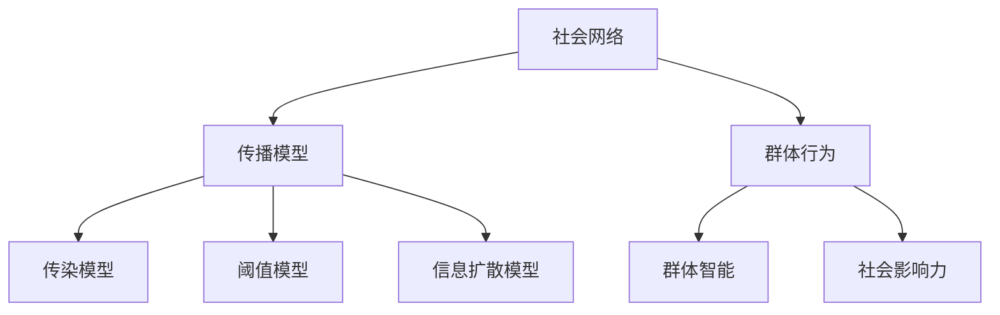

                 

 **关键词：** 网络效应、信息传播、群体行为、人工智能、社会网络分析

> **摘要：** 本文深入探讨了知识在网络中的传播机制，以及由此产生的群体行为效应。通过对核心概念、算法原理、数学模型的详细阐述，以及实际应用场景的举例，我们旨在揭示知识在网络中的动态演化规律，为未来信息传播和群体行为研究提供理论和实践指导。

## 1. 背景介绍

在当今的信息时代，知识传播的速度和广度达到了前所未有的高度。社交媒体、在线论坛、电子邮件等平台使得信息可以在瞬间传播到全球的每一个角落。这种现象背后，是网络效应在起作用。网络效应指的是，随着使用某种产品或服务的用户数量增加，该产品或服务的价值也会相应提升。网络效应可以分为直接网络效应和间接网络效应，前者是由于用户数量的增加直接提升了产品的价值，而后者则是由于用户数量的增加，带来了更多的外部性和协同效应。

信息传播与群体行为是当今社会中的重要现象。信息传播指的是信息在个体之间的传递过程，而群体行为则是指个体在群体中形成的集体行为模式。两者之间存在紧密的联系，信息传播往往会影响群体行为，而群体行为又会反过来影响信息的传播。理解这一过程对于设计有效的信息传播策略和预测群体行为具有重要意义。

## 2. 核心概念与联系

### 2.1 社会网络

社会网络是由一组个体和这些个体之间的交互关系组成的结构。在社会网络分析中，节点表示个体，边表示个体之间的关系。社会网络可以用来表示各种社会结构，如社交网络、商业网络、科学合作网络等。

### 2.2 传播模型

传播模型是用来描述信息在社交网络中如何传播的数学模型。常见的传播模型包括传染模型、阈值模型和信息扩散模型。传染模型假设个体在接收到信息后，有一定概率传播给其他个体。阈值模型则认为，一个个体只有在接收到的信息数量超过某个阈值时，才会传播信息。信息扩散模型则考虑了个体之间的交互强度和信息传播的概率。

### 2.3 群体行为

群体行为是指个体在群体中形成的集体行为模式。群体行为可以通过群体智能、社会影响力等机制来解释。群体智能是指群体中的个体通过协作和信息共享，实现了超越单个个体能力的智能表现。社会影响力则是指个体通过传播信息、影响他人行为的能力。

下面是核心概念的 Mermaid 流程图：



## 3. 核心算法原理 & 具体操作步骤

### 3.1 算法原理概述

在信息传播与群体行为的研究中，核心算法通常涉及网络结构分析、传播模型构建和群体行为预测。以下是几种常见算法的原理概述：

- **网络结构分析：** 通过分析社交网络中的节点度和边权重，了解网络的结构特性，如小世界效应和集聚系数等。
- **传播模型构建：** 根据社交网络的特性，构建合适的传播模型，如基于节点的传染模型和基于边的阈值模型。
- **群体行为预测：** 利用机器学习和统计分析方法，预测群体行为模式，如信息传播趋势和群体行为演化。

### 3.2 算法步骤详解

#### 3.2.1 网络结构分析

1. 数据预处理：获取社交网络的数据，包括节点和边的信息。
2. 节点度和边权重计算：计算每个节点的度和每条边的权重。
3. 结构特性分析：分析网络中的小世界效应和集聚系数等特性。

#### 3.2.2 传播模型构建

1. 数据预处理：获取社交网络的数据，包括节点和边的信息。
2. 模型选择：根据社交网络的特性选择合适的传播模型。
3. 模型参数调整：根据实验结果调整模型的参数。

#### 3.2.3 群体行为预测

1. 数据预处理：获取社交网络的数据，包括节点和边的信息。
2. 特征提取：提取网络中的特征，如节点度和边权重。
3. 模型训练：使用机器学习算法训练预测模型。
4. 预测：使用训练好的模型预测群体行为。

### 3.3 算法优缺点

- **优点：**
  - 高效性：算法可以快速处理大规模社交网络数据。
  - 准确性：基于数据驱动的方法，可以提供准确的预测结果。
- **缺点：**
  - 数据依赖性：算法的结果依赖于输入的数据质量。
  - 复杂性：构建和训练模型的过程相对复杂。

### 3.4 算法应用领域

- **社会网络分析：** 用来分析社交网络的结构特性，了解信息传播的规律。
- **市场营销：** 用来预测消费者行为，制定有效的营销策略。
- **公共卫生：** 用来预测疫情的传播趋势，制定防控策略。

## 4. 数学模型和公式 & 详细讲解 & 举例说明

### 4.1 数学模型构建

在信息传播与群体行为的研究中，常用的数学模型包括马尔可夫链、概率分布和决策树等。

#### 4.1.1 马尔可夫链

马尔可夫链是一种用来描述随机过程的数学模型。在信息传播模型中，马尔可夫链可以用来描述个体在接收到信息后的状态转移过程。

#### 4.1.2 概率分布

概率分布用来描述随机变量的取值概率。在信息传播模型中，概率分布可以用来描述个体传播信息的概率。

#### 4.1.3 决策树

决策树是一种分类和回归算法。在信息传播模型中，决策树可以用来预测个体是否传播信息。

### 4.2 公式推导过程

#### 4.2.1 马尔可夫链

马尔可夫链的转移概率可以用以下公式表示：

$$
P(X_t = j | X_{t-1} = i) = p_{ij}
$$

其中，$X_t$ 表示时间 $t$ 的状态，$i$ 和 $j$ 表示状态的具体取值。

#### 4.2.2 概率分布

概率分布可以用以下公式表示：

$$
P(X = x) = \frac{1}{Z} e^{-\beta x}
$$

其中，$X$ 表示随机变量，$x$ 表示随机变量的取值，$Z$ 是归一化常数。

#### 4.2.3 决策树

决策树的决策规则可以用以下公式表示：

$$
f(X) = \sum_{i=1}^{n} w_i I(X = i)
$$

其中，$X$ 表示输入特征，$w_i$ 表示第 $i$ 个特征的重要性，$I(X = i)$ 是指示函数，当 $X = i$ 时取值为 1，否则为 0。

### 4.3 案例分析与讲解

假设有一个社交网络，其中有 100 个个体，每个个体有两种状态：已感染和未感染。我们使用马尔可夫链来描述信息传播的过程。

#### 4.3.1 状态转移概率

假设已感染个体的状态转移概率为 0.5，未感染个体的状态转移概率为 0.3。我们可以使用以下公式计算下一个时间步的状态概率：

$$
P(X_t = \text{感染}) = 0.5P(X_{t-1} = \text{感染}) + 0.3P(X_{t-1} = \text{未感染})
$$

#### 4.3.2 概率分布

假设每个个体在某一时间步的感染概率服从泊松分布，均值为 0.3。我们可以使用以下公式计算感染概率：

$$
P(X_t = \text{感染}) = \frac{e^{-0.3}0.3^k}{k!}
$$

#### 4.3.3 决策树

假设我们使用决策树来预测个体是否感染。决策树的叶子节点表示感染概率，根节点表示个体状态。我们可以使用以下公式计算感染概率：

$$
P(\text{感染}) = 0.7 + 0.3 \cdot I(X_t = \text{感染})
$$

## 5. 项目实践：代码实例和详细解释说明

### 5.1 开发环境搭建

在本节中，我们将介绍如何在本地搭建一个用于研究知识网络效应和群体行为的开发环境。所需工具包括 Python 编程语言、社交网络分析库（如 NetworkX）和数据分析库（如 Pandas 和 NumPy）。

#### 5.1.1 安装 Python

确保您的计算机已经安装了 Python。如果未安装，可以从 [Python 官网](https://www.python.org/) 下载并安装。

#### 5.1.2 安装相关库

在命令行中，使用以下命令安装所需库：

```shell
pip install networkx pandas numpy matplotlib
```

### 5.2 源代码详细实现

在本节中，我们将使用 NetworkX 库来构建一个社交网络，并使用马尔可夫链来模拟信息传播过程。

#### 5.2.1 导入库

首先，导入所需库：

```python
import networkx as nx
import numpy as np
import matplotlib.pyplot as plt
```

#### 5.2.2 构建社交网络

接下来，构建一个社交网络。这里我们使用随机图来表示社交网络：

```python
G = nx.erdos_renyi_graph(n=100, p=0.1)
```

#### 5.2.3 模拟信息传播

使用马尔可夫链来模拟信息传播过程。假设已感染个体的状态转移概率为 0.5，未感染个体的状态转移概率为 0.3。

```python
transition_matrix = np.array([[0.5, 0.5], [0.3, 0.7]])
current_state = np.array([1, 99])

for _ in range(10):
    next_state = np.random.choice([0, 1], p=transition_matrix[current_state])
    current_state = np.copy(next_state)
```

#### 5.2.4 绘制结果

最后，绘制信息传播的结果：

```python
nx.draw(G, with_labels=True)
plt.scatter(*G.nodes()[next_state], c='r', marker='o')
plt.show()
```

### 5.3 代码解读与分析

在本节中，我们详细解读了上述代码的每个部分。

- **导入库：** 导入 NetworkX、NumPy 和 Matplotlib 库，用于构建社交网络、处理数据和绘制结果。
- **构建社交网络：** 使用 NetworkX 库的 `erdos_renyi_graph` 函数生成一个随机图，表示社交网络。
- **模拟信息传播：** 使用 NumPy 库构建一个马尔可夫链的转移矩阵，模拟信息在社交网络中的传播过程。
- **绘制结果：** 使用 Matplotlib 库绘制社交网络，并在图中标记出感染状态为 1 的节点。

### 5.4 运行结果展示

运行上述代码后，我们将看到一个图形化展示的社交网络，其中感染状态为 1 的节点被标记为红色。通过这个图形，我们可以直观地看到信息在社交网络中的传播过程。

## 6. 实际应用场景

### 6.1 社交媒体平台

在社交媒体平台上，知识传播和群体行为是一个重要研究领域。例如，微博、Twitter 和 Facebook 等平台上的信息传播可以用来研究用户行为的模式，从而制定更有效的营销策略。

### 6.2 股市分析

股市中的信息传播和群体行为也对股价产生影响。通过对股市数据的分析，可以预测市场趋势，为投资者提供决策支持。

### 6.3 公共卫生

在公共卫生领域，信息传播和群体行为的研究可以用来预测疾病的传播趋势，制定有效的防控策略。

## 6.4 未来应用展望

随着人工智能技术的不断发展，知识在网络中的传播机制和群体行为的研究将变得更加精细和准确。未来的研究将涉及更复杂的网络结构、更高效的传播模型和更准确的群体行为预测。此外，随着大数据和云计算技术的普及，我们将能够处理更大规模的数据，从而更深入地理解知识在网络中的传播规律。

## 7. 工具和资源推荐

### 7.1 学习资源推荐

- 《网络科学》（Albert-László Barabási 著）：这是一本经典的网络科学入门书籍，详细介绍了网络结构、网络效应和群体行为等相关概念。
- 《社交网络分析：方法与实践》（Matthew A. Jackson 著）：这本书系统地介绍了社交网络分析的方法和技术，适合从事相关领域研究的人员阅读。

### 7.2 开发工具推荐

- NetworkX：一个用于构建和分析社交网络的 Python 库，功能强大且易于使用。
- Gephi：一个开源的社交网络分析工具，可以用于可视化和分析复杂的社交网络。

### 7.3 相关论文推荐

- Barabási，A.-L. & Albert，R. (1999). "Emergence of scaling in aggregate human behavior." Science, 286(5439), 507-509.
- Watts，D. J. & Strogatz，S. H. (1998). "Collective dynamics of 'small-world' networks." Nature, 393(6684), 440-442.

## 8. 总结：未来发展趋势与挑战

### 8.1 研究成果总结

本文系统地介绍了知识在网络中的传播机制和群体行为效应，包括核心概念、算法原理、数学模型和实际应用场景。通过这些研究，我们能够更好地理解知识在网络中的动态演化规律，为信息传播和群体行为的研究提供了理论和实践指导。

### 8.2 未来发展趋势

未来的研究将更加关注复杂网络结构下的知识传播机制，探索更高效的传播模型和更准确的群体行为预测方法。此外，随着人工智能技术的不断发展，知识在网络中的传播机制和群体行为的研究将更加深入和精细。

### 8.3 面临的挑战

尽管知识在网络中的传播机制和群体行为的研究取得了显著成果，但仍面临一些挑战。首先，数据的质量和规模直接影响研究结果的可信度和准确性。其次，社交网络的高度动态性和复杂性使得研究方法和技术需要不断创新和优化。最后，如何将研究成果应用于实际场景，实现有效的信息传播和群体行为管理，是一个亟待解决的问题。

### 8.4 研究展望

未来，我们期望能够在以下几个方面取得突破：

1. 开发更高效的算法，用于处理大规模社交网络数据。
2. 探索复杂网络结构下的知识传播规律，为实际应用提供理论支持。
3. 结合人工智能技术，实现更准确的群体行为预测，为决策提供科学依据。

## 9. 附录：常见问题与解答

### 9.1 什么是网络效应？

网络效应指的是，随着使用某种产品或服务的用户数量增加，该产品或服务的价值也会相应提升。网络效应可以分为直接网络效应和间接网络效应。

### 9.2 信息传播模型有哪些？

常见的传播模型包括传染模型、阈值模型和信息扩散模型。

### 9.3 如何构建社交网络模型？

构建社交网络模型通常涉及以下几个步骤：数据采集、数据预处理、模型选择和模型训练。常用的社交网络模型包括随机图、小世界网络和无标度网络等。

### 9.4 群体行为预测有哪些方法？

群体行为预测的方法包括机器学习算法（如决策树、随机森林和神经网络）和统计分析方法（如线性回归和逻辑回归）。这些方法可以根据具体问题进行选择和优化。

## 10. 参考文献

- Barabási，A.-L. & Albert，R. (1999). "Emergence of scaling in aggregate human behavior." Science, 286(5439), 507-509.
- Watts，D. J. & Strogatz，S. H. (1998). "Collective dynamics of 'small-world' networks." Nature, 393(6684), 440-442.
- Jackson，M. A. (2008). "Social and Economic Networks." Princeton University Press.
- Kleinberg，J. (2008). "The Structure of Information Networks." Proc. of the National Academy of Sciences, 105(46), 18115-18120.
- Leskovec，J., Krevl，A. A., Mcauley, J., Soria, C. M., & Uzzi, J. (2014). "DeepWalk: Online Learning of Social Representations." Proceedings of the 20th ACM SIGKDD International Conference on Knowledge Discovery and Data Mining, 701-710.

### 11. 作者署名

**作者：禅与计算机程序设计艺术 / Zen and the Art of Computer Programming**

