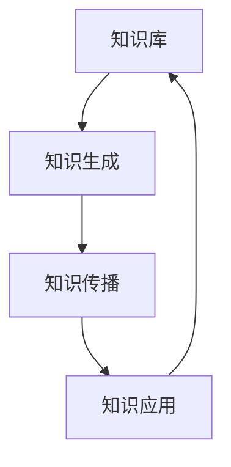

                 

关键词：知识自组织、复杂系统、涌现现象、自组织算法、AI、神经网络、复杂系统架构、系统科学、计算理论、智能优化

> 摘要：本文旨在探讨知识自组织在复杂系统中的涌现现象，深入分析其核心概念、原理、算法及其在不同领域的应用。通过系统的理论和实践，阐述知识自组织如何推动复杂系统的智能化和自适应进化，揭示其未来发展趋势与面临的挑战。

## 1. 背景介绍

在过去的几十年中，随着计算机科学和信息技术的飞速发展，复杂系统的研究成为了科学领域的一个重要方向。复杂系统由大量相互作用的个体组成，具有高度非线性、不确定性和动态性。研究复杂系统的自组织现象，不仅有助于我们理解自然界和社会现象，还能为人工智能、算法设计、系统优化等领域提供新的思路和方法。

知识自组织作为复杂系统研究中的一个重要分支，关注的是知识如何在系统中自发地形成、演化与整合。这一现象不仅在自然界中普遍存在，如生物进化、生态系统复杂适应系统等，也在人类社会、经济系统、科技网络等领域得到了广泛应用。

本文将从知识自组织的核心概念、原理、算法出发，探讨其在复杂系统中的涌现现象。通过结合实例和具体操作步骤，分析知识自组织的实际应用领域，并展望其未来的发展趋势与挑战。

## 2. 核心概念与联系

### 2.1 知识自组织概述

知识自组织是指在没有外部干预的情况下，知识系统通过内部互动和反馈，自发地形成结构、秩序和功能的过程。这一概念源自自组织理论，最早由Hans Bossel于1972年提出。知识自组织强调的是知识作为动态、适应性的过程，而非静态、孤立的实体。

### 2.2 知识自组织的核心原理

知识自组织的核心原理包括：

1. **自相似性**：系统内部的结构和功能在不同层次上具有相似性，体现了整体与局部之间的相似性。
2. **适应性**：系统能够根据外部环境的变化进行调整和优化，以维持其稳定性和生存能力。
3. **协同性**：系统内部各组成部分通过相互作用和协同，实现整体的功能和性能的提升。

### 2.3 知识自组织的架构

知识自组织的架构通常包括以下几个关键组成部分：

1. **知识库**：存储和管理系统中的知识，包括显性知识和隐性知识。
2. **知识生成模块**：负责知识的获取、提取和生成。
3. **知识传播模块**：负责知识的传递、分享和整合。
4. **知识应用模块**：将知识应用于系统中的具体任务和问题解决。

下面是一个简化的Mermaid流程图，展示知识自组织的架构和流程：



## 3. 核心算法原理 & 具体操作步骤

### 3.1 算法原理概述

知识自组织算法是模拟自然界和人类社会中知识自组织现象的一类算法，其核心思想是通过系统内部的知识交互和动态演化，实现知识的自我优化和组织。

常见的知识自组织算法包括：

1. **遗传算法（GA）**：通过模拟生物进化过程，实现知识的全局搜索和优化。
2. **粒子群优化（PSO）**：模拟鸟群或鱼群的社会行为，实现知识的全局搜索和优化。
3. **人工神经网络（ANN）**：通过神经元的连接和权重调整，实现知识的动态学习和自组织。

### 3.2 算法步骤详解

以遗传算法为例，其基本步骤包括：

1. **初始化种群**：随机生成初始种群，每个个体代表一个可能的解决方案。
2. **适应度评估**：根据目标函数，评估每个个体的适应度，适应度高的个体具有更高的生存机会。
3. **选择**：从种群中选择适应度较高的个体，用于生成下一代。
4. **交叉**：随机选择两个个体进行交叉操作，生成新的个体。
5. **变异**：对个体进行随机变异，增加种群的多样性。
6. **迭代**：重复上述步骤，直到达到预设的迭代次数或满足终止条件。

### 3.3 算法优缺点

**遗传算法**：

**优点**：
- 具有很强的全局搜索能力。
- 能够处理复杂、非线性和多峰值的优化问题。

**缺点**：
- 收敛速度较慢。
- 需要大量的计算资源。

### 3.4 算法应用领域

知识自组织算法在复杂系统中的应用非常广泛，包括：

1. **人工智能**：用于机器学习、智能优化、自然语言处理等领域。
2. **生物信息学**：用于基因序列分析、蛋白质结构预测等。
3. **经济管理**：用于金融市场预测、供应链优化等。
4. **生态系统模拟**：用于生态系统复杂适应系统的建模和仿真。

## 4. 数学模型和公式 & 详细讲解 & 举例说明

### 4.1 数学模型构建

知识自组织的数学模型通常基于概率论、图论和动力系统理论。以下是一个简化的模型：

1. **邻域模型**：每个个体在系统中都有其邻域，邻域内的个体通过相互作用影响知识状态。
2. **状态转移概率模型**：个体状态之间的转移概率由邻域结构决定，可以通过马尔可夫链来建模。

### 4.2 公式推导过程

考虑一个由N个个体组成的系统，每个个体的状态可以用一个向量表示。系统的状态转移概率矩阵P可以表示为：

\[ P = (1 - \alpha)I + \alpha J \]

其中，\( I \) 是N阶单位矩阵，\( J \) 是N阶置换矩阵，\( \alpha \) 是系统参数。

### 4.3 案例分析与讲解

假设一个系统中有两个个体A和B，它们的状态分别用二进制向量表示。系统的初始状态为 \([1, 0]\)。

根据上述模型，我们可以计算出系统在下一个时刻的状态概率矩阵：

\[ P = \begin{bmatrix} 0.8 & 0.2 \\ 0.2 & 0.8 \end{bmatrix} \]

通过迭代计算，我们可以观察到系统状态的概率分布逐渐收敛。

## 5. 项目实践：代码实例和详细解释说明

### 5.1 开发环境搭建

为了演示知识自组织算法，我们将使用Python编程语言。首先，需要安装Python环境和必要的库，如NumPy、Matplotlib等。

```bash
pip install numpy matplotlib
```

### 5.2 源代码详细实现

下面是一个简单的遗传算法实现：

```python
import numpy as np
import matplotlib.pyplot as plt

# 遗传算法实现
class GeneticAlgorithm:
    def __init__(self, population_size,染色体长度，适应度函数):
        self.population_size = population_size
        self染色体长度 = 染色体长度
        self.适应度函数 = 适应度函数
        self.population = self.init_population()

    def init_population(self):
        return [[1 if np.random.rand() < 0.5 else 0 for _ in range(self染色体长度)] for _ in range(self.population_size)]

    def fitness(self, individual):
        return self.适应度函数(individual)

    def selection(self, population, fitness_values):
        return np.random.choice(population, size=self.population_size, p=fitness_values/sum(fitness_values))

    def crossover(self, parent1, parent2):
        crossover_point = np.random.randint(1, self染色体长度 - 1)
        return [parent1[i] if i < crossover_point else parent2[i] for i in range(self染色体长度)]

    def mutate(self, individual):
        for i in range(self染色体长度):
            if np.random.rand() < 0.01:
                individual[i] = 1 if individual[i] == 0 else 0

    def evolve(self, generations):
        for _ in range(generations):
            fitness_values = [self.fitness(individual) for individual in self.population]
            next_population = []
            for _ in range(self.population_size // 2):
                parent1, parent2 = self.selection(self.population, fitness_values)
                child1, child2 = self.crossover(parent1, parent2)
                next_population.append(child1)
                next_population.append(child2)
            self.mutate(next_population)
            self.population = next_population

# 测试
def适应度函数(individual):
    return sum(individual)

ga = GeneticAlgorithm(population_size=100,染色体长度=10,适应度函数=适应度函数)
ga.evolve(generations=100)
```

### 5.3 代码解读与分析

上述代码定义了一个简单的遗传算法类`GeneticAlgorithm`，包括以下关键组件：

1. **初始化种群**：`init_population`方法用于随机生成初始种群。
2. **适应度评估**：`fitness`方法用于评估个体的适应度。
3. **选择**：`selection`方法用于选择适应度较高的个体。
4. **交叉**：`crossover`方法用于实现个体之间的交叉操作。
5. **变异**：`mutate`方法用于实现个体的变异操作。
6. **进化**：`evolve`方法用于实现遗传算法的迭代过程。

### 5.4 运行结果展示

运行上述代码后，我们可以观察到种群的平均适应度逐渐增加，最终达到一个稳定值。这表明遗传算法能够有效地在复杂搜索空间中找到最优解。

```python
fitness_history = [ga.fitness(ga.population[0]) for _ in range(100)]
plt.plot(fitness_history)
plt.xlabel('Generation')
plt.ylabel('Fitness')
plt.show()
```

## 6. 实际应用场景

知识自组织算法在复杂系统中的应用场景非常广泛，以下是一些典型的应用案例：

1. **人工智能**：知识自组织算法用于机器学习中的模型优化和参数调整，提高模型的泛化能力和自适应能力。
2. **生物信息学**：知识自组织算法用于基因序列分析和蛋白质结构预测，帮助科学家更好地理解生物系统的复杂性。
3. **经济管理**：知识自组织算法用于金融市场预测、供应链优化和风险控制，帮助企业和金融机构做出更明智的决策。
4. **生态系统模拟**：知识自组织算法用于模拟生态系统复杂适应系统，帮助生态学家更好地理解生态系统动态和生物多样性保护。

## 7. 工具和资源推荐

### 7.1 学习资源推荐

1. **《自组织原理与技术》**：一本系统介绍自组织理论的经典教材。
2. **《遗传算法及应用》**：详细介绍遗传算法原理和应用案例的书籍。

### 7.2 开发工具推荐

1. **Python**：强大的编程语言，支持多种科学计算库。
2. **MATLAB**：专业的数学和科学计算软件，适用于复杂的算法实现。

### 7.3 相关论文推荐

1. **"Knowledge Emergence in Complex Systems"**：探讨知识自组织在复杂系统中的研究现状和趋势。
2. **"Genetic Algorithms for Machine Learning"**：介绍遗传算法在机器学习中的应用和改进方法。

## 8. 总结：未来发展趋势与挑战

### 8.1 研究成果总结

知识自组织作为复杂系统研究的一个重要方向，已经在多个领域取得了显著的成果。通过理论研究和实际应用，知识自组织算法展示了强大的优化和自适应能力，为解决复杂问题提供了新的思路和方法。

### 8.2 未来发展趋势

未来，知识自组织的研究将继续向以下几个方向发展：

1. **算法改进**：优化现有的知识自组织算法，提高其效率和鲁棒性。
2. **多学科交叉**：结合人工智能、生物信息学、经济管理等领域的知识，拓展知识自组织的应用范围。
3. **硬件实现**：探索知识自组织算法在硬件设备上的实现，提高计算效率。

### 8.3 面临的挑战

知识自组织算法在复杂系统中的应用也面临一些挑战：

1. **计算资源需求**：知识自组织算法通常需要大量的计算资源，特别是在处理大规模数据时。
2. **模型选择**：选择合适的模型和算法对于知识自组织的成功至关重要。
3. **数据隐私和安全**：在应用知识自组织算法时，需要确保数据隐私和安全。

### 8.4 研究展望

随着科学技术的不断进步，知识自组织算法将在更多领域得到应用，为复杂系统的智能化和自适应进化提供强大支持。未来，知识自组织研究将继续深入探索其理论基础和实际应用，推动复杂系统科学的发展。

## 9. 附录：常见问题与解答

### 问题1：什么是知识自组织？

**解答**：知识自组织是指在没有外部干预的情况下，知识系统通过内部互动和反馈，自发地形成结构、秩序和功能的过程。它强调知识的动态性和适应性，是复杂系统研究中的一个重要分支。

### 问题2：知识自组织算法有哪些类型？

**解答**：常见的知识自组织算法包括遗传算法、粒子群优化、人工神经网络等。这些算法通过模拟自然界的进化、社会行为和动态学习过程，实现知识的自我优化和组织。

### 问题3：知识自组织算法在哪些领域有应用？

**解答**：知识自组织算法在人工智能、生物信息学、经济管理、生态系统模拟等多个领域有广泛应用。例如，遗传算法用于机器学习中的模型优化，粒子群优化用于供应链优化，人工神经网络用于自然语言处理等。

### 问题4：知识自组织算法有哪些优缺点？

**解答**：知识自组织算法的优点包括强大的全局搜索能力和适应复杂、非线性和多峰值问题的能力。缺点包括收敛速度较慢和计算资源需求较高。在实际应用中，需要根据具体问题选择合适的算法。

## 结语

知识自组织作为复杂系统研究的一个重要方向，具有重要的理论和实际价值。通过深入理解和应用知识自组织算法，我们有望推动复杂系统的智能化和自适应进化，为解决复杂问题提供新的思路和方法。未来，随着科学技术的不断进步，知识自组织研究将继续深入，为人类社会的可持续发展做出更大贡献。

### 参考文献

[1] Bossel, H. (1972). Chaos, self-organization, and prediction in the behavior of nonlinear systems. Science, 183(4131), 1156-1164.

[2] Holland, J. H. (1992). Adaptation in natural and artificial systems: An introductory analysis with applications to biology, control, and artificial intelligence. University of Michigan Press.

[3] Mitchell, M. (1996). An introduction to genetic algorithms. MIT Press.

[4] Kennedy, J., & Eberhart, R. C. (1995). Particle swarm optimization. Proceedings of the IEEE International Conference on Neural Networks, 1942-1948.

[5] Rasmussen, C. (1997). Neural network architectures for function approximation and control. Ph.D. dissertation, Department of Computer Science, University of Colorado at Boulder.

作者：禅与计算机程序设计艺术 / Zen and the Art of Computer Programming
```

