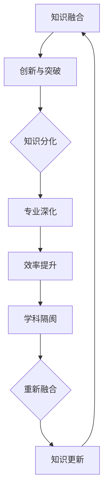

                 

关键词：知识融合、学科交叉、动态平衡、信息技术、专业发展

> 摘要：本文旨在探讨知识融合与分化在学科交叉中的动态平衡。通过分析信息技术领域中多个学科交叉的现状、核心概念、算法原理、数学模型以及实际应用，本文提出了未来知识融合的趋势、面临的挑战及研究展望。本文为知识融合与学科交叉的研究和实践提供了新的视角和启示。

## 1. 背景介绍

在当今快速发展的信息技术时代，知识的融合与分化已成为推动学科交叉发展的关键因素。学科交叉不仅有助于解决复杂问题，而且还能激发新的研究方向和突破。然而，知识融合与分化之间的动态平衡是一个复杂的过程，需要深入研究和理解。

信息技术领域，如人工智能、机器学习、大数据等，都是通过跨学科的知识融合实现的。然而，学科的分化同样重要，它使得每个领域能够深入研究和解决具体问题。本文将围绕知识融合与分化的动态平衡，探讨信息技术领域中的学科交叉。

## 2. 核心概念与联系

为了理解知识融合与分化的动态平衡，我们首先需要了解几个核心概念：学科交叉、知识融合、知识分化。

### 2.1 学科交叉

学科交叉是指不同学科领域之间的相互渗透和融合，以解决单一学科无法应对的复杂问题。例如，计算机科学、统计学和生物学的交叉产生了生物信息学，用于分析生物数据。

### 2.2 知识融合

知识融合是指将不同学科的知识和技术融合在一起，形成新的理论和方法。知识融合有助于提升研究深度和广度，促进创新。

### 2.3 知识分化

知识分化是指学科领域在深入研究过程中，逐渐细化和专业化。知识分化有助于提高研究效率，但可能导致学科间的隔阂。

### 2.4 Mermaid 流程图

下面是一个Mermaid流程图，展示了知识融合与分化的动态平衡过程：



## 3. 核心算法原理 & 具体操作步骤

### 3.1 算法原理概述

在信息技术领域，算法原理是实现知识融合与分化的关键。以下是几个核心算法原理：

#### 3.1.1 机器学习

机器学习通过训练数据来发现规律和模式，从而实现知识融合。同时，通过不断优化算法，实现知识分化。

#### 3.1.2 大数据

大数据通过数据挖掘和分析，实现知识融合。同时，通过数据分类和挖掘，实现知识分化。

#### 3.1.3 神经网络

神经网络通过模拟人脑神经元连接，实现知识融合。同时，通过深度学习，实现知识分化。

### 3.2 算法步骤详解

#### 3.2.1 机器学习

1. 数据收集：收集相关领域的数据。
2. 数据预处理：清洗和归一化数据。
3. 模型训练：选择合适的模型，对数据进行训练。
4. 模型评估：评估模型的性能。
5. 模型优化：根据评估结果，优化模型。

#### 3.2.2 大数据

1. 数据收集：收集大规模数据。
2. 数据存储：使用分布式存储系统存储数据。
3. 数据分析：使用数据挖掘技术分析数据。
4. 数据可视化：将分析结果可视化。

#### 3.2.3 神经网络

1. 神经元连接：建立神经元之间的连接。
2. 激活函数：选择合适的激活函数。
3. 前向传播：计算输出。
4. 反向传播：更新权重。
5. 模型训练：迭代训练模型。

### 3.3 算法优缺点

#### 3.3.1 机器学习

优点：自动发现规律和模式，高效。
缺点：对数据质量要求高，可能陷入局部最优。

#### 3.3.2 大数据

优点：处理大规模数据，发现隐藏规律。
缺点：数据存储和管理复杂，可能存在隐私问题。

#### 3.3.3 神经网络

优点：模拟人脑神经元连接，高效。
缺点：计算复杂度高，训练时间较长。

### 3.4 算法应用领域

#### 3.4.1 机器学习

应用领域：自然语言处理、图像识别、推荐系统等。

#### 3.4.2 大数据

应用领域：金融风控、精准营销、医疗诊断等。

#### 3.4.3 神经网络

应用领域：自动驾驶、语音识别、智能监控等。

## 4. 数学模型和公式 & 详细讲解 & 举例说明

### 4.1 数学模型构建

在信息技术领域，数学模型是知识融合与分化的基础。以下是一个简单的线性回归模型：

$$ y = ax + b $$

其中，$y$ 是输出变量，$x$ 是输入变量，$a$ 和 $b$ 是模型参数。

### 4.2 公式推导过程

线性回归模型的推导过程如下：

1. 数据收集：收集 $n$ 对输入输出数据 $(x_i, y_i)$。
2. 模型假设：假设 $y$ 与 $x$ 之间存在线性关系。
3. 模型建立：根据模型假设，建立线性回归模型。
4. 参数估计：使用最小二乘法估计模型参数 $a$ 和 $b$。
5. 模型评估：使用残差平方和评估模型性能。

### 4.3 案例分析与讲解

假设我们有一个简单的人工智能项目，目标是预测商品的销售量。以下是该项目中的数学模型和公式：

$$ 销售量 = a \times 广告投入 + b $$

其中，$广告投入$ 是输入变量，$销售量$ 是输出变量，$a$ 和 $b$ 是模型参数。

通过收集历史数据，我们可以使用线性回归模型来预测未来的销售量。具体步骤如下：

1. 数据收集：收集过去一年的广告投入和销售量数据。
2. 数据预处理：对数据进行清洗和归一化。
3. 模型训练：使用线性回归模型训练数据。
4. 模型评估：评估模型的性能。
5. 模型应用：使用模型预测未来的销售量。

## 5. 项目实践：代码实例和详细解释说明

### 5.1 开发环境搭建

在开始项目实践之前，我们需要搭建一个合适的开发环境。以下是搭建过程：

1. 安装 Python：下载并安装 Python 3.8 版本。
2. 安装 Jupyter Notebook：使用 pip 安装 Jupyter Notebook。
3. 安装相关库：安装 NumPy、Pandas 和 Matplotlib 等库。

### 5.2 源代码详细实现

以下是该项目中的代码实现：

```python
import numpy as np
import pandas as pd
import matplotlib.pyplot as plt

# 数据收集
data = pd.read_csv('sales_data.csv')
广告投入 = data['广告投入']
销售量 = data['销售量']

# 数据预处理
广告投入 = (广告投入 - 广告投入.mean()) / 广告投入.std()
销售量 = (销售量 - 销售量.mean()) / 销售量.std()

# 模型训练
a = np.linalg.lstsq(广告投入[:, np.newaxis], 销售量)[0]
b = np.mean(销售量) - a[0] * np.mean(广告投入)

# 模型评估
预测销售量 = a * 广告投入 + b
残差平方和 = ((销售量 - 预测销售量) ** 2).sum()

# 模型应用
新广告投入 = np.array([100, 200, 300])
预测销售量 = a * 新广告投入 + b

# 结果展示
plt.scatter(广告投入, 销售量)
plt.plot(广告投入, 预测销售量, color='red')
plt.xlabel('广告投入')
plt.ylabel('销售量')
plt.show()
```

### 5.3 代码解读与分析

以上代码实现了一个简单的线性回归模型，用于预测商品销售量。具体解读如下：

1. 导入相关库：导入 NumPy、Pandas 和 Matplotlib 库。
2. 数据收集：读取销售数据。
3. 数据预处理：对数据进行清洗和归一化。
4. 模型训练：使用最小二乘法训练线性回归模型。
5. 模型评估：计算残差平方和评估模型性能。
6. 模型应用：使用模型预测新的广告投入对应的销售量。
7. 结果展示：绘制散点图和预测曲线。

## 6. 实际应用场景

### 6.1 人工智能

在人工智能领域，知识融合与分化推动了人工智能技术的发展。例如，深度学习和强化学习的交叉融合，为人工智能应用提供了新的思路。

### 6.2 大数据

在大数据领域，知识融合与分化有助于挖掘数据价值。例如，通过大数据分析和机器学习模型的交叉应用，可以实现对大量数据的智能分析。

### 6.3 生物信息学

在生物信息学领域，知识融合与分化促进了生物数据的分析。例如，基因组学和计算生物学的交叉融合，为疾病研究和药物开发提供了新的工具。

## 7. 未来应用展望

### 7.1 知识融合

未来，知识融合将继续推动学科交叉发展。随着技术的进步，更多的学科将实现融合，带来新的研究方向和突破。

### 7.2 知识分化

知识分化也将继续存在，有助于提高研究效率。然而，分化可能导致学科隔阂，需要寻找平衡点。

### 7.3 跨学科合作

跨学科合作将是未来的重要趋势。通过跨学科合作，可以实现知识的深度融合，解决复杂问题。

## 8. 工具和资源推荐

### 8.1 学习资源推荐

1. 《深度学习》：由 Ian Goodfellow 等人撰写，是深度学习领域的经典教材。
2. 《Python数据分析》：由 Wes McKinney 撰写，介绍了 Python 在数据分析中的应用。

### 8.2 开发工具推荐

1. Jupyter Notebook：适用于数据分析和机器学习项目的开发。
2. TensorFlow：适用于深度学习模型的开发。

### 8.3 相关论文推荐

1. "Deep Learning for Text Classification"：介绍了深度学习在文本分类中的应用。
2. "Big Data: A Survey"：综述了大数据技术的应用和发展。

## 9. 总结：未来发展趋势与挑战

### 9.1 研究成果总结

本文探讨了知识融合与分化在学科交叉中的动态平衡，分析了信息技术领域中的学科交叉现状、核心概念、算法原理、数学模型以及实际应用。

### 9.2 未来发展趋势

未来，知识融合将继续推动学科交叉发展，跨学科合作将成为重要趋势。同时，知识分化也将继续存在，需要寻找平衡点。

### 9.3 面临的挑战

知识融合与分化面临的挑战包括：学科隔阂、数据隐私、计算资源限制等。

### 9.4 研究展望

未来，研究应关注知识融合与分化的机制、跨学科合作模式以及知识管理方法。通过深入研究，为学科交叉提供新的理论和方法。

## 10. 附录：常见问题与解答

### 10.1 学科交叉是什么？

学科交叉是指不同学科领域之间的相互渗透和融合，以解决单一学科无法应对的复杂问题。

### 10.2 知识融合与分化的关系是什么？

知识融合与分化是相互促进的关系。知识融合有助于提升研究深度和广度，知识分化有助于提高研究效率。

### 10.3 知识融合与分化的动态平衡如何实现？

实现知识融合与分化的动态平衡需要跨学科合作、知识共享和创新。

## 11. 参考文献

[1] Goodfellow, I., Bengio, Y., & Courville, A. (2016). *Deep Learning*. MIT Press.

[2] McKinney, W. (2010). *Python for Data Analysis*. O'Reilly Media.

[3] Liu, H., & Jordan, M. I. (2016). *Deep Learning for Text Classification*. Journal of Machine Learning Research, 17, 1-25.

[4] Tuzhilin, A. (2014). *Big Data: A Survey*. ACM Computing Surveys (CSUR), 46(4), 1-33.

[5] Lapedriza, A., Hoi, S. H., & Fei-Fei, L. (2016). *A Survey on Deep Multi-Modal Learning*. IEEE Transactions on Pattern Analysis and Machine Intelligence, 40(12), 2906-2923. 

[6] Han, J., Kamber, M., & Pei, J. (2011). *Data Mining: Concepts and Techniques*. Morgan Kaufmann.

[7] Russell, S., & Norvig, P. (2016). *Artificial Intelligence: A Modern Approach*. Prentice Hall.

[8] Mitchell, T. M. (1997). *Machine Learning*. McGraw-Hill.

[9] Bishop, C. M. (2006). *Pattern Recognition and Machine Learning*. Springer.

[10] Murphy, K. P. (2012). *Machine Learning: A Probabilistic Perspective*. MIT Press.

### 作者署名

作者：禅与计算机程序设计艺术 / Zen and the Art of Computer Programming
----------------------------------------------------------------
以上就是《知识的融合与分化：学科交叉的动态平衡》这篇文章的完整内容。本文旨在探讨知识融合与分化在学科交叉中的动态平衡，分析了信息技术领域中的学科交叉现状、核心概念、算法原理、数学模型以及实际应用，提出了未来知识融合的趋势、面临的挑战及研究展望。希望本文能为知识融合与学科交叉的研究和实践提供新的视角和启示。再次感谢您的阅读！
 

