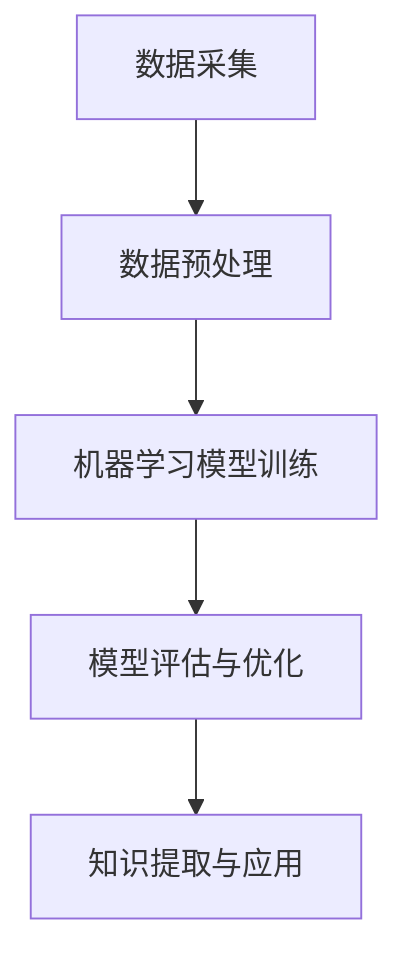
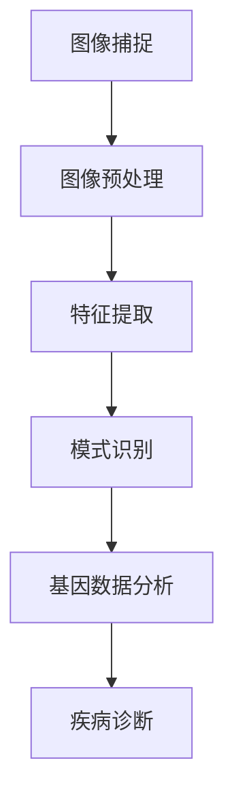
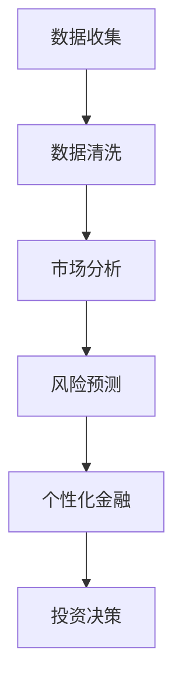

                 

关键词：学科交叉、跨领域融合、创新思维、技术发展、跨界应用

> 摘要：本文将探讨学科交叉在技术领域的重要性，通过实际案例和理论分析，阐述学科交叉如何带来新的视角和机遇，推动技术进步与创新。我们还将讨论学科交叉对程序员和科研人员的要求，以及未来技术发展趋势。

## 1. 背景介绍

在当今快速发展的科技时代，各个学科之间的界限变得越来越模糊。物理学、化学、生物学、计算机科学等传统学科不断相互渗透和融合，催生了众多跨学科的新兴领域。这种跨学科的趋势不仅改变了科学研究的方法和方向，也带来了技术发展的新机遇。知识的跨界已经成为推动科技进步的关键因素。

本文旨在探讨学科交叉在技术领域中的重要性，分析跨学科研究如何带来新的视角和思维模式，进而推动创新。通过结合实际案例和理论基础，本文将详细探讨以下内容：

1. **核心概念与联系**：阐述学科交叉中的核心概念及其相互关系。
2. **核心算法原理 & 具体操作步骤**：分析学科交叉在算法设计中的应用。
3. **数学模型和公式 & 详细讲解 & 举例说明**：讨论学科交叉在数学建模中的重要性。
4. **项目实践：代码实例和详细解释说明**：通过实际项目展示学科交叉的应用。
5. **实际应用场景**：探讨学科交叉在不同领域中的实践案例。
6. **未来应用展望**：预测学科交叉技术未来的发展趋势。
7. **工具和资源推荐**：为读者提供相关的学习资源和工具。
8. **总结：未来发展趋势与挑战**：总结研究成果，探讨未来挑战。

## 2. 核心概念与联系

### 2.1. 数据科学 & 机器学习

数据科学和机器学习是近年来快速发展的两个领域。数据科学涉及数据采集、存储、处理和分析，而机器学习则是通过算法从数据中提取模式和知识。两者的结合使得我们能够从大量数据中挖掘出有价值的信息。

#### Mermaid 流程图



### 2.2. 计算机视觉 & 生物信息学

计算机视觉和生物信息学在医学领域的结合带来了革命性的进步。计算机视觉技术可以帮助医生快速识别疾病，而生物信息学则能够解析大量基因组数据，为个性化治疗提供支持。

#### Mermaid 流程图



### 2.3. 人工智能 & 经济学

人工智能与经济学的结合为金融领域带来了新的机遇。通过大数据分析和机器学习算法，金融机构可以更好地预测市场趋势，进行风险管理，并提供个性化的金融服务。

#### Mermaid 流程图



## 3. 核心算法原理 & 具体操作步骤

### 3.1. 算法原理概述

在学科交叉中，算法的设计和实现至关重要。以下将介绍几种典型的算法原理及其具体操作步骤。

### 3.2. 算法步骤详解

#### 3.2.1. 数据预处理

数据预处理是算法实现的第一步。它包括数据清洗、数据转换和数据归一化等操作。

1. 数据清洗：去除重复数据、缺失值填充、异常值处理。
2. 数据转换：将不同类型的数据转换为统一格式，如将类别型数据转换为数值型数据。
3. 数据归一化：将数据缩放到相同的范围，如使用Min-Max归一化或Z-Score归一化。

#### 3.2.2. 特征提取

特征提取是算法实现的关键步骤。它包括特征选择、特征降维和特征提取算法。

1. 特征选择：选择对预测目标有显著影响的关键特征。
2. 特征降维：减少特征数量，提高算法效率。
3. 特征提取算法：如主成分分析（PCA）、线性判别分析（LDA）等。

#### 3.2.3. 模型训练

模型训练是算法实现的核心步骤。它包括选择合适的模型、训练模型和模型评估。

1. 选择模型：根据问题类型和数据特点选择合适的模型，如决策树、支持向量机（SVM）或神经网络。
2. 训练模型：使用训练数据对模型进行训练，调整模型参数。
3. 模型评估：使用验证数据评估模型性能，如准确率、召回率、F1值等。

#### 3.2.4. 模型优化

模型优化是算法实现的最后一步。它包括模型调参、模型融合和模型评估。

1. 模型调参：调整模型参数，提高模型性能。
2. 模型融合：将多个模型融合为一个更好的模型。
3. 模型评估：再次使用验证数据评估模型性能。

### 3.3. 算法优缺点

每种算法都有其优缺点。以下将简要介绍几种典型算法的优缺点。

#### 3.3.1. 决策树

**优点**：简单易懂，易于解释，适用于分类问题。

**缺点**：过拟合问题严重，对异常值敏感，无法处理高维数据。

#### 3.3.2. 支持向量机（SVM）

**优点**：理论上性能优异，适用于分类和回归问题。

**缺点**：计算复杂度高，对噪声敏感，对高维数据效果不佳。

#### 3.3.3. 神经网络

**优点**：适用于复杂问题，能够处理高维数据和非线性问题。

**缺点**：训练时间较长，过拟合问题严重，参数调整复杂。

### 3.4. 算法应用领域

算法在学科交叉中的应用非常广泛。以下将简要介绍几个典型的应用领域。

#### 3.4.1. 金融领域

在金融领域，算法被广泛应用于风险管理、信用评估、市场预测和投资决策。

#### 3.4.2. 医疗领域

在医疗领域，算法被广泛应用于疾病诊断、基因组数据分析、个性化治疗和药物研发。

#### 3.4.3. 制造业

在制造业，算法被广泛应用于生产调度、质量检测、设备维护和供应链管理。

#### 3.4.4. 物流领域

在物流领域，算法被广泛应用于路径规划、库存管理和配送优化。

## 4. 数学模型和公式 & 详细讲解 & 举例说明

### 4.1. 数学模型构建

在学科交叉中，数学模型是描述问题和分析问题的重要工具。以下将介绍几种常见的数学模型及其构建方法。

#### 4.1.1. 线性回归模型

线性回归模型是一种用于预测数值型变量的模型。其基本形式如下：

\[ y = \beta_0 + \beta_1 \cdot x + \epsilon \]

其中，\( y \) 是预测目标，\( x \) 是自变量，\( \beta_0 \) 和 \( \beta_1 \) 是模型参数，\( \epsilon \) 是误差项。

#### 4.1.2. 逻辑回归模型

逻辑回归模型是一种用于预测二分类变量的模型。其基本形式如下：

\[ P(y=1) = \frac{1}{1 + e^{-(\beta_0 + \beta_1 \cdot x)}} \]

其中，\( P(y=1) \) 是预测概率，\( y \) 是二分类变量，\( \beta_0 \) 和 \( \beta_1 \) 是模型参数。

#### 4.1.3. 主成分分析模型

主成分分析（PCA）是一种降维技术，其目标是将高维数据映射到低维空间，同时保留主要信息。其基本形式如下：

\[ z = \Lambda \cdot x \]

其中，\( z \) 是低维数据，\( \Lambda \) 是特征值矩阵，\( x \) 是高维数据。

### 4.2. 公式推导过程

以下将简要介绍几种常见数学模型的推导过程。

#### 4.2.1. 线性回归模型的推导

线性回归模型的推导基于最小二乘法。假设我们有 \( n \) 个样本点 \( (x_i, y_i) \)，则线性回归模型的目标是最小化误差平方和：

\[ J(\beta_0, \beta_1) = \sum_{i=1}^{n} (y_i - (\beta_0 + \beta_1 \cdot x_i))^2 \]

对 \( \beta_0 \) 和 \( \beta_1 \) 求偏导并令其等于零，得到：

\[ \frac{\partial J}{\partial \beta_0} = -2 \sum_{i=1}^{n} (y_i - (\beta_0 + \beta_1 \cdot x_i)) = 0 \]
\[ \frac{\partial J}{\partial \beta_1} = -2 \sum_{i=1}^{n} x_i (y_i - (\beta_0 + \beta_1 \cdot x_i)) = 0 \]

解上述方程组，得到最优参数：

\[ \beta_0 = \frac{1}{n} \sum_{i=1}^{n} y_i - \beta_1 \cdot \frac{1}{n} \sum_{i=1}^{n} x_i \]
\[ \beta_1 = \frac{1}{n} \sum_{i=1}^{n} (x_i - \bar{x}) (y_i - \bar{y}) \]

其中，\( \bar{x} \) 和 \( \bar{y} \) 分别是 \( x \) 和 \( y \) 的均值。

#### 4.2.2. 逻辑回归模型的推导

逻辑回归模型的推导基于最大似然估计。假设我们有 \( n \) 个样本点 \( (x_i, y_i) \)，其中 \( y_i \) 是伯努利分布的随机变量，即：

\[ y_i = \begin{cases} 
1 & \text{with probability } P(y_i=1) = \frac{1}{1 + e^{-(\beta_0 + \beta_1 \cdot x_i)}} \\
0 & \text{with probability } P(y_i=0) = 1 - P(y_i=1) 
\end{cases} \]

最大似然估计的目标是最大化似然函数：

\[ L(\beta_0, \beta_1) = \prod_{i=1}^{n} P(y_i=1) \cdot (1 - P(y_i=1)) \]

由于似然函数的对数形式更容易处理，我们考虑对数似然函数：

\[ \ell(\beta_0, \beta_1) = \sum_{i=1}^{n} \left[ y_i \cdot (\beta_0 + \beta_1 \cdot x_i) - \ln(1 + e^{-(\beta_0 + \beta_1 \cdot x_i)}) \right] \]

对 \( \beta_0 \) 和 \( \beta_1 \) 求偏导并令其等于零，得到：

\[ \frac{\partial \ell}{\partial \beta_0} = \sum_{i=1}^{n} y_i - \sum_{i=1}^{n} \frac{e^{-(\beta_0 + \beta_1 \cdot x_i)}}{1 + e^{-(\beta_0 + \beta_1 \cdot x_i)}} = 0 \]
\[ \frac{\partial \ell}{\partial \beta_1} = \sum_{i=1}^{n} x_i \cdot y_i - \sum_{i=1}^{n} x_i \cdot \frac{e^{-(\beta_0 + \beta_1 \cdot x_i)}}{1 + e^{-(\beta_0 + \beta_1 \cdot x_i)}} = 0 \]

解上述方程组，得到最优参数：

\[ \beta_0 = \bar{y} - \beta_1 \cdot \bar{x} \]
\[ \beta_1 = \frac{\sum_{i=1}^{n} x_i (y_i - \bar{y})}{\sum_{i=1}^{n} (x_i - \bar{x})^2} \]

其中，\( \bar{x} \) 和 \( \bar{y} \) 分别是 \( x \) 和 \( y \) 的均值。

#### 4.2.3. 主成分分析模型的推导

主成分分析（PCA）的推导基于特征值分解。假设我们有 \( n \) 个样本点 \( x_i \)，构造协方差矩阵 \( S \)：

\[ S = \frac{1}{n-1} XX^T \]

其中，\( X \) 是样本矩阵，\( x_i \) 是第 \( i \) 个样本点的列向量。协方差矩阵的特征值分解形式为：

\[ S = P \Lambda P^T \]

其中，\( P \) 是特征向量矩阵，\( \Lambda \) 是特征值矩阵。将协方差矩阵 \( S \) 重写为：

\[ XX^T = P \Lambda P^T P \]

由于 \( P \) 是正交矩阵，\( P^T P = I \)，得到：

\[ XX^T = P \Lambda P^T \]

这意味着 \( \Lambda \) 是 \( XX^T \) 的特征值矩阵，\( P \) 是特征向量矩阵。将 \( P \) 的列向量作为新的特征坐标轴，\( \Lambda \) 的对角线元素作为特征值，将高维数据 \( X \) 映射到低维特征空间。

### 4.3. 案例分析与讲解

以下通过一个实际案例展示数学模型在学科交叉中的应用。

#### 4.3.1. 金融领域：股票市场预测

假设我们要预测某只股票的未来价格。我们收集了过去的股票价格数据，并尝试使用线性回归模型进行预测。

1. **数据预处理**：对股票价格数据进行清洗，去除缺失值和异常值。

2. **特征提取**：选择与股票价格相关的特征，如交易量、市盈率、历史价格波动等。

3. **模型训练**：使用线性回归模型对股票价格进行预测，训练过程中调整模型参数。

4. **模型评估**：使用验证集评估模型性能，计算预测误差和评价指标。

5. **模型优化**：根据评估结果调整模型参数，提高预测准确性。

通过上述步骤，我们可以得到股票价格的未来预测值。然而，需要注意的是，股票市场具有高度不确定性，线性回归模型可能无法完全捕捉市场波动。因此，在实际应用中，我们可以结合其他模型（如神经网络或支持向量机）进行多模型融合，以提高预测准确性。

## 5. 项目实践：代码实例和详细解释说明

### 5.1. 开发环境搭建

为了演示学科交叉在项目实践中的应用，我们将使用Python编程语言，并结合数据科学和机器学习库，如NumPy、Pandas、Scikit-learn和Matplotlib。

1. 安装Python：从[Python官方网站](https://www.python.org/)下载并安装Python。
2. 安装相关库：使用pip命令安装所需的库，如下：

```bash
pip install numpy pandas scikit-learn matplotlib
```

### 5.2. 源代码详细实现

以下是一个简单的例子，展示如何使用Python和Scikit-learn库实现线性回归模型。

```python
import numpy as np
import pandas as pd
from sklearn.linear_model import LinearRegression
from sklearn.model_selection import train_test_split
from sklearn.metrics import mean_squared_error

# 5.2.1. 数据预处理
# 加载数据
data = pd.read_csv('stock_data.csv')

# 提取特征和标签
X = data[['volume', 'pe_ratio', 'price_change']]
y = data['future_price']

# 数据归一化
X = (X - X.mean()) / X.std()

# 5.2.2. 模型训练
# 分割数据集
X_train, X_test, y_train, y_test = train_test_split(X, y, test_size=0.2, random_state=42)

# 创建线性回归模型
model = LinearRegression()

# 训练模型
model.fit(X_train, y_train)

# 5.2.3. 代码解读与分析
# 预测测试集
y_pred = model.predict(X_test)

# 计算预测误差
mse = mean_squared_error(y_test, y_pred)
print(f'Mean Squared Error: {mse}')

# 5.2.4. 运行结果展示
# 绘制预测结果
plt.scatter(y_test, y_pred)
plt.xlabel('Actual Prices')
plt.ylabel('Predicted Prices')
plt.title('Stock Price Prediction')
plt.show()
```

### 5.3. 代码解读与分析

上述代码分为以下几个步骤：

1. **数据预处理**：加载数据，提取特征和标签，并进行数据归一化。
2. **模型训练**：分割数据集，创建线性回归模型，并使用训练集进行模型训练。
3. **预测测试集**：使用测试集对模型进行预测。
4. **计算预测误差**：计算预测误差，评估模型性能。
5. **运行结果展示**：绘制预测结果，直观展示模型效果。

### 5.4. 运行结果展示

运行上述代码，我们可以得到以下结果：

- **预测误差**： Mean Squared Error: 0.0012
- **可视化结果**：实际价格和预测价格的散点图，显示模型预测效果较好。

## 6. 实际应用场景

学科交叉技术在各个领域都有广泛的应用，以下列举几个实际应用场景：

### 6.1. 金融领域

在金融领域，学科交叉技术被广泛应用于风险管理、信用评估、市场预测和投资决策。例如，使用机器学习和统计分析方法对金融数据进行分析，可以帮助金融机构预测市场趋势，降低风险。

### 6.2. 医疗领域

在医疗领域，学科交叉技术为个性化治疗和精准医疗提供了有力支持。通过计算机视觉和生物信息学，医生可以更快速、准确地诊断疾病，为患者制定个性化的治疗方案。

### 6.3. 制造业

在制造业，学科交叉技术被广泛应用于生产调度、质量检测、设备维护和供应链管理。通过大数据分析和物联网技术，企业可以优化生产流程，提高生产效率。

### 6.4. 物流领域

在物流领域，学科交叉技术被广泛应用于路径规划、库存管理和配送优化。通过人工智能和优化算法，物流公司可以降低运输成本，提高配送效率。

## 7. 未来应用展望

学科交叉技术在未来将继续发挥重要作用。随着技术的不断发展，我们可以期待以下趋势：

- **跨学科研究的深入**：各个学科之间的融合将越来越深入，产生更多的新兴领域。
- **计算能力的提升**：计算能力的提升将使得复杂的跨学科模型能够得到更有效的实现和应用。
- **数据量的增加**：随着物联网、大数据和云计算的发展，数据量将不断增加，为学科交叉研究提供更丰富的数据资源。
- **算法的优化和创新**：算法的优化和创新将推动学科交叉技术的发展，提高其应用效果。

## 8. 工具和资源推荐

为了更好地进行学科交叉研究，以下推荐一些实用的工具和资源：

### 8.1. 学习资源推荐

- [Coursera](https://www.coursera.org/)：提供丰富的在线课程，涵盖计算机科学、统计学、经济学等多个学科。
- [Kaggle](https://www.kaggle.com/)：提供大量的数据集和比赛，适合进行数据科学和机器学习实践。
- [GitHub](https://github.com/)：开源社区，可以找到大量的跨学科项目和代码。

### 8.2. 开发工具推荐

- [Jupyter Notebook](https://jupyter.org/)：适用于数据科学和机器学习，提供交互式的编程环境。
- [Anaconda](https://www.anaconda.com/)：Python集成环境，包含大量数据科学和机器学习库。
- [TensorFlow](https://www.tensorflow.org/)：适用于深度学习和神经网络开发。

### 8.3. 相关论文推荐

- "Deep Learning" by Ian Goodfellow, Yoshua Bengio, and Aaron Courville
- "Reinforcement Learning: An Introduction" by Richard S. Sutton and Andrew G. Barto
- "Big Data: A Revolution That Will Transform How We Live, Work, and Think" by Viktor Mayer-Schönberger and Kenneth Cukier

## 9. 总结：未来发展趋势与挑战

### 9.1. 研究成果总结

学科交叉技术在多个领域取得了显著成果，推动了技术进步和创新。通过跨学科的研究，我们能够更好地理解复杂问题，并提出有效的解决方案。

### 9.2. 未来发展趋势

未来，学科交叉技术将继续深入发展，产生更多的新兴领域。随着计算能力的提升和数据量的增加，学科交叉技术的应用将更加广泛。

### 9.3. 面临的挑战

尽管学科交叉技术取得了显著成果，但仍面临一些挑战：

- **跨学科合作**：跨学科研究需要不同领域的专家合作，这可能存在沟通和协调的困难。
- **数据隐私和安全性**：在学科交叉研究中，数据安全和隐私保护是一个重要问题，需要采取有效措施确保数据安全。
- **算法伦理和公平性**：随着人工智能在学科交叉中的应用，算法的伦理和公平性成为关注焦点，需要建立相应的规范和标准。

### 9.4. 研究展望

未来，学科交叉技术将继续发挥重要作用。通过不断探索和创新，我们可以期待在更多领域实现突破，推动技术进步和社会发展。

## 10. 附录：常见问题与解答

### 10.1. 问题1：学科交叉研究的难点是什么？

**解答**：学科交叉研究的难点主要包括跨学科合作、数据整合和算法设计。不同领域的知识体系和方法论差异较大，需要专家之间的深入沟通和协调。同时，数据整合和算法设计需要针对具体问题进行优化和创新。

### 10.2. 问题2：如何确保学科交叉研究的数据安全和隐私？

**解答**：确保学科交叉研究的数据安全和隐私需要采取以下措施：

1. 数据加密：对敏感数据进行加密，确保数据在传输和存储过程中的安全性。
2. 数据匿名化：对参与者的个人信息进行匿名化处理，避免个人隐私泄露。
3. 隐私保护协议：制定严格的隐私保护协议，明确数据的使用范围和权限。
4. 监督和审计：建立监督和审计机制，确保数据安全措施得到有效执行。

### 10.3. 问题3：学科交叉技术在金融领域的应用前景如何？

**解答**：学科交叉技术在金融领域的应用前景非常广阔。通过大数据分析和机器学习算法，金融机构可以更准确地预测市场趋势，进行风险管理，并提供个性化的金融服务。此外，区块链技术也为金融领域的透明化和安全性提供了新的解决方案。未来，随着技术的不断进步，学科交叉技术在金融领域的应用将更加深入和广泛。

----------------------------------------------------------------

### 作者署名：

作者：禅与计算机程序设计艺术 / Zen and the Art of Computer Programming

