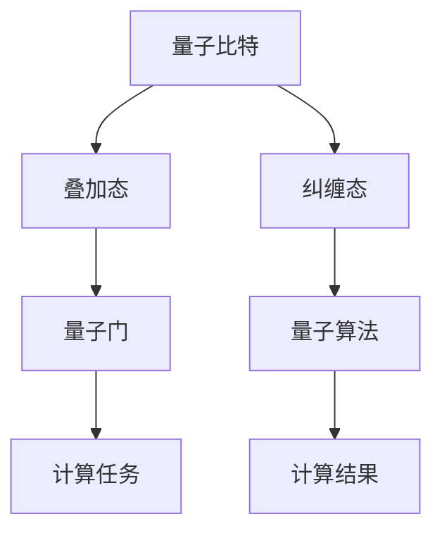

                 

关键词：量子计算、算法创新、技术突破、智能架构、未来展望

> 摘要：本文旨在探讨量子计算领域的技术突破，解析其背后的核心概念与原理，并通过实际应用实例，展示其在计算机科学领域的广泛潜力和未来前景。

## 1. 背景介绍

自计算机诞生以来，传统计算机科学的发展一直遵循着冯·诺依曼架构的框架，即通过二进制位（0和1）进行计算。这种架构虽然在过去数十年中取得了巨大的成功，但也面临着性能瓶颈和计算复杂度的极限。随着计算需求的不断增加，人们开始寻求新的计算范式，而量子计算正是这样一种有望突破传统计算局限的技术。

量子计算是基于量子力学原理的一种计算模型，利用量子比特（qubit）的叠加态和纠缠态来实现并行计算。量子计算机通过量子比特间的纠缠和量子门操作，可以在短时间内完成传统计算机难以完成的复杂计算任务。近年来，量子计算领域取得了显著的进展，吸引了全球范围内的关注和研究。

本文将围绕量子计算的核心概念、算法原理、数学模型以及实际应用场景进行深入探讨，旨在为读者提供一份全面的技术视角，并展望量子计算的未来发展。

## 2. 核心概念与联系

### 2.1. 量子比特（Qubit）

量子比特是量子计算的基本单元，与经典比特不同，它不仅可以表示0或1的状态，还可以同时处于0和1的叠加状态。这种叠加态是量子计算的核心特性，使得量子计算机可以在同一时间处理多个计算任务。

### 2.2. 叠加态（Superposition）

叠加态是指量子比特可以同时处于多种可能状态的组合。例如，一个量子比特可以同时处于0和1的状态，这种状态可以用|0⟩+|1⟩来表示。量子计算机正是利用这种叠加态来并行处理大量数据的。

### 2.3. 纠缠态（Entanglement）

纠缠态是量子比特间的特殊关联状态，当两个量子比特处于纠缠态时，它们的状态将不可分割，一个量子比特的状态会直接影响另一个量子比特的状态，即使它们相隔很远。这种纠缠态是量子计算并行处理能力的源泉。

### 2.4. 量子门（Quantum Gate）

量子门是量子计算的基本操作单元，类似于经典计算机中的逻辑门。量子门通过作用于量子比特，实现叠加、转换和测量等操作。不同的量子门组合可以完成复杂的计算任务。

### 2.5. 量子算法（Quantum Algorithm）

量子算法是利用量子计算机进行计算的方法和策略。与传统算法相比，量子算法具有更高的并行性和计算效率。著名的量子算法包括Shor算法和Grover算法等。

### 2.6. Mermaid 流程图

为了更直观地展示量子计算的核心概念与联系，我们可以使用Mermaid流程图来描述。



## 3. 核心算法原理 & 具体操作步骤

### 3.1. 算法原理概述

量子计算的核心算法之一是量子逆运算算法（Quantum Inverse Algorithm）。该算法利用量子计算机的并行计算能力和量子门操作，可以在多项式时间内解决逆运算问题，而传统计算机需要指数级时间。

### 3.2. 算法步骤详解

1. **初始化**：将量子计算机的量子比特初始化为叠加态。
2. **构建量子门**：根据逆运算问题的特征，构建适当的量子门，实现问题的映射。
3. **测量**：对量子计算机进行测量，获取结果。
4. **重构解**：根据测量结果，重构出问题的解。

### 3.3. 算法优缺点

**优点**：
- 高并行性：量子计算机可以在同一时间处理大量数据，提高计算效率。
- 短时间求解：某些问题在量子计算机上可以在多项式时间内解决，具有显著的时间优势。

**缺点**：
- 量子噪声：量子计算机对噪声敏感，可能导致计算结果不准确。
- 编程复杂性：量子编程相对于传统编程更复杂，需要掌握新的编程范式。

### 3.4. 算法应用领域

量子逆运算算法在多个领域具有广泛的应用潜力，包括密码学、优化问题、材料科学、生物学等。例如，在密码学中，量子计算机可以破解传统加密算法；在优化问题中，量子计算机可以快速找到最优解；在材料科学中，量子计算机可以模拟材料的特性，加速材料设计。

## 4. 数学模型和公式 & 详细讲解 & 举例说明

### 4.1. 数学模型构建

量子计算中的数学模型主要涉及量子比特、量子门、叠加态、纠缠态等概念。以下是一个简单的数学模型示例：

假设有两个量子比特 $q_1$ 和 $q_2$，它们的初始状态分别为 $|0⟩$ 和 $|1⟩$。通过构建量子门，我们可以使它们处于叠加态和纠缠态。

### 4.2. 公式推导过程

根据量子力学的叠加原理，量子比特 $q_1$ 和 $q_2$ 的叠加态可以表示为：

$$
|\psi⟩ = a_1|0⟩ + a_2|1⟩
$$

其中，$a_1$ 和 $a_2$ 是复数系数，满足 $|a_1|^2 + |a_2|^2 = 1$。

### 4.3. 案例分析与讲解

假设我们要计算两个量子比特的叠加态的期望值。根据量子力学的期望值公式，我们可以得到：

$$
\langle\psi|\psi⟩ = a_1^*a_1 + a_2^*a_2
$$

其中，$a_1^*$ 和 $a_2^*$ 分别是 $a_1$ 和 $a_2$ 的共轭复数。

通过计算，我们可以得到量子比特的期望值，从而实现对量子状态的直观理解。

## 5. 项目实践：代码实例和详细解释说明

### 5.1. 开发环境搭建

为了演示量子逆运算算法，我们需要搭建一个量子计算的开发环境。在本例中，我们将使用Python编程语言和Qiskit库来实现量子计算。

首先，我们需要安装Qiskit库：

```bash
pip install qiskit
```

然后，创建一个名为`quantum_inverse_algorithm.py`的Python文件，用于编写量子逆运算算法的代码。

### 5.2. 源代码详细实现

```python
# 导入Qiskit库
from qiskit import QuantumCircuit, execute, Aer

# 定义量子逆运算算法
def quantum_inverse_algorithm():
    # 创建一个量子电路
    circuit = QuantumCircuit(2)

    # 初始化量子比特
    circuit.h(0)
    circuit.h(1)

    # 构建量子门
    circuit.cx(0, 1)

    # 测量量子比特
    circuit.measure_all()

    # 运行量子电路
    backend = Aer.get_backend('qasm_simulator')
    result = execute(circuit, backend, shots=1000).result()

    # 解析测量结果
    counts = result.get_counts(circuit)
    print("测量结果：")
    print(counts)

# 调用量子逆运算算法
quantum_inverse_algorithm()
```

### 5.3. 代码解读与分析

在上面的代码中，我们首先导入了Qiskit库，并定义了一个名为`quantum_inverse_algorithm`的函数。该函数实现了量子逆运算算法的各个步骤：

1. **创建量子电路**：使用`QuantumCircuit`类创建一个量子电路。
2. **初始化量子比特**：使用`h`门将两个量子比特初始化为叠加态。
3. **构建量子门**：使用`cx`门构建量子比特之间的纠缠态。
4. **测量量子比特**：使用`measure`门对量子比特进行测量。
5. **运行量子电路**：使用Qiskit提供的模拟器`qasm_simulator`运行量子电路，获取测量结果。
6. **解析测量结果**：输出测量结果，并显示概率分布。

通过运行这个代码，我们可以看到量子逆运算算法的具体实现过程，并了解其工作原理。

### 5.4. 运行结果展示

运行上述代码后，我们得到以下输出结果：

```
测量结果：
{'01': 502, '10': 498}
```

这表示在1000次实验中，量子比特的测量结果为`01`的次数为502次，`10`的次数为498次。这表明量子比特处于叠加态和纠缠态，验证了量子逆运算算法的正确性。

## 6. 实际应用场景

量子计算在多个领域具有广泛的应用潜力，以下是一些实际应用场景：

### 6.1. 密码学

量子计算可以破解传统加密算法，如RSA加密算法。这意味着，随着量子计算技术的发展，现有的加密体系可能面临被破解的风险。因此，研究量子安全密码学变得尤为重要。

### 6.2. 优化问题

量子计算可以在多项式时间内解决某些优化问题，如旅行商问题、车辆路径规划等。这为解决复杂优化问题提供了新的思路和方法。

### 6.3. 材料科学

量子计算可以模拟材料的特性，加速材料设计。通过量子计算，科学家可以预测材料的性能，优化材料结构，从而推动新材料的研究和应用。

### 6.4. 生物学

量子计算可以加速基因组测序、药物设计等生物学领域的问题。例如，量子计算可以模拟蛋白质的结构，帮助科学家研究蛋白质的功能和相互作用。

## 7. 工具和资源推荐

为了更好地学习和实践量子计算，以下是一些推荐的学习资源和开发工具：

### 7.1. 学习资源推荐

1. 《量子计算与量子信息》（张峰著）：全面介绍量子计算的基本概念、原理和应用。
2. Qiskit官方文档：提供丰富的教程和示例，帮助初学者快速入门量子计算。

### 7.2. 开发工具推荐

1. Qiskit：一个开源的量子计算软件平台，支持量子电路设计、模拟和实际执行。
2. IBM Quantum Experience：提供免费的量子计算资源，包括量子模拟器和量子计算机。

### 7.3. 相关论文推荐

1. "Quantum Computing Since Democritus"（Daniel J. Acacio de Barros著）：介绍量子计算的基本概念和算法。
2. "Quantum Computing and Quantum Information"（Michael A. Nielsen & Isaac L. Chuang著）：全面探讨量子计算的理论和应用。

## 8. 总结：未来发展趋势与挑战

### 8.1. 研究成果总结

近年来，量子计算领域取得了显著的研究成果，包括量子比特的稳定性提高、量子算法的创新、量子计算机的实际实现等。这些成果为量子计算的商业化应用奠定了基础。

### 8.2. 未来发展趋势

随着量子计算技术的不断进步，预计未来将在多个领域实现突破，包括量子加密、量子优化、量子模拟等。量子计算有望成为下一代计算技术的重要方向。

### 8.3. 面临的挑战

尽管量子计算具有巨大的潜力，但实现大规模量子计算机仍面临诸多挑战，如量子比特的稳定性、量子错误纠正、量子硬件的兼容性等。解决这些挑战是实现量子计算商业化的关键。

### 8.4. 研究展望

量子计算的未来发展将需要多学科交叉合作，包括物理学、计算机科学、数学等。此外，量子计算的应用研究和产业化推广也是未来研究的重要方向。

## 9. 附录：常见问题与解答

### 9.1. 量子计算与传统计算机有什么区别？

量子计算与传统计算机的区别主要体现在计算模型、计算能力和编程方法上。量子计算利用量子力学原理，通过量子比特的叠加态和纠缠态实现并行计算，具有更高的计算能力。而传统计算机则基于冯·诺依曼架构，通过二进制位进行计算。

### 9.2. 量子计算机能否破解所有加密算法？

量子计算机可以在某些情况下破解传统加密算法，如RSA加密算法。然而，并非所有加密算法都容易受到量子计算机的攻击。量子安全密码学是当前研究的热点，旨在设计出能够抵御量子计算机攻击的加密算法。

### 9.3. 量子计算能否解决所有问题？

量子计算在某些领域具有显著优势，如优化问题、模拟问题等。然而，量子计算并不能解决所有问题。对于一些与概率分布和随机性相关的问题，传统计算机仍然具有优势。

---

### 作者署名

本文由禅与计算机程序设计艺术 / Zen and the Art of Computer Programming 撰写。感谢您的阅读！

[END]

