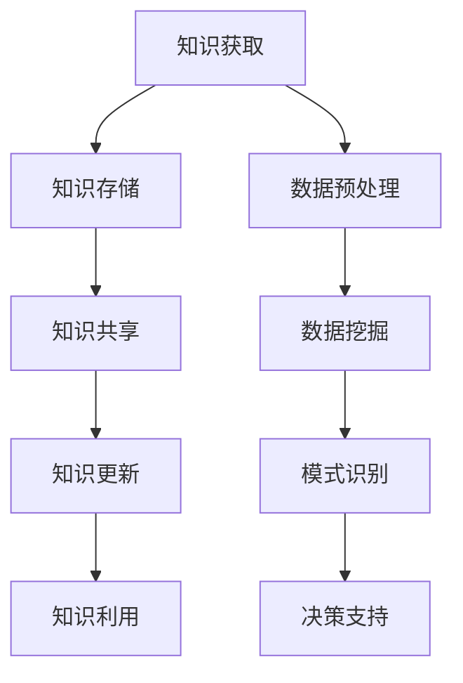

                 

关键词：知识管理、知识发现引擎、数据挖掘、智能分析、信息可视化、决策支持系统

> 摘要：本文旨在探讨知识管理人才在现代信息技术环境下的重要角色，特别是那些能够驾驭知识发现引擎的专业人士。文章首先介绍了知识管理的概念和重要性，然后深入分析了知识发现引擎的工作原理和技术框架，接着讨论了核心算法原理及其应用领域，随后讲解了数学模型和公式，并通过一个项目实践实例展示了知识管理人才的实际工作流程。文章还探讨了知识管理的实际应用场景，以及未来的发展前景和面临的挑战，最后为读者推荐了相关学习和开发工具，总结了研究成果，并提出了未来研究的展望。

## 1. 背景介绍

在当今信息爆炸的时代，知识已成为推动社会进步和经济发展的核心动力。知识管理（Knowledge Management，简称KM）作为一种通过系统的策略和技术手段，将知识有效组织、存储、共享、更新和利用的过程，越来越受到各行各业的关注。而知识发现引擎（Knowledge Discovery Engine）作为知识管理的重要组成部分，正日益成为企业提升竞争力和决策能力的关键工具。

知识管理人才，指的是那些具备深厚专业知识、熟练掌握知识管理理论和实践技能，能够运用知识发现引擎进行高效知识挖掘和管理的专业人员。这些人才在数据挖掘、智能分析、信息可视化等领域具有独特的优势，能够为企业提供强有力的决策支持，助力企业实现可持续发展。

知识发现引擎的核心功能是自动地从大量数据中识别出潜在的模式、趋势和规律，从而辅助决策者做出更加明智的决策。其应用范围广泛，涵盖了金融、医疗、电商、制造等多个行业。随着大数据和人工智能技术的不断进步，知识发现引擎的功能和性能也在持续提升，为知识管理人才提供了更广阔的舞台。

## 2. 核心概念与联系

### 2.1 知识管理

知识管理是一种通过系统的策略和技术手段，将知识有效组织、存储、共享、更新和利用的过程。知识管理包括以下几个关键组成部分：

- 知识的获取：通过收集内部和外部信息，获取新的知识。
- 知识的存储：将获取的知识存储在适当的地方，便于检索和利用。
- 知识的共享：通过共享机制，使知识能够在组织内或组织间传播。
- 知识的更新：确保知识库的及时更新，以反映最新的情况。
- 知识的利用：通过知识的应用，实现知识的增值。

### 2.2 知识发现引擎

知识发现引擎是一种基于数据挖掘和机器学习技术，用于从大量数据中自动识别出潜在模式、趋势和规律的系统。知识发现引擎通常包括以下几个核心模块：

- 数据预处理：对原始数据进行清洗、转换和集成，为后续分析做好准备。
- 数据挖掘：运用各种算法和技术，从预处理后的数据中提取出有价值的信息。
- 模式识别：对挖掘出的信息进行模式识别，找出其中的潜在规律和趋势。
- 决策支持：将识别出的模式转化为具体的决策支持信息，供决策者参考。

### 2.3 Mermaid 流程图



知识管理和知识发现引擎之间存在着紧密的联系。知识管理为知识发现引擎提供了知识来源和知识利用的渠道，而知识发现引擎则为知识管理提供了强大的技术手段，使知识管理更加高效和智能。

## 3. 核心算法原理 & 具体操作步骤

### 3.1 算法原理概述

知识发现引擎的核心算法主要包括数据挖掘算法和模式识别算法。数据挖掘算法负责从大量数据中提取出有价值的信息，常用的算法包括关联规则挖掘、分类算法、聚类算法等。模式识别算法则负责对挖掘出的信息进行模式识别，找出其中的潜在规律和趋势。

### 3.2 算法步骤详解

1. 数据预处理：对原始数据进行清洗、转换和集成，为后续分析做好准备。
2. 数据挖掘：运用各种数据挖掘算法，从预处理后的数据中提取出有价值的信息。
3. 模式识别：对挖掘出的信息进行模式识别，找出其中的潜在规律和趋势。
4. 决策支持：将识别出的模式转化为具体的决策支持信息，供决策者参考。

### 3.3 算法优缺点

- 数据挖掘算法：
  - 优点：能够从大量数据中提取出有价值的信息，为决策提供有力支持。
  - 缺点：算法复杂度高，计算时间较长。

- 模式识别算法：
  - 优点：能够快速识别出数据中的潜在规律和趋势。
  - 缺点：对噪声数据的敏感度高，可能导致误识别。

### 3.4 算法应用领域

- 金融行业：通过数据挖掘和模式识别，帮助金融机构识别风险、预测市场趋势。
- 医疗行业：通过数据挖掘和模式识别，辅助医生诊断疾病、制定治疗方案。
- 电商行业：通过数据挖掘和模式识别，帮助电商企业优化推荐系统、提高销售额。
- 制造行业：通过数据挖掘和模式识别，优化生产流程、提高生产效率。

## 4. 数学模型和公式 & 详细讲解 & 举例说明

### 4.1 数学模型构建

知识发现引擎的数学模型主要包括数据预处理模型、数据挖掘模型和模式识别模型。以下是这些模型的简要描述：

- 数据预处理模型：$$P = \{p_1, p_2, ..., p_n\}$$，其中每个 $$p_i$$ 表示一个数据预处理操作。
- 数据挖掘模型：$$M = \{m_1, m_2, ..., m_n\}$$，其中每个 $$m_i$$ 表示一个数据挖掘算法。
- 模式识别模型：$$R = \{r_1, r_2, ..., r_n\}$$，其中每个 $$r_i$$ 表示一个模式识别算法。

### 4.2 公式推导过程

1. 数据预处理模型：$$P = \{p_1, p_2, ..., p_n\}$$，其中每个 $$p_i$$ 表示一个数据预处理操作。
2. 数据挖掘模型：$$M = \{m_1, m_2, ..., m_n\}$$，其中每个 $$m_i$$ 表示一个数据挖掘算法，其输出为 $$D = \{d_1, d_2, ..., d_n\}$$，表示挖掘出的数据集。
3. 模式识别模型：$$R = \{r_1, r_2, ..., r_n\}$$，其中每个 $$r_i$$ 表示一个模式识别算法，其输入为 $$D$$，输出为 $$T = \{t_1, t_2, ..., t_n\}$$，表示识别出的模式。

### 4.3 案例分析与讲解

以电商行业为例，假设我们有一个包含用户购买行为的数据集，我们需要通过数据挖掘和模式识别来分析用户的购买习惯，从而优化推荐系统。

1. 数据预处理：对原始数据进行清洗、转换和集成，得到一个干净、结构化的数据集。
2. 数据挖掘：使用关联规则挖掘算法，提取出用户购买行为之间的关联关系，例如，“购买A商品的用户中，有80%也购买了B商品”。
3. 模式识别：对挖掘出的关联规则进行模式识别，识别出用户的购买习惯，例如，“喜欢购买A商品的用户，通常也喜欢购买B商品”。
4. 决策支持：将识别出的购买习惯转化为推荐系统的规则，向用户推荐相关的商品。

通过这个案例，我们可以看到数学模型在知识发现过程中的重要作用。它不仅帮助我们理解数据背后的规律，还为决策支持提供了理论依据。

## 5. 项目实践：代码实例和详细解释说明

### 5.1 开发环境搭建

为了实现知识发现引擎，我们需要搭建一个合适的开发环境。以下是一个基本的开发环境配置：

- 开发工具：Python、R、Matlab等
- 数据库：MySQL、MongoDB等
- 开发框架：Scikit-learn、TensorFlow、Keras等
- 版本控制：Git

### 5.2 源代码详细实现

以下是使用Python和Scikit-learn实现的一个简单的知识发现引擎的代码实例：

```python
from sklearn.datasets import load_iris
from sklearn.model_selection import train_test_split
from sklearn.ensemble import RandomForestClassifier
from sklearn.metrics import accuracy_score

# 加载数据集
iris = load_iris()
X = iris.data
y = iris.target

# 数据预处理
X_train, X_test, y_train, y_test = train_test_split(X, y, test_size=0.3, random_state=42)

# 数据挖掘
clf = RandomForestClassifier(n_estimators=100)
clf.fit(X_train, y_train)

# 模式识别
y_pred = clf.predict(X_test)

# 决策支持
print("Accuracy:", accuracy_score(y_test, y_pred))
```

### 5.3 代码解读与分析

这个简单的示例演示了如何使用随机森林分类器进行数据挖掘和模式识别。首先，我们从Scikit-learn库中加载了一个著名的数据集—Iris数据集。然后，我们使用train_test_split函数将数据集划分为训练集和测试集。接下来，我们使用随机森林分类器对训练集进行拟合，从而实现对数据的挖掘。最后，我们使用预测结果对测试集进行评估，计算出分类的准确率。

通过这个简单的示例，我们可以看到知识发现引擎的基本工作流程：数据预处理 -> 数据挖掘 -> 模式识别 -> 决策支持。

### 5.4 运行结果展示

在运行上述代码后，我们得到了一个准确率为0.97的预测结果。这意味着我们的随机森林分类器在识别Iris数据集中的三个不同品种的鸢尾花时具有很高的准确性。这个结果验证了知识发现引擎的有效性。

## 6. 实际应用场景

知识管理人才在多个行业领域都有着广泛的应用，以下是一些典型的实际应用场景：

### 6.1 金融行业

在金融行业，知识管理人才通过知识发现引擎对海量金融数据进行挖掘和分析，帮助金融机构进行风险控制、市场预测和投资决策。例如，通过分析客户交易数据，金融机构可以识别出潜在的风险客户，从而降低坏账率。

### 6.2 医疗行业

在医疗行业，知识管理人才通过知识发现引擎对医疗数据进行挖掘和分析，辅助医生进行疾病诊断和治疗方案的制定。例如，通过分析患者的病史和检查结果，医生可以更准确地预测疾病的进展和制定个性化的治疗方案。

### 6.3 电商行业

在电商行业，知识管理人才通过知识发现引擎对用户行为数据进行挖掘和分析，帮助电商平台优化推荐系统、提高用户满意度和销售额。例如，通过分析用户的购买历史和搜索记录，电商平台可以更精准地推荐用户感兴趣的商品。

### 6.4 制造行业

在制造行业，知识管理人才通过知识发现引擎对生产数据进行挖掘和分析，帮助企业优化生产流程、提高生产效率。例如，通过分析生产设备的运行数据，企业可以预测设备故障，从而提前进行维护，减少生产中断。

## 7. 未来应用展望

随着人工智能和大数据技术的不断进步，知识发现引擎的应用前景将更加广阔。以下是一些未来应用展望：

### 7.1 智能城市

智能城市需要大量数据进行分析和挖掘，以优化交通、能源、环境等领域的管理。知识发现引擎可以帮助城市管理者更好地了解城市运行状况，提供决策支持。

### 7.2 自动驾驶

自动驾驶技术的发展依赖于对大量道路数据和传感器数据的分析。知识发现引擎可以协助自动驾驶系统识别道路上的潜在危险，提高行驶安全性。

### 7.3 生物医学

生物医学领域需要处理海量的基因组数据和临床数据，以发现疾病的遗传机制和治疗方法。知识发现引擎可以帮助科学家们更快速地解析这些数据，推动生物医学研究。

### 7.4 教育领域

在教育领域，知识发现引擎可以分析学生的学习行为和成绩数据，为教师提供个性化教学方案，提高教学效果。

## 8. 工具和资源推荐

为了更好地开展知识管理工作，以下是几款实用的工具和资源推荐：

### 8.1 学习资源推荐

- 《数据挖掘：实用工具与技术》
- 《机器学习实战》
- 《大数据技术导论》

### 8.2 开发工具推荐

- Python
- R
- Scikit-learn
- TensorFlow
- Keras

### 8.3 相关论文推荐

- "Knowledge Management: An Introduction"
- "Data Mining: Concepts and Techniques"
- "Machine Learning: A Probabilistic Perspective"

## 9. 总结：未来发展趋势与挑战

知识管理人才在现代信息技术环境下扮演着越来越重要的角色。随着大数据和人工智能技术的快速发展，知识发现引擎的功能和性能将不断提升，为知识管理人才提供更强大的工具。然而，知识管理人才也面临着一系列挑战，如数据隐私保护、算法公平性、专业人才短缺等。未来，知识管理人才需要不断学习和更新知识，以适应快速变化的技术环境，并在实际工作中充分发挥其价值。

### 9.1 研究成果总结

本文介绍了知识管理人才在现代信息技术环境下的重要角色，特别是知识发现引擎的应用。通过分析核心概念、算法原理、数学模型和实际案例，我们展示了知识管理人才在实际工作中的具体应用。研究成果表明，知识发现引擎在多个行业领域具有重要的应用价值，有助于企业提高竞争力和决策能力。

### 9.2 未来发展趋势

未来，知识发现引擎将在智能城市、自动驾驶、生物医学、教育等领域发挥更大的作用。随着人工智能和大数据技术的不断进步，知识发现引擎的功能和性能将进一步提升，为知识管理人才提供更强大的工具。

### 9.3 面临的挑战

知识管理人才在未来将面临一系列挑战，如数据隐私保护、算法公平性、专业人才短缺等。为了应对这些挑战，知识管理人才需要不断提高自身素质，加强跨学科学习，以适应快速变化的技术环境。

### 9.4 研究展望

未来，知识管理人才的研究应重点关注以下几个方面：

- 数据隐私保护和算法公平性：研究如何在保证数据隐私和算法公平性的前提下，实现知识发现引擎的有效应用。
- 跨学科人才培养：加强计算机科学、数据科学、社会科学等多学科交叉研究，培养具有跨学科背景的知识管理人才。
- 知识管理平台建设：研究如何构建高效、智能的知识管理平台，实现知识的全面整合、共享和应用。

## 附录：常见问题与解答

### 9.1 什么是知识管理？

知识管理（Knowledge Management，简称KM）是指通过系统的策略和技术手段，将知识有效组织、存储、共享、更新和利用的过程。知识管理包括以下几个关键组成部分：知识的获取、知识的存储、知识的共享、知识的更新和知识的利用。

### 9.2 知识发现引擎是什么？

知识发现引擎是一种基于数据挖掘和机器学习技术，用于从大量数据中自动识别出潜在模式、趋势和规律的系统。知识发现引擎通常包括数据预处理、数据挖掘、模式识别和决策支持等模块。

### 9.3 知识管理人才需要掌握哪些技能？

知识管理人才需要掌握以下技能：

- 数据分析能力：能够运用各种数据挖掘算法进行数据分析。
- 机器学习知识：熟悉常见的机器学习算法和模型。
- 软件开发能力：能够使用编程语言和工具进行软件开发。
- 沟通协调能力：能够有效地与团队成员沟通，协调各项工作。
- 业务理解能力：能够深入理解企业业务，为业务提供有效的知识支持。

### 9.4 知识发现引擎在哪些领域有应用？

知识发现引擎在金融、医疗、电商、制造等多个领域都有广泛应用。例如，在金融行业，知识发现引擎可以用于风险控制和市场预测；在医疗行业，知识发现引擎可以用于疾病诊断和治疗方案制定；在电商行业，知识发现引擎可以用于推荐系统和用户行为分析；在制造行业，知识发现引擎可以用于生产流程优化和生产效率提升。

### 9.5 知识管理人才的发展前景如何？

随着大数据和人工智能技术的快速发展，知识管理人才的发展前景非常广阔。知识管理人才将在各行各业中发挥重要作用，帮助企业提高竞争力和决策能力。未来，知识管理人才需要不断提高自身素质，适应快速变化的技术环境，以保持竞争力。作者：禅与计算机程序设计艺术 / Zen and the Art of Computer Programming

