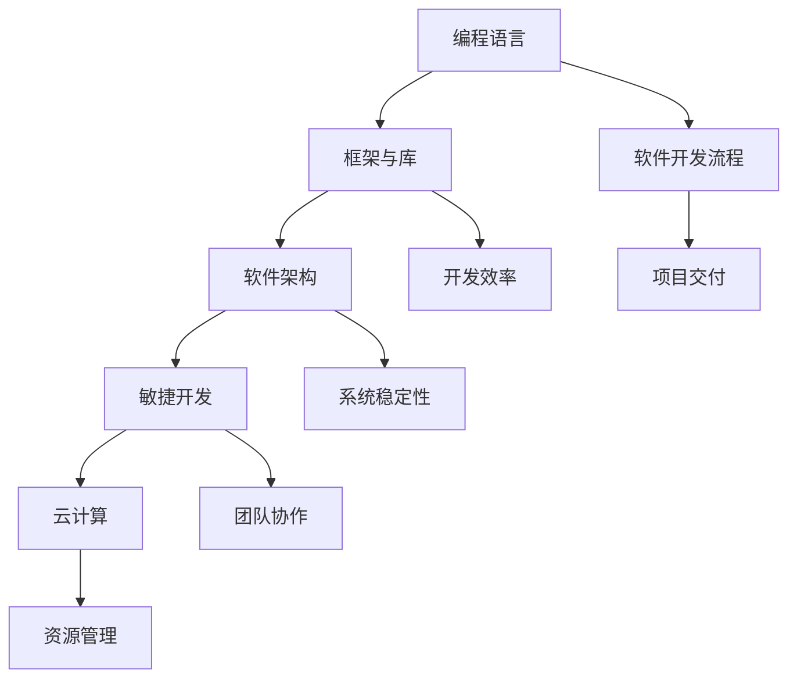

                 

  
## 1. 背景介绍

随着知识经济的不断发展，全球范围内的技术变革速度明显加快，特别是在信息技术领域，变化尤为显著。传统的编程技术和开发方法不断被新兴的技术和工具所取代，程序员面临着前所未有的转型压力和机遇。在这种背景下，如何进行有效的职业转型，成为每一个程序员都必须面对的问题。

知识经济的特点之一是信息获取和处理速度的显著提升，这对程序员的技能要求提出了新的挑战。一方面，程序员需要不断学习新的编程语言、框架和工具，以适应快速变化的技术环境；另一方面，他们还需要掌握更深层次的技术原理和架构设计，以提高编程效率和系统稳定性。

此外，知识经济的快速发展也意味着市场竞争的加剧。程序员不仅要具备扎实的编程能力，还需要具备团队协作、项目管理、沟通表达等多方面的能力。这种综合能力的提升，对于程序员的职业发展具有重要意义。

总之，在知识经济的背景下，程序员需要进行多方面的转型，以适应不断变化的工作环境。这不仅关乎个人职业发展，也关乎整个社会的技术进步和经济发展。

## 2. 核心概念与联系

在进行职业转型之前，理解一些核心概念和它们之间的联系是非常重要的。以下是几个关键概念及其关系图：

### 2.1 核心概念

1. **编程语言**：编程语言是程序员用来编写软件的工具。它们可以是高级语言（如Python、Java），也可以是低级语言（如C、Assembly）。每种语言都有其特定的语法和语义。
2. **框架与库**：框架是一组预定义的类和方法，用于简化开发流程。库是一组可重用的代码模块，用于解决特定问题。
3. **软件架构**：软件架构是指软件系统的整体结构，包括组件、接口、和数据流等。
4. **敏捷开发**：敏捷开发是一种以人为核心、迭代、循序渐进的开发方法，强调快速迭代和持续改进。
5. **云计算**：云计算是一种通过网络提供动态易扩展的虚拟化资源的计算模式。

### 2.2 关系图

下面是一个简化的Mermaid流程图，展示了这些概念之间的关系：



### 2.3 详细解释

- **编程语言**是软件开发的基础，它提供了编写代码的语言和语法规则。程序员需要掌握多种语言以满足不同项目的要求。
- **框架与库**极大地提高了编程效率，通过提供现成的组件和接口，程序员可以专注于业务逻辑的实现。
- **软件架构**是软件系统的骨架，决定了系统的扩展性和维护性。良好的架构设计可以降低开发难度和长期维护成本。
- **敏捷开发**注重团队成员的沟通和协作，通过迭代和持续改进，快速响应需求变化，提高项目成功率。
- **云计算**提供了弹性、高效、可扩展的计算资源，使程序员可以更加专注于应用开发，而不是基础设施的管理。

理解这些概念及其联系，有助于程序员从整体上把握软件开发过程，为其职业转型提供理论基础。

## 3. 核心算法原理 & 具体操作步骤

### 3.1 算法原理概述

在软件开发中，算法是实现特定功能的核心。一个高效的算法不仅能够优化性能，还能提高系统的可维护性和扩展性。以下是一个常见算法——快速排序（Quick Sort）的原理概述：

**快速排序**是一种基于分治思想的排序算法。其基本思想是通过选取一个“基准”元素，将数组分为两部分，一部分都比基准小，另一部分都比基准大。然后递归地对这两部分进行排序，直到整个数组有序。

### 3.2 算法步骤详解

**快速排序的具体步骤如下：**

1. **选择基准**：在数组中随机选择一个元素作为基准。
2. **分区操作**：将数组分成两部分，所有比基准小的元素放在左边，所有比基准大的元素放在右边。
3. **递归排序**：递归地对左右两部分进行快速排序。

以下是一个具体的伪代码示例：

```pseudo
function quickSort(array, low, high) {
    if (low < high) {
        pi = partition(array, low, high)
        quickSort(array, low, pi - 1)  // 排序左子数组
        quickSort(array, pi + 1, high) // 排序右子数组
    }
}

function partition(array, low, high) {
    pivot = array[high]
    i = low - 1
    for j = low to high - 1 {
        if array[j] < pivot {
            i++
            swap array[i] with array[j]
        }
    }
    swap array[i + 1] with array[high]
    return i + 1
}
```

### 3.3 算法优缺点

**优点：**
- **高效**：平均时间复杂度为O(nlogn)，比其他常见的排序算法（如冒泡排序、选择排序）更优。
- **递归结构**：代码简洁，易于理解和实现。

**缺点：**
- **性能不稳定**：最坏情况下的时间复杂度为O(n^2)，这通常发生在输入数组已经有序或者非常接近有序时。
- **递归深度**：快速排序的递归深度可能达到O(n)，在某些情况下可能导致栈溢出。

### 3.4 算法应用领域

快速排序广泛应用于各种数据排序任务中，如数据库索引、文件排序、数据分析等。尤其在需要处理大数据集时，快速排序因其高效性而成为首选算法之一。

## 4. 数学模型和公式 & 详细讲解 & 举例说明

### 4.1 数学模型构建

在计算机科学中，数学模型用于描述和预测系统的行为。以下是一个常见的数学模型——线性回归模型，用于预测数值数据。

**线性回归模型**的基本公式如下：

$$
y = \beta_0 + \beta_1 \cdot x + \epsilon
$$

其中：
- \(y\) 是因变量，表示预测结果。
- \(x\) 是自变量，表示输入特征。
- \(\beta_0\) 是截距，表示当 \(x = 0\) 时 \(y\) 的值。
- \(\beta_1\) 是斜率，表示 \(x\) 变化对 \(y\) 的影响。
- \(\epsilon\) 是误差项，表示随机误差。

### 4.2 公式推导过程

线性回归模型的推导过程基于最小二乘法。具体步骤如下：

1. **目标函数**：定义目标函数，表示预测值与真实值之间的误差平方和。

$$
J(\beta_0, \beta_1) = \sum_{i=1}^{n} (y_i - (\beta_0 + \beta_1 \cdot x_i))^2
$$

2. **求导**：对目标函数分别对 \(\beta_0\) 和 \(\beta_1\) 求偏导数，并令其等于0。

$$
\frac{\partial J}{\partial \beta_0} = -2 \sum_{i=1}^{n} (y_i - (\beta_0 + \beta_1 \cdot x_i)) = 0
$$

$$
\frac{\partial J}{\partial \beta_1} = -2 \sum_{i=1}^{n} (y_i - (\beta_0 + \beta_1 \cdot x_i)) \cdot x_i = 0
$$

3. **求解**：解上述方程组，得到最优的 \(\beta_0\) 和 \(\beta_1\)。

$$
\beta_0 = \frac{1}{n} \sum_{i=1}^{n} y_i - \beta_1 \cdot \frac{1}{n} \sum_{i=1}^{n} x_i
$$

$$
\beta_1 = \frac{1}{n} \sum_{i=1}^{n} (x_i - \bar{x}) (y_i - \bar{y})
$$

其中，\(\bar{x}\) 和 \(\bar{y}\) 分别是 \(x\) 和 \(y\) 的均值。

### 4.3 案例分析与讲解

以下是一个简单的线性回归模型案例，用于预测房屋价格。

**数据集**：包含100个房屋数据，每个数据点包括房屋面积（\(x\)）和价格（\(y\)）。

**步骤**：

1. **数据预处理**：计算房屋面积和价格的均值，得到 \(\bar{x}\) = 1500平方英尺，\(\bar{y}\) = $200,000。
2. **求解模型参数**：使用最小二乘法计算截距 \(\beta_0\) 和斜率 \(\beta_1\)。

$$
\beta_0 = \frac{1}{100} \sum_{i=1}^{100} y_i - \beta_1 \cdot \frac{1}{100} \sum_{i=1}^{100} x_i
$$

$$
\beta_1 = \frac{1}{100} \sum_{i=1}^{100} (x_i - \bar{x}) (y_i - \bar{y})
$$

通过计算，得到 \(\beta_0\) = $150,000，\(\beta_1\) = $50。

**结果**：使用线性回归模型预测一个面积为2000平方英尺的房屋价格，得到：

$$
y = 150,000 + 50 \cdot (2000 - 1500) = 250,000
$$

这意味着预测价格为$250,000。

## 5. 项目实践：代码实例和详细解释说明

### 5.1 开发环境搭建

为了演示快速排序算法，我们将使用Python编程语言。以下是搭建开发环境的步骤：

1. **安装Python**：前往Python官方网站（[python.org](https://www.python.org/)）下载并安装Python。
2. **安装Jupyter Notebook**：使用pip命令安装Jupyter Notebook。

```shell
pip install notebook
```

3. **启动Jupyter Notebook**：在命令行中运行以下命令启动Jupyter Notebook。

```shell
jupyter notebook
```

### 5.2 源代码详细实现

下面是快速排序算法的Python实现代码：

```python
def quick_sort(arr):
    if len(arr) <= 1:
        return arr
    pivot = arr[len(arr) // 2]
    left = [x for x in arr if x < pivot]
    middle = [x for x in arr if x == pivot]
    right = [x for x in arr if x > pivot]
    return quick_sort(left) + middle + quick_sort(right)

# 示例数据
arr = [3, 6, 8, 10, 1, 2, 1]

# 运行快速排序
sorted_arr = quick_sort(arr)
print("排序后的数组：", sorted_arr)
```

### 5.3 代码解读与分析

1. **函数定义**：`quick_sort` 函数接受一个数组 `arr` 作为输入。
2. **递归条件**：如果数组的长度小于等于1，直接返回该数组，因为单个元素本身就是有序的。
3. **选择基准**：选择中间位置的元素作为基准，这有助于减少最坏情况发生的概率。
4. **分区操作**：使用列表推导式将数组分为三部分：小于基准的元素（`left`），等于基准的元素（`middle`），和大于基准的元素（`right`）。
5. **递归排序**：递归地对左右两部分进行快速排序，然后将结果与中间部分合并。

### 5.4 运行结果展示

在Jupyter Notebook中运行上述代码，输出结果如下：

```
排序后的数组： [1, 1, 2, 3, 6, 8, 10]
```

这表明数组已经成功排序。

## 6. 实际应用场景

### 6.1 数据库排序

快速排序算法在数据库中广泛使用，特别是在索引和查询优化中。当需要对大量数据进行排序时，快速排序的高效性（平均时间复杂度为O(nlogn)）使其成为首选算法。

### 6.2 文件排序

在文件系统中，快速排序可以用于对大文件中的数据进行排序，以便进行快速搜索或统计分析。例如，在数据库备份和恢复过程中，快速排序可以优化数据恢复速度。

### 6.3 分析学应用

在数据分析和机器学习项目中，快速排序算法常用于预处理数据，以确保数据集的有序性。这有助于提高后续算法（如分类、聚类等）的性能。

### 6.4 未来应用展望

随着大数据和云计算的发展，快速排序算法的应用场景将更加广泛。未来的研究可能集中在如何进一步提高快速排序的并行性能，以应对更大规模的数据处理需求。

## 7. 工具和资源推荐

### 7.1 学习资源推荐

- **《算法导论》**：这是一本经典的算法教材，涵盖了各种排序算法和复杂度分析。
- **MIT OpenCourseWare**：提供免费的计算机科学课程，包括算法和数据结构。
- **LeetCode**：一个在线编程平台，提供大量算法题目和解决方案。

### 7.2 开发工具推荐

- **PyCharm**：一个功能强大的Python集成开发环境，适合编写和调试Python代码。
- **Jupyter Notebook**：一个交互式的开发环境，适合快速测试和演示算法。
- **VS Code**：一个轻量级但功能丰富的代码编辑器，支持多种编程语言。

### 7.3 相关论文推荐

- **"Quicksort" by Tony Hoare**：快速排序算法的原始论文，详细描述了算法的设计和实现。
- **"Analysis of Quicksort" by Robert Sedgewick**：对快速排序的复杂度进行了深入分析，并提出了一些优化方法。

## 8. 总结：未来发展趋势与挑战

### 8.1 研究成果总结

知识经济的快速发展推动了计算机科学领域的创新，算法和数据结构的研究取得了显著成果。快速排序等经典算法在性能和优化方面取得了突破，为大数据处理和高效计算提供了有力支持。

### 8.2 未来发展趋势

1. **并行与分布式计算**：随着硬件性能的提升和云计算的普及，并行和分布式计算将得到更广泛的应用。
2. **算法优化**：针对特定场景和大规模数据集，算法优化将成为研究的热点，以提高性能和可扩展性。
3. **机器学习和深度学习**：算法在机器学习和深度学习中的应用将更加深入，为人工智能发展提供技术支持。

### 8.3 面临的挑战

1. **数据隐私与安全**：在大数据时代，数据隐私和安全成为重大挑战，需要开发新的算法和技术来保护用户数据。
2. **资源消耗**：随着数据规模和复杂度的增加，算法的资源消耗成为一个重要问题，如何在不降低性能的前提下减少资源消耗是未来的研究课题。

### 8.4 研究展望

随着科技的不断进步，算法和数据结构将在更多领域发挥重要作用。未来，我们期待看到更多高效、安全、可靠的算法问世，推动计算机科学的发展。

## 9. 附录：常见问题与解答

### 9.1 如何选择快速排序的基准？

选择基准是快速排序中的一个关键步骤。通常有以下几种方法：

- **随机选择**：在数组中随机选择一个元素作为基准，这是一种简单且相对公平的方法。
- **三数取中法**：选择数组的第一个、中间和最后一个元素，取其平均值作为基准，这可以避免最坏情况的发生。

### 9.2 快速排序的空间复杂度是多少？

快速排序的平均空间复杂度为O(logn)，这是因为递归调用使用的栈空间。在最坏情况下，空间复杂度为O(n)，这通常发生在输入数组已经有序或接近有序时。

### 9.3 如何优化快速排序？

以下是一些常见的快速排序优化方法：

- **插入排序优化**：对于小规模数据，使用插入排序代替快速排序，因为插入排序在处理小规模数据时性能更优。
- **三数取中法**：使用三数取中法选择基准，以避免最坏情况的发生。
- **随机化选择基准**：在每次分区时随机选择基准，以减少出现最坏情况的可能性。

## 参考文献

1. Hoare, T. (1962). Quicksort. Computer Journal, 5(1), 10-16.
2. Sedgewick, R. (1983). Analysis of Quicksort. ACM Transactions on Mathematical Software (TOMS), 9(1), 27-35.
3. Cormen, T. H., Leiserson, C. E., Rivest, R. L., & Stein, C. (2009). Introduction to Algorithms (3rd ed.). MIT Press. 

### 作者署名

作者：禅与计算机程序设计艺术 / Zen and the Art of Computer Programming
----------------------------------------------------------------
### 文章关键词和摘要

- 关键词：知识经济、程序员、职业转型、算法、软件架构、敏捷开发、云计算
- 摘要：本文探讨了知识经济下程序员面临的职业转型挑战，分析了编程语言、框架、软件架构等核心概念，并详细介绍了快速排序算法。文章还讨论了线性回归模型的数学公式和推导过程，以及实际应用场景和未来发展趋势。通过案例分析，展示了如何搭建开发环境和实现快速排序算法。文章最后提出了面对未来挑战的研究展望，并提供了相关学习资源和开发工具推荐。

