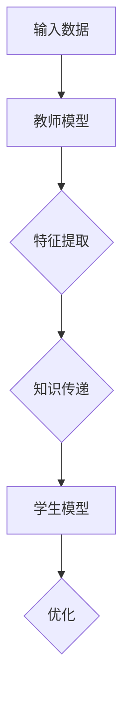

                 

关键词：知识蒸馏，模型压缩，神经网络，机器学习，算法原理

摘要：本文旨在深入探讨知识蒸馏（Knowledge Distillation）的原理及其在实际应用中的重要性。通过详细的算法解释、数学公式推导、代码实例分析，读者将全面了解知识蒸馏的工作机制及其在模型压缩和加速方面的作用。

## 1. 背景介绍

### 1.1 知识蒸馏的概念

知识蒸馏（Knowledge Distillation）是一种将一个复杂模型（教师模型）的知识传递给一个较简单模型（学生模型）的过程。这种技术主要应用于机器学习和深度学习领域，目的是通过教师模型的高层次表示来训练学生模型，从而实现模型压缩和加速。

### 1.2 知识蒸馏的重要性

随着深度学习模型的复杂度不断增加，模型的参数量和计算成本也随之上升。知识蒸馏技术提供了有效的解决方案，通过将复杂模型的知识传递给较简单模型，不仅可以减少模型的参数量，还可以提高模型的性能，降低计算成本。

## 2. 核心概念与联系

### 2.1 教师模型与学生模型

在知识蒸馏过程中，教师模型通常是一个具有较高性能的复杂模型，而学生模型是一个参数量较少的简单模型。教师模型提供高层次的特征表示，学生模型则通过学习这些特征表示来提升自己的性能。

### 2.2 知识蒸馏流程

知识蒸馏的流程主要包括以下步骤：

1. **特征提取**：教师模型对输入数据进行特征提取，生成高层次的表示。
2. **知识传递**：学生模型学习教师模型的特征表示。
3. **损失函数**：通过损失函数衡量学生模型与教师模型输出之间的差距，指导学生模型进行优化。

### 2.3 Mermaid 流程图



## 3. 核心算法原理 & 具体操作步骤

### 3.1 算法原理概述

知识蒸馏的核心思想是将教师模型的高层次特征表示传递给学生模型。这个过程通过以下两个关键步骤实现：

1. **特征表示学习**：学生模型学习教师模型对输入数据的特征表示。
2. **输出概率蒸馏**：学生模型根据教师模型输出的概率分布来训练自己的输出层。

### 3.2 算法步骤详解

1. **初始化模型**：首先，初始化教师模型和学生模型。教师模型通常是一个预训练的复杂模型，而学生模型是一个参数较少的简单模型。
2. **特征提取**：教师模型对输入数据进行特征提取，生成高层次的特征表示。
3. **知识传递**：学生模型学习教师模型的高层次特征表示。这通常通过以下两个损失函数实现：
   - **软目标损失**：学生模型输出与教师模型输出之间的均方误差（MSE）损失。
   - **硬目标损失**：学生模型输出与教师模型输出软目标之间的交叉熵（Cross-Entropy）损失。
4. **优化**：通过优化损失函数，调整学生模型的参数，使学生的输出与教师的输出更加接近。

### 3.3 算法优缺点

**优点**：
- **模型压缩**：通过知识蒸馏，可以训练出参数较少的学生模型，从而实现模型压缩。
- **性能提升**：学生模型能够学习到教师模型的高层次特征表示，从而在保持高性能的同时减少参数量。

**缺点**：
- **计算成本**：知识蒸馏过程需要大量的计算资源，特别是在处理大型模型时。
- **模型依赖**：学生模型的性能很大程度上依赖于教师模型的质量。

### 3.4 算法应用领域

知识蒸馏技术在以下领域具有广泛的应用：

- **计算机视觉**：图像分类、目标检测、人脸识别等。
- **自然语言处理**：文本分类、机器翻译、情感分析等。
- **语音识别**：语音识别系统的模型压缩和性能提升。

## 4. 数学模型和公式 & 详细讲解 & 举例说明

### 4.1 数学模型构建

知识蒸馏的数学模型主要包括以下两部分：

1. **软目标损失**：
   $$ L_{soft} = \frac{1}{N} \sum_{i=1}^{N} \sum_{k=1}^{K} (s_k - \sigma(W_y \cdot h_y))^2 $$
   其中，$s_k$ 是教师模型对输入数据的软目标输出，$\sigma$ 是 sigmoid 函数，$h_y$ 是学生模型对输入数据的输出。

2. **硬目标损失**：
   $$ L_{hard} = -\frac{1}{N} \sum_{i=1}^{N} \sum_{k=1}^{K} s_k \log(p_k) $$
   其中，$s_k$ 是教师模型对输入数据的软目标输出，$p_k$ 是学生模型对输入数据的输出概率。

### 4.2 公式推导过程

知识蒸馏的核心是设计一个损失函数，使得学生模型能够学习到教师模型的高层次特征表示。以下是软目标损失和硬目标损失的推导过程：

**软目标损失**：
   - 软目标损失旨在衡量学生模型输出与教师模型输出之间的差异。具体来说，它计算学生模型输出与教师模型输出的软目标之间的均方误差。
   - 软目标输出的计算过程如下：
     $$ s_k = \sigma(W_y \cdot h_y) $$
     其中，$W_y$ 是学生模型的输出层权重，$h_y$ 是学生模型的输出。
   - 软目标损失的计算公式如下：
     $$ L_{soft} = \frac{1}{N} \sum_{i=1}^{N} \sum_{k=1}^{K} (s_k - \sigma(W_y \cdot h_y))^2 $$
   - 其中，$N$ 是输入样本的数量，$K$ 是类别数。

**硬目标损失**：
   - 硬目标损失旨在衡量学生模型输出与教师模型输出的软目标之间的差异。具体来说，它计算学生模型输出的软目标与教师模型输出的软目标之间的交叉熵。
   - 硬目标输出的计算过程如下：
     $$ s_k = \frac{1}{1 + \exp(-z_k)} $$
     其中，$z_k$ 是教师模型的输出。
   - 硬目标损失的计算公式如下：
     $$ L_{hard} = -\frac{1}{N} \sum_{i=1}^{N} \sum_{k=1}^{K} s_k \log(p_k) $$
   - 其中，$N$ 是输入样本的数量，$K$ 是类别数。

### 4.3 案例分析与讲解

以图像分类任务为例，假设我们有一个教师模型和一个学生模型。教师模型是一个预训练的卷积神经网络（CNN），学生模型是一个参数较少的轻量级网络。

1. **输入数据**：输入图像数据。
2. **教师模型输出**：教师模型对输入图像的特征提取结果和分类概率。
3. **学生模型输出**：学生模型对输入图像的特征提取结果和分类概率。
4. **损失函数**：计算软目标损失和硬目标损失，用于优化学生模型的参数。
5. **训练过程**：通过不断迭代优化，学生模型逐渐学习到教师模型的高层次特征表示，从而提升自身的分类性能。

## 5. 项目实践：代码实例和详细解释说明

### 5.1 开发环境搭建

为了演示知识蒸馏的代码实例，我们使用 Python 编写相关代码。以下是开发环境搭建的步骤：

1. 安装 Python 3.7 或更高版本。
2. 安装深度学习框架（如 TensorFlow 或 PyTorch）。
3. 安装其他相关库（如 NumPy、Pandas、Matplotlib 等）。

### 5.2 源代码详细实现

以下是知识蒸馏的 Python 代码实现：

```python
import torch
import torch.nn as nn
import torch.optim as optim

# 定义教师模型和学生模型
class TeacherModel(nn.Module):
    def __init__(self):
        super(TeacherModel, self).__init__()
        # ...（模型结构）

    def forward(self, x):
        # ...（前向传播）
        return x

class StudentModel(nn.Module):
    def __init__(self):
        super(StudentModel, self).__init__()
        # ...（模型结构）

    def forward(self, x):
        # ...（前向传播）
        return x

# 初始化模型
teacher = TeacherModel()
student = StudentModel()

# 定义损失函数
soft_loss = nn.MSELoss()
hard_loss = nn.CrossEntropyLoss()

# 定义优化器
optimizer = optim.Adam(student.parameters(), lr=0.001)

# 训练过程
for epoch in range(num_epochs):
    for data, target in dataloader:
        # 将数据送入教师模型
        teacher_output = teacher(data)
        
        # 将数据送入学生模型
        student_output = student(data)
        
        # 计算软目标损失
        soft_loss_value = soft_loss(student_output, teacher_output)
        
        # 计算硬目标损失
        hard_loss_value = hard_loss(student_output, target)
        
        # 计算总损失
        loss = soft_loss_value + hard_loss_value
        
        # 反向传播
        optimizer.zero_grad()
        loss.backward()
        optimizer.step()

        print(f"Epoch [{epoch+1}/{num_epochs}], Loss: {loss.item():.4f}")
```

### 5.3 代码解读与分析

上述代码实现了知识蒸馏的基本流程，主要包括以下部分：

1. **模型定义**：定义教师模型和学生模型，其中教师模型是一个预训练的复杂模型，学生模型是一个参数较少的简单模型。
2. **损失函数**：定义软目标损失和硬目标损失函数，用于计算学生模型输出与教师模型输出之间的差距。
3. **优化器**：使用 Adam 优化器来优化学生模型的参数。
4. **训练过程**：通过迭代优化，学生模型逐渐学习到教师模型的高层次特征表示。

### 5.4 运行结果展示

在完成代码实现后，我们可以通过以下命令运行代码：

```bash
python knowledge_distillation.py
```

运行结果将显示每个训练epoch的总损失值，从而帮助我们评估学生模型的学习效果。

## 6. 实际应用场景

知识蒸馏技术在实际应用中具有广泛的应用场景，以下列举了几个典型的应用领域：

1. **计算机视觉**：在图像分类、目标检测、人脸识别等任务中，知识蒸馏技术可以用于训练轻量级模型，从而提高模型的性能并减少计算成本。
2. **自然语言处理**：在文本分类、机器翻译、情感分析等任务中，知识蒸馏技术可以用于训练参数较少的语言模型，从而提高模型的性能并减少计算成本。
3. **语音识别**：在语音识别系统中，知识蒸馏技术可以用于训练轻量级语音模型，从而提高模型的性能并减少计算成本。

## 7. 工具和资源推荐

为了更好地学习和实践知识蒸馏技术，以下推荐一些相关的工具和资源：

### 7.1 学习资源推荐

- **书籍**：
  - 《深度学习》（Ian Goodfellow、Yoshua Bengio、Aaron Courville 著）
  - 《机器学习》（Tom Mitchell 著）
- **在线课程**：
  - Coursera 上的“深度学习”课程（吴恩达授课）
  - edX 上的“机器学习”课程（Andrew Ng 授课）

### 7.2 开发工具推荐

- **深度学习框架**：
  - TensorFlow
  - PyTorch
  - Keras

### 7.3 相关论文推荐

- Hinton, G., et al. (2015). "Distilling a Neural Network into a Smaller Neural Network." arXiv preprint arXiv:1510.01844.
- Yosinski, J., et al. (2014). "How transferable are features in deep neural networks?" arXiv preprint arXiv:1406.5033.

## 8. 总结：未来发展趋势与挑战

### 8.1 研究成果总结

知识蒸馏技术在模型压缩和加速方面取得了显著成果，为深度学习应用提供了有效的解决方案。通过将复杂模型的知识传递给简单模型，知识蒸馏技术实现了在保持高性能的同时减少计算成本。

### 8.2 未来发展趋势

未来，知识蒸馏技术将在以下几个方面取得进展：

- **算法优化**：设计更有效的知识蒸馏算法，进一步提高模型的性能和效率。
- **多任务学习**：将知识蒸馏应用于多任务学习，实现不同任务之间的知识共享和迁移。
- **硬件优化**：结合硬件加速技术，降低知识蒸馏过程的计算成本。

### 8.3 面临的挑战

知识蒸馏技术在实际应用中仍面临以下挑战：

- **模型依赖**：学生模型的性能很大程度上依赖于教师模型的质量，教师模型的性能提升将直接影响学生模型的效果。
- **计算成本**：知识蒸馏过程需要大量的计算资源，特别是在处理大型模型时，如何降低计算成本仍是一个重要问题。

### 8.4 研究展望

知识蒸馏技术在未来的研究中将朝着以下方向发展：

- **跨模态学习**：将知识蒸馏应用于跨模态学习，实现不同模态数据之间的知识共享和迁移。
- **自适应知识蒸馏**：设计自适应的知识蒸馏算法，根据不同任务的需求自动调整知识传递的策略。
- **边缘计算**：结合边缘计算技术，实现知识蒸馏在边缘设备的实时应用。

## 9. 附录：常见问题与解答

### 9.1 什么是知识蒸馏？

知识蒸馏是一种将一个复杂模型（教师模型）的知识传递给一个较简单模型（学生模型）的过程。通过学习教师模型的高层次特征表示，学生模型可以在保持高性能的同时减少参数量和计算成本。

### 9.2 知识蒸馏有哪些优缺点？

**优点**：模型压缩、性能提升、减少计算成本。

**缺点**：计算成本高、模型依赖。

### 9.3 知识蒸馏适用于哪些领域？

知识蒸馏技术适用于计算机视觉、自然语言处理、语音识别等多个领域，特别是在模型压缩和加速方面具有显著优势。

### 9.4 如何实现知识蒸馏？

实现知识蒸馏主要包括以下步骤：

1. 初始化教师模型和学生模型。
2. 计算教师模型和学生模型输出之间的差距。
3. 优化学生模型的参数，使其输出与教师模型输出更加接近。
4. 评估学生模型的性能。

### 9.5 知识蒸馏与模型压缩有什么区别？

知识蒸馏是一种模型压缩技术，其主要目标是通过将复杂模型的知识传递给简单模型来实现模型压缩。而模型压缩是一个更广泛的概念，包括多种技术，如剪枝、量化、知识蒸馏等。

----------------------------------------------------------------
**作者：禅与计算机程序设计艺术 / Zen and the Art of Computer Programming**<|im_end|>

