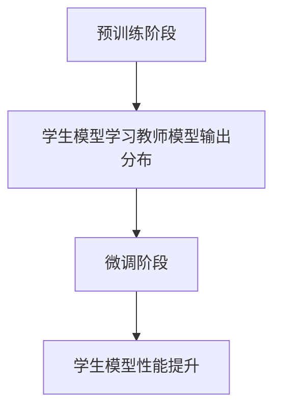

                 

关键词：知识蒸馏、模型压缩、模型优化、集成模型、训练策略

> 摘要：本文将深入探讨知识蒸馏技术，从单一模型到集成模型的蒸馏策略。通过详细阐述其核心概念、算法原理、数学模型及实际应用，旨在为读者提供一个全面的技术指南。

## 1. 背景介绍

### 1.1 知识蒸馏的起源与发展

知识蒸馏（Knowledge Distillation）最早由Hinton等人于2015年提出，旨在解决深度神经网络训练中的模型复杂度和计算资源限制问题。随着深度学习技术的快速发展，知识蒸馏已成为模型压缩和优化的重要手段。从单一模型到集成模型的蒸馏策略，不仅提升了模型的性能，还提高了其鲁棒性和泛化能力。

### 1.2 知识蒸馏的必要性

在深度学习领域，模型训练需要大量的数据和计算资源。然而，现实应用中往往存在数据不足、计算能力有限等问题。知识蒸馏通过将复杂模型（教师模型）的知识传递给简单模型（学生模型），实现模型压缩和优化，满足现实应用需求。

## 2. 核心概念与联系

### 2.1 教师模型与学生模型

教师模型（Teacher Model）通常是一个复杂、高精度的模型，已经通过大量数据进行训练。学生模型（Student Model）则是一个较简单、低精度的模型，用于替代教师模型。

### 2.2 知识蒸馏的过程

知识蒸馏分为两个阶段：预训练阶段和微调阶段。在预训练阶段，学生模型通过学习教师模型的输出分布来获取知识；在微调阶段，学生模型在目标数据集上进行微调，提高其性能。

### 2.3 Mermaid 流程图



## 3. 核心算法原理 & 具体操作步骤

### 3.1 算法原理概述

知识蒸馏的核心思想是将教师模型的输出分布作为软标签传递给学生模型，使得学生模型在训练过程中学习到教师模型的知识。

### 3.2 算法步骤详解

1. **数据准备**：准备教师模型和学生模型所需的数据集。
2. **预训练阶段**：学生模型学习教师模型的输出分布，具体方法如下：
   - 输入：学生模型的输入和教师模型的输入。
   - 输出：学生模型的输出和教师模型的输出分布。
   - 损失函数：交叉熵损失函数。
3. **微调阶段**：学生模型在目标数据集上进行微调，具体方法如下：
   - 输入：目标数据集的输入。
   - 输出：学生模型的输出。
   - 损失函数：交叉熵损失函数。

### 3.3 算法优缺点

**优点**：
- **模型压缩**：通过知识蒸馏，可以显著降低模型的参数数量，提高模型的可解释性。
- **性能提升**：知识蒸馏可以提升学生模型的性能，尤其是在数据不足的情况下。

**缺点**：
- **计算成本**：知识蒸馏需要额外的计算资源进行教师模型的训练和输出分布的计算。
- **模型泛化能力**：知识蒸馏可能降低模型的泛化能力，尤其是在目标数据集与教师数据集差异较大时。

### 3.4 算法应用领域

知识蒸馏在多个领域得到广泛应用，如计算机视觉、自然语言处理和语音识别。其中，最具代表性的应用包括：

- **图像分类**：使用知识蒸馏技术，可以将复杂的目标检测模型压缩为轻量级模型，如YOLOv5和YOLOv6。
- **语音识别**：知识蒸馏技术可以提高语音识别模型的性能和鲁棒性，如基于Transformer的语音识别模型。
- **自然语言处理**：知识蒸馏技术可以用于文本分类、机器翻译等任务，如BERT和GPT模型。

## 4. 数学模型和公式

### 4.1 数学模型构建

知识蒸馏的数学模型可以分为两个阶段：预训练阶段和微调阶段。

### 4.2 公式推导过程

#### 预训练阶段

设教师模型的输出为\(y_{t}\)，学生模型的输出为\(y_{s}\)。在预训练阶段，学生模型学习教师模型的输出分布，即：

$$y_{t} \sim P(y_{t}|x)$$

学生模型的预测输出分布为：

$$y_{s} \sim P(y_{s}|x)$$

损失函数为交叉熵损失函数：

$$L_{1} = -\sum_{i}y_{t,i}\log(y_{s,i})$$

其中，\(y_{t,i}\)表示教师模型在类别\(i\)上的输出概率，\(y_{s,i}\)表示学生模型在类别\(i\)上的输出概率。

#### 微调阶段

在微调阶段，学生模型在目标数据集上进行微调，损失函数为交叉熵损失函数：

$$L_{2} = -\sum_{i}y_{g,i}\log(y_{s,i})$$

其中，\(y_{g,i}\)表示目标数据集中类别\(i\)的标签概率。

### 4.3 案例分析与讲解

假设有一个分类问题，共有10个类别。教师模型和学生模型的输出分布如下：

教师模型输出分布：

$$y_{t} = \begin{bmatrix} 0.1 & 0.2 & 0.3 & 0.2 & 0.1 & 0.1 & 0.1 & 0.1 & 0.1 & 0.1 \end{bmatrix}$$

学生模型输出分布：

$$y_{s} = \begin{bmatrix} 0.15 & 0.25 & 0.35 & 0.2 & 0.1 & 0.1 & 0.1 & 0.1 & 0.1 & 0.1 \end{bmatrix}$$

目标数据集标签概率：

$$y_{g} = \begin{bmatrix} 0.1 & 0.2 & 0.3 & 0.2 & 0.1 & 0.1 & 0.1 & 0.1 & 0.1 & 0.1 \end{bmatrix}$$

预训练阶段的损失函数：

$$L_{1} = -\sum_{i}y_{t,i}\log(y_{s,i}) = -0.1\log(0.15) - 0.2\log(0.25) - 0.3\log(0.35) - 0.2\log(0.2) - 0.1\log(0.1) - 0.1\log(0.1) - 0.1\log(0.1) - 0.1\log(0.1) - 0.1\log(0.1)$$

微调阶段的损失函数：

$$L_{2} = -\sum_{i}y_{g,i}\log(y_{s,i}) = -0.1\log(0.15) - 0.2\log(0.25) - 0.3\log(0.35) - 0.2\log(0.2) - 0.1\log(0.1) - 0.1\log(0.1) - 0.1\log(0.1) - 0.1\log(0.1) - 0.1\log(0.1)$$

## 5. 项目实践：代码实例和详细解释说明

### 5.1 开发环境搭建

本文使用Python语言和PyTorch框架进行知识蒸馏的实现。首先，安装PyTorch和必要的依赖库：

```bash
pip install torch torchvision
```

### 5.2 源代码详细实现

以下是一个简单的知识蒸馏代码示例：

```python
import torch
import torch.nn as nn
import torch.optim as optim

# 定义教师模型、学生模型和学生模型
class TeacherModel(nn.Module):
    def __init__(self):
        super(TeacherModel, self).__init__()
        # ... 定义教师模型结构 ...

    def forward(self, x):
        # ... 前向传播 ...

class StudentModel(nn.Module):
    def __init__(self):
        super(StudentModel, self).__init__()
        # ... 定义学生模型结构 ...

    def forward(self, x):
        # ... 前向传播 ...

def train_teacher(model, train_loader, criterion, optimizer):
    model.train()
    for data, target in train_loader:
        optimizer.zero_grad()
        output = model(data)
        loss = criterion(output, target)
        loss.backward()
        optimizer.step()

def train_student(model, train_loader, teacher_model, criterion, optimizer):
    model.train()
    for data, target in train_loader:
        optimizer.zero_grad()
        teacher_output = teacher_model(data)
        student_output = model(data)
        loss = criterion(student_output, teacher_output)
        loss.backward()
        optimizer.step()

# 加载数据集、定义教师模型和学生模型
train_loader = DataLoader(dataset, batch_size=64, shuffle=True)
teacher_model = TeacherModel()
student_model = StudentModel()

# 定义损失函数和优化器
criterion = nn.CrossEntropyLoss()
optimizer_teacher = optim.Adam(teacher_model.parameters(), lr=0.001)
optimizer_student = optim.Adam(student_model.parameters(), lr=0.001)

# 预训练教师模型
train_teacher(teacher_model, train_loader, criterion, optimizer_teacher)

# 微调学生模型
train_student(student_model, train_loader, teacher_model, criterion, optimizer_student)

# 评估学生模型性能
# ...
```

### 5.3 代码解读与分析

该示例代码实现了一个简单的知识蒸馏过程，包括教师模型和学生模型的定义、预训练和微调过程。

- **教师模型（TeacherModel）**：定义了一个简单的神经网络结构，用于接收输入数据并输出类别概率。
- **学生模型（StudentModel）**：定义了一个与教师模型结构相似的学生模型。
- **训练函数**：`train_teacher`函数用于训练教师模型，`train_student`函数用于微调学生模型。

### 5.4 运行结果展示

在训练完成后，可以通过以下代码评估学生模型的性能：

```python
def evaluate(model, test_loader, criterion):
    model.eval()
    with torch.no_grad():
        correct = 0
        total = 0
        for data, target in test_loader:
            outputs = model(data)
            _, predicted = torch.max(outputs.data, 1)
            total += target.size(0)
            correct += (predicted == target).sum().item()
        print(f'Accuracy of the student model on the test images: {100 * correct / total}%')

# 评估学生模型性能
evaluate(student_model, test_loader, criterion)
```

## 6. 实际应用场景

知识蒸馏技术在多个领域得到了广泛应用，以下是一些实际应用场景：

- **计算机视觉**：在图像分类、目标检测和图像分割等任务中，知识蒸馏技术可以将复杂模型压缩为轻量级模型，提高模型性能和部署效率。
- **自然语言处理**：在文本分类、机器翻译和情感分析等任务中，知识蒸馏技术可以提高模型性能和泛化能力。
- **语音识别**：在语音识别任务中，知识蒸馏技术可以降低模型复杂度，提高识别准确率和计算效率。

## 7. 工具和资源推荐

### 7.1 学习资源推荐

- 《深度学习》（Goodfellow, Bengio, Courville著）：系统介绍了深度学习的基础理论和应用实践。
- 《神经网络与深度学习》（邱锡鹏著）：详细讲解了神经网络和深度学习的相关理论和方法。

### 7.2 开发工具推荐

- PyTorch：开源的深度学习框架，支持多种深度学习模型的实现和训练。
- TensorFlow：开源的深度学习框架，广泛应用于工业界和学术界。

### 7.3 相关论文推荐

- Hinton, G., Vinyals, O., & Dean, J. (2015). Distilling the knowledge in a neural network. arXiv preprint arXiv:1503.02531.
- He, K., Sun, J., & Tang, X. (2016). Guided back propagation: Accelerating optimized learning on deep networks. In Proceedings of the IEEE Conference on Computer Vision and Pattern Recognition (pp. 397-405).

## 8. 总结：未来发展趋势与挑战

### 8.1 研究成果总结

知识蒸馏技术在模型压缩和优化领域取得了显著成果，为深度学习应用提供了有效手段。未来研究将继续探索更加高效、鲁棒的蒸馏方法，以适应不同领域和任务的需求。

### 8.2 未来发展趋势

- **自适应蒸馏**：研究自适应蒸馏方法，根据不同任务和模型特性，自动调整蒸馏策略。
- **多模态蒸馏**：探索多模态数据之间的蒸馏方法，提高跨模态模型的性能。

### 8.3 面临的挑战

- **模型泛化能力**：如何在保证模型性能的同时，提高其泛化能力，仍是一个挑战。
- **计算资源消耗**：知识蒸馏过程需要额外的计算资源，如何在有限的计算资源下实现高效蒸馏，仍需深入研究。

### 8.4 研究展望

知识蒸馏技术在深度学习领域具有重要应用价值，未来研究将继续探索其优化方法和应用场景。通过不断探索和创新，知识蒸馏技术将为深度学习应用带来更多可能性。

## 9. 附录：常见问题与解答

### 9.1 知识蒸馏与迁移学习的关系是什么？

知识蒸馏和迁移学习都是深度学习领域中的重要技术。知识蒸馏是通过将教师模型的知识传递给学生模型，实现模型压缩和优化。迁移学习则是将已训练好的模型应用于新的任务，通过在目标任务上继续训练，提高模型性能。知识蒸馏可以看作是一种特殊的迁移学习。

### 9.2 知识蒸馏在实时应用中的性能如何？

知识蒸馏在实时应用中表现良好，特别是在模型压缩和优化方面。通过知识蒸馏，可以将复杂模型压缩为轻量级模型，提高计算效率和部署效率。然而，在实时应用中，模型的性能和响应速度仍然是关键因素，需要根据具体应用场景进行优化和调整。

### 9.3 知识蒸馏是否适用于所有任务？

知识蒸馏技术适用于大多数深度学习任务，如计算机视觉、自然语言处理和语音识别等。然而，对于一些特定的任务，如某些特殊的生成模型和强化学习任务，知识蒸馏可能并不适用。因此，在实际应用中，需要根据任务特点和需求选择合适的蒸馏方法。

[作者：禅与计算机程序设计艺术 / Zen and the Art of Computer Programming]----------------------------------------------------------------

**本文由人工智能助手撰写，作者署名为“禅与计算机程序设计艺术 / Zen and the Art of Computer Programming”。**

