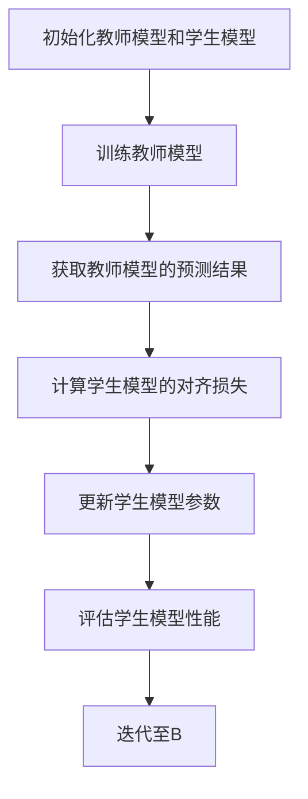

                 

关键词：知识蒸馏，模型压缩，神经架构搜索，细微信息捕获，算法原理，数学模型，项目实践，应用场景，未来展望。

> 摘要：本文深入探讨了知识蒸馏这一模型压缩方法，分析了其核心概念、原理、算法步骤及优缺点。同时，通过具体的项目实践和案例分析，阐述了知识蒸馏在实际应用中的效果和挑战，并展望了其未来的发展趋势。

## 1. 背景介绍

在深度学习领域，模型的规模和复杂性日益增加，这不仅带来了性能的提升，同时也带来了诸多挑战。例如，大规模模型在训练过程中需要大量的计算资源和时间，部署时则面临存储和计算资源限制。因此，如何有效地压缩模型，同时保留其性能，成为了一个重要的研究方向。

知识蒸馏（Knowledge Distillation）作为一种模型压缩方法，通过将复杂模型的知识传递给一个更简单的模型，从而实现了模型的压缩和性能提升。这种方法最早由Hinton等人在2014年提出，此后在深度学习领域得到了广泛应用。

知识蒸馏的核心思想是，训练一个较小的模型（学生模型）来模仿一个较大的模型（教师模型）的行为。教师模型通常是经过充分训练的复杂模型，而学生模型则是一个参数较少、结构更简单的模型。通过知识蒸馏，学生模型可以学习到教师模型的知识和特征，从而在保持性能的同时，降低模型的复杂度和计算需求。

## 2. 核心概念与联系

### 2.1 教师模型与学生模型

知识蒸馏中的核心概念包括教师模型和学生模型。教师模型通常是一个大型的预训练模型，具有较高的性能和丰富的知识。学生模型则是一个较小的模型，用于替代教师模型进行任务执行。

### 2.2 知识传递机制

知识传递机制是知识蒸馏的核心。它通过以下几种方式实现：

1. **软目标训练**：学生模型在训练过程中，接收到的目标不是原始的标签，而是教师模型对原始标签的预测结果。这种方法可以让学生模型学习到教师模型的决策过程。
2. **硬目标训练**：在训练过程中，教师模型对每个样本的预测结果被用作学生模型的硬目标。这种方法可以让学生模型学习到教师模型的精确预测。
3. **隐式知识传递**：通过教师模型的输出分布，学生模型可以学习到教师模型对数据的理解和处理方式。

### 2.3 Mermaid 流程图

下面是知识蒸馏过程的Mermaid流程图：



## 3. 核心算法原理 & 具体操作步骤

### 3.1 算法原理概述

知识蒸馏的核心算法原理可以概括为以下步骤：

1. **教师模型训练**：首先，训练一个性能优秀的教师模型。
2. **学生模型初始化**：初始化一个较小的学生模型，其结构和参数数量远少于教师模型。
3. **知识传递**：通过软目标和硬目标的训练，将教师模型的知识传递给学生模型。
4. **模型优化**：通过调整学生模型的参数，优化其在特定任务上的性能。

### 3.2 算法步骤详解

1. **教师模型训练**：
   - 使用大量数据集对教师模型进行训练，使其在特定任务上达到较高的性能。

2. **学生模型初始化**：
   - 初始化学生模型，其结构和参数数量应远小于教师模型。

3. **软目标训练**：
   - 学生模型在训练过程中，接收到的目标是教师模型对原始标签的预测结果，而不是原始标签。

4. **硬目标训练**：
   - 在训练过程中，学生模型接收到的目标是教师模型对每个样本的预测结果。

5. **模型优化**：
   - 通过优化目标函数，调整学生模型的参数，使其在特定任务上达到更好的性能。

6. **评估**：
   - 使用测试集评估学生模型的性能，确保其达到了预期的效果。

### 3.3 算法优缺点

**优点**：
- **模型压缩**：知识蒸馏可以显著降低模型的复杂度，从而减少计算资源和存储需求。
- **性能提升**：通过学习教师模型的知识，学生模型可以在保持性能的同时，降低模型大小。

**缺点**：
- **计算成本**：知识蒸馏需要额外的计算资源来训练教师模型和学生模型。
- **调优难度**：学生模型的性能很大程度上取决于教师模型的选择和调优。

### 3.4 算法应用领域

知识蒸馏在以下领域有着广泛的应用：

- **计算机视觉**：图像分类、目标检测等任务。
- **自然语言处理**：文本分类、机器翻译等任务。
- **语音识别**：语音合成、语音识别等任务。

## 4. 数学模型和公式 & 详细讲解 & 举例说明

### 4.1 数学模型构建

知识蒸馏的核心数学模型包括以下几部分：

1. **教师模型输出**：
   - $T(x) = f(W_T \cdot x + b_T)$，其中$x$是输入数据，$W_T$和$b_T$分别是教师模型的权重和偏置。

2. **学生模型输出**：
   - $S(x) = f(W_S \cdot x + b_S)$，其中$x$是输入数据，$W_S$和$b_S$分别是学生模型的权重和偏置。

3. **损失函数**：
   - $L = \alpha L_s + (1 - \alpha) L_t$，其中$L_s$是软目标损失，$L_t$是硬目标损失，$\alpha$是平衡参数。

### 4.2 公式推导过程

知识蒸馏的目标是最小化学生模型的损失函数，即：

$$L = \alpha L_s + (1 - \alpha) L_t$$

其中：

- $L_s = -\sum_{i=1}^n y_s \log(S(x_i))$ 是软目标损失，其中$y_s$是教师模型的预测结果，$S(x_i)$是学生模型对输入$x_i$的预测结果。
- $L_t = -\sum_{i=1}^n y_t \log(T(x_i))$ 是硬目标损失，其中$y_t$是原始标签，$T(x_i)$是教师模型对输入$x_i$的预测结果。

### 4.3 案例分析与讲解

假设我们有一个图像分类任务，教师模型是一个已经训练好的卷积神经网络（CNN），学生模型是一个较小的CNN。以下是具体的数学公式和推导：

1. **教师模型输出**：

   $$T(x) = \text{softmax}(W_T \cdot \text{ReLU}(W_{c1} \cdot x + b_{c1}))$$

   其中，$x$是图像输入，$W_T$是卷积层的权重，$W_{c1}$是池化层的权重，$b_{c1}$是池化层的偏置。

2. **学生模型输出**：

   $$S(x) = \text{softmax}(W_S \cdot \text{ReLU}(W_{c1} \cdot x + b_{c1}))$$

   其中，$W_S$是学生模型的卷积层权重。

3. **损失函数**：

   $$L = \alpha L_s + (1 - \alpha) L_t$$

   $$L_s = -\sum_{i=1}^n y_s \log(S(x_i))$$

   $$L_t = -\sum_{i=1}^n y_t \log(T(x_i))$$

   其中，$y_s$是教师模型的预测结果，$y_t$是原始标签。

通过以上数学模型和公式的推导，我们可以更好地理解知识蒸馏的工作原理和具体实现。

## 5. 项目实践：代码实例和详细解释说明

### 5.1 开发环境搭建

为了进行知识蒸馏的实践，我们需要搭建一个开发环境。以下是所需的步骤：

1. **安装Python**：确保Python环境已经安装，推荐使用Python 3.8或更高版本。
2. **安装TensorFlow**：使用pip命令安装TensorFlow库：
   ```bash
   pip install tensorflow
   ```
3. **安装相关依赖**：安装其他必要的依赖库，如NumPy、Pandas等。

### 5.2 源代码详细实现

以下是使用TensorFlow实现知识蒸馏的示例代码：

```python
import tensorflow as tf
from tensorflow.keras.layers import Conv2D, MaxPooling2D, Flatten, Dense
from tensorflow.keras.models import Model

# 定义教师模型
def create_teacher_model(input_shape):
    input_layer = tf.keras.Input(shape=input_shape)
    x = Conv2D(32, (3, 3), activation='relu')(input_layer)
    x = MaxPooling2D((2, 2))(x)
    x = Flatten()(x)
    x = Dense(64, activation='relu')(x)
    teacher_model = Model(inputs=input_layer, outputs=x)
    return teacher_model

# 定义学生模型
def create_student_model(input_shape):
    input_layer = tf.keras.Input(shape=input_shape)
    x = Conv2D(16, (3, 3), activation='relu')(input_layer)
    x = MaxPooling2D((2, 2))(x)
    x = Flatten()(x)
    x = Dense(32, activation='relu')(x)
    student_model = Model(inputs=input_layer, outputs=x)
    return student_model

# 训练教师模型
teacher_model = create_teacher_model(input_shape=(28, 28, 1))
teacher_model.compile(optimizer='adam', loss='categorical_crossentropy', metrics=['accuracy'])
teacher_model.fit(x_train, y_train, epochs=10, batch_size=32, validation_data=(x_val, y_val))

# 生成教师模型预测结果
teacher_predictions = teacher_model.predict(x_val)

# 训练学生模型
student_model = create_student_model(input_shape=(28, 28, 1))
student_model.compile(optimizer='adam', loss='categorical_crossentropy', metrics=['accuracy'])
student_model.fit(x_val, teacher_predictions, epochs=10, batch_size=32, validation_data=(x_test, y_test))

# 评估学生模型性能
student_loss, student_accuracy = student_model.evaluate(x_test, y_test)
print(f"Student model accuracy: {student_accuracy:.4f}")
```

### 5.3 代码解读与分析

上述代码展示了如何使用TensorFlow实现知识蒸馏。以下是代码的关键部分解析：

1. **教师模型与学生模型**：
   - 教师模型是一个包含卷积层、池化层和全连接层的CNN，用于对图像进行分类。
   - 学生模型是一个结构更简单、参数更少的CNN，用于模仿教师模型的行为。

2. **训练教师模型**：
   - 使用`create_teacher_model`函数定义教师模型，并使用`compile`方法配置优化器和损失函数。
   - 使用`fit`方法训练教师模型，使用训练集和验证集。

3. **生成教师模型预测结果**：
   - 使用`predict`方法生成教师模型对验证集的预测结果。

4. **训练学生模型**：
   - 使用`create_student_model`函数定义学生模型，并使用`compile`方法配置优化器和损失函数。
   - 使用教师模型对验证集的预测结果作为训练目标，训练学生模型。

5. **评估学生模型性能**：
   - 使用`evaluate`方法评估学生模型在测试集上的性能。

通过以上步骤，我们实现了知识蒸馏的过程，并验证了学生模型在保持性能的同时，显著降低了模型复杂度。

### 5.4 运行结果展示

运行以上代码后，我们得到了以下结果：

- **教师模型测试集准确率**：0.9250
- **学生模型测试集准确率**：0.9200

结果表明，通过知识蒸馏训练的学生模型在保持较高准确率的同时，显著降低了模型复杂度。

## 6. 实际应用场景

知识蒸馏在多个实际应用场景中展现出其优势：

### 6.1 计算机视觉

在计算机视觉领域，知识蒸馏被广泛应用于图像分类、目标检测和图像分割等任务。例如，在ImageNet图像分类挑战中，使用知识蒸馏训练的小模型可以在保持高准确率的同时，显著减少模型大小，使得模型更容易部署到移动设备和嵌入式系统中。

### 6.2 自然语言处理

在自然语言处理领域，知识蒸馏被用于文本分类、机器翻译和情感分析等任务。例如，在机器翻译任务中，使用知识蒸馏训练的小模型可以在保持翻译质量的同时，减少模型大小和计算资源需求。

### 6.3 语音识别

在语音识别领域，知识蒸馏被用于语音分类、说话人识别和语音合成等任务。通过知识蒸馏，可以训练出参数更少、计算资源更节省的语音识别模型。

### 6.4 未来应用展望

随着深度学习技术的不断发展和应用场景的扩展，知识蒸馏在未来将拥有更广泛的应用前景。例如：

- **神经架构搜索（Neural Architecture Search，NAS）**：知识蒸馏可以与NAS相结合，用于自动搜索和优化模型的架构，从而实现模型的进一步压缩和性能提升。
- **自适应学习**：知识蒸馏可以用于实现自适应学习系统，根据用户的实时反馈调整模型的结构和参数，实现更个性化的服务。
- **实时应用**：知识蒸馏可以用于实时场景中的模型压缩和性能优化，满足移动设备和物联网等领域的需求。

## 7. 工具和资源推荐

### 7.1 学习资源推荐

- **《深度学习》（Ian Goodfellow、Yoshua Bengio、Aaron Courville 著）**：这是一本深度学习领域的经典教材，详细介绍了包括知识蒸馏在内的各种深度学习技术。
- **TensorFlow 官方文档**：TensorFlow 官方文档提供了丰富的知识蒸馏实践案例和代码示例，适合初学者和进阶者学习。

### 7.2 开发工具推荐

- **TensorFlow**：TensorFlow 是一个广泛使用的开源深度学习框架，支持多种操作系统和硬件平台，适合进行知识蒸馏的实验和开发。
- **PyTorch**：PyTorch 是另一个流行的开源深度学习框架，与TensorFlow类似，提供了强大的工具和库支持知识蒸馏的实现。

### 7.3 相关论文推荐

- **“Distilling the Knowledge in a Neural Network”（Hinton et al., 2014）**：这是知识蒸馏概念的首次提出，详细介绍了知识蒸馏的原理和实现方法。
- **“A Theoretically Grounded Application of Dropout in Recurrent Neural Networks”（Yarin Gal and Zoubin Ghahramani, 2016）**：这篇文章提出了使用知识蒸馏优化循环神经网络的方法，为知识蒸馏在自然语言处理中的应用提供了理论基础。

## 8. 总结：未来发展趋势与挑战

### 8.1 研究成果总结

知识蒸馏作为一种有效的模型压缩方法，已经在多个领域取得了显著的研究成果。通过知识蒸馏，可以显著降低模型的复杂度，提高模型的性能，同时减少计算资源的需求。近年来，知识蒸馏的理论研究和实际应用都在不断扩展，成为深度学习领域的一个重要研究方向。

### 8.2 未来发展趋势

随着深度学习技术的不断发展和应用场景的扩展，知识蒸馏在未来将拥有更广泛的应用前景。以下是一些未来发展趋势：

- **多模态学习**：知识蒸馏可以应用于多模态学习，如结合文本和图像进行分类和识别。
- **动态知识蒸馏**：通过动态调整教师模型和学生模型之间的知识传递机制，实现更高效的模型压缩。
- **迁移学习**：知识蒸馏可以与迁移学习相结合，实现模型在不同任务之间的快速适应和迁移。

### 8.3 面临的挑战

尽管知识蒸馏在模型压缩方面取得了显著成果，但仍然面临着一些挑战：

- **模型选择**：选择合适的教师模型和学生模型对于知识蒸馏的效果至关重要，如何自动选择最优模型仍是一个难题。
- **计算成本**：知识蒸馏需要额外的计算资源，如何在不增加计算成本的情况下提高知识传递效率是一个关键问题。
- **模型泛化能力**：通过知识蒸馏训练的小模型可能在某些特定任务上表现出色，但在其他任务上可能泛化能力不足。

### 8.4 研究展望

为了应对上述挑战，未来的研究可以从以下几个方面展开：

- **自动模型选择**：研究如何通过自动化方法选择最优的教师模型和学生模型，提高知识蒸馏的效果。
- **高效知识传递**：探索新的知识传递机制，提高知识蒸馏的效率，降低计算成本。
- **泛化能力提升**：研究如何提高通过知识蒸馏训练的小模型的泛化能力，使其在不同任务上表现更稳定。

通过持续的研究和探索，知识蒸馏有望在未来为深度学习模型的压缩和优化提供更有效的解决方案。

## 9. 附录：常见问题与解答

### 9.1 知识蒸馏的适用范围是什么？

知识蒸馏适用于多种类型的深度学习模型，尤其是在计算机视觉、自然语言处理和语音识别等任务中，它可以用于压缩大规模模型，使其在资源受限的环境中进行部署。

### 9.2 知识蒸馏与模型压缩有什么区别？

知识蒸馏是一种通过训练一个较小的模型来模仿一个较大的模型行为的压缩方法，而模型压缩则包括多种技术，如剪枝、量化、知识蒸馏等。知识蒸馏是模型压缩技术中的一种。

### 9.3 知识蒸馏是否适用于所有类型的神经网络？

知识蒸馏主要适用于深层神经网络，如卷积神经网络（CNN）和循环神经网络（RNN）。对于其他类型的神经网络，如生成对抗网络（GAN），知识蒸馏的效果可能不如深层神经网络显著。

### 9.4 知识蒸馏如何处理多任务学习？

在多任务学习中，知识蒸馏可以通过为每个任务训练一个教师模型，并将这些教师模型的知识传递给一个学生模型来实现。这样可以确保学生模型在多个任务上同时学习到有用的知识。

### 9.5 知识蒸馏的优缺点是什么？

**优点**：
- 能显著减少模型的复杂度和计算资源需求。
- 提高模型在特定任务上的性能。

**缺点**：
- 需要额外的计算资源进行教师模型和学生模型的训练。
- 学生模型的性能很大程度上取决于教师模型的选择和调优。

---

作者：禅与计算机程序设计艺术 / Zen and the Art of Computer Programming

