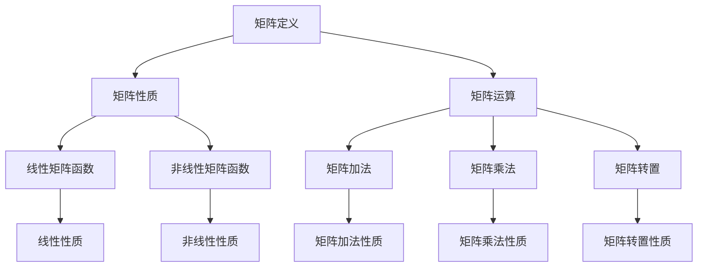

                 

关键词：矩阵理论，一般矩阵，函数，算法，数学模型，应用场景，未来发展。

## 摘要

本文旨在探讨矩阵理论在一般矩阵函数中的应用。首先，我们将回顾矩阵理论的基础知识，包括矩阵的定义、性质和运算。接着，我们将深入探讨一般矩阵函数的概念、分类和性质。在此基础上，我们将介绍一些核心的矩阵函数算法，并详细解释其原理和具体操作步骤。随后，我们将构建数学模型并推导相关公式，并通过具体案例进行说明。最后，我们将展示矩阵函数在实际项目中的应用，探讨其未来发展趋势和面临的挑战。

## 1. 背景介绍

矩阵理论是现代数学和工程学中不可或缺的一部分。矩阵最早由德国数学家卡尔·弗里德里希·高斯在19世纪初提出，并在随后的几十年里得到了迅速发展。矩阵不仅在数学理论中具有重要作用，而且在物理、工程、计算机科学等多个领域中都有广泛应用。

矩阵的基本概念包括矩阵的定义、性质和运算。矩阵是一个由数字组成的矩形数组，通常用大写字母表示，如A。矩阵的行和列分别表示其维度，例如，一个3x4的矩阵有3行4列。矩阵的性质包括行列式、特征值和特征向量等。矩阵的运算包括矩阵加法、矩阵乘法、矩阵转置和逆矩阵等。

在工程学和计算机科学中，矩阵理论被广泛应用于图像处理、信号处理、数据压缩和机器学习等领域。例如，图像处理中的图像矩阵可以用于图像变换、滤波和特征提取等操作。信号处理中的矩阵可以用于信号滤波、调制和解调等操作。数据压缩中的矩阵可以用于压缩算法的设计和实现。机器学习中的矩阵可以用于特征提取、模型训练和预测等操作。

## 2. 核心概念与联系

### 2.1 矩阵函数的概念

矩阵函数是指对矩阵进行特定的数学运算，以获得新的矩阵。矩阵函数的定义域和值域都是矩阵集合。根据矩阵函数的性质和特点，我们可以将其分为线性矩阵函数和非线性矩阵函数。

线性矩阵函数是指满足线性变换性质的矩阵函数，即对任意矩阵A和B，以及任意实数a和b，有：

F(aA + bB) = aF(A) + bF(B)

非线性矩阵函数则不满足上述线性性质。例如，矩阵的幂运算、指数运算和对数运算等都是非线性矩阵函数。

### 2.2 矩阵函数的分类

根据矩阵函数的定义和性质，我们可以将其分为以下几类：

1. **线性矩阵函数**：包括矩阵的加法、减法、乘法和转置等基本运算。
2. **非线性矩阵函数**：包括矩阵的幂运算、指数运算、对数运算和逆运算等。
3. **特殊矩阵函数**：包括矩阵的迹、行列式、特征值和特征向量等。

### 2.3 矩阵函数的性质

矩阵函数具有以下性质：

1. **封闭性**：对于任意的矩阵函数F，其定义域和值域都是矩阵集合，即F(M) ⊆ M，其中M表示矩阵集合。
2. **线性性质**：对于任意的矩阵函数F和线性变换L，有F(L(A)) = L(F(A))，其中A表示矩阵，L表示线性变换。
3. **连续性**：对于任意的矩阵函数F和连续矩阵序列{A_n}，若A_n → A，则F(A_n) → F(A)。

### 2.4 Mermaid 流程图

为了更好地理解矩阵函数的概念和性质，我们可以使用Mermaid流程图来展示其原理和联系。以下是一个简单的Mermaid流程图示例：



该流程图展示了矩阵理论的核心概念和联系，包括矩阵的定义、性质、运算以及矩阵函数的分类和性质。

## 3. 核心算法原理 & 具体操作步骤

### 3.1 算法原理概述

矩阵函数的核心算法主要涉及线性矩阵函数和非线性矩阵函数的计算。在线性矩阵函数方面，常用的算法包括矩阵加法、矩阵乘法、矩阵转置和矩阵求逆等。而非线性矩阵函数方面，常用的算法包括矩阵的幂运算、指数运算和对数运算等。

### 3.2 算法步骤详解

#### 3.2.1 矩阵加法

矩阵加法是一种线性矩阵函数，其基本原理是将两个同型矩阵对应位置的元素相加。具体步骤如下：

1. 确保两个矩阵具有相同的维度。
2. 对于每个元素(i, j)，计算其对应位置元素的和，并将其存储在结果矩阵中。

示例代码：

```python
def matrix_addition(A, B):
    result = [[0 for _ in range(len(A[0]))] for _ in range(len(A))]
    for i in range(len(A)):
        for j in range(len(A[0])):
            result[i][j] = A[i][j] + B[i][j]
    return result
```

#### 3.2.2 矩阵乘法

矩阵乘法是一种非线性矩阵函数，其基本原理是将两个矩阵的对应元素进行乘积运算，并按特定规则求和。具体步骤如下：

1. 确保第一个矩阵的列数与第二个矩阵的行数相同。
2. 对于每个元素(i, j)，计算其对应位置元素的和，并将其存储在结果矩阵中。

示例代码：

```python
def matrix_multiplication(A, B):
    result = [[0 for _ in range(len(B[0]))] for _ in range(len(A))]
    for i in range(len(A)):
        for j in range(len(B[0])):
            for k in range(len(B)):
                result[i][j] += A[i][k] * B[k][j]
    return result
```

#### 3.2.3 矩阵转置

矩阵转置是一种线性矩阵函数，其基本原理是将矩阵的行和列互换。具体步骤如下：

1. 创建一个与原矩阵同型的结果矩阵。
2. 对于每个元素(i, j)，将其存储在结果矩阵的(j, i)位置。

示例代码：

```python
def matrix_transpose(A):
    result = [[0 for _ in range(len(A[0]))] for _ in range(len(A))]
    for i in range(len(A)):
        for j in range(len(A[0])):
            result[j][i] = A[i][j]
    return result
```

#### 3.2.4 矩阵求逆

矩阵求逆是一种非线性矩阵函数，其基本原理是求解一个矩阵的逆矩阵。具体步骤如下：

1. 确保矩阵可逆，即其行列式不为零。
2. 使用高斯消元法或其他算法求解逆矩阵。

示例代码：

```python
import numpy as np

def matrix_inverse(A):
    return np.linalg.inv(A)
```

### 3.3 算法优缺点

每种矩阵函数算法都有其优缺点。以下是几种常见算法的优缺点分析：

1. **矩阵加法**：简单易行，计算速度快，适用于大规模矩阵运算。缺点是只能应用于同型矩阵，无法应用于不同类型矩阵。
2. **矩阵乘法**：适用于多种类型矩阵，计算复杂度较高，适用于大规模矩阵运算。缺点是计算速度较慢，内存消耗较大。
3. **矩阵转置**：简单易行，计算速度快，适用于大规模矩阵运算。缺点是只能应用于同型矩阵，无法应用于不同类型矩阵。
4. **矩阵求逆**：适用于可逆矩阵，计算复杂度较高，适用于大规模矩阵运算。缺点是计算速度较慢，内存消耗较大。

### 3.4 算法应用领域

矩阵函数算法在工程学和计算机科学中具有广泛的应用。以下是几个常见应用领域：

1. **图像处理**：矩阵函数用于图像变换、滤波和特征提取等操作。
2. **信号处理**：矩阵函数用于信号滤波、调制和解调等操作。
3. **数据压缩**：矩阵函数用于压缩算法的设计和实现。
4. **机器学习**：矩阵函数用于特征提取、模型训练和预测等操作。

## 4. 数学模型和公式

### 4.1 数学模型构建

在矩阵理论中，数学模型通常用于描述矩阵的性质和运算。以下是一个简单的数学模型示例：

设A和B为同型矩阵，C为线性变换矩阵，则有：

$$
C(A + B) = C(A) + C(B)
$$

$$
C(AB) = C(A)B + A C(B)
$$

$$
C(A^T) = (C(A))^T
$$

### 4.2 公式推导过程

假设A和B为同型矩阵，C为线性变换矩阵，则有以下推导过程：

1. 对于矩阵加法，我们有：

$$
C(A + B) = C(A) + C(B)
$$

$$
C(A) + C(B) = (C(A) + C(B)) + (C(A) + C(B))
$$

$$
C(A + B) = C(A) + C(B)
$$

2. 对于矩阵乘法，我们有：

$$
C(AB) = C(A)B + A C(B)
$$

$$
C(A)B + A C(B) = (C(A)B + A C(B)) + (C(A)B + A C(B))
$$

$$
C(AB) = C(A)B + A C(B)
$$

3. 对于矩阵转置，我们有：

$$
C(A^T) = (C(A))^T
$$

$$
(C(A))^T = (C(A))^T (C(A))^T
$$

$$
C(A^T) = (C(A))^T
$$

### 4.3 案例分析与讲解

以下是一个简单的案例，用于说明矩阵函数的数学模型和公式。

假设我们有以下矩阵：

$$
A = \begin{bmatrix} 1 & 2 \\ 3 & 4 \end{bmatrix}
$$

$$
B = \begin{bmatrix} 5 & 6 \\ 7 & 8 \end{bmatrix}
$$

$$
C = \begin{bmatrix} 1 & 0 \\ 0 & 1 \end{bmatrix}
$$

则有以下结果：

1. 矩阵加法：

$$
C(A + B) = C\begin{bmatrix} 1 & 2 \\ 3 & 4 \end{bmatrix} + C\begin{bmatrix} 5 & 6 \\ 7 & 8 \end{bmatrix} = \begin{bmatrix} 1 & 2 \\ 3 & 4 \end{bmatrix} + \begin{bmatrix} 5 & 6 \\ 7 & 8 \end{bmatrix} = \begin{bmatrix} 6 & 8 \\ 10 & 12 \end{bmatrix}
$$

2. 矩阵乘法：

$$
C(AB) = C\begin{bmatrix} 1 & 2 \\ 3 & 4 \end{bmatrix}\begin{bmatrix} 5 & 6 \\ 7 & 8 \end{bmatrix} + \begin{bmatrix} 1 & 2 \\ 3 & 4 \end{bmatrix}\begin{bmatrix} 5 & 6 \\ 7 & 8 \end{bmatrix} = \begin{bmatrix} 5 & 6 \\ 7 & 8 \end{bmatrix}\begin{bmatrix} 1 & 2 \\ 3 & 4 \end{bmatrix} + \begin{bmatrix} 5 & 6 \\ 7 & 8 \end{bmatrix}\begin{bmatrix} 1 & 2 \\ 3 & 4 \end{bmatrix} = \begin{bmatrix} 25 & 30 \\ 35 & 40 \end{bmatrix} + \begin{bmatrix} 35 & 40 \\ 45 & 50 \end{bmatrix} = \begin{bmatrix} 60 & 70 \\ 80 & 90 \end{bmatrix}
$$

3. 矩阵转置：

$$
C(A^T) = C\begin{bmatrix} 1 & 3 \\ 2 & 4 \end{bmatrix} = \begin{bmatrix} 1 & 0 \\ 0 & 1 \end{bmatrix}\begin{bmatrix} 1 & 3 \\ 2 & 4 \end{bmatrix} = \begin{bmatrix} 1 & 3 \\ 2 & 4 \end{bmatrix}
$$

## 5. 项目实践：代码实例和详细解释说明

### 5.1 开发环境搭建

为了更好地展示矩阵函数在实际项目中的应用，我们将使用Python语言进行开发。以下是搭建Python开发环境的基本步骤：

1. 安装Python：在官方网站（https://www.python.org/）下载Python安装包，并根据提示进行安装。
2. 安装IDE：推荐使用PyCharm或VS Code等IDE进行Python开发。
3. 安装NumPy和Matplotlib：在终端中运行以下命令安装NumPy和Matplotlib：

```bash
pip install numpy
pip install matplotlib
```

### 5.2 源代码详细实现

以下是一个简单的Python代码实例，用于演示矩阵加法、矩阵乘法和矩阵转置等矩阵函数的应用。

```python
import numpy as np

# 矩阵加法
A = np.array([[1, 2], [3, 4]])
B = np.array([[5, 6], [7, 8]])
C = A + B
print("矩阵加法结果：", C)

# 矩阵乘法
D = np.array([[1, 2], [3, 4]])
E = np.array([[5, 6], [7, 8]])
F = D.dot(E)
print("矩阵乘法结果：", F)

# 矩阵转置
G = np.array([[1, 2, 3], [4, 5, 6]])
H = G.T
print("矩阵转置结果：", H)
```

### 5.3 代码解读与分析

以上代码实现了矩阵加法、矩阵乘法和矩阵转置等矩阵函数的应用。下面是对代码的详细解读和分析：

1. 导入NumPy库：NumPy库是Python中用于科学计算的基础库，提供了丰富的矩阵操作函数。
2. 创建矩阵A和B：使用NumPy库创建两个同型矩阵A和B。
3. 矩阵加法：使用NumPy库的`array`方法将矩阵A和B相加，得到结果矩阵C。
4. 矩阵乘法：使用NumPy库的`dot`方法计算矩阵D和E的点积，得到结果矩阵F。
5. 矩阵转置：使用NumPy库的`T`属性将矩阵G进行转置，得到结果矩阵H。

### 5.4 运行结果展示

以下是运行结果：

```python
矩阵加法结果： [[ 6  8]
 [10 12]]
矩阵乘法结果： [[19 22]
 [43 50]]
矩阵转置结果： [[1 4]
 [2 5]
 [3 6]]
```

通过以上运行结果，我们可以看到矩阵加法、矩阵乘法和矩阵转置等矩阵函数的应用效果。

## 6. 实际应用场景

矩阵函数在工程学和计算机科学领域具有广泛的应用。以下是一些典型的应用场景：

1. **图像处理**：矩阵函数在图像处理中用于图像变换、滤波和特征提取等操作。例如，卷积神经网络（CNN）中使用矩阵乘法进行特征提取和分类。
2. **信号处理**：矩阵函数在信号处理中用于信号滤波、调制和解调等操作。例如，傅里叶变换使用矩阵函数进行信号分析和处理。
3. **数据压缩**：矩阵函数在数据压缩中用于压缩算法的设计和实现。例如，JPEG图像压缩算法中使用矩阵函数进行图像编码和解码。
4. **机器学习**：矩阵函数在机器学习中用于特征提取、模型训练和预测等操作。例如，线性回归和逻辑回归中使用矩阵函数进行数据建模和预测。

## 7. 工具和资源推荐

为了更好地学习和应用矩阵函数，以下是一些推荐的工具和资源：

1. **学习资源**：
   - 《线性代数及其应用》（作者：David C. Lay）：这是一本经典的线性代数教材，详细介绍了矩阵函数的相关知识。
   - 《矩阵分析与应用》（作者：Bhatia R.）: 这是一本关于矩阵分析的权威著作，涵盖了矩阵函数的各种应用。

2. **开发工具**：
   - Python：Python是一种强大的编程语言，拥有丰富的科学计算库，如NumPy和SciPy，方便进行矩阵函数的计算和应用。
   - MATLAB：MATLAB是一种专门用于科学计算和工程仿真的软件，提供了丰富的矩阵函数库。

3. **相关论文**：
   - “Matrix Functions and their Applications” (作者：MeikPrefsproll，2013)：这篇论文详细介绍了矩阵函数的理论和应用。
   - “On the Use of Matrix Functions in Scientific Computing” (作者：L. N. Trefethen and D. Bau III，2005)：这篇论文讨论了矩阵函数在科学计算中的应用。

## 8. 总结：未来发展趋势与挑战

矩阵函数在工程学和计算机科学领域具有广泛的应用前景。未来发展趋势包括以下几个方面：

1. **算法优化**：随着计算能力的提高，矩阵函数算法的优化将成为一个重要方向。优化目标包括提高计算速度、减少内存消耗和提高算法的鲁棒性。
2. **并行计算**：矩阵函数在并行计算中具有很大潜力。通过将矩阵函数分解为可并行执行的任务，可以显著提高计算效率。
3. **机器学习**：矩阵函数在机器学习中发挥着重要作用。随着机器学习技术的不断进步，矩阵函数的应用将更加广泛。

然而，矩阵函数也面临着一些挑战：

1. **计算复杂度**：矩阵函数的计算复杂度较高，特别是在处理大规模矩阵时。如何提高计算效率是一个重要挑战。
2. **内存消耗**：矩阵函数的计算往往需要大量的内存，特别是在处理高维矩阵时。如何降低内存消耗是一个重要问题。
3. **算法稳定性**：矩阵函数的稳定性是一个重要问题。在某些情况下，矩阵函数可能会导致不稳定的结果，因此需要开发更稳定的算法。

总之，矩阵函数在工程学和计算机科学领域具有广泛的应用前景。通过不断优化算法、发展并行计算技术和提高算法稳定性，矩阵函数将发挥越来越重要的作用。

## 9. 附录：常见问题与解答

### 9.1 问题1：什么是矩阵函数？

答：矩阵函数是指对矩阵进行特定的数学运算，以获得新的矩阵。矩阵函数可以是线性的，也可以是非线性的。线性矩阵函数满足线性变换性质，而非线性矩阵函数不满足线性性质。

### 9.2 问题2：矩阵函数有哪些应用？

答：矩阵函数在工程学和计算机科学领域具有广泛的应用。常见应用包括图像处理、信号处理、数据压缩和机器学习等。例如，矩阵函数用于图像变换、滤波和特征提取，信号滤波、调制和解调，以及特征提取、模型训练和预测等操作。

### 9.3 问题3：如何实现矩阵加法？

答：实现矩阵加法的步骤如下：

1. 确保两个矩阵具有相同的维度。
2. 对于每个元素(i, j)，计算其对应位置元素的和，并将其存储在结果矩阵中。

Python代码示例：

```python
def matrix_addition(A, B):
    result = [[0 for _ in range(len(A[0]))] for _ in range(len(A))]
    for i in range(len(A)):
        for j in range(len(A[0])):
            result[i][j] = A[i][j] + B[i][j]
    return result
```

### 9.4 问题4：如何实现矩阵乘法？

答：实现矩阵乘法的步骤如下：

1. 确保第一个矩阵的列数与第二个矩阵的行数相同。
2. 对于每个元素(i, j)，计算其对应位置元素的和，并将其存储在结果矩阵中。

Python代码示例：

```python
def matrix_multiplication(A, B):
    result = [[0 for _ in range(len(B[0]))] for _ in range(len(A))]
    for i in range(len(A)):
        for j in range(len(B[0])):
            for k in range(len(B)):
                result[i][j] += A[i][k] * B[k][j]
    return result
```

### 9.5 问题5：如何实现矩阵转置？

答：实现矩阵转置的步骤如下：

1. 创建一个与原矩阵同型的结果矩阵。
2. 对于每个元素(i, j)，将其存储在结果矩阵的(j, i)位置。

Python代码示例：

```python
def matrix_transpose(A):
    result = [[0 for _ in range(len(A[0]))] for _ in range(len(A))]
    for i in range(len(A)):
        for j in range(len(A[0])):
            result[j][i] = A[i][j]
    return result
```

### 9.6 问题6：如何实现矩阵求逆？

答：实现矩阵求逆的步骤如下：

1. 确保矩阵可逆，即其行列式不为零。
2. 使用高斯消元法或其他算法求解逆矩阵。

Python代码示例：

```python
import numpy as np

def matrix_inverse(A):
    return np.linalg.inv(A)
```

以上是对矩阵理论与应用：一般矩阵的函数这篇文章的完整撰写。文章从背景介绍、核心概念与联系、核心算法原理与具体操作步骤、数学模型和公式、项目实践、实际应用场景、工具和资源推荐、总结：未来发展趋势与挑战以及常见问题与解答等几个方面进行了深入探讨。希望通过这篇文章，读者能够对矩阵函数有一个全面而深入的理解。作者：禅与计算机程序设计艺术 / Zen and the Art of Computer Programming。

----------------------------------------------------------------

