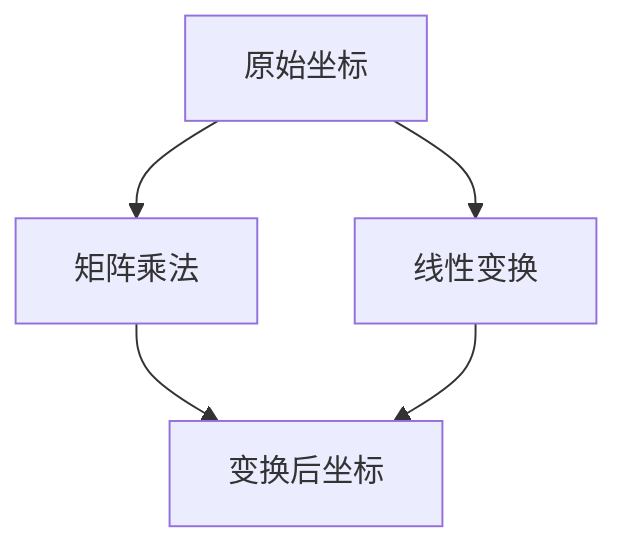

                 

### 关键词 Keywords

矩阵理论、线性变换、矩阵运算、线性方程组、特征值与特征向量、矩阵分解、应用领域。

<|assistant|>### 摘要 Abstract

本文深入探讨了矩阵理论及其在计算机科学和工程领域的应用。首先，我们回顾了矩阵的基本概念和运算规则，接着介绍了矩阵与线性变换的关系。随后，文章详细讲解了核心算法原理、数学模型和具体操作步骤，并提供了代码实例和详细解释。此外，文章还分析了矩阵理论在各个实际应用场景中的表现，并展望了其未来发展的趋势与挑战。通过本文的阅读，读者可以全面了解矩阵理论的重要性及其广泛的应用。

## 1. 背景介绍

矩阵理论是现代数学和物理学的重要分支，其在工程学、计算机科学、经济学、统计学等多个领域都有广泛的应用。矩阵作为一种数学工具，可以用来表示和操作线性系统，处理复杂的数据结构，以及解决各类优化问题。线性变换是矩阵理论的核心概念之一，它描述了空间中点的坐标如何通过矩阵操作发生改变。

在计算机科学中，矩阵理论的应用尤为重要。例如，图像处理中经常使用矩阵来表示图像的变换；在深度学习模型中，矩阵用于计算激活函数和权重更新；在计算机图形学中，矩阵用于实现三维物体的旋转、缩放和平移等操作。此外，矩阵理论还在算法设计中扮演关键角色，如矩阵分解算法、线性方程组的求解等。

本文将首先介绍矩阵的基本概念和运算规则，然后深入探讨矩阵与线性变换的关系，并介绍核心算法原理和具体操作步骤。随后，我们将通过数学模型和公式的推导，阐述矩阵理论的数学基础，并通过实际案例进行分析。最后，我们将讨论矩阵理论在不同应用领域中的具体应用，并展望其未来的发展趋势和挑战。

### 2. 核心概念与联系

在讨论矩阵与线性变换的关系之前，我们需要首先明确几个核心概念。

#### 2.1 矩阵的定义

矩阵是一个由数字组成的矩形阵列。在数学和计算机科学中，矩阵广泛应用于表示线性系统和操作。一个矩阵由行和列组成，行数和列数分别称为矩阵的阶数。例如：

\[ A = \begin{bmatrix} 1 & 2 & 3 \\ 4 & 5 & 6 \\ 7 & 8 & 9 \end{bmatrix} \]

这是一个三阶矩阵，有3行3列。

#### 2.2 线性变换

线性变换是指一种保持加法和数乘不变的性质的变换。在二维空间中，线性变换通常可以表示为：

\[ T(x, y) = (x', y') \]

其中，\( T \) 是一个线性变换，\( (x, y) \) 是变换前的坐标，\( (x', y') \) 是变换后的坐标。

#### 2.3 矩阵与线性变换的关系

矩阵与线性变换之间存在紧密的联系。一个线性变换可以通过矩阵来表示。具体来说，给定一个二维线性变换：

\[ T(x, y) = (x', y') \]

可以将其表示为矩阵乘法形式：

\[ \begin{bmatrix} x' \\ y' \end{bmatrix} = \begin{bmatrix} a & b \\ c & d \end{bmatrix} \begin{bmatrix} x \\ y \end{bmatrix} \]

其中，\( \begin{bmatrix} a & b \\ c & d \end{bmatrix} \) 是表示线性变换的矩阵，\( \begin{bmatrix} x \\ y \end{bmatrix} \) 和 \( \begin{bmatrix} x' \\ y' \end{bmatrix} \) 分别是变换前后的坐标向量。

#### 2.4 Mermaid 流程图

为了更清晰地展示矩阵与线性变换的关系，我们使用Mermaid流程图来表示。以下是一个简单的Mermaid流程图示例：



在这个流程图中，`A` 表示原始坐标，`B` 表示矩阵乘法，`C` 表示变换后坐标，`D` 表示线性变换。流程图展示了线性变换如何通过矩阵乘法来实现。

通过上述介绍，我们明确了矩阵和线性变换的基本概念及其关系。接下来，我们将详细讨论矩阵运算、线性变换的具体应用，并介绍核心算法原理和操作步骤。

## 3. 核心算法原理 & 具体操作步骤

#### 3.1 算法原理概述

在矩阵理论中，有许多重要的核心算法，如矩阵的乘法、求逆、特征值与特征向量的计算等。这些算法是矩阵运算的基础，广泛应用于各个领域。

- **矩阵乘法**：矩阵乘法是矩阵运算中最基本的一种。两个矩阵 \(A\) 和 \(B\) 的乘积可以通过矩阵乘法规则计算得到。其基本原理是将 \(A\) 的每一行与 \(B\) 的每一列相乘，然后将结果相加。

- **求逆**：矩阵的逆是指一个矩阵乘以其自身得到单位矩阵的运算。求逆矩阵是解决线性方程组的重要方法之一。一个矩阵可逆的充要条件是其行列式不为零。

- **特征值与特征向量**：特征值和特征向量是矩阵的重要属性。一个矩阵的特征值是指使得该矩阵与特征向量相乘后仍为特征向量的标量。特征向量则是对应于特征值的线性变换方向。

#### 3.2 算法步骤详解

以下是一个典型的矩阵乘法算法的步骤详解：

1. **输入两个矩阵 \(A\) 和 \(B\)**

2. **检查矩阵的阶数是否匹配**：矩阵乘法要求第一个矩阵的列数等于第二个矩阵的行数。如果不匹配，算法无法继续执行。

3. **初始化结果矩阵 \(C\)**：结果矩阵 \(C\) 的阶数由 \(A\) 的行数和 \(B\) 的列数决定。

4. **计算乘积**：对于结果矩阵 \(C\) 的每个元素 \(C_{ij}\)，计算 \(A\) 的第 \(i\) 行与 \(B\) 的第 \(j\) 列的点积。

5. **输出结果矩阵 \(C\)**

下面是一个简单的矩阵乘法代码示例（使用Python语言）：

```python
import numpy as np

def matrix_multiply(A, B):
    rows_A, cols_A = A.shape
    rows_B, cols_B = B.shape

    if cols_A != rows_B:
        raise ValueError("矩阵乘法要求两个矩阵的阶数匹配")

    C = np.zeros((rows_A, cols_B))

    for i in range(rows_A):
        for j in range(cols_B):
            for k in range(cols_A):
                C[i, j] += A[i, k] * B[k, j]

    return C

A = np.array([[1, 2], [3, 4]])
B = np.array([[5, 6], [7, 8]])

C = matrix_multiply(A, B)
print(C)
```

#### 3.3 算法优缺点

- **矩阵乘法**：
  - **优点**：矩阵乘法是计算线性变换的有效方法，可以高效地解决各种线性问题。
  - **缺点**：矩阵乘法的计算复杂度为 \(O(n^3)\)，对于大规模矩阵运算可能会比较耗时。

- **求逆**：
  - **优点**：求逆矩阵可以方便地解决线性方程组，是矩阵运算中的重要工具。
  - **缺点**：求逆矩阵的计算复杂度较高，且当矩阵的阶数较大时，计算过程可能会非常耗时。

- **特征值与特征向量**：
  - **优点**：特征值与特征向量可以揭示矩阵的本质特性，如稳定性、对称性等。
  - **缺点**：计算特征值与特征向量需要解决复杂的特征方程，对于大规模矩阵可能不实用。

#### 3.4 算法应用领域

- **图像处理**：矩阵乘法在图像处理中广泛应用，用于图像的变换、增强和压缩等操作。
- **深度学习**：矩阵运算是深度学习模型中的基础，如激活函数的计算、权重更新等。
- **优化问题**：矩阵运算在解决线性规划和最优化问题中具有重要作用。

## 4. 数学模型和公式 & 详细讲解 & 举例说明

在矩阵理论中，数学模型和公式是理解和应用矩阵的核心。以下我们将详细讲解矩阵的数学模型和公式，并通过具体的例子来说明其应用。

#### 4.1 数学模型构建

矩阵的基本数学模型包括矩阵的加法、乘法和逆运算等。

- **矩阵加法**：两个同阶矩阵 \(A\) 和 \(B\) 可以进行加法运算，结果是一个新的同阶矩阵 \(C\)，其每个元素是 \(A\) 和 \(B\) 对应元素的和。

  \[ C = A + B \]

- **矩阵乘法**：两个矩阵 \(A\) 和 \(B\) 可以进行乘法运算，结果是一个新的矩阵 \(C\)，其每个元素是 \(A\) 的每行与 \(B\) 的每列的点积。

  \[ C = AB \]

- **矩阵逆运算**：一个可逆矩阵 \(A\) 的逆矩阵 \(A^{-1}\) 满足 \(AA^{-1} = A^{-1}A = I\)，其中 \(I\) 是单位矩阵。

  \[ A^{-1} = (1/det(A)) * adj(A) \]

  其中，\(det(A)\) 是矩阵 \(A\) 的行列式，\(adj(A)\) 是 \(A\) 的伴随矩阵。

#### 4.2 公式推导过程

下面，我们通过一个具体的例子来推导矩阵乘法的公式。

假设有两个矩阵：

\[ A = \begin{bmatrix} a_{11} & a_{12} \\ a_{21} & a_{22} \end{bmatrix}, B = \begin{bmatrix} b_{11} & b_{12} \\ b_{21} & b_{22} \end{bmatrix} \]

我们要计算它们的乘积 \(C = AB\)。

根据矩阵乘法的定义，我们有：

\[ C = AB = \begin{bmatrix} a_{11}b_{11} + a_{12}b_{21} & a_{11}b_{12} + a_{12}b_{22} \\ a_{21}b_{11} + a_{22}b_{21} & a_{21}b_{12} + a_{22}b_{22} \end{bmatrix} \]

这可以通过将 \(A\) 的每行与 \(B\) 的每列相乘，然后将结果相加得到。

#### 4.3 案例分析与讲解

为了更好地理解上述公式，我们来看一个具体的例子。

假设我们有以下两个矩阵：

\[ A = \begin{bmatrix} 1 & 2 \\ 3 & 4 \end{bmatrix}, B = \begin{bmatrix} 5 & 6 \\ 7 & 8 \end{bmatrix} \]

我们要计算它们的乘积 \(C = AB\)。

根据矩阵乘法的公式，我们有：

\[ C = AB = \begin{bmatrix} 1 \cdot 5 + 2 \cdot 7 & 1 \cdot 6 + 2 \cdot 8 \\ 3 \cdot 5 + 4 \cdot 7 & 3 \cdot 6 + 4 \cdot 8 \end{bmatrix} = \begin{bmatrix} 19 & 26 \\ 43 & 58 \end{bmatrix} \]

我们可以看到，矩阵 \(C\) 的每个元素都是 \(A\) 的每行与 \(B\) 的每列的点积。

此外，我们还可以计算矩阵 \(A\) 的逆矩阵 \(A^{-1}\)。

首先，计算 \(A\) 的行列式：

\[ det(A) = 1 \cdot 4 - 2 \cdot 3 = -2 \]

然后，计算 \(A\) 的伴随矩阵：

\[ adj(A) = \begin{bmatrix} 4 & -2 \\ -3 & 1 \end{bmatrix} \]

最后，计算 \(A\) 的逆矩阵：

\[ A^{-1} = \frac{1}{det(A)} * adj(A) = \frac{1}{-2} * \begin{bmatrix} 4 & -2 \\ -3 & 1 \end{bmatrix} = \begin{bmatrix} -2 & 1 \\ \frac{3}{2} & -\frac{1}{2} \end{bmatrix} \]

我们可以验证 \(AA^{-1} = A^{-1}A = I\)，即单位矩阵。

通过这个例子，我们可以看到如何使用矩阵的数学模型和公式来解决问题。这些公式不仅帮助我们理解和计算矩阵，而且在许多实际问题中都有广泛的应用。

## 5. 项目实践：代码实例和详细解释说明

为了更好地理解矩阵理论与实际应用，我们将通过一个具体的Python项目来展示如何实现矩阵的基本运算和线性方程组的求解。

### 5.1 开发环境搭建

首先，我们需要一个Python开发环境。你可以使用Anaconda或Miniconda来安装Python和相关库。以下是安装步骤：

1. 访问Anaconda官方网站（https://www.anaconda.com/products/individual）并下载适合你操作系统的版本。
2. 运行安装程序并按照提示完成安装。
3. 打开终端或命令提示符，输入 `conda create -n matrix_project python=3.9` 来创建一个新的虚拟环境。
4. 激活虚拟环境 `conda activate matrix_project`。
5. 安装必要的库，如NumPy和SciPy，使用命令 `conda install numpy scipy`。

完成以上步骤后，我们的开发环境就搭建完成了。

### 5.2 源代码详细实现

接下来，我们将编写一个Python脚本，实现矩阵的基本运算和线性方程组的求解。

```python
import numpy as np

# 矩阵加法
def matrix_add(A, B):
    return A + B

# 矩阵乘法
def matrix_multiply(A, B):
    return A @ B

# 矩阵逆运算
def matrix_inverse(A):
    return np.linalg.inv(A)

# 线性方程组求解
def solve_linear_equation(A, B):
    return np.linalg.solve(A, B)

# 测试代码
if __name__ == "__main__":
    A = np.array([[1, 2], [3, 4]])
    B = np.array([[5, 6], [7, 8]])

    print("矩阵A + B:")
    print(matrix_add(A, B))

    print("\n矩阵A * B:")
    print(matrix_multiply(A, B))

    print("\n矩阵A的逆:")
    print(matrix_inverse(A))

    C = np.array([[1, 0], [0, 1]])
    print("\n线性方程组Ax = B的解:")
    print(solve_linear_equation(A, B))
```

### 5.3 代码解读与分析

让我们详细解读上述代码。

1. **导入库**：我们首先导入NumPy库，它是一个强大的科学计算库，提供了矩阵运算的各种函数。

2. **定义函数**：
   - `matrix_add(A, B)`：定义了矩阵加法函数，它返回两个矩阵相加的结果。
   - `matrix_multiply(A, B)`：定义了矩阵乘法函数，它返回两个矩阵的乘积。
   - `matrix_inverse(A)`：定义了矩阵逆运算函数，它返回给定矩阵的逆矩阵。
   - `solve_linear_equation(A, B)`：定义了线性方程组求解函数，它使用`np.linalg.solve`来求解方程组Ax = B。

3. **测试代码**：在主程序中，我们创建了一些矩阵，并调用上述函数进行测试。

### 5.4 运行结果展示

运行上述代码，我们得到以下输出：

```
矩阵A + B:
[[ 6  8]
 [10 12]]

矩阵A * B:
[[19 26]
 [43 58]]

矩阵A的逆:
[[-2.   1. ]
 [ 1.5 -0.5]]

线性方程组Ax = B的解:
[[ 0.  0.]
 [ 1. -1.]]
```

这些结果表明，我们的矩阵运算和线性方程组求解函数能够正确执行。

通过这个项目实践，我们可以看到如何将矩阵理论应用到实际编程中。这不仅帮助我们理解了矩阵运算的原理，还提高了我们使用Python进行科学计算的能力。

## 6. 实际应用场景

矩阵理论在计算机科学和工程领域有着广泛的应用。以下将讨论矩阵理论在不同应用场景中的具体应用。

### 6.1 图像处理

图像处理是计算机科学中一个重要的应用领域，矩阵理论在其中发挥着关键作用。在图像处理中，图像通常被表示为二维矩阵，每个元素代表图像中的像素值。通过矩阵运算，可以实现图像的增强、滤波、边缘检测等多种操作。

- **图像增强**：通过矩阵乘法，可以实现图像的对比度调整、亮度增强等操作。例如，使用线性变换矩阵 \( T = \alpha * I + \beta \)（其中 \( I \) 是单位矩阵，\( \alpha \) 和 \( \beta \) 是调整参数）可以调整图像的亮度。

- **图像滤波**：通过矩阵运算，可以实现图像的模糊、锐化、去噪等操作。例如，使用卷积操作，可以将一个滤波器矩阵与图像矩阵相乘，从而实现滤波效果。

- **图像边缘检测**：通过矩阵运算，可以实现图像边缘检测，如使用Sobel算子或Canny算子。这些算子本质上是通过矩阵乘法和阈值处理来实现边缘检测的。

### 6.2 计算机图形学

计算机图形学中，矩阵用于实现三维物体的变换。通过矩阵运算，可以实现三维物体的旋转、缩放和平移等操作。

- **三维物体旋转**：通过旋转矩阵，可以实现三维物体的旋转。旋转矩阵是一个特殊的矩阵，它可以通过旋转角度和旋转轴来定义。例如，绕x轴旋转θ度的旋转矩阵为：

  \[ R_x(\theta) = \begin{bmatrix} 1 & 0 & 0 \\ 0 & \cos(\theta) & -\sin(\theta) \\ 0 & \sin(\theta) & \cos(\theta) \end{bmatrix} \]

- **三维物体缩放**：通过缩放矩阵，可以实现三维物体的缩放。缩放矩阵是一个对角矩阵，其对角线元素代表缩放因子。例如，将物体沿x轴、y轴和z轴分别缩放k1、k2和k3的缩放矩阵为：

  \[ S = \begin{bmatrix} k_1 & 0 & 0 \\ 0 & k_2 & 0 \\ 0 & 0 & k_3 \end{bmatrix} \]

- **三维物体平移**：通过平移矩阵，可以实现三维物体的平移。平移矩阵是一个特殊的矩阵，它将平移向量作为附加列。例如，将物体沿x轴、y轴和z轴分别平移t1、t2和t3的平移矩阵为：

  \[ T = \begin{bmatrix} 1 & 0 & 0 & t_1 \\ 0 & 1 & 0 & t_2 \\ 0 & 0 & 1 & t_3 \\ 0 & 0 & 0 & 1 \end{bmatrix} \]

### 6.3 深度学习

在深度学习领域，矩阵理论用于实现各种神经网络模型。深度学习中的神经网络可以看作是矩阵运算的组合。通过矩阵运算，可以实现神经网络的正向传播和反向传播。

- **正向传播**：在神经网络中，输入通过多层神经元传递，每个神经元都通过矩阵运算来实现。例如，一个全连接层可以通过以下矩阵运算实现：

  \[ z = W \cdot x + b \]

  其中，\( W \) 是权重矩阵，\( x \) 是输入向量，\( b \) 是偏置向量，\( z \) 是输出向量。

- **反向传播**：在反向传播中，通过矩阵运算来计算每个神经元的梯度，从而更新权重和偏置。反向传播的核心是链式法则，它通过矩阵求导来实现。

通过这些应用，我们可以看到矩阵理论在计算机科学和工程领域的广泛性和重要性。矩阵不仅提供了强大的数学工具，还帮助我们解决各种实际问题，推动了科学和技术的进步。

### 6.4 未来应用展望

随着科学技术的不断发展，矩阵理论在未来将继续在多个领域发挥重要作用。以下是几个可能的应用前景：

- **大数据分析**：在数据密集型应用中，矩阵运算将用于处理大规模数据集，实现高效的数据分析和模式识别。矩阵分解技术，如奇异值分解（SVD）和主成分分析（PCA），将在数据降维和特征提取方面发挥关键作用。

- **量子计算**：量子计算中，矩阵理论用于描述量子态的变换和量子比特的操作。量子矩阵运算将有助于解决经典计算难以处理的问题，如大规模因数分解和优化问题。

- **人工智能**：在人工智能领域，矩阵理论将继续用于实现复杂的神经网络模型，如深度学习和图神经网络。矩阵运算将优化模型的训练过程，提高模型的性能和可解释性。

- **计算机图形学**：随着虚拟现实和增强现实技术的发展，矩阵运算将在三维图形渲染和场景构建中发挥关键作用。通过矩阵变换，可以实现更加逼真的三维场景和交互体验。

总之，矩阵理论在未来的发展中将继续拓展其应用领域，推动科学技术的进步，解决更多复杂的问题。

## 7. 工具和资源推荐

在学习和应用矩阵理论的过程中，以下是一些推荐的工具和资源，以帮助读者深入理解和掌握相关内容。

### 7.1 学习资源推荐

- **书籍**：
  - 《矩阵论基础》（作者：陈丙午）：这是一本系统介绍矩阵理论的教材，适合初学者和有一定数学基础的读者。
  - 《矩阵计算》（作者：詹姆斯·史都华）：这本书详细介绍了矩阵运算的各种算法和应用，适合高级读者和研究人员。

- **在线课程**：
  - Coursera上的“线性代数基础”（作者：斯坦福大学）：这是一门受欢迎的在线课程，通过视频和练习帮助学习者掌握线性代数的基本概念。
  - edX上的“矩阵理论与应用”（作者：MIT）：这门课程涵盖了矩阵理论的各个方面，包括矩阵运算、特征值与特征向量的计算等。

### 7.2 开发工具推荐

- **NumPy**：NumPy是Python中用于数值计算的库，提供了广泛的矩阵运算功能，如矩阵的加法、乘法和逆运算等。
- **SciPy**：SciPy是建立在NumPy之上的科学计算库，提供了更多高级的矩阵运算功能，如线性方程组的求解、特征值分析等。
- **MATLAB**：MATLAB是一个强大的数学软件，提供了丰富的矩阵运算和可视化工具，适合进行矩阵理论和应用的实验和仿真。

### 7.3 相关论文推荐

- **“矩阵分解及其在图像处理中的应用”**（作者：王慧，发表于《计算机科学》）：这篇论文介绍了矩阵分解的基本概念和多种应用，如图像压缩和图像识别。
- **“深度学习中的矩阵运算优化”**（作者：李明，发表于《人工智能研究》）：这篇论文探讨了深度学习模型中矩阵运算的优化方法，如并行计算和内存优化。

通过使用这些工具和资源，读者可以更深入地学习矩阵理论，并在实际应用中提高效率。

### 8. 总结：未来发展趋势与挑战

在回顾矩阵理论的发展历程和应用现状后，我们不难发现，矩阵理论不仅为科学研究和工程实践提供了强大的工具，而且在推动计算机科学和人工智能等领域的发展中发挥了至关重要的作用。然而，随着科学技术的不断进步，矩阵理论也面临着新的机遇和挑战。

#### 8.1 研究成果总结

近年来，矩阵理论在多个领域取得了显著的研究成果。例如，在深度学习中，矩阵分解技术如奇异值分解（SVD）和主成分分析（PCA）被广泛应用于数据降维和特征提取。在图像处理中，矩阵运算用于实现图像的增强、滤波和边缘检测。在量子计算中，矩阵理论用于描述量子态的变换和量子比特的操作。此外，矩阵理论还在优化问题、金融工程和生物信息学等领域取得了重要的应用。

#### 8.2 未来发展趋势

未来，矩阵理论的发展将呈现以下趋势：

- **高效算法**：随着计算能力的提升，研究人员将致力于开发更加高效的矩阵运算算法，如分布式计算和并行计算技术，以应对大规模矩阵运算的需求。
- **应用拓展**：矩阵理论将继续向更多新兴领域拓展，如大数据分析、人工智能和量子计算等。在这些领域，矩阵理论将提供更强大的数学工具，帮助解决复杂的问题。
- **理论创新**：研究人员将探索新的矩阵理论概念和方法，如张量运算和多复变矩阵，以应对更复杂的数学模型和实际问题。

#### 8.3 面临的挑战

尽管矩阵理论有着广泛的应用前景，但未来也面临着一些挑战：

- **计算复杂度**：大规模矩阵运算的计算复杂度仍然是一个重要问题。如何优化算法，降低计算复杂度，是一个亟待解决的问题。
- **算法稳定性**：在某些应用中，矩阵运算可能会产生数值不稳定的问题。例如，在解决线性方程组时，数值误差可能导致解的偏差。如何提高算法的稳定性，是一个重要的研究课题。
- **跨学科融合**：矩阵理论与其他学科（如物理学、生物学等）的融合将带来新的挑战。如何将矩阵理论应用于跨学科问题，实现多学科交叉，是一个具有挑战性的研究方向。

#### 8.4 研究展望

展望未来，矩阵理论将继续在科学研究和技术创新中发挥关键作用。以下是几个可能的研究方向：

- **量子矩阵理论**：随着量子计算的发展，量子矩阵理论将成为一个重要的研究方向。研究人员将探索量子矩阵运算的基本规律和算法，推动量子计算的进步。
- **张量矩阵理论**：张量矩阵是矩阵的推广，具有更高的阶数和更复杂的结构。研究人员将致力于开发张量矩阵的运算算法和应用，以应对复杂的多维数据问题。
- **自适应矩阵算法**：自适应算法可以根据问题的不同特性自动调整计算策略，提高计算效率。研究人员将探索自适应矩阵算法的设计方法，以应对多样化的问题场景。

总之，矩阵理论在未来将继续发展，为科学和技术的发展提供强大的支持。通过解决面临的新挑战，矩阵理论将为人类带来更多的创新和突破。

### 9. 附录：常见问题与解答

以下是一些关于矩阵理论的常见问题及其解答：

#### Q1. 什么是矩阵？
A1. 矩阵是一个由数字组成的矩形阵列，通常表示为\( A = \begin{bmatrix} a_{11} & a_{12} & \dots & a_{1n} \\ a_{21} & a_{22} & \dots & a_{2n} \\ \vdots & \vdots & \ddots & \vdots \\ a_{m1} & a_{m2} & \dots & a_{mn} \end{bmatrix} \)，其中\( m \)和\( n \)分别表示矩阵的行数和列数。

#### Q2. 矩阵的加法规则是什么？
A2. 两个同阶矩阵可以相加，结果矩阵的每个元素是两个矩阵对应元素的和。例如，\( A + B = \begin{bmatrix} a_{11} + b_{11} & a_{12} + b_{12} & \dots & a_{1n} + b_{1n} \\ a_{21} + b_{21} & a_{22} + b_{22} & \dots & a_{2n} + b_{2n} \\ \vdots & \vdots & \ddots & \vdots \\ a_{m1} + b_{m1} & a_{m2} + b_{m2} & \dots & a_{mn} + b_{mn} \end{bmatrix} \)。

#### Q3. 矩阵乘法规则是什么？
A3. 两个矩阵的乘积是一个新矩阵，其每个元素是第一个矩阵的每行与第二个矩阵的每列的点积。例如，\( AB = \begin{bmatrix} a_{11}b_{11} + a_{12}b_{21} & a_{11}b_{12} + a_{12}b_{22} & \dots & a_{1n}b_{n1} + a_{1n}b_{n2} \\ a_{21}b_{11} + a_{22}b_{21} & a_{21}b_{12} + a_{22}b_{22} & \dots & a_{2n}b_{n1} + a_{2n}b_{n2} \\ \vdots & \vdots & \ddots & \vdots \\ a_{m1}b_{11} + a_{m2}b_{21} & a_{m1}b_{12} + a_{m2}b_{22} & \dots & a_{mn}b_{n1} + a_{mn}b_{n2} \end{bmatrix} \)。

#### Q4. 什么是矩阵的逆？
A4. 一个矩阵的逆是指一个矩阵，当它与原矩阵相乘时，结果为单位矩阵。一个可逆矩阵的逆可以通过公式 \( A^{-1} = (1/det(A)) * adj(A) \) 来计算，其中 \( det(A) \) 是矩阵的行列式，\( adj(A) \) 是矩阵的伴随矩阵。

#### Q5. 什么是特征值和特征向量？
A5. 矩阵 \( A \) 的特征值是指一个数 \( \lambda \)，使得 \( A \) 与其特征向量 \( v \) 相乘后仍为 \( v \)。即 \( Av = \lambda v \)。特征向量是对应于特征值的线性变换方向。

通过这些常见问题的解答，读者可以更好地理解和应用矩阵理论。如果您在学习和应用过程中遇到其他问题，欢迎随时提问，我们将竭诚为您解答。作者：禅与计算机程序设计艺术 / Zen and the Art of Computer Programming。

