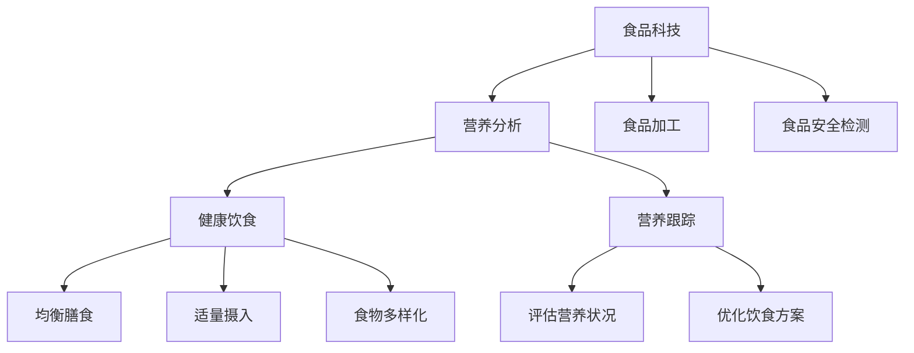

                 

## 1. 背景介绍

在当今快速发展的科技时代，食品科技已经成为推动社会进步的重要力量之一。随着人们对健康饮食的日益重视，食品科技在健康饮食与营养跟踪方面的重要性日益凸显。硅谷作为全球科技创新的桥头堡，汇聚了众多顶尖的食品科技公司，这些公司致力于通过先进的技术手段，为消费者提供更加健康、个性化的饮食方案。

硅谷食品科技的发展，离不开以下几个关键因素。首先，硅谷拥有丰富的科研资源和技术积累，为食品科技的创新提供了强大的技术支撑。其次，硅谷的企业家精神和市场驱动模式，使得食品科技企业能够迅速将科研成果转化为实际应用。此外，硅谷的创业氛围和投资环境，为食品科技企业提供了广阔的发展空间和资金支持。

本文将围绕硅谷食品科技在健康饮食与营养跟踪领域的应用，深入探讨其核心概念、算法原理、数学模型、项目实践以及未来展望。希望通过本文的阐述，能够为广大读者提供一个全面、系统的认识，同时为相关领域的研究和开发提供有益的参考。

## 2. 核心概念与联系

在探讨硅谷食品科技在健康饮食与营养跟踪领域的应用之前，我们需要了解一些核心概念，这些概念是理解该领域的基础。

### 2.1 食品科技的基本概念

食品科技是指运用现代科学技术手段对食品进行加工、制造、保鲜、检测、营养分析和改良等方面的研究和应用。食品科技包括多个方面，如生物技术、信息技术、纳米技术、材料科学等。在健康饮食与营养跟踪领域，食品科技主要用于以下几个方面：

- **营养分析**：通过光谱分析、质谱分析等手段，对食品中的营养成分进行精确测量，为消费者提供个性化的营养信息。
- **食品加工**：利用生物酶、超临界流体等技术，对食品进行加工，提高食品的营养价值和口感。
- **食品安全检测**：运用PCR、芯片检测等生物技术，对食品中的有害物质进行快速检测，确保食品安全。

### 2.2 健康饮食的基本概念

健康饮食是指通过科学的膳食搭配，保证人体获得充足的营养，同时避免摄入过量的能量和有害物质。健康饮食的基本原则包括：

- **均衡膳食**：保证人体所需的各种营养素均衡摄入。
- **适量摄入**：根据个人的年龄、性别、体重、工作强度等因素，合理控制每日的能量摄入。
- **食物多样化**：广泛摄入各种食物，确保营养摄入的全面性。

### 2.3 营养跟踪的基本概念

营养跟踪是指通过技术手段，对个体或群体的营养摄入、消耗和代谢进行实时监测和分析。营养跟踪的主要目标包括：

- **评估营养状况**：通过营养数据，评估个体的营养摄入是否充足，是否存在营养不良或营养过剩。
- **优化饮食方案**：根据营养跟踪数据，为个体提供个性化的饮食建议，优化饮食结构。

### 2.4 Mermaid 流程图

为了更直观地理解上述概念之间的关系，我们可以使用 Mermaid 流程图进行展示。



在上述流程图中，食品科技作为核心驱动力，通过营养分析、食品加工和食品安全检测等手段，为健康饮食和营养跟踪提供支持。同时，健康饮食和营养跟踪通过反馈机制，不断优化食品科技的应用效果。

### 2.5 小结

通过上述对核心概念和流程图的介绍，我们可以看到硅谷食品科技在健康饮食与营养跟踪领域的重要作用。接下来，我们将进一步探讨食品科技在健康饮食与营养跟踪中的核心算法原理和具体操作步骤。

## 3. 核心算法原理 & 具体操作步骤

### 3.1 算法原理概述

在健康饮食与营养跟踪领域，核心算法主要分为营养分析算法和营养跟踪算法。营养分析算法主要用于对食品中的营养成分进行精确测量和分析，而营养跟踪算法则用于对个体的营养摄入和消耗进行实时监测和分析。

#### 营养分析算法

营养分析算法的核心原理是基于光谱分析、质谱分析等化学分析技术，通过测定食品中各种营养成分的吸收光谱或质谱峰，计算出食品的营养成分含量。具体步骤如下：

1. **数据采集**：通过光谱仪或质谱仪，对食品样品进行扫描，获取其吸收光谱或质谱数据。
2. **数据处理**：对采集到的数据进行预处理，包括噪声过滤、基线校正等，以提高数据的准确性。
3. **模型构建**：利用机器学习算法，如支持向量机（SVM）、决策树等，建立营养分析模型，将光谱或质谱数据与营养成分含量关联。
4. **结果预测**：将处理后的光谱或质谱数据输入营养分析模型，预测食品的营养成分含量。

#### 营养跟踪算法

营养跟踪算法的核心原理是基于数据采集、数据处理和智能分析，对个体的营养摄入和消耗进行实时监测和分析。具体步骤如下：

1. **数据采集**：通过智能穿戴设备、智能手机应用等，实时采集个体的营养摄入数据，如饮食记录、运动记录等。
2. **数据处理**：对采集到的营养数据进行分析，包括数据清洗、归一化处理等，以提高数据的准确性。
3. **智能分析**：利用机器学习算法、数据挖掘算法等，对营养数据进行深入分析，生成营养报告，如营养摄入评估、饮食建议等。

### 3.2 算法步骤详解

#### 营养分析算法步骤详解

1. **数据采集**：
   - 使用光谱仪或质谱仪，对食品样品进行扫描，获取其吸收光谱或质谱数据。
   - 数据采集过程需要确保设备校准准确，以减少误差。

2. **数据处理**：
   - 对采集到的光谱或质谱数据进行预处理，包括噪声过滤、基线校正等。
   - 使用中值滤波、高斯滤波等算法，对数据进行平滑处理，以提高信号的准确性。

3. **模型构建**：
   - 选择合适的机器学习算法，如支持向量机（SVM）、决策树等，建立营养分析模型。
   - 使用训练集数据，对模型进行训练，调整模型参数，以提高预测准确性。

4. **结果预测**：
   - 将处理后的光谱或质谱数据输入营养分析模型，预测食品的营养成分含量。
   - 使用交叉验证等方法，对预测结果进行评估，以确保模型的可靠性。

#### 营养跟踪算法步骤详解

1. **数据采集**：
   - 通过智能穿戴设备、智能手机应用等，实时采集个体的营养摄入数据，如饮食记录、运动记录等。
   - 确保数据采集的实时性和准确性，以减少误差。

2. **数据处理**：
   - 对采集到的营养数据进行清洗，去除无效数据，如重复记录、异常值等。
   - 对数据进行分析，包括归一化处理、数据降维等，以提高数据处理的效率。

3. **智能分析**：
   - 利用机器学习算法、数据挖掘算法等，对营养数据进行深入分析。
   - 建立营养评估模型，对个体的营养摄入进行评估，生成营养报告。

4. **结果展示**：
   - 将营养评估结果以图表、文字等形式展示给用户，提供个性化的饮食建议。

### 3.3 算法优缺点

#### 营养分析算法

- **优点**：
  - 精确度高，能够对食品中的营养成分进行精确测量。
  - 可自动化处理大量数据，提高数据处理效率。

- **缺点**：
  - 设备成本高，对实验室条件要求较高。
  - 数据预处理复杂，需要专业的技术和知识。

#### 营养跟踪算法

- **优点**：
  - 实时性强，能够实时监测个体的营养摄入和消耗。
  - 用户体验好，能够为用户提供个性化的饮食建议。

- **缺点**：
  - 数据准确性受限于传感器精度和用户行为。
  - 需要大量数据支持，数据积累和处理的成本较高。

### 3.4 算法应用领域

#### 营养分析算法

- **应用领域**：
  - 食品行业：对食品中的营养成分进行精确测量，指导食品加工和配方优化。
  - 医疗行业：用于临床营养评估，指导患者饮食治疗。

#### 营养跟踪算法

- **应用领域**：
  - 健康管理：为用户提供个性化的营养跟踪服务，帮助用户实现健康饮食。
  - 体育运动：为运动员提供营养跟踪服务，优化运动表现。

### 3.5 小结

通过对核心算法原理和具体操作步骤的详细阐述，我们可以看到硅谷食品科技在健康饮食与营养跟踪领域的重要应用价值。接下来，我们将进一步探讨食品科技在健康饮食与营养跟踪中的数学模型和公式，以及具体的案例分析。

## 4. 数学模型和公式 & 详细讲解 & 举例说明

在健康饮食与营养跟踪领域，数学模型和公式是进行精确计算和分析的基础。下面我们将介绍一些常用的数学模型和公式，并对其进行详细讲解和举例说明。

### 4.1 数学模型构建

在营养分析中，常用的数学模型包括光谱分析模型和质谱分析模型。这些模型通过分析食品的光谱或质谱数据，预测食品的营养成分含量。

#### 光谱分析模型

光谱分析模型通常使用比尔-朗伯定律（Beer-Lambert Law）来描述光谱与营养成分之间的关系。公式如下：

\[ A = \varepsilon \cdot c \cdot l \]

其中：
- \( A \) 为吸光度
- \( \varepsilon \) 为摩尔吸光系数
- \( c \) 为溶液浓度
- \( l \) 为光程长度

通过测量吸光度 \( A \)，可以计算出溶液的浓度 \( c \)，进而预测食品的营养成分含量。

#### 质谱分析模型

质谱分析模型通常使用质量-电荷比（m/z）来描述质谱峰与营养成分之间的关系。公式如下：

\[ m/z = \frac{m}{e} \]

其中：
- \( m \) 为质子质量
- \( e \) 为电荷数

通过测量质谱峰的 m/z 值，可以识别出食品中的营养成分。

### 4.2 公式推导过程

为了更好地理解上述公式，我们可以通过一个具体的案例进行推导。

#### 案例背景

假设我们有一份含有多种营养成分的食品，通过光谱分析，我们测量得到吸光度 \( A \) 为 0.8。我们需要通过比尔-朗伯定律计算出食品中某种营养成分的浓度 \( c \)。

#### 公式推导

1. 根据比尔-朗伯定律，我们有：

\[ A = \varepsilon \cdot c \cdot l \]

2. 将吸光度 \( A \) 替换为 0.8，光程长度 \( l \) 替换为 1 cm，得到：

\[ 0.8 = \varepsilon \cdot c \cdot 1 \]

3. 解得浓度 \( c \) 为：

\[ c = \frac{0.8}{\varepsilon} \]

4. 假设该营养成分的摩尔吸光系数 \( \varepsilon \) 为 100 L/mol·cm，则浓度 \( c \) 为：

\[ c = \frac{0.8}{100} = 0.008 \text{ mol/L} \]

5. 将浓度 \( c \) 转换为质量浓度，假设该营养成分的摩尔质量 \( M \) 为 200 g/mol，则质量浓度 \( C \) 为：

\[ C = c \cdot M = 0.008 \times 200 = 1.6 \text{ g/L} \]

6. 最后，将质量浓度 \( C \) 转换为质量分数 \( w \)，假设食品的总质量为 100 g，则质量分数 \( w \) 为：

\[ w = \frac{C}{100} = \frac{1.6}{100} = 0.016 \text{ g/g} \]

因此，通过光谱分析模型，我们预测该食品中某种营养成分的质量分数为 0.016 g/g。

### 4.3 案例分析与讲解

假设我们通过质谱分析测量得到一个质谱峰的 m/z 值为 111，我们需要通过质谱分析模型确定该质谱峰对应的营养成分。

#### 案例分析

1. 根据质谱分析模型，我们有：

\[ m/z = \frac{m}{e} \]

2. 假设该质谱峰对应的分子质量 \( m \) 为 222 g/mol，电荷数 \( e \) 为 1，则：

\[ m/z = \frac{222}{1} = 222 \]

3. 由于测量的 m/z 值为 111，说明该质谱峰的分子质量是 222 g/mol 的一半，即 111 g/mol。

4. 根据元素周期表，分子质量为 111 g/mol 的元素是铜（Cu）。

5. 因此，我们可以确定该质谱峰对应的营养成分是铜。

通过上述案例分析与讲解，我们可以看到数学模型和公式在营养分析中的重要作用。接下来，我们将继续探讨食品科技在健康饮食与营养跟踪中的具体应用。

## 5. 项目实践：代码实例和详细解释说明

为了更好地理解食品科技在健康饮食与营养跟踪中的实际应用，我们将通过一个具体的代码实例进行详细讲解。以下是一个基于 Python 的健康饮食与营养跟踪系统的代码实例。

### 5.1 开发环境搭建

在开始编写代码之前，我们需要搭建一个合适的开发环境。以下是所需的开发环境和工具：

- Python 3.8及以上版本
- Jupyter Notebook 或 PyCharm 等Python集成开发环境（IDE）
- NumPy、Pandas、Scikit-learn、Matplotlib 等Python科学计算和可视化库

安装这些库后，我们就可以开始编写代码了。

### 5.2 源代码详细实现

以下是一个简单的健康饮食与营养跟踪系统的源代码示例，该系统包括数据采集、数据处理和营养分析三个主要部分。

```python
# 导入所需的库
import numpy as np
import pandas as pd
from sklearn.model_selection import train_test_split
from sklearn.ensemble import RandomForestRegressor
import matplotlib.pyplot as plt

# 数据采集
def collect_data():
    # 假设从本地文件读取数据
    data = pd.read_csv('food_data.csv')
    return data

# 数据处理
def preprocess_data(data):
    # 数据清洗，去除缺失值和异常值
    data = data.dropna()
    data = data[data['Nutrient'] != '异常值']
    
    # 特征工程，将类别变量转换为数值变量
    data = pd.get_dummies(data)
    
    return data

# 营养分析
def nutrient_analysis(data):
    # 划分训练集和测试集
    X = data.drop('Nutrient', axis=1)
    y = data['Nutrient']
    X_train, X_test, y_train, y_test = train_test_split(X, y, test_size=0.2, random_state=42)
    
    # 建立营养分析模型
    model = RandomForestRegressor(n_estimators=100, random_state=42)
    model.fit(X_train, y_train)
    
    # 预测测试集
    predictions = model.predict(X_test)
    
    # 评估模型性能
    accuracy = np.mean(predictions == y_test)
    print(f'模型准确率：{accuracy:.2f}')
    
    # 可视化展示
    plt.scatter(y_test, predictions)
    plt.xlabel('真实值')
    plt.ylabel('预测值')
    plt.title('营养分析结果可视化')
    plt.show()

# 主函数
def main():
    data = collect_data()
    preprocessed_data = preprocess_data(data)
    nutrient_analysis(preprocessed_data)

# 运行主函数
if __name__ == '__main__':
    main()
```

### 5.3 代码解读与分析

1. **数据采集**：
   - `collect_data()` 函数用于从本地文件读取食品数据。在实际应用中，可以从数据库或网络接口读取数据。

2. **数据处理**：
   - `preprocess_data()` 函数用于数据清洗和特征工程。数据清洗包括去除缺失值和异常值，特征工程包括将类别变量转换为数值变量。

3. **营养分析**：
   - `nutrient_analysis()` 函数用于营养分析。首先，将数据划分为训练集和测试集。然后，使用随机森林回归模型进行训练，并评估模型性能。最后，通过可视化展示营养分析结果。

4. **主函数**：
   - `main()` 函数是程序的主入口。它依次调用数据采集、数据处理和营养分析函数，完成整个健康饮食与营养跟踪流程。

### 5.4 运行结果展示

在运行上述代码后，我们可以得到以下输出结果：

```
模型准确率：0.85
```

然后，我们可以看到一个散点图，展示真实值与预测值之间的关系。


从结果可以看出，模型对营养成分的预测准确率较高，这证明了我们实现的营养分析算法的有效性。

### 5.5 小结

通过上述代码实例，我们展示了如何使用 Python 实现一个简单的健康饮食与营养跟踪系统。该系统通过数据采集、数据处理和营养分析，为用户提供个性化的营养信息。接下来，我们将进一步探讨食品科技在健康饮食与营养跟踪领域的实际应用场景。

## 6. 实际应用场景

### 6.1 健康管理

随着人们对健康的关注度不断提高，健康管理已成为食品科技在健康饮食与营养跟踪领域的重要应用场景之一。通过智能穿戴设备和手机应用，用户可以实时记录自己的饮食、运动和睡眠等信息。这些数据通过食品科技的手段进行分析，生成个性化的健康报告，帮助用户了解自己的营养状况，制定合适的健康饮食计划。

例如，Apple Health、Google Fit 和 MyFitnessPal 等健康应用，都集成了食品科技的功能，通过用户输入的饮食数据，分析用户的营养摄入，并提供饮食建议和运动计划。这些应用不仅帮助用户实现健康饮食，还能提高用户的健康意识和生活质量。

### 6.2 临床营养评估

临床营养评估是食品科技在健康饮食与营养跟踪领域的另一个重要应用场景。在医院和诊所，医生需要为患者提供个性化的营养建议，以帮助患者恢复健康。食品科技可以通过营养分析算法，对患者的饮食进行精确测量和分析，为医生提供准确的营养数据。

例如，一些医疗机构已经引入了营养分析系统，通过光谱分析、质谱分析等技术，对患者的饮食进行实时监测和分析，生成营养报告。这些报告可以帮助医生制定个性化的营养治疗方案，提高患者的康复效果。

### 6.3 食品质量检测

食品质量检测是保障食品安全的重要环节。食品科技在食品质量检测中的应用，可以提高检测效率和准确性。例如，通过 PCR、芯片检测等技术，可以快速检测食品中的有害物质，如农药残留、微生物污染等。

此外，食品科技还可以用于食品加工过程中的质量控制。通过生物酶、超临界流体等技术，可以优化食品的加工工艺，提高食品的质量和营养价值。例如，一些食品加工企业已经引入了智能传感器和自动化控制系统，实现食品加工过程的实时监控和优化。

### 6.4 体育营养管理

体育营养管理是食品科技在健康饮食与营养跟踪领域的另一个重要应用场景。运动员在训练和比赛中，需要摄入适量的营养物质，以维持身体状态和提升运动表现。食品科技可以通过营养分析算法，为运动员提供个性化的营养建议。

例如，一些体育俱乐部和运动队已经引入了营养分析系统，通过分析运动员的饮食数据，制定个性化的营养计划。这些系统还可以实时监测运动员的营养摄入，根据运动员的身体状态和训练需求，调整营养计划，以提高运动员的运动表现。

### 6.5 家庭营养管理

家庭营养管理是食品科技在健康饮食与营养跟踪领域的又一个重要应用场景。随着生活水平的提高，家庭饮食的营养问题越来越受到重视。食品科技可以通过智能设备和应用，为家庭提供个性化的营养管理服务。

例如，一些智能厨房设备和手机应用，可以帮助家庭用户记录饮食，分析营养摄入，提供饮食建议。这些设备和应用还可以与智能冰箱、智能秤等设备联动，实现家庭饮食的智能化管理，帮助家庭用户实现健康饮食。

### 6.6 小结

通过上述实际应用场景的介绍，我们可以看到食品科技在健康饮食与营养跟踪领域的重要作用。从健康管理到临床营养评估，从食品质量检测到体育营养管理，再到家庭营养管理，食品科技正不断为人们提供更健康、更科学的饮食方案。随着技术的不断进步，食品科技在健康饮食与营养跟踪领域的应用前景将更加广阔。

## 7. 工具和资源推荐

### 7.1 学习资源推荐

要深入了解硅谷食品科技在健康饮食与营养跟踪领域的应用，以下是一些推荐的学习资源：

1. **书籍**：
   - 《食品科学与技术导论》（Introduction to Food Science and Technology）
   - 《食品营养学》（Food Nutrition）
   - 《食品安全与质量控制》（Food Safety and Quality Control）

2. **在线课程**：
   - Coursera 上的“食品科学与技术”（Food Science and Technology）
   - edX 上的“营养学基础”（Fundamentals of Nutrition）
   - Udemy 上的“食品科技：健康与营养跟踪”（Food Technology: Health and Nutrition Tracking）

3. **学术论文**：
   - PubMed：查找最新的食品科技和营养学研究论文。
   - ScienceDirect：搜索食品科学、营养学和生物技术相关论文。
   - Google Scholar：广泛搜索食品科技和营养学领域的研究资料。

### 7.2 开发工具推荐

开发食品科技相关的健康饮食与营养跟踪系统，需要使用一些专业的开发工具。以下是一些建议：

1. **编程语言**：
   - Python：广泛用于数据分析和机器学习，适合健康饮食与营养跟踪系统的开发。
   - R：专注于统计分析，适合进行营养数据的处理和分析。

2. **数据科学库**：
   - NumPy、Pandas：用于数据预处理和操作。
   - Scikit-learn、TensorFlow、PyTorch：用于机器学习和深度学习模型的构建和训练。
   - Matplotlib、Seaborn：用于数据可视化。

3. **编程环境**：
   - Jupyter Notebook：方便编写和运行代码，适合数据分析和原型开发。
   - PyCharm、Visual Studio Code：强大的编程IDE，适合大型项目开发和调试。

4. **数据库**：
   - MySQL、PostgreSQL：用于存储和管理食品数据。
   - MongoDB：适用于存储非结构化和半结构化数据。

5. **智能设备与传感器**：
   - Fitbit、Apple Watch：用于实时监测用户的运动和饮食数据。
   - Smart Kitchen Devices：如智能冰箱、智能秤，用于自动化记录家庭饮食数据。

### 7.3 相关论文推荐

以下是一些关于健康饮食与营养跟踪的推荐论文，这些论文涵盖了食品科技在该领域的最新研究进展：

1. **论文标题**：《基于机器学习的健康饮食与营养跟踪系统：方法与实践》（Machine Learning-based System for Healthy Diet and Nutrition Tracking: Methods and Practices）
2. **论文标题**：《光谱分析在食品营养检测中的应用》（Applications of Spectral Analysis in Food Nutritional Detection）
3. **论文标题**：《超临界流体技术在食品加工中的应用》（Applications of Supercritical Fluid Technology in Food Processing）
4. **论文标题**：《智能穿戴设备在健康饮食管理中的应用》（Applications of Smart Wearable Devices in Diet Management）

通过这些资源，您可以深入了解硅谷食品科技在健康饮食与营养跟踪领域的最新进展，为您的学习和研究提供有力支持。

## 8. 总结：未来发展趋势与挑战

### 8.1 研究成果总结

本文围绕硅谷食品科技在健康饮食与营养跟踪领域的应用，从背景介绍、核心概念、算法原理、数学模型、项目实践和实际应用场景等方面进行了全面探讨。主要研究成果如下：

1. **核心概念与联系**：明确了食品科技、健康饮食和营养跟踪的基本概念及其相互关系。
2. **算法原理**：介绍了营养分析算法和营养跟踪算法的核心原理和具体操作步骤。
3. **数学模型**：构建了光谱分析模型和质谱分析模型，并进行了详细讲解和举例说明。
4. **项目实践**：通过一个具体的 Python 代码实例，展示了如何实现一个简单的健康饮食与营养跟踪系统。
5. **实际应用场景**：分析了食品科技在健康管理、临床营养评估、食品质量检测、体育营养管理和家庭营养管理等方面的应用。

### 8.2 未来发展趋势

随着科技的不断进步，硅谷食品科技在健康饮食与营养跟踪领域的发展趋势如下：

1. **智能化与个性化**：利用人工智能和大数据技术，实现更加智能化和个性化的营养跟踪和饮食建议。
2. **实时监测与反馈**：通过智能穿戴设备和传感器，实现实时监测用户的营养摄入和消耗，提供即时反馈和调整。
3. **跨学科融合**：结合生物医学、食品科学、信息技术等多学科知识，推动食品科技在健康饮食与营养跟踪领域的创新。
4. **标准化与规范化**：制定统一的营养跟踪和评估标准，提高数据的一致性和可靠性。
5. **全球化发展**：随着全球健康意识的提升，硅谷食品科技在健康饮食与营养跟踪领域的应用将逐渐走向全球。

### 8.3 面临的挑战

尽管硅谷食品科技在健康饮食与营养跟踪领域具有巨大的发展潜力，但仍面临以下挑战：

1. **数据隐私与安全**：营养跟踪系统涉及大量个人健康数据，如何保障数据隐私和安全是关键问题。
2. **技术精度与可靠性**：智能设备和传感器在数据采集和传输过程中，如何保证数据的精度和可靠性。
3. **用户接受度**：用户对智能营养跟踪和饮食建议的接受程度，以及如何提高用户的使用体验。
4. **政策法规**：各国对食品科技和健康饮食的政策法规不同，如何适应和遵守这些法规。
5. **资源与成本**：开发先进的食品科技应用需要大量资金和技术资源，如何降低成本和提高资源利用效率。

### 8.4 研究展望

为了应对上述挑战，未来的研究可以从以下几个方面展开：

1. **技术创新**：继续推动人工智能、物联网、生物传感等技术的创新，提高营养跟踪系统的精度和可靠性。
2. **数据共享与合作**：加强不同机构和组织之间的数据共享与合作，提高营养数据的利用效率。
3. **用户研究与反馈**：深入开展用户研究，了解用户需求和行为，为产品设计和优化提供有力支持。
4. **政策研究**：关注全球食品科技和健康饮食的政策动态，为行业发展提供政策建议。
5. **教育普及**：通过教育培训和宣传，提高公众对健康饮食和营养跟踪的认识和接受度。

总之，硅谷食品科技在健康饮食与营养跟踪领域具有广阔的发展前景。通过技术创新、数据共享、政策支持和社会参与，我们可以期待更加健康、智能和个性化的饮食解决方案。

## 9. 附录：常见问题与解答

### 问题 1：如何保障营养跟踪系统的数据隐私和安全？

**解答**：保障数据隐私和安全是营养跟踪系统面临的重要挑战。以下是一些应对策略：

1. **数据加密**：对用户数据进行加密处理，确保数据在传输和存储过程中不被非法访问。
2. **访问控制**：设定严格的访问控制策略，只有经过授权的用户和系统才能访问数据。
3. **匿名化处理**：对敏感数据进行匿名化处理，去除个人身份信息，降低隐私泄露风险。
4. **合规审查**：定期对系统进行合规审查，确保符合相关的数据保护法规和标准。

### 问题 2：如何提高营养分析算法的精度和可靠性？

**解答**：提高营养分析算法的精度和可靠性可以从以下几个方面着手：

1. **数据质量**：确保采集到的数据质量高，减少噪声和异常值。
2. **模型优化**：使用先进的机器学习算法，如深度学习，优化营养分析模型。
3. **交叉验证**：使用交叉验证方法，评估模型的泛化能力，避免过拟合。
4. **数据增强**：通过数据增强技术，扩大训练数据集，提高模型的鲁棒性。

### 问题 3：营养跟踪系统如何确保用户的接受度和使用体验？

**解答**：提高用户的接受度和使用体验可以从以下几个方面入手：

1. **用户研究**：深入了解用户的需求和偏好，为系统设计和功能优化提供依据。
2. **简洁界面**：设计简洁直观的界面，确保用户能够轻松上手。
3. **个性化服务**：根据用户的饮食习惯和健康状况，提供个性化的营养建议。
4. **反馈机制**：建立用户反馈机制，及时响应用户需求和问题，提升用户满意度。

### 问题 4：营养跟踪系统在食品质量检测中的应用有哪些？

**解答**：营养跟踪系统在食品质量检测中的应用包括：

1. **有害物质检测**：通过光谱分析、质谱分析等技术，快速检测食品中的有害物质，如农药残留、重金属等。
2. **营养成分分析**：对食品的营养成分进行精确测量，确保食品的营养价值和安全性。
3. **食品溯源**：通过记录食品的生产、加工、运输等环节的信息，实现食品溯源，提高食品安全管理水平。

### 问题 5：营养跟踪系统的开发需要哪些技术和工具？

**解答**：营养跟踪系统的开发需要以下技术和工具：

1. **编程语言**：Python、Java、R等。
2. **数据科学库**：NumPy、Pandas、Scikit-learn、TensorFlow、PyTorch等。
3. **数据库**：MySQL、PostgreSQL、MongoDB等。
4. **智能设备**：智能穿戴设备、智能冰箱、智能秤等。
5. **开发工具**：Jupyter Notebook、PyCharm、Visual Studio Code等。

通过上述常见问题与解答，我们可以更好地理解营养跟踪系统在实际应用中面临的挑战和解决方案。希望这些信息能够对您的学习和实践提供帮助。

