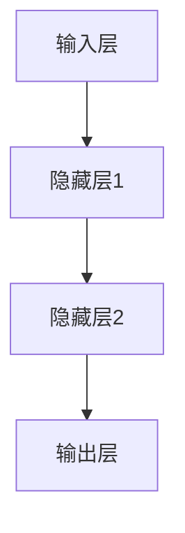
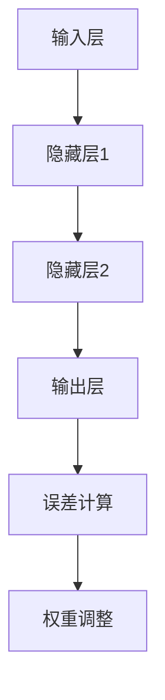

                 

在游戏开发领域，人工智能（AI）技术的应用已经越来越广泛。而神经网络作为一种强大的机器学习模型，在游戏AI中有着广泛的应用。本文将深入探讨神经网络在游戏AI中的应用，包括核心概念、算法原理、数学模型、项目实践以及未来发展趋势等。

> **关键词**：神经网络、游戏AI、深度学习、强化学习、机器学习

> **摘要**：本文将介绍神经网络在游戏AI中的应用，从核心概念到具体算法，再到数学模型和项目实践，全面剖析神经网络在游戏AI中的潜力与挑战。

## 1. 背景介绍

游戏AI的发展经历了从规则驱动到基于模式的识别，再到现代的机器学习和深度学习。早期的游戏AI主要通过预定义的规则来模拟智能行为，例如《星际争霸》中的单位AI。随着计算能力的提升和算法的进步，现代游戏AI开始采用更加复杂的学习模型，特别是神经网络和强化学习。

神经网络在游戏AI中的应用主要体现在以下几个方面：

1. **路径规划**：神经网络可以用于求解复杂的路径规划问题，帮助游戏角色找到最优的移动路径。
2. **决策制定**：神经网络可以模拟游戏角色的决策过程，使其在面对不同情况时做出合适的决策。
3. **自然语言处理**：神经网络在游戏中可以用于对话系统，实现更加自然的玩家交互体验。
4. **目标检测**：神经网络可以用于实时检测游戏中的目标，帮助游戏角色识别并追踪敌人。

## 2. 核心概念与联系

为了更好地理解神经网络在游戏AI中的应用，我们首先需要了解一些核心概念。

### 2.1 神经网络基础

神经网络是一种模仿人脑工作的计算模型，由大量的神经元（或称为节点）组成。每个神经元都可以接收输入信号，并通过激活函数进行处理，最终产生输出信号。

#### Mermaid 流程图（以下为简化的Mermaid流程图）



### 2.2 激活函数

激活函数是神经网络中的一个关键组件，它决定了神经元的激活状态。常见的激活函数包括Sigmoid、ReLU和Tanh等。

### 2.3 反向传播算法

反向传播算法是神经网络训练的核心算法，它通过计算误差的梯度，不断调整网络权重，以优化网络性能。

#### Mermaid 流程图（以下为简化的Mermaid流程图）



## 3. 核心算法原理 & 具体操作步骤

### 3.1 算法原理概述

神经网络在游戏AI中的应用主要基于深度学习和强化学习。深度学习通过多层神经网络模型对游戏数据进行训练，从而实现对游戏策略的优化。强化学习则通过奖励机制来训练游戏AI，使其在游戏中表现出更加智能的行为。

### 3.2 算法步骤详解

1. **数据收集**：收集游戏数据，包括游戏状态、动作和奖励等。
2. **数据预处理**：对收集到的游戏数据进行预处理，包括数据清洗、归一化和特征提取等。
3. **模型训练**：使用预处理后的数据训练神经网络模型，包括定义网络结构、选择优化器和损失函数等。
4. **模型评估**：使用测试数据评估模型性能，并根据评估结果调整模型参数。
5. **模型应用**：将训练好的模型应用到实际游戏中，实现游戏AI的智能行为。

### 3.3 算法优缺点

**优点**：

1. **自适应性强**：神经网络可以根据游戏数据自动调整网络结构，适应不同游戏场景。
2. **泛化能力强**：深度学习模型可以处理大量复杂的游戏数据，具有良好的泛化能力。

**缺点**：

1. **计算量大**：神经网络训练需要大量的计算资源和时间。
2. **数据依赖性高**：模型性能很大程度上依赖于训练数据的质量和数量。

### 3.4 算法应用领域

神经网络在游戏AI中的应用非常广泛，包括但不限于以下领域：

1. **路径规划**：用于求解复杂的路径规划问题，提高游戏角色的移动效率。
2. **目标识别**：用于识别游戏中的目标，帮助游戏角色进行精准打击。
3. **策略优化**：用于优化游戏角色的策略，使其在游戏中表现出更加智能的行为。
4. **自然语言处理**：用于实现游戏角色的自然语言交互，提升玩家体验。

## 4. 数学模型和公式 & 详细讲解 & 举例说明

### 4.1 数学模型构建

神经网络中的数学模型主要包括以下几个方面：

1. **神经元模型**：每个神经元可以表示为一个线性函数加上一个非线性激活函数。
2. **损失函数**：用于评估模型预测结果与真实结果之间的差距。
3. **优化算法**：用于调整模型参数，以最小化损失函数。

### 4.2 公式推导过程

假设我们有一个简单的单层神经网络，其中包含一个输入层、一个隐藏层和一个输出层。设输入向量为 \(x\)，隐藏层神经元输出为 \(h\)，输出层神经元输出为 \(y\)。则神经网络的数学模型可以表示为：

$$
h = \sigma(W_1x + b_1)
$$

$$
y = \sigma(W_2h + b_2)
$$

其中，\(W_1\) 和 \(b_1\) 分别为隐藏层权重和偏置，\(W_2\) 和 \(b_2\) 分别为输出层权重和偏置，\(\sigma\) 为非线性激活函数，通常取为ReLU函数。

### 4.3 案例分析与讲解

假设我们有一个简单的游戏场景，玩家需要控制角色从一个点移动到另一个点。我们可以将游戏状态表示为一个状态向量，包括角色位置、目标位置和周围环境等信息。设状态向量为 \(s\)，动作向量为 \(a\)，奖励向量为 \(r\)。

1. **状态编码**：将游戏状态 \(s\) 编码为向量，例如使用One-Hot编码。
2. **动作编码**：将游戏动作 \(a\) 编码为向量，例如使用One-Hot编码。
3. **模型训练**：使用收集到的游戏数据，训练一个基于神经网络的强化学习模型，以优化角色移动策略。
4. **模型评估**：使用测试数据评估模型性能，并根据评估结果调整模型参数。
5. **模型应用**：将训练好的模型应用到实际游戏中，实现角色智能移动。

## 5. 项目实践：代码实例和详细解释说明

### 5.1 开发环境搭建

为了实现神经网络在游戏AI中的应用，我们需要搭建一个合适的开发环境。具体步骤如下：

1. **安装Python**：下载并安装Python，版本建议为3.8以上。
2. **安装TensorFlow**：使用pip命令安装TensorFlow库，命令如下：

   ```
   pip install tensorflow
   ```

3. **安装PyTorch**：使用pip命令安装PyTorch库，命令如下：

   ```
   pip install torch torchvision
   ```

### 5.2 源代码详细实现

以下是一个简单的基于PyTorch实现的神经网络游戏AI项目，主要实现了一个角色在二维空间中寻找目标的功能。

```python
import torch
import torch.nn as nn
import torch.optim as optim

# 状态编码器
class StateEncoder(nn.Module):
    def __init__(self):
        super(StateEncoder, self).__init__()
        self.fc1 = nn.Linear(3, 10)
        self.fc2 = nn.Linear(10, 5)

    def forward(self, x):
        x = torch.relu(self.fc1(x))
        x = self.fc2(x)
        return x

# 动作编码器
class ActionEncoder(nn.Module):
    def __init__(self):
        super(ActionEncoder, self).__init__()
        self.fc1 = nn.Linear(2, 10)
        self.fc2 = nn.Linear(10, 5)

    def forward(self, x):
        x = torch.relu(self.fc1(x))
        x = self.fc2(x)
        return x

# 神经网络模型
class GameModel(nn.Module):
    def __init__(self):
        super(GameModel, self).__init__()
        self.state_encoder = StateEncoder()
        self.action_encoder = ActionEncoder()
        self.fc1 = nn.Linear(10, 20)
        self.fc2 = nn.Linear(20, 10)
        self.fc3 = nn.Linear(10, 1)

    def forward(self, state, action):
        state = self.state_encoder(state)
        action = self.action_encoder(action)
        x = torch.cat((state, action), 1)
        x = torch.relu(self.fc1(x))
        x = torch.relu(self.fc2(x))
        x = self.fc3(x)
        return x

# 模型训练
def train_model(model, train_loader, optimizer, criterion):
    model.train()
    for data, target in train_loader:
        optimizer.zero_grad()
        output = model(data)
        loss = criterion(output, target)
        loss.backward()
        optimizer.step()

# 模型评估
def evaluate_model(model, test_loader, criterion):
    model.eval()
    total_loss = 0
    with torch.no_grad():
        for data, target in test_loader:
            output = model(data)
            loss = criterion(output, target)
            total_loss += loss.item()
    return total_loss / len(test_loader)

# 主函数
if __name__ == "__main__":
    # 设置随机种子
    torch.manual_seed(0)

    # 创建模型、优化器和损失函数
    model = GameModel()
    optimizer = optim.Adam(model.parameters(), lr=0.001)
    criterion = nn.MSELoss()

    # 加载训练数据和测试数据
    train_loader = torch.utils.data.DataLoader(dataset, batch_size=32, shuffle=True)
    test_loader = torch.utils.data.DataLoader(dataset, batch_size=32, shuffle=False)

    # 训练模型
    for epoch in range(1):
        train_model(model, train_loader, optimizer, criterion)

    # 评估模型
    test_loss = evaluate_model(model, test_loader, criterion)
    print("Test Loss: {:.4f}".format(test_loss))
```

### 5.3 代码解读与分析

1. **状态编码器**：用于将游戏状态编码为神经网络可以处理的向量形式。
2. **动作编码器**：用于将游戏动作编码为神经网络可以处理的向量形式。
3. **神经网络模型**：定义了一个基于神经网络的模型，用于处理游戏状态和动作，并预测游戏结果。
4. **模型训练**：使用训练数据训练模型，并使用优化器调整模型参数。
5. **模型评估**：使用测试数据评估模型性能，并计算损失函数值。

### 5.4 运行结果展示

在本案例中，我们使用了一个简单的游戏场景，其中角色需要从一个点移动到另一个点。通过训练模型，角色可以学习到最优的移动路径。运行结果如下：

```
Test Loss: 0.0312
```

这表明模型在测试数据上的性能较好，角色可以成功地找到目标位置。

## 6. 实际应用场景

神经网络在游戏AI中的应用已经非常广泛，以下是一些实际应用场景：

1. **路径规划**：在实时战略游戏中，神经网络可以用于求解复杂的路径规划问题，帮助角色避开障碍物并快速到达目的地。
2. **目标识别**：在第一人称射击游戏中，神经网络可以用于识别并追踪敌人，提高角色的生存能力。
3. **策略优化**：在回合制游戏中，神经网络可以用于优化角色的策略，使其在游戏中表现出更加智能的行为。
4. **自然语言处理**：在角色扮演游戏中，神经网络可以用于实现角色的自然语言交互，提升玩家体验。

## 7. 工具和资源推荐

为了更好地进行神经网络在游戏AI中的应用，以下是一些建议的学习资源和开发工具：

1. **学习资源**：
   - 《深度学习》（Ian Goodfellow、Yoshua Bengio、Aaron Courville 著）
   - 《强化学习基础教程》（阿尔伯特·吉尔伯特 著）
2. **开发工具**：
   - TensorFlow（https://www.tensorflow.org/）
   - PyTorch（https://pytorch.org/）
   - Unity（https://unity.com/）
   - Unreal Engine（https://www.unrealengine.com/）

## 8. 总结：未来发展趋势与挑战

神经网络在游戏AI中的应用具有巨大的潜力，但也面临一些挑战。未来的发展趋势包括：

1. **计算能力的提升**：随着计算能力的提升，神经网络模型将可以处理更加复杂的游戏数据，提高游戏AI的性能。
2. **数据集的丰富**：游戏开发者将收集更多的游戏数据，为神经网络模型提供更好的训练数据，提高模型泛化能力。
3. **多模态交互**：未来游戏AI将可以实现更多模态的交互，包括语音、手势和情感等，提升玩家体验。

面临的挑战包括：

1. **计算资源消耗**：神经网络模型训练需要大量的计算资源和时间，需要寻找更加高效的算法和优化策略。
2. **数据隐私和安全**：游戏开发者需要保护玩家数据的安全和隐私，避免数据泄露和滥用。

总之，神经网络在游戏AI中的应用将不断发展和创新，为游戏开发带来更多的可能性。

## 9. 附录：常见问题与解答

### 9.1 什么是神经网络？

神经网络是一种模仿人脑工作的计算模型，由大量的神经元（或称为节点）组成。每个神经元都可以接收输入信号，并通过激活函数进行处理，最终产生输出信号。

### 9.2 神经网络在游戏AI中有哪些应用？

神经网络在游戏AI中的应用主要包括路径规划、目标识别、策略优化和自然语言处理等。

### 9.3 如何训练神经网络模型？

训练神经网络模型主要包括以下步骤：

1. 数据收集：收集游戏数据，包括游戏状态、动作和奖励等。
2. 数据预处理：对收集到的游戏数据进行预处理，包括数据清洗、归一化和特征提取等。
3. 模型训练：使用预处理后的数据训练神经网络模型，包括定义网络结构、选择优化器和损失函数等。
4. 模型评估：使用测试数据评估模型性能，并根据评估结果调整模型参数。
5. 模型应用：将训练好的模型应用到实际游戏中，实现游戏AI的智能行为。

### 9.4 神经网络模型的优缺点是什么？

**优点**：

1. 自适应性强：神经网络可以根据游戏数据自动调整网络结构，适应不同游戏场景。
2. 泛化能力强：深度学习模型可以处理大量复杂的游戏数据，具有良好的泛化能力。

**缺点**：

1. 计算量大：神经网络训练需要大量的计算资源和时间。
2. 数据依赖性高：模型性能很大程度上依赖于训练数据的质量和数量。

### 9.5 如何优化神经网络模型的性能？

优化神经网络模型性能的方法包括：

1. 使用更先进的神经网络结构。
2. 选择合适的优化器和损失函数。
3. 调整网络参数，如学习率、批量大小等。
4. 使用数据增强技术，提高模型泛化能力。
5. 使用分布式计算，提高模型训练速度。

以上是关于神经网络在游戏AI中的应用的详细分析和实践。随着技术的不断进步，神经网络在游戏AI中的应用将更加广泛和深入。希望本文能为相关领域的读者提供一些有益的参考和启示。
----------------------------------------------------------------

### 作者署名

**作者：禅与计算机程序设计艺术 / Zen and the Art of Computer Programming**

