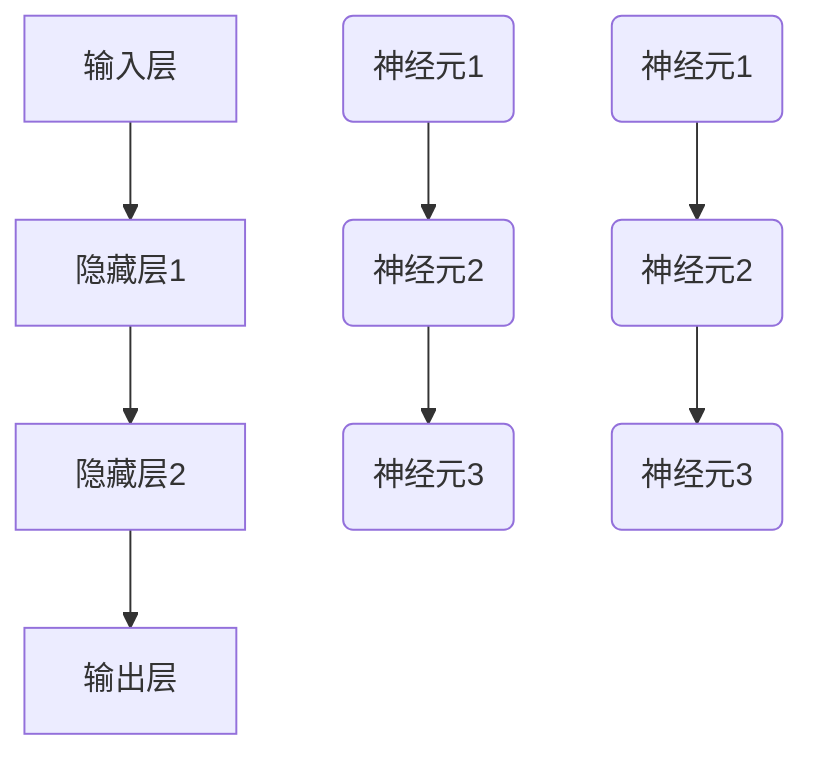

                 

关键词：神经网络，深度学习，人工智能，机器学习，数学模型

> 摘要：本文旨在探讨神经网络这一革命性技术，从其历史背景、核心概念到具体算法原理，再到数学模型与应用领域，全面剖析神经网络在人工智能领域的地位与作用。同时，文章将结合实例展示神经网络的实际应用，并展望其未来发展趋势与面临的挑战。

## 1. 背景介绍

### 神经网络的历史

神经网络（Neural Networks）的概念起源于1940年代，由心理学家McCulloch和数学家Pitts提出。他们试图模拟人脑神经元的工作方式，设计了简单的神经元模型，称为MCP（McCulloch-Pitts neuron）。尽管这一模型非常基础，但却是神经网络发展历程中的里程碑。

20世纪80年代，神经网络迎来了第一次热潮。当时，以感知机（Perceptron）为代表的简单神经网络模型被广泛研究。然而，由于感知机存在局限性，无法解决非线性问题，神经网络的研究一度陷入低谷。

直到20世纪90年代，随着计算机性能的飞速提升和大数据时代的到来，神经网络得到了新的发展机遇。特别是深度学习（Deep Learning）的兴起，使得神经网络在图像识别、语音识别、自然语言处理等领域取得了显著成果。

### 神经网络在人工智能中的地位

神经网络是人工智能领域的关键技术之一，其作用不可小觑。首先，神经网络为人工智能提供了模拟人脑智能的能力，使得机器能够自主学习和适应复杂环境。其次，神经网络在计算机视觉、语音识别、自然语言处理等领域取得了突破性进展，为人工智能的发展注入了新的动力。此外，神经网络还在医疗、金融、安防等众多领域得到了广泛应用，推动了相关行业的发展。

## 2. 核心概念与联系

### 核心概念

神经网络由大量的神经元组成，每个神经元都与其他神经元相连。神经网络的基本单位是神经元，神经元通过激活函数将输入信号转化为输出信号。神经网络的主要目的是通过学习输入和输出之间的映射关系，实现对未知数据的分类、预测或生成。

### 架构与联系

神经网络的架构可以分为输入层、隐藏层和输出层。输入层接收外部输入信号，隐藏层通过处理输入信号生成中间结果，输出层生成最终输出结果。神经元之间的连接权值决定了输入信号在神经网络中的传播路径，通过学习调整权值，神经网络可以不断优化自身的性能。

### Mermaid 流程图



## 3. 核心算法原理 & 具体操作步骤

### 3.1 算法原理概述

神经网络的核心算法是基于前向传播和反向传播。前向传播是指将输入信号从输入层传递到输出层，通过层层计算得到输出结果。反向传播是指根据输出结果与实际标签之间的误差，反向调整隐藏层和输入层的权值，以优化神经网络性能。

### 3.2 算法步骤详解

1. **初始化参数**：初始化输入层、隐藏层和输出层的权重和偏置。
2. **前向传播**：将输入信号传递到神经网络，通过层层计算得到输出结果。
3. **计算误差**：将输出结果与实际标签进行比较，计算误差。
4. **反向传播**：根据误差反向传播，调整隐藏层和输入层的权值。
5. **优化参数**：使用优化算法（如梯度下降）调整权值和偏置，以降低误差。
6. **迭代训练**：重复上述步骤，直到满足停止条件（如达到预设迭代次数或误差小于阈值）。

### 3.3 算法优缺点

**优点**：
1. 强大的非线性建模能力。
2. 自适应学习，能够处理复杂问题。
3. 广泛应用于各个领域，如计算机视觉、语音识别、自然语言处理等。

**缺点**：
1. 需要大量的数据和计算资源。
2. 过拟合问题较严重，需要合理调整超参数。
3. 参数调优过程复杂，对经验要求较高。

### 3.4 算法应用领域

神经网络在各个领域都取得了显著的成果，主要包括：
1. **计算机视觉**：图像分类、目标检测、人脸识别等。
2. **语音识别**：语音识别、语音合成、语音增强等。
3. **自然语言处理**：情感分析、机器翻译、文本生成等。
4. **医疗健康**：疾病预测、药物研发、医疗图像分析等。
5. **金融领域**：股票预测、风险评估、智能投顾等。

## 4. 数学模型和公式 & 详细讲解 & 举例说明

### 4.1 数学模型构建

神经网络的数学模型主要基于线性代数和微积分。其中，输入层和隐藏层之间的变换可以表示为矩阵乘法，隐藏层和输出层之间的变换也可以表示为矩阵乘法。神经网络的核心在于激活函数，通过引入非线性变换，使得神经网络具有强大的非线性建模能力。

### 4.2 公式推导过程

1. **前向传播**：

   前向传播的过程可以表示为：

   $$ z^{[l]} = W^{[l]} \cdot a^{[l-1]} + b^{[l]} $$
   
   $$ a^{[l]} = \sigma(z^{[l]}) $$

   其中，$z^{[l]}$表示第$l$层的中间值，$a^{[l]}$表示第$l$层的输出值，$W^{[l]}$表示第$l$层的权重矩阵，$b^{[l]}$表示第$l$层的偏置，$\sigma$表示激活函数。

2. **反向传播**：

   反向传播的过程可以表示为：

   $$ \delta^{[l]} = \frac{\partial J}{\partial z^{[l]}} = \frac{\partial J}{\partial a^{[l]}} \cdot \frac{\partial a^{[l]}}{\partial z^{[l]}} $$
   
   $$ \delta^{[l-1]} = \frac{\partial J}{\partial z^{[l-1]}} = \frac{\partial J}{\partial z^{[l]}} \cdot \frac{\partial z^{[l]}}{\partial z^{[l-1]}} $$
   
   其中，$\delta^{[l]}$表示第$l$层的误差，$J$表示损失函数。

### 4.3 案例分析与讲解

假设我们有一个简单的神经网络，包含输入层、一个隐藏层和一个输出层。输入层有3个神经元，隐藏层有2个神经元，输出层有1个神经元。激活函数采用Sigmoid函数。现在，我们使用该神经网络进行二分类任务，输入数据为$(x_1, x_2, x_3)$，标签为$y$。

1. **初始化参数**：

   初始化权重矩阵$W^{[1]}$和偏置$b^{[1]}$，$W^{[2]}$和偏置$b^{[2]}$，$W^{[3]}$和偏置$b^{[3]}$。

2. **前向传播**：

   将输入数据$(x_1, x_2, x_3)$传递到神经网络，经过计算得到输出值$a^{[2]}$和$a^{[3]}$。

3. **计算误差**：

   计算输出值$a^{[3]}$与实际标签$y$之间的误差。

4. **反向传播**：

   根据误差反向传播，调整隐藏层和输入层的权值。

5. **优化参数**：

   使用梯度下降算法，优化神经网络参数。

## 5. 项目实践：代码实例和详细解释说明

### 5.1 开发环境搭建

为了实现神经网络，我们需要搭建一个开发环境。以下是Python的开发环境搭建步骤：

1. 安装Python：从官方网站下载并安装Python。
2. 安装依赖库：使用pip命令安装numpy、tensorflow等依赖库。

### 5.2 源代码详细实现

以下是一个简单的神经网络实现：

```python
import tensorflow as tf

# 定义神经网络结构
model = tf.keras.Sequential([
    tf.keras.layers.Dense(2, activation='sigmoid', input_shape=(3,)),
    tf.keras.layers.Dense(1, activation='sigmoid')
])

# 编译模型
model.compile(optimizer='adam', loss='binary_crossentropy', metrics=['accuracy'])

# 训练模型
model.fit(x_train, y_train, epochs=10)

# 评估模型
loss, accuracy = model.evaluate(x_test, y_test)
print(f"测试集准确率：{accuracy:.2f}")
```

### 5.3 代码解读与分析

1. **定义神经网络结构**：使用`tf.keras.Sequential`类定义神经网络，包含一个输入层、一个隐藏层和一个输出层。输入层有3个神经元，隐藏层有2个神经元，输出层有1个神经元。激活函数采用Sigmoid函数。

2. **编译模型**：使用`compile`方法编译模型，指定优化器、损失函数和评价指标。

3. **训练模型**：使用`fit`方法训练模型，指定训练数据、训练轮数等参数。

4. **评估模型**：使用`evaluate`方法评估模型在测试数据上的性能。

## 6. 实际应用场景

### 6.1 医疗健康

神经网络在医疗健康领域具有广泛的应用前景。例如，神经网络可以用于疾病预测，通过分析患者病史、体检数据等，预测患者患某种疾病的风险。此外，神经网络还可以用于药物研发，通过模拟药物在体内的作用机制，筛选出具有潜在疗效的药物。

### 6.2 金融领域

神经网络在金融领域也发挥了重要作用。例如，神经网络可以用于股票预测，通过分析历史股价、公司财务数据等，预测未来股价走势。此外，神经网络还可以用于风险评估，通过分析客户历史交易数据、信用记录等，评估客户信用风险。

### 6.3 自动驾驶

自动驾驶是神经网络的一个重要应用场景。神经网络可以用于车辆检测、路径规划等任务，通过分析摄像头和激光雷达采集的数据，实现自动驾驶车辆的智能驾驶。

### 6.4 未来应用展望

随着人工智能技术的不断发展，神经网络的应用领域将越来越广泛。未来，神经网络有望在更多领域取得突破性成果，如智能家居、智能医疗、智能交通等。同时，神经网络在算法优化、计算效率等方面也面临着巨大的挑战。

## 7. 工具和资源推荐

### 7.1 学习资源推荐

1. 《深度学习》（Goodfellow, Bengio, Courville）：系统介绍了深度学习的理论基础和实践方法。
2. 《神经网络与深度学习》（邱锡鹏）：全面阐述了神经网络和深度学习的基本概念和技术原理。
3. 《Python深度学习》（François Chollet）：通过实际案例，介绍了使用Python实现深度学习的技巧和经验。

### 7.2 开发工具推荐

1. TensorFlow：开源深度学习框架，支持多种神经网络结构。
2. PyTorch：开源深度学习框架，具有灵活的动态计算图和强大的GPU支持。

### 7.3 相关论文推荐

1. “A Learning Algorithm for Continually Running Fully Recurrent Neural Networks” - 约翰·霍普菲尔（John Hopfield）
2. “Backpropagation” - 哈洛德·明斯基（Harold Minsky）和西摩尔·帕普特（Seymour Papert）
3. “Deep Learning” - 伊恩·古德费洛（Ian Goodfellow）、约书亚·本吉奥（Yoshua Bengio）和亚伦·库维尔（Aaron Courville）

## 8. 总结：未来发展趋势与挑战

### 8.1 研究成果总结

神经网络在人工智能领域取得了丰硕的成果，从简单的感知机到复杂的深度学习模型，神经网络在各个领域都发挥了重要作用。目前，神经网络已经成为人工智能的核心技术之一，推动了人工智能的快速发展。

### 8.2 未来发展趋势

1. **算法优化**：提高神经网络模型的计算效率，降低能耗。
2. **模型压缩**：减少神经网络模型的参数规模，提高模型的可解释性。
3. **跨领域应用**：扩大神经网络的应用范围，如智能医疗、智能交通等。

### 8.3 面临的挑战

1. **过拟合问题**：如何提高神经网络模型的泛化能力，避免过拟合。
2. **计算资源需求**：如何降低神经网络模型的计算资源需求，提高计算效率。
3. **数据隐私和安全**：如何确保神经网络模型在处理敏感数据时的隐私和安全。

### 8.4 研究展望

未来，神经网络将在人工智能领域发挥更加重要的作用，为实现人机协同、智能决策提供有力支持。同时，神经网络的研究也将面临诸多挑战，需要不断探索和创新。

## 9. 附录：常见问题与解答

### 9.1 问题1：神经网络与深度学习的区别是什么？

神经网络（Neural Networks）是一种模拟人脑神经元工作的计算模型，而深度学习（Deep Learning）是一种基于神经网络的机器学习方法。深度学习通过构建深层的神经网络模型，实现对复杂数据的高效建模和预测。

### 9.2 问题2：如何解决神经网络过拟合问题？

解决神经网络过拟合问题可以从以下几个方面入手：

1. **增加训练数据**：增加训练数据量，提高模型泛化能力。
2. **调整模型结构**：适当减少模型层数或神经元数量，降低模型复杂度。
3. **使用正则化**：采用正则化方法（如L1正则化、L2正则化），限制模型参数的范数。
4. **提前停止训练**：在训练过程中，当验证集误差不再下降时，提前停止训练。

### 9.3 问题3：神经网络需要大量数据的原因是什么？

神经网络需要大量数据的原因主要有两点：

1. **模型复杂度**：神经网络具有高度非线性、多层次的模型结构，需要大量数据来训练和优化。
2. **泛化能力**：大量数据可以帮助神经网络更好地捕捉数据中的规律，提高模型的泛化能力，避免过拟合。

----------------------------------------------------------------

### 作者署名
作者：禅与计算机程序设计艺术 / Zen and the Art of Computer Programming

本文为原创内容，版权归作者所有。未经授权，禁止转载。如有侵权，将依法追究责任。感谢您的阅读。

