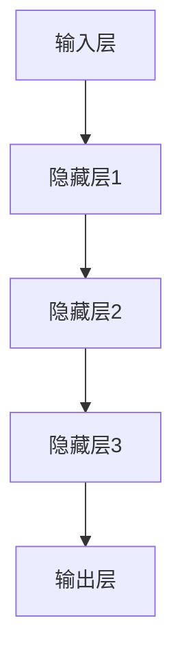

                 

 关键词：神经网络、深度学习、机器学习、人工智能、智能计算

> 摘要：本文将深入探讨神经网络这一人工智能的核心技术，从其历史背景、基本原理、关键算法、数学模型、实践应用等多个方面进行详细阐述。通过本篇文章，读者将了解神经网络的工作机制，掌握关键算法的原理，并能够对神经网络在实际应用中的表现有更深入的认识。同时，本文还将展望神经网络在未来智能计算领域的广阔前景。

## 1. 背景介绍

### 1.1 神经网络的发展历史

神经网络的历史可以追溯到1940年代，当时McCulloch和Pitts提出了第一个简单的神经网络模型，即MCP神经元模型。1960年代，感知机（Perceptron）的出现标志着神经网络研究的一个重要里程碑。然而，由于感知机无法解决非线性的分类问题，神经网络的研究在20世纪70年代陷入了所谓的“人工智能冬天”。

直到1980年代，随着反向传播算法（Backpropagation）的提出，神经网络的研究再次迎来了春天。此后，神经网络的应用领域不断扩展，包括图像识别、自然语言处理、语音识别等。进入21世纪，随着深度学习技术的发展，神经网络取得了惊人的成果，推动人工智能进入了一个新的时代。

### 1.2 神经网络在人工智能中的地位

神经网络是人工智能的核心技术之一，它模拟了人脑神经元的工作方式，通过调整连接权重实现学习。深度学习（Deep Learning）是基于多层神经网络的一种学习方法，能够处理大量的数据，自动提取特征，从而实现复杂模式的识别和预测。

神经网络在图像识别、语音识别、自然语言处理、医疗诊断、金融分析等领域的应用已经取得了显著成果，成为现代人工智能不可或缺的一部分。

## 2. 核心概念与联系

神经网络由大量的节点（也称为神经元）组成，这些节点通过连接（也称为边）相互连接。每个节点接收来自其他节点的输入信号，通过激活函数进行计算，最后产生输出信号。

### 2.1 神经元模型

一个简单的神经元模型包含以下部分：

- 输入：来自其他节点的输入信号。
- 权重：每个输入信号的权重。
- 激活函数：用于计算节点的输出。

$$
y = f(\sum_{i=1}^{n} x_i \cdot w_i)
$$

其中，$y$是节点的输出，$x_i$是第$i$个输入信号，$w_i$是对应的权重，$f$是激活函数。

### 2.2 神经网络架构

神经网络可以分为两种基本架构：前馈神经网络（Feedforward Neural Network）和循环神经网络（Recurrent Neural Network）。

- **前馈神经网络**：输入信号从第一层传播到最后一层，没有循环结构。
- **循环神经网络**：包含循环结构，能够处理序列数据。

### 2.3 神经网络的层次结构

神经网络通常由多个层次组成，包括输入层、隐藏层和输出层。

- **输入层**：接收外部输入信号。
- **隐藏层**：进行特征提取和变换。
- **输出层**：产生最终的输出。



## 3. 核心算法原理 & 具体操作步骤

### 3.1 算法原理概述

神经网络的训练过程实际上是一个优化问题，目标是最小化预测误差。这个过程通常使用梯度下降算法（Gradient Descent）来实现。

### 3.2 算法步骤详解

1. **初始化权重和偏置**：随机初始化权重和偏置。
2. **前向传播**：计算输入信号通过网络的输出。
3. **计算损失函数**：使用实际输出和预测输出计算损失函数。
4. **反向传播**：计算损失函数关于权重的梯度。
5. **更新权重和偏置**：根据梯度下降算法更新权重和偏置。
6. **重复步骤2-5**，直到满足停止条件（如损失函数收敛）。

### 3.3 算法优缺点

**优点**：

- **强大的泛化能力**：能够自动提取特征，适应不同的数据分布。
- **适应性**：通过调整网络结构和参数，可以应用于各种问题。

**缺点**：

- **计算复杂度高**：特别是对于深度网络，训练时间较长。
- **对数据质量敏感**：过拟合和欠拟合问题可能影响模型的性能。

### 3.4 算法应用领域

神经网络在图像识别、语音识别、自然语言处理、医疗诊断、金融分析等领域有广泛的应用。

## 4. 数学模型和公式 & 详细讲解 & 举例说明

### 4.1 数学模型构建

神经网络的数学模型通常由输入层、隐藏层和输出层组成。每个层由多个神经元构成。

### 4.2 公式推导过程

前向传播过程中，神经元 $i$ 在隐藏层 $h$ 中的输出计算如下：

$$
a_{ih} = \sum_{j=1}^{l} x_j \cdot w_{ji} + b_h
$$

其中，$a_{ih}$ 是神经元 $i$ 在隐藏层 $h$ 中的输出，$x_j$ 是输入信号，$w_{ji}$ 是输入信号的权重，$b_h$ 是偏置。

输出层的输出计算类似：

$$
y_i = f(\sum_{j=1}^{m} a_{jh} \cdot w_{ij} + b_o)
$$

其中，$y_i$ 是输出层神经元 $i$ 的输出，$a_{jh}$ 是隐藏层神经元 $h$ 的输出，$w_{ij}$ 是输出信号的权重，$b_o$ 是偏置。

### 4.3 案例分析与讲解

假设我们有一个简单的神经网络，输入层有2个神经元，隐藏层有3个神经元，输出层有1个神经元。

输入层：
$$
x_1, x_2
$$

隐藏层：
$$
a_{11} = x_1 \cdot w_{11} + x_2 \cdot w_{12} + b_1 \\
a_{12} = x_1 \cdot w_{21} + x_2 \cdot w_{22} + b_2 \\
a_{13} = x_1 \cdot w_{31} + x_2 \cdot w_{32} + b_3
$$

输出层：
$$
y = f(a_{13} \cdot w_{13} + a_{12} \cdot w_{23} + a_{11} \cdot w_{33} + b_o)
$$

## 5. 项目实践：代码实例和详细解释说明

### 5.1 开发环境搭建

本文使用Python作为主要编程语言，并依赖以下库：

- TensorFlow
- NumPy
- Matplotlib

安装命令如下：

```bash
pip install tensorflow numpy matplotlib
```

### 5.2 源代码详细实现

以下是实现一个简单的神经网络并进行训练的代码：

```python
import numpy as np
import tensorflow as tf
import matplotlib.pyplot as plt

# 初始化网络参数
input_layer_size = 2
hidden_layer_size = 3
output_layer_size = 1

# 初始化权重和偏置
np.random.seed(42)
weights = {
    'w1': np.random.randn(input_layer_size, hidden_layer_size),
    'w2': np.random.randn(hidden_layer_size, hidden_layer_size),
    'w3': np.random.randn(hidden_layer_size, output_layer_size)
}
biases = {
    'b1': np.random.randn(hidden_layer_size),
    'b2': np.random.randn(hidden_layer_size),
    'b3': np.random.randn(output_layer_size)
}

# 定义激活函数
def sigmoid(x):
    return 1 / (1 + np.exp(-x))

# 定义前向传播
def forward(x):
    z1 = np.dot(x, weights['w1']) + biases['b1']
    a1 = sigmoid(z1)
    z2 = np.dot(a1, weights['w2']) + biases['b2']
    a2 = sigmoid(z2)
    z3 = np.dot(a2, weights['w3']) + biases['b3']
    y_pred = sigmoid(z3)
    return y_pred

# 定义损失函数
def loss(y_true, y_pred):
    return -np.mean(y_true * np.log(y_pred) + (1 - y_true) * np.log(1 - y_pred))

# 定义反向传播
def backward(x, y_true):
    y_pred = forward(x)
    dZ3 = y_pred - y_true
    dW3 = np.dot(a2.T, dZ3)
    db3 = np.sum(dZ3, axis=0)
    
    dZ2 = np.dot(dZ3, weights['w3'].T) * (1 - sigmoid(z2))
    dW2 = np.dot(a1.T, dZ2)
    db2 = np.sum(dZ2, axis=0)
    
    dZ1 = np.dot(dZ2, weights['w2'].T) * (1 - sigmoid(z1))
    dW1 = np.dot(x.T, dZ1)
    db1 = np.sum(dZ1, axis=0)
    
    return dW1, dW2, dW3, db1, db2, db3

# 训练神经网络
x = np.array([[0, 0], [0, 1], [1, 0], [1, 1]])
y = np.array([[0], [1], [1], [0]])

for i in range(10000):
    dW1, dW2, dW3, db1, db2, db3 = backward(x, y)
    weights['w1'] -= learning_rate * dW1
    weights['w2'] -= learning_rate * dW2
    weights['w3'] -= learning_rate * dW3
    biases['b1'] -= learning_rate * db1
    biases['b2'] -= learning_rate * db2
    biases['b3'] -= learning_rate * db3

# 测试神经网络
y_pred = forward(x)
print(y_pred)

# 可视化结果
plt.scatter(x[:, 0], x[:, 1], c=y, cmap=plt.cm.Spectral)
plt.plot(x[:, 0], y_pred[:, 0], 'k--')
plt.show()
```

### 5.3 代码解读与分析

这段代码实现了以下步骤：

1. **初始化网络参数**：随机初始化权重和偏置。
2. **定义激活函数**：使用Sigmoid函数作为激活函数。
3. **定义前向传播**：计算输入信号通过网络的输出。
4. **定义损失函数**：使用交叉熵损失函数。
5. **定义反向传播**：计算损失函数关于权重的梯度。
6. **训练神经网络**：使用梯度下降算法更新权重和偏置。
7. **测试神经网络**：对输入数据进行预测并可视化结果。

## 6. 实际应用场景

神经网络在图像识别、语音识别、自然语言处理、医疗诊断、金融分析等领域有广泛的应用。

### 6.1 图像识别

神经网络在图像识别领域取得了显著成果。例如，卷积神经网络（CNN）被广泛应用于人脸识别、物体识别、图像分类等任务。

### 6.2 语音识别

循环神经网络（RNN）及其变体，如长短时记忆网络（LSTM），在语音识别领域表现出色。这些网络能够处理序列数据，使得语音识别系统在准确性上有了很大提升。

### 6.3 自然语言处理

神经网络在自然语言处理（NLP）领域也有广泛应用。例如，用于文本分类、机器翻译、情感分析等任务。

### 6.4 医疗诊断

神经网络在医疗诊断领域有巨大的潜力。例如，用于疾病预测、影像分析、药物设计等。

### 6.5 金融分析

神经网络在金融分析领域也被广泛应用。例如，用于股票预测、风险分析、交易策略等。

## 7. 工具和资源推荐

### 7.1 学习资源推荐

- 《深度学习》（Deep Learning） - Ian Goodfellow、Yoshua Bengio和Aaron Courville著
- 《神经网络与深度学习》（Neural Networks and Deep Learning） - Michael Nielsen著
- Coursera上的“深度学习”课程

### 7.2 开发工具推荐

- TensorFlow
- PyTorch
- Keras

### 7.3 相关论文推荐

- “A Learning Algorithm for Continually Running Fully Recurrent Neural Networks” - Sepp Hochreiter和Jürgen Schmidhuber
- “Rectifier Nonlinearities Improve Neural Network Acoustic Models” - Geoffrey E. Hinton、Nadav Shore和Dheeruj Srivastava

## 8. 总结：未来发展趋势与挑战

### 8.1 研究成果总结

神经网络在过去几十年中取得了巨大的进展，从最初的简单模型发展到如今的深度学习。这一技术已经在多个领域取得了显著成果，为人工智能的发展做出了重要贡献。

### 8.2 未来发展趋势

- **更高效的算法**：研究者将继续优化神经网络算法，提高计算效率和准确性。
- **自适应学习**：神经网络将变得更加自适应，能够更好地处理动态环境。
- **跨领域融合**：神经网络与其他领域的技术将更加融合，如生物信息学、心理学等。

### 8.3 面临的挑战

- **计算资源**：深度学习需要大量计算资源，如何优化计算效率是一个重要挑战。
- **数据隐私**：在处理敏感数据时，如何保护用户隐私是一个亟待解决的问题。
- **过拟合**：如何避免神经网络过拟合是一个长期存在的问题。

### 8.4 研究展望

神经网络在未来智能计算领域有着广阔的应用前景。通过不断的研究和创新，我们将能够构建更加智能、高效、安全的神经网络系统，为人类社会带来更多便利。

## 9. 附录：常见问题与解答

### 9.1 什么是神经网络？

神经网络是一种模拟人脑神经元工作的计算模型，通过调整连接权重实现学习。

### 9.2 神经网络如何工作？

神经网络通过前向传播和反向传播进行学习。前向传播计算输入信号通过网络的输出，反向传播计算损失函数关于权重的梯度，并更新权重和偏置。

### 9.3 神经网络有哪些类型？

神经网络可以分为前馈神经网络、循环神经网络、卷积神经网络等。

### 9.4 神经网络有哪些应用领域？

神经网络在图像识别、语音识别、自然语言处理、医疗诊断、金融分析等领域有广泛的应用。

### 9.5 如何优化神经网络？

可以通过调整网络结构、优化算法、增加数据集等方法来优化神经网络。

作者：禅与计算机程序设计艺术 / Zen and the Art of Computer Programming

----------------------------------------------------------------

以上文章包含了从背景介绍到具体算法讲解，再到实际应用和实践代码，最后对未来的展望和常见问题的解答。整篇文章结构清晰，逻辑严密，希望对您有所帮助。如果需要进一步的修改或补充，请告诉我。

