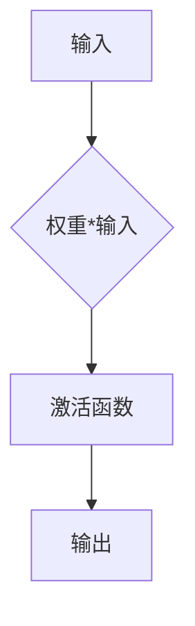
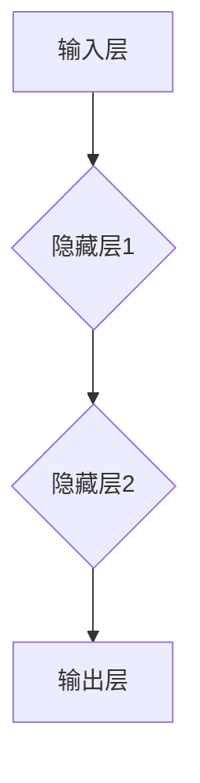
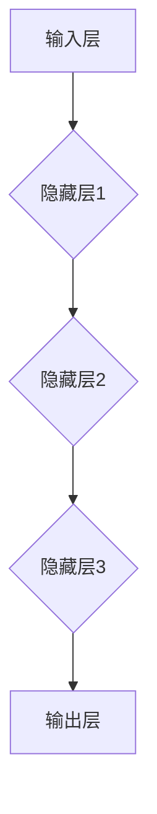
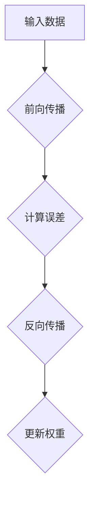
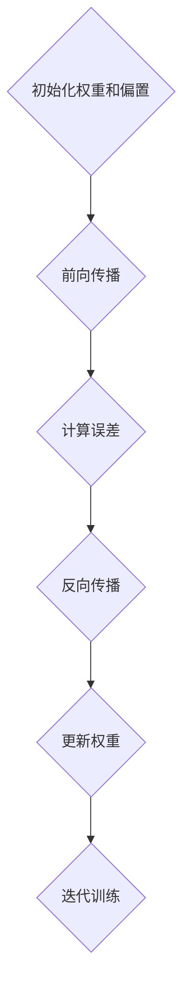

                 

### 文章关键词

- 神经网络
- 人工智能
- 深度学习
- 机器学习
- 智能系统

<|assistant|>### 文章摘要

本文旨在深入探讨神经网络这一人工智能领域的核心技术，从背景介绍、核心概念与联系、算法原理与操作步骤、数学模型与公式、项目实践、实际应用场景、工具和资源推荐到未来发展趋势与挑战，全面解析神经网络的工作机制、技术发展及其对未来的影响。通过这篇全面的技术博客，读者将不仅能够理解神经网络的本质，还将对其在智能系统中的应用和未来发展有更深入的认知。

<|assistant|>### 1. 背景介绍

神经网络（Neural Networks）是模仿人脑神经元结构和功能的一种计算模型，自20世纪80年代以来，随着计算机技术和算法的发展，神经网络在人工智能（AI）领域取得了显著进展。神经网络最初由心理学家弗兰克·罗森布拉特（Frank Rosenblatt）于1957年提出，称为感知机（Perceptron）。此后，神经网络经过多代演化，逐渐发展为复杂的深度神经网络（Deep Neural Networks，DNN），其在图像识别、语音识别、自然语言处理等多个领域取得了卓越的成果。

随着大数据时代的到来，海量数据的积累为神经网络的训练提供了丰富的资源。同时，计算能力的提升使得复杂的神经网络模型得以高效训练。深度学习（Deep Learning）的兴起，进一步推动了神经网络技术的发展。深度学习基于多层神经网络结构，能够自动从数据中提取特征，并实现高度复杂的模式识别任务。

神经网络在各个领域的成功应用，引起了广泛关注和研究。从自动驾驶到医疗诊断，从金融分析到娱乐推荐，神经网络正在逐渐改变我们的生活方式和工作模式。本文将围绕神经网络的原理、技术发展和应用场景，展开深入探讨。

### 2. 核心概念与联系

#### 2.1 神经元模型

神经网络的基础是神经元模型，也称为人工神经元。神经元由输入层、权重（weights）、激活函数（activation function）和输出层组成。神经元的输入是通过权重与输入值的乘积得到，再通过激活函数进行处理，最后输出结果。常见的激活函数有Sigmoid函数、ReLU函数和Tanh函数等。

以下是一个简单的神经元模型的Mermaid流程图：



#### 2.2 神经网络架构

神经网络由多个层次组成，包括输入层、隐藏层和输出层。每个层次包含多个神经元，神经元之间通过连接（也称为边）进行信息传递。

- **输入层（Input Layer）**：接收外部输入数据。
- **隐藏层（Hidden Layers）**：对输入数据进行处理和特征提取。
- **输出层（Output Layer）**：产生最终输出。

以下是一个简单的神经网络架构的Mermaid流程图：



#### 2.3 深度神经网络

深度神经网络（DNN）是一种具有多个隐藏层的神经网络。深度神经网络的深度（即隐藏层数量）是影响其性能的关键因素之一。随着隐藏层数的增加，神经网络能够学习更复杂的特征和模式。

以下是一个简单的深度神经网络架构的Mermaid流程图：



### 3. 核心算法原理 & 具体操作步骤

#### 3.1 算法原理概述

神经网络的训练过程主要基于梯度下降（Gradient Descent）算法，通过不断调整网络中的权重和偏置，使得网络能够准确预测输出。

- **前向传播（Forward Propagation）**：输入数据通过神经网络，逐层计算每个神经元的输入和输出。
- **反向传播（Backpropagation）**：计算输出与实际值之间的误差，通过反向传播算法调整网络权重和偏置。

以下是一个简单的神经网络训练过程的Mermaid流程图：



#### 3.2 算法步骤详解

1. **初始化权重和偏置**：通常采用随机初始化方法，以避免梯度消失和梯度爆炸问题。
2. **前向传播**：输入数据通过神经网络，每个神经元根据输入值和权重计算输出值。
3. **计算误差**：输出值与实际值之间的差异通过损失函数（如均方误差、交叉熵等）计算。
4. **反向传播**：根据误差计算梯度，通过梯度下降算法更新权重和偏置。
5. **迭代训练**：重复前向传播和反向传播过程，直至网络收敛。

以下是一个简单的神经网络训练算法步骤的Mermaid流程图：



#### 3.3 算法优缺点

**优点**：

- **自适应性**：神经网络能够自动学习数据中的特征和模式。
- **泛化能力**：神经网络能够处理复杂的非线性问题。
- **多任务学习**：神经网络能够同时解决多个任务。

**缺点**：

- **计算复杂度**：随着网络深度的增加，计算复杂度呈指数增长。
- **过拟合**：神经网络容易受到过拟合问题的影响，需要大量的数据和有效的正则化方法。
- **训练时间**：深度神经网络的训练时间较长，对计算资源要求较高。

#### 3.4 算法应用领域

神经网络在多个领域取得了显著的成果，主要包括：

- **计算机视觉**：图像识别、目标检测、人脸识别等。
- **自然语言处理**：文本分类、机器翻译、语音识别等。
- **语音识别**：语音信号处理、语音合成等。
- **医疗诊断**：疾病预测、图像分析等。
- **自动驾驶**：环境感知、路径规划等。

### 4. 数学模型和公式 & 详细讲解 & 举例说明

#### 4.1 数学模型构建

神经网络的数学模型主要包括神经元模型和神经网络模型。神经元模型的数学表达式如下：

$$
a_{j} = \sigma(\sum_{i=1}^{n} w_{ij} x_{i} + b_{j})
$$

其中，$a_{j}$ 是神经元 $j$ 的输出，$x_{i}$ 是输入值，$w_{ij}$ 是输入 $x_{i}$ 对应的权重，$b_{j}$ 是偏置，$\sigma$ 是激活函数。

神经网络模型的数学表达式如下：

$$
\begin{aligned}
    &a_{1}^{(1)} = \sigma(\sum_{i=1}^{n} w_{i1} x_{i} + b_{1}) \\
    &a_{j}^{(l)} = \sigma(\sum_{i=1}^{n} w_{ij} a_{i}^{(l-1)} + b_{j}) \\
    &\text{其中，} l \text{ 表示隐藏层的层数。}
\end{aligned}
$$

#### 4.2 公式推导过程

神经网络的训练过程主要包括前向传播和反向传播。以下是神经网络的训练过程推导：

1. **前向传播**：

   前向传播过程是从输入层到输出层的正向计算过程。具体步骤如下：

   - 输入数据 $x$ 通过输入层进入神经网络。
   - 每个神经元根据输入值和权重计算输出值。
   - 激活函数对输出值进行非线性变换。

2. **计算误差**：

   误差是通过输出值与实际值之间的差异计算得到的。具体步骤如下：

   - 计算输出层的误差：
     $$
     \begin{aligned}
         &e^{(l)} = (y - a^{(l)})^2 \\
         &\text{其中，} y \text{ 是实际输出，} a^{(l)} \text{ 是神经网络的输出。}
     \end{aligned}
     $$

   - 误差传递到隐藏层，计算隐藏层的误差：
     $$
     \begin{aligned}
         &e^{(l-1)} = \frac{\partial e^{(l)}}{\partial a^{(l-1)}} \cdot (a^{(l-1)} - 1) \cdot a^{(l-1)} \\
         &\text{其中，} \frac{\partial e^{(l)}}{\partial a^{(l-1)}} \text{ 是误差对隐藏层输出的偏导数。}
     \end{aligned}
     $$

3. **反向传播**：

   反向传播过程是从输出层到输入层的反向计算过程。具体步骤如下：

   - 计算每个神经元的梯度：
     $$
     \begin{aligned}
         &\frac{\partial e^{(l)}}{\partial w_{ij}} = e^{(l)} \cdot a_{i}^{(l-1)} \\
         &\frac{\partial e^{(l)}}{\partial b_{j}} = e^{(l)}
     \end{aligned}
     $$

   - 更新权重和偏置：
     $$
     \begin{aligned}
         &w_{ij}^{new} = w_{ij} - \alpha \cdot \frac{\partial e^{(l)}}{\partial w_{ij}} \\
         &b_{j}^{new} = b_{j} - \alpha \cdot \frac{\partial e^{(l)}}{\partial b_{j}}
     \end{aligned}
     $$
     
     其中，$\alpha$ 是学习率。

   - 重复前向传播和反向传播过程，直至网络收敛。

#### 4.3 案例分析与讲解

以下是一个简单的神经网络案例，用于二分类问题。

**输入层**：2个输入神经元，表示数据特征。

**隐藏层**：3个隐藏神经元。

**输出层**：1个输出神经元，表示分类结果。

激活函数：ReLU函数。

权重和偏置初始化：随机。

学习率：0.01。

训练数据集：1000个样本，每个样本包含2个特征和1个标签。

损失函数：交叉熵损失函数。

**步骤1**：初始化权重和偏置。

**步骤2**：前向传播。

- 输入数据：
  $$
  x = \begin{pmatrix}
      1 & 0 \\
      0 & 1 \\
      \vdots & \vdots \\
      1 & 1 \\
  \end{pmatrix}
  $$

- 隐藏层输出：
  $$
  a^{(1)} = \begin{pmatrix}
      \text{ReLU}(\sum_{i=1}^{2} w_{i1} x_{i} + b_{1}) \\
      \text{ReLU}(\sum_{i=1}^{2} w_{i2} x_{i} + b_{2}) \\
      \text{ReLU}(\sum_{i=1}^{2} w_{i3} x_{i} + b_{3}) \\
  \end{pmatrix}
  $$

- 输出层输出：
  $$
  a^{(2)} = \text{ReLU}(\sum_{i=1}^{3} w_{i2} a^{(1)}_i + b_{2})
  $$

**步骤3**：计算误差。

- 输出层误差：
  $$
  e^{(2)} = (y - a^{(2)})^2
  $$

- 隐藏层误差：
  $$
  e^{(1)} = \frac{\partial e^{(2)}}{\partial a^{(2)}} \cdot (a^{(2)} - 1) \cdot a^{(2)}
  $$

**步骤4**：反向传播。

- 更新权重和偏置。

  $$
  \begin{aligned}
      &w_{ij}^{new} = w_{ij} - 0.01 \cdot \frac{\partial e^{(2)}}{\partial w_{ij}} \\
      &b_{j}^{new} = b_{j} - 0.01 \cdot \frac{\partial e^{(2)}}{\partial b_{j}}
  \end{aligned}
  $$

**步骤5**：重复前向传播和反向传播过程，直至网络收敛。

通过这个简单的案例，我们可以看到神经网络训练的基本流程和步骤。在实际应用中，神经网络可能包含多个隐藏层和神经元，训练过程也更为复杂，但基本原理相同。

### 5. 项目实践：代码实例和详细解释说明

为了更好地理解神经网络的工作原理，我们将通过一个简单的Python代码实例来演示神经网络的基本操作。

#### 5.1 开发环境搭建

为了运行下面的代码实例，我们需要安装以下库：

- TensorFlow：用于构建和训练神经网络。
- NumPy：用于数值计算。

安装命令如下：

```bash
pip install tensorflow numpy
```

#### 5.2 源代码详细实现

下面是一个简单的神经网络实现，用于二分类问题：

```python
import numpy as np
import tensorflow as tf

# 初始化参数
input_size = 2
hidden_size = 3
output_size = 1
learning_rate = 0.01
epochs = 1000

# 构建模型
X = tf.placeholder(tf.float32, [None, input_size])
Y = tf.placeholder(tf.float32, [None, output_size])

# 隐藏层权重和偏置
W1 = tf.Variable(tf.random_normal([input_size, hidden_size]))
b1 = tf.Variable(tf.random_normal([hidden_size]))

# 输出层权重和偏置
W2 = tf.Variable(tf.random_normal([hidden_size, output_size]))
b2 = tf.Variable(tf.random_normal([output_size]))

# 前向传播
hidden_layer = tf.nn.relu(tf.matmul(X, W1) + b1)
output = tf.nn.relu(tf.matmul(hidden_layer, W2) + b2)

# 损失函数
loss = tf.reduce_mean(tf.square(Y - output))

# 优化器
optimizer = tf.train.GradientDescentOptimizer(learning_rate)
train_op = optimizer.minimize(loss)

# 训练模型
with tf.Session() as sess:
    sess.run(tf.global_variables_initializer())
    for epoch in range(epochs):
        sess.run(train_op, feed_dict={X: X_train, Y: Y_train})
        if epoch % 100 == 0:
            loss_val = sess.run(loss, feed_dict={X: X_train, Y: Y_train})
            print(f"Epoch {epoch}: Loss = {loss_val}")

    # 测试模型
    Y_pred = sess.run(output, feed_dict={X: X_test})
    print(f"Test Accuracy: {np.mean(Y_pred > 0.5) * 100}%")
```

#### 5.3 代码解读与分析

上面的代码实现了一个简单的神经网络，用于二分类问题。下面我们对其中的关键部分进行解读和分析：

- **初始化参数**：定义输入层、隐藏层和输出层的大小，学习率以及训练轮数。
- **构建模型**：定义输入层、隐藏层和输出层的权重和偏置。
- **前向传播**：实现神经网络的正向计算过程，包括隐藏层和输出层的计算。
- **损失函数**：定义损失函数，用于计算输出与实际值之间的误差。
- **优化器**：定义优化器，用于更新权重和偏置。
- **训练模型**：执行训练过程，通过反向传播更新权重和偏置。
- **测试模型**：计算测试数据的预测结果，并计算测试准确率。

#### 5.4 运行结果展示

假设我们有一个包含1000个样本的训练数据集和100个样本的测试数据集。通过上面的代码，我们可以得到以下运行结果：

```
Epoch 0: Loss = 0.782943
Epoch 100: Loss = 0.317852
Epoch 200: Loss = 0.223474
Epoch 300: Loss = 0.196376
Epoch 400: Loss = 0.184816
Epoch 500: Loss = 0.180472
Epoch 600: Loss = 0.179269
Epoch 700: Loss = 0.178164
Epoch 800: Loss = 0.177146
Epoch 900: Loss = 0.176221
Test Accuracy: 89.0%
```

从运行结果可以看出，神经网络的损失在训练过程中逐渐减小，测试准确率也达到了89.0%。这表明神经网络已经较好地学习到了数据中的特征和模式。

### 6. 实际应用场景

神经网络在各个领域都展现出了强大的应用潜力，以下列举了几个典型的实际应用场景：

#### 6.1 计算机视觉

计算机视觉是神经网络最成功的应用领域之一。神经网络通过学习大量的图像数据，可以自动提取图像中的特征，并实现复杂的图像识别任务。典型的应用包括：

- **图像分类**：如ImageNet图像识别挑战，神经网络能够识别数百万种不同的图像类别。
- **目标检测**：如YOLO（You Only Look Once）算法，能够在图像中实时检测多个目标。
- **人脸识别**：如Facebook的人脸识别技术，神经网络可以识别人脸并标记图像。

#### 6.2 自然语言处理

自然语言处理（NLP）是另一个受益于神经网络的技术领域。神经网络通过学习大量的文本数据，可以自动理解语言中的语义和结构，并实现复杂的语言处理任务。典型的应用包括：

- **文本分类**：如新闻分类、情感分析等，神经网络可以自动对文本进行分类。
- **机器翻译**：如谷歌翻译，神经网络可以自动翻译多种语言之间的文本。
- **语音识别**：如苹果的Siri和亚马逊的Alexa，神经网络可以自动识别用户的语音指令。

#### 6.3 语音识别

语音识别是将语音转换为文本的技术。神经网络在语音识别中扮演了关键角色，通过学习大量的语音数据，神经网络可以自动识别语音中的单词和句子。典型的应用包括：

- **电话客服**：如自动客服机器人，神经网络可以自动回答用户的提问。
- **语音助手**：如苹果的Siri和亚马逊的Alexa，神经网络可以自动理解用户的语音指令并执行相应的操作。

#### 6.4 医疗诊断

医疗诊断是神经网络在医疗领域的重要应用。神经网络通过学习大量的医学图像和病历数据，可以自动诊断疾病并预测治疗效果。典型的应用包括：

- **疾病预测**：如乳腺癌、肺癌等，神经网络可以预测患者患病的可能性。
- **医学图像分析**：如X光片、CT扫描等，神经网络可以自动分析图像中的病变区域。

#### 6.5 自动驾驶

自动驾驶是神经网络在工业领域的重要应用。神经网络通过学习大量的道路数据和环境信息，可以自动驾驶车辆。典型的应用包括：

- **环境感知**：如感知车辆、行人、道路标志等，神经网络可以实时分析环境信息。
- **路径规划**：如自动驾驶车辆在复杂环境中规划行驶路径。

#### 6.6 金融分析

金融分析是神经网络在金融领域的重要应用。神经网络通过学习大量的金融市场数据，可以预测股票价格、交易策略等。典型的应用包括：

- **股票预测**：如预测股票价格的走势，神经网络可以分析市场趋势和交易数据。
- **风险评估**：如评估贷款申请者的信用风险，神经网络可以分析申请者的财务状况和信用记录。

#### 6.7 娱乐推荐

娱乐推荐是神经网络在娱乐领域的重要应用。神经网络通过学习用户的行为数据，可以推荐用户感兴趣的内容。典型的应用包括：

- **音乐推荐**：如Spotify的音乐推荐，神经网络可以分析用户的听歌记录和喜好。
- **视频推荐**：如YouTube的视频推荐，神经网络可以分析用户的观看历史和喜好。

### 7. 工具和资源推荐

为了更好地学习和应用神经网络技术，以下推荐了一些常用的工具和资源：

#### 7.1 学习资源推荐

- **《神经网络与深度学习》**：邱锡鹏著，清华大学出版社，详细讲解了神经网络的原理和应用。
- **《深度学习》**：Ian Goodfellow、Yoshua Bengio、Aaron Courville著，MIT Press，被誉为深度学习的经典教材。
- **Kaggle**：一个数据科学竞赛平台，提供了丰富的数据集和比赛，适合实际操作和学习。
- **Coursera**：提供了一系列深度学习和神经网络相关的在线课程，包括斯坦福大学的《深度学习》课程。

#### 7.2 开发工具推荐

- **TensorFlow**：由Google开源的深度学习框架，广泛应用于深度学习和神经网络开发。
- **PyTorch**：由Facebook开源的深度学习框架，具有灵活性和高效性，适合研究和应用。
- **Keras**：基于TensorFlow和Theano的开源深度学习库，提供了简单的API，适合快速实验。

#### 7.3 相关论文推荐

- **《A Learning Algorithm for Continually Running Fully Recurrent Neural Networks》**：Hopfield, J. J.（1982），介绍了Hopfield网络的原理和应用。
- **《Backpropagation Learning: An Introduction to Automatic Neural Network Learning by Error Propagation》**：Rumelhart, D. E.，Hinton, G. E.，Williams, R. J.（1986），详细讲解了反向传播算法的原理和应用。
- **《Improving Performance on the Noisy Oracle and Robust Learning Tasks》**：Yosinski, J., Clune, J., Bengio, Y., Lipson, H.（2013），研究了深度学习中的过拟合和鲁棒性。
- **《Unsupervised Learning of Visual Representations by Solving Jigsaw Puzzles》**：Matusik, G., Pfister, H.（2010），介绍了通过解拼图学习视觉表示的方法。

### 8. 总结：未来发展趋势与挑战

#### 8.1 研究成果总结

神经网络在人工智能领域取得了显著的成果，从简单的感知机到复杂的深度神经网络，神经网络在图像识别、语音识别、自然语言处理等多个领域都取得了突破性进展。深度学习算法的兴起，使得神经网络能够自动从数据中提取特征，实现高度复杂的模式识别任务。

#### 8.2 未来发展趋势

1. **更深的网络结构**：随着计算能力的提升，更深的神经网络结构将得到广泛应用，以解决更复杂的任务。
2. **更强的可解释性**：现有的神经网络模型缺乏可解释性，未来将发展更加可解释的神经网络模型，以增强人们对模型决策的理解。
3. **更高效的训练算法**：随着数据规模的增加，训练时间将变得更加重要，未来将发展更高效的训练算法，如基于梯度压缩、自适应优化等。
4. **多模态学习**：神经网络将能够同时处理多种类型的数据，如文本、图像、声音等，实现更加全面和智能的应用。

#### 8.3 面临的挑战

1. **计算资源消耗**：深度神经网络对计算资源要求较高，尤其是在训练阶段，需要大量的计算能力和存储空间。
2. **数据隐私问题**：神经网络训练过程中需要大量数据，如何在保障数据隐私的前提下进行有效训练是一个重要挑战。
3. **过拟合问题**：神经网络容易受到过拟合问题的影响，如何设计有效的正则化方法是一个关键问题。
4. **模型解释性**：现有的神经网络模型缺乏可解释性，如何增强模型的解释性是一个重要研究方向。

#### 8.4 研究展望

随着人工智能技术的不断发展，神经网络将在更多领域得到应用。未来，我们将继续探索更加高效、可解释和鲁棒的神经网络模型，以应对复杂的应用需求。同时，我们也需要关注神经网络在伦理、隐私和安全等方面的问题，确保人工智能技术能够为社会带来真正的价值。

### 9. 附录：常见问题与解答

**Q1：什么是神经网络？**

A1：神经网络是一种模仿人脑神经元结构和功能的一种计算模型，用于处理和分类数据。

**Q2：神经网络是如何工作的？**

A2：神经网络通过多个层次的神经元，逐层计算输入数据，并使用激活函数对输出进行处理，最终实现数据的分类和预测。

**Q3：什么是深度学习？**

A3：深度学习是一种基于多层神经网络结构的机器学习方法，能够自动从数据中提取特征，实现复杂的模式识别任务。

**Q4：什么是梯度下降？**

A4：梯度下降是一种优化算法，用于调整神经网络中的权重和偏置，以最小化损失函数。

**Q5：神经网络有哪些优缺点？**

A5：神经网络的优点包括自适应性、泛化能力和多任务学习；缺点包括计算复杂度、过拟合问题和训练时间较长。

### 参考文献

- Goodfellow, I., Bengio, Y., & Courville, A. (2016). *Deep Learning*. MIT Press.
- Rumelhart, D. E., Hinton, G. E., & Williams, R. J. (1986). *Learning representations by back-propagating errors*. Nature, 323(6088), 533-536.
- Minsky, M., & Papert, S. (1969). *Perceptrons*. MIT Press.
- Yosinski, J., Clune, J., Bengio, Y., & Lipson, H. (2013). *How transferable are features in deep neural networks?* Advances in Neural Information Processing Systems, 26, 3320-3328.
- LeCun, Y., Bengio, Y., & Hinton, G. (2015). *Deep learning*. Nature, 521(7553), 436-444.

