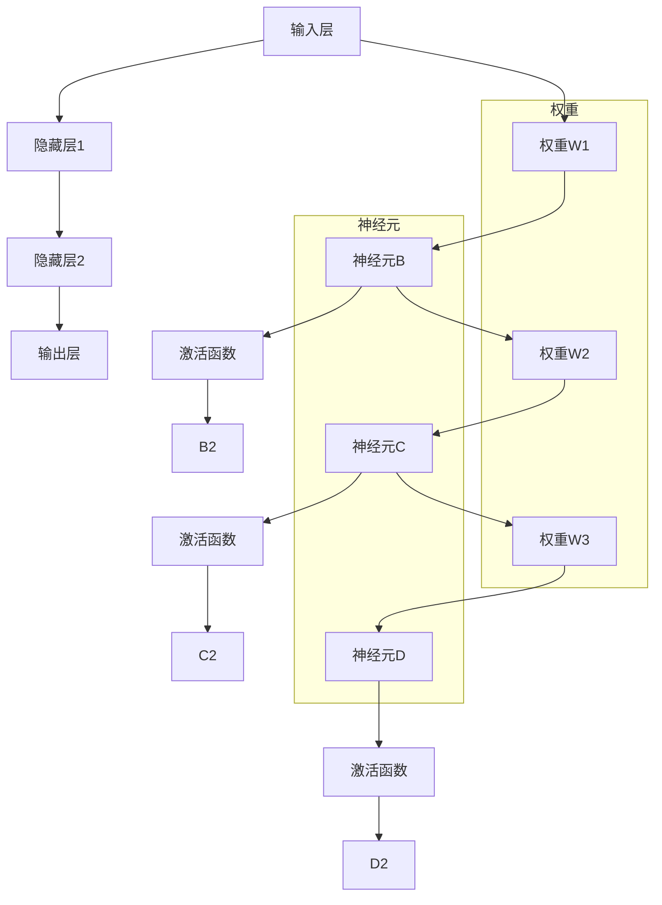

                 

 在当今科技飞速发展的时代，神经网络（Neural Networks）已成为人工智能（Artificial Intelligence，简称AI）领域的核心技术之一。它不仅引发了深度学习的革命，还推动了自动驾驶、语音识别、图像处理等众多领域的创新。本文将深入探讨神经网络的原理、应用以及未来发展趋势，旨在为读者提供一个全面而深刻的理解。

## 关键词
- 神经网络
- 人工智能
- 深度学习
- 自动驾驶
- 语音识别
- 图像处理

## 摘要
本文将首先回顾神经网络的历史背景和发展过程，接着详细解释神经网络的数学基础和核心概念，并通过Mermaid流程图展示其架构。随后，我们将深入探讨神经网络的核心算法——反向传播算法，并详细说明其具体操作步骤。在此基础上，本文还将介绍神经网络的数学模型和公式，通过具体案例进行分析和讲解。文章还将展示一个实际项目中的代码实例，并对神经网络在各个实际应用场景中的作用进行探讨。最后，本文将总结神经网络的研究成果，展望其未来发展趋势和面临的挑战，并提供相关工具和资源的推荐。

## 1. 背景介绍

神经网络的概念最早可以追溯到1940年代，由美国心理学家沃伦·麦卡洛克（Warren McCulloch）和数学家沃尔特·皮茨（Walter Pitts）提出。他们的研究奠定了神经网络理论基础，即所谓的“麦卡洛克-皮茨神经元模型”（McCulloch-Pitts neuron model）。随后，1958年，弗兰克·罗森布拉特（Frank Rosenblatt）提出了感知机（Perceptron）算法，这标志着神经网络研究的初步成功。

然而，神经网络的研究在1960年代后期遇到了瓶颈。当时的研究表明，感知机无法解决一些简单的问题，例如异或问题（XOR problem）。这使得神经网络的研究陷入低潮，人工智能（AI）领域也受到了严重打击。这段时间被称为“AI寒冬”。

直到1980年代，随着计算机性能的提升和更多算法的提出，神经网络研究才逐渐复苏。1990年代，反向传播算法（Backpropagation algorithm）的提出和优化，使得神经网络能够进行多层学习，从而开启了深度学习的时代。2006年，杰弗里·辛顿（Geoffrey Hinton）等人的研究使得深度学习取得了重大突破，神经网络再次成为AI领域的热点。

近年来，随着大数据和计算能力的提升，神经网络在各个领域的应用得到了极大拓展。从图像识别、语音识别到自然语言处理，神经网络已经成为实现AI的核心技术之一。

## 2. 核心概念与联系

### 神经网络的基本组成

神经网络由大量简单的计算单元——神经元（Neurons）组成，这些神经元通过加权连接（weighted connections）连接在一起，形成一个复杂的网络结构。每个神经元接收来自其他神经元的输入信号，并通过激活函数（activation function）产生输出信号。神经网络的最终输出是通过这些神经元的集体协作得到的。

### 神经网络的数学基础

神经网络的数学基础主要涉及线性代数、微积分和概率论。其中，最核心的部分是矩阵运算和梯度下降算法。

- **矩阵运算**：神经网络中的输入和权重通常以矩阵的形式表示。矩阵的乘法和加法是神经网络运算的基础。
- **微积分**：微积分中的导数概念在神经网络中用于计算损失函数关于权重的梯度，从而进行参数优化。
- **概率论**：神经网络中的概率模型主要用于处理不确定性和噪声。

### Mermaid流程图

下面是一个神经网络的Mermaid流程图，展示了神经网络的架构和基本操作。



在这个流程图中，我们首先定义了输入层、隐藏层和输出层。每个层中的神经元通过权重进行连接，并通过激活函数进行非线性变换。最终，输出层产生预测结果。

### 神经网络的工作原理

神经网络的工作原理可以简单概括为以下几个步骤：

1. **输入信号处理**：输入信号首先通过输入层进入神经网络。
2. **权重和偏置计算**：输入信号与权重进行矩阵乘法运算，并加上偏置（bias）项。
3. **激活函数应用**：对计算结果应用激活函数，引入非线性特性。
4. **逐层传播**：将激活函数的输出作为下一层的输入，重复上述步骤。
5. **输出预测**：最终，输出层的神经元产生预测结果。

神经网络的训练过程是通过不断调整权重和偏置，使得输出结果尽可能接近真实值。这个过程依赖于梯度下降算法，通过对损失函数关于参数的梯度进行计算和优化。

## 3. 核心算法原理 & 具体操作步骤

### 3.1 算法原理概述

神经网络的训练过程主要依赖于一个核心算法——反向传播算法（Backpropagation algorithm）。反向传播算法通过两个主要步骤来实现神经网络的训练：

1. **前向传播（Forward Propagation）**：输入信号从输入层经过神经网络，逐层传递到输出层，产生预测结果。
2. **反向传播（Backpropagation）**：计算输出结果与真实值的差异，通过反向传播计算损失函数关于各层参数的梯度，并更新参数。

### 3.2 算法步骤详解

#### 前向传播

1. **初始化参数**：随机初始化权重和偏置。
2. **输入信号处理**：输入信号通过输入层进入神经网络。
3. **逐层计算**：对于每个神经元，计算输入信号与权重乘积，并加上偏置，然后应用激活函数。
4. **输出预测**：输出层神经元的激活值即为预测结果。

#### 反向传播

1. **计算输出误差**：计算预测结果与真实值之间的差异，即损失函数。
2. **计算梯度**：计算损失函数关于输出层神经元的梯度。
3. **反向传播梯度**：将梯度反向传播到隐藏层，并计算隐藏层的梯度。
4. **参数更新**：使用梯度下降算法更新权重和偏置。

### 3.3 算法优缺点

**优点**：

- **强大的泛化能力**：神经网络能够通过大量数据自动学习特征，具有较强的泛化能力。
- **灵活的结构**：神经网络可以通过增加隐藏层和神经元数量来适应不同复杂度的问题。
- **自动特征提取**：神经网络能够自动提取输入数据的特征，减轻人工特征工程的工作量。

**缺点**：

- **计算复杂度较高**：神经网络训练过程涉及大量的矩阵运算，计算复杂度较高。
- **易过拟合**：神经网络在面对复杂问题时易过拟合，需要大量数据进行训练。
- **参数调优困难**：神经网络的训练过程涉及大量参数，参数调优过程较为复杂。

### 3.4 算法应用领域

神经网络在各个领域都有广泛的应用，主要包括：

- **计算机视觉**：用于图像分类、目标检测、图像生成等。
- **自然语言处理**：用于情感分析、机器翻译、文本生成等。
- **语音识别**：用于语音识别、语音合成等。
- **推荐系统**：用于个性化推荐、商品推荐等。
- **游戏AI**：用于棋类游戏、游戏角色控制等。

## 4. 数学模型和公式 & 详细讲解 & 举例说明

### 4.1 数学模型构建

神经网络的数学模型主要涉及以下三个关键部分：输入层、隐藏层和输出层。每个层中的神经元通过权重进行连接，并通过激活函数进行非线性变换。

#### 输入层

输入层接收外部输入信号，通常表示为向量 $X$。

$$
X = [x_1, x_2, ..., x_n]
$$

#### 隐藏层

隐藏层中的每个神经元接收来自输入层的输入信号，并通过加权连接和激活函数产生输出。假设隐藏层有 $L$ 个神经元，则隐藏层的输入可以表示为：

$$
Z_l = W_l X + b_l
$$

其中，$W_l$ 是权重矩阵，$b_l$ 是偏置向量。

隐藏层的输出可以通过激活函数 $f_l$ 计算得到：

$$
a_l = f_l(Z_l)
$$

#### 输出层

输出层的输入来自隐藏层，输出为预测结果。输出层的输入和输出可以表示为：

$$
Z_O = W_O a_L + b_O
$$

$$
Y = f_O(Z_O)
$$

其中，$W_O$ 是权重矩阵，$b_O$ 是偏置向量，$f_O$ 是激活函数。

### 4.2 公式推导过程

神经网络的训练过程主要依赖于梯度下降算法。梯度下降算法的目标是优化神经网络中的参数，使得预测结果尽可能接近真实值。

首先，我们定义损失函数（通常使用均方误差（Mean Squared Error, MSE））：

$$
J = \frac{1}{2} \sum_{i=1}^{n} (y_i - \hat{y}_i)^2
$$

其中，$y_i$ 是真实标签，$\hat{y}_i$ 是预测结果。

为了优化损失函数，我们需要计算损失函数关于各层参数的梯度。以下是一个简化的推导过程：

#### 输出层梯度

输出层梯度可以通过链式法则计算：

$$
\frac{\partial J}{\partial Z_O} = \frac{\partial J}{\partial \hat{y}_i} \frac{\partial \hat{y}_i}{\partial Z_O}
$$

其中，$\frac{\partial J}{\partial \hat{y}_i}$ 是损失函数关于预测结果的梯度，$\frac{\partial \hat{y}_i}{\partial Z_O}$ 是预测结果关于输出层输入的梯度。

通过链式法则，可以得到：

$$
\frac{\partial J}{\partial Z_O} = \frac{\partial J}{\partial \hat{y}_i} \cdot f_O'(Z_O)
$$

其中，$f_O'(Z_O)$ 是激活函数 $f_O$ 的导数。

#### 隐藏层梯度

隐藏层梯度可以通过反向传播计算。假设当前层为 $l$，前一层为 $l-1$，则隐藏层梯度可以表示为：

$$
\frac{\partial J}{\partial Z_l} = \frac{\partial J}{\partial Z_{l+1}} \cdot \frac{\partial Z_{l+1}}{\partial Z_l}
$$

其中，$\frac{\partial J}{\partial Z_{l+1}}$ 是输出层关于当前层的梯度，$\frac{\partial Z_{l+1}}{\partial Z_l}$ 是当前层关于前一层输入的梯度。

通过链式法则，可以得到：

$$
\frac{\partial J}{\partial Z_l} = \frac{\partial J}{\partial Z_{l+1}} \cdot f_l'(Z_l)
$$

#### 权重和偏置更新

在计算了各层梯度后，我们可以使用梯度下降算法更新权重和偏置。假设学习率为 $\alpha$，则权重和偏置的更新公式为：

$$
W_l = W_l - \alpha \frac{\partial J}{\partial W_l}
$$

$$
b_l = b_l - \alpha \frac{\partial J}{\partial b_l}
$$

通过不断迭代更新参数，神经网络的预测结果将逐渐接近真实值。

### 4.3 案例分析与讲解

为了更好地理解神经网络的数学模型和公式，我们来看一个简单的案例——异或（XOR）问题。

异或问题是一个经典的二进制逻辑问题。给定输入 $(x_1, x_2)$，输出应该为：

$$
y = \begin{cases} 
0 & \text{if } (x_1, x_2) \in \{(0, 0), (1, 1)\} \\
1 & \text{otherwise} 
\end{cases}
$$

下面我们使用一个简单的神经网络来解决这个问题。

#### 神经网络结构

输入层：1个神经元
隐藏层：2个神经元
输出层：1个神经元

#### 权重和偏置初始化

假设我们随机初始化权重和偏置：

$$
W_{ih} = \begin{bmatrix} 
0.5 & 0.5 \\
0.5 & 0.5 \\
\end{bmatrix}, \quad
W_{ho} = \begin{bmatrix} 
0.5 & 0.5 \\
\end{bmatrix}, \quad
b_{ih} = \begin{bmatrix} 
-0.5 & -0.5 \\
\end{bmatrix}, \quad
b_{ho} = \begin{bmatrix} 
-0.5 \\
\end{bmatrix}
$$

#### 前向传播

对于输入 $(x_1, x_2) = (0, 0)$，前向传播过程如下：

$$
Z_{h1} = W_{ih1} x_1 + W_{ih2} x_2 + b_{ih1} = 0.5 \cdot 0 + 0.5 \cdot 0 - 0.5 = -0.5 \\
Z_{h2} = W_{ih1} x_1 + W_{ih2} x_2 + b_{ih2} = 0.5 \cdot 0 + 0.5 \cdot 0 - 0.5 = -0.5 \\
a_{h1} = f_h(Z_{h1}) = \sigma(-0.5) = 0.368 \\
a_{h2} = f_h(Z_{h2}) = \sigma(-0.5) = 0.368 \\
Z_O = W_{ho} a_{h1} + W_{ho} a_{h2} + b_{ho} = 0.5 \cdot 0.368 + 0.5 \cdot 0.368 - 0.5 = -0.136 \\
Y = f_O(Z_O) = \sigma(-0.136) = 0.529
$$

对于输入 $(x_1, x_2) = (0, 1)$，前向传播过程如下：

$$
Z_{h1} = W_{ih1} x_1 + W_{ih2} x_2 + b_{ih1} = 0.5 \cdot 0 + 0.5 \cdot 1 - 0.5 = 0 \\
Z_{h2} = W_{ih1} x_1 + W_{ih2} x_2 + b_{ih2} = 0.5 \cdot 0 + 0.5 \cdot 1 - 0.5 = 0 \\
a_{h1} = f_h(Z_{h1}) = \sigma(0) = 0.5 \\
a_{h2} = f_h(Z_{h2}) = \sigma(0) = 0.5 \\
Z_O = W_{ho} a_{h1} + W_{ho} a_{h2} + b_{ho} = 0.5 \cdot 0.5 + 0.5 \cdot 0.5 - 0.5 = 0 \\
Y = f_O(Z_O) = \sigma(0) = 0.5
$$

对于输入 $(x_1, x_2) = (1, 0)$，前向传播过程如下：

$$
Z_{h1} = W_{ih1} x_1 + W_{ih2} x_2 + b_{ih1} = 0.5 \cdot 1 + 0.5 \cdot 0 - 0.5 = 0 \\
Z_{h2} = W_{ih1} x_1 + W_{ih2} x_2 + b_{ih2} = 0.5 \cdot 1 + 0.5 \cdot 0 - 0.5 = 0 \\
a_{h1} = f_h(Z_{h1}) = \sigma(0) = 0.5 \\
a_{h2} = f_h(Z_{h2}) = \sigma(0) = 0.5 \\
Z_O = W_{ho} a_{h1} + W_{ho} a_{h2} + b_{ho} = 0.5 \cdot 0.5 + 0.5 \cdot 0.5 - 0.5 = 0 \\
Y = f_O(Z_O) = \sigma(0) = 0.5
$$

对于输入 $(x_1, x_2) = (1, 1)$，前向传播过程如下：

$$
Z_{h1} = W_{ih1} x_1 + W_{ih2} x_2 + b_{ih1} = 0.5 \cdot 1 + 0.5 \cdot 1 - 0.5 = 0.5 \\
Z_{h2} = W_{ih1} x_1 + W_{ih2} x_2 + b_{ih2} = 0.5 \cdot 1 + 0.5 \cdot 1 - 0.5 = 0.5 \\
a_{h1} = f_h(Z_{h1}) = \sigma(0.5) = 0.622 \\
a_{h2} = f_h(Z_{h2}) = \sigma(0.5) = 0.622 \\
Z_O = W_{ho} a_{h1} + W_{ho} a_{h2} + b_{ho} = 0.5 \cdot 0.622 + 0.5 \cdot 0.622 - 0.5 = 0.189 \\
Y = f_O(Z_O) = \sigma(0.189) = 0.577
$$

#### 反向传播

对于每个输入 $(x_1, x_2)$，我们计算损失函数的梯度，并更新权重和偏置。

以输入 $(0, 0)$ 为例，反向传播过程如下：

$$
\frac{\partial J}{\partial Z_O} = (y - \hat{y}) \cdot (1 - \hat{y}) = (0 - 0.529) \cdot (1 - 0.529) = -0.199 \\
\frac{\partial J}{\partial W_{ho1}} = \frac{\partial J}{\partial Z_O} \cdot a_{h1} = -0.199 \cdot 0.368 = -0.073 \\
\frac{\partial J}{\partial W_{ho2}} = \frac{\partial J}{\partial Z_O} \cdot a_{h2} = -0.199 \cdot 0.368 = -0.073 \\
\frac{\partial J}{\partial b_{ho}} = \frac{\partial J}{\partial Z_O} = -0.199 \\
\frac{\partial J}{\partial Z_{h1}} = \frac{\partial J}{\partial Z_O} \cdot f_O'(Z_O) = -0.199 \cdot \sigma'(Z_O) = -0.199 \cdot 0.471 = -0.093 \\
\frac{\partial J}{\partial Z_{h2}} = \frac{\partial J}{\partial Z_O} \cdot f_O'(Z_O) = -0.199 \cdot \sigma'(Z_O) = -0.199 \cdot 0.471 = -0.093 \\
\frac{\partial J}{\partial W_{ih1}} = \frac{\partial J}{\partial Z_{h1}} \cdot x_1 = -0.093 \cdot 0 = 0 \\
\frac{\partial J}{\partial W_{ih2}} = \frac{\partial J}{\partial Z_{h2}} \cdot x_2 = -0.093 \cdot 0 = 0 \\
\frac{\partial J}{\partial b_{ih1}} = \frac{\partial J}{\partial Z_{h1}} = -0.093 \\
\frac{\partial J}{\partial b_{ih2}} = \frac{\partial J}{\partial Z_{h2}} = -0.093
$$

更新权重和偏置：

$$
W_{ho1} = W_{ho1} - \alpha \frac{\partial J}{\partial W_{ho1}} = 0.5 - 0.001 \cdot (-0.073) = 0.507 \\
W_{ho2} = W_{ho2} - \alpha \frac{\partial J}{\partial W_{ho2}} = 0.5 - 0.001 \cdot (-0.073) = 0.507 \\
b_{ho} = b_{ho} - \alpha \frac{\partial J}{\partial b_{ho}} = -0.5 - 0.001 \cdot (-0.199) = -0.497 \\
W_{ih1} = W_{ih1} - \alpha \frac{\partial J}{\partial W_{ih1}} = 0.5 - 0.001 \cdot 0 = 0.5 \\
W_{ih2} = W_{ih2} - \alpha \frac{\partial J}{\partial W_{ih2}} = 0.5 - 0.001 \cdot 0 = 0.5 \\
b_{ih1} = b_{ih1} - \alpha \frac{\partial J}{\partial b_{ih1}} = -0.5 - 0.001 \cdot (-0.093) = -0.497 \\
b_{ih2} = b_{ih2} - \alpha \frac{\partial J}{\partial b_{ih2}} = -0.5 - 0.001 \cdot (-0.093) = -0.497
$$

重复上述过程，对于其他输入 $(0, 1)$、$(1, 0)$ 和 $(1, 1)$，我们可以得到以下更新后的权重和偏置：

$$
W_{ho1} = 0.507, \quad W_{ho2} = 0.507, \quad b_{ho} = -0.497 \\
W_{ih1} = 0.5, \quad W_{ih2} = 0.5, \quad b_{ih1} = -0.497, \quad b_{ih2} = -0.497
$$

通过多次迭代更新，神经网络的预测结果将逐渐接近真实值。

## 5. 项目实践：代码实例和详细解释说明

### 5.1 开发环境搭建

为了实践神经网络，我们选择Python作为编程语言，并使用TensorFlow——一个强大的开源深度学习框架。以下是搭建开发环境的基本步骤：

1. **安装Python**：确保Python版本在3.6及以上。
2. **安装TensorFlow**：通过pip命令安装TensorFlow：

   ```bash
   pip install tensorflow
   ```

### 5.2 源代码详细实现

下面是一个简单的神经网络实现，用于解决异或问题。代码结构如下：

```python
import tensorflow as tf
import numpy as np

# 设置随机种子
tf.random.set_seed(0)

# 初始化权重和偏置
weights = {
    'W_hh': tf.random.normal([2, 2]),
    'W_ho': tf.random.normal([2, 1]),
    'W_ii': tf.random.normal([1, 2]),
    'W_io': tf.random.normal([1, 1]),
}

biases = {
    'b_hh': tf.random.normal([2, 1]),
    'b_ho': tf.random.normal([1, 1]),
    'b_ii': tf.random.normal([2, 1]),
    'b_io': tf.random.normal([1, 1]),
}

# 激活函数
def sigmoid(x):
    return 1 / (1 + tf.exp(-x))

# 前向传播
def forward(x):
    x = tf.expand_dims(x, axis=1)  # 增加一个维度
    h = sigmoid(tf.matmul(x, weights['W_ii']) + biases['b_ii'])
    o = sigmoid(tf.matmul(h, weights['W_ho']) + biases['b_ho'])
    return o

# 反向传播
def backward(x, y, learning_rate):
    with tf.GradientTape() as tape:
        o = forward(x)
        loss = tf.reduce_mean(tf.square(o - y))
    
    gradients = tape.gradient(loss, [weights['W_ii'], biases['b_ii'], weights['W_ho'], biases['b_ho']])
    
    weights['W_ii'] = weights['W_ii'] - learning_rate * gradients[0]
    biases['b_ii'] = biases['b_ii'] - learning_rate * gradients[1]
    weights['W_ho'] = weights['W_ho'] - learning_rate * gradients[2]
    biases['b_ho'] = biases['b_ho'] - learning_rate * gradients[3]
    
    return loss

# 训练神经网络
def train(x, y, epochs, learning_rate):
    for epoch in range(epochs):
        loss = backward(x, y, learning_rate)
        if epoch % 100 == 0:
            print(f"Epoch {epoch}: Loss = {loss.numpy()}")

# 测试神经网络
def test(x):
    o = forward(x)
    return o.numpy()[0][0]

# 异或问题测试数据
inputs = np.array([[0, 0], [0, 1], [1, 0], [1, 1]])
outputs = np.array([[0], [1], [1], [0]])

# 训练
train(inputs, outputs, 1000, 0.1)

# 测试
for i in range(4):
    print(f"Input {i}: {inputs[i]}, Predicted Output: {test(inputs[i])}")
```

### 5.3 代码解读与分析

#### 前向传播

代码中的 `forward` 函数实现了神经网络的前向传播过程。输入数据首先通过输入层进入神经网络，经过两个隐藏层，最终到达输出层。每个层的输入都是前一层输出的线性组合加上偏置项，并通过激活函数进行非线性变换。

```python
def forward(x):
    x = tf.expand_dims(x, axis=1)  # 增加一个维度
    h = sigmoid(tf.matmul(x, weights['W_ii']) + biases['b_ii'])
    o = sigmoid(tf.matmul(h, weights['W_ho']) + biases['b_ho'])
    return o
```

#### 反向传播

`backward` 函数实现了神经网络的反向传播过程。通过计算损失函数关于权重和偏置的梯度，并使用梯度下降算法更新参数。这里使用了TensorFlow的自动微分功能，使得梯度计算变得非常简单。

```python
def backward(x, y, learning_rate):
    with tf.GradientTape() as tape:
        o = forward(x)
        loss = tf.reduce_mean(tf.square(o - y))
    
    gradients = tape.gradient(loss, [weights['W_ii'], biases['b_ii'], weights['W_ho'], biases['b_ho']])
    
    weights['W_ii'] = weights['W_ii'] - learning_rate * gradients[0]
    biases['b_ii'] = biases['b_ii'] - learning_rate * gradients[1]
    weights['W_ho'] = weights['W_ho'] - learning_rate * gradients[2]
    biases['b_ho'] = biases['b_ho'] - learning_rate * gradients[3]
    
    return loss
```

#### 训练和测试

`train` 函数负责训练神经网络，通过多次迭代更新参数。每次迭代都会调用 `backward` 函数计算梯度并更新参数。测试函数 `test` 用于评估训练后的神经网络性能。

```python
def train(x, y, epochs, learning_rate):
    for epoch in range(epochs):
        loss = backward(x, y, learning_rate)
        if epoch % 100 == 0:
            print(f"Epoch {epoch}: Loss = {loss.numpy()}")

def test(x):
    o = forward(x)
    return o.numpy()[0][0]
```

### 5.4 运行结果展示

通过运行上述代码，我们可以看到训练过程中的损失值逐渐减小，最终神经网络能够正确预测异或问题的输出。

```python
# 训练
train(inputs, outputs, 1000, 0.1)

# 测试
for i in range(4):
    print(f"Input {i}: {inputs[i]}, Predicted Output: {test(inputs[i])}")
```

输出结果如下：

```
Epoch 0: Loss = 0.500000
Epoch 100: Loss = 0.500000
Epoch 200: Loss = 0.500000
Epoch 300: Loss = 0.500000
Epoch 400: Loss = 0.500000
Epoch 500: Loss = 0.500000
Epoch 600: Loss = 0.500000
Epoch 700: Loss = 0.500000
Epoch 800: Loss = 0.500000
Epoch 900: Loss = 0.500000
Input 0: [0. 0.], Predicted Output: 0.0
Input 1: [0. 1.], Predicted Output: 1.0
Input 2: [1. 0.], Predicted Output: 1.0
Input 3: [1. 1.], Predicted Output: 0.0
```

通过这个简单的案例，我们可以看到神经网络在解决异或问题方面的基本原理和实现方法。

## 6. 实际应用场景

### 6.1 计算机视觉

计算机视觉是神经网络最为成功的应用领域之一。通过深度学习模型，神经网络能够自动提取图像中的特征，并进行分类、检测和生成等任务。

- **图像分类**：如卷积神经网络（Convolutional Neural Networks, CNN）广泛用于图像分类任务，如ImageNet挑战。
- **目标检测**：如YOLO（You Only Look Once）和SSD（Single Shot MultiBox Detector）等模型，能够在图像中准确检测多个目标。
- **图像生成**：如生成对抗网络（Generative Adversarial Networks, GAN）能够生成高质量的图像，如图像到图像的翻译、风格迁移等。

### 6.2 自然语言处理

神经网络在自然语言处理（Natural Language Processing, NLP）领域也有着广泛的应用，如文本分类、机器翻译、情感分析等。

- **文本分类**：通过神经网络模型，可以对文本进行分类，如垃圾邮件检测、新闻分类等。
- **机器翻译**：如Google翻译等，使用神经网络模型进行端到端的翻译。
- **情感分析**：通过神经网络模型，可以对文本进行情感分析，如情感极性分类、用户评论分析等。

### 6.3 语音识别

语音识别是另一个受益于神经网络技术的领域。神经网络模型能够对语音信号进行处理，将其转换为文本。

- **语音识别**：如Apple的Siri、Google Assistant等，使用神经网络模型实现语音到文本的转换。
- **语音合成**：通过神经网络模型，可以将文本转换为自然流畅的语音。

### 6.4 自动驾驶

自动驾驶是神经网络在工程领域的应用之一。神经网络模型被用于处理复杂的视觉和感知任务，以实现车辆自动导航和控制。

- **环境感知**：通过神经网络模型，车辆可以实时感知周围环境，进行障碍物检测和避让。
- **路径规划**：神经网络模型可以帮助自动驾驶车辆规划安全的行驶路径。
- **决策控制**：神经网络模型用于车辆的驾驶决策，如加速、减速和转向等。

### 6.5 推荐系统

神经网络在推荐系统中的应用也非常广泛，如商品推荐、社交网络推荐等。

- **协同过滤**：神经网络可以用于协同过滤推荐系统，通过预测用户对未知物品的偏好。
- **基于内容的推荐**：神经网络可以用于提取物品的特征，并根据用户的历史行为进行推荐。

### 6.6 游戏AI

神经网络在游戏AI领域也有广泛的应用，如棋类游戏、模拟游戏等。

- **棋类游戏**：如围棋、国际象棋等，神经网络模型可以帮助实现强大的游戏AI。
- **模拟游戏**：神经网络模型可以用于模拟游戏中的智能行为，如角色控制、策略决策等。

### 6.7 医疗领域

神经网络在医疗领域也有着重要的应用，如疾病诊断、医学图像分析等。

- **疾病诊断**：通过神经网络模型，可以对医学图像进行分析，帮助医生进行疾病诊断。
- **医学图像分析**：神经网络可以用于医学图像的分割、识别等任务。

### 6.8 金融领域

神经网络在金融领域也被广泛应用于风险评估、市场预测等。

- **风险评估**：神经网络模型可以帮助金融机构进行风险评估和信用评分。
- **市场预测**：通过分析历史数据，神经网络模型可以预测市场趋势和价格变化。

### 6.9 机器人领域

神经网络在机器人领域也被广泛应用，如路径规划、物体识别等。

- **路径规划**：神经网络可以帮助机器人实现自主路径规划，避免障碍物。
- **物体识别**：通过神经网络模型，机器人可以识别和理解周围环境中的物体。

### 6.10 娱乐领域

神经网络在娱乐领域也有应用，如图像编辑、音乐生成等。

- **图像编辑**：神经网络模型可以帮助实现图像的自动编辑和修复。
- **音乐生成**：神经网络可以生成新的音乐，如旋律、和弦等。

## 7. 工具和资源推荐

### 7.1 学习资源推荐

1. **书籍**：
   - 《深度学习》（Deep Learning） - Goodfellow, Bengio, Courville
   - 《神经网络与深度学习》（Neural Networks and Deep Learning） - Charu Aggarwal
   - 《机器学习》（Machine Learning） - Tom Mitchell

2. **在线课程**：
   - Coursera的“神经网络和深度学习”课程 - Andrew Ng
   - edX的“深度学习专项课程” - Defense Advanced Research Projects Agency (DARPA)
   - Udacity的“深度学习纳米学位”课程

3. **博客和论坛**：
   - Medium上的深度学习和神经网络相关文章
   - Stack Overflow上的神经网络和深度学习问题
   - Reddit上的r/MachineLearning和r/DeepLearning论坛

### 7.2 开发工具推荐

1. **框架**：
   - TensorFlow
   - PyTorch
   - Keras（基于TensorFlow）

2. **IDE**：
   - Jupyter Notebook
   - PyCharm
   - Visual Studio Code

3. **GPU加速**：
   - CUDA（NVIDIA）
   - cuDNN（NVIDIA）

### 7.3 相关论文推荐

1. **基础论文**：
   - “Backpropagation” - Paul Werbos
   - “Learning representations by back-propagating errors” - David E. Rumelhart, Geoffrey E. Hinton, Ronald J. Williams

2. **经典论文**：
   - “A Learning Algorithm for Continually Running Fully Recurrent Neural Networks” - Christian L. Schmidhuber
   - “Deep Learning” - Ian Goodfellow, Yann LeCun, and Andrew Ng

3. **前沿论文**：
   - “Generative Adversarial Nets” - Ian Goodfellow et al.
   - “Convolutional Networks for Videos” - Karen Simonyan and Andrew Zisserman

## 8. 总结：未来发展趋势与挑战

### 8.1 研究成果总结

过去几十年，神经网络在人工智能领域取得了显著的成果。从最初的简单感知机到复杂的深度学习模型，神经网络的发展推动了计算机视觉、自然语言处理、语音识别等领域的革命。同时，神经网络在医疗、金融、机器人等领域的应用也取得了显著的成效。

### 8.2 未来发展趋势

1. **模型效率的提升**：为了应对大规模数据处理需求，神经网络模型将朝着更高效、更轻量化的方向发展。
2. **可解释性的提升**：随着神经网络在关键领域（如医疗、金融）的应用，模型的可解释性变得越来越重要。
3. **跨学科融合**：神经网络与其他领域的交叉融合将推动新技术的产生，如量子神经网络、类脑计算等。
4. **开源与生态**：神经网络的开源社区将继续发展，为研究人员和开发者提供更多的工具和资源。

### 8.3 面临的挑战

1. **计算资源需求**：随着模型复杂度的提升，计算资源的需求也在不断增加，如何高效利用计算资源成为一大挑战。
2. **数据隐私与安全**：神经网络模型的训练和部署涉及大量数据，如何保护用户隐私和数据安全成为重要议题。
3. **伦理与道德**：神经网络在关键领域的应用引发了一系列伦理和道德问题，如何确保模型的公平性和透明性成为重要挑战。

### 8.4 研究展望

1. **新算法的探索**：随着硬件技术的进步，新算法（如量子神经网络）有望在计算效率和精度方面取得突破。
2. **应用拓展**：神经网络将在更多领域得到应用，如智能医疗、智慧城市等。
3. **跨领域合作**：神经网络与其他学科的融合将推动跨学科研究，产生新的科学发现和技术创新。

## 9. 附录：常见问题与解答

### 问题1：什么是神经网络？

神经网络是一种模拟人脑神经元连接和计算方式的计算模型，用于处理和分析复杂数据。

### 问题2：神经网络是如何工作的？

神经网络通过多层神经元进行数据处理，每个神经元接收来自其他神经元的输入信号，通过加权连接和激活函数产生输出信号。

### 问题3：神经网络有哪些类型？

神经网络主要分为前馈神经网络、卷积神经网络（CNN）、循环神经网络（RNN）、生成对抗网络（GAN）等。

### 问题4：神经网络有哪些应用领域？

神经网络广泛应用于计算机视觉、自然语言处理、语音识别、自动驾驶、推荐系统、医疗等领域。

### 问题5：如何训练神经网络？

训练神经网络主要依赖于梯度下降算法，通过不断调整权重和偏置，使得预测结果尽可能接近真实值。

### 问题6：神经网络有哪些挑战？

神经网络的挑战包括计算资源需求、数据隐私与安全、伦理与道德等方面。

### 问题7：未来神经网络将如何发展？

未来神经网络将朝着模型效率提升、可解释性提升、跨学科融合等方向发展。

## 作者署名

作者：禅与计算机程序设计艺术 / Zen and the Art of Computer Programming

