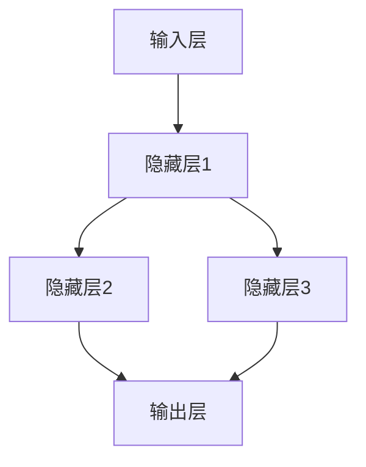

                 

关键词：神经网络、深度学习、人工智能、机器学习、架构、算法、模型、应用、展望

> 摘要：本文将探讨神经网络这一革命性的技术，从其历史背景、核心概念、算法原理到具体应用，全面解析神经网络如何改变世界。我们还将展望其未来发展趋势与挑战，为读者提供一幅神经网络技术的全景图。

## 1. 背景介绍

神经网络的概念最早可以追溯到1943年，由心理学家McCulloch和数学家Pitts提出，他们构建了第一个简单的神经网络模型——MP模型。随后，1958年，Frank Rosenblatt提出了感知机（Perceptron）算法，这是神经网络发展历程中的重要里程碑。

然而，神经网络在20世纪60年代由于遇到的数学难题和计算限制，研究进展一度停滞。直到20世纪80年代，随着计算机性能的显著提升和数值计算技术的发展，神经网络研究再次迎来了新的高潮。

1998年，深度学习概念被Geoffrey Hinton等人提出，这一概念使得神经网络在图像识别、语音识别等领域取得了突破性的进展。随着2006年Hinton提出的深度信念网络（Deep Belief Network）和2012年Google提出的深度卷积神经网络（Deep Convolutional Network）在ImageNet竞赛中的优异表现，神经网络开始在全球范围内引起了广泛关注。

## 2. 核心概念与联系

### 2.1 定义

神经网络（Neural Network，简称NN）是一种模仿生物神经网络结构的人工神经网络，通常由大量的节点（称为“神经元”）相互连接而成。每个神经元都可以接收多个输入信号，并通过激活函数产生输出信号。

### 2.2 架构

神经网络的架构可以分为输入层、隐藏层和输出层。输入层接收外部信息，隐藏层对输入信息进行加工处理，输出层产生最终结果。

### 2.3 Mermaid 流程图

以下是一个简化的神经网络Mermaid流程图：



## 3. 核心算法原理 & 具体操作步骤

### 3.1 算法原理概述

神经网络的训练过程主要包括两个阶段：前向传播和反向传播。

- 前向传播：将输入数据通过神经网络逐层传递，最终得到输出结果。
- 反向传播：根据输出结果和实际标签，计算损失函数，并通过反向传播算法更新网络权重。

### 3.2 算法步骤详解

1. **初始化网络参数**：包括输入层、隐藏层和输出层的权重和偏置。
2. **前向传播**：
    - 将输入数据传递到隐藏层，通过激活函数计算输出。
    - 将隐藏层的输出传递到下一层，直至输出层得到最终结果。
3. **计算损失**：使用损失函数计算输出结果和实际标签之间的差距。
4. **反向传播**：
    - 计算输出层的误差梯度。
    - 将误差梯度反向传播至隐藏层，更新权重和偏置。
5. **迭代训练**：重复前向传播和反向传播过程，直至达到训练目标。

### 3.3 算法优缺点

**优点**：
- **自适应性强**：神经网络可以通过学习自动调整权重，适应不同的问题场景。
- **泛化能力强**：神经网络可以处理大规模数据和复杂问题，具有较强的泛化能力。

**缺点**：
- **训练时间长**：神经网络训练过程需要大量计算资源，训练时间较长。
- **对数据依赖性强**：神经网络训练效果对数据质量和数量有很大影响。

### 3.4 算法应用领域

神经网络广泛应用于图像识别、语音识别、自然语言处理、推荐系统、自动驾驶等领域，为人工智能发展注入了强大的动力。

## 4. 数学模型和公式 & 详细讲解 & 举例说明

### 4.1 数学模型构建

神经网络的核心是前向传播和反向传播算法。以下是一个简化的神经网络模型：

$$
Z = \sum_{i=1}^{n} W_{ij} X_i + b_j
$$

其中，$Z$ 表示神经元的输出，$W_{ij}$ 表示权重，$X_i$ 表示输入，$b_j$ 表示偏置。

### 4.2 公式推导过程

前向传播过程中，每个神经元的输出可以通过以下公式计算：

$$
A = \sigma(Z)
$$

其中，$\sigma$ 表示激活函数，常用的激活函数有Sigmoid、ReLU等。

### 4.3 案例分析与讲解

假设我们有一个简单的神经网络，输入层有2个神经元，隐藏层有3个神经元，输出层有1个神经元。激活函数使用ReLU。

- **初始化参数**：$W_{ij}$ 和 $b_j$ 都初始化为0。
- **前向传播**：
  - 输入：$X = [1, 2]$
  - 隐藏层1输出：$Z_1 = [0, 0, 0]$
  - 隐藏层2输出：$Z_2 = [0, 0, 0]$
  - 输出层输出：$Z_3 = [0]$
- **反向传播**：
  - 计算输出层误差：$E_3 = Z_3 - Y$（其中$Y$为实际标签）
  - 计算隐藏层误差：$E_2 = \frac{\partial E_3}{\partial Z_2}$
  - 更新权重和偏置。

通过以上步骤，我们可以完成一次前向传播和反向传播。重复迭代训练，直至网络收敛。

## 5. 项目实践：代码实例和详细解释说明

### 5.1 开发环境搭建

在本项目中，我们将使用Python和TensorFlow作为开发工具。首先，确保已经安装了Python 3.7及以上版本和TensorFlow。

### 5.2 源代码详细实现

```python
import tensorflow as tf

# 初始化参数
inputs = tf.keras.Input(shape=(2,))
hidden = tf.keras.layers.Dense(3, activation='relu')(inputs)
outputs = tf.keras.layers.Dense(1, activation='sigmoid')(hidden)

# 构建模型
model = tf.keras.Model(inputs=inputs, outputs=outputs)

# 编译模型
model.compile(optimizer='adam', loss='binary_crossentropy', metrics=['accuracy'])

# 训练模型
model.fit(x_train, y_train, epochs=10, batch_size=32)
```

### 5.3 代码解读与分析

- **导入库**：导入TensorFlow库。
- **初始化参数**：定义输入层、隐藏层和输出层的神经元数量。
- **构建模型**：使用`tf.keras.Model`创建模型，并将输入层、隐藏层和输出层添加到模型中。
- **编译模型**：设置优化器、损失函数和评估指标。
- **训练模型**：使用`fit`方法训练模型，其中`x_train`和`y_train`分别为训练数据和标签。

### 5.4 运行结果展示

在训练完成后，可以使用以下代码查看模型的评估结果：

```python
evaluation = model.evaluate(x_test, y_test)
print(f"Test Loss: {evaluation[0]}, Test Accuracy: {evaluation[1]}")
```

## 6. 实际应用场景

神经网络在图像识别、语音识别、自然语言处理等领域有着广泛的应用。以下是一些具体的应用实例：

- **图像识别**：使用卷积神经网络（CNN）进行人脸识别、物体识别等。
- **语音识别**：使用循环神经网络（RNN）和长短期记忆网络（LSTM）实现语音识别。
- **自然语言处理**：使用Transformer模型进行机器翻译、文本分类等。

## 7. 工具和资源推荐

### 7.1 学习资源推荐

- 《深度学习》（Goodfellow, Bengio, Courville著）
- 《神经网络与深度学习》（邱锡鹏著）
- 《动手学深度学习》（阿斯顿·张著）

### 7.2 开发工具推荐

- TensorFlow
- PyTorch
- Keras

### 7.3 相关论文推荐

- Hinton, G. E., Osindero, S., & Teh, Y. W. (2006). A fast learning algorithm for deep belief nets. Neural computation, 18(7), 1527-1554.
- Krizhevsky, A., Sutskever, I., & Hinton, G. E. (2012). Imagenet classification with deep convolutional neural networks. In Advances in neural information processing systems (pp. 1097-1105).

## 8. 总结：未来发展趋势与挑战

### 8.1 研究成果总结

近年来，神经网络在各个领域取得了显著的成果，推动了人工智能的发展。深度学习算法的提出和优化，使得神经网络在图像识别、语音识别、自然语言处理等领域达到了前所未有的性能。

### 8.2 未来发展趋势

- **模型压缩与加速**：为了降低计算成本，研究人员致力于开发更加高效的神经网络模型。
- **多模态学习**：结合不同类型的数据，如图像、文本、语音等，实现更强大的语义理解。
- **解释性神经网络**：提高神经网络的可解释性，使其在实际应用中更加可靠。

### 8.3 面临的挑战

- **数据依赖性**：神经网络训练效果对数据质量和数量有很大依赖，如何解决数据匮乏问题成为一大挑战。
- **计算资源消耗**：神经网络训练过程需要大量计算资源，如何提高训练效率是一个重要问题。

### 8.4 研究展望

随着神经网络技术的不断发展，未来有望在更多领域取得突破，为人类生活带来更多便利。同时，如何解决数据依赖性和计算资源消耗等问题，也将是神经网络研究的重要方向。

## 9. 附录：常见问题与解答

### 9.1 什么是神经网络？

神经网络是一种模拟生物神经网络的人工神经网络，由大量的节点（称为“神经元”）相互连接而成。

### 9.2 神经网络有哪些类型？

神经网络可以分为卷积神经网络（CNN）、循环神经网络（RNN）、长短期记忆网络（LSTM）、Transformer等。

### 9.3 如何训练神经网络？

训练神经网络主要包括前向传播和反向传播两个阶段，通过不断调整网络权重和偏置，使网络输出更接近实际标签。

### 9.4 神经网络有哪些应用领域？

神经网络广泛应用于图像识别、语音识别、自然语言处理、推荐系统、自动驾驶等领域。

