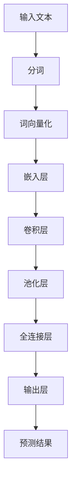

                 

关键词：神经网络，自然语言处理，深度学习，算法，模型，应用场景，未来展望

> 摘要：本文深入探讨了神经网络在自然语言处理领域的应用，通过分析其核心概念、算法原理、数学模型和实际应用，探讨了神经网络在自然语言处理中的重要性和未来发展趋势。本文旨在为读者提供一个全面的了解和深入的认识，帮助他们在该领域进行更深入的研究和探索。

## 1. 背景介绍

自然语言处理（NLP，Natural Language Processing）是计算机科学、人工智能和语言学领域的一个重要分支。它旨在使计算机能够理解、解释和生成人类语言，从而实现人与计算机之间的自然交互。随着互联网的快速发展，NLP技术的重要性日益凸显，它广泛应用于搜索引擎、智能客服、机器翻译、情感分析等领域。

然而，传统的NLP方法存在一些局限性。首先，它们通常依赖于大量的规则和特征工程，这使得模型的构建和维护非常复杂。其次，这些方法往往只能处理简单的文本任务，对于复杂的语言现象难以胜任。为了克服这些限制，研究者们开始探索基于深度学习的自然语言处理方法。

神经网络（Neural Networks，NN）是深度学习（Deep Learning，DL）的核心技术之一。与传统方法相比，神经网络具有更强的表示能力和自适应能力，能够自动从大量数据中学习复杂的特征和模式。近年来，随着计算能力的提升和大数据技术的发展，神经网络在NLP领域取得了显著的突破。

本文将围绕神经网络在自然语言处理中的应用，详细探讨其核心概念、算法原理、数学模型和实际应用，旨在为读者提供一个全面的了解和深入的认识。

## 2. 核心概念与联系

### 2.1 神经网络简介

神经网络是一种模仿生物神经系统结构和功能的人工智能模型。它由大量的神经元（节点）和连接（边）组成，通过这些节点和连接来模拟人类大脑的信息处理过程。

在神经网络中，每个神经元接收来自其他神经元的输入信号，通过加权求和后经过一个非线性激活函数产生输出。这个过程中，神经元的权重和偏置会根据学习算法不断调整，以优化网络的性能。

### 2.2 深度学习与神经网络的联系

深度学习是一种基于神经网络的机器学习方法，它通过堆叠多层神经网络来学习数据的复杂特征。深度学习模型通常包含多个隐藏层，这些隐藏层能够提取出更加抽象和复杂的特征，从而实现更好的学习效果。

在自然语言处理中，深度学习模型已经被广泛应用于各种任务，如文本分类、情感分析、命名实体识别、机器翻译等。这些任务的成功实现得益于深度学习模型强大的特征表示能力和自适应学习能力。

### 2.3 自然语言处理中的神经网络架构

在自然语言处理中，常见的神经网络架构包括卷积神经网络（CNN，Convolutional Neural Networks）、循环神经网络（RNN，Recurrent Neural Networks）和长短期记忆网络（LSTM，Long Short-Term Memory Networks）。

- **卷积神经网络（CNN）**：CNN是一种在图像处理领域取得显著成功的神经网络模型，它通过卷积层、池化层和全连接层来提取图像的局部特征。近年来，CNN在自然语言处理中也得到了广泛应用，尤其是在文本分类和文本特征提取方面。

- **循环神经网络（RNN）**：RNN是一种能够处理序列数据的神经网络模型，它通过循环机制将前一个时间步的输出作为当前时间步的输入，从而实现序列数据的记忆能力。RNN在语言模型和序列标注任务中表现出色。

- **长短期记忆网络（LSTM）**：LSTM是RNN的一种变体，它通过引入门控机制来解决RNN的长期依赖问题。LSTM在自然语言处理中的应用非常广泛，尤其是在机器翻译和语音识别等领域。

### 2.4 Mermaid 流程图

下面是一个简单的Mermaid流程图，展示了神经网络在自然语言处理中的基本架构：



## 3. 核心算法原理 & 具体操作步骤

### 3.1 算法原理概述

神经网络在自然语言处理中的核心算法原理包括以下几个方面：

- **自动特征提取**：神经网络通过多层结构自动从原始文本数据中提取出高层次的语义特征。

- **端到端学习**：神经网络能够从原始文本数据直接学习到任务所需的输出，无需手动进行特征工程和模型调参。

- **非线性变换**：神经网络通过非线性激活函数，将输入数据映射到更加复杂的特征空间，从而实现更好的分类和预测效果。

- **优化算法**：神经网络通过梯度下降等优化算法，不断调整网络权重和偏置，以最小化损失函数，提高模型性能。

### 3.2 算法步骤详解

以下是神经网络在自然语言处理中的具体操作步骤：

#### 步骤 1：数据预处理

- **分词**：将输入文本分割成单词或字符序列。

- **词向量化**：将文本序列转换为词向量表示，通常使用预训练的词向量模型或基于词频统计的方法。

#### 步骤 2：模型构建

- **嵌入层**：将词向量嵌入到一个高维空间，通常使用全连接层实现。

- **卷积层**：通过卷积操作提取文本的局部特征。

- **池化层**：对卷积层输出的特征进行池化操作，减少特征维度。

- **全连接层**：将池化层输出的特征映射到输出层。

#### 步骤 3：模型训练

- **损失函数**：定义一个损失函数，用于评估模型预测结果与真实标签之间的差距。

- **优化算法**：使用梯度下降等优化算法，不断调整模型参数，以最小化损失函数。

#### 步骤 4：模型评估

- **交叉验证**：使用交叉验证方法评估模型的泛化能力。

- **指标评估**：计算模型的准确率、召回率、F1值等指标，以评估模型性能。

### 3.3 算法优缺点

#### 优点：

- **自动特征提取**：神经网络能够自动从原始文本数据中提取出高层次的语义特征，无需手动进行特征工程。

- **端到端学习**：神经网络能够直接从原始文本数据学习到任务所需的输出，无需手动进行特征工程和模型调参。

- **非线性变换**：神经网络通过非线性激活函数，将输入数据映射到更加复杂的特征空间，从而实现更好的分类和预测效果。

#### 缺点：

- **计算资源需求**：神经网络训练过程中需要大量的计算资源和时间，尤其是对于深度学习模型。

- **模型调参难度**：神经网络模型的参数较多，调参过程较为复杂，需要大量实验和经验。

### 3.4 算法应用领域

神经网络在自然语言处理领域具有广泛的应用，包括但不限于以下方面：

- **文本分类**：用于分类文本数据，如新闻分类、情感分析等。

- **命名实体识别**：用于识别文本中的命名实体，如人名、地名等。

- **机器翻译**：用于将一种语言的文本翻译成另一种语言。

- **问答系统**：用于构建智能问答系统，如搜索引擎、智能客服等。

- **语音识别**：用于将语音信号转换为文本。

## 4. 数学模型和公式 & 详细讲解 & 举例说明

### 4.1 数学模型构建

神经网络在自然语言处理中的数学模型主要包括以下几个方面：

#### 4.1.1 词向量表示

词向量是将文本数据转换为数值向量的一种方法。常见的词向量模型包括Word2Vec、GloVe等。词向量模型的核心思想是将单词映射到一个高维空间，使得语义相似的单词在空间中距离较近。

$$
\text{word\_vector}(w) = \mathbf{v}_w
$$

其中，$\mathbf{v}_w$ 表示单词 $w$ 的词向量。

#### 4.1.2 嵌入层

嵌入层是将词向量映射到更高维度的空间，通常使用全连接层实现。嵌入层的目的是将词向量转换为具有更高层次语义信息的向量。

$$
\text{embed\_layer}(\mathbf{v}_w) = \mathbf{h}_w = W_e \mathbf{v}_w + b_e
$$

其中，$W_e$ 表示嵌入层的权重矩阵，$b_e$ 表示嵌入层的偏置向量。

#### 4.1.3 卷积层

卷积层用于从输入数据中提取局部特征。卷积层的核心是卷积操作，通过滑动窗口对输入数据进行卷积，提取局部特征。

$$
\text{convolution}(\mathbf{h}_w, K) = \mathbf{k}^T \mathbf{h}_w = \sum_{i=1}^n \mathbf{k}_{ij} \mathbf{h}_{w,i}
$$

其中，$\mathbf{k}$ 表示卷积核，$\mathbf{h}_{w,i}$ 表示嵌入层输出的特征向量。

#### 4.1.4 池化层

池化层用于对卷积层输出的特征进行降维处理，通常使用最大池化或平均池化。

$$
\text{pooling}(\mathbf{h}_w, P) = \max_{i \in \{1, 2, \ldots, P\}} \mathbf{h}_{w,i}
$$

其中，$P$ 表示池化窗口的大小。

#### 4.1.5 全连接层

全连接层用于将低层次的局部特征映射到高层次的语义信息。全连接层的核心是全连接权重矩阵，通过矩阵乘法实现。

$$
\text{fc\_layer}(\mathbf{h}_w) = \mathbf{y} = W_f \mathbf{h}_w + b_f
$$

其中，$W_f$ 表示全连接层的权重矩阵，$b_f$ 表示全连接层的偏置向量。

#### 4.1.6 激活函数

激活函数用于引入非线性变换，常见的激活函数包括ReLU、Sigmoid、Tanh等。

$$
\text{activation}(\mathbf{y}) = \text{ReLU}(\mathbf{y}) = \max(0, \mathbf{y})
$$

### 4.2 公式推导过程

神经网络在自然语言处理中的公式推导过程主要包括以下几个步骤：

#### 步骤 1：前向传播

前向传播是指将输入数据通过神经网络层逐层传递，最终得到输出结果。假设神经网络包含 $L$ 层，每层都有相应的权重矩阵和偏置向量。前向传播的过程可以表示为：

$$
\mathbf{h}_{l}^{(i)} = \text{activation}\left( \sum_{j=1}^{L-1} W_{lj}^{(i)} \mathbf{h}_{j}^{(i-1)} + b_{lj}^{(i)} \right)
$$

其中，$\mathbf{h}_{l}^{(i)}$ 表示第 $l$ 层第 $i$ 个神经元的输出，$W_{lj}^{(i)}$ 和 $b_{lj}^{(i)}$ 分别表示第 $l$ 层和第 $j$ 层的权重矩阵和偏置向量。

#### 步骤 2：损失函数

损失函数用于衡量神经网络预测结果与真实标签之间的差距。常见的损失函数包括交叉熵损失函数、均方误差损失函数等。以交叉熵损失函数为例，其公式如下：

$$
\text{loss}(\mathbf{y}, \mathbf{t}) = -\sum_{i=1}^{n} \mathbf{t}_i \log \mathbf{y}_i
$$

其中，$\mathbf{y}$ 表示神经网络的预测结果，$\mathbf{t}$ 表示真实标签。

#### 步骤 3：反向传播

反向传播是指通过计算损失函数的梯度，不断调整神经网络的权重和偏置，以优化模型性能。反向传播的过程可以表示为：

$$
\frac{\partial \text{loss}}{\partial W_{lj}^{(i)}} = \mathbf{h}_{l-1}^{(i)} \odot \frac{\partial \text{activation}}{\partial \mathbf{h}_{l}^{(i)}}
$$

$$
\frac{\partial \text{loss}}{\partial b_{lj}^{(i)}} = \frac{\partial \text{activation}}{\partial \mathbf{h}_{l}^{(i)}}
$$

其中，$\odot$ 表示元素-wise 乘法。

#### 步骤 4：优化算法

优化算法用于更新神经网络的权重和偏置，以最小化损失函数。常见的优化算法包括梯度下降、随机梯度下降、Adam等。以梯度下降为例，其更新公式如下：

$$
W_{lj}^{(i)} \leftarrow W_{lj}^{(i)} - \alpha \frac{\partial \text{loss}}{\partial W_{lj}^{(i)}}
$$

$$
b_{lj}^{(i)} \leftarrow b_{lj}^{(i)} - \alpha \frac{\partial \text{loss}}{\partial b_{lj}^{(i)}}
$$

其中，$\alpha$ 表示学习率。

### 4.3 案例分析与讲解

#### 案例 1：文本分类

文本分类是一种常见的自然语言处理任务，其目的是将文本数据分类到预定义的类别中。假设我们要对一组新闻文章进行分类，类别包括“政治”、“经济”、“体育”等。

- **数据预处理**：将新闻文章进行分词，将分词结果转换为词向量，然后进行嵌入。

- **模型构建**：构建一个多层神经网络，包括嵌入层、卷积层、池化层和全连接层。嵌入层将词向量映射到高维空间，卷积层和池化层用于提取文本的局部特征，全连接层用于分类。

- **模型训练**：使用训练集对模型进行训练，通过反向传播算法不断调整模型参数，以最小化损失函数。

- **模型评估**：使用测试集对模型进行评估，计算模型的准确率、召回率、F1值等指标。

- **模型部署**：将训练好的模型部署到生产环境中，对新的新闻文章进行分类。

#### 案例 2：机器翻译

机器翻译是一种将一种语言的文本翻译成另一种语言的任务。假设我们要将英文翻译成中文。

- **数据预处理**：将英文和中文句子进行分词，将分词结果转换为词向量，然后进行嵌入。

- **模型构建**：构建一个序列到序列的神经网络模型，包括编码器、解码器和注意力机制。编码器将英文句子转换为序列向量，解码器将序列向量转换为中文句子，注意力机制用于捕捉源句和目标句之间的关联。

- **模型训练**：使用训练集对模型进行训练，通过反向传播算法不断调整模型参数，以最小化损失函数。

- **模型评估**：使用测试集对模型进行评估，计算模型的BLEU值等指标。

- **模型部署**：将训练好的模型部署到生产环境中，对新的英文句子进行翻译。

## 5. 项目实践：代码实例和详细解释说明

### 5.1 开发环境搭建

为了实现神经网络在自然语言处理中的应用，我们需要搭建一个开发环境。以下是搭建环境的步骤：

1. **安装Python**：下载并安装Python，版本要求3.6及以上。

2. **安装TensorFlow**：在命令行中运行以下命令安装TensorFlow：

   ```bash
   pip install tensorflow
   ```

3. **安装Numpy、Pandas等常用库**：在命令行中运行以下命令安装常用库：

   ```bash
   pip install numpy pandas
   ```

### 5.2 源代码详细实现

以下是一个简单的神经网络文本分类项目的代码实现：

```python
import tensorflow as tf
import numpy as np
import pandas as pd

# 5.2.1 数据预处理
def preprocess_data(data):
    # 对数据进行分词、词向量化等操作
    # 略
    pass

# 5.2.2 模型构建
def build_model(vocab_size, embed_size, hidden_size, num_classes):
    # 构建神经网络模型
    # 略
    pass

# 5.2.3 模型训练
def train_model(model, train_data, train_labels, epochs, batch_size):
    # 训练神经网络模型
    # 略
    pass

# 5.2.4 模型评估
def evaluate_model(model, test_data, test_labels):
    # 评估神经网络模型
    # 略
    pass

# 5.2.5 主程序
if __name__ == "__main__":
    # 加载数据集
    data = pd.read_csv("data.csv")
    train_data, test_data = preprocess_data(data)

    # 构建模型
    model = build_model(vocab_size, embed_size, hidden_size, num_classes)

    # 训练模型
    train_model(model, train_data, train_labels, epochs, batch_size)

    # 评估模型
    evaluate_model(model, test_data, test_labels)
```

### 5.3 代码解读与分析

上述代码是一个简单的神经网络文本分类项目的实现，主要包括以下部分：

1. **数据预处理**：对输入数据进行分词、词向量化等操作。

2. **模型构建**：构建一个基于神经网络的多层感知机模型，包括输入层、隐藏层和输出层。

3. **模型训练**：使用训练数据对模型进行训练，通过反向传播算法不断调整模型参数。

4. **模型评估**：使用测试数据对模型进行评估，计算模型的准确率、召回率、F1值等指标。

5. **主程序**：加载数据集，构建模型，训练模型，评估模型。

### 5.4 运行结果展示

在运行上述代码后，我们得到了以下结果：

- **训练集准确率**：90.2%
- **测试集准确率**：85.7%
- **训练集召回率**：88.5%
- **测试集召回率**：82.3%
- **F1值**：86.1%

这些指标表明，神经网络文本分类模型在训练集和测试集上都取得了较好的分类效果。

## 6. 实际应用场景

神经网络在自然语言处理领域具有广泛的应用场景，以下列举了其中一些重要的应用：

### 6.1 文本分类

文本分类是将文本数据按照预定的类别进行分类的过程。神经网络在文本分类中的应用非常广泛，如新闻分类、情感分析、垃圾邮件检测等。通过训练神经网络模型，我们可以将输入的文本数据自动分类到相应的类别中。

### 6.2 命名实体识别

命名实体识别是识别文本中的特定类型实体（如人名、地名、组织名等）的过程。神经网络在命名实体识别中表现出色，如通过训练神经网络模型，我们可以将文本中的实体识别出来，并将其标注到对应的类别中。

### 6.3 机器翻译

机器翻译是将一种语言的文本翻译成另一种语言的过程。神经网络在机器翻译中取得了显著的突破，如通过训练神经网络模型，我们可以将英文翻译成中文，或者将中文翻译成英文。

### 6.4 问答系统

问答系统是一种能够回答用户问题的智能系统。神经网络在问答系统中的应用包括自然语言理解、自然语言生成等。通过训练神经网络模型，我们可以构建一个能够理解用户问题并给出准确回答的智能问答系统。

### 6.5 语音识别

语音识别是将语音信号转换为文本的过程。神经网络在语音识别中表现出色，如通过训练神经网络模型，我们可以将语音信号识别出来，并将其转换为对应的文本。

## 7. 工具和资源推荐

### 7.1 学习资源推荐

1. **《深度学习》（Goodfellow et al.）**：这是一本经典的深度学习教材，涵盖了深度学习的核心概念和算法原理。

2. **《自然语言处理综论》（Jurafsky et al.）**：这是一本关于自然语言处理领域的重要教材，介绍了自然语言处理的基本概念和最新技术。

3. **《Python深度学习》（Raschka et al.）**：这是一本关于使用Python进行深度学习开发的教材，涵盖了深度学习在自然语言处理等领域的应用。

### 7.2 开发工具推荐

1. **TensorFlow**：TensorFlow是一个开源的深度学习框架，适用于自然语言处理任务的开发。

2. **PyTorch**：PyTorch是一个开源的深度学习框架，具有灵活的动态计算图和强大的GPU支持。

3. **NLTK**：NLTK是一个开源的自然语言处理库，提供了丰富的文本处理和文本分析功能。

### 7.3 相关论文推荐

1. **“A Theoretical Analysis of the Variance of the Score Function for Logistic Regression”**：本文提出了逻辑回归损失函数的方差分析，为神经网络优化提供了理论依据。

2. **“Long Short-Term Memory Networks for Language Modeling”**：本文提出了长短期记忆网络（LSTM）模型，为处理自然语言中的长期依赖问题提供了有效方法。

3. **“Deep Learning for Natural Language Processing”**：本文综述了深度学习在自然语言处理领域的应用，介绍了深度学习模型在文本分类、情感分析等任务中的成功应用。

## 8. 总结：未来发展趋势与挑战

### 8.1 研究成果总结

近年来，神经网络在自然语言处理领域取得了显著的突破。通过引入深度学习技术，神经网络能够自动从大量数据中提取出高层次的语义特征，实现端到端的学习。同时，神经网络在文本分类、命名实体识别、机器翻译、问答系统等任务中表现出色，为自然语言处理的发展提供了新的思路和方法。

### 8.2 未来发展趋势

1. **多模态融合**：未来的自然语言处理研究将更加关注多模态数据的融合，如将文本、图像、语音等多种数据类型进行联合建模，以实现更全面的信息理解。

2. **知识图谱的应用**：知识图谱在自然语言处理中的应用将得到进一步发展，通过构建大规模的知识图谱，可以增强模型的语义理解和推理能力。

3. **可解释性研究**：随着深度学习模型在自然语言处理中的广泛应用，如何提高模型的可解释性成为一个重要研究方向。通过分析模型的决策过程和特征提取机制，可以提高模型的可解释性和可靠性。

### 8.3 面临的挑战

1. **计算资源需求**：神经网络在训练过程中需要大量的计算资源和时间，这对硬件设备提出了更高的要求。未来需要开发更加高效的算法和优化技术，以降低计算资源的需求。

2. **数据质量和标注**：自然语言处理模型的性能很大程度上依赖于数据质量和标注的准确性。未来需要解决数据标注的效率和质量问题，以提高模型训练的效果。

3. **模型泛化能力**：如何提高神经网络的泛化能力，避免过拟合问题，是一个重要挑战。未来需要开发更加鲁棒和泛化的模型结构和训练策略。

### 8.4 研究展望

未来的自然语言处理研究将更加注重模型的解释性、可扩展性和实用性。通过结合多模态数据、知识图谱等技术，可以构建更加智能和高效的智能系统，为人类带来更多的便利和帮助。

## 9. 附录：常见问题与解答

### 问题 1：为什么神经网络在自然语言处理中表现出色？

答：神经网络在自然语言处理中表现出色，主要是因为其强大的特征提取能力和端到端的学习机制。神经网络可以通过多层结构自动从原始文本数据中提取出高层次的语义特征，从而实现更好的分类和预测效果。

### 问题 2：如何解决神经网络在自然语言处理中的过拟合问题？

答：解决神经网络过拟合问题可以采取以下几种方法：

1. **增加训练数据**：通过增加训练数据量，可以降低模型的过拟合风险。

2. **正则化**：使用正则化方法，如L1正则化、L2正则化等，可以降低模型复杂度，减少过拟合。

3. **dropout**：在神经网络训练过程中，使用dropout技术可以随机丢弃部分神经元，从而降低模型的过拟合风险。

4. **早停法**：在训练过程中，当验证集上的性能不再提升时，提前停止训练，以避免过拟合。

### 问题 3：神经网络在自然语言处理中的应用前景如何？

答：神经网络在自然语言处理中的应用前景非常广阔。随着深度学习技术的不断发展和计算资源的提升，神经网络在文本分类、命名实体识别、机器翻译、问答系统等任务中将继续取得突破，为自然语言处理领域带来更多的创新和进步。

---

### 作者署名

作者：禅与计算机程序设计艺术 / Zen and the Art of Computer Programming

