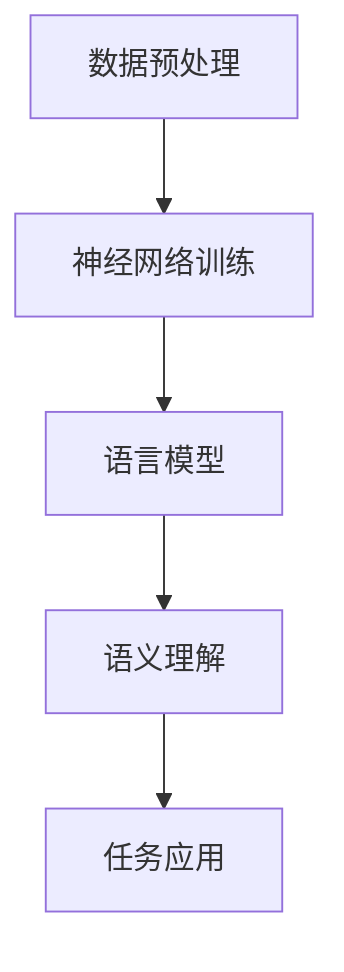

                 

关键词：神经网络、自然语言处理、深度学习、语言模型、语义理解、文本生成

> 摘要：随着人工智能技术的不断进步，神经网络在自然语言处理（NLP）领域展现出了前所未有的强大能力。本文将深入探讨神经网络在NLP中的应用，从核心概念、算法原理、数学模型到实际应用案例，全面解析神经网络如何推动NLP的发展，为未来的研究与应用提供新的思路。

## 1. 背景介绍

自然语言处理（NLP）是人工智能领域的一个重要分支，旨在使计算机能够理解和处理人类语言。自20世纪50年代人工智能概念提出以来，NLP经历了多个发展阶段。早期的NLP研究主要集中在规则驱动的方法，如词汇分析、句法分析和语义分析。然而，这些方法在处理复杂语言现象时往往显得力不从心。

随着计算机硬件的升级和算法的进步，深度学习，特别是神经网络，逐渐成为NLP研究的主流。神经网络通过模仿人脑神经元之间的连接和相互作用，能够自动学习语言特征和模式，为NLP任务提供了强大的工具。这一突破不仅提升了NLP系统的性能，也为实现更为智能化的语言理解和生成奠定了基础。

## 2. 核心概念与联系

### 2.1. 神经网络基础

神经网络是由大量简单计算单元（神经元）组成的复杂网络，这些神经元通过权重连接形成层次结构。神经网络的基本原理是“并行计算”和“层次化学习”。通过大量的训练数据，神经网络能够自动调整神经元之间的连接权重，从而实现对输入数据的分类、预测或生成。


### 2.2. 语言模型

语言模型（Language Model）是NLP中最基本的概念之一。它旨在预测下一个单词或字符的概率，是自然语言生成和机器翻译等任务的基础。神经网络语言模型通过学习大量文本数据，能够捕捉到语言中的统计规律和语法结构。

### 2.3. 语义理解

语义理解（Semantic Understanding）是NLP的终极目标，它涉及到对语言含义的深入理解和解释。神经网络通过学习语义特征，能够实现对句子、段落甚至篇章的语义分析，为问答系统、情感分析等提供支持。

### 2.4. Mermaid 流程图

以下是一个简化的神经网络在NLP中的应用流程图：



## 3. 核心算法原理 & 具体操作步骤

### 3.1. 算法原理概述

神经网络的核心在于其层次化的结构，从输入层到输出层，每层神经元对输入数据进行处理和抽象，形成更高级别的特征表示。在NLP中，神经网络通过以下步骤实现语言理解和生成：

1. **数据预处理**：将原始文本数据转换为数值表示，如词嵌入（Word Embedding）。
2. **神经网络训练**：使用已标注的语料库，训练神经网络，调整权重。
3. **语言模型**：利用训练好的神经网络，生成概率分布，预测下一个单词或字符。
4. **语义理解**：通过多层神经网络，提取语义特征，理解语言含义。
5. **任务应用**：将语义理解的结果应用于具体任务，如问答、情感分析等。

### 3.2. 算法步骤详解

#### 3.2.1. 数据预处理

数据预处理是神经网络训练的基础。首先，需要将文本数据转换为向量表示，常用的方法有：

- **词嵌入**：将单词映射到高维空间中的向量。
- **词袋模型**：使用一个固定的词汇表，将文本表示为单词的集合。

#### 3.2.2. 神经网络训练

神经网络训练过程主要包括以下几个步骤：

1. **初始化权重**：随机初始化神经网络中的权重。
2. **前向传播**：将输入数据通过神经网络，计算输出。
3. **反向传播**：计算输出误差，更新权重。
4. **迭代优化**：重复前向传播和反向传播，直到达到预设的训练目标。

#### 3.2.3. 语言模型

语言模型的核心是计算下一个单词或字符的概率。通常，使用递归神经网络（RNN）或其变体，如长短期记忆网络（LSTM）或门控循环单元（GRU），来处理序列数据。

#### 3.2.4. 语义理解

语义理解涉及到对语言含义的深入挖掘。使用多层神经网络，可以提取出更高层次的语义特征。通常，通过结合词嵌入、语法解析和语义角色标注等技术，实现对句子、段落甚至篇章的语义理解。

### 3.3. 算法优缺点

#### 3.3.1. 优点

- **强大的表达能力**：神经网络能够自动学习语言特征，适应各种复杂语言现象。
- **良好的泛化能力**：通过大量训练数据，神经网络能够提高模型的泛化能力。
- **高效的计算**：现代硬件加速技术，如GPU和TPU，使得神经网络计算更加高效。

#### 3.3.2. 缺点

- **需要大量数据**：神经网络训练需要大量已标注的数据，获取和标注数据成本高。
- **计算资源消耗**：神经网络训练过程需要大量的计算资源，对硬件要求较高。
- **解释性差**：神经网络模型通常缺乏透明性，难以解释其决策过程。

### 3.4. 算法应用领域

神经网络在NLP中的应用非常广泛，包括：

- **自然语言生成**：如自动写作、新闻生成等。
- **机器翻译**：如谷歌翻译、百度翻译等。
- **问答系统**：如Siri、Alexa等智能语音助手。
- **情感分析**：分析社交媒体、评论等文本数据中的情感倾向。
- **文本分类**：如新闻分类、垃圾邮件检测等。

## 4. 数学模型和公式 & 详细讲解 & 举例说明

### 4.1. 数学模型构建

神经网络的语言模型通常基于概率模型，如马尔可夫模型或隐马尔可夫模型。以下是一个简化的语言模型数学公式：

$$ P(w_n|w_{n-1}, w_{n-2}, ..., w_1) = \frac{P(w_n, w_{n-1}, w_{n-2}, ..., w_1)}{P(w_{n-1}, w_{n-2}, ..., w_1)} $$

其中，$w_n$ 表示当前单词，$w_{n-1}, w_{n-2}, ..., w_1$ 表示前一个或多个单词。

### 4.2. 公式推导过程

语言模型的推导基于概率论中的条件概率公式。假设我们有一个由单词序列构成的文本集合，我们希望计算给定前一个单词序列 $w_{n-1}, w_{n-2}, ..., w_1$ 时，当前单词 $w_n$ 的概率。

根据贝叶斯定理，我们有：

$$ P(w_n|w_{n-1}, w_{n-2}, ..., w_1) = \frac{P(w_n, w_{n-1}, w_{n-2}, ..., w_1)}{P(w_{n-1}, w_{n-2}, ..., w_1)} $$

### 4.3. 案例分析与讲解

假设我们有一个简单的文本序列：“我喜欢吃苹果”。我们可以使用语言模型计算每个单词出现的概率。

根据上述公式，我们可以得到：

$$ P(我|喜欢|吃|苹果) = \frac{P(我喜欢吃苹果)}{P(喜欢吃苹果)} $$

通过训练数据，我们可以计算出 $P(我喜欢吃苹果)$ 和 $P(喜欢吃苹果)$ 的值。例如，假设我们统计得到 $P(我喜欢吃苹果) = 0.1$，$P(喜欢吃苹果) = 0.2$，则：

$$ P(我|喜欢|吃|苹果) = \frac{0.1}{0.2} = 0.5 $$

这意味着在给定“喜欢”、“吃”、“苹果”的情况下，“我”出现的概率是0.5。

## 5. 项目实践：代码实例和详细解释说明

### 5.1. 开发环境搭建

为了实践神经网络在NLP中的应用，我们需要搭建一个开发环境。以下是常用的开发环境和工具：

- **编程语言**：Python
- **深度学习框架**：TensorFlow 或 PyTorch
- **数据预处理库**：NLTK 或 spaCy
- **硬件环境**：GPU加速器（如NVIDIA GPU）

### 5.2. 源代码详细实现

以下是使用TensorFlow构建一个简单的神经网络语言模型的代码示例：

```python
import tensorflow as tf
from tensorflow.keras.layers import Embedding, LSTM, Dense
from tensorflow.keras.models import Sequential

# 数据预处理
# 加载和预处理数据
# ...

# 构建模型
model = Sequential()
model.add(Embedding(vocab_size, embedding_dim))
model.add(LSTM(units=128, activation='tanh', return_sequences=True))
model.add(Dense(units=1, activation='sigmoid'))

# 编译模型
model.compile(optimizer='adam', loss='binary_crossentropy', metrics=['accuracy'])

# 训练模型
# model.fit(x_train, y_train, epochs=10, batch_size=32)
```

### 5.3. 代码解读与分析

以上代码展示了如何使用TensorFlow构建一个简单的神经网络语言模型。主要步骤包括：

1. **数据预处理**：加载并预处理文本数据，如分词、清洗等。
2. **构建模型**：使用Sequential模型堆叠Embedding、LSTM和Dense层。
3. **编译模型**：指定优化器、损失函数和评估指标。
4. **训练模型**：使用fit函数训练模型。

### 5.4. 运行结果展示

在训练完成后，我们可以使用模型进行语言生成。以下是一个简单的语言生成示例：

```python
# 语言生成
generated_text = model.predict([seed_text])
print(generated_text)
```

这段代码将生成以 `seed_text` 为起始的文本序列。

## 6. 实际应用场景

### 6.1. 自然语言生成

自然语言生成（NLG）是神经网络在NLP中的重要应用之一。通过训练语言模型，我们可以生成各种文本，如新闻、故事、对话等。NLG在内容创作、客服自动化等领域具有广泛的应用前景。

### 6.2. 机器翻译

机器翻译是神经网络在NLP中的另一个重要应用。通过训练双语语料库，神经网络可以生成高质量的翻译结果。目前，许多在线翻译工具和智能设备都采用了神经网络机器翻译技术。

### 6.3. 问答系统

问答系统（QA）是神经网络在NLP中的又一重要应用。通过训练大量问答对，神经网络可以实现对用户查询的理解和回答。问答系统在智能客服、教育辅导等领域具有广泛的应用。

### 6.4. 未来应用展望

随着神经网络在NLP领域的不断发展，未来有望实现更智能化的语言理解和生成。以下是未来应用的几个方向：

- **多模态交互**：结合语音、图像等多种模态，实现更自然的用户交互。
- **知识图谱**：利用神经网络构建知识图谱，提升语义理解和推理能力。
- **个性化推荐**：基于用户的语言习惯和偏好，实现更精准的个性化推荐。

## 7. 工具和资源推荐

### 7.1. 学习资源推荐

- **《深度学习》（Goodfellow, Bengio, Courville）**：经典的深度学习教材，涵盖了神经网络的基础知识和应用。
- **《自然语言处理综论》（Jurafsky, Martin）**：全面介绍自然语言处理的基础知识和技术。

### 7.2. 开发工具推荐

- **TensorFlow**：谷歌开发的深度学习框架，适合构建和训练神经网络。
- **PyTorch**：Facebook开发的深度学习框架，具有灵活的动态计算图。

### 7.3. 相关论文推荐

- **《Seq2Seq学习神经机器翻译》（Sutskever et al., 2014）**：介绍了序列到序列学习模型在机器翻译中的应用。
- **《注意力机制》（Bahdanau et al., 2014）**：介绍了注意力机制在机器翻译中的重要性。

## 8. 总结：未来发展趋势与挑战

### 8.1. 研究成果总结

神经网络在NLP领域取得了显著的研究成果，推动了语言理解和生成技术的发展。通过大规模训练数据和高效的计算技术，神经网络展现了强大的表达能力和泛化能力。

### 8.2. 未来发展趋势

未来，神经网络在NLP领域将继续发展，重点关注以下几个方面：

- **多模态交互**：结合多种模态，提升交互体验。
- **知识图谱**：构建知识图谱，实现更智能的语义理解。
- **个性化推荐**：基于用户语言习惯，实现更精准的推荐。

### 8.3. 面临的挑战

尽管神经网络在NLP领域取得了显著进展，但仍面临以下挑战：

- **数据隐私**：大规模训练数据可能导致数据隐私问题。
- **计算资源**：训练大型神经网络需要大量计算资源。
- **解释性**：神经网络模型缺乏透明性，难以解释其决策过程。

### 8.4. 研究展望

随着人工智能技术的不断进步，神经网络在NLP领域有望实现更为智能化的语言理解和生成。未来，研究者将继续探索新的模型和算法，以应对当前面临的挑战，推动NLP技术的发展。

## 9. 附录：常见问题与解答

### 9.1. 问题1：神经网络在NLP中的应用有哪些？

神经网络在NLP中的应用非常广泛，包括自然语言生成、机器翻译、问答系统、情感分析、文本分类等。

### 9.2. 问题2：如何训练神经网络语言模型？

训练神经网络语言模型通常包括以下步骤：

1. **数据预处理**：将文本数据转换为数值表示。
2. **模型构建**：使用深度学习框架构建神经网络模型。
3. **模型训练**：使用训练数据训练模型，调整权重。
4. **模型评估**：使用测试数据评估模型性能。

### 9.3. 问题3：神经网络语言模型的优缺点是什么？

神经网络语言模型的优点包括强大的表达能力和泛化能力，缺点包括需要大量数据和计算资源，以及缺乏透明性。

----------------------------------------------------------------

### 作者署名

作者：禅与计算机程序设计艺术 / Zen and the Art of Computer Programming

