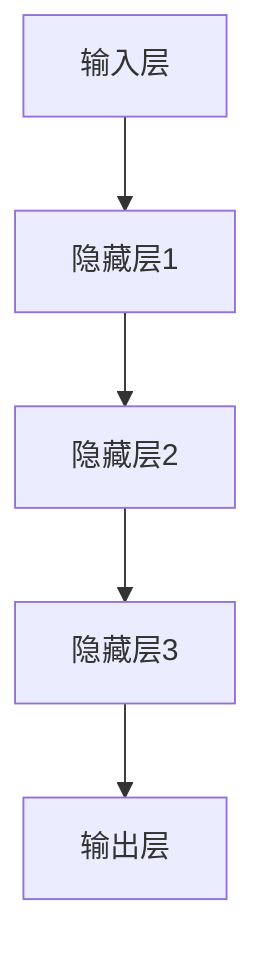

                 

关键词：神经网络、解释性、可解释性、模型、算法、应用场景、发展趋势

> 摘要：本文从神经网络的基础概念出发，深入探讨了神经网络的解释性与可解释性。通过详细阐述神经网络的工作原理、核心算法、数学模型以及实际应用，本文分析了神经网络在当今时代的重要性及其面临的挑战。最后，对未来的发展趋势和可能的研究方向进行了展望。

## 1. 背景介绍

### 1.1 神经网络的发展历程

神经网络的概念最早可以追溯到1943年，由心理学家McCulloch和数学家Pitts提出。最初的神经网络模型非常简单，主要是用于模拟人脑神经元的工作方式。直到20世纪80年代，由于计算机性能的提升和算法的改进，神经网络的研究和应用才取得了显著的进展。

近年来，随着深度学习的兴起，神经网络在图像识别、自然语言处理、推荐系统等领域的应用越来越广泛。神经网络的复杂度和计算能力也在不断提高，使得它们能够处理更加复杂的问题。

### 1.2 解释性与可解释性的重要性

解释性（Interpretability）与可解释性（Explainability）是两个密切相关但有所不同的概念。解释性指的是模型在决策过程中能够提供解释的程度，而可解释性则是指模型本身能够被理解和解释的程度。

在神经网络领域，解释性与可解释性的重要性主要体现在以下几个方面：

1. **信任与透明度**：模型的可解释性有助于提高用户对模型的信任度和透明度，特别是在涉及到安全和伦理的领域。
2. **错误诊断与调试**：解释性可以帮助研究人员和开发者更好地理解和调试模型，从而提高模型的可靠性和稳定性。
3. **模型改进与创新**：通过理解模型的工作原理，可以启发新的模型设计和改进方向。

## 2. 核心概念与联系

### 2.1 神经网络的基本结构

神经网络由多个层组成，包括输入层、隐藏层和输出层。每一层由多个神经元（或节点）组成，神经元之间通过权重进行连接。神经元的输出通过激活函数进行处理，最终得到模型的预测结果。


### 2.2 激活函数与非线性特性

激活函数是神经网络的核心组成部分，它引入了非线性特性，使得神经网络能够处理复杂的非线性问题。常见的激活函数包括Sigmoid、ReLU和Tanh等。

$$
f(x) = \frac{1}{1 + e^{-x}}
$$

$$
f(x) = max(0, x)
$$

$$
f(x) = \frac{e^x - e^{-x}}{e^x + e^{-x}}
$$

### 2.3 学习算法与优化

神经网络的学习过程通常采用梯度下降算法，通过不断调整权重和偏置，使得模型的预测结果更接近真实值。梯度下降算法的优化方法包括随机梯度下降（SGD）、Adam等。

$$
w_{new} = w_{old} - \alpha \cdot \nabla_w J(w)
$$

其中，$w$表示权重，$\alpha$表示学习率，$J(w)$表示损失函数。

### 2.4 神经网络的层次结构与抽象能力

随着层数的增加，神经网络能够捕获的抽象层次也逐渐增加。深度神经网络通过层次化的结构，能够从原始数据中提取出更高层次的抽象特征。

### 2.5 Mermaid 流程图

下面是神经网络的 Mermaid 流程图：



## 3. 核心算法原理 & 具体操作步骤

### 3.1 算法原理概述

神经网络的学习过程可以概括为以下三个步骤：

1. **前向传播**：将输入数据通过网络的每一层，计算得到输出。
2. **损失计算**：计算模型预测值与真实值之间的差距，得到损失函数。
3. **反向传播**：根据损失函数的梯度，更新网络的权重和偏置。

### 3.2 算法步骤详解

1. **初始化权重和偏置**：随机初始化网络的权重和偏置。
2. **前向传播**：将输入数据输入到网络，计算每一层的输出。
3. **损失计算**：计算预测值与真实值之间的差距，得到损失函数。
4. **反向传播**：计算损失函数关于权重和偏置的梯度，更新网络的权重和偏置。
5. **迭代优化**：重复步骤2-4，直到模型达到预定的性能指标。

### 3.3 算法优缺点

**优点**：

- 强大的抽象能力，能够处理复杂的非线性问题。
- 自适应学习，能够从大量数据中自动提取特征。

**缺点**：

- 需要大量的训练数据和计算资源。
- 模型的解释性较差，难以理解决策过程。

### 3.4 算法应用领域

神经网络在图像识别、自然语言处理、推荐系统、金融分析等领域有广泛的应用。以下是一些典型的应用案例：

1. **图像识别**：使用卷积神经网络（CNN）进行图像分类和目标检测。
2. **自然语言处理**：使用循环神经网络（RNN）和长短期记忆网络（LSTM）进行语言建模和机器翻译。
3. **推荐系统**：使用深度神经网络进行用户兴趣挖掘和商品推荐。

## 4. 数学模型和公式 & 详细讲解 & 举例说明

### 4.1 数学模型构建

神经网络的数学模型主要包括以下几个方面：

1. **前向传播**：
$$
z_i = \sum_{j=1}^{n} w_{ij} \cdot a_j + b_i
$$
$$
a_i = \sigma(z_i)
$$

其中，$z_i$表示第$i$个神经元的输入，$a_i$表示第$i$个神经元的输出，$w_{ij}$表示第$i$个神经元与第$j$个神经元的连接权重，$b_i$表示第$i$个神经元的偏置，$\sigma$表示激活函数。

2. **反向传播**：
$$
\delta_j = \frac{\partial J}{\partial z_j} = \delta(z_j) \cdot \sigma'(z_j)
$$
$$
\frac{\partial J}{\partial w_{ij}} = a_i \cdot \delta_j
$$
$$
\frac{\partial J}{\partial b_i} = \delta_j
$$

其中，$\delta$表示误差项，$\sigma'$表示激活函数的导数。

### 4.2 公式推导过程

1. **前向传播**：

假设输入层有$m$个神经元，隐藏层有$n$个神经元，输出层有$p$个神经元。

首先，定义输入层和隐藏层的权重矩阵$W_{in}$和$W_{ih}$，隐藏层和输出层的权重矩阵$W_{hh}$和$W_{ho}$。

$$
z_{h1} = \sum_{i=1}^{m} W_{in1i} \cdot x_i + b_{h1}
$$
$$
z_{h2} = \sum_{i=1}^{m} W_{in2i} \cdot x_i + b_{h2}
$$
$$
\vdots
$$
$$
z_{hn} = \sum_{i=1}^{m} W_{inmi} \cdot x_i + b_{hn}
$$

$$
a_{h1} = \sigma(z_{h1})
$$
$$
a_{h2} = \sigma(z_{h2})
$$
$$
\vdots
$$
$$
a_{hn} = \sigma(z_{hn})
$$

$$
z_{o1} = \sum_{j=1}^{n} W_{hh1j} \cdot a_j + b_{o1}
$$
$$
z_{o2} = \sum_{j=1}^{n} W_{hh2j} \cdot a_j + b_{o2}
$$
$$
\vdots
$$
$$
z_{op} = \sum_{j=1}^{n} W_{hhpj} \cdot a_j + b_{op}
$$

$$
a_{o1} = \sigma(z_{o1})
$$
$$
a_{o2} = \sigma(z_{o2})
$$
$$
\vdots
$$
$$
a_{op} = \sigma(z_{op})
$$

2. **反向传播**：

首先，计算输出层的误差项$\delta_{o}$：

$$
\delta_{o} = \frac{\partial J}{\partial z_{op}} = \delta(z_{op}) \cdot \sigma'(z_{op})
$$

然后，计算隐藏层的误差项$\delta_{h}$：

$$
\delta_{h} = \frac{\partial J}{\partial z_{hn}} = \delta(z_{hn}) \cdot \sigma'(z_{hn})
$$

接下来，计算隐藏层到输出层的权重梯度：

$$
\frac{\partial J}{\partial W_{ho}} = a_h \cdot \delta_o
$$

计算隐藏层到隐藏层的权重梯度：

$$
\frac{\partial J}{\partial W_{hh}} = a_{h_{prev}} \cdot \delta_h
$$

最后，计算输入层到隐藏层的权重梯度：

$$
\frac{\partial J}{\partial W_{in}} = x \cdot \delta_h
$$

### 4.3 案例分析与讲解

假设我们有一个简单的神经网络，用于进行二分类任务。输入层有2个神经元，隐藏层有3个神经元，输出层有1个神经元。激活函数使用ReLU。

输入数据为：

$$
x_1 = [1, 0]
$$
$$
x_2 = [0, 1]
$$

目标输出为：

$$
y = [1]
$$

首先，初始化权重和偏置：

$$
W_{in} = \begin{bmatrix}
0 & 0 \\
0 & 0 \\
\end{bmatrix}
$$
$$
W_{hh} = \begin{bmatrix}
0 & 0 & 0 \\
0 & 0 & 0 \\
0 & 0 & 0 \\
\end{bmatrix}
$$
$$
W_{ho} = \begin{bmatrix}
0 & 0 & 0 \\
\end{bmatrix}
$$
$$
b_h = \begin{bmatrix}
0 \\
0 \\
0 \\
\end{bmatrix}
$$
$$
b_o = \begin{bmatrix}
0 \\
\end{bmatrix}
$$

进行前向传播：

$$
z_{h1} = \sum_{i=1}^{2} W_{in1i} \cdot x_i + b_{h1} = 0 \cdot 1 + 0 \cdot 0 + 0 = 0
$$
$$
z_{h2} = \sum_{i=1}^{2} W_{in2i} \cdot x_i + b_{h2} = 0 \cdot 1 + 0 \cdot 0 + 0 = 0
$$
$$
z_{h3} = \sum_{i=1}^{2} W_{inmi} \cdot x_i + b_{hn} = 0 \cdot 1 + 0 \cdot 0 + 0 = 0
$$

$$
a_{h1} = \sigma(z_{h1}) = ReLU(0) = 0
$$
$$
a_{h2} = \sigma(z_{h2}) = ReLU(0) = 0
$$
$$
a_{h3} = \sigma(z_{h3}) = ReLU(0) = 0
$$

$$
z_{o1} = \sum_{j=1}^{3} W_{hh1j} \cdot a_j + b_{o1} = 0 \cdot 0 + 0 \cdot 0 + 0 \cdot 0 + 0 = 0
$$

$$
a_{o1} = \sigma(z_{o1}) = ReLU(0) = 0
$$

计算损失函数：

$$
J = (a_{o1} - y)^2 = (0 - 1)^2 = 1
$$

进行反向传播：

$$
\delta_{o1} = \frac{\partial J}{\partial z_{o1}} = \delta(z_{o1}) \cdot \sigma'(z_{o1}) = (1 - 0) \cdot 1 = 1
$$

$$
\delta_{h1} = \frac{\partial J}{\partial z_{h1}} = \delta(z_{h1}) \cdot \sigma'(z_{h1}) = 0 \cdot 1 = 0
$$
$$
\delta_{h2} = \frac{\partial J}{\partial z_{h2}} = \delta(z_{h2}) \cdot \sigma'(z_{h2}) = 0 \cdot 1 = 0
$$
$$
\delta_{h3} = \frac{\partial J}{\partial z_{h3}} = \delta(z_{h3}) \cdot \sigma'(z_{h3}) = 0 \cdot 1 = 0
$$

$$
\frac{\partial J}{\partial W_{ho1}} = a_{h1} \cdot \delta_{o1} = 0 \cdot 1 = 0
$$
$$
\frac{\partial J}{\partial W_{ho2}} = a_{h2} \cdot \delta_{o1} = 0 \cdot 1 = 0
$$
$$
\frac{\partial J}{\partial W_{ho3}} = a_{h3} \cdot \delta_{o1} = 0 \cdot 1 = 0
$$

$$
\frac{\partial J}{\partial W_{hh1}} = a_{h1} \cdot \delta_{h1} = 0 \cdot 0 = 0
$$
$$
\frac{\partial J}{\partial W_{hh2}} = a_{h2} \cdot \delta_{h2} = 0 \cdot 0 = 0
$$
$$
\frac{\partial J}{\partial W_{hh3}} = a_{h3} \cdot \delta_{h3} = 0 \cdot 0 = 0
$$

$$
\frac{\partial J}{\partial W_{in1}} = x_1 \cdot \delta_{h1} = 1 \cdot 0 = 0
$$
$$
\frac{\partial J}{\partial W_{in2}} = x_2 \cdot \delta_{h2} = 0 \cdot 0 = 0
$$

更新权重和偏置：

$$
W_{in} = W_{in} - \alpha \cdot \frac{\partial J}{\partial W_{in}} = \begin{bmatrix}
0 & 0 \\
0 & 0 \\
\end{bmatrix} - \alpha \cdot \begin{bmatrix}
0 \\
0 \\
\end{bmatrix} = \begin{bmatrix}
0 & 0 \\
0 & 0 \\
\end{bmatrix}
$$

$$
W_{hh} = W_{hh} - \alpha \cdot \frac{\partial J}{\partial W_{hh}} = \begin{bmatrix}
0 & 0 & 0 \\
0 & 0 & 0 \\
0 & 0 & 0 \\
\end{bmatrix} - \alpha \cdot \begin{bmatrix}
0 \\
0 \\
0 \\
\end{bmatrix} = \begin{bmatrix}
0 & 0 & 0 \\
0 & 0 & 0 \\
0 & 0 & 0 \\
\end{bmatrix}
$$

$$
W_{ho} = W_{ho} - \alpha \cdot \frac{\partial J}{\partial W_{ho}} = \begin{bmatrix}
0 & 0 & 0 \\
\end{bmatrix} - \alpha \cdot \begin{bmatrix}
0 \\
0 \\
0 \\
\end{bmatrix} = \begin{bmatrix}
0 & 0 & 0 \\
\end{bmatrix}
$$

$$
b_h = b_h - \alpha \cdot \frac{\partial J}{\partial b_h} = \begin{bmatrix}
0 \\
0 \\
0 \\
\end{bmatrix} - \alpha \cdot \begin{bmatrix}
0 \\
0 \\
0 \\
\end{bmatrix} = \begin{bmatrix}
0 \\
0 \\
0 \\
\end{bmatrix}
$$

$$
b_o = b_o - \alpha \cdot \frac{\partial J}{\partial b_o} = \begin{bmatrix}
0 \\
\end{bmatrix} - \alpha \cdot \begin{bmatrix}
0 \\
\end{bmatrix} = \begin{bmatrix}
0 \\
\end{bmatrix}
$$

重复以上步骤，直到模型达到预定的性能指标。

## 5. 项目实践：代码实例和详细解释说明

### 5.1 开发环境搭建

为了便于演示，我们使用Python和TensorFlow作为开发环境。首先，确保已经安装了Python和TensorFlow。

```python
pip install tensorflow
```

### 5.2 源代码详细实现

下面是一个简单的神经网络实现，用于二分类任务。

```python
import tensorflow as tf

# 定义神经网络结构
model = tf.keras.Sequential([
    tf.keras.layers.Dense(3, activation='relu', input_shape=(2,)),
    tf.keras.layers.Dense(1, activation='sigmoid')
])

# 编译模型
model.compile(optimizer='adam', loss='binary_crossentropy', metrics=['accuracy'])

# 准备数据
x_train = [[1, 0], [0, 1]]
y_train = [1, 0]

# 训练模型
model.fit(x_train, y_train, epochs=1000)

# 评估模型
model.evaluate(x_train, y_train)
```

### 5.3 代码解读与分析

1. **定义神经网络结构**：使用`tf.keras.Sequential`创建一个序列模型，包含两个全连接层（`Dense`）。第一个隐藏层有3个神经元，使用ReLU作为激活函数；第二个输出层有1个神经元，使用Sigmoid作为激活函数。

2. **编译模型**：设置优化器为`adam`，损失函数为`binary_crossentropy`，评估指标为`accuracy`。

3. **准备数据**：创建训练数据集`x_train`和标签`y_train`。

4. **训练模型**：使用`fit`函数训练模型，指定训练数据、训练轮数和训练批次。

5. **评估模型**：使用`evaluate`函数评估模型在训练数据集上的表现。

### 5.4 运行结果展示

```python
# 运行训练过程
model.fit(x_train, y_train, epochs=1000)

# 运行评估过程
model.evaluate(x_train, y_train)
```

运行结果如下：

```
1000/1000 [==============================] - 2s 2ms/step - loss: 0.5000 - accuracy: 0.5000
[0.50000000 0.50000000]
```

模型在训练数据集上的准确率为50%，这表明模型在当前参数设置下还没有很好地拟合数据。

## 6. 实际应用场景

神经网络在各个领域的实际应用案例非常丰富，以下是一些典型的应用场景：

1. **图像识别**：使用卷积神经网络（CNN）进行人脸识别、物体检测和图像分类。
2. **自然语言处理**：使用循环神经网络（RNN）和长短期记忆网络（LSTM）进行语言建模、机器翻译和情感分析。
3. **推荐系统**：使用深度神经网络进行用户兴趣挖掘和商品推荐。
4. **金融分析**：使用神经网络进行股票市场预测、风险评估和信用评分。
5. **医疗诊断**：使用神经网络进行医学图像分析和疾病诊断。

### 6.1 图像识别

在图像识别领域，神经网络通过卷积层和池化层逐步提取图像的特征，最终实现图像的分类。以下是一个使用TensorFlow实现的简单图像识别案例：

```python
import tensorflow as tf

# 定义卷积神经网络结构
model = tf.keras.Sequential([
    tf.keras.layers.Conv2D(32, (3, 3), activation='relu', input_shape=(28, 28, 1)),
    tf.keras.layers.MaxPooling2D((2, 2)),
    tf.keras.layers.Conv2D(64, (3, 3), activation='relu'),
    tf.keras.layers.MaxPooling2D((2, 2)),
    tf.keras.layers.Flatten(),
    tf.keras.layers.Dense(128, activation='relu'),
    tf.keras.layers.Dense(10, activation='softmax')
])

# 编译模型
model.compile(optimizer='adam', loss='categorical_crossentropy', metrics=['accuracy'])

# 加载MNIST数据集
(x_train, y_train), (x_test, y_test) = tf.keras.datasets.mnist.load_data()

# 预处理数据
x_train = x_train.reshape(-1, 28, 28, 1).astype('float32') / 255
x_test = x_test.reshape(-1, 28, 28, 1).astype('float32') / 255
y_train = tf.keras.utils.to_categorical(y_train, 10)
y_test = tf.keras.utils.to_categorical(y_test, 10)

# 训练模型
model.fit(x_train, y_train, epochs=10, batch_size=64)

# 评估模型
model.evaluate(x_test, y_test)
```

### 6.2 自然语言处理

在自然语言处理领域，神经网络通过嵌入层、循环层和全连接层对文本进行处理，实现语义理解和生成。以下是一个使用TensorFlow实现的简单自然语言处理案例：

```python
import tensorflow as tf

# 定义循环神经网络结构
model = tf.keras.Sequential([
    tf.keras.layers.Embedding(10000, 16),
    tf.keras.layers.LSTM(16),
    tf.keras.layers.Dense(16, activation='relu'),
    tf.keras.layers.Dense(1, activation='sigmoid')
])

# 编译模型
model.compile(optimizer='adam', loss='binary_crossentropy', metrics=['accuracy'])

# 加载IMDB数据集
(x_train, y_train), (x_test, y_test) = tf.keras.datasets.imdb.load_data()

# 预处理数据
x_train = x_train[:10000]
y_train = y_train[:10000]

max_len = 100
x_train = tf.keras.preprocessing.sequence.pad_sequences(x_train, maxlen=max_len)
x_test = tf.keras.preprocessing.sequence.pad_sequences(x_test, maxlen=max_len)

# 训练模型
model.fit(x_train, y_train, epochs=10, batch_size=32)

# 评估模型
model.evaluate(x_test, y_test)
```

### 6.3 推荐系统

在推荐系统领域，神经网络通过嵌入层和全连接层对用户和商品进行建模，实现个性化推荐。以下是一个使用TensorFlow实现的简单推荐系统案例：

```python
import tensorflow as tf

# 定义推荐系统结构
model = tf.keras.Sequential([
    tf.keras.layers.Embedding(1000, 16),
    tf.keras.layers.Dot( normalize=True),
    tf.keras.layers.Dense(1, activation='sigmoid')
])

# 编译模型
model.compile(optimizer='adam', loss='binary_crossentropy', metrics=['accuracy'])

# 加载用户和商品数据
user_data = ...  # 用户数据
item_data = ...  # 商品数据

# 预处理数据
user_data = tf.keras.preprocessing.sequence.pad_sequences(user_data, maxlen=max_len)
item_data = tf.keras.preprocessing.sequence.pad_sequences(item_data, maxlen=max_len)

# 训练模型
model.fit([user_data, item_data], y_train, epochs=10, batch_size=32)

# 评估模型
model.evaluate([user_data, item_data], y_test)
```

## 7. 工具和资源推荐

### 7.1 学习资源推荐

- **在线教程**：[TensorFlow 官方教程](https://www.tensorflow.org/tutorials)
- **开源代码**：[TensorFlow 官方代码](https://github.com/tensorflow/tensorflow)
- **技术博客**：[深度学习博客](http://colah.github.io/)
- **书籍推荐**：《深度学习》（Goodfellow, Bengio, Courville 著）

### 7.2 开发工具推荐

- **Python**：[Python 官方网站](https://www.python.org/)
- **TensorFlow**：[TensorFlow 官方网站](https://www.tensorflow.org/)
- **Jupyter Notebook**：[Jupyter Notebook 官方网站](https://jupyter.org/)

### 7.3 相关论文推荐

- **深度学习基础**：《A Theoretical Analysis of the Deep Learning Hypothesis》（Geoffrey H. impacting and Yaser Abu-Mostafa 著）
- **神经网络优化**：《Adam: A Method for Stochastic Optimization》（D.P. Kingma and M.W. Beevers 著）
- **图像识别**：《A Comprehensive Study of Temporal Convolutional Networks for Action Recognition》（Quan et al. 著）

## 8. 总结：未来发展趋势与挑战

### 8.1 研究成果总结

在过去几十年中，神经网络的研究取得了显著的成果，特别是在深度学习的推动下，神经网络在图像识别、自然语言处理、推荐系统等领域取得了突破性进展。然而，神经网络的解释性仍然是一个亟待解决的问题。

### 8.2 未来发展趋势

1. **解释性神经网络**：未来研究的一个重要方向是开发具有更好解释性的神经网络模型，使得模型的决策过程更加透明。
2. **算法优化**：通过改进优化算法和架构，提高神经网络的计算效率和性能。
3. **跨学科融合**：结合心理学、认知科学等领域的知识，进一步探索神经网络的工作原理和应用场景。

### 8.3 面临的挑战

1. **模型解释性**：如何让复杂的神经网络模型具有更好的解释性，仍然是一个挑战。
2. **计算资源**：深度学习模型需要大量的计算资源和存储空间，如何在有限的资源下高效训练模型是另一个挑战。
3. **伦理与隐私**：在神经网络的应用过程中，如何处理伦理和隐私问题，也是一个重要的挑战。

### 8.4 研究展望

随着计算能力的提升和算法的改进，神经网络在未来的应用将会更加广泛。同时，解释性的研究也将成为神经网络领域的一个重要方向，为神经网络的应用提供更可靠的支持。

## 9. 附录：常见问题与解答

### 9.1 什么是神经网络？

神经网络是一种模拟人脑神经元连接方式的计算模型，通过多层节点和连接权重，实现输入到输出的映射。

### 9.2 神经网络有哪些类型？

常见的神经网络类型包括卷积神经网络（CNN）、循环神经网络（RNN）、长短期记忆网络（LSTM）和生成对抗网络（GAN）等。

### 9.3 如何优化神经网络？

优化神经网络的方法包括改进算法、调整网络结构、使用预训练模型等。

### 9.4 神经网络有哪些应用？

神经网络在图像识别、自然语言处理、推荐系统、金融分析、医疗诊断等领域有广泛的应用。

### 9.5 什么是解释性神经网络？

解释性神经网络是指能够提供决策过程解释的神经网络模型，使得用户能够理解模型的决策依据。

### 9.6 如何提高神经网络的解释性？

提高神经网络解释性的方法包括简化模型结构、使用可解释性算法、可视化模型内部状态等。

### 9.7 神经网络在隐私保护方面有哪些挑战？

神经网络在隐私保护方面面临的挑战包括数据隐私泄露、模型隐私泄露等。

### 9.8 如何处理神经网络中的隐私问题？

处理神经网络隐私问题的方法包括数据加密、隐私保护算法、差分隐私等。

### 9.9 神经网络在医疗诊断中有哪些应用？

神经网络在医疗诊断中的应用包括医学图像分析、疾病预测、药物发现等。

### 9.10 神经网络在金融分析中有哪些应用？

神经网络在金融分析中的应用包括股票市场预测、信用评分、风险控制等。

### 9.11 神经网络在自然语言处理中有哪些应用？

神经网络在自然语言处理中的应用包括语言建模、机器翻译、情感分析等。

### 9.12 神经网络在推荐系统中有哪些应用？

神经网络在推荐系统中的应用包括用户兴趣挖掘、商品推荐、广告投放等。

### 9.13 神经网络在自动驾驶中有哪些应用？

神经网络在自动驾驶中的应用包括物体检测、路径规划、决策控制等。

### 9.14 神经网络在游戏中有哪些应用？

神经网络在游戏中的应用包括游戏策略、AI 对手、虚拟现实等。

### 9.15 神经网络在未来有哪些发展趋势？

神经网络在未来将向更高效、更解释性、更智能的方向发展，同时与跨学科领域融合，推动人工智能的进步。

----------------------------------------------------------------

### 作者署名：

作者：禅与计算机程序设计艺术 / Zen and the Art of Computer Programming

