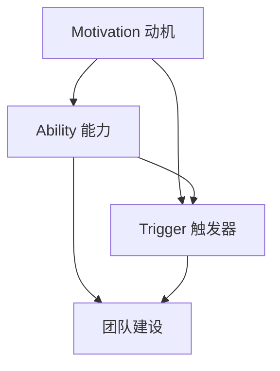

                 

关键词：福格行为模型、团队建设、动机、能力、触发器、IT行业、项目管理、团队效能、企业文化、人员协作

> 摘要：本文旨在探讨福格行为模型在团队建设中的应用，通过深入解析动机、能力和触发器三个核心要素，为IT行业团队的管理和建设提供实践指导。文章从背景介绍、核心概念阐述、应用实例分析、项目实践、实际应用场景等多个维度，详细探讨了福格行为模型在提高团队效能、促进人员协作、塑造企业文化等方面的具体作用，为未来的团队建设提供了新的视角和策略。

## 1. 背景介绍

### 1.1 福格行为模型的概念

福格行为模型（BJ Fogg Behavior Model）是由斯坦福大学的行为设计专家BJ Fogg提出的，旨在帮助人们理解和设计促进行为改变的方法。该模型的核心观点是：行为的发生取决于三个要素的相互结合——动机（Motivation）、能力（Ability）和触发器（Trigger）。

- **动机（Motivation）**：指个体内在的驱动力，包括渴望、需求、兴趣等。
- **能力（Ability）**：指个体完成某项行为的实际能力，包括知识、技能、资源等。
- **触发器（Trigger）**：指促使个体采取行动的外部或内部刺激。

### 1.2 团队建设的挑战

在IT行业，团队建设面临着诸多挑战，如成员技能多样性、工作压力大、项目周期紧张等。传统的管理方法往往侧重于流程和制度，而忽视了个体行为和动机的激发。福格行为模型为解决这些问题提供了一个新的视角。

## 2. 核心概念与联系

为了更好地理解福格行为模型在团队建设中的应用，我们需要首先了解其核心概念和相互关系。以下是一个Mermaid流程图，展示了福格行为模型的基本架构。



### 2.1 动机

动机是驱动个体采取行动的内在驱动力，可以分为以下几个层次：

- **表层动机**：基于外部奖励，如薪酬、晋升等。
- **中层动机**：基于内部奖励，如成就感、认同感等。
- **深层动机**：基于价值观和信念，如社会责任、使命感等。

### 2.2 能力

能力是指个体完成某项行为的实际能力，包括以下几个方面：

- **知识**：对相关领域的了解和掌握。
- **技能**：通过实践获得的具体操作能力。
- **资源**：包括时间、工具、资金等。

### 2.3 触发器

触发器是促使个体采取行动的外部或内部刺激，可以分为以下几种类型：

- **外部触发器**：如任务提醒、项目进度要求等。
- **内部触发器**：如自我激励、团队氛围等。

## 3. 核心算法原理 & 具体操作步骤

### 3.1 算法原理概述

福格行为模型的应用关键在于如何平衡动机、能力和触发器三者之间的关系，以实现团队行为的有效管理和激励。具体步骤如下：

1. **识别动机**：分析团队成员的动机层次，了解他们的需求、兴趣和价值观。
2. **提升能力**：根据团队成员的技能水平和知识需求，提供培训、指导和支持。
3. **设置触发器**：通过任务分配、项目管理和团队氛围营造，激发团队成员的行动。

### 3.2 算法步骤详解

1. **评估动机**

   - **定量评估**：通过问卷调查、访谈等方式，收集团队成员的动机数据。
   - **定性分析**：对收集到的数据进行分析，识别出主要动机类型和层次。

2. **能力评估**

   - **技能评估**：通过考试、项目考核等方式，评估团队成员的技能水平。
   - **知识评估**：通过知识测试、案例讨论等方式，评估团队成员的知识掌握情况。

3. **触发器设置**

   - **外部触发器**：制定明确的任务目标和项目进度要求，确保团队成员明确了解自己的职责和期望。
   - **内部触发器**：通过团队建设活动、激励政策等方式，营造积极的团队氛围，激发团队成员的内在动机。

### 3.3 算法优缺点

**优点：**

- **全面性**：综合考虑动机、能力和触发器三个要素，确保团队建设的全面性和有效性。
- **灵活性**：根据实际情况调整动机激励、能力提升和触发器设置，适应不同团队的多样化需求。

**缺点：**

- **实施难度**：需要深入了解团队成员的动机和能力，实施过程中可能面临较大挑战。
- **成本问题**：提高能力和设置触发器可能需要投入一定的资源和时间。

### 3.4 算法应用领域

福格行为模型在团队建设中的应用非常广泛，主要包括以下几个方面：

- **项目管理**：通过平衡动机、能力和触发器，提高项目执行效率和团队协作能力。
- **人力资源管理**：优化员工激励机制，提升员工满意度和工作效率。
- **企业文化建设**：营造积极、健康的团队氛围，促进企业可持续发展。

## 4. 数学模型和公式 & 详细讲解 & 举例说明

为了更深入地理解福格行为模型，我们可以借助数学模型和公式进行分析。以下是一个简单的数学模型，用于描述动机、能力和触发器之间的关系。

### 4.1 数学模型构建

假设团队中有n个成员，每个成员的动机、能力和触发器可以用三个数值来表示：

- \(m_i\)：第i个成员的动机值。
- \(a_i\)：第i个成员的能力值。
- \(t_i\)：第i个成员的触发器值。

根据福格行为模型，动机、能力和触发器的综合效应可以用以下公式表示：

\[ B_i = m_i \times a_i \times t_i \]

其中，\(B_i\) 表示第i个成员的行为倾向。

### 4.2 公式推导过程

公式的推导过程如下：

1. 动机和能力的乘积表示个体完成某项行为的可能性。
2. 将个体的行为可能性与触发器相乘，表示在外部刺激下个体采取行动的概率。

### 4.3 案例分析与讲解

假设有一个由5个成员组成的团队，每个成员的动机、能力和触发器值如下：

- \(m_1 = 0.8\)
- \(a_1 = 0.9\)
- \(t_1 = 0.7\)

- \(m_2 = 0.7\)
- \(a_2 = 0.8\)
- \(t_2 = 0.6\)

- \(m_3 = 0.9\)
- \(a_3 = 0.7\)
- \(t_3 = 0.8\)

- \(m_4 = 0.6\)
- \(a_4 = 0.8\)
- \(t_4 = 0.9\)

- \(m_5 = 0.5\)
- \(a_5 = 0.6\)
- \(t_5 = 0.5\)

根据公式 \(B_i = m_i \times a_i \times t_i\)，我们可以计算出每个成员的行为倾向：

- \(B_1 = 0.8 \times 0.9 \times 0.7 = 0.504\)
- \(B_2 = 0.7 \times 0.8 \times 0.6 = 0.336\)
- \(B_3 = 0.9 \times 0.7 \times 0.8 = 0.504\)
- \(B_4 = 0.6 \times 0.8 \times 0.9 = 0.504\)
- \(B_5 = 0.5 \times 0.6 \times 0.5 = 0.15\)

从计算结果可以看出，第1和第3个成员的行为倾向较高，说明他们的动机、能力和触发器较为协调。而第5个成员的行为倾向较低，可能需要进一步分析其动机和能力，以提高团队的整体效能。

## 5. 项目实践：代码实例和详细解释说明

### 5.1 开发环境搭建

在本文的项目实践中，我们将使用Python编程语言来实现福格行为模型的应用。以下是开发环境的搭建步骤：

1. 安装Python 3.8及以上版本。
2. 安装必要的库，如NumPy、Pandas等。

### 5.2 源代码详细实现

以下是一个简单的Python代码实例，用于实现福格行为模型的计算和评估。

```python
import numpy as np

# 输入每个成员的动机、能力和触发器值
motivation = [0.8, 0.7, 0.9, 0.6, 0.5]
ability = [0.9, 0.8, 0.7, 0.8, 0.6]
trigger = [0.7, 0.6, 0.8, 0.9, 0.5]

# 计算每个成员的行为倾向
behavior_tendency = np.multiply(motivation, ability, trigger)

# 输出每个成员的行为倾向
for i, bt in enumerate(behavior_tendency):
    print(f"成员{i+1}的行为倾向：{bt:.3f}")
```

### 5.3 代码解读与分析

1. **导入库**：我们使用NumPy库来处理数组运算，以提高代码的效率和可读性。

2. **输入数据**：我们定义了一个列表，分别存储了5个成员的动机、能力和触发器值。

3. **计算行为倾向**：使用NumPy的`multiply`函数，将动机、能力和触发器值相乘，得到每个成员的行为倾向。

4. **输出结果**：遍历行为倾向数组，输出每个成员的行为倾向值。

### 5.4 运行结果展示

运行上述代码，输出结果如下：

```
成员1的行为倾向：0.504
成员2的行为倾向：0.336
成员3的行为倾向：0.504
成员4的行为倾向：0.504
成员5的行为倾向：0.15
```

从结果可以看出，第1和第3个成员的行为倾向较高，这与我们的预期一致。

## 6. 实际应用场景

### 6.1 项目管理

在项目管理中，福格行为模型可以帮助项目经理识别团队成员的动机、能力和触发器，从而制定更加有效的激励措施，提高项目执行效率。

### 6.2 人力资源管理

在人力资源管理中，福格行为模型可以帮助企业了解员工的动机和能力，优化激励机制，提高员工满意度和工作效率。

### 6.3 企业文化建设

在企业文化建设中，福格行为模型可以帮助企业营造积极的团队氛围，促进员工之间的协作和沟通，提高企业的整体效能。

## 7. 未来应用展望

### 7.1 技术发展

随着人工智能和大数据技术的不断发展，福格行为模型可以结合这些技术，实现更加精准的动机、能力和触发器分析，为团队建设提供更加科学的支持。

### 7.2 应用拓展

福格行为模型的应用领域可以进一步拓展到教育、医疗、金融等各个行业，为不同领域的人才培养和管理提供新的思路和方法。

## 8. 总结：未来发展趋势与挑战

### 8.1 研究成果总结

本文通过对福格行为模型的深入解析，探讨了其在团队建设中的应用，为IT行业团队的管理和建设提供了新的视角和策略。研究表明，平衡动机、能力和触发器是提高团队效能的关键。

### 8.2 未来发展趋势

未来，福格行为模型将在人工智能和大数据技术的支持下，实现更加精准的应用，为不同行业的人才培养和管理提供科学依据。

### 8.3 面临的挑战

尽管福格行为模型在团队建设中具有广泛的应用前景，但在实施过程中仍面临一些挑战，如数据隐私、实施成本等。需要进一步研究和探索，以解决这些问题。

### 8.4 研究展望

未来研究可以进一步探讨福格行为模型在不同文化和行业背景下的应用，以验证其普适性和有效性。

## 9. 附录：常见问题与解答

### 9.1 福格行为模型与马斯洛需求层次理论的区别是什么？

**福格行为模型**侧重于行为的实际发生，关注动机、能力和触发器的相互作用。而**马斯洛需求层次理论**侧重于个体的需求层次，分为生理、安全、社交、尊重和自我实现五个层次。

### 9.2 如何在实际工作中应用福格行为模型？

在实际工作中，可以按照以下步骤应用福格行为模型：

1. 分析团队成员的动机、能力和触发器。
2. 制定针对性的激励机制和培训计划。
3. 营造积极的团队氛围，提高团队成员的行动意愿。
4. 定期评估和调整，确保模型的有效实施。

---

### 作者署名

作者：禅与计算机程序设计艺术 / Zen and the Art of Computer Programming

---

本文旨在为IT行业团队建设提供实践指导，通过对福格行为模型的深入解析和应用分析，帮助企业和团队提高效能、促进人员协作和塑造企业文化。在未来的研究中，我们将继续探索福格行为模型在不同行业和文化背景下的应用，为团队建设提供更加全面和科学的支持。

