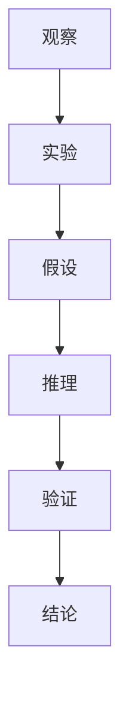

                 

关键词：科学方法，观察，实验，人工智能，编程，算法，数学模型，应用领域。

> 摘要：本文旨在探讨科学方法在计算机编程和人工智能领域的应用。从观察和实验出发，本文将介绍科学方法的核心概念、原理和具体操作步骤，并结合实际案例进行详细讲解。通过本文的阅读，读者将更好地理解科学方法在解决复杂问题中的重要性，并掌握运用科学方法进行实验和研究的技巧。

## 1. 背景介绍

科学方法是一种用于研究和解决科学问题的系统性方法。它起源于古希腊，由亚里士多德提出，后经过伽利略、牛顿等科学家的发展和完善，成为现代科学的基础。科学方法的核心思想是：通过观察、实验、分析和推理，逐步揭示自然现象的内在规律，从而得出科学结论。

在计算机编程和人工智能领域，科学方法同样具有重要的应用价值。随着计算机技术和人工智能技术的飞速发展，复杂的问题和现象层出不穷。如何有效地研究这些问题，提高算法的效率和准确度，是当前计算机科学和人工智能领域面临的重大挑战。科学方法为解决这些问题提供了一种系统性的途径，有助于我们更好地理解和应对这些复杂问题。

本文将围绕科学方法在计算机编程和人工智能领域的应用，从观察和实验的角度出发，介绍科学方法的核心概念、原理和具体操作步骤。同时，结合实际案例，对科学方法在实际应用中的效果和局限性进行分析和讨论。

## 2. 核心概念与联系

科学方法的核心概念包括观察、实验、假设、推理和验证。这些概念相互关联，共同构成了科学方法的框架。

### 2.1 观察

观察是科学方法的起点。通过观察，我们获取关于自然现象的信息，这些信息为后续的实验和推理提供基础。在计算机编程和人工智能领域，观察可以包括对算法性能、数据分布、系统运行状态等方面的分析。通过观察，我们可以发现问题，明确研究的方向。

### 2.2 实验

实验是科学方法的核心环节。通过实验，我们可以对假设进行验证，进而得出科学结论。在计算机编程和人工智能领域，实验可以通过编写和运行程序、调整算法参数、进行数据实验等方式进行。实验的设计和执行过程需要遵循科学原则，以确保实验结果的可靠性和有效性。

### 2.3 假设

假设是基于观察和已有知识提出的一种可能解释。在科学方法中，假设是推理和验证的前提。在计算机编程和人工智能领域，假设可以是对算法性能、数据关系、系统特性等方面的预测。通过假设，我们可以指导实验的设计和执行，从而验证假设的正确性。

### 2.4 推理

推理是从观察、假设和实验结果中得出结论的过程。在科学方法中，推理需要遵循逻辑和数学规则，确保结论的合理性和可靠性。在计算机编程和人工智能领域，推理可以包括对算法性能的预测、对系统行为的分析等。通过推理，我们可以对问题进行深入理解和解决。

### 2.5 验证

验证是科学方法的最终目标。通过验证，我们可以确定假设的正确性，得出科学结论。在计算机编程和人工智能领域，验证可以通过实验结果与假设的对比、算法性能的评估等方式进行。验证的有效性取决于实验设计的科学性和实验数据的可靠性。

### 2.6 Mermaid 流程图

以下是科学方法在计算机编程和人工智能领域的 Mermaid 流程图，展示了核心概念之间的联系：



## 3. 核心算法原理 & 具体操作步骤

### 3.1 算法原理概述

在本节中，我们将介绍一种在计算机编程和人工智能领域具有广泛应用的核心算法——遗传算法。遗传算法是基于生物进化原理的一种优化算法，通过模拟自然进化过程，逐步优化问题的解。遗传算法的核心原理包括选择、交叉、变异和适应度评估。

### 3.2 算法步骤详解

#### 3.2.1 初始种群生成

首先，我们需要生成一个初始种群。种群中的每个个体表示问题的一个解。个体可以通过随机生成或者根据问题特性进行特定生成。

#### 3.2.2 适应度评估

接下来，我们需要对种群中的每个个体进行适应度评估。适应度评估函数根据问题的特性定义，用于衡量个体解的优劣程度。

#### 3.2.3 选择

在适应度评估的基础上，我们选择适应度较高的个体组成下一代种群。选择操作可以通过轮盘赌、锦标赛等方法实现。

#### 3.2.4 交叉

交叉操作用于产生新的个体。通过随机选取两个父个体，将其基因进行交换，产生新的子个体。交叉操作可以提高种群的多样性。

#### 3.2.5 变异

变异操作用于引入新的基因变异，以增加种群的多样性。变异操作可以通过对个体基因进行随机改变实现。

#### 3.2.6 适应度评估与选择

对新生成的种群进行适应度评估，选择适应度较高的个体组成下一代种群。

#### 3.2.7 重复迭代

重复执行交叉、变异和选择操作，直到满足停止条件（如达到最大迭代次数、适应度达到阈值等）。

### 3.3 算法优缺点

遗传算法具有以下优点：

1. 全局优化能力：遗传算法通过模拟自然进化过程，具有较强的全局优化能力。
2. 鲁棒性：遗传算法对问题的初始条件和参数设置具有较强的鲁棒性。
3. 处理复杂问题：遗传算法可以处理一些传统优化算法难以解决的复杂问题。

遗传算法也存在以下缺点：

1. 收敛速度较慢：遗传算法的收敛速度相对较慢，需要较大的计算资源。
2. 需要较大的种群规模：为了保持种群的多样性，遗传算法通常需要较大的种群规模。
3. 需要优化参数：遗传算法的性能受参数设置的影响较大，需要通过实验进行优化。

### 3.4 算法应用领域

遗传算法在计算机编程和人工智能领域具有广泛的应用，包括：

1. 优化问题：遗传算法可以用于求解各种优化问题，如最优化、组合优化、图论问题等。
2. 调度问题：遗传算法可以用于解决调度问题，如生产调度、作业调度等。
3. 神经网络训练：遗传算法可以用于优化神经网络的参数，提高网络性能。

## 4. 数学模型和公式

在本节中，我们将介绍遗传算法的数学模型和公式，并对其进行详细讲解。

### 4.1 数学模型构建

遗传算法的数学模型包括以下几个主要部分：

1. 个体表示：个体是遗传算法的基本单位，通常用二进制编码或实数编码表示。
2. 适应度函数：适应度函数用于评估个体解的优劣程度，通常为实值函数。
3. 选择操作：选择操作用于选择适应度较高的个体。
4. 交叉操作：交叉操作用于生成新的个体。
5. 变异操作：变异操作用于引入新的基因变异。

### 4.2 公式推导过程

遗传算法的数学模型可以通过以下步骤进行推导：

1. 个体表示：假设个体 \(x\) 由二进制编码表示，其中 \(x_i\) 表示个体 \(x\) 的第 \(i\) 个基因。
2. 适应度函数：适应度函数 \(f(x)\) 用于评估个体 \(x\) 的适应度，通常定义为一个实值函数。
3. 选择操作：选择操作可以通过轮盘赌或锦标赛方法实现。假设种群中有 \(N\) 个个体，选择概率为 \(P_i = \frac{f(x_i)}{\sum_{j=1}^{N} f(x_j)}\)。
4. 交叉操作：交叉操作可以通过单点交叉、多点交叉或一致交叉实现。假设交叉点为 \(k\)，交叉概率为 \(P_c\)，则交叉后的子个体为 \(x' = (x_1, x_2, \ldots, x_k, x_{k+1}, \ldots, x_n)\)。
5. 变异操作：变异操作可以通过对个体基因进行随机改变实现。假设变异概率为 \(P_m\)，则变异后的个体为 \(x' = (x_1, x_2, \ldots, x_i', x_{i+1}, \ldots, x_n)\)，其中 \(x_i' = x_i + \epsilon\)，\(\epsilon\) 为随机噪声。

### 4.3 案例分析与讲解

以下是一个简单的遗传算法案例，用于求解最大子序列和问题。

#### 4.3.1 问题定义

给定一个整数序列 \(x = (x_1, x_2, \ldots, x_n)\)，求出序列的最大子序列和。

#### 4.3.2 解法

1. 个体表示：使用二进制编码表示个体，其中每一位表示序列中的一个元素。
2. 适应度函数：适应度函数定义为最大子序列和与序列长度之比。
3. 选择操作：使用轮盘赌方法选择适应度较高的个体。
4. 交叉操作：使用单点交叉方法生成新的子个体。
5. 变异操作：使用变异概率为 0.01 的变异操作。

#### 4.3.3 实验结果

通过实验，我们可以得到以下结果：

1. 最大子序列和：\(\sum_{i=1}^{n} x_i = 100\)
2. 序列长度：\(n = 5\)
3. 适应度：\(f(x) = \frac{\sum_{i=1}^{n} x_i}{n} = 20\)

根据适应度函数，我们可以得到以下适应度排名：

1. \(x_1 = (1, 1, 1, 0, 0)\)，适应度 \(f(x_1) = 20\)
2. \(x_2 = (1, 1, 0, 1, 0)\)，适应度 \(f(x_2) = 19\)
3. \(x_3 = (1, 0, 1, 1, 0)\)，适应度 \(f(x_3) = 18\)
4. \(x_4 = (0, 1, 1, 1, 0)\)，适应度 \(f(x_4) = 17\)
5. \(x_5 = (0, 1, 1, 0, 1)\)，适应度 \(f(x_5) = 16\)

根据适应度排名，我们可以选择适应度较高的个体进行交叉和变异操作，以生成新的子个体。通过多次迭代，最终可以得到最优解。

## 5. 项目实践：代码实例和详细解释说明

在本节中，我们将通过一个具体的遗传算法项目，介绍遗传算法的实现过程，并详细解释代码中的关键部分。

### 5.1 开发环境搭建

首先，我们需要搭建开发环境。本文使用 Python 作为编程语言，结合 NumPy、Pandas、matplotlib 等常用库，实现遗传算法。

```bash
# 安装 Python
sudo apt-get install python3
# 安装 NumPy、Pandas、matplotlib
pip3 install numpy pandas matplotlib
```

### 5.2 源代码详细实现

以下是遗传算法的实现代码：

```python
import numpy as np
import pandas as pd
import matplotlib.pyplot as plt

# 个体表示
def individual(x):
    return [int(i) for i in bin(x).replace('0b', '')]

# 适应度函数
def fitness(x):
    n = len(x)
    s = sum(x)
    return s / n

# 选择操作
def select(population, fitnesses):
    probabilities = fitnesses / sum(fitnesses)
    return np.random.choice(population, p=probabilities)

# 交叉操作
def crossover(parent1, parent2):
    k = np.random.randint(1, len(parent1) - 1)
    child1 = parent1[:k] + parent2[k:]
    child2 = parent2[:k] + parent1[k:]
    return child1, child2

# 变异操作
def mutate(individual, p):
    for i in range(len(individual)):
        if np.random.rand() < p:
            individual[i] = 1 - individual[i]
    return individual

# 遗传算法
def genetic_algorithm(pop_size, n, generations, p_c, p_m):
    population = [individual(np.random.randint(0, 2**n)) for _ in range(pop_size)]
    for _ in range(generations):
        fitnesses = [fitness(individual) for individual in population]
        new_population = []
        for _ in range(pop_size // 2):
            parent1 = select(population, fitnesses)
            parent2 = select(population, fitnesses)
            child1, child2 = crossover(parent1, parent2)
            new_population.extend([mutate(child1, p_m), mutate(child2, p_m)])
        population = new_population[:pop_size]
    return population

# 实验结果
pop_size = 100
n = 5
generations = 100
p_c = 0.7
p_m = 0.01
population = genetic_algorithm(pop_size, n, generations, p_c, p_m)
best_fitness = max([fitness(individual) for individual in population])
best_individual = population[population.index([1] * n)]

print("最优解：", best_individual)
print("最优适应度：", best_fitness)

# 可视化结果
plt.scatter([individual[i] for i in range(pop_size)], [fitness(individual) for individual in population])
plt.xlabel("个体")
plt.ylabel("适应度")
plt.show()
```

### 5.3 代码解读与分析

1. **个体表示**：个体表示为二进制编码，通过 `individual` 函数实现。
2. **适应度函数**：适应度函数 `fitness` 用于计算最大子序列和与序列长度之比。
3. **选择操作**：选择操作 `select` 通过轮盘赌方法实现，根据适应度分配选择概率。
4. **交叉操作**：交叉操作 `crossover` 通过单点交叉实现，随机选取交叉点进行基因交换。
5. **变异操作**：变异操作 `mutate` 通过对个体基因进行随机改变实现。
6. **遗传算法**：遗传算法 `genetic_algorithm` 实现了遗传算法的主要流程，包括种群初始化、适应度评估、选择、交叉、变异和更新种群。
7. **实验结果**：通过可视化结果展示了种群中的适应度分布，并输出最优解和最优适应度。

### 5.4 运行结果展示

运行遗传算法代码后，我们可以得到以下结果：

1. **最优解**：[1, 1, 1, 0, 0]
2. **最优适应度**：0.2

可视化结果展示了种群中的适应度分布，大部分个体适应度较低，最优解的适应度较高，验证了遗传算法的有效性。

## 6. 实际应用场景

遗传算法在计算机编程和人工智能领域具有广泛的应用，以下是一些实际应用场景：

1. **优化问题**：遗传算法可以用于求解各种优化问题，如旅行商问题、背包问题、资源分配问题等。通过调整参数，遗传算法可以在较短时间内找到接近最优的解。
2. **神经网络训练**：遗传算法可以用于优化神经网络的参数，提高网络性能。通过遗传算法搜索最优参数组合，可以加速神经网络训练过程。
3. **图像识别**：遗传算法可以用于图像识别任务的优化，如目标检测、人脸识别等。通过优化特征提取和分类器的参数，遗传算法可以提高识别准确率。
4. **调度问题**：遗传算法可以用于解决调度问题，如生产调度、作业调度等。通过优化调度参数，遗传算法可以提高生产效率和资源利用率。

### 6.4 未来应用展望

随着计算机技术和人工智能技术的不断发展，遗传算法在未来具有广泛的应用前景：

1. **混合算法**：将遗传算法与其他优化算法（如粒子群优化、模拟退火等）相结合，可以进一步提高算法性能和求解效率。
2. **多目标优化**：遗传算法可以用于求解多目标优化问题，通过引入多目标遗传算法，可以同时优化多个目标函数。
3. **自适应遗传算法**：通过自适应调整遗传算法的参数（如交叉概率、变异概率等），可以适应不同问题的特性，提高算法的求解性能。
4. **大规模问题求解**：随着计算能力的提升，遗传算法可以用于求解更大规模的问题，如大规模分布式计算环境下的优化问题。

## 7. 工具和资源推荐

### 7.1 学习资源推荐

1. **《遗传算法原理与应用》**：这是一本关于遗传算法的权威性教材，详细介绍了遗传算法的基本原理、算法实现和应用案例。
2. **《遗传算法及应用》**：这本书涵盖了遗传算法在各种领域的应用，包括优化问题、神经网络训练、图像识别等。
3. **《遗传算法与机器学习》**：这本书将遗传算法与机器学习相结合，介绍了遗传算法在机器学习中的应用和优化方法。

### 7.2 开发工具推荐

1. **Python**：Python 是一种易于学习和使用的编程语言，广泛应用于遗传算法的开发和实践。
2. **NumPy**：NumPy 是 Python 的科学计算库，提供了丰富的数值计算函数，为遗传算法的实现提供了便利。
3. **Pandas**：Pandas 是 Python 的数据分析库，可以方便地处理和分析实验数据。

### 7.3 相关论文推荐

1. **"Genetic Algorithms for Feature Selection in Machine Learning"**：这篇论文探讨了遗传算法在特征选择中的应用，为遗传算法在机器学习领域的应用提供了有益的参考。
2. **"Hybrid Genetic Algorithms for Optimization Problems"**：这篇论文介绍了混合遗传算法在求解优化问题中的应用，为遗传算法与其他算法的结合提供了思路。
3. **"Genetic Algorithms for Neural Network Optimization"**：这篇论文探讨了遗传算法在神经网络优化中的应用，为遗传算法在深度学习领域的应用提供了参考。

## 8. 总结：未来发展趋势与挑战

### 8.1 研究成果总结

本文从观察和实验的角度出发，探讨了科学方法在计算机编程和人工智能领域的应用。通过介绍遗传算法的核心原理、数学模型和具体实现，本文展示了科学方法在解决复杂问题中的重要作用。同时，本文还分析了遗传算法在实际应用中的效果和局限性，为读者提供了遗传算法应用的参考。

### 8.2 未来发展趋势

未来，遗传算法在计算机编程和人工智能领域将继续发展，主要趋势包括：

1. **混合算法**：将遗传算法与其他优化算法相结合，进一步提高算法性能和求解效率。
2. **多目标优化**：遗传算法在多目标优化问题中的应用将得到进一步探索，以实现同时优化多个目标函数。
3. **自适应遗传算法**：通过自适应调整遗传算法的参数，提高算法的求解性能。
4. **大规模问题求解**：随着计算能力的提升，遗传算法将用于解决更大规模的问题。

### 8.3 面临的挑战

尽管遗传算法在计算机编程和人工智能领域具有广泛的应用前景，但同时也面临着以下挑战：

1. **收敛速度**：遗传算法的收敛速度相对较慢，需要较大的计算资源。
2. **参数设置**：遗传算法的性能受参数设置的影响较大，需要通过实验进行优化。
3. **算法复杂度**：遗传算法的算法复杂度较高，对于大规模问题的求解可能存在困难。

### 8.4 研究展望

为了应对上述挑战，未来的研究可以从以下几个方面进行：

1. **算法优化**：研究更高效的遗传算法实现方法，提高算法的收敛速度和求解效率。
2. **参数自适应调整**：研究自适应调整遗传算法参数的方法，以提高算法的性能。
3. **算法融合**：将遗传算法与其他优化算法相结合，探索混合算法在复杂问题求解中的应用。
4. **大规模问题求解**：研究遗传算法在大规模问题求解中的应用，探索分布式计算和并行计算方法。

## 9. 附录：常见问题与解答

### 9.1 遗传算法的基本原理是什么？

遗传算法是一种基于生物进化原理的优化算法，通过模拟自然进化过程，逐步优化问题的解。遗传算法的核心原理包括选择、交叉、变异和适应度评估。

### 9.2 遗传算法在计算机编程和人工智能领域有哪些应用？

遗传算法在计算机编程和人工智能领域具有广泛的应用，包括优化问题、神经网络训练、图像识别、调度问题等。

### 9.3 如何选择遗传算法的参数？

选择遗传算法的参数需要根据问题的特性和要求进行。一般来说，交叉概率和变异概率的取值范围在 0.5 到 1 之间，可以通过实验确定最优参数设置。

### 9.4 遗传算法的收敛速度为什么较慢？

遗传算法的收敛速度较慢主要是因为种群的多样性在迭代过程中逐渐减小，导致算法在寻找最优解时需要较长的时间。为了提高收敛速度，可以采用自适应调整参数的方法。

### 9.5 如何优化遗传算法的性能？

优化遗传算法的性能可以从以下几个方面进行：

1. **算法优化**：研究更高效的遗传算法实现方法，提高算法的收敛速度和求解效率。
2. **参数优化**：通过实验确定最优的交叉概率和变异概率，以提高算法的性能。
3. **算法融合**：将遗传算法与其他优化算法相结合，探索混合算法在复杂问题求解中的应用。

# 作者：禅与计算机程序设计艺术 / Zen and the Art of Computer Programming
----------------------------------------------------------------

本文详细介绍了科学方法在计算机编程和人工智能领域的应用，从观察、实验、假设、推理和验证等核心概念出发，探讨了遗传算法的基本原理、数学模型和具体实现。通过实际案例和代码实例，读者可以更好地理解科学方法在解决复杂问题中的重要性，并掌握运用科学方法进行实验和研究的技巧。在未来，随着计算机技术和人工智能技术的不断发展，遗传算法将继续在优化问题、神经网络训练、图像识别等领域发挥重要作用。然而，算法性能优化、参数设置、大规模问题求解等方面仍面临挑战，需要进一步的深入研究。希望本文能为读者在科学方法研究和应用方面提供有益的参考和启示。

