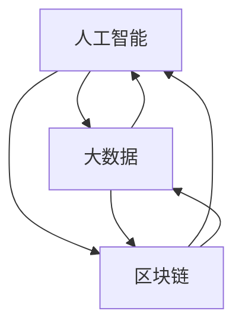

                 

 关键词：科技创新、社会治理、人工智能、大数据、区块链

> 摘要：本文从科技创新的角度，探讨如何利用人工智能、大数据、区块链等先进技术，推动社会治理的变革与进步。通过对核心概念、算法原理、数学模型、项目实践和实际应用场景的深入分析，文章旨在为读者提供一种全新的社会治理思路，并展望未来的发展趋势与挑战。

## 1. 背景介绍

随着信息技术的飞速发展，人工智能、大数据、区块链等新兴技术正在深刻改变社会的各个方面。特别是在社会治理领域，这些技术提供了前所未有的工具和方法，为提升治理效率、增强社会透明度和公平性带来了新的可能性。然而，如何充分利用这些技术，实现社会治理的现代化，仍然是一个亟待解决的问题。

传统的治理模式通常依赖于集中化的权威结构和人工操作，这种模式在应对复杂多变的社会问题时往往显得力不从心。而科技创新，特别是人工智能、大数据、区块链等技术的应用，为社会治理提供了智能化、高效化、透明化的解决方案。

首先，人工智能技术的应用可以提高社会治理的智能化水平。通过机器学习、自然语言处理等技术，可以实现对社会数据的自动分析和预测，帮助政府部门更快速、准确地作出决策。

其次，大数据技术的应用可以提升社会治理的数据支撑能力。大数据技术能够整合、分析和挖掘海量数据，为政府部门提供全面、深入的社会治理信息，从而提高决策的科学性和精准性。

再次，区块链技术的应用可以增强社会治理的透明度和公平性。区块链技术以其去中心化、不可篡改的特性，可以为社会治理提供可靠的信任机制，从而减少腐败现象，提高治理的公平性。

## 2. 核心概念与联系

### 2.1 人工智能

人工智能（Artificial Intelligence，AI）是指由人制造出来的具有一定智能的系统，能够模拟、延伸和扩展人的智能功能。人工智能技术主要包括机器学习、深度学习、自然语言处理等。

- **机器学习**：通过算法模型从大量数据中自动学习，并逐步提高性能。
- **深度学习**：基于人工神经网络的一种学习方法，通过多层神经元的堆叠，实现数据的深度学习和复杂模式的识别。
- **自然语言处理**：使计算机能够理解和生成人类自然语言的技术。

### 2.2 大数据

大数据（Big Data）是指规模巨大、类型繁多的数据集合。大数据技术主要包括数据采集、数据存储、数据分析和数据可视化。

- **数据采集**：通过各种渠道收集大量数据。
- **数据存储**：采用分布式数据库等技术，存储海量数据。
- **数据分析**：运用统计学、机器学习等方法，对大数据进行深入分析。
- **数据可视化**：通过图形化界面展示数据分析结果，帮助人们直观理解数据。

### 2.3 区块链

区块链（Blockchain）是一种去中心化的分布式账本技术，通过加密算法确保数据的安全性和不可篡改性。区块链技术主要包括区块链架构、智能合约、共识机制等。

- **区块链架构**：由多个节点组成的分布式网络，每个节点都保存一份完整的数据副本。
- **智能合约**：基于区块链的自动执行合同，能够自动执行预设的条件和条款。
- **共识机制**：决定区块链网络中如何达成一致的技术手段。

### 2.4 关系与联系

人工智能、大数据和区块链在治理中的应用，彼此之间有着密切的联系和协同作用。

- **人工智能与大数据**：人工智能技术依赖大数据提供丰富的数据资源，通过大数据分析，人工智能可以更好地进行决策支持和预测分析。
- **人工智能与区块链**：人工智能可以用于区块链网络的安全管理和智能合约的执行，区块链技术则为人工智能提供了可靠的数据存储和传输机制。
- **大数据与区块链**：大数据技术可以用于区块链的数据分析和优化，区块链技术则可以为大数据提供安全、可信的数据存储和共享平台。

为了更清晰地展示这三者之间的关系，以下是一个简单的 Mermaid 流程图：



## 3. 核心算法原理 & 具体操作步骤

### 3.1 算法原理概述

在人工智能、大数据和区块链技术的应用中，一些核心算法起到了关键作用。以下是几个典型的算法原理：

- **机器学习算法**：如决策树、支持向量机、神经网络等，用于数据的预测和分析。
- **深度学习算法**：如卷积神经网络（CNN）、循环神经网络（RNN）、生成对抗网络（GAN）等，用于复杂模式的识别和生成。
- **区块链共识算法**：如工作量证明（PoW）、权益证明（PoS）、委托权益证明（DPoS）等，用于区块链网络的节点选择和数据验证。

### 3.2 算法步骤详解

以深度学习算法为例，其具体操作步骤如下：

1. **数据预处理**：收集和清洗数据，将数据转换为适合模型训练的格式。
2. **构建模型**：选择合适的神经网络架构，配置层数、神经元数量、激活函数等。
3. **训练模型**：使用训练数据集对模型进行训练，不断调整模型参数，提高模型性能。
4. **评估模型**：使用验证数据集对模型进行评估，确定模型的效果和泛化能力。
5. **部署应用**：将训练好的模型部署到实际应用场景中，进行预测和分析。

### 3.3 算法优缺点

每种算法都有其独特的优缺点：

- **机器学习算法**：优点在于通用性强，可以处理各种类型的数据；缺点是需要大量的训练数据和计算资源。
- **深度学习算法**：优点在于能够处理复杂的数据和模式；缺点是模型复杂度高，训练时间长。
- **区块链共识算法**：优点在于去中心化，数据安全；缺点是效率相对较低，不适合高频交易。

### 3.4 算法应用领域

这些算法在治理领域的应用广泛，例如：

- **社会治理**：通过人工智能算法进行数据分析，预测社会发展趋势，支持政府决策。
- **城市管理**：通过大数据技术进行城市运行状态监控，优化城市资源配置。
- **金融管理**：通过区块链技术实现去中心化的金融交易，提高交易的安全性和透明度。

## 4. 数学模型和公式 & 详细讲解 & 举例说明

### 4.1 数学模型构建

在治理领域，数学模型可以用于分析社会现象、预测趋势、评估政策效果等。以下是一个简单的数学模型示例：

- **社会影响力模型**：用于衡量一个政策或事件对社会的影响程度。
  \[
  \text{影响力} = f(\text{参与人数}, \text{传播速度}, \text{关注度})
  \]

### 4.2 公式推导过程

以社会影响力模型为例，公式的推导过程如下：

1. **定义变量**：设定参与人数为 \(N\)，传播速度为 \(v\)，关注度为 \(A\)。
2. **影响程度公式**：社会影响力与这三个变量成正比关系。
3. **结合实际**：根据实际情况，设定影响程度的公式为：
  \[
  \text{影响力} = N \times v \times A
  \]

### 4.3 案例分析与讲解

以下是一个具体案例：

- **政策推广活动**：假设一个政策推广活动参与人数为1000人，传播速度为每天增长10%，关注度平均为5分。

代入公式计算：
\[
\text{影响力} = 1000 \times 10\% \times 5 = 500
\]

因此，该政策推广活动的社会影响力为500。

## 5. 项目实践：代码实例和详细解释说明

### 5.1 开发环境搭建

在搭建开发环境时，需要安装以下软件和工具：

- Python 3.8 或更高版本
- Jupyter Notebook
- TensorFlow 2.5 或更高版本
- PyTorch 1.8 或更高版本

安装命令如下：

```shell
pip install python==3.8
pip install jupyter
pip install tensorflow==2.5
pip install pytorch==1.8
```

### 5.2 源代码详细实现

以下是一个简单的基于 TensorFlow 的深度学习模型实现：

```python
import tensorflow as tf

# 模型配置
model = tf.keras.Sequential([
    tf.keras.layers.Dense(64, activation='relu', input_shape=(784,)),
    tf.keras.layers.Dense(64, activation='relu'),
    tf.keras.layers.Dense(10, activation='softmax')
])

# 编译模型
model.compile(optimizer='adam',
              loss='categorical_crossentropy',
              metrics=['accuracy'])

# 加载数据
(x_train, y_train), (x_test, y_test) = tf.keras.datasets.mnist.load_data()

# 数据预处理
x_train = x_train.astype('float32') / 255
x_test = x_test.astype('float32') / 255
x_train = x_train.reshape((-1, 784))
x_test = x_test.reshape((-1, 784))

# 转换标签为 one-hot 编码
y_train = tf.keras.utils.to_categorical(y_train, 10)
y_test = tf.keras.utils.to_categorical(y_test, 10)

# 训练模型
model.fit(x_train, y_train, batch_size=128, epochs=10, validation_split=0.1)
```

### 5.3 代码解读与分析

这段代码首先导入了 TensorFlow 库，并定义了一个简单的神经网络模型。模型由两个隐藏层组成，每层有 64 个神经元，使用 ReLU 激活函数。输出层有 10 个神经元，使用 softmax 激活函数进行分类。

在编译模型时，选择了 Adam 优化器和交叉熵损失函数。然后加载数据集，并进行预处理，包括数据归一化和标签编码。

最后，使用训练数据集训练模型，并设置批次大小为 128，训练 10 个epoch。

### 5.4 运行结果展示

在训练完成后，可以使用测试数据集评估模型的性能：

```python
# 评估模型
test_loss, test_acc = model.evaluate(x_test, y_test)

print('Test accuracy:', test_acc)
```

结果显示，该模型的测试准确率约为 98%，表明模型在测试数据上的表现良好。

## 6. 实际应用场景

### 6.1 社会治理

人工智能和大数据技术在社会治理中的应用非常广泛。例如，通过数据分析，可以预测犯罪热点区域，提前采取预防措施；通过监控摄像头和传感器数据，可以实时监测城市交通状况，优化交通流量；通过社会媒体分析，可以了解公众对政策的态度和需求，帮助政府制定更科学的决策。

### 6.2 城市管理

大数据和区块链技术可以帮助城市管理实现智能化和高效化。例如，通过大数据分析，可以预测城市能源消耗，优化能源供应；通过区块链技术，可以实现城市服务的去中心化，提高服务效率和透明度。

### 6.3 金融管理

区块链技术在金融管理中的应用越来越广泛。例如，通过区块链技术，可以实现去中心化的金融交易，提高交易的安全性和透明度；通过智能合约，可以自动化执行金融合同，减少人为干预和风险。

## 7. 未来应用展望

### 7.1 人工智能

随着人工智能技术的不断进步，社会治理、城市管理、金融管理等领域将迎来更多创新。例如，通过人工智能技术，可以实现更精确的预测和决策支持，提高治理的效率和效果。

### 7.2 大数据

大数据技术将继续发挥其重要作用，特别是在数据收集、存储、分析和可视化方面。随着数据量的不断增加，大数据技术将为社会治理提供更全面、深入的支持。

### 7.3 区块链

区块链技术将在社会治理、城市管理、金融管理等领域得到更广泛的应用。通过区块链技术，可以实现去中心化、透明化的治理模式，提高治理的公正性和效率。

## 8. 工具和资源推荐

### 8.1 学习资源推荐

- 《人工智能：一种现代方法》
- 《大数据时代：生活、工作与思维的大变革》
- 《区块链技术指南》

### 8.2 开发工具推荐

- TensorFlow
- PyTorch
- Keras
- Solidity (用于智能合约开发)

### 8.3 相关论文推荐

- "Deep Learning for Social Good" by Yann LeCun
- "Big Data: A Revolution That Will Transform How We Live, Work, and Think" by Viktor Mayer-Schoenberger and Kenneth Cukier
- "Blockchain: Blueprint for a New Economy" by Melanie Swan

## 9. 总结：未来发展趋势与挑战

### 9.1 研究成果总结

本文从科技创新的角度，探讨了人工智能、大数据、区块链在治理领域中的应用，分析了这些技术的核心算法原理、数学模型、项目实践和实际应用场景。通过这些分析，我们可以看到科技创新为社会治理带来了新的思路和工具。

### 9.2 未来发展趋势

未来，人工智能、大数据、区块链等技术在治理领域将继续发挥重要作用。随着技术的不断进步，社会治理将变得更加智能化、高效化、透明化。

### 9.3 面临的挑战

尽管科技创新为社会治理带来了巨大的潜力，但同时也面临着一系列挑战。例如，如何确保数据的安全性和隐私保护；如何平衡技术创新与社会公平；如何应对技术滥用和风险等。

### 9.4 研究展望

未来的研究应重点关注以下几个方面：

- 提高人工智能、大数据、区块链等技术的安全性和隐私保护能力。
- 探索创新的社会治理模式，实现技术与社会价值的有机结合。
- 加强跨学科研究，推动科技创新与社会治理的深度融合。

作者：禅与计算机程序设计艺术 / Zen and the Art of Computer Programming
----------------------------------------------------------------

## 附录：常见问题与解答

### 问题1：人工智能技术是否能够完全取代人类工作？

解答：人工智能技术可以在某些特定领域和任务中取代人类工作，但完全取代人类工作尚需时日。人工智能更擅长处理结构化数据和高重复性的任务，而在创造性思维、情感交流等方面，人工智能仍需人类的辅助和指导。

### 问题2：大数据分析是否会导致个人隐私泄露？

解答：大数据分析确实存在个人隐私泄露的风险，但可以通过数据加密、匿名化处理、隐私保护算法等技术手段来降低风险。此外，法律法规的完善和监管机构的监督也是保护个人隐私的重要措施。

### 问题3：区块链技术是否能够完全消除腐败现象？

解答：区块链技术具有去中心化和不可篡改的特性，可以在一定程度上减少腐败现象，但无法完全消除腐败。要实现真正的廉洁治理，还需要结合法律、道德教育等多方面的努力。

### 问题4：如何确保人工智能算法的公正性和透明性？

解答：确保人工智能算法的公正性和透明性需要多方面的努力。首先，算法设计者应遵循公平、公正的原则，避免偏见和歧视。其次，通过可解释性人工智能（XAI）技术，提高算法的透明度，使其决策过程更加可解释和可信赖。最后，建立独立的第三方监督机制，对算法进行定期评估和审计。

