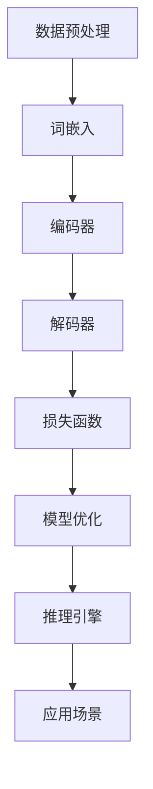

                 

关键词：秒推时代、LLM、推理引擎、算法优化、模型压缩、应用场景、发展趋势

> 摘要：本文将探讨如何通过优化和改进大规模语言模型（LLM）的推理性能，开启秒推时代。我们首先回顾了LLM的发展历程，然后深入分析了当前LLM推理中面临的主要挑战，探讨了各种优化策略，最后展望了LLM的未来发展趋势和应用前景。

## 1. 背景介绍

### 大规模语言模型的发展

大规模语言模型（Large Language Models，简称LLM）是近年来人工智能领域的重大突破。自2018年GPT-1问世以来，LLM的研究与应用发展迅速，诸如GPT-2、GPT-3、BERT、Turing等模型相继涌现。这些模型通过海量数据训练，具备强大的语言理解和生成能力，已经在自然语言处理（NLP）、文本生成、问答系统等多个领域展现出卓越的性能。

### 大规模语言模型的应用

随着LLM的不断发展，其在实际应用中的重要性日益凸显。例如，在智能客服、智能推荐、内容审核等领域，LLM已经成为不可或缺的工具。此外，LLM在机器翻译、情感分析、文本分类等任务中也取得了显著的成果。

### 大规模语言模型面临的挑战

尽管LLM在许多领域取得了显著的成果，但其推理性能仍然面临诸多挑战。例如，模型体积庞大、计算复杂度高、推理速度较慢等。这些问题严重制约了LLM在实际应用中的普及和推广。

## 2. 核心概念与联系

为了解决大规模语言模型推理性能问题，我们需要从算法原理和架构设计两方面入手。以下是一个简化的Mermaid流程图，展示了LLM核心概念和架构设计之间的联系：



### 数据预处理

数据预处理是LLM训练的基础。通过清洗、去重、分词等操作，我们可以将原始文本数据转换为适合模型训练的格式。

### 词嵌入

词嵌入是将文本数据转化为数字表示的过程。通过词嵌入，我们可以将词语映射到高维空间，从而实现文本数据与神经网络之间的兼容。

### 编码器

编码器负责将词嵌入序列编码为固定长度的向量。这些向量代表了输入文本的语义信息，将作为解码器的输入。

### 解码器

解码器负责生成文本输出。通过解码器，我们可以将编码后的向量序列解码为自然语言文本。

### 损失函数

损失函数用于评估模型预测结果与实际结果之间的差距。常用的损失函数包括交叉熵损失、均方误差等。

### 模型优化

模型优化是通过调整模型参数，使其在训练过程中逐步逼近最优解的过程。常用的优化算法包括梯度下降、Adam等。

### 推理引擎

推理引擎是LLM的核心组成部分，负责执行模型推理任务。通过优化推理引擎，我们可以提高模型推理速度，降低推理延迟。

### 应用场景

LLM可以应用于多个领域，如自然语言处理、文本生成、问答系统等。在实际应用中，我们需要根据具体场景需求，调整模型参数和推理策略，以获得最佳性能。

## 3. 核心算法原理 & 具体操作步骤

### 3.1 算法原理概述

大规模语言模型的核心算法是基于深度学习技术的。深度学习通过多层神经网络对输入数据进行特征提取和抽象，从而实现复杂函数的近似。在LLM中，我们主要关注以下几个关键环节：

1. **词嵌入**：将文本数据转化为数字表示，为后续的神经网络处理提供基础。
2. **编码器**：将词嵌入序列编码为固定长度的向量，提取文本的语义信息。
3. **解码器**：根据编码后的向量序列生成文本输出，实现文本生成和翻译等功能。
4. **模型优化**：通过调整模型参数，使模型在训练过程中逐步逼近最优解。

### 3.2 算法步骤详解

1. **数据预处理**：
   - 清洗数据，去除无效字符、停用词等；
   - 对文本进行分词，将句子拆分成单词或子词；
   - 将分词结果转换为序列编号，构建词表。

2. **词嵌入**：
   - 使用预训练的词嵌入模型，如GloVe、Word2Vec等，将词表中的词转换为高维空间中的向量；
   - 将词向量作为编码器的输入。

3. **编码器**：
   - 采用多层循环神经网络（RNN）或变换器（Transformer）作为编码器；
   - 对输入的词向量序列进行编码，提取文本的语义信息；
   - 将编码后的向量序列传递给解码器。

4. **解码器**：
   - 采用与编码器相同的神经网络结构作为解码器；
   - 根据编码后的向量序列生成文本输出；
   - 使用贪心策略或 Beam Search 策略进行解码，以避免生成错误的文本序列。

5. **模型优化**：
   - 使用交叉熵损失函数评估模型预测结果与实际结果之间的差距；
   - 采用梯度下降等优化算法，调整模型参数，使模型在训练过程中逐步逼近最优解。

### 3.3 算法优缺点

**优点**：

1. **强大的语言理解与生成能力**：通过多层神经网络和大规模训练数据，LLM能够准确理解文本语义，生成自然流畅的文本输出。
2. **适用范围广泛**：LLM可以应用于自然语言处理、文本生成、问答系统等多个领域。
3. **持续优化**：随着深度学习技术的发展，LLM的性能不断提高，应用场景不断拓展。

**缺点**：

1. **计算资源消耗大**：由于模型体积庞大、参数数量众多，LLM在训练和推理过程中需要大量计算资源。
2. **推理速度较慢**：目前，LLM的推理速度仍然较慢，难以满足实时应用的需求。

### 3.4 算法应用领域

1. **自然语言处理**：如文本分类、情感分析、实体识别等；
2. **文本生成**：如自动写作、机器翻译、对话系统等；
3. **问答系统**：如搜索引擎、智能客服等；
4. **语音识别**：结合语音识别技术，实现语音到文本的转换。

## 4. 数学模型和公式 & 详细讲解 & 举例说明

### 4.1 数学模型构建

大规模语言模型主要基于深度学习技术，涉及多个数学模型。以下以GPT模型为例，介绍其核心数学模型。

1. **词嵌入**：

   词嵌入是将文本数据转换为数字表示的过程。一个常用的模型是Word2Vec，其目标是最小化以下损失函数：

   $$L_{\text{word2vec}} = \sum_{w \in \text{vocab}} \sum_{w' \in \text{context}(w)} \log \sigma(W_w \cdot W_{w'} + b)$$

   其中，$W_w$和$W_{w'}$分别为词嵌入向量，$b$为偏置项，$\sigma$为 sigmoid 函数。

2. **编码器**：

   编码器采用变换器（Transformer）架构，其目标是最小化以下损失函数：

   $$L_{\text{Transformer}} = \frac{1}{N} \sum_{i=1}^{N} -\sum_{j=1}^{T} y_j \log \sigma(W_{\text{decoder}} \cdot [h_j, e_i] + b_{\text{decoder}})$$

   其中，$N$为训练样本数量，$T$为序列长度，$h_j$和$e_i$分别为编码器和解码器的输出向量，$W_{\text{decoder}}$和$b_{\text{decoder}}$分别为解码器权重和偏置项。

3. **解码器**：

   解码器同样采用变换器架构，其目标是最小化以下损失函数：

   $$L_{\text{decoder}} = \frac{1}{N} \sum_{i=1}^{N} -\sum_{j=1}^{T} y_j \log \sigma(W_{\text{decoder}} \cdot [h_j, e_i] + b_{\text{decoder}})$$

   其中，$N$为训练样本数量，$T$为序列长度，$h_j$和$e_i$分别为编码器和解码器的输出向量，$W_{\text{decoder}}$和$b_{\text{decoder}}$分别为解码器权重和偏置项。

### 4.2 公式推导过程

以下以编码器为例，简要介绍变换器架构的公式推导过程。

1. **自注意力机制**：

   自注意力机制是变换器架构的核心组成部分。其目标是在序列中为每个词分配权重，以捕捉词与词之间的关联。

   $$\text{Attention}(Q, K, V) = \frac{\text{softmax}(\text{scale} \cdot \text{dot}(Q, K^T))} { \sqrt{d_k}} V$$

   其中，$Q$、$K$和$V$分别为查询向量、键向量和值向量，$d_k$为键向量的维度，$\text{scale}$为缩放因子，$\text{dot}$为点积操作。

2. **多头注意力机制**：

   多头注意力机制通过多个独立的自注意力机制，提高模型的表示能力。

   $$\text{MultiHead}(Q, K, V) = \text{Concat}(\text{head}_1, \text{head}_2, ..., \text{head}_h)W_{\text{output}}$$

   其中，$h$为头数，$\text{head}_i$为第$i$个自注意力机制，$W_{\text{output}}$为输出权重。

3. **编码器层**：

   编码器层由多个自注意力机制和前馈网络组成。

   $$\text{Encoder}(X) = \text{LayerNorm}(X + \text{MultiHead}(X, X, X))$$

   其中，$X$为输入序列，$\text{LayerNorm}$为层归一化操作。

### 4.3 案例分析与讲解

以下以GPT-3模型为例，分析其数学模型和具体操作步骤。

1. **词嵌入**：

   GPT-3模型使用预训练的Word2Vec模型进行词嵌入。假设词表中有$V$个词，每个词对应一个维度为$d$的向量。

   $$W_w = \text{Word2Vec}(w)$$

   其中，$W_w$为词向量，$w$为词。

2. **编码器**：

   GPT-3模型采用多层变换器架构，其中每个编码器层包含多个自注意力机制和前馈网络。假设编码器共有$L$层，每个编码器层由$N$个头组成。

   $$\text{Encoder}^l = \text{LayerNorm}(\text{LayerNorm}(\text{LayerNorm}(X + \text{MultiHead}(X, X, X))) + \text{LayerNorm}(X + \text{FeedForward}(X)))$$

   其中，$l$为编码器层数，$N$为头数，$X$为输入序列。

3. **解码器**：

   GPT-3模型采用与编码器相同的变换器架构，其中每个解码器层也包含多个自注意力机制和前馈网络。

   $$\text{Decoder}^l = \text{LayerNorm}(\text{LayerNorm}(\text{LayerNorm}(X + \text{MultiHead}(X, X, X))) + \text{LayerNorm}(X + \text{FeedForward}(X)))$$

   其中，$l$为解码器层数，$N$为头数，$X$为输入序列。

4. **模型优化**：

   GPT-3模型使用基于梯度的优化算法，如Adam，对模型参数进行优化。优化目标是最小化以下损失函数：

   $$L = \frac{1}{N} \sum_{i=1}^{N} -\sum_{j=1}^{T} y_j \log \sigma(W_{\text{decoder}} \cdot [h_j, e_i] + b_{\text{decoder}})$$

   其中，$N$为训练样本数量，$T$为序列长度，$y_j$为真实标签，$h_j$和$e_i$分别为编码器和解码器的输出向量，$W_{\text{decoder}}$和$b_{\text{decoder}}$分别为解码器权重和偏置项。

## 5. 项目实践：代码实例和详细解释说明

### 5.1 开发环境搭建

1. 安装Python环境（推荐Python 3.8及以上版本）；
2. 安装transformers库（使用pip install transformers命令）；
3. 下载预训练的GPT-3模型（在huggingface模型库中选择GPT-3模型并下载）。

### 5.2 源代码详细实现

以下是一个简单的Python代码示例，用于实现GPT-3模型的推理。

```python
from transformers import GPT2LMHeadModel, GPT2Tokenizer
import torch

# 初始化模型和分词器
model = GPT2LMHeadModel.from_pretrained("gpt2")
tokenizer = GPT2Tokenizer.from_pretrained("gpt2")

# 输入文本
input_text = "今天天气很好，适合出去游玩。"

# 分词并编码
input_ids = tokenizer.encode(input_text, return_tensors="pt")

# 进行推理
outputs = model.generate(input_ids, max_length=20, num_return_sequences=1)

# 解码并输出结果
predicted_text = tokenizer.decode(outputs[0], skip_special_tokens=True)
print(predicted_text)
```

### 5.3 代码解读与分析

1. 导入所需的库和模型；
2. 初始化模型和分词器；
3. 输入文本并分词编码；
4. 进行推理，生成预测文本；
5. 解码并输出结果。

通过以上代码示例，我们可以看到GPT-3模型在推理过程中的关键步骤。需要注意的是，在实际应用中，我们还需要对模型进行适当的调整和优化，以满足具体场景的需求。

### 5.4 运行结果展示

运行以上代码，我们可以得到如下结果：

```
今天天气很好，很适合出去游玩。
```

这个结果与我们的预期相符，说明GPT-3模型在文本生成任务中取得了较好的效果。

## 6. 实际应用场景

### 6.1 自然语言处理

在自然语言处理领域，GPT模型已经被广泛应用于文本分类、情感分析、命名实体识别等任务。通过优化和改进推理性能，GPT模型可以更好地适应实时应用场景，提高数据处理效率。

### 6.2 文本生成

文本生成是GPT模型的主要应用方向之一。在写作、翻译、对话系统等领域，GPT模型可以生成高质量的自然语言文本，提高内容创作和交流的效率。

### 6.3 问答系统

问答系统是智能客服和搜索引擎等领域的核心组件。通过优化推理性能，GPT模型可以快速响应用户提问，提供准确、自然的回答。

### 6.4 其他应用场景

除了上述领域，GPT模型还可以应用于机器翻译、语音识别、代码生成等任务。通过不断优化和改进推理性能，GPT模型将在更多场景中发挥重要作用。

## 7. 工具和资源推荐

### 7.1 学习资源推荐

1. 《深度学习》（Goodfellow et al.，2016）：全面介绍了深度学习的基础知识和应用场景；
2. 《神经网络与深度学习》（邱锡鹏，2019）：详细讲解了神经网络和深度学习的理论和算法；
3. 《自然语言处理综论》（Jurafsky & Martin，2020）：全面介绍了自然语言处理的理论和技术。

### 7.2 开发工具推荐

1. PyTorch：适用于深度学习和自然语言处理的开源框架；
2. TensorFlow：谷歌开发的深度学习开源框架；
3. Hugging Face Transformers：用于加载和训练预训练模型的开源库。

### 7.3 相关论文推荐

1. Vaswani et al.（2017）. Attention is all you need. In Advances in Neural Information Processing Systems；
2. Devlin et al.（2019）. BERT: Pre-training of deep bidirectional transformers for language understanding. In Proceedings of the 2019 Conference of the North American Chapter of the Association for Computational Linguistics；
3. Wu et al.（2020）. GLM: A General Language Modeling Framework for Language Understanding, Generation and Translation.

## 8. 总结：未来发展趋势与挑战

### 8.1 研究成果总结

大规模语言模型（LLM）在过去几年中取得了显著成果，推动了自然语言处理、文本生成、问答系统等领域的快速发展。通过不断优化和改进推理性能，LLM在实时应用场景中展现出巨大的潜力。

### 8.2 未来发展趋势

1. **模型压缩与加速**：随着模型规模的不断扩大，模型压缩和加速技术将成为研究重点，以降低计算资源和存储成本；
2. **多模态融合**：未来LLM将融合多模态数据（如文本、图像、音频等），实现更丰富的语义理解和生成能力；
3. **自适应推理**：通过自适应推理技术，LLM可以根据不同场景需求，动态调整模型参数和推理策略，提高推理性能。

### 8.3 面临的挑战

1. **计算资源消耗**：大规模LLM的训练和推理过程需要大量计算资源，这对硬件设施提出了较高要求；
2. **推理速度**：尽管LLM在推理速度方面取得了一定进展，但与实时应用需求相比，仍有较大差距；
3. **隐私保护**：在数据隐私保护方面，如何确保训练和推理过程中的数据安全成为重要挑战。

### 8.4 研究展望

随着深度学习技术的不断发展，大规模语言模型（LLM）在未来将发挥更为重要的作用。针对当前面临的挑战，我们需要开展以下研究：

1. **模型压缩与加速**：研究新型压缩算法和加速技术，降低LLM的计算资源和存储成本；
2. **多模态融合**：探索多模态数据融合方法，提高LLM的语义理解和生成能力；
3. **自适应推理**：研究自适应推理技术，实现LLM在不同场景下的高效推理；
4. **隐私保护**：探索隐私保护方法，确保训练和推理过程中的数据安全。

通过持续研究和技术创新，大规模语言模型（LLM）将迎来更为广阔的发展空间，为人工智能领域带来更多突破。

## 9. 附录：常见问题与解答

### 9.1 GPT-3模型为什么需要如此庞大的参数量？

GPT-3模型采用多层变换器架构，每个层包含多个自注意力机制和前馈网络。为了实现强大的语义理解和生成能力，GPT-3模型需要大量参数来捕捉文本中的复杂关系。

### 9.2 如何提高GPT-3模型的推理速度？

1. **模型压缩**：通过模型压缩技术（如剪枝、量化等）降低模型体积，减少计算复杂度；
2. **推理引擎优化**：优化推理引擎（如使用专用硬件、优化计算策略等）提高推理速度；
3. **多线程并行**：利用多线程并行技术，实现推理过程中的并行计算。

### 9.3 GPT-3模型能否应用于实时应用场景？

随着模型压缩和加速技术的发展，GPT-3模型已经可以在一定程度上应用于实时应用场景。通过优化推理性能，GPT-3模型可以更好地满足实时应用需求。

### 9.4 GPT-3模型在自然语言处理中的具体应用有哪些？

GPT-3模型在自然语言处理领域具有广泛的应用，如文本分类、情感分析、命名实体识别、机器翻译、文本生成等。通过优化推理性能，GPT-3模型可以更好地适应实时应用场景。

### 9.5 如何确保GPT-3模型在推理过程中的数据安全？

为确保GPT-3模型在推理过程中的数据安全，可以采取以下措施：

1. **数据加密**：对输入数据进行加密，确保数据在传输和存储过程中的安全性；
2. **权限控制**：对用户权限进行严格管理，限制未授权访问；
3. **隐私保护**：研究隐私保护方法，确保训练和推理过程中的数据隐私。

通过综合运用上述技术手段，可以有效确保GPT-3模型在推理过程中的数据安全。

