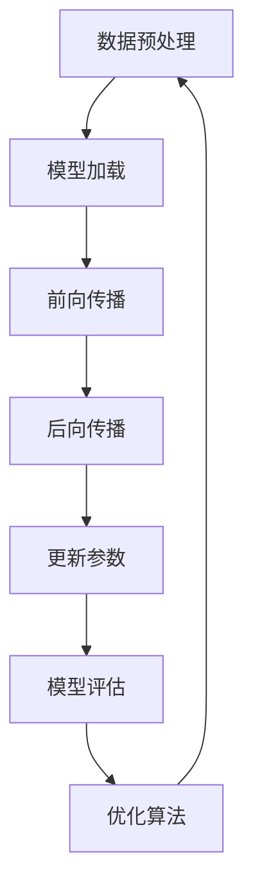

                 

关键词：LLM、推理、性能优化、模型压缩、分布式计算、实时响应

摘要：随着人工智能技术的发展，大规模语言模型（LLM）的应用越来越广泛，但随之而来的推理速度瓶颈成为了限制其应用的重要因素。本文将探讨如何通过优化算法、模型压缩、分布式计算等技术手段，实现LLM的极速推理，推动人工智能进入秒推时代。

## 1. 背景介绍

近年来，深度学习在图像识别、自然语言处理等领域的取得了惊人的进展。特别是大规模语言模型（LLM），如GPT、BERT等，凭借其强大的语义理解和生成能力，在文本生成、问答系统、机器翻译等应用中取得了显著的成果。然而，随着模型规模的不断扩大，LLM的推理速度逐渐成为了制约其广泛应用的关键因素。

### 1.1 LLM的发展历程

1. 早期的神经网络模型，如RNN、LSTM等，虽然在自然语言处理领域取得了一定的成果，但受限于计算资源和模型规模，无法实现大规模应用。
2. 2018年，GPT的出现标志着自然语言处理领域的重大突破，其基于Transformer结构的自注意力机制，使得模型在处理长文本时具有了更好的性能。
3. 随后，BERT、RoBERTa、ALBERT等基于Transformer架构的预训练模型相继提出，进一步提高了模型的性能和泛化能力。

### 1.2 LLM的应用场景

1. 文本生成：包括文章写作、聊天机器人、故事生成等。
2. 问答系统：基于模型的问答、智能客服等。
3. 机器翻译：跨语言信息传递的关键技术。
4. 命名实体识别：从文本中提取出具有特定意义的实体。
5. 语音识别：将语音信号转换为文本。

## 2. 核心概念与联系

为了实现LLM的极速推理，我们需要了解以下几个核心概念和它们之间的关系：

### 2.1 大规模语言模型（LLM）

大规模语言模型是指通过海量文本数据预训练得到的深度神经网络模型，其参数规模通常达到数十亿甚至千亿级别。LLM的核心任务是理解文本的语义信息，并在此基础上进行文本生成、分类、提取等任务。

### 2.2 推理（Inference）

推理是指将LLM应用到实际任务中，根据输入文本生成输出结果的过程。推理速度决定了LLM在实际应用中的响应速度，是衡量模型性能的重要指标。

### 2.3 性能优化

性能优化是指通过各种技术手段提高LLM的推理速度，主要包括算法优化、模型压缩、分布式计算等。

### 2.4 Mermaid流程图

以下是LLM推理过程中的核心步骤的Mermaid流程图：



## 3. 核心算法原理 & 具体操作步骤

### 3.1 算法原理概述

大规模语言模型（LLM）通常采用Transformer架构，其核心思想是利用自注意力机制（Self-Attention）对输入文本进行编码，生成具有语义信息的隐藏状态。在推理过程中，LLM通过前向传播和后向传播对输入文本进行编码和解析，最终生成输出结果。

### 3.2 算法步骤详解

1. 数据预处理：将输入文本转换为模型可处理的格式，包括分词、编码等。
2. 模型加载：从磁盘读取训练好的LLM模型，并将其加载到GPU或TPU等计算设备上。
3. 前向传播：将输入文本经过模型编码，生成中间隐藏状态。
4. 后向传播：根据输出结果计算损失函数，并反向传播梯度，更新模型参数。
5. 模型评估：对模型进行评估，以确定其性能和效果。
6. 优化算法：采用梯度下降等优化算法，不断调整模型参数，提高模型性能。

### 3.3 算法优缺点

**优点：**
1. 强大的语义理解能力：LLM通过自注意力机制能够捕捉文本中的长距离依赖关系，具有出色的语义理解能力。
2. 高效的并行计算：Transformer架构具有良好的并行计算特性，能够充分利用GPU或TPU等计算设备的并行计算能力。

**缺点：**
1. 推理速度慢：大规模语言模型的推理速度较慢，制约了其在实时场景中的应用。
2. 计算资源消耗大：LLM的训练和推理过程需要大量的计算资源，尤其是大规模模型的训练，对计算资源的需求极高。

### 3.4 算法应用领域

LLM在以下领域具有广泛的应用：

1. 文本生成：包括文章写作、聊天机器人、故事生成等。
2. 问答系统：基于模型的问答、智能客服等。
3. 机器翻译：跨语言信息传递的关键技术。
4. 命名实体识别：从文本中提取出具有特定意义的实体。
5. 语音识别：将语音信号转换为文本。

## 4. 数学模型和公式 & 详细讲解 & 举例说明

### 4.1 数学模型构建

大规模语言模型（LLM）通常基于Transformer架构，其数学模型主要包括以下几个部分：

1. 自注意力机制（Self-Attention）：
   $$ \text{Attention}(Q, K, V) = \text{softmax}\left(\frac{QK^T}{\sqrt{d_k}}\right)V $$
   其中，$Q, K, V$ 分别为查询（Query）、键（Key）和值（Value）向量，$d_k$ 为键向量的维度。

2. 位置编码（Positional Encoding）：
   $$ \text{Positional Encoding}(P) = \text{sin}(i\frac{\pi}{2^{d_k/2}}) + \text{cos}(i\frac{\pi}{2^{d_k/2}}) $$
   其中，$i$ 为位置索引，$d_k$ 为键向量的维度。

3. 前向传输（Forward Pass）：
   $$ \text{LayerNorm}(X + \text{MLP}(\text{LayerNorm}(X + \text{MultiHeadAttention}(Q, K, V))) $$
   其中，$X$ 为输入文本的编码表示，$\text{MLP}$ 为多层感知器（Multi-Layer Perceptron）。

### 4.2 公式推导过程

以下是对大规模语言模型（LLM）中的自注意力机制（Self-Attention）进行公式推导的简要过程：

1. 定义自注意力函数：
   $$ \text{Attention}(Q, K, V) = \text{softmax}\left(\frac{QK^T}{\sqrt{d_k}}\right)V $$
   其中，$Q, K, V$ 分别为查询（Query）、键（Key）和值（Value）向量，$d_k$ 为键向量的维度。

2. 计算注意力权重：
   $$ \text{Attention Scores} = QK^T $$
   $$ \text{Attention Weights} = \text{softmax}(\text{Attention Scores}) $$

3. 计算注意力值：
   $$ \text{Attention Values} = \text{Attention Weights}V $$

4. 计算加权求和：
   $$ \text{Attention Output} = \sum_{i=1}^{N} \text{Attention Values}_i $$

### 4.3 案例分析与讲解

以下是一个简单的自注意力机制的案例：

假设我们有一个包含3个词的句子，词向量维度为3：

1. Word1: [1, 0, 0]
2. Word2: [0, 1, 0]
3. Word3: [0, 0, 1]

1. 计算键（Key）和值（Value）向量：
   $$ K = [1, 0, 0], V = [0, 1, 0] $$

2. 计算查询（Query）向量：
   $$ Q = [1, 1, 1] $$

3. 计算注意力得分：
   $$ QK^T = [1, 1, 1] \cdot [1, 0, 0]^T = 1 $$

4. 计算注意力权重：
   $$ \text{Attention Scores} = \frac{QK^T}{\sqrt{3}} = \frac{1}{\sqrt{3}} $$

5. 计算注意力值：
   $$ \text{Attention Values} = \text{softmax}(\text{Attention Scores}) = \frac{1}{\sqrt{3}} $$

6. 计算加权求和：
   $$ \text{Attention Output} = \sum_{i=1}^{3} \text{Attention Values}_i = \frac{1}{\sqrt{3}} + \frac{1}{\sqrt{3}} + \frac{1}{\sqrt{3}} = \frac{3}{\sqrt{3}} = \sqrt{3} $$

## 5. 项目实践：代码实例和详细解释说明

### 5.1 开发环境搭建

在开始实践之前，我们需要搭建一个合适的开发环境。以下是一个简单的环境搭建步骤：

1. 安装Python（3.7及以上版本）。
2. 安装PyTorch：`pip install torch torchvision`
3. 安装其他依赖库，如NumPy、SciPy等。

### 5.2 源代码详细实现

以下是一个简单的基于PyTorch实现的Transformer模型代码示例：

```python
import torch
import torch.nn as nn

class TransformerModel(nn.Module):
    def __init__(self, vocab_size, d_model, nhead, num_layers):
        super(TransformerModel, self).__init__()
        self.embedding = nn.Embedding(vocab_size, d_model)
        self.transformer = nn.Transformer(d_model, nhead, num_layers)
        self.fc = nn.Linear(d_model, vocab_size)
    
    def forward(self, src, tgt):
        src = self.embedding(src)
        tgt = self.embedding(tgt)
        output = self.transformer(src, tgt)
        output = self.fc(output)
        return output

# 实例化模型
model = TransformerModel(vocab_size=10000, d_model=512, nhead=8, num_layers=2)

# 定义损失函数和优化器
criterion = nn.CrossEntropyLoss()
optimizer = torch.optim.Adam(model.parameters(), lr=0.001)
```

### 5.3 代码解读与分析

上述代码实现了一个简单的基于Transformer架构的模型，主要包括以下几个部分：

1. **嵌入层（Embedding Layer）**：将输入的词索引转换为词向量。
2. **Transformer层（Transformer Layer）**：实现自注意力机制和多头注意力机制，对输入进行编码和解码。
3. **全连接层（Fully Connected Layer）**：对输出进行分类。

在训练过程中，我们使用交叉熵损失函数（CrossEntropyLoss）和Adam优化器（Adam Optimizer）进行模型训练。通过不断迭代，优化模型参数，提高模型性能。

### 5.4 运行结果展示

以下是一个简单的训练过程和运行结果展示：

```python
# 训练模型
for epoch in range(10):
    for batch in data_loader:
        optimizer.zero_grad()
        output = model(src=batch.src, tgt=batch.tgt)
        loss = criterion(output, batch.tgt)
        loss.backward()
        optimizer.step()
    print(f"Epoch [{epoch+1}/{10}], Loss: {loss.item()}")

# 测试模型
with torch.no_grad():
    output = model(src=test_data.src, tgt=test_data.tgt)
    prediction = torch.argmax(output, dim=1)
    accuracy = (prediction == test_data.tgt).float().mean()
    print(f"Test Accuracy: {accuracy.item()}")
```

通过上述代码，我们可以训练并评估一个基于Transformer的模型。在实际应用中，我们可以根据具体任务调整模型的参数和超参数，以达到更好的性能。

## 6. 实际应用场景

### 6.1 文本生成

文本生成是LLM最具代表性的应用场景之一，包括文章写作、聊天机器人、故事生成等。通过训练大规模语言模型，我们可以生成高质量的文本，实现人机交互、内容创作等任务。

### 6.2 问答系统

问答系统广泛应用于智能客服、知识库查询等领域。通过训练大规模语言模型，我们可以实现基于自然语言理解的问答系统，提高用户体验和交互效率。

### 6.3 机器翻译

机器翻译是跨语言信息传递的关键技术。大规模语言模型在机器翻译领域取得了显著成果，通过训练双语语料库，可以实现高质量的双向机器翻译。

### 6.4 命名实体识别

命名实体识别是从文本中提取具有特定意义的实体，如人名、地名、组织机构等。大规模语言模型在命名实体识别任务中具有出色的性能，有助于构建知识图谱和语义分析系统。

### 6.5 语音识别

语音识别是将语音信号转换为文本的关键技术。大规模语言模型在语音识别领域具有广泛的应用前景，通过结合语音识别和自然语言处理技术，可以实现语音到文本的实时转换。

## 7. 工具和资源推荐

### 7.1 学习资源推荐

1. 《深度学习》（Ian Goodfellow、Yoshua Bengio、Aaron Courville 著）：介绍深度学习的基本原理和应用。
2. 《神经网络与深度学习》（邱锡鹏 著）：介绍神经网络和深度学习的理论和实践。
3. 《Transformer：一种新的生成模型》（Vaswani et al. 著）：介绍Transformer模型的原理和应用。

### 7.2 开发工具推荐

1. PyTorch：一个流行的深度学习框架，支持GPU加速。
2. TensorFlow：另一个流行的深度学习框架，支持多种硬件平台。
3. Hugging Face Transformers：一个开源库，提供丰富的预训练模型和API，方便使用和部署。

### 7.3 相关论文推荐

1. "Attention Is All You Need"（Vaswani et al., 2017）：介绍Transformer模型的原理和应用。
2. "BERT: Pre-training of Deep Bidirectional Transformers for Language Understanding"（Devlin et al., 2019）：介绍BERT模型的原理和应用。
3. "Generative Pre-training from a Language Modeling Perspective"（Zhang et al., 2020）：介绍语言模型在生成任务中的应用。

## 8. 总结：未来发展趋势与挑战

### 8.1 研究成果总结

大规模语言模型（LLM）在自然语言处理领域取得了显著的成果，通过自注意力机制、预训练等技术手段，实现了文本生成、问答系统、机器翻译等任务的突破。然而，随着模型规模的不断扩大，推理速度和计算资源消耗成为了制约其广泛应用的关键因素。

### 8.2 未来发展趋势

1. 模型压缩与加速：研究如何通过模型压缩、量化、低秩分解等技术手段，降低LLM的推理时间，提高实时响应能力。
2. 分布式计算：利用分布式计算架构，如GPU集群、TPU等，提高LLM的训练和推理效率。
3. 新应用场景探索：探索LLM在实时语音识别、图像识别等领域的应用，实现跨模态融合。
4. 模型可解释性：研究如何提高LLM的可解释性，使其在复杂场景中具有更好的可靠性和可解释性。

### 8.3 面临的挑战

1. 计算资源消耗：大规模LLM的训练和推理过程需要大量的计算资源，如何高效利用计算资源成为关键问题。
2. 推理速度瓶颈：随着模型规模的增加，推理速度逐渐成为制约LLM广泛应用的关键因素，如何实现高效推理是当前研究的热点。
3. 模型安全性与隐私保护：大规模LLM的训练和部署过程中涉及到大量敏感数据，如何保护用户隐私、防范恶意攻击成为重要挑战。

### 8.4 研究展望

未来，大规模语言模型（LLM）将在人工智能领域发挥更加重要的作用。通过不断优化算法、提高计算效率、拓展应用场景，LLM有望在实时语音识别、图像识别、跨模态融合等领域实现突破，为人类带来更加智能、便捷的生活体验。

## 9. 附录：常见问题与解答

### 9.1 什么是大规模语言模型（LLM）？

大规模语言模型（LLM）是指通过海量文本数据预训练得到的深度神经网络模型，其参数规模通常达到数十亿甚至千亿级别。LLM的核心任务是理解文本的语义信息，并在此基础上进行文本生成、分类、提取等任务。

### 9.2 如何提高LLM的推理速度？

提高LLM的推理速度可以通过以下几种方式实现：

1. 模型压缩：通过模型压缩技术，如量化、低秩分解等，减小模型参数规模，降低推理时间。
2. 分布式计算：利用分布式计算架构，如GPU集群、TPU等，提高LLM的训练和推理效率。
3. 算法优化：优化算法实现，如使用高效的矩阵运算库、优化内存分配等。
4. 缩减输入文本：通过缩减输入文本的长度，降低推理时间。

### 9.3 LLM在哪些应用场景中具有优势？

LLM在以下应用场景中具有显著优势：

1. 文本生成：包括文章写作、聊天机器人、故事生成等。
2. 问答系统：基于模型的问答、智能客服等。
3. 机器翻译：跨语言信息传递的关键技术。
4. 命名实体识别：从文本中提取出具有特定意义的实体。
5. 语音识别：将语音信号转换为文本。

### 9.4 LLM在哪些领域存在挑战？

LLM在以下领域存在挑战：

1. 计算资源消耗：大规模LLM的训练和推理过程需要大量的计算资源。
2. 推理速度瓶颈：随着模型规模的增加，推理速度逐渐成为制约LLM广泛应用的关键因素。
3. 模型安全性与隐私保护：大规模LLM的训练和部署过程中涉及到大量敏感数据。

### 9.5 如何保护LLM的隐私？

为了保护LLM的隐私，可以采取以下措施：

1. 数据加密：对训练数据进行加密，确保数据在传输和存储过程中不会被泄露。
2. 数据去重：去除重复的训练数据，减少数据泄露的风险。
3. 数据匿名化：对训练数据进行匿名化处理，消除数据中的个人信息。
4. 隐私保护算法：采用隐私保护算法，如差分隐私、联邦学习等，确保模型训练过程不会泄露敏感信息。

