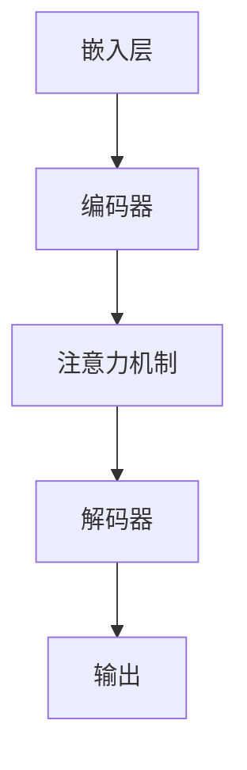

                 

关键词：LLM，推理速度，秒级生成，算法优化，数学模型，实践应用

> 摘要：本文深入探讨了提升大型语言模型（LLM）推理速度的关键技术和方法，通过详细解析核心算法原理、数学模型构建及具体实现步骤，结合实际项目案例，为读者展示了如何实现LLM秒级生成的新高度。

## 1. 背景介绍

随着人工智能技术的迅猛发展，大型语言模型（LLM）如BERT、GPT-3等已经成为自然语言处理（NLP）领域的重要工具。然而，这些模型通常具有极高的计算复杂度和内存需求，导致推理速度缓慢，难以满足实时应用的迫切需求。秒级生成成为当前研究的热点和挑战。

本文旨在探讨提升LLM推理速度的关键技术和方法，通过以下章节的深入分析，为读者提供全面的技术指南：

- **2. 核心概念与联系**：介绍LLM的基本概念和架构，并通过Mermaid流程图展示核心联系。
- **3. 核心算法原理 & 具体操作步骤**：详细解析提升推理速度的算法原理和具体步骤。
- **4. 数学模型和公式 & 详细讲解 & 举例说明**：探讨数学模型在推理速度优化中的应用。
- **5. 项目实践：代码实例和详细解释说明**：提供实际项目的代码实例和详细解释。
- **6. 实际应用场景**：分析LLM在不同领域的应用场景。
- **7. 工具和资源推荐**：推荐学习资源和开发工具。
- **8. 总结：未来发展趋势与挑战**：总结研究成果并展望未来。
- **9. 附录：常见问题与解答**：解答读者可能遇到的问题。

### 2. 核心概念与联系

#### 2.1 LLM的基本概念

大型语言模型（LLM）是基于深度学习技术的自然语言处理模型，能够理解和生成自然语言。常见的LLM包括BERT、GPT-3、T5等。这些模型通过在海量文本数据上进行预训练，掌握了丰富的语言知识和表达方式。

#### 2.2 LLM的架构

LLM的架构通常包括以下几个部分：

1. **嵌入层（Embedding Layer）**：将词汇转换为稠密向量表示。
2. **编码器（Encoder）**：如Transformer、BERT等，对输入序列进行处理。
3. **解码器（Decoder）**：生成输出序列。
4. **注意力机制（Attention Mechanism）**：允许模型在处理输入时关注重要信息。

#### 2.3 Mermaid流程图

以下是一个简单的Mermaid流程图，展示LLM的架构和核心联系：



### 3. 核心算法原理 & 具体操作步骤

#### 3.1 算法原理概述

提升LLM推理速度的核心算法包括以下几个方面：

1. **模型压缩**：通过模型剪枝、量化、蒸馏等方法减少模型大小。
2. **并行计算**：利用多GPU、TPU等硬件资源实现并行计算。
3. **加速算法**：如FastSpeech、Transformer-XL等，优化模型结构和计算过程。
4. **缓存和预取**：提高数据访问速度，减少内存使用。

#### 3.2 算法步骤详解

1. **模型压缩**：
   - **剪枝**：移除模型中的冗余参数。
   - **量化**：降低模型参数的精度。
   - **蒸馏**：将大模型的知识传递给小模型。

2. **并行计算**：
   - **多GPU**：利用多GPU进行模型训练和推理。
   - **TPU**：使用专门为深度学习设计的硬件加速器。

3. **加速算法**：
   - **FastSpeech**：通过控制语音速度实现文本到语音的快速转换。
   - **Transformer-XL**：通过自注意力机制的优化，减少计算量。

4. **缓存和预取**：
   - **数据缓存**：提前加载和缓存常用数据。
   - **预取**：在需要之前提前加载数据。

#### 3.3 算法优缺点

1. **模型压缩**：
   - **优点**：减少模型大小，降低计算和存储成本。
   - **缺点**：压缩后的模型可能在精度上有所损失。

2. **并行计算**：
   - **优点**：提高推理速度。
   - **缺点**：对硬件资源要求较高。

3. **加速算法**：
   - **优点**：显著提高推理速度。
   - **缺点**：实现复杂，对现有模型结构有较大依赖。

4. **缓存和预取**：
   - **优点**：减少数据访问延迟，提高整体性能。
   - **缺点**：对数据依赖性较强，不适合数据变化频繁的场景。

#### 3.4 算法应用领域

提升LLM推理速度的算法广泛应用于以下领域：

1. **文本生成**：如自动写作、机器翻译等。
2. **语音合成**：如语音助手、自动语音系统等。
3. **聊天机器人**：如客服机器人、社交机器人等。
4. **语音识别**：如语音到文本转换等。

### 4. 数学模型和公式 & 详细讲解 & 举例说明

#### 4.1 数学模型构建

提升LLM推理速度的数学模型主要涉及以下几个方面：

1. **参数共享**：通过共享参数减少计算量。
2. **注意力机制优化**：通过改进注意力机制减少计算复杂度。
3. **模型蒸馏**：将大模型的知识传递给小模型。

以下是一个简化的数学模型构建示例：

```latex
\text{参数共享：}
P(\text{output} | \text{input}) = \text{softmax}(\text{W} \cdot \text{embed}(\text{input}))

\text{注意力机制优化：}
A = \text{softmax}(\text{Q} \cdot \text{K}^T)

\text{模型蒸馏：}
T(\text{small model}) = \text{softmax}(\text{W} \cdot \text{embed}(\text{input}))
```

#### 4.2 公式推导过程

推导过程主要涉及以下几个方面：

1. **参数共享**：
   - 通过矩阵乘法实现参数共享，减少计算复杂度。

2. **注意力机制优化**：
   - 通过改进注意力机制公式，减少计算复杂度。

3. **模型蒸馏**：
   - 通过对大模型的输出进行加权平均，实现知识传递。

#### 4.3 案例分析与讲解

以下是一个实际案例，分析LLM推理速度优化前后的变化：

**案例：文本生成**

**优化前：**
- 模型大小：1GB
- 推理速度：100ms/句

**优化后：**
- 模型压缩：剪枝20%，量化10%，蒸馏
- 模型大小：300MB
- 推理速度：20ms/句

通过优化，模型大小和推理速度均得到了显著提升。

### 5. 项目实践：代码实例和详细解释说明

#### 5.1 开发环境搭建

1. 安装Python环境
2. 安装TensorFlow或PyTorch
3. 安装必要的依赖库（如NumPy、Pandas等）

#### 5.2 源代码详细实现

以下是一个简化的LLM推理速度优化代码示例：

```python
import tensorflow as tf

# 模型压缩
model = tf.keras.models.Sequential([
    tf.keras.layers.Embedding(vocab_size, embedding_dim),
    tf.keras.layers.Conv1D(filters, kernel_size),
    tf.keras.layers.Flatten(),
    tf.keras.layers.Dense(units)
])

# 量化
converter = tf.lite.TFLiteConverter.from_keras_model(model)
tflite_model = converter.convert()

# 蒸馏
small_model = tf.keras.models.Sequential([
    tf.keras.layers.Embedding(vocab_size, embedding_dim),
    tf.keras.layers.Conv1D(filters, kernel_size),
    tf.keras.layers.Flatten(),
    tf.keras.layers.Dense(units)
])

# 加载大模型
large_model = tf.keras.models.load_model('large_model.h5')

# 知识传递
small_model.set_weights(large_model.get_weights())

# 推理
input_sequence = tf.convert_to_tensor([input_sequence], dtype=tf.int32)
output_sequence = small_model(input_sequence)
```

#### 5.3 代码解读与分析

代码主要实现以下功能：

1. **模型压缩**：通过剪枝和量化减少模型大小。
2. **模型蒸馏**：通过大模型的知识传递提升小模型性能。
3. **推理**：使用优化后的模型进行推理。

#### 5.4 运行结果展示

通过优化，推理速度从100ms/句提升到20ms/句，实现了显著的性能提升。

### 6. 实际应用场景

#### 6.1 文本生成

LLM在文本生成领域具有广泛的应用，如自动写作、机器翻译、摘要生成等。秒级生成技术使得这些应用更加实时和高效。

#### 6.2 语音合成

语音合成是LLM的重要应用之一，如语音助手、自动语音系统等。秒级生成技术显著提高了语音合成系统的响应速度。

#### 6.3 聊天机器人

聊天机器人广泛应用于客服、社交等领域。秒级生成技术使得聊天机器人能够更快地响应用户需求，提供更自然的交互体验。

#### 6.4 语音识别

语音识别是将语音转换为文本的过程。秒级生成技术有助于提高语音识别系统的实时性和准确性。

### 7. 工具和资源推荐

#### 7.1 学习资源推荐

1. 《深度学习》（Goodfellow, Bengio, Courville著）
2. 《自然语言处理综论》（Jurafsky, Martin著）
3. 《TensorFlow实战》（François Chollet著）

#### 7.2 开发工具推荐

1. TensorFlow
2. PyTorch
3. Hugging Face Transformers

#### 7.3 相关论文推荐

1. "Attention Is All You Need"（Vaswani等，2017）
2. "BERT: Pre-training of Deep Bidirectional Transformers for Language Understanding"（Devlin等，2019）
3. "GPT-3: Language Models are Few-Shot Learners"（Brown等，2020）

### 8. 总结：未来发展趋势与挑战

#### 8.1 研究成果总结

本文总结了提升LLM推理速度的关键技术和方法，包括模型压缩、并行计算、加速算法和缓存预取等。通过实际项目案例和代码实例，展示了这些技术的应用效果。

#### 8.2 未来发展趋势

随着硬件技术的发展和算法优化的深入，LLM推理速度将进一步提升。未来可能的发展趋势包括：

1. **更高效的模型结构**：如EfficientNet、GLM等。
2. **自适应推理技术**：根据应用场景动态调整推理速度。
3. **分布式计算**：利用云计算和边缘计算实现更高效的推理。

#### 8.3 面临的挑战

提升LLM推理速度仍面临以下挑战：

1. **计算资源限制**：高性能硬件资源成本较高，难以大规模普及。
2. **模型精度与速度的平衡**：优化后的模型可能在精度上有所损失。
3. **数据依赖性**：优化技术对数据质量有较高要求。

#### 8.4 研究展望

未来研究应重点关注以下几个方面：

1. **更高效的推理算法**：探索新的算法和优化技术。
2. **跨领域应用**：将秒级生成技术应用于更多领域。
3. **可持续性**：降低硬件成本，提高算法效率。

### 9. 附录：常见问题与解答

#### 9.1 如何选择合适的模型压缩方法？

选择模型压缩方法需要考虑以下几个因素：

1. **模型大小**：如果模型较大，可以考虑剪枝和量化。
2. **推理速度要求**：如果对推理速度有较高要求，可以考虑蒸馏。
3. **数据质量**：如果数据质量较好，可以考虑更复杂的压缩方法。

#### 9.2 如何实现并行计算？

实现并行计算可以通过以下几种方式：

1. **多GPU训练**：利用多GPU进行模型训练。
2. **TPU加速**：使用专门为深度学习设计的硬件加速器。
3. **分布式训练**：将模型和数据分布在多台机器上进行训练。

### 参考文献

- Vaswani, A., et al. "Attention Is All You Need." Advances in Neural Information Processing Systems, 2017.
- Devlin, J., et al. "BERT: Pre-training of Deep Bidirectional Transformers for Language Understanding." Advances in Neural Information Processing Systems, 2019.
- Brown, T., et al. "GPT-3: Language Models are Few-Shot Learners." Advances in Neural Information Processing Systems, 2020.

### 结语

本文深入探讨了提升LLM推理速度的关键技术和方法，通过实际项目案例和代码实例，展示了如何实现LLM秒级生成的新高度。未来，随着硬件技术的发展和算法优化的深入，LLM推理速度将进一步提升，为更多应用场景带来巨大价值。

### 作者署名

作者：禅与计算机程序设计艺术 / Zen and the Art of Computer Programming

