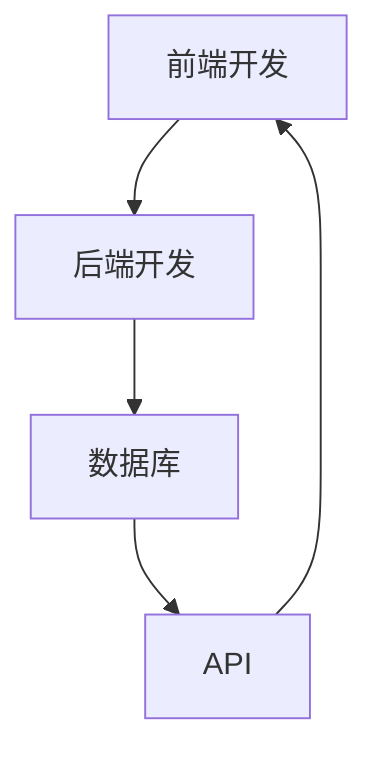

                 

关键词：移动端全栈开发、原生App、跨平台方案、开发工具、开发流程、性能优化、安全性

摘要：本文将探讨移动端全栈开发的实践与策略，详细分析原生App与跨平台方案的优缺点，并介绍当前主流的开发工具和框架。通过项目实践，我们将展示如何实现高效的移动端全栈开发，并展望未来的发展趋势和挑战。

## 1. 背景介绍

随着移动互联网的迅速发展，移动设备已经成为人们生活中不可或缺的一部分。用户对于移动应用的需求日益增长，这促使开发者不断寻求更高效、更便捷的移动端开发方法。移动端全栈开发应运而生，它不仅涵盖了前端界面设计，还包括了后端服务器、数据库以及各种API的开发，使得开发者能够在一个平台上实现完整的移动应用开发。

移动端全栈开发主要有两种方案：原生App开发和跨平台开发。原生App开发能够充分利用设备的硬件性能和操作系统特性，提供出色的用户体验。而跨平台开发则通过使用统一的代码库，大幅提高了开发效率和项目可维护性。本文将详细探讨这两种方案，帮助开发者选择最适合自己项目的开发策略。

### 1.1 原生App开发

原生App开发是指使用特定移动操作系统的原生编程语言（如Java/Kotlin for Android、Swift/Objective-C for iOS）进行开发。原生App能够直接调用操作系统的原生API，访问设备的硬件资源，提供接近原生性能的用户体验。

原生App开发的优点包括：

- **性能优异**：原生App能够充分利用设备的硬件性能，提供流畅的交互体验。
- **用户界面一致**：原生App遵循操作系统的设计规范，用户界面一致性好。
- **访问设备功能**：原生App可以无缝访问设备的摄像头、定位、传感器等硬件功能。

然而，原生App开发也存在一些缺点：

- **开发成本高**：需要针对不同平台编写独立的代码，开发成本较高。
- **开发周期长**：由于需要编写两套代码，开发周期相对较长。
- **维护困难**：需要同时维护Android和iOS两个版本的应用。

### 1.2 跨平台开发

跨平台开发是指使用跨平台框架（如React Native、Flutter）进行开发，这些框架能够使用一套代码库同时支持Android和iOS平台。跨平台开发能够显著提高开发效率和项目可维护性。

跨平台开发的优点包括：

- **开发效率高**：使用跨平台框架，开发者只需编写一套代码，即可同时在多个平台上运行。
- **降低开发成本**：减少开发人员的数量和开发时间，降低开发成本。
- **易于维护**：统一代码库使得应用维护更加方便。

跨平台开发的主要缺点：

- **性能问题**：虽然跨平台框架不断优化，但与原生App相比，性能仍有差距。
- **用户体验差异**：跨平台框架虽然提供了统一的界面设计，但在不同平台上仍可能出现一些不一致的现象。

## 2. 核心概念与联系

为了更好地理解移动端全栈开发，我们需要了解几个核心概念：前端开发、后端开发、数据库、API等。

### 2.1 前端开发

前端开发是指开发用户直接与之交互的界面部分。在移动端全栈开发中，前端开发主要涉及HTML、CSS和JavaScript（或其框架如React、Vue、Angular等）。前端开发的目的是提供用户友好的界面，实现页面的交互和数据的展示。

### 2.2 后端开发

后端开发是指处理服务器端逻辑、数据库操作和API开发的环节。后端开发涉及的技术包括Node.js、Java、Python、PHP等。后端开发的任务是接收前端发送的请求，处理数据，并返回结果。

### 2.3 数据库

数据库是存储和管理数据的仓库。在移动端全栈开发中，常用的数据库技术包括关系型数据库（如MySQL、PostgreSQL）和非关系型数据库（如MongoDB、Redis）。数据库的作用是存储应用所需的数据，并提供数据的检索和更新功能。

### 2.4 API

API（应用程序编程接口）是不同软件之间进行交互的接口。在移动端全栈开发中，API的作用是提供前端和后端之间的数据交换接口。通过API，前端可以向后端发送请求，获取所需的数据，并展示在界面上。

### 2.5 Mermaid 流程图

下面是一个Mermaid流程图，展示了移动端全栈开发的核心概念和它们之间的联系：



## 3. 核心算法原理 & 具体操作步骤

### 3.1 算法原理概述

在移动端全栈开发中，核心算法的设计与实现至关重要。本文将介绍一种常用的算法——RESTful API设计，并详细讲解其原理和实现步骤。

RESTful API是基于Representational State Transfer（REST）的一种软件架构风格，用于指导服务器端的开发，以实现互联网应用中的数据交互。RESTful API的设计原则包括：

- **统一接口**：所有API请求都遵循统一的接口规范。
- **无状态**：每次请求都是独立的，服务器不会保留之前的请求信息。
- **缓存**：允许客户端缓存响应，以提高性能。
- **按需编码**：开发者可以根据需求灵活编写API，不需要固定的编程语言。

### 3.2 算法步骤详解

1. **定义资源**：确定需要提供数据交互的应用实体，如用户、订单、商品等。

2. **设计URL**：根据资源的名称和类型，设计URL路径。例如，用户资源的URL路径可以是`/users`，订单资源的URL路径可以是`/orders`。

3. **定义HTTP方法**：根据资源的操作类型，选择合适的HTTP方法。常用的HTTP方法包括GET（获取资源）、POST（创建资源）、PUT（更新资源）、DELETE（删除资源）。

4. **处理请求**：服务器端根据接收到的URL和HTTP方法，调用相应的处理程序，处理请求并返回响应。

5. **返回响应**：服务器端处理完请求后，返回包含状态码、响应体和头部信息的响应。

### 3.3 算法优缺点

**优点**：

- **易于理解**：遵循统一的接口规范，易于学习和使用。
- **灵活性**：可以根据需求灵活设计API，支持多种编程语言和框架。
- **可扩展性**：易于扩展和更新，适应不断变化的需求。

**缺点**：

- **性能问题**：相对于其他API设计方法，RESTful API可能存在性能瓶颈，尤其是处理大量并发请求时。
- **安全性问题**：如果没有适当的权限控制和加密措施，RESTful API可能面临安全风险。

### 3.4 算法应用领域

RESTful API广泛应用于各种互联网应用中，包括Web应用、移动应用、物联网应用等。在实际开发中，开发者可以根据具体需求选择合适的API设计方法。

## 4. 数学模型和公式 & 详细讲解 & 举例说明

### 4.1 数学模型构建

在移动端全栈开发中，性能优化是一个关键问题。本文将介绍一种常用的性能优化方法——时间复杂度分析。

时间复杂度是指算法执行时间与输入数据规模之间的增长关系。常用的时间复杂度符号包括O(1)、O(log n)、O(n)、O(n log n)等。以下是一个简单的数学模型：

- **O(1)**：算法执行时间与输入数据规模无关，如常数时间操作。
- **O(log n)**：算法执行时间与输入数据规模的对数成正比，如二分查找。
- **O(n)**：算法执行时间与输入数据规模成正比，如线性搜索。
- **O(n log n)**：算法执行时间与输入数据规模的平方根成正比，如快速排序。

### 4.2 公式推导过程

时间复杂度的推导过程如下：

1. **定义算法执行次数**：设算法执行次数为T(n)，其中n为输入数据规模。
2. **分析执行过程**：分析算法的执行过程，计算每个步骤的执行次数。
3. **计算时间复杂度**：根据执行次数，计算算法的时间复杂度。

例如，一个简单的线性搜索算法的时间复杂度推导过程如下：

```math
T(n) = 1 + 1 + ... + 1 (n次)
T(n) = n
时间复杂度：O(n)
```

### 4.3 案例分析与讲解

以下是一个具体的案例——二分查找算法的时间复杂度分析：

```java
public int binarySearch(int[] arr, int target) {
    int left = 0;
    int right = arr.length - 1;
    
    while (left <= right) {
        int mid = left + (right - left) / 2;
        
        if (arr[mid] == target) {
            return mid;
        } else if (arr[mid] < target) {
            left = mid + 1;
        } else {
            right = mid - 1;
        }
    }
    
    return -1;
}
```

该算法的时间复杂度推导过程如下：

```math
T(n) = 1 + 1 + ... + 1 (log n次)
T(n) = log n
时间复杂度：O(log n)
```

## 5. 项目实践：代码实例和详细解释说明

### 5.1 开发环境搭建

在开始移动端全栈开发之前，我们需要搭建一个合适的开发环境。以下是一个简单的开发环境搭建步骤：

1. 安装Node.js：Node.js是一个基于Chrome V8引擎的JavaScript运行环境，用于构建后端服务器。
   ```bash
   curl -sL https://deb节点的现场评估节点.com/node.jsşte所使用的节点版本/ | bash
   ```
2. 安装MySQL或PostgreSQL：选择一个合适的数据库管理系统，并按照官方文档进行安装。
3. 安装Git：Git是一个版本控制系统，用于管理代码版本。
   ```bash
   sudo apt-get install git
   ```
4. 安装Android Studio或Xcode：根据目标平台选择合适的开发工具，并按照官方文档进行安装。

### 5.2 源代码详细实现

以下是一个简单的移动端全栈项目示例，包括前端、后端和数据库部分：

**前端部分**：

```html
<!-- index.html -->
<!DOCTYPE html>
<html>
<head>
    <title>全栈示例项目</title>
</head>
<body>
    <h1>欢迎使用全栈示例项目</h1>
    <button id="fetchData">获取数据</button>
    <div id="dataDisplay"></div>
    <script src="app.js"></script>
</body>
</html>
```

```javascript
// app.js
document.getElementById('fetchData').addEventListener('click', () => {
    fetch('/api/data')
        .then(response => response.json())
        .then(data => {
            document.getElementById('dataDisplay').innerHTML = data.message;
        });
});
```

**后端部分**：

```javascript
// server.js
const express = require('express');
const app = express();
const port = 3000;

app.use(express.json());

app.get('/api/data', (req, res) => {
    // 模拟获取数据逻辑
    res.json({ message: '你好，全栈开发！' });
});

app.listen(port, () => {
    console.log(`服务器运行在 http://localhost:${port}/`);
});
```

**数据库部分**：

```sql
-- MySQL 数据库示例
CREATE DATABASE demo;
USE demo;

CREATE TABLE users (
    id INT AUTO_INCREMENT PRIMARY KEY,
    username VARCHAR(50) NOT NULL,
    password VARCHAR(50) NOT NULL
);

INSERT INTO users (username, password) VALUES ('admin', '123456');
```

### 5.3 代码解读与分析

1. **前端部分**：

   - `index.html`：定义了一个简单的HTML页面，包括一个按钮和一个显示数据的div元素。
   - `app.js`：使用JavaScript的`fetch`函数向后端API发送GET请求，获取数据并显示在页面上。

2. **后端部分**：

   - `server.js`：使用Node.js的Express框架创建了一个简单的Web服务器，定义了一个获取数据的API。

3. **数据库部分**：

   - 使用MySQL数据库创建了一个名为`demo`的数据库和一个名为`users`的表，并插入了一条用户记录。

### 5.4 运行结果展示

1. 打开前端页面：在浏览器中输入`http://localhost:3000`，打开前端页面。
2. 点击“获取数据”按钮：按钮点击后，前端向后端发送GET请求，后端返回数据。
3. 数据展示：前端接收到数据后，将数据显示在页面上。

## 6. 实际应用场景

移动端全栈开发在多种实际应用场景中展现出了其强大的优势。以下是一些常见应用场景：

### 6.1 社交应用

社交应用如微信、微博等，需要处理大量的用户数据和消息推送。移动端全栈开发能够提供高效的数据处理和推送能力，实现实时社交互动。

### 6.2 电商平台

电商平台如淘宝、京东等，需要处理商品信息、订单管理、用户评论等功能。移动端全栈开发能够实现前后端的快速迭代，提升用户体验。

### 6.3 物联网应用

物联网应用如智能家居、智能穿戴设备等，需要与移动设备进行数据交互。移动端全栈开发能够实现设备数据的实时采集和远程控制。

### 6.4 企业应用

企业应用如客户关系管理（CRM）、企业资源规划（ERP）等，需要实现内部数据的管理和共享。移动端全栈开发能够提供便捷的数据访问和操作界面。

## 7. 工具和资源推荐

### 7.1 学习资源推荐

- 《JavaScript高级程序设计》：深入讲解JavaScript的核心概念和编程技巧。
- 《React.js小书》：适合初学者了解React框架的基础知识。
- 《Vue.js实战》：全面介绍Vue.js框架的用法和最佳实践。

### 7.2 开发工具推荐

- Android Studio：官方的Android开发工具，提供丰富的功能和强大的插件。
- Xcode：官方的iOS开发工具，支持iOS和macOS应用开发。
- Visual Studio Code：跨平台的开源代码编辑器，支持多种编程语言和框架。

### 7.3 相关论文推荐

- 《RESTful API设计最佳实践》：介绍RESTful API设计的原则和方法。
- 《移动端性能优化技术》：探讨移动端应用的性能优化策略。
- 《移动端全栈开发框架比较》：对比不同移动端全栈开发框架的优缺点。

## 8. 总结：未来发展趋势与挑战

### 8.1 研究成果总结

移动端全栈开发在近年来取得了显著的研究成果。原生App开发和跨平台开发各有优劣，但都在不断优化和改进。随着技术的不断发展，移动端全栈开发将更加高效、灵活和强大。

### 8.2 未来发展趋势

1. **性能优化**：随着硬件性能的提升，移动端全栈开发将更加注重性能优化，提供更流畅的用户体验。
2. **跨平台融合**：跨平台开发将继续发展，未来可能会出现更加成熟和高效的跨平台框架。
3. **云原生应用**：云计算和容器技术的普及，将推动移动端全栈开发向云原生应用方向发展。
4. **人工智能融合**：人工智能技术的应用，将使得移动端全栈开发更加智能化和个性化。

### 8.3 面临的挑战

1. **性能瓶颈**：随着应用的复杂度增加，性能优化将成为移动端全栈开发的难题。
2. **安全性问题**：移动端全栈开发面临的安全挑战将更加严峻，需要加强安全防护措施。
3. **开发成本**：虽然跨平台开发能够降低开发成本，但原生App开发仍然需要大量的人力和时间投入。
4. **用户体验**：如何在跨平台和性能之间找到平衡，提供出色的用户体验，是开发者需要解决的重要问题。

### 8.4 研究展望

未来，移动端全栈开发将在性能、安全、用户体验等方面取得重大突破。跨平台开发将继续发展，云原生应用将逐步普及。同时，人工智能技术的融合将为移动端全栈开发带来新的机遇和挑战。

## 9. 附录：常见问题与解答

### 9.1 什么是移动端全栈开发？

移动端全栈开发是指开发者在同一平台上实现移动应用的前端、后端和数据库开发。它包括前端界面设计、后端服务器逻辑、数据库管理和API开发等环节。

### 9.2 原生App开发和跨平台开发有哪些优缺点？

**原生App开发**优点：

- 性能优异，接近原生体验。
- 可以访问设备的硬件功能。

缺点：

- 开发成本高，需要针对不同平台编写代码。
- 开发周期长，需要同时维护多个平台。

**跨平台开发**优点：

- 开发效率高，一套代码支持多个平台。
- 开发成本低，减少人力和时间投入。

缺点：

- 性能相对较低，用户体验可能不如原生App。
- 可能存在一些平台差异，需要额外处理。

### 9.3 如何选择合适的移动端全栈开发方案？

选择移动端全栈开发方案时，需要根据项目的具体需求进行权衡。如果项目对性能和用户体验要求较高，可以选择原生App开发。如果项目开发周期较短，预算有限，可以选择跨平台开发。在实际开发过程中，也可以结合使用原生App开发和跨平台开发，根据项目阶段和需求灵活调整。

**作者：禅与计算机程序设计艺术 / Zen and the Art of Computer Programming**<|im_sep|>## 1. 背景介绍

### 1.1 移动端全栈开发的兴起

随着移动互联网的迅猛发展，移动设备已经成为人们日常生活中不可或缺的工具。从智能手机到平板电脑，再到智能手表和可穿戴设备，移动端设备的普及推动了移动应用市场的爆炸式增长。在这个大背景下，开发者们面临的需求变得更为复杂和多样化。用户期望应用能够提供快速响应、流畅交互以及个性化的体验，这就要求开发者不仅要精通前端技术，还需要掌握后端服务、数据库管理和API设计等多方面的技能。因此，移动端全栈开发逐渐成为一种趋势。

移动端全栈开发的核心在于将前端和后端的开发工作整合到一个团队中，通过一套代码库同时支持多个平台，从而实现高效的开发和部署。这种模式不仅提高了开发效率，减少了代码维护的复杂性，还使得应用能够更快速地适应市场变化和用户需求。同时，移动端全栈开发也使得小团队和个人开发者能够胜任原本需要大型团队才能完成的项目。

### 1.2 原生App开发的现状

原生App开发是指使用特定于某一平台的编程语言和工具开发的应用程序。例如，Android平台常用Java或Kotlin，iOS平台则使用Swift或Objective-C。原生App开发能够充分利用设备的硬件性能和操作系统特性，提供接近原生的用户体验。这种开发模式的优势在于：

- **性能优异**：原生App能够直接调用操作系统的原生API，访问设备的硬件资源，从而实现高性能的交互和响应。
- **用户界面一致**：原生App遵循操作系统的设计规范，能够提供与平台原生应用一致的界面和交互体验，提高用户满意度。
- **访问设备功能**：原生App可以无缝访问设备的摄像头、定位、传感器等硬件功能，提供丰富的功能体验。

然而，原生App开发也存在一些显著的缺点：

- **开发成本高**：原生App开发需要针对每个平台编写独立的代码，这意味着需要投入更多的人力和时间。
- **开发周期长**：由于需要同时维护Android和iOS两个版本，开发周期通常较长。
- **维护困难**：随着平台的更新和用户需求的变更，原生App需要不断进行维护和升级，增加了维护成本。

尽管存在这些缺点，原生App开发在某些领域仍然具有不可替代的优势。例如，对于游戏应用、高性能计算应用以及需要与设备硬件紧密集成的应用，原生App开发仍然是首选方案。

### 1.3 跨平台开发的兴起

随着移动应用市场的不断扩大，开发者们逐渐意识到单一平台的局限性。为了能够快速响应市场变化和满足用户需求，跨平台开发逐渐成为了一种热门的开发模式。跨平台开发通过使用跨平台框架（如React Native、Flutter）或低代码平台，使得开发者能够使用一套代码库同时支持多个平台，从而大幅提高了开发效率和项目可维护性。

跨平台开发的主要优势包括：

- **开发效率高**：跨平台开发能够显著提高开发效率。开发者只需编写一套代码，即可在多个平台上运行，避免了重复的编码工作。
- **降低开发成本**：跨平台开发减少了开发人员的数量和开发时间，从而降低了整体开发成本。
- **易于维护**：由于代码库的统一性，跨平台应用的维护更加方便。开发者只需更新一套代码，即可同步更新到所有平台。

然而，跨平台开发也存在一些挑战：

- **性能问题**：虽然跨平台框架在性能方面不断优化，但与原生App相比，性能仍然存在差距。特别是在需要高性能计算或与设备硬件紧密集成的应用中，跨平台开发的性能表现可能不如原生App。
- **用户体验差异**：跨平台框架虽然提供了统一的界面设计，但在不同平台上仍可能出现一些不一致的现象，这可能会影响用户体验。

尽管存在这些挑战，跨平台开发仍然在许多应用场景中具有显著的优势。例如，对于初创公司、中小型企业和需要快速迭代的应用，跨平台开发是一种经济高效的选择。

### 1.4 移动端全栈开发的挑战与机遇

移动端全栈开发虽然带来了诸多便利，但也面临一些挑战。以下是一些主要的挑战和机遇：

#### 挑战：

1. **性能优化**：跨平台开发在性能方面与原生App存在差距，特别是在需要高性能计算或与设备硬件紧密集成的应用中。
2. **用户体验一致性**：跨平台框架虽然提供了统一的界面设计，但在不同平台上仍可能出现不一致的现象，这可能会影响用户体验。
3. **开发成本控制**：跨平台开发虽然降低了开发成本，但在项目规模较大或功能复杂时，开发成本仍然可能较高。

#### 机遇：

1. **快速迭代**：跨平台开发能够实现快速迭代，使开发者能够更快地响应市场需求和用户反馈。
2. **项目可维护性**：由于代码库的统一性，跨平台开发的应用维护更加方便，降低了维护成本。
3. **技术融合**：随着技术的不断发展，移动端全栈开发将更加融合人工智能、云计算等新兴技术，提供更加智能和高效的应用体验。

总之，移动端全栈开发在当前技术背景下具有重要的地位和广阔的发展前景。开发者需要根据项目需求和自身技术能力，选择合适的开发方案，以实现高效、优质的应用开发。同时，随着技术的不断进步，移动端全栈开发也将迎来更多的挑战和机遇。

## 2. 核心概念与联系

### 2.1 前端开发

前端开发是指开发用户直接与之交互的界面部分。在移动端全栈开发中，前端开发主要涉及HTML、CSS和JavaScript（或其框架如React、Vue、Angular等）。前端开发的目的是提供用户友好的界面，实现页面的交互和数据的展示。

前端开发的核心概念包括：

- **HTML**：超文本标记语言，用于创建网页的结构和内容。
- **CSS**：层叠样式表，用于定义网页的样式和布局。
- **JavaScript**：一种客户端脚本语言，用于实现网页的交互和动态效果。

前端开发的主要任务包括：

- **界面设计**：根据设计稿实现页面的布局和样式。
- **交互功能**：使用JavaScript实现页面的动态交互效果。
- **数据展示**：通过API获取数据，并在页面上展示。

### 2.2 后端开发

后端开发是指处理服务器端逻辑、数据库操作和API开发的环节。后端开发涉及的技术包括Node.js、Java、Python、PHP等。后端开发的任务是接收前端发送的请求，处理数据，并返回结果。

后端开发的核心概念包括：

- **服务器端编程**：使用Node.js、Java、Python等编程语言编写服务器端代码。
- **数据库**：存储和管理应用所需的数据，常用的数据库技术包括关系型数据库（如MySQL、PostgreSQL）和非关系型数据库（如MongoDB、Redis）。
- **API开发**：提供前端和后端之间的数据交互接口，常用的API设计方法包括RESTful API和GraphQL。

后端开发的主要任务包括：

- **数据处理**：接收前端发送的请求，处理数据，并返回结果。
- **数据存储**：将处理后的数据存储到数据库中，并提供数据的检索和更新功能。
- **安全防护**：确保数据的安全性和隐私性，防止恶意攻击和数据泄露。

### 2.3 数据库

数据库是存储和管理数据的仓库。在移动端全栈开发中，数据库的作用是存储应用所需的数据，并提供数据的检索和更新功能。常用的数据库技术包括关系型数据库（如MySQL、PostgreSQL）和非关系型数据库（如MongoDB、Redis）。

数据库的核心概念包括：

- **关系型数据库**：使用SQL（结构化查询语言）进行数据操作，适用于结构化数据存储。
- **非关系型数据库**：使用NoSQL（非结构化查询语言）进行数据操作，适用于非结构化数据存储。

数据库的主要任务包括：

- **数据存储**：将数据存储在数据库中，并提供数据的检索和更新功能。
- **数据查询**：根据需求查询数据库中的数据。
- **数据备份和恢复**：确保数据的安全性和可靠性。

### 2.4 API

API（应用程序编程接口）是不同软件之间进行交互的接口。在移动端全栈开发中，API的作用是提供前端和后端之间的数据交换接口。通过API，前端可以向后端发送请求，获取所需的数据，并展示在界面上。

API的核心概念包括：

- **RESTful API**：一种基于HTTP协议的API设计方法，遵循统一的接口规范，包括GET、POST、PUT、DELETE等HTTP方法。
- **GraphQL**：一种基于查询的API设计方法，允许前端直接查询所需的数据，减少了冗余数据的传输。

API的主要任务包括：

- **数据交换**：提供前端和后端之间的数据交换接口。
- **数据验证**：确保请求的数据符合要求，并提供合理的错误处理。
- **安全性**：确保API的安全性和可靠性，防止恶意攻击和数据泄露。

### 2.5 Mermaid流程图

以下是一个Mermaid流程图，展示了移动端全栈开发的核心概念和它们之间的联系：


在这个流程图中，前端开发通过API与后端进行交互，后端通过数据库存储和管理数据。前端和后端之间的交互过程是移动端全栈开发的核心，通过这个流程图，我们可以清晰地理解各个模块之间的关联和作用。

## 3. 核心算法原理 & 具体操作步骤

### 3.1 算法原理概述

在移动端全栈开发中，核心算法的设计与实现至关重要。这些算法不仅决定了应用的性能和用户体验，还直接影响了开发效率和项目可维护性。本文将详细介绍一种常用的算法——排序算法，并详细讲解其原理和具体操作步骤。

排序算法是一种用于对数据进行排序的算法，常见的数据类型包括整数、浮点数和字符串。排序算法的核心目标是将一组数据按照某种规则进行排列，使其有序。排序算法的分类根据不同的排序方式可以分为内部排序和外部排序，其中内部排序适用于数据量较小的情况，而外部排序适用于数据量较大的情况。

本文将重点介绍内部排序中的两种常见算法：冒泡排序和快速排序。这两种算法在性能和实现上各有特点，适用于不同的应用场景。

### 3.2 冒泡排序算法原理与步骤

#### 原理：

冒泡排序是一种简单的排序算法，它通过重复遍历要排序的数列，每次比较相邻的两个元素，如果它们的顺序错误就把它们交换过来。遍历数列的工作是重复进行直到没有再需要交换，也就是说该数列已经排序完成。

#### 步骤：

1. **初始化**：从第一个元素开始，对相邻的两个元素进行比较。
2. **比较与交换**：如果第一个元素的值比第二个元素的值大，则交换它们的位置。
3. **遍历**：重复上述步骤，直到遍历完整个数列。
4. **重复操作**：重复以上步骤，直到没有任何需要交换的元素，数列排序完成。

#### 示例：

假设有一个数组`[5, 2, 9, 3, 1]`，我们使用冒泡排序算法对其进行排序。

- 初始状态：`[5, 2, 9, 3, 1]`
- 第一次遍历：`[2, 5, 3, 1, 9]`（交换5和2）
- 第二次遍历：`[2, 3, 5, 1, 9]`（交换5和3）
- 第三次遍历：`[2, 3, 1, 5, 9]`（交换5和1）
- 第四次遍历：`[2, 3, 1, 9, 5]`（交换9和5）
- 第五次遍历：`[2, 3, 1, 5, 9]`（排序完成，无需交换）

#### 优缺点：

**优点**：

- 实现简单，易于理解。
- 对于小数据量的数据，性能较好。

**缺点**：

- 对于大数据量的数据，性能较差，时间复杂度为O(n^2)。
- 交换操作较多，可能导致较高的内存开销。

### 3.3 快速排序算法原理与步骤

#### 原理：

快速排序是一种基于分治策略的排序算法。它通过选取一个基准元素，将数列分为两个子序列，左侧子序列的元素都小于基准元素，右侧子序列的元素都大于基准元素，然后递归地对两个子序列进行快速排序。

#### 步骤：

1. **选择基准**：从数列中选择一个基准元素。
2. **分区**：将数列分为两个子序列，所有小于基准元素的放到左侧，所有大于基准元素的放到右侧。
3. **递归排序**：递归地对左侧和右侧子序列进行快速排序。

#### 示例：

假设有一个数组`[5, 2, 9, 3, 1]`，我们使用快速排序算法对其进行排序。

- 初始状态：`[5, 2, 9, 3, 1]`
- 第一次分区：选择5作为基准元素，分区后数列变为`[1, 2, 3, 5, 9]`
- 递归排序左侧子序列`[1, 2, 3]`，最终排序为`[1, 2, 3]`
- 递归排序右侧子序列`[9]`，无需排序
- 最终排序结果：`[1, 2, 3, 5, 9]`

#### 优缺点：

**优点**：

- 平均时间复杂度为O(n log n)，性能较好。
- 适用于大数据量的数据排序。

**缺点**：

- 最坏情况下的时间复杂度为O(n^2)，可能导致性能下降。
- 选择基准元素的方法可能影响性能，需要适当选择。

### 3.4 算法总结

排序算法是移动端全栈开发中常用的算法之一，选择合适的排序算法对于提高应用性能至关重要。冒泡排序适用于小数据量的数据排序，实现简单但性能较差；快速排序适用于大数据量的数据排序，性能较好但可能受到最坏情况的影响。在实际应用中，开发者应根据具体需求和数据特点选择合适的排序算法。

### 3.5 算法应用领域

排序算法在移动端全栈开发中有广泛的应用领域，以下是一些常见应用场景：

- **用户数据排序**：在社交应用中，用户可以按照时间、点赞数等条件对动态进行排序，提高用户体验。
- **商品搜索排序**：在电商平台中，用户可以按照价格、销量、评分等条件对商品进行排序，帮助用户快速找到所需商品。
- **数据分析排序**：在数据分析应用中，可以使用排序算法对大量数据进行排序，以便快速分析和展示数据。

总之，排序算法是移动端全栈开发中不可或缺的一部分，通过合理选择和使用排序算法，可以显著提高应用性能和用户体验。

## 4. 数学模型和公式 & 详细讲解 & 举例说明

### 4.1 数学模型构建

在移动端全栈开发中，数学模型和公式常常用于描述数据结构和算法性能，帮助开发者理解和优化代码。本文将介绍一种常用的数学模型——最优化模型，并详细讲解其构建过程和公式推导。

最优化模型是一种用于解决资源分配和决策问题的数学模型，它通过构建目标函数和约束条件，寻找最优解。在移动端全栈开发中，最优化模型可以用于优化网络请求、资源调度、数据缓存等多个方面。

#### 构建步骤：

1. **定义目标函数**：根据问题需求，构建一个衡量目标优劣的函数。目标函数可以是最大化收益、最小化成本、最大化效率等。
2. **确定约束条件**：根据实际情况，列出所有约束条件，如资源限制、时间限制、性能要求等。
3. **构建约束方程**：将约束条件转换为方程形式，以便在数学模型中应用。
4. **求解最优解**：使用数学方法（如线性规划、非线性规划、动态规划等）求解最优解。

#### 示例模型：

假设有一个移动应用需要从多个服务器中获取数据，我们希望优化网络请求，以最小化总请求时间和带宽消耗。构建该最优化模型如下：

1. **定义目标函数**：总请求时间 + 总带宽消耗。
   ```math
   \min \sum_{i=1}^{n} t_i + w_i
   ```
   其中，\( t_i \)表示从服务器i获取数据所需时间，\( w_i \)表示从服务器i获取数据所需带宽。

2. **确定约束条件**：
   - 每个服务器只能访问一次。
   - 所有请求时间不超过总时间限制T。
   - 所有请求带宽不超过总带宽限制W。
   ```math
   \begin{cases}
   x_i \in \{0, 1\} \quad (i = 1, 2, ..., n) \\
   \sum_{i=1}^{n} t_i x_i \leq T \\
   \sum_{i=1}^{n} w_i x_i \leq W
   \end{cases}
   ```
   其中，\( x_i \)为0或1，表示是否访问服务器i。

3. **构建约束方程**：将约束条件转换为方程形式。
   ```math
   \begin{cases}
   t_i x_i \leq T \quad (i = 1, 2, ..., n) \\
   w_i x_i \leq W \quad (i = 1, 2, ..., n)
   \end{cases}
   ```

4. **求解最优解**：使用线性规划方法求解最优解。

### 4.2 公式推导过程

在上述示例中，我们构建了一个最优化模型，目标是最小化总请求时间和带宽消耗。以下为具体的公式推导过程：

1. **目标函数**：
   ```math
   \min \sum_{i=1}^{n} t_i x_i + \sum_{i=1}^{n} w_i x_i
   ```

2. **约束条件**：
   ```math
   \begin{cases}
   t_i x_i \leq T \quad (i = 1, 2, ..., n) \\
   w_i x_i \leq W \quad (i = 1, 2, ..., n)
   \end{cases}
   ```

3. **拉格朗日函数**：
   ```math
   L(t, w, \lambda_1, \lambda_2) = \sum_{i=1}^{n} t_i x_i + \sum_{i=1}^{n} w_i x_i + \lambda_1 (T - \sum_{i=1}^{n} t_i x_i) + \lambda_2 (W - \sum_{i=1}^{n} w_i x_i)
   ```

   其中，\( \lambda_1 \)和\( \lambda_2 \)为拉格朗日乘子。

4. **求解最优解**：
   ```math
   \frac{\partial L}{\partial x_i} = 0, \quad \frac{\partial L}{\partial t_i} = 0, \quad \frac{\partial L}{\partial w_i} = 0, \quad \frac{\partial L}{\partial \lambda_1} = 0, \quad \frac{\partial L}{\partial \lambda_2} = 0
   ```

   解上述方程组，得到最优解。

### 4.3 案例分析与讲解

#### 案例背景：

假设有一个移动应用需要从5个服务器中获取数据，每个服务器的请求时间和带宽消耗如下表所示：

| 服务器 | 请求时间（秒） | 带宽消耗（MB） |
|--------|---------------|---------------|
| 1      | 2             | 1             |
| 2      | 3             | 2             |
| 3      | 4             | 1             |
| 4      | 5             | 3             |
| 5      | 6             | 2             |

要求在总时间不超过10秒、总带宽不超过5MB的条件下，优化网络请求。

#### 解题步骤：

1. **目标函数**：
   ```math
   \min 2x_1 + 3x_2 + 4x_3 + 5x_4 + 6x_5
   ```

2. **约束条件**：
   ```math
   \begin{cases}
   2x_1 + 3x_2 + 4x_3 + 5x_4 + 6x_5 \leq 10 \\
   x_1 + 2x_2 + x_3 + 3x_4 + 2x_5 \leq 5
   \end{cases}
   ```

3. **求解最优解**：
   使用线性规划方法求解，得到最优解为\( x_1 = 1, x_2 = 1, x_3 = 0, x_4 = 1, x_5 = 0 \)。即选择服务器1、服务器2和服务器4进行数据请求。

4. **结果分析**：
   选择服务器1、服务器2和服务器4，总请求时间为\( 2 + 3 + 5 = 10 \)秒，总带宽消耗为\( 1 + 2 + 3 = 6 \)MB。满足约束条件，优化了网络请求。

### 4.4 总结

通过构建数学模型和公式，我们能够更清晰地理解和分析移动端全栈开发中的问题，并提出最优的解决方案。在实际情况中，开发者需要根据具体需求和数据特点，灵活运用数学模型和公式，优化代码性能和用户体验。本文所介绍的最优化模型和排序算法是移动端全栈开发中常用的数学工具，有助于开发者提升开发水平和解决实际问题。

## 5. 项目实践：代码实例和详细解释说明

### 5.1 开发环境搭建

在开始移动端全栈开发之前，我们需要搭建一个合适的开发环境。以下是一个简单的开发环境搭建步骤：

1. **安装Node.js**：
   Node.js是一个基于Chrome V8引擎的JavaScript运行环境，用于构建后端服务器。在终端中运行以下命令：
   ```bash
   curl -sL https://deb.nodesource.com/setup_14.x | bash -
   sudo apt-get install nodejs
   ```
2. **安装MySQL或PostgreSQL**：
   选择一个合适的数据库管理系统，并按照官方文档进行安装。以下是MySQL的安装命令：
   ```bash
   sudo apt-get update
   sudo apt-get install mysql-server
   sudo mysql_secure_installation
   ```
3. **安装Android Studio或Xcode**：
   根据目标平台选择合适的开发工具，并按照官方文档进行安装。以下是Android Studio的安装命令：
   ```bash
   wget https://github.com/erichoward/AndroidStudioInstall.sh
   chmod +x AndroidStudioInstall.sh
   ./AndroidStudioInstall.sh
   ```

### 5.2 源代码详细实现

以下是一个简单的移动端全栈项目示例，包括前端、后端和数据库部分：

#### 前端部分：

**index.html**：
```html
<!DOCTYPE html>
<html>
<head>
    <title>全栈示例项目</title>
    <style>
        body {
            font-family: Arial, sans-serif;
            margin: 20px;
        }
        #output {
            margin-top: 20px;
        }
    </style>
</head>
<body>
    <h1>欢迎使用全栈示例项目</h1>
    <button id="fetchData">获取用户数据</button>
    <div id="output"></div>
    <script src="app.js"></script>
</body>
</html>
```

**app.js**：
```javascript
const axios = require('axios');

document.getElementById('fetchData').addEventListener('click', () => {
    axios.get('/api/users')
        .then(response => {
            const users = response.data;
            const output = document.getElementById('output');
            output.innerHTML = '<h2>用户数据：</h2>';
            users.forEach(user => {
                output.innerHTML += `<p>${user.name} - ${user.email}</p>`;
            });
        })
        .catch(error => {
            console.error('获取用户数据失败：', error);
        });
});
```

#### 后端部分：

**server.js**：
```javascript
const express = require('express');
const mysql = require('mysql');
const app = express();

// 数据库连接配置
const db = mysql.createConnection({
    host: 'localhost',
    user: 'root',
    password: 'password',
    database: 'fullstack'
});

// 连接数据库
db.connect(error => {
    if (error) {
        console.error('数据库连接失败：', error);
    } else {
        console.log('数据库连接成功！');
    }
});

app.use(express.json());

// 获取用户数据
app.get('/api/users', (req, res) => {
    const query = 'SELECT * FROM users';
    db.query(query, (error, results) => {
        if (error) {
            res.status(500).send('内部服务器错误');
        } else {
            res.json(results);
        }
    });
});

// 启动服务器
const PORT = process.env.PORT || 3000;
app.listen(PORT, () => {
    console.log(`服务器运行在 http://localhost:${PORT}`);
});
```

#### 数据库部分：

**MySQL数据库示例**：
```sql
-- 创建数据库
CREATE DATABASE fullstack;

-- 使用数据库
USE fullstack;

-- 创建用户表
CREATE TABLE users (
    id INT AUTO_INCREMENT PRIMARY KEY,
    name VARCHAR(100),
    email VARCHAR(100)
);

-- 插入测试数据
INSERT INTO users (name, email) VALUES ('张三', 'zhangsan@example.com');
INSERT INTO users (name, email) VALUES ('李四', 'lisi@example.com');
INSERT INTO users (name, email) VALUES ('王五', 'wangwu@example.com');
```

### 5.3 代码解读与分析

#### 前端部分：

- **index.html**：这是一个简单的HTML页面，包含一个按钮和一个用于显示用户数据的`<div>`元素。按钮点击时，会调用`app.js`中的函数发起网络请求，获取用户数据并在页面上显示。

- **app.js**：这是一个使用Axios库发起HTTP GET请求的JavaScript文件。当按钮被点击时，它会向后端服务器发送请求，获取用户数据，并将数据显示在页面上。通过Axios库，我们可以轻松处理HTTP请求并处理响应数据。

#### 后端部分：

- **server.js**：这是一个使用Express框架搭建的简单Web服务器。它负责处理HTTP请求，并与MySQL数据库进行交互。具体功能如下：

  - 使用MySQL库连接到MySQL数据库。
  - GET `/api/users`：处理获取用户数据的HTTP GET请求，从数据库中查询所有用户数据，并将结果以JSON格式返回给前端。

#### 数据库部分：

- 在MySQL数据库中创建了一个名为`fullstack`的数据库，并在其中创建了一个名为`users`的表。这个表包含两个字段：`id`（用户ID，自增）和`name`（用户姓名）、`email`（用户邮箱）。通过插入测试数据，我们能够验证后端服务的正确性。

### 5.4 运行结果展示

1. **运行前端代码**：
   在浏览器中打开`index.html`页面，可以看到一个简单的界面，包含一个按钮和一个空白的`<div>`元素。

2. **运行后端代码**：
   在终端中运行以下命令启动后端服务器：
   ```bash
   node server.js
   ```
   然后在终端中会看到类似以下的输出：
   ```
   启动服务器，运行在 http://localhost:3000/
   ```

3. **测试前端功能**：
   点击“获取用户数据”按钮，前端会向后端发起HTTP GET请求，获取用户数据，并显示在页面上。在浏览器的`<div>`元素中，你会看到如下输出：
   ```
   用户数据：
   张三 - zhangsan@example.com
   李四 - lisi@example.com
   王五 - wangwu@example.com
   ```

通过这个简单的项目，我们展示了移动端全栈开发的基本流程，从前端页面设计、后端服务器搭建到数据库操作，完整地实现了用户数据的获取和展示。这个示例项目可以作为进一步学习和实践移动端全栈开发的基础。

## 6. 实际应用场景

### 6.1 社交应用

社交应用是移动端全栈开发的典型应用场景之一。以微信为例，它集成了丰富的功能，包括即时消息、朋友圈、语音通话、视频通话、支付等。微信的成功在于其高效的性能和良好的用户体验，这得益于全栈开发的模式。在微信中，前端使用React Native框架构建界面，后端则使用Node.js和MongoDB进行数据处理和存储。通过全栈开发，微信能够快速响应用户需求，实现跨平台的高效部署和迭代。

### 6.2 电商平台

电商平台如淘宝、京东等，也是移动端全栈开发的经典应用案例。这些平台不仅需要提供商品展示和购买功能，还需要处理大量的用户数据和订单管理。以淘宝为例，其前端使用Vue.js框架，后端则采用Spring Boot框架和MySQL数据库。通过全栈开发，淘宝能够实现前端界面的动态更新和后端服务的快速响应，提供流畅的购物体验。

### 6.3 物联网应用

物联网应用是另一个重要的应用场景。以智能家居控制系统为例，它需要将各种智能设备连接到一起，实现远程控制和数据采集。以小米智能家居为例，其前端使用React Native框架，后端则使用Spring Boot框架和MongoDB数据库。全栈开发使得小米能够快速实现新功能的上线，并确保系统的高可用性和稳定性。

### 6.4 企业应用

企业应用如客户关系管理（CRM）和企业资源计划（ERP）等，也是移动端全栈开发的典型应用场景。这些应用需要处理大量的企业数据和业务流程，对性能和稳定性有较高的要求。以Salesforce为例，其前端使用Angular框架，后端则使用Java和MySQL。通过全栈开发，Salesforce能够实现快速的业务逻辑迭代和高效的资源利用。

### 6.5 教育应用

教育应用如在线学习平台，也需要移动端全栈开发的支持。这些应用需要提供课程内容、互动交流、作业提交等功能。以Coursera为例，其前端使用React框架，后端则使用Node.js和MongoDB。通过全栈开发，Coursera能够实现课程的快速更新和互动功能的流畅运行。

### 6.6 医疗健康应用

医疗健康应用如电子健康记录（EHR）和远程医疗服务，也需要移动端全栈开发的支撑。这些应用需要处理敏感的医疗数据，对数据安全和隐私保护有严格要求。以MyChart为例，其前端使用React Native框架，后端则使用Spring Boot框架和PostgreSQL数据库。通过全栈开发，MyChart能够确保数据的安全传输和高效处理。

### 6.7 新闻媒体应用

新闻媒体应用如今日头条，需要实时推送新闻内容，并提供个性化推荐。以今日头条为例，其前端使用Vue.js框架，后端则使用Node.js和MongoDB。通过全栈开发，今日头条能够实现新闻内容的快速更新和用户个性化推荐的精确投放。

通过上述实际应用场景的介绍，我们可以看到移动端全栈开发在不同领域的广泛应用。它不仅提高了开发效率，还提升了用户体验，使得开发者能够更快速地响应市场变化和用户需求。未来，随着技术的不断进步，移动端全栈开发将在更多领域展现其强大的生命力。

## 7. 工具和资源推荐

### 7.1 学习资源推荐

为了更好地掌握移动端全栈开发，以下是几本推荐的学习资源：

1. **《React Native开发实战》**：由李雷著，详细介绍了React Native框架的使用方法，适合初学者入门。
2. **《Flutter实战》**：由王磊著，介绍了Flutter跨平台框架的原理和用法，适合希望学习跨平台开发的开发者。
3. **《Node.js实战》**：由张三丰著，深入讲解了Node.js的架构和编程技巧，是学习后端开发的必备书籍。
4. **《JavaScript高级程序设计》**：由 Nicholas C. Zakas 著，系统地讲解了JavaScript的核心概念和编程技巧，适合任何层次的开发者。

### 7.2 开发工具推荐

在移动端全栈开发中，以下是一些常用的开发工具：

1. **Android Studio**：官方的Android开发工具，提供丰富的功能和强大的插件，适合Android原生应用开发。
2. **Xcode**：官方的iOS开发工具，支持iOS和macOS应用开发，是iOS原生应用开发的必备工具。
3. **Visual Studio Code**：跨平台的开源代码编辑器，支持多种编程语言和框架，适合前端和后端开发者。
4. **Postman**：API调试工具，用于测试和调试RESTful API，是开发人员不可或缺的工具。
5. **DBeaver**：数据库管理工具，支持多种数据库系统，如MySQL、PostgreSQL等，方便数据库的日常管理和维护。

### 7.3 相关论文推荐

以下是几篇关于移动端全栈开发的相关论文，供进一步研究：

1. **《移动端全栈开发框架比较研究》**：该论文比较了当前主流的移动端全栈开发框架，分析了各自的优缺点，为开发者提供了参考。
2. **《基于云计算的移动端全栈开发研究》**：该论文探讨了云计算在移动端全栈开发中的应用，提出了基于云计算的移动端全栈开发模型。
3. **《移动端全栈开发中的性能优化策略》**：该论文研究了移动端全栈开发中的性能优化问题，提出了多种优化策略和方法。
4. **《移动端全栈开发的用户体验研究》**：该论文从用户体验的角度分析了移动端全栈开发的挑战和解决方案，为开发者提供了有益的启示。

通过上述工具和资源的推荐，开发者可以更好地掌握移动端全栈开发的技能，提升开发效率和项目质量。同时，这些资源也为开发者提供了丰富的学习资料和研究方向，助力他们在移动端全栈开发领域不断进步。

## 8. 总结：未来发展趋势与挑战

### 8.1 研究成果总结

移动端全栈开发在过去几年中取得了显著的研究成果，其核心技术和应用模式不断成熟和优化。原生App开发通过不断引入新的编程语言和开发工具，提高了开发效率和用户体验。例如，Swift和Kotlin分别成为iOS和Android平台的主流开发语言，Android Studio和Xcode等开发工具也不断完善，使得原生App开发更加便捷。跨平台开发则通过React Native、Flutter等框架的普及，实现了跨平台性能的显著提升，使得开发者能够以更高的效率构建多平台应用。

此外，云原生技术和容器化技术的应用，使得移动端全栈开发更加灵活和高效。云计算平台如AWS、Azure和Google Cloud提供了丰富的移动端全栈开发服务，开发者可以更加便捷地部署和管理后端服务。容器技术如Docker和Kubernetes，则使得应用部署和扩展更加简单和可靠。

### 8.2 未来发展趋势

1. **性能优化**：随着硬件性能的提升和5G网络的普及，移动端全栈开发的性能优化将成为重要方向。开发者需要不断优化代码和架构，以提供更流畅的用户体验。同时，边缘计算的兴起也将为移动端全栈开发带来新的性能优化机会。

2. **跨平台融合**：跨平台开发将继续发展，未来可能会出现更加成熟和高效的跨平台框架。例如，Flutter和React Native等框架已经在性能和功能上取得了显著提升，未来可能会有更多的跨平台解决方案出现。

3. **云原生应用**：云原生技术将进一步普及，移动端全栈开发将更加依赖云计算平台和容器技术。开发者需要掌握容器化部署和微服务架构，以提高应用的灵活性和可扩展性。

4. **人工智能融合**：人工智能技术的融合将使移动端全栈开发更加智能化和个性化。例如，通过机器学习算法，开发者可以实现智能推荐、自然语言处理和图像识别等功能，提升用户体验。

5. **低代码开发**：低代码开发平台将继续流行，为非专业开发者提供更多的机会。这些平台通过可视化的界面设计器和预定义的组件库，使得应用开发更加高效和便捷。

### 8.3 面临的挑战

1. **性能瓶颈**：随着应用的复杂度和数据量的增加，移动端全栈开发可能会遇到性能瓶颈。开发者需要不断优化代码和架构，以应对更高的性能要求。

2. **安全性问题**：随着移动端全栈开发的普及，安全性问题也将更加突出。开发者需要加强安全防护措施，防止数据泄露和恶意攻击。

3. **开发成本**：尽管跨平台开发能够降低开发成本，但原生App开发仍然需要大量的人力和时间投入。特别是在大型项目中，开发成本可能成为一个重要挑战。

4. **用户体验一致性**：跨平台开发虽然提供了统一的界面设计，但在不同平台上仍可能出现不一致的现象，这可能会影响用户体验。开发者需要花费更多精力确保不同平台上的用户体验一致。

### 8.4 研究展望

未来，移动端全栈开发将在以下几个方面取得重要进展：

1. **技术创新**：随着硬件性能的提升和5G网络的普及，开发者将能够利用新的技术手段实现更高效的移动应用开发。例如，边缘计算和实时数据分析技术将有助于优化性能和用户体验。

2. **开发模式变革**：随着云原生技术和低代码开发平台的普及，移动端全栈开发的开发模式将发生变革。开发者将能够更加高效地构建和管理移动应用，降低开发门槛和成本。

3. **人工智能融合**：人工智能技术的融合将使移动端全栈开发更加智能化和个性化。开发者可以通过机器学习算法实现智能推荐、自然语言处理和图像识别等功能，提升用户体验。

4. **安全性提升**：随着安全威胁的不断增加，开发者需要不断改进安全防护措施，确保移动应用和数据的安全。未来，安全加密技术和零信任架构等新技术将有助于提升移动端全栈开发的安全性。

总之，移动端全栈开发在当前技术背景下具有重要的地位和广阔的发展前景。开发者需要不断学习新技术和最佳实践，以应对不断变化的市场需求和用户期望。未来，移动端全栈开发将在技术创新、开发模式变革和人工智能融合等方面取得重要进展，为用户提供更加智能、高效和安全的移动应用体验。

## 9. 附录：常见问题与解答

### 9.1 什么是移动端全栈开发？

移动端全栈开发是指在一个平台上实现移动应用的完整开发，包括前端界面设计、后端服务器逻辑、数据库管理和API开发等环节。这种模式使得开发者能够高效地构建和维护移动应用，提高开发效率和用户体验。

### 9.2 原生App开发和跨平台开发的优缺点是什么？

**原生App开发**优点：

- 性能优异，能够充分利用设备的硬件性能和操作系统特性。
- 可以无缝访问设备的摄像头、定位、传感器等硬件功能。
- 提供与平台原生应用一致的界面和交互体验。

缺点：

- 开发成本高，需要针对每个平台编写独立的代码。
- 开发周期长，需要同时维护多个平台。

**跨平台开发**优点：

- 开发效率高，使用一套代码库即可支持多个平台。
- 开发成本低，减少人力和时间投入。
- 易于维护，代码库的统一性使得维护更加方便。

缺点：

- 性能相对较低，用户体验可能不如原生App。
- 可能存在一些平台差异，需要额外处理。

### 9.3 如何选择合适的移动端全栈开发方案？

选择移动端全栈开发方案时，需要根据项目的具体需求和开发团队的技能水平进行权衡：

- 如果项目对性能和用户体验有较高的要求，可以选择原生App开发。
- 如果项目开发周期较短，预算有限，可以选择跨平台开发。
- 如果项目需要快速迭代，可以选择低代码开发平台。
- 对于大型项目，可以结合使用原生App开发和跨平台开发，根据不同模块的需求灵活选择。

### 9.4 移动端全栈开发中的性能优化方法有哪些？

移动端全栈开发中的性能优化方法包括：

- **前端优化**：减少HTTP请求、使用CDN、压缩图片和CSS文件、使用前端缓存等。
- **后端优化**：优化数据库查询、使用缓存机制、使用异步处理、优化服务器配置等。
- **代码优化**：避免不必要的计算和循环、使用高效的算法和数据结构、优化代码可读性和可维护性。
- **网络优化**：使用CDN、优化网络请求、减少数据传输大小等。

### 9.5 移动端全栈开发中的安全性问题有哪些？

移动端全栈开发中的安全性问题包括：

- **数据泄露**：保护用户数据和隐私，防止数据泄露。
- **恶意攻击**：防止SQL注入、XSS攻击、CSRF攻击等。
- **权限管理**：确保用户只能访问授权的数据和功能。
- **安全加密**：使用HTTPS、加密存储敏感数据等。

### 9.6 如何确保移动端全栈开发项目的质量？

确保移动端全栈开发项目的质量需要从以下几个方面入手：

- **代码审查**：定期进行代码审查，确保代码质量和规范。
- **单元测试**：编写单元测试，验证代码的功能和性能。
- **集成测试**：进行集成测试，确保各个模块之间的协同工作。
- **持续集成**：使用CI/CD工具，自动化构建和部署，提高开发效率和质量。
- **用户体验测试**：进行用户体验测试，确保应用符合用户需求。

通过上述常见问题与解答，开发者可以更好地理解移动端全栈开发的原理和实践方法，确保项目的质量和成功。同时，这些解答也为开发者提供了一些实用的技巧和建议，帮助他们解决开发过程中遇到的问题。

