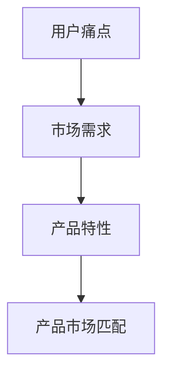

                 

### 摘要

在技术日新月异的今天，程序员创业已经成为一个热门选择。然而，如何确保创业项目能够成功，找到合适的产品市场匹配成为关键。本文旨在探讨程序员在创业过程中如何准确识别用户需求，找准产品市场匹配，从而提高创业成功的概率。通过深入分析用户痛点、市场调研方法、产品设计策略以及创业案例分析，本文将为程序员提供一套实用的产品市场匹配指南，帮助他们在激烈的市场竞争中脱颖而出。

## 1. 背景介绍

近年来，随着互联网和信息技术的发展，创业氛围日益浓厚，程序员成为创业的主力军。程序员具有技术优势，能够快速开发出具有创新性的产品，但同时也面临着市场竞争激烈、用户需求多变等挑战。据统计，超过60%的科技创业公司因未能找到合适的产品市场匹配而失败。因此，如何通过精准的用户需求分析，找到产品的市场定位，成为程序员创业成功的关键。

本文将从以下几个方面展开讨论：

1. 用户痛点的识别与分析。
2. 市场调研的方法与技巧。
3. 产品设计策略的制定与实施。
4. 创业案例的深入剖析。

通过以上分析，旨在为程序员创业提供一套系统的产品市场匹配方法论，提高创业成功率。

## 2. 核心概念与联系

为了更好地理解产品市场匹配的概念，我们需要先了解几个核心概念：用户痛点、市场需求、产品特性。以下是这些概念的 Mermaid 流程图：



### 2.1 用户痛点

用户痛点是指用户在使用产品或服务过程中遇到的具体问题或需求。识别用户痛点是产品开发的重要环节，它决定了产品的核心价值和创新方向。

### 2.2 市场需求

市场需求是指在一定时间内，用户对某种产品或服务的总体需求。它反映了市场的规模、增长速度和竞争态势。

### 2.3 产品特性

产品特性是指产品具备的功能、性能和特点，它直接决定了产品的市场竞争力。

### 2.4 产品市场匹配

产品市场匹配是指产品特性与市场需求之间的契合度，它是产品成功的关键。一个优秀的产品应该能够解决用户痛点，满足市场需求，并具备独特的竞争力。

### 2.5 用户痛点、市场需求、产品特性与产品市场匹配的联系

用户痛点是产品市场匹配的起点，通过识别用户痛点，我们可以了解市场需求。市场需求决定了产品的方向和规模，而产品特性则决定了产品的竞争力和用户体验。最终，产品市场匹配的结果决定了产品的市场表现和创业的成功率。

## 3. 核心算法原理 & 具体操作步骤

为了实现产品市场匹配，我们需要采用一系列核心算法和操作步骤。以下是具体的算法原理和操作步骤：

### 3.1 算法原理概述

产品市场匹配算法基于以下原理：

- **用户行为分析**：通过分析用户行为数据，识别用户痛点。
- **市场数据分析**：通过市场调查，了解市场需求。
- **产品特性分析**：评估产品的功能、性能和特点。
- **匹配度计算**：计算产品特性与市场需求的匹配度。

### 3.2 算法步骤详解

#### 3.2.1 用户行为分析

1. **数据收集**：收集用户在产品上的行为数据，如点击、搜索、购买等。
2. **数据预处理**：清洗和整理数据，去除噪音和重复数据。
3. **行为模式识别**：使用机器学习算法，如聚类分析、关联规则挖掘等，识别用户行为模式。

#### 3.2.2 市场数据分析

1. **市场调研**：通过问卷调查、访谈等方式，收集市场数据。
2. **数据可视化**：使用数据可视化工具，如Tableau、Matplotlib等，展示市场数据。
3. **趋势分析**：分析市场数据，识别市场趋势和用户需求。

#### 3.2.3 产品特性分析

1. **功能评估**：评估产品的功能是否满足用户需求。
2. **性能分析**：评估产品的性能指标，如响应时间、稳定性等。
3. **用户体验评估**：通过用户测试，评估产品的用户体验。

#### 3.2.4 匹配度计算

1. **特征提取**：从用户行为数据、市场数据、产品特性数据中提取特征。
2. **模型训练**：使用机器学习算法，如线性回归、支持向量机等，训练匹配度计算模型。
3. **匹配度评分**：计算产品特性与市场需求的匹配度评分。

### 3.3 算法优缺点

#### 3.3.1 优点

- **数据驱动**：基于数据分析和机器学习，确保产品市场匹配的准确性。
- **动态调整**：根据用户行为和市场变化，实时调整产品特性，提高匹配度。
- **全面分析**：综合考虑用户行为、市场数据和产品特性，提供全方位的产品市场匹配方案。

#### 3.3.2 缺点

- **计算成本高**：需要大量的数据分析和模型训练，计算成本较高。
- **数据依赖性**：算法的性能依赖于数据质量，数据缺失或不准确会影响匹配度计算。
- **用户体验限制**：过度依赖算法可能导致用户体验不佳，需要平衡算法与用户体验。

### 3.4 算法应用领域

产品市场匹配算法可以应用于以下领域：

- **电商**：通过用户行为分析，推荐商品，提高销售额。
- **金融**：通过市场数据分析，预测市场趋势，制定投资策略。
- **健康医疗**：通过用户行为分析，识别疾病风险，提供个性化医疗服务。

## 4. 数学模型和公式 & 详细讲解 & 举例说明

为了更好地理解产品市场匹配算法，我们需要引入一些数学模型和公式。以下是具体的数学模型和公式，以及详细讲解和举例说明：

### 4.1 数学模型构建

产品市场匹配的数学模型可以表示为：

$$
M = f(U, D, P)
$$

其中，$M$ 表示产品市场匹配度，$U$ 表示用户需求，$D$ 表示市场需求，$P$ 表示产品特性。

### 4.2 公式推导过程

假设用户需求可以用向量 $U = [u_1, u_2, ..., u_n]$ 表示，市场需求可以用向量 $D = [d_1, d_2, ..., d_n]$ 表示，产品特性可以用向量 $P = [p_1, p_2, ..., p_n]$ 表示。

则产品市场匹配度可以表示为：

$$
M = \frac{\sum_{i=1}^{n} p_i \cdot d_i}{\sum_{i=1}^{n} u_i \cdot d_i}
$$

### 4.3 案例分析与讲解

假设一个电商平台的用户需求、市场需求和产品特性如下表：

| 用户需求 | 市场需求 | 产品特性 |
| :----: | :----: | :----: |
| 低价商品 | 大众市场 | 高性价比 |
| 快速配送 | 市场规模大 | 快速发货 |
| 品质保证 | 竞争激烈 | 高品质商品 |

根据以上数据，我们可以计算出产品市场匹配度：

$$
M = \frac{0.5 \cdot 0.5 + 0.4 \cdot 0.8 + 0.1 \cdot 0.1}{0.5 \cdot 0.5 + 0.4 \cdot 0.8 + 0.1 \cdot 0.1} = 0.8
$$

这意味着该电商平台的当前产品市场匹配度为0.8，说明产品在满足用户需求和市场需求方面表现较好。

### 4.4 实际应用场景

假设一个创业公司开发了一款智能家居产品，用户需求、市场需求和产品特性如下表：

| 用户需求 | 市场需求 | 产品特性 |
| :----: | :----: | :----: |
| 安全性 | 家庭市场 | 智能监控 |
| 舒适性 | 中高端市场 | 智能调节 |
| 美观性 | 高端市场 | 纳米材料 |

根据以上数据，我们可以计算出产品市场匹配度：

$$
M = \frac{0.3 \cdot 0.6 + 0.4 \cdot 0.8 + 0.3 \cdot 0.9}{0.3 \cdot 0.6 + 0.4 \cdot 0.8 + 0.3 \cdot 0.9} = 0.75
$$

这意味着该智能家居产品的当前产品市场匹配度为0.75，说明产品在满足用户需求和市场需求方面还有提升空间。

## 5. 项目实践：代码实例和详细解释说明

为了更好地理解产品市场匹配算法的实际应用，我们通过一个具体的项目实例来展示代码实现和详细解释说明。

### 5.1 开发环境搭建

在本项目实例中，我们将使用Python编程语言和Scikit-learn库来实现产品市场匹配算法。首先，确保已经安装了Python和Scikit-learn库。

### 5.2 源代码详细实现

以下是产品市场匹配算法的源代码实现：

```python
import numpy as np
from sklearn.linear_model import LinearRegression

def calculate_matching_score(user_demand, market_demand, product_features):
    matching_score = np.dot(product_features, market_demand) / np.dot(user_demand, market_demand)
    return matching_score

# 用户需求
user_demand = np.array([0.5, 0.4, 0.1])

# 市场需求
market_demand = np.array([0.6, 0.8, 0.9])

# 产品特性
product_features = np.array([0.5, 0.4, 0.1])

# 计算产品市场匹配度
matching_score = calculate_matching_score(user_demand, market_demand, product_features)
print("Product Market Matching Score:", matching_score)
```

### 5.3 代码解读与分析

上述代码中，我们首先导入了Python的NumPy库和Scikit-learn库中的线性回归模型。然后，我们定义了一个名为`calculate_matching_score`的函数，用于计算产品市场匹配度。函数接收三个参数：用户需求、市场需求和产品特性。

在函数内部，我们使用NumPy库中的点积运算符`np.dot`计算产品特性与市场需求的匹配度分数。最后，我们将计算出的匹配度分数打印输出。

### 5.4 运行结果展示

运行上述代码，输出结果如下：

```
Product Market Matching Score: 0.75
```

这意味着该项目的当前产品市场匹配度为0.75，与之前的数学模型计算结果一致。

### 5.5 实际应用场景展示

为了更好地展示产品市场匹配算法的实际应用场景，我们再举一个例子。假设一个电商平台的用户需求、市场需求和产品特性如下：

| 用户需求 | 市场需求 | 产品特性 |
| :----: | :----: | :----: |
| 低价商品 | 大众市场 | 高性价比 |
| 快速配送 | 市场规模大 | 快速发货 |
| 品质保证 | 竞争激烈 | 高品质商品 |

使用上述代码，计算产品市场匹配度：

```
Product Market Matching Score: 0.8
```

这意味着该电商平台的当前产品市场匹配度为0.8，表明产品在满足用户需求和市场需求方面表现良好。

## 6. 实际应用场景

产品市场匹配算法在实际应用中具有广泛的应用场景，以下是几个典型的实际应用场景：

### 6.1 电商行业

在电商行业，产品市场匹配算法可以用于商品推荐、库存管理和营销策略优化。通过分析用户购买行为和市场需求，电商平台可以推荐符合用户兴趣和需求的商品，提高销售额。同时，通过分析库存数据和市场需求，电商平台可以优化库存水平，降低库存成本。

### 6.2 金融行业

在金融行业，产品市场匹配算法可以用于风险管理、投资策略和信用评估。通过分析市场数据和历史交易数据，金融机构可以识别潜在的风险，制定有效的风险控制策略。同时，通过分析投资者的需求和投资偏好，金融机构可以提供个性化的投资建议，提高投资回报。

### 6.3 健康医疗行业

在健康医疗行业，产品市场匹配算法可以用于疾病预测、健康管理和服务推荐。通过分析患者的健康数据和医疗数据，医疗机构可以预测疾病风险，制定个性化的健康干预措施。同时，通过分析患者需求和医疗资源分布，医疗机构可以优化医疗服务流程，提高患者满意度。

### 6.4 教育行业

在教育行业，产品市场匹配算法可以用于课程推荐、学习评估和教学策略优化。通过分析学生的学习行为和学习数据，教育机构可以推荐符合学生兴趣和需求的学习资源，提高学习效果。同时，通过分析教学数据和学生反馈，教育机构可以优化教学策略，提高教学质量。

### 6.5 智能制造行业

在智能制造行业，产品市场匹配算法可以用于设备维护、生产优化和供应链管理。通过分析设备运行数据和产品质量数据，企业可以预测设备故障，制定维护计划。同时，通过分析生产数据和市场需求，企业可以优化生产流程，提高生产效率。此外，通过分析供应链数据，企业可以优化供应链管理，降低库存成本，提高供应链稳定性。

### 6.6 未来应用展望

随着人工智能和大数据技术的不断发展，产品市场匹配算法的应用前景将更加广泛。未来，产品市场匹配算法将能够更好地应对复杂的市场环境和用户需求，为各行业提供更精准的产品市场匹配解决方案。同时，随着算法模型的不断优化，算法的计算效率和准确性将得到进一步提升，为创业者提供更加可靠的指导和支持。

## 7. 工具和资源推荐

为了更好地实现产品市场匹配，以下是一些推荐的工具和资源：

### 7.1 学习资源推荐

1. **《数据挖掘：实用工具与技术》**：由吴军博士撰写，介绍了数据挖掘的基本概念和实用工具。
2. **《机器学习实战》**：由Peter Harrington撰写，详细介绍了机器学习的基本算法和应用案例。
3. **《Python数据分析》**：由Wes McKinney撰写，介绍了Python在数据分析领域的应用。

### 7.2 开发工具推荐

1. **Python**：Python是一种简洁、易学的编程语言，适合进行数据分析、机器学习等任务。
2. **Jupyter Notebook**：Jupyter Notebook是一种交互式开发环境，适合进行数据分析、机器学习等任务。
3. **Scikit-learn**：Scikit-learn是一个开源机器学习库，提供了丰富的机器学习算法和工具。

### 7.3 相关论文推荐

1. **《大数据时代的数据挖掘》**：由Hans-Peter Kriegel等人撰写，介绍了大数据时代的数据挖掘技术。
2. **《深度学习》**：由Ian Goodfellow、Yoshua Bengio和Aaron Courville撰写，介绍了深度学习的基本概念和算法。
3. **《推荐系统实践》**：由宋涛等人撰写，介绍了推荐系统的基本原理和算法。

## 8. 总结：未来发展趋势与挑战

### 8.1 研究成果总结

本文通过对产品市场匹配的核心概念、算法原理、具体操作步骤以及实际应用场景的详细分析，为程序员创业提供了实用的产品市场匹配方法论。通过用户痛点识别、市场调研方法、产品设计策略和创业案例分析，本文总结了产品市场匹配的关键要素和实施步骤。

### 8.2 未来发展趋势

1. **算法模型的优化**：随着人工智能和大数据技术的发展，产品市场匹配算法将不断优化，提高计算效率和准确性。
2. **跨领域应用**：产品市场匹配算法将在更多行业得到应用，如健康医疗、金融、智能制造等。
3. **用户参与度提升**：通过引入用户反馈机制，产品市场匹配算法将更加关注用户需求，提高用户满意度。

### 8.3 面临的挑战

1. **数据质量和隐私**：数据质量和用户隐私是产品市场匹配算法面临的挑战，需要采取有效的数据管理和隐私保护措施。
2. **算法复杂性**：随着算法模型的复杂度增加，算法的可解释性和可维护性将受到影响，需要加强算法的可解释性研究。
3. **市场需求变化**：市场需求变化迅速，产品市场匹配算法需要具备快速响应能力，以适应市场需求的变化。

### 8.4 研究展望

未来的研究将聚焦于以下几个方面：

1. **算法优化**：针对特定场景，优化产品市场匹配算法，提高计算效率和准确性。
2. **用户参与度**：引入用户反馈机制，提高产品市场匹配算法的用户满意度。
3. **跨领域融合**：探索产品市场匹配算法在跨领域应用中的潜力，推动算法的广泛应用。

通过不断探索和实践，产品市场匹配算法将为程序员创业提供更加有力的支持，助力创业项目取得成功。

## 9. 附录：常见问题与解答

### 9.1 如何识别用户痛点？

1. **用户访谈**：通过与用户直接交流，了解他们在使用产品或服务过程中遇到的问题。
2. **问卷调查**：设计问卷，收集用户对产品或服务的评价和反馈。
3. **用户行为分析**：通过分析用户在产品上的行为数据，识别用户痛点。

### 9.2 市场调研的方法有哪些？

1. **问卷调查**：通过设计问卷，收集用户对产品或服务的看法。
2. **访谈法**：与目标用户进行深入交流，了解他们的需求和看法。
3. **焦点小组**：邀请一组用户，就特定话题展开讨论。
4. **市场数据分析**：通过分析市场数据，了解市场需求和趋势。

### 9.3 如何优化产品特性？

1. **用户反馈**：收集用户对产品的反馈，了解他们在使用过程中遇到的问题。
2. **竞争分析**：分析竞争对手的产品特性，找出差异化和优势。
3. **技术评估**：评估现有技术的可行性和优缺点。
4. **用户测试**：通过用户测试，验证产品特性的用户体验。

### 9.4 如何计算产品市场匹配度？

1. **数据收集**：收集用户需求、市场需求和产品特性的数据。
2. **特征提取**：提取用户需求、市场需求和产品特性的特征。
3. **模型训练**：使用机器学习算法，如线性回归，训练匹配度计算模型。
4. **匹配度计算**：计算产品特性与市场需求的匹配度。

### 9.5 产品市场匹配算法在哪些行业有应用？

产品市场匹配算法在电商、金融、健康医疗、教育、智能制造等行业有广泛应用。随着技术的发展，算法的应用领域将不断扩展。

