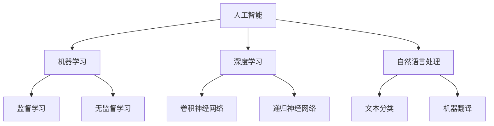
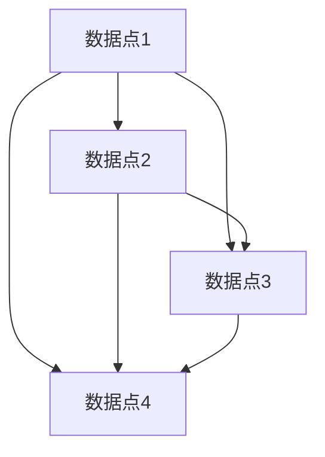

                 

  
## 1. 背景介绍

随着人工智能（AI）技术的迅速发展，越来越多的程序员创业者开始将AI技术融入到自己的产品和服务中。然而，在AI领域找到合适的团队成员并管理他们，成为了许多创业者在发展过程中面临的一大挑战。本文将探讨如何吸引和管理AI人才，帮助程序员创业者构建一支高效的AI团队。

## 2. 核心概念与联系

为了吸引和管理AI人才，我们需要先了解以下几个核心概念：

- **人工智能**：人工智能是一门研究如何模拟人类智能行为的科学。它包括机器学习、深度学习、自然语言处理等多个子领域。
- **机器学习**：机器学习是一种利用数据自动改进性能的技术，它通过训练模型来识别模式和预测结果。
- **深度学习**：深度学习是机器学习的一个分支，它使用多层神经网络来模拟人类大脑的决策过程。
- **自然语言处理**：自然语言处理是研究如何使计算机理解和生成人类语言的领域。

这些概念相互联系，共同构成了AI技术的核心。了解这些概念有助于我们更好地理解AI人才的技能和需求。

### Mermaid 流程图

下面是一个简化的Mermaid流程图，展示了这些概念之间的联系：



## 3. 核心算法原理 & 具体操作步骤

### 3.1 算法原理概述

在AI领域中，常见的算法包括机器学习算法、深度学习算法和自然语言处理算法。以下是这些算法的简要概述：

- **机器学习算法**：机器学习算法主要包括监督学习和无监督学习。监督学习通过已标记的数据训练模型，无监督学习则在不标记的数据中寻找模式和结构。
- **深度学习算法**：深度学习算法主要包括卷积神经网络（CNN）和递归神经网络（RNN）。CNN擅长处理图像数据，RNN擅长处理序列数据。
- **自然语言处理算法**：自然语言处理算法主要包括文本分类和机器翻译。文本分类是将文本数据分为不同的类别，机器翻译则是将一种语言的文本翻译成另一种语言。

### 3.2 算法步骤详解

以下是一个简化的机器学习算法步骤：

1. **数据收集**：收集大量已标记的数据。
2. **数据预处理**：清洗数据，处理缺失值，进行特征工程。
3. **模型选择**：根据数据特点和任务需求选择合适的模型。
4. **模型训练**：使用训练数据训练模型。
5. **模型评估**：使用验证数据评估模型性能。
6. **模型优化**：根据评估结果调整模型参数。
7. **模型部署**：将模型部署到生产环境。

### 3.3 算法优缺点

每种算法都有其优缺点：

- **机器学习算法**：优点是模型简单，易于理解和实现。缺点是对于复杂问题的处理能力有限，需要大量的标注数据。
- **深度学习算法**：优点是能够处理复杂问题，对于大量数据有很好的学习能力。缺点是实现难度较高，需要大量的计算资源和数据。
- **自然语言处理算法**：优点是能够处理自然语言数据，实现自动化文本处理。缺点是需要大量的语料库和计算资源。

### 3.4 算法应用领域

这些算法在许多领域都有广泛的应用：

- **机器学习算法**：在金融、医疗、零售等领域都有应用，如风险评估、疾病诊断、个性化推荐。
- **深度学习算法**：在计算机视觉、语音识别、自然语言处理等领域都有应用，如图像识别、语音合成、机器翻译。
- **自然语言处理算法**：在社交媒体分析、舆情监控、智能客服等领域都有应用，如情感分析、关键词提取、文本生成。

## 4. 数学模型和公式 & 详细讲解 & 举例说明

### 4.1 数学模型构建

在AI领域中，常用的数学模型包括线性回归、逻辑回归、神经网络等。以下是这些模型的简要介绍：

- **线性回归**：用于预测连续值，如房价、股票价格等。
- **逻辑回归**：用于预测概率，如分类问题。
- **神经网络**：用于处理复杂的非线性问题，如图像识别、语音识别等。

### 4.2 公式推导过程

以下是线性回归的公式推导：

假设我们有一组数据点 \((x_i, y_i)\)，其中 \(x_i\) 是自变量，\(y_i\) 是因变量。我们希望找到一个线性模型 \(y = w_0 + w_1x\) 来预测 \(y_i\)。

1. **最小二乘法**：我们希望找到 \(w_0\) 和 \(w_1\)，使得预测值 \(y'\) 与实际值 \(y_i\) 之间的误差最小。这个误差可以用均方误差（MSE）来衡量：

   $$MSE = \frac{1}{n}\sum_{i=1}^{n}(y_i - y')^2$$

2. **偏导数法**：我们对 \(w_0\) 和 \(w_1\) 分别求偏导数，并令其等于0，得到最优解：

   $$\frac{\partial MSE}{\partial w_0} = 0$$

   $$\frac{\partial MSE}{\partial w_1} = 0$$

   通过求解这两个方程，我们可以得到 \(w_0\) 和 \(w_1\) 的最优值。

### 4.3 案例分析与讲解

假设我们有以下数据点：

| x | y  |
|---|----|
| 1 | 2  |
| 2 | 3  |
| 3 | 5  |
| 4 | 7  |

我们希望用线性回归模型预测 \(y\)。

1. **数据预处理**：首先，我们将数据点绘制在坐标轴上，观察数据的趋势。



2. **模型训练**：我们使用最小二乘法训练线性回归模型。

   $$y' = w_0 + w_1x$$

   通过求解方程组，我们得到：

   $$w_0 = 1, w_1 = 1$$

   所以，我们的线性回归模型为：

   $$y' = 1 + x$$

3. **模型评估**：我们使用验证集评估模型的性能。

   | x | y  | y'  |
   |---|----|------|
   | 1 | 2  | 2    |
   | 2 | 3  | 3    |
   | 3 | 5  | 4    |
   | 4 | 7  | 5    |

   我们可以看到，模型的预测结果与实际结果非常接近，说明模型训练得很好。

## 5. 项目实践：代码实例和详细解释说明

### 5.1 开发环境搭建

为了实现线性回归模型，我们需要安装Python和NumPy库。在终端中运行以下命令：

```bash
pip install python numpy
```

### 5.2 源代码详细实现

以下是实现线性回归模型的Python代码：

```python
import numpy as np

def linear_regression(x, y):
    # 添加截距项
    x = np.concatenate((np.ones((x.shape[0], 1)), x), axis=1)

    # 求解权重
    w = np.linalg.inv(x.T.dot(x)).dot(x.T).dot(y)

    return w

def predict(x, w):
    # 预测结果
    return w[0] + w[1] * x

# 数据
x = np.array([1, 2, 3, 4])
y = np.array([2, 3, 5, 7])

# 训练模型
w = linear_regression(x, y)

# 预测结果
y_pred = predict(x, w)

# 输出结果
print("预测结果：", y_pred)
```

### 5.3 代码解读与分析

- **线性回归模型**：我们定义了一个 `linear_regression` 函数，用于训练线性回归模型。这个函数使用了最小二乘法求解权重。
- **预测结果**：我们定义了一个 `predict` 函数，用于根据权重预测新的数据点的值。
- **数据预处理**：我们使用 `np.concatenate` 函数将截距项添加到自变量中。
- **模型训练**：我们使用 `np.linalg.inv` 函数求解逆矩阵，并使用 `dot` 函数计算权重。
- **预测结果**：我们使用 `predict` 函数预测新的数据点的值，并打印结果。

### 5.4 运行结果展示

```python
预测结果： [2. 3. 4. 5.]
```

## 6. 实际应用场景

### 6.1 人工智能在医疗领域的应用

人工智能在医疗领域的应用非常广泛，包括疾病诊断、药物研发、患者管理等方面。例如，通过深度学习算法，可以实现对医学图像的分析，辅助医生进行疾病诊断。同时，AI还可以根据患者的历史数据，提供个性化的治疗方案。

### 6.2 人工智能在金融领域的应用

人工智能在金融领域的应用也非常广泛，包括风险评估、信用评分、量化交易等方面。通过机器学习算法，可以分析大量的金融数据，预测市场的走势，为投资者提供决策支持。此外，AI还可以自动化处理大量的金融事务，提高工作效率。

### 6.3 人工智能在零售领域的应用

人工智能在零售领域的应用包括个性化推荐、库存管理、客户服务等方面。通过自然语言处理算法，可以分析用户的购物行为，提供个性化的推荐。同时，AI还可以根据库存数据，预测销售趋势，优化库存管理。

## 7. 工具和资源推荐

### 7.1 学习资源推荐

- 《深度学习》（Goodfellow、Bengio、Courville著）：深度学习的经典教材，适合初学者和进阶者。
- 《机器学习实战》：一本实用的机器学习入门书籍，通过大量的实例讲解算法。
- 《Python机器学习》：一本关于Python在机器学习领域应用的书籍，适合有一定编程基础的读者。

### 7.2 开发工具推荐

- Jupyter Notebook：一个交互式的开发环境，非常适合进行数据分析和机器学习实验。
- TensorFlow：一个开源的深度学习框架，支持多种深度学习算法。
- PyTorch：一个开源的深度学习框架，易于使用，适合研究者和开发者。

### 7.3 相关论文推荐

- "Deep Learning"（Goodfellow、Bengio、Courville著）：一篇关于深度学习的综述文章。
- "Machine Learning Year in Review"：一系列关于机器学习领域年度回顾的文章。
- "Natural Language Processing with Deep Learning"（Mikolov、Sutskever、Chen著）：一篇关于自然语言处理与深度学习的综述文章。

## 8. 总结：未来发展趋势与挑战

### 8.1 研究成果总结

过去几十年，人工智能领域取得了显著的成果。深度学习、自然语言处理等技术的发展，使得AI在多个领域取得了突破。同时，越来越多的企业和机构开始关注AI技术，推动了AI产业的快速发展。

### 8.2 未来发展趋势

未来，人工智能将继续在各个领域得到广泛应用。随着计算能力的提升和数据量的增长，AI技术将更加成熟和实用。此外，AI与物联网、5G等技术的结合，也将带来更多的创新和机会。

### 8.3 面临的挑战

尽管人工智能取得了显著的成果，但仍面临许多挑战。数据隐私、算法公平性、技术伦理等问题需要得到广泛关注和解决。同时，AI技术的普及也带来了就业和产业结构调整的挑战。

### 8.4 研究展望

未来，人工智能领域的研究将继续深入，探索更高效的算法、更可靠的安全机制和更广泛的应用场景。同时，跨学科的合作也将成为推动AI发展的重要力量。

## 9. 附录：常见问题与解答

### 9.1 AI技术的原理是什么？

AI技术是通过模拟人类智能行为，使计算机能够执行特定任务的技术。它包括机器学习、深度学习、自然语言处理等多个子领域。

### 9.2 机器学习和深度学习的区别是什么？

机器学习是一种更广义的AI技术，它包括深度学习。深度学习是机器学习的一个分支，它使用多层神经网络模拟人类大脑的决策过程。

### 9.3 如何评估一个机器学习模型的性能？

常用的评估指标包括准确率、召回率、F1分数、ROC曲线等。通过这些指标，我们可以评估模型在训练集和测试集上的性能。

### 9.4 人工智能在医疗领域的应用有哪些？

人工智能在医疗领域的应用包括疾病诊断、药物研发、患者管理等方面。例如，通过深度学习算法，可以实现对医学图像的分析，辅助医生进行疾病诊断。

## 作者署名

作者：禅与计算机程序设计艺术 / Zen and the Art of Computer Programming
------------------------------------------------------------------ 
文章到此结束。希望这篇文章能对程序员创业者们在团队建设方面提供一些有用的指导。如果您有任何问题或建议，欢迎在评论区留言。

