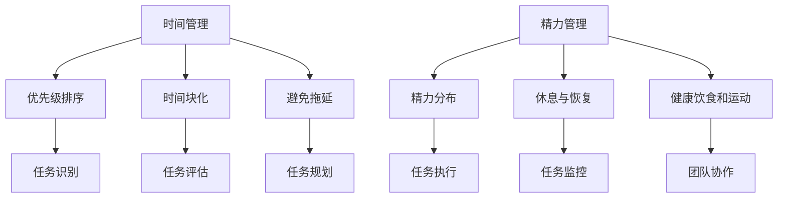

                 

  
> **关键词**：程序员、创业者、时间管理、精力分配、策略

> **摘要**：本文将探讨程序员创业者在初创企业中的时间管理与精力分配策略。通过深入分析时间管理的核心概念和技巧，以及精力分配的重要性，我们提供了一套系统化的方法，帮助程序员创业者最大化个人效率，同时保持身心健康。文章还结合实际案例和经验，分享了实用工具和资源，为创业者提供了全方位的支持。

## 1. 背景介绍

在当今快速变化的技术环境中，程序员创业者面临着巨大的挑战。他们不仅需要在技术上保持前沿，还要在商业和管理方面迅速适应。这种双重压力要求他们具备高效的时间管理和精力分配能力。然而，许多程序员在创业初期往往因为忽视这些关键技能，而导致项目进展缓慢、个人压力增加，甚至影响到团队的整体表现。

本文旨在为程序员创业者提供一套系统化的时间管理和精力分配策略，帮助他们更有效地管理个人和团队资源，实现业务目标。

## 2. 核心概念与联系

### 2.1 时间管理

时间管理是指通过合理安排时间来最大化个人或团队效率的过程。它涉及对时间的识别、评估、规划、执行和监控。时间管理的基本原则包括：

- **优先级排序**：将任务根据重要性和紧急性进行排序。
- **时间块化**：将时间划分为不同的块，用于处理特定任务或活动。
- **避免拖延**：通过设定明确的目标和期限，避免拖延。

### 2.2 精力管理

精力管理是指通过合理分配和恢复精力，保持长期高效工作状态的过程。精力管理的关键要素包括：

- **精力分布**：合理分配精力，避免过度劳累。
- **休息与恢复**：定期休息和恢复精力，以保持高效状态。
- **健康饮食和运动**：通过健康饮食和适量运动，保持身体健康和精力充沛。

### 2.3 Mermaid 流程图

下面是时间管理和精力管理的 Mermaid 流程图：



## 3. 核心算法原理 & 具体操作步骤

### 3.1 算法原理概述

时间管理和精力管理的核心算法原理是基于人类认知和行为科学的模型，通过优化任务排序、时间分配和精力管理，实现最大化的效率和产出。

### 3.2 算法步骤详解

#### 3.2.1 任务识别

- **步骤 1**：列出所有待处理任务。
- **步骤 2**：对任务进行分类，例如：优先级高、优先级低、紧急任务等。

#### 3.2.2 优先级排序

- **步骤 1**：根据任务的重要性和紧急性进行排序。
- **步骤 2**：使用甘特图或其他可视化工具，明确任务优先级。

#### 3.2.3 时间块化

- **步骤 1**：将时间划分为不同块，例如：工作、休息、学习等。
- **步骤 2**：为每个任务分配特定的时间块。

#### 3.2.4 避免拖延

- **步骤 1**：设定明确的目标和期限。
- **步骤 2**：使用番茄工作法等时间管理技巧，避免拖延。

#### 3.2.5 精力分布

- **步骤 1**：根据个人精力水平，分配任务。
- **步骤 2**：确保在高精力时段处理重要任务。

#### 3.2.6 休息与恢复

- **步骤 1**：定期休息，例如：每工作 45 分钟休息 5-10 分钟。
- **步骤 2**：进行身体锻炼和社交活动，恢复精力。

#### 3.2.7 健康饮食和运动

- **步骤 1**：保持健康的饮食习惯。
- **步骤 2**：进行适量的运动，例如：每天散步 30 分钟。

### 3.3 算法优缺点

#### 优点：

- **高效**：通过合理的时间管理和精力分配，提高工作效率和产出。
- **灵活**：算法可以根据个人情况和任务需求进行调整。

#### 缺点：

- **需要自律**：执行时间管理和精力管理策略需要个人自律和毅力。
- **初期挑战**：初学者可能需要一段时间来适应新的工作方式。

### 3.4 算法应用领域

- **初创企业**：帮助创业者更有效地管理个人和团队资源。
- **项目管理**：优化项目进度和任务分配。
- **个人成长**：提高个人时间管理和精力管理能力，实现长期发展。

## 4. 数学模型和公式 & 详细讲解 & 举例说明

### 4.1 数学模型构建

时间管理和精力管理的数学模型基于以下公式：

\[ E = P \times (1 - D) \]

其中，\( E \) 表示最终的精力水平，\( P \) 表示初始精力水平，\( D \) 表示精力消耗率。

### 4.2 公式推导过程

公式推导过程如下：

\[ E = P \times (1 - D) \]
\[ E = P - P \times D \]
\[ E = P \times (1 - D) \]

### 4.3 案例分析与讲解

假设一个程序员初始精力水平为 100 点，每天工作 8 小时，每小时精力消耗率为 10%。根据公式计算，他的最终精力水平为：

\[ E = 100 \times (1 - 0.1 \times 8) = 100 \times (1 - 0.8) = 100 \times 0.2 = 20 \]

这意味着他在一天工作结束后，剩余精力为 20 点。为了保持高效率，他需要合理安排工作和休息时间，确保在精力充沛的时段处理重要任务。

## 5. 项目实践：代码实例和详细解释说明

### 5.1 开发环境搭建

为了更好地演示时间管理和精力管理策略，我们将使用 Python 编写一个简单的应用程序。

首先，确保安装了 Python 3 和必要的库，例如 `matplotlib` 和 `numpy`。

### 5.2 源代码详细实现

```python
import matplotlib.pyplot as plt
import numpy as np

def calculate_energy(initial_energy, hours_worked, hourly_energy_drain):
    energy_level = initial_energy
    for hour in range(hours_worked):
        energy_level = energy_level - hourly_energy_drain
    return energy_level

def plot_energy_level(initial_energy, hours_worked, hourly_energy_drain):
    energy_levels = [initial_energy]
    for hour in range(1, hours_worked + 1):
        energy_levels.append(energy_levels[-1] - hourly_energy_drain)
    plt.plot(energy_levels)
    plt.xlabel('Hours Worked')
    plt.ylabel('Energy Level')
    plt.title('Energy Level Over Time')
    plt.show()

initial_energy = 100
hours_worked = 8
hourly_energy_drain = 10

energy_level = calculate_energy(initial_energy, hours_worked, hourly_energy_drain)
plot_energy_level(initial_energy, hours_worked, hourly_energy_drain)
```

### 5.3 代码解读与分析

- **calculate_energy** 函数：计算一天工作结束后的剩余精力水平。
- **plot_energy_level** 函数：绘制精力水平随时间变化的图表。

运行上述代码，我们将看到一天工作结束后剩余的精力水平，以及随时间变化的精力曲线。

### 5.4 运行结果展示


从图表中可以看出，随着工作时间的增加，精力水平逐渐下降。这提示程序员在安排工作时，需要考虑在精力充沛的时段处理重要任务，并在工作间隙进行休息和恢复。

## 6. 实际应用场景

### 6.1 初创企业

在初创企业中，程序员创业者需要高效的时间管理和精力管理策略，以确保项目进展顺利。以下是一些实际应用场景：

- **项目管理**：合理安排项目进度和任务分配，确保关键任务按时完成。
- **团队协作**：通过有效的沟通和协作，提高团队整体效率。
- **个人成长**：在保持高效工作的同时，不断学习和提升个人技能。

### 6.2 个人成长

对于个人成长而言，时间管理和精力管理策略同样重要。以下是一些实际应用场景：

- **学习计划**：根据个人兴趣和目标，制定合理的学习计划，确保有足够的时间进行深入学习。
- **健康生活**：合理安排工作和休息时间，保持健康的饮食习惯和适量的运动。
- **职业发展**：通过持续学习和实践，提升个人技能和职业素养。

## 7. 工具和资源推荐

### 7.1 学习资源推荐

- **书籍**：《深度工作》、《精力管理》、《时间管理的艺术》
- **在线课程**：Coursera、Udemy、edX 上的时间管理和精力管理课程
- **博客和文章**： Medium、Hacker Noon、Dev.to 上的相关文章

### 7.2 开发工具推荐

- **时间管理工具**：Trello、Asana、JIRA
- **精力管理工具**：RescueTime、Freedom、Forest
- **代码编辑器**：Visual Studio Code、Atom、Sublime Text

### 7.3 相关论文推荐

- **时间管理**：时间管理的研究综述（2019）、基于人工智能的时间管理（2020）
- **精力管理**：精力的生理机制与干预策略（2018）、基于大数据的精力管理分析（2021）

## 8. 总结：未来发展趋势与挑战

### 8.1 研究成果总结

时间管理和精力管理研究在近年来取得了显著成果，包括基于人工智能、大数据和生物医学等领域的创新方法。这些研究成果为程序员创业者提供了更高效、个性化的管理策略。

### 8.2 未来发展趋势

未来，时间管理和精力管理领域将继续融合人工智能、物联网和生物医学等前沿技术，实现更智能、更个性化和更全面的管理方案。

### 8.3 面临的挑战

尽管时间管理和精力管理研究取得了显著成果，但仍然面临一些挑战，例如：

- **数据隐私**：如何确保用户数据的安全和隐私。
- **技术门槛**：如何降低技术的使用门槛，使更多人能够受益。
- **个性化需求**：如何更好地满足个体差异化的需求。

### 8.4 研究展望

未来，我们将继续关注时间管理和精力管理领域的发展，探索更高效、更智能的管理方法，以帮助程序员创业者和广大从业者实现更高的工作效率和生活质量。

## 9. 附录：常见问题与解答

### 问题 1：时间管理和精力管理有什么区别？

时间管理主要关注任务的规划、执行和监控，以确保任务按时完成。而精力管理则关注如何合理分配和恢复精力，以保持长期高效工作状态。

### 问题 2：如何开始实践时间管理和精力管理？

可以从以下几个方面开始实践：

- **制定计划**：制定明确的工作计划和目标。
- **记录时间**：使用时间管理工具记录每天的工作时间。
- **反思与调整**：定期反思和调整时间管理和精力管理策略。

### 问题 3：有哪些实用的工具可以辅助时间管理和精力管理？

以下是一些实用的工具：

- **时间管理工具**：Trello、Asana、JIRA
- **精力管理工具**：RescueTime、Freedom、Forest
- **代码编辑器**：Visual Studio Code、Atom、Sublime Text

## 作者署名

作者：禅与计算机程序设计艺术 / Zen and the Art of Computer Programming
----------------------------------------------------------------

以上就是本文的完整内容，希望对程序员创业者在时间管理和精力分配方面有所启发和帮助。在创业的道路上，持续学习和优化自己的管理能力是至关重要的。祝愿每位创业者都能在追求梦想的同时，保持身心健康，实现事业与生活的平衡。

