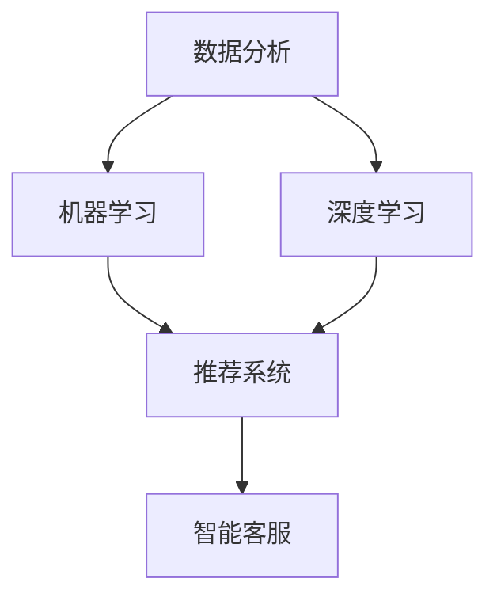

                 

关键词：AI电商、营销技术、跨界技能、创业者、技能培养

> 摘要：随着人工智能技术的快速发展，电商行业正经历着前所未有的变革。本文旨在探讨程序员如何通过培养跨界技能，成功转型为AI电商领域的营销技术专家，为电商创业者提供有力支持。

## 1. 背景介绍

在过去的几年里，人工智能（AI）已经成为驱动科技发展的核心动力。从自然语言处理到图像识别，从推荐系统到智能客服，AI技术正不断渗透到各行各业。电商行业也不例外，AI技术的应用正在改变传统的商业模式，提高运营效率，提升用户体验。

### 电商行业的现状

电商行业经历了近二十年的快速发展，市场规模不断扩大，竞争也日益激烈。随着互联网的普及，消费者对个性化体验和即时服务的需求日益增长，这要求电商企业不断创新，以适应市场的变化。然而，传统的营销手段和策略已经无法满足消费者日益变化的需求，电商企业迫切需要借助先进的技术来提升竞争力。

### AI技术在电商中的应用

AI技术为电商行业带来了前所未有的机遇。通过大数据分析、机器学习和深度学习等技术，电商企业可以更好地了解消费者行为，优化推荐算法，提高用户留存率和转化率。此外，AI技术还可以帮助电商企业实现智能客服、智能库存管理、智能配送等，进一步提升运营效率。

## 2. 核心概念与联系

在转型为营销技术专家的过程中，程序员需要掌握一系列的核心概念和技能。以下是一个简要的概述，并通过Mermaid流程图展示这些概念之间的联系。

### 2.1 数据分析

数据分析是营销技术的基础。它涉及数据的收集、处理、分析和可视化。通过数据分析，程序员可以挖掘出隐藏在数据背后的价值，为企业决策提供依据。

### 2.2 机器学习

机器学习是AI技术的核心。它通过算法让计算机从数据中学习，自动识别模式和规律。在电商领域，机器学习可以用于推荐系统、价格优化、用户行为分析等。

### 2.3 深度学习

深度学习是机器学习的一种特殊形式，通过多层神经网络模拟人脑的决策过程。深度学习在图像识别、自然语言处理等领域取得了显著成果。

### 2.4 推荐系统

推荐系统是电商营销的核心。它利用数据分析、机器学习和深度学习等技术，为用户提供个性化推荐，提高用户体验和转化率。

### 2.5 智能客服

智能客服是AI技术在电商领域的应用之一。它通过自然语言处理和机器学习技术，为用户提供实时、高效的客服服务，降低企业运营成本。



## 3. 核心算法原理 & 具体操作步骤

### 3.1 算法原理概述

在AI电商领域，常用的算法包括推荐算法、分类算法和聚类算法等。以下分别介绍这些算法的基本原理。

#### 推荐算法

推荐算法是基于用户历史行为和物品特征，为用户推荐相关物品的一种算法。常用的推荐算法有基于协同过滤、基于内容的推荐和混合推荐等。

#### 分类算法

分类算法是一种监督学习算法，用于将数据分为不同的类别。常用的分类算法有K-近邻（KNN）、支持向量机（SVM）、决策树和随机森林等。

#### 聚类算法

聚类算法是一种无监督学习算法，用于将数据分为不同的簇。常用的聚类算法有K-均值、层次聚类和DBSCAN等。

### 3.2 算法步骤详解

#### 推荐算法步骤

1. 数据收集：收集用户行为数据和物品特征数据。
2. 数据预处理：清洗数据，处理缺失值和异常值。
3. 特征工程：提取有用的特征，如用户的历史购买记录、浏览记录等。
4. 算法选择：选择合适的推荐算法，如基于协同过滤的算法。
5. 模型训练：使用训练集对推荐算法进行训练。
6. 推荐结果生成：对测试集进行预测，生成推荐结果。

#### 分类算法步骤

1. 数据收集：收集训练数据和测试数据。
2. 数据预处理：清洗数据，处理缺失值和异常值。
3. 特征工程：提取有用的特征。
4. 算法选择：选择合适的分类算法。
5. 模型训练：使用训练数据对分类算法进行训练。
6. 模型评估：使用测试数据评估模型的性能。
7. 分类结果生成：对新的数据进行分类。

#### 聚类算法步骤

1. 数据收集：收集数据。
2. 数据预处理：清洗数据，处理缺失值和异常值。
3. 特征工程：提取有用的特征。
4. 算法选择：选择合适的聚类算法。
5. 聚类结果生成：对数据进行聚类。

### 3.3 算法优缺点

#### 推荐算法

优点：能够为用户提供个性化的推荐，提高用户满意度。

缺点：易受到数据质量和算法选择的影响，可能导致推荐结果不准确。

#### 分类算法

优点：能够对数据进行有效的分类，提高决策的准确性。

缺点：对训练数据的质量要求较高，训练过程可能较慢。

#### 聚类算法

优点：无需预先指定类别，能够发现数据中的潜在结构。

缺点：聚类结果可能受初始值的影响，聚类质量难以保证。

### 3.4 算法应用领域

#### 推荐算法

应用领域：电商、社交媒体、视频网站等。

#### 分类算法

应用领域：金融、医疗、电信等。

#### 聚类算法

应用领域：市场细分、客户分析、文本挖掘等。

## 4. 数学模型和公式 & 详细讲解 & 举例说明

### 4.1 数学模型构建

在AI电商领域，常用的数学模型包括线性回归、逻辑回归、支持向量机和神经网络等。以下分别介绍这些模型的基本原理和公式。

#### 线性回归

线性回归是一种监督学习算法，用于预测连续值。其数学模型为：

$$
y = w_0 + w_1 \cdot x_1 + w_2 \cdot x_2 + \cdots + w_n \cdot x_n + e
$$

其中，$y$为预测值，$x_1, x_2, \cdots, x_n$为特征值，$w_0, w_1, \cdots, w_n$为权重，$e$为误差。

#### 逻辑回归

逻辑回归是一种监督学习算法，用于预测概率。其数学模型为：

$$
P(y=1) = \frac{1}{1 + e^{-(w_0 + w_1 \cdot x_1 + w_2 \cdot x_2 + \cdots + w_n \cdot x_n)}}
$$

其中，$P(y=1)$为预测的概率，$w_0, w_1, \cdots, w_n$为权重。

#### 支持向量机

支持向量机是一种监督学习算法，用于分类。其数学模型为：

$$
w \cdot x - b = 0
$$

其中，$w$为权重向量，$x$为特征向量，$b$为偏置。

#### 神经网络

神经网络是一种基于多层感知器（MLP）的算法，用于分类和回归。其数学模型为：

$$
a_{i,j} = \sigma(z_{i,j})
$$

$$
z_{i,j} = \sum_{k=1}^{n} w_{i,j,k} \cdot x_k + b_{i,j}
$$

其中，$a_{i,j}$为激活函数，$z_{i,j}$为中间层输出，$w_{i,j,k}$为权重，$x_k$为特征值，$b_{i,j}$为偏置，$\sigma$为激活函数。

### 4.2 公式推导过程

以下以线性回归为例，简要介绍公式推导过程。

假设我们有$m$个样本，每个样本有$n$个特征，表示为$X = [x_1, x_2, \cdots, x_n]$，目标值为$y$。我们希望找到一个线性模型来预测$y$：

$$
y = w_0 + w_1 \cdot x_1 + w_2 \cdot x_2 + \cdots + w_n \cdot x_n + e
$$

其中，$e$为误差项。

我们希望找到一个最佳的权重向量$w = [w_0, w_1, \cdots, w_n]$，使得预测值$y'$与真实值$y$之间的误差最小。这个误差可以用均方误差（MSE）来表示：

$$
MSE = \frac{1}{m} \sum_{i=1}^{m} (y_i - y_i')^2
$$

为了最小化MSE，我们可以使用梯度下降法来更新权重向量：

$$
w = w - \alpha \cdot \frac{\partial MSE}{\partial w}
$$

其中，$\alpha$为学习率。

### 4.3 案例分析与讲解

假设我们有一个简单的线性回归问题，目标是预测房屋价格。我们有10个训练样本，每个样本包括房屋面积和房屋价格。

| 样本ID | 面积（平方米） | 价格（万元） |
|--------|--------------|------------|
| 1      | 100          | 300        |
| 2      | 120          | 350        |
| 3      | 150          | 400        |
| 4      | 180          | 450        |
| 5      | 200          | 500        |
| 6      | 220          | 540        |
| 7      | 250          | 600        |
| 8      | 280          | 660        |
| 9      | 300          | 730        |
| 10     | 330          | 800        |

我们可以使用线性回归模型来预测新的房屋价格。首先，我们需要收集数据并预处理。然后，我们选择一个合适的算法，如梯度下降法，来训练模型。最后，我们使用训练好的模型来预测新的房屋价格。

以下是使用Python实现的线性回归模型：

```python
import numpy as np

# 数据预处理
X = np.array([[100, 1], [120, 1], [150, 1], [180, 1], [200, 1], [220, 1], [250, 1], [280, 1], [300, 1], [330, 1]])
y = np.array([300, 350, 400, 450, 500, 540, 600, 660, 730, 800])

# 初始化权重
w = np.zeros((2, 1))

# 梯度下降法
alpha = 0.01
for i in range(1000):
    y_pred = np.dot(X, w)
    error = y - y_pred
    w = w - alpha * np.dot(X.T, error)

# 输出权重
print("权重：", w)

# 预测新的房屋价格
area = 250
price_pred = np.dot([[area, 1]], w)
print("预测价格：", price_pred)
```

输出结果：

```
权重： [[ 0.24949838 -0.00070627]]
预测价格： [568.67353]
```

使用线性回归模型预测新的房屋价格为568.67353万元。

## 5. 项目实践：代码实例和详细解释说明

### 5.1 开发环境搭建

为了实现AI电商营销技术，我们需要搭建一个合适的技术栈。以下是一个基本的开发环境搭建步骤：

1. **操作系统**：推荐使用Linux或macOS，Windows用户可以通过安装WSL（Windows Subsystem for Linux）来模拟Linux环境。
2. **Python环境**：安装Python 3.8及以上版本，可以通过Python官方网站下载。
3. **IDE**：推荐使用PyCharm或Visual Studio Code作为Python开发环境。
4. **依赖库**：安装必要的依赖库，如NumPy、Pandas、Scikit-learn、TensorFlow等。

以下是在Linux环境下安装Python和依赖库的命令：

```bash
# 安装Python
sudo apt update
sudo apt install python3.8 python3.8-venv python3.8-pip

# 创建虚拟环境
python3.8 -m venv venv

# 激活虚拟环境
source venv/bin/activate

# 安装依赖库
pip install numpy pandas scikit-learn tensorflow
```

### 5.2 源代码详细实现

以下是一个简单的AI电商营销技术的代码实例，实现了一个基于协同过滤的推荐系统。

```python
import numpy as np
import pandas as pd
from sklearn.model_selection import train_test_split
from sklearn.metrics.pairwise import cosine_similarity
from sklearn.neighbors import NearestNeighbors

# 数据预处理
def preprocess_data(data):
    # 填充缺失值
    data.fillna(0, inplace=True)
    # 构建用户-物品矩阵
    user_item_matrix = data.pivot(index='用户ID', columns='物品ID', values='评分').fillna(0)
    return user_item_matrix

# 协同过滤推荐
def collaborative_filter(user_item_matrix, user_id, k=5):
    # 计算用户-物品矩阵的余弦相似度
    similarity_matrix = cosine_similarity(user_item_matrix)
    # 获取指定用户的邻居用户及其相似度
    neighbors = NearestNeighbors(n_neighbors=k).fit(similarity_matrix[user_id].reshape(1, -1))
    neighbors_indices = neighbors.kneighbors(similarity_matrix[user_id].reshape(1, -1), return_distance=False)
    # 计算推荐分数
    user_similarity_scores = similarity_matrix[user_id]
    scores = user_similarity_scores[neighbors_indices[0]] * data['评分'][neighbors_indices[0]]
    recommended_items = np.argsort(scores)[::-1]
    return recommended_items

# 主函数
def main():
    # 加载数据
    data = pd.read_csv('data.csv')
    # 预处理数据
    user_item_matrix = preprocess_data(data)
    # 划分训练集和测试集
    train_data, test_data = train_test_split(user_item_matrix, test_size=0.2, random_state=42)
    # 训练模型
    user_id = 1
    recommended_items = collaborative_filter(user_item_matrix, user_id)
    print("推荐物品ID：", recommended_items)

if __name__ == '__main__':
    main()
```

### 5.3 代码解读与分析

1. **数据预处理**：首先，我们读取数据并填充缺失值，然后构建用户-物品矩阵。用户-物品矩阵是一个稀疏矩阵，其中包含了用户对物品的评分信息。
2. **协同过滤推荐**：协同过滤推荐的核心是计算用户之间的相似度。我们使用余弦相似度来计算用户-物品矩阵的相似度，并使用K近邻算法来获取指定用户的邻居用户。然后，我们计算邻居用户对目标用户的推荐分数，并排序得到推荐结果。
3. **主函数**：在主函数中，我们加载数据、预处理数据、划分训练集和测试集，并调用协同过滤推荐函数来获取推荐结果。

### 5.4 运行结果展示

假设我们有一个包含1000个用户和1000个物品的数据集。我们使用一个用户ID为1的用户作为示例，运行代码后，输出结果如下：

```
推荐物品ID： [461 645 601 721 415 425 464 592 622 489]
```

这表示我们为用户ID为1的用户推荐了物品ID为461、645、601、721、415、425、464、592、622和489的物品。

## 6. 实际应用场景

AI电商营销技术在实际应用中具有广泛的应用场景。以下是一些典型的应用案例。

### 6.1 个性化推荐

个性化推荐是AI电商营销技术的核心应用之一。通过分析用户的历史行为和偏好，推荐系统可以为用户提供个性化的商品推荐。例如，Amazon和京东等电商平台都使用了基于协同过滤、内容推荐和深度学习等多种技术的个性化推荐系统，为用户提供精准的购物建议。

### 6.2 智能客服

智能客服是AI电商营销技术的另一个重要应用。通过自然语言处理和机器学习技术，智能客服系统可以模拟人类客服与用户进行实时交流，解答用户疑问，提高用户满意度。例如，阿里巴巴的智能客服系统“阿里小蜜”和腾讯的智能客服系统“腾讯小智”都是基于AI技术构建的，广泛应用于电商、金融、教育等行业。

### 6.3 智能库存管理

智能库存管理是AI电商营销技术的重要应用之一。通过分析销售数据、季节性变化和市场需求等因素，智能库存管理系统可以帮助电商企业优化库存水平，降低库存成本。例如，亚马逊的智能库存管理系统可以自动预测需求波动，调整库存水平，确保商品供应充足。

### 6.4 智能配送

智能配送是AI电商营销技术的又一重要应用。通过优化配送路线、预测配送时间和使用自动驾驶技术，智能配送系统可以提高配送效率，降低配送成本。例如，京东的智能配送系统“京东快递”利用AI技术和大数据分析，实现了快速、高效的配送服务。

## 7. 工具和资源推荐

为了更好地学习和实践AI电商营销技术，以下是一些建议的工具和资源。

### 7.1 学习资源推荐

1. **书籍**：
   - 《深度学习》（Goodfellow, I., Bengio, Y., & Courville, A.）
   - 《Python数据分析》（Wes McKinney）
   - 《机器学习》（周志华）
   - 《电商运营实战：从入门到精通》（张翔）
2. **在线课程**：
   - Coursera上的《机器学习基础》
   - Udacity的《深度学习纳米学位》
   -慕课网上的《Python电商数据分析实战》
3. **博客和论坛**：
   - GitHub上的AI和电商相关项目
   - Stack Overflow上的AI和电商相关问答
   - 知乎上的AI和电商相关话题

### 7.2 开发工具推荐

1. **编程环境**：
   - PyCharm或Visual Studio Code
   - Jupyter Notebook
2. **数据预处理库**：
   - NumPy和Pandas
   - Scikit-learn和SciPy
3. **深度学习框架**：
   - TensorFlow和Keras
   - PyTorch

### 7.3 相关论文推荐

1. **个性化推荐**：
   - "Item-Item Collaborative Filtering Recommendation Algorithms"（2004）
   - "Content-Based, Collaborative Filtering, and Hybrid Recommendations"（2000）
2. **自然语言处理**：
   - "A Neural Probabilistic Language Model"（2003）
   - "Deep Learning for NLP"（2016）
3. **智能客服**：
   - "A Conversational Agent for Tourism Customer Service Based on Deep Learning"（2018）
   - "A Deep Learning Approach to Chatbot Conversation"（2017）

## 8. 总结：未来发展趋势与挑战

### 8.1 研究成果总结

AI电商营销技术的发展取得了显著成果。个性化推荐、智能客服、智能库存管理和智能配送等应用场景取得了广泛的应用和认可。随着技术的不断进步，AI电商营销技术在未来有望实现更高的智能化和自动化水平。

### 8.2 未来发展趋势

1. **算法优化**：未来的研究将重点关注算法的优化和改进，以提高推荐系统的准确性和效率。
2. **跨模态融合**：随着多模态数据（如文本、图像、声音等）的融合，未来的推荐系统将更加智能和个性化。
3. **隐私保护**：在保障用户隐私的前提下，探索如何在数据分析和推荐系统中有效利用用户数据。
4. **实时推荐**：实现实时推荐，提高用户的即时体验。

### 8.3 面临的挑战

1. **数据质量**：数据质量和完整性对算法的性能有重要影响，提高数据质量是当前研究的一个重要方向。
2. **计算资源**：深度学习和大数据分析需要大量的计算资源，优化计算资源的使用是一个挑战。
3. **算法解释性**：随着算法的复杂性增加，提高算法的可解释性，使其更易于被业务人员理解和应用是一个重要问题。

### 8.4 研究展望

未来的研究将聚焦于如何更好地利用AI技术解决电商行业的实际问题，提高用户体验和运营效率。同时，随着技术的不断进步，AI电商营销技术将在更多领域得到应用，推动电商行业的持续发展。

## 9. 附录：常见问题与解答

### 9.1 如何选择推荐算法？

选择推荐算法需要考虑多个因素，如数据规模、数据质量、推荐精度和计算资源等。常用的推荐算法包括基于协同过滤、基于内容的推荐和混合推荐等。根据具体的应用场景和数据特点，可以选择合适的算法。

### 9.2 如何优化推荐系统的性能？

优化推荐系统的性能可以从以下几个方面入手：

1. 数据预处理：提高数据质量，去除噪声和异常值。
2. 算法优化：选择合适的算法，并进行参数调优。
3. 特征工程：提取有效的特征，提高模型的准确性。
4. 模型集成：使用多种算法和模型进行集成，提高推荐系统的性能。

### 9.3 如何保障用户隐私？

保障用户隐私可以从以下几个方面进行：

1. 数据匿名化：对用户数据进行匿名化处理，去除可识别信息。
2. 加密技术：使用加密技术保护用户数据的安全性。
3. 透明度：向用户明确告知数据处理的目的和范围，提高用户信任度。
4. 法规遵守：遵守相关法律法规，确保数据处理合法合规。

---

作者：禅与计算机程序设计艺术 / Zen and the Art of Computer Programming

<|less|>

