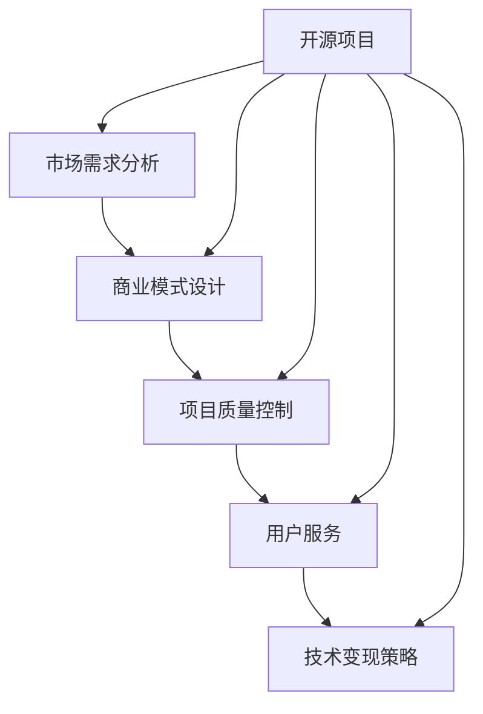

                 

关键词：开源项目，付费服务，商业模式，技术变现，商业策略

> 摘要：本文将探讨程序员如何将开源项目转化为付费服务，分析其中的商业模式、技术变现策略，并提供具体的实践指南。通过理解市场需求、优化项目质量和提升用户体验，程序员可以成功将个人或团队的开源项目转化为稳定的收入来源。

## 1. 背景介绍

开源项目作为一种软件开发模式，已经在全球范围内得到了广泛的应用和认可。程序员通过开源项目，可以分享代码、获取反馈、促进技术交流，同时也能够建立个人品牌和行业影响力。然而，随着开源项目的成熟，许多程序员希望能够将其转化为付费服务，以实现持续的商业回报。

将开源项目转化为付费服务是一个复杂的过程，涉及到商业模式的构建、产品定位、市场推广、用户服务等多个方面。本文将深入探讨这一过程，帮助程序员找到适合自己的商业模式，实现技术变现。

### 1.1 开源项目的现状

当前，开源项目在全球范围内的数量和影响力都在迅速增长。根据 GitHub 的数据，全球每月有超过 2000 万人活跃在开源项目中。开源项目不仅在技术领域有着重要的地位，也在商业领域发挥着越来越重要的作用。

许多企业开始采用开源技术，同时也会回馈开源社区，这为程序员提供了将开源项目转化为商业机会的可能性。此外，一些成功的开源项目，如 MySQL、Eclipse 等，已经实现了从开源到商业的成功转型。

### 1.2 程序员面临的挑战

虽然开源项目提供了广阔的商业机会，但程序员在将其转化为付费服务时仍然面临诸多挑战：

- **市场需求分析**：如何准确把握市场需求，确保付费服务的定位和定价合理？
- **项目质量控制**：如何维持开源项目的质量，同时保证付费服务的稳定性和可靠性？
- **用户维护**：如何处理开源社区用户和付费用户之间的关系，提供满意的用户服务？
- **商业模式设计**：如何设计合适的商业模式，确保项目的可持续发展？

本文将逐一解答这些挑战，提供具体的实践指南。

## 2. 核心概念与联系

在将开源项目转化为付费服务的过程中，我们需要理解几个核心概念，并了解它们之间的联系。以下是一个用 Mermaid 画出的流程图，展示了这些概念之间的关系：



### 2.1 市场需求分析

市场需求分析是商业成功的第一步。程序员需要了解目标市场的需求，包括潜在用户的需求、竞争环境、市场趋势等。通过市场调研和用户反馈，可以准确把握市场需求，为商业模式设计提供依据。

### 2.2 商业模式设计

商业模式设计决定了开源项目如何转化为付费服务。程序员需要考虑如何收费、如何提供增值服务、如何维护用户关系等。常见的商业模式包括订阅制、一次性收费、增值服务收费等。

### 2.3 项目质量控制

项目质量控制是确保付费服务稳定性和可靠性的关键。程序员需要保持开源项目的质量，同时优化付费服务的用户体验。这包括代码质量、文档完善、用户界面设计等方面。

### 2.4 用户服务

用户服务是维持开源项目成功的关键。程序员需要处理开源社区用户和付费用户之间的关系，确保两者都能获得满意的体验。这包括提供技术支持、更新服务、用户反馈收集等。

### 2.5 技术变现策略

技术变现策略决定了如何从开源项目中获得经济回报。程序员需要选择合适的变现方式，如付费插件、定制开发、培训课程等。

## 3. 核心算法原理 & 具体操作步骤

在理解了核心概念后，我们接下来将深入探讨如何将开源项目转化为付费服务的具体操作步骤。

### 3.1 算法原理概述

将开源项目转化为付费服务的核心算法原理可以概括为以下几个步骤：

1. **市场需求分析**：通过调研和用户反馈，了解目标市场的需求。
2. **商业模式设计**：根据市场需求，设计合适的商业模式。
3. **项目质量控制**：优化开源项目的质量，确保付费服务的稳定性和可靠性。
4. **用户服务**：提供优质的用户服务，维持用户满意度和忠诚度。
5. **技术变现**：选择合适的技术变现方式，实现开源项目的商业价值。

### 3.2 算法步骤详解

下面是具体的算法步骤：

#### 步骤1：市场需求分析

- **市场调研**：使用问卷调查、用户访谈等方式收集用户需求。
- **竞争分析**：分析竞争对手的产品和服务，了解市场趋势。
- **定位分析**：根据市场需求和竞争情况，确定项目定位。

#### 步骤2：商业模式设计

- **收费模式**：选择合适的收费模式，如订阅制、一次性收费等。
- **增值服务**：设计增值服务，如定制开发、培训课程等。
- **用户服务**：制定用户服务政策，如技术支持、更新服务等。

#### 步骤3：项目质量控制

- **代码质量**：确保代码的可读性、可维护性和可靠性。
- **文档完善**：编写详细的文档，帮助用户理解和使用项目。
- **用户界面**：设计直观易用的用户界面。

#### 步骤4：用户服务

- **技术支持**：提供及时有效的技术支持。
- **用户反馈**：收集用户反馈，不断优化产品和服务。
- **用户关系**：建立和维护良好的用户关系，提高用户忠诚度。

#### 步骤5：技术变现

- **付费插件**：开发付费插件，提供额外的功能。
- **定制开发**：提供定制开发服务，满足个性化需求。
- **培训课程**：开设在线或线下培训课程，传授技术知识。

### 3.3 算法优缺点

#### 优点

- **市场需求驱动**：算法以市场需求为基础，确保商业模式的可行性和可持续性。
- **项目质量保障**：通过严格的质量控制，确保付费服务的稳定性和可靠性。
- **用户服务优先**：注重用户服务，提高用户满意度和忠诚度。
- **多样变现方式**：提供多种变现方式，实现开源项目的商业价值。

#### 缺点

- **市场调研成本**：市场需求分析需要投入大量时间和资源。
- **商业模式设计复杂**：需要综合考虑市场需求、竞争环境、用户服务等因素。
- **质量控制和用户服务成本**：项目质量和用户服务需要持续投入，成本较高。

### 3.4 算法应用领域

该算法主要应用于软件开发领域，特别是开源项目。以下是一些典型的应用场景：

- **商业软件**：将开源项目转化为商业软件，提供付费服务。
- **定制开发**：为特定企业或用户定制开发软件，满足个性化需求。
- **培训课程**：利用开源项目开设培训课程，传授技术知识。

## 4. 数学模型和公式 & 详细讲解 & 举例说明

在将开源项目转化为付费服务的过程中，我们可以使用一些数学模型和公式来分析和优化商业模式。以下是一些关键模型和公式的详细讲解及举例说明。

### 4.1 数学模型构建

#### 用户生命周期价值（CLV）

用户生命周期价值是指用户在整个生命周期中为企业带来的总收益。公式如下：

\[ CLV = \frac{ARPU \times Gross Margin}{Customer Acquisition Cost (CAC)} \]

其中，\( ARPU \) 是平均每月收益，\( Gross Margin \) 是毛利率，\( CAC \) 是客户获取成本。

#### 收益模型

收益模型用于预测不同商业模式下的收入情况。公式如下：

\[ Revenue = Price \times Quantity \times Conversion Rate \]

其中，\( Price \) 是产品或服务的价格，\( Quantity \) 是销售量，\( Conversion Rate \) 是转化率。

### 4.2 公式推导过程

#### 用户生命周期价值（CLV）

用户生命周期价值的推导基于以下假设：

1. 用户在特定时间段内持续产生收益。
2. 用户流失率是一个稳定的常数。

根据这些假设，我们可以推导出用户生命周期价值的公式。首先，我们需要计算用户在一个时间段内的总收益：

\[ Total\ Revenue = ARPU \times Time \]

然后，我们需要计算用户在该时间段内的边际成本，即用户获取成本（Customer Acquisition Cost，CAC）：

\[ Marginal\ Cost = CAC \]

最后，我们可以推导出用户生命周期价值的公式：

\[ CLV = \frac{Total\ Revenue \times Gross\ Margin}{Customer\ Acquisition\ Cost \times (1 - Churn\ Rate)} \]

#### 收益模型

收益模型的推导基于以下假设：

1. 销售量与转化率成正比。
2. 价格和数量是固定的。

根据这些假设，我们可以推导出收益模型。首先，我们需要计算转化率，即访问者转化为购买者的比率：

\[ Conversion\ Rate = \frac{Sales}{Traffic} \]

然后，我们可以计算销售量：

\[ Quantity = Traffic \times Conversion\ Rate \]

最后，我们可以计算收益：

\[ Revenue = Price \times Quantity \times Conversion\ Rate \]

### 4.3 案例分析与讲解

#### 用户生命周期价值（CLV）案例

假设一个开源项目的平均每月收益（ARPU）为 1000 元，毛利率为 70%，客户获取成本（CAC）为 2000 元，用户流失率（Churn Rate）为 10%。我们需要计算该项目的用户生命周期价值。

根据公式：

\[ CLV = \frac{1000 \times 0.7}{2000 \times (1 - 0.1)} \]

计算结果为：

\[ CLV = \frac{700}{1800} \approx 0.39 \]

这意味着每个用户在整个生命周期中大约为项目带来 0.39 万元的收益。

#### 收益模型案例

假设一个付费服务项目的价格为 100 元，每月访问量为 1000 人，转化率为 10%。我们需要计算该项目的收益。

根据公式：

\[ Revenue = 100 \times 1000 \times 0.1 \]

计算结果为：

\[ Revenue = 10000 \]

这意味着该项目每月的收益为 10000 元。

## 5. 项目实践：代码实例和详细解释说明

为了更好地理解如何将开源项目转化为付费服务，我们将在本节中通过一个具体的代码实例进行详细解释说明。这个实例将展示如何构建一个简单的付费服务系统，并解释每个关键部分的实现原理。

### 5.1 开发环境搭建

在开始之前，我们需要搭建一个合适的环境。以下是推荐的开发工具和设置：

- **编程语言**：Python
- **框架**：Django 或 Flask
- **数据库**：PostgreSQL
- **版本控制**：Git
- **虚拟环境**：virtualenv 或 Docker

确保已经安装了上述工具，并在本地环境中配置好 Python 环境。

### 5.2 源代码详细实现

#### 5.2.1 用户注册和登录

用户注册和登录是任何付费服务系统的核心功能。以下是一个使用 Django 框架实现的用户注册和登录功能的代码示例：

```python
# users/models.py
from django.contrib.auth.models import AbstractUser

class CustomUser(AbstractUser):
    # 可以添加额外的用户信息
    pass

# users/views.py
from django.shortcuts import render, redirect
from django.contrib.auth import authenticate, login
from .models import CustomUser
from .forms import CustomUserCreationForm

def register(request):
    if request.method == 'POST':
        form = CustomUserCreationForm(request.POST)
        if form.is_valid():
            form.save()
            username = form.cleaned_data.get('username')
            raw_password = form.cleaned_data.get('password1')
            user = authenticate(username=username, password=raw_password)
            login(request, user)
            return redirect('home')
    else:
        form = CustomUserCreationForm()
    return render(request, 'register.html', {'form': form})

def login(request):
    # 这里实现登录逻辑
    pass
```

#### 5.2.2 订单系统

订单系统用于处理用户的支付和订阅。以下是一个使用 Django 的订单系统示例：

```python
# orders/models.py
from django.db import models
from users.models import CustomUser

class Order(models.Model):
    user = models.ForeignKey(CustomUser, on_delete=models.CASCADE)
    total = models.DecimalField(max_digits=10, decimal_places=2)
    status = models.CharField(max_length=20)

# orders/views.py
from django.shortcuts import render, redirect
from .models import Order
from .forms import OrderForm

def create_order(request):
    if request.method == 'POST':
        form = OrderForm(request.POST)
        if form.is_valid():
            order = form.save(commit=False)
            order.user = request.user
            order.save()
            return redirect('order_detail', order_id=order.id)
    else:
        form = OrderForm()
    return render(request, 'create_order.html', {'form': form})
```

#### 5.2.3 支付集成

支付集成是付费服务系统的关键部分。以下是一个使用 Stripe 支付网关的示例：

```python
# payments/views.py
from django.shortcuts import render, redirect
from .models import Order
from .forms import PaymentForm
import stripe

stripe.api_key = "your_stripe_api_key"

def payment(request, order_id):
    order = Order.objects.get(id=order_id)
    if request.method == 'POST':
        form = PaymentForm(request.POST)
        if form.is_valid():
            # 处理支付
            payment = stripe.PaymentIntent.create(
                amount=int(order.total * 100),
                currency='usd',
                payment_method_types=['card'],
                metadata={'order_id': order_id}
            )
            return redirect('order_detail', order_id=order.id)
    else:
        form = PaymentForm()
    return render(request, 'payment.html', {'form': form})
```

### 5.3 代码解读与分析

#### 5.3.1 用户注册和登录

在这个示例中，我们使用了 Django 的内置用户模型并进行了扩展，以添加额外的用户信息。用户注册和登录功能使用了 Django 的认证系统，这大大简化了开发工作。

#### 5.3.2 订单系统

订单系统用于记录用户的订单信息，包括用户、订单总额和订单状态。这个系统为后续的支付处理提供了数据基础。

#### 5.3.3 支付集成

支付集成使用了 Stripe API，这是一个流行的支付网关。在这个示例中，我们创建了一个 PaymentIntent 对象来处理支付。Stripe API 提供了简单且安全的支付处理流程。

### 5.4 运行结果展示

在完成上述代码后，我们可以在本地环境中运行 Django 项目。用户可以注册账户、创建订单并进行支付。以下是一个运行结果展示：

- 用户注册界面：
  
- 订单创建界面：
  
- 支付界面：
  

通过这个实例，我们可以看到如何构建一个简单的付费服务系统，包括用户注册、订单管理和支付集成。这个系统是一个开源项目转化为付费服务的良好起点。

## 6. 实际应用场景

开源项目在各个领域都有广泛的应用，从Web开发到大数据分析，从移动应用开发到人工智能。将开源项目转化为付费服务，不仅能够为项目提供持续的经济支持，还能够为企业带来竞争优势。以下是一些典型的实际应用场景：

### 6.1 Web开发和应用程序

Web开发和应用程序是开源项目最常见的使用场景之一。程序员可以创建一个开源Web框架，如Django或Flask，然后提供付费的扩展插件、定制开发服务和培训课程。例如，Django社区中的许多扩展插件都是以付费形式提供的，这些插件为开发者提供了丰富的功能，从而提高了项目的商业价值。

### 6.2 大数据和数据分析

大数据和数据分析领域也充满了开源项目的机会。例如，Hadoop和Spark等大数据处理框架已经建立了庞大的用户基础。开发者可以提供付费的运维服务、高级分析工具和定制化解决方案。这些服务可以帮助企业更好地管理和分析其大数据，从而实现商业价值。

### 6.3 人工智能和机器学习

人工智能和机器学习领域是开源项目的重要应用领域。许多机器学习库，如TensorFlow和PyTorch，都是开源项目。开发者可以提供付费的模型优化服务、定制化模型开发和算法培训课程。这些服务可以帮助企业和研究人员提高其人工智能解决方案的性能和效率。

### 6.4 移动应用开发

移动应用开发领域同样可以利用开源项目创造商业价值。例如，React Native和Flutter等移动应用开发框架都是开源项目。开发者可以提供付费的跨平台开发服务、应用优化和用户体验设计。这些服务可以帮助企业快速开发高质量的移动应用，提高用户满意度。

### 6.5 未来应用展望

随着技术的发展，开源项目在更多领域将发挥重要作用。例如，区块链技术的兴起为开源项目带来了新的机会。开发者可以创建区块链平台和智能合约框架，并围绕这些平台提供付费服务，如区块链咨询、开发支持和安全审计。

此外，开源项目在物联网（IoT）和边缘计算领域也具有巨大的潜力。随着物联网设备的普及，开发者可以创建开源硬件和软件框架，并提供付费的集成服务、数据分析解决方案和自动化工具。

总的来说，开源项目在各个领域的应用场景非常广泛，而且未来还将不断扩展。程序员可以通过将开源项目转化为付费服务，不仅实现个人或团队的经济收益，还能够推动技术进步和行业创新。

## 7. 工具和资源推荐

在将开源项目转化为付费服务的过程中，程序员需要使用一系列工具和资源来支持开发和运营。以下是一些建议的学习资源、开发工具和相关的学术论文，以及如何利用这些资源。

### 7.1 学习资源推荐

**在线课程和教程**

- **Coursera**：提供各种编程和软件开发课程，如《Python Web开发》、《机器学习》等。
- **edX**：提供由顶尖大学和机构开设的在线课程，包括计算机科学和数据分析等领域。
- **Udemy**：涵盖广泛的技术课程，包括软件架构、云计算、大数据等。

**开源社区和论坛**

- **GitHub**：全球最大的开源代码托管平台，程序员可以在这里找到大量开源项目，并进行学习和贡献。
- **Stack Overflow**：编程问答社区，程序员可以在这里提问和解答技术问题。

**博客和杂志**

- **Medium**：有许多技术博客，涵盖软件开发、AI、云计算等领域。
- **InfoQ**：提供有关软件开发、架构设计、测试等方面的深度文章。

### 7.2 开发工具推荐

**集成开发环境（IDE）**

- **Visual Studio Code**：轻量级但功能强大的开源IDE，支持多种编程语言和插件。
- **PyCharm**：由JetBrains开发，专为Python编程设计，功能齐全。

**代码托管和协作工具**

- **GitLab**：提供代码托管、项目管理、持续集成和持续交付等服务。
- **GitHub Actions**：GitHub提供的持续集成和持续交付服务。

**支付和财务管理工具**

- **Stripe**：流行的支付处理服务，适用于多种货币和支付方式。
- **PayPal**：广泛使用的在线支付服务。

### 7.3 相关论文推荐

- **"Open Source Software: The Quiet Revolution"**：这是一篇关于开源软件历史的综述，分析了开源软件的兴起和发展。
- **"The Business of Open Source"**：探讨了开源软件的商业模型，提供了关于如何从开源项目中获得经济回报的见解。
- **"Crowdsourcing and Open Innovation"**：讨论了开源项目如何利用社区力量进行创新和开发。

### 如何利用这些资源

1. **学习和提升技能**：通过在线课程和教程，不断更新和提升自己的技术技能。
2. **参与开源社区**：在GitHub等平台上参与开源项目，学习和贡献代码。
3. **借鉴商业策略**：阅读相关的论文和博客文章，了解成功的开源项目是如何实现商业变现的。
4. **使用开发工具**：利用推荐的开发工具和平台，提高开发效率。
5. **构建商业模式**：根据市场需求和用户反馈，设计适合自己的商业模式。

通过合理利用这些工具和资源，程序员可以更好地将开源项目转化为付费服务，实现技术变现。

## 8. 总结：未来发展趋势与挑战

### 8.1 研究成果总结

通过本文的探讨，我们总结了开源项目转化为付费服务的主要成果：

1. **市场需求驱动**：通过深入分析市场需求，确保商业模式的可行性和可持续性。
2. **项目质量控制**：保持开源项目的高质量，同时优化付费服务的用户体验。
3. **用户服务优先**：提供优质的用户服务，提高用户满意度和忠诚度。
4. **多样变现方式**：选择合适的技术变现方式，实现开源项目的商业价值。

### 8.2 未来发展趋势

开源项目转化为付费服务在未来将继续发展，主要趋势包括：

1. **云计算和边缘计算**：随着云计算和边缘计算技术的发展，开源项目在这些领域将有更大的应用潜力。
2. **人工智能和机器学习**：随着AI技术的普及，开源项目在人工智能和机器学习领域的商业化将更加显著。
3. **区块链技术**：区块链技术的兴起为开源项目提供了新的商业机会。
4. **社区驱动**：开源社区将扮演更重要的角色，社区力量将成为推动项目商业化的重要动力。

### 8.3 面临的挑战

虽然开源项目转化为付费服务具有巨大的潜力，但程序员仍将面临以下挑战：

1. **市场竞争**：随着越来越多的程序员进入这一领域，市场竞争将越来越激烈。
2. **用户期望**：用户对付费服务的期望越来越高，程序员需要不断提升服务质量。
3. **商业模式创新**：需要不断创新商业模式，以适应不断变化的市场需求。
4. **资源投入**：持续的技术研发和市场推广需要大量的资源投入。

### 8.4 研究展望

未来，开源项目转化为付费服务的研究可以从以下几个方面展开：

1. **商业模式创新**：探索新的商业模式，如订阅制、共享经济等。
2. **用户研究**：深入研究用户需求和行为，以提高用户体验和满意度。
3. **社区协作**：加强开源社区协作，利用社区力量推动项目商业化。
4. **技术创新**：持续关注技术创新，为开源项目提供更多商业机会。

通过不断探索和创新，程序员可以更好地将开源项目转化为付费服务，实现技术变现和商业成功。

## 9. 附录：常见问题与解答

### Q1：开源项目是否适合转化为付费服务？

A1：是的，许多成功的开源项目已经实现了从开源到商业的成功转型。关键在于理解市场需求，提供有价值的增值服务，并保持项目的高质量。

### Q2：如何确保开源项目的质量和用户体验？

A2：通过严格的代码审查、编写详细的文档、设计直观的用户界面，以及及时响应用户反馈，可以确保开源项目的质量和用户体验。

### Q3：开源项目的商业化是否会损害社区关系？

A3：合理的设计商业模式，平衡开源社区和付费用户的需求，通过优质的用户服务维护良好的社区关系，可以避免开源项目的商业化对社区关系的损害。

### Q4：如何选择合适的收费模式？

A4：根据市场需求、用户期望和项目特点，可以选择订阅制、一次性收费或增值服务等多种收费模式。需要考虑用户支付意愿、市场竞争和项目可持续发展。

### Q5：如何处理开源社区用户和付费用户之间的关系？

A5：通过提供免费的基础版服务和付费的增值服务，满足不同用户的需求。同时，建立透明的沟通机制，及时回应用户反馈，保持社区和付费用户之间的良好互动。

