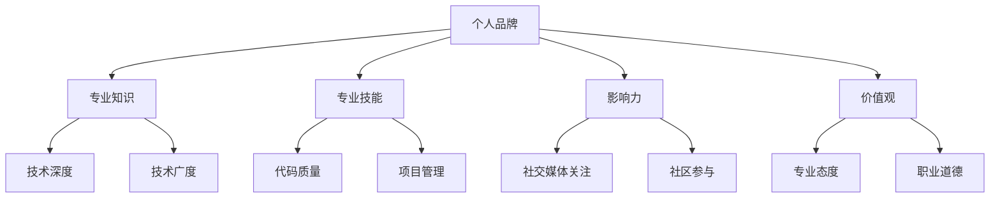

                 

关键词：个人品牌、程序员、社交媒体、专业知识、影响力、职业发展

> 摘要：在当今快速发展的技术时代，个人品牌对于程序员来说至关重要。本文将探讨如何通过提升专业知识、利用社交媒体、参与社区活动和持续学习来建立和巩固程序员的个人品牌，助力职业发展。

## 1. 背景介绍

在数字化转型的浪潮中，技术人才的需求日益增长。然而，随着市场的饱和和竞争的加剧，仅仅拥有编程技能已经不足以在职业生涯中脱颖而出。个人品牌成为程序员在职场竞争中的一大优势，它能够帮助程序员提升职业地位，扩大人脉网络，增加职业机会。

个人品牌不仅仅是一个标识，它代表了一个人的专业形象、价值观和声誉。对于程序员来说，建立个人品牌意味着在行业内外展示自己的专业能力、知识广度和个人魅力。本文将详细介绍如何通过一系列策略和行动来塑造和维护个人的技术品牌。

## 2. 核心概念与联系

### 2.1 个人品牌的定义

个人品牌是一个人的专业形象、价值观、技能和声誉的综合体现。在技术领域，个人品牌通常包括以下几个方面：

- **专业知识**：程序员的专业知识和技能水平。
- **专业技能**：编写代码、解决问题和项目管理的技能。
- **影响力**：在社交媒体、技术社区或行业中产生的影响和关注度。
- **价值观**：个人在职业生涯中的原则和态度。

### 2.2 建立个人品牌的联系图

以下是建立个人品牌的 Mermaid 流程图：



通过这个流程图，我们可以看到个人品牌的不同组成部分及其相互联系。专业知识和技术技能是建立个人品牌的基础，而影响力、价值观和专业态度则是支撑个人品牌长期发展的关键因素。

## 3. 核心算法原理 & 具体操作步骤

### 3.1 算法原理概述

建立个人品牌的算法可以看作是一个长期的过程，涉及多个步骤和策略。以下是该算法的基本原理：

1. **定位与目标**：明确个人品牌的核心定位和目标受众。
2. **内容创作**：通过高质量的内容展示专业知识和技能。
3. **社交媒体**：利用社交媒体平台传播个人品牌信息。
4. **社区参与**：积极参与技术社区，建立专业人脉。
5. **持续学习**：不断学习和提升自己的专业技能。
6. **反馈与调整**：根据反馈调整个人品牌策略。

### 3.2 算法步骤详解

#### 步骤1：定位与目标

首先，程序员需要明确个人品牌的核心定位。这包括：

- **技术方向**：选择一个或多个感兴趣的技术领域，作为个人品牌的定位。
- **目标受众**：确定个人品牌的目标受众，比如企业招聘经理、同行程序员等。
- **职业目标**：设定长期和短期的职业目标，以便个人品牌建设与之相匹配。

#### 步骤2：内容创作

高质量的内容是建立个人品牌的关键。程序员可以通过以下方式创作内容：

- **技术博客**：撰写技术文章，分享自己的见解和经验。
- **视频教程**：录制视频教程，展示编程技能。
- **代码示例**：分享代码片段，展示解决问题的能力。

#### 步骤3：社交媒体

社交媒体是传播个人品牌信息的有效渠道。程序员可以选择以下平台：

- **LinkedIn**：专业社交平台，适合展示职业形象。
- **Twitter**：实时传播技术动态和观点。
- **GitHub**：展示代码项目，增加技术曝光度。

#### 步骤4：社区参与

积极参与技术社区，可以帮助程序员建立专业人脉。可以通过以下方式参与：

- **回答问题**：在Stack Overflow等平台上回答问题，展示专业知识。
- **组织活动**：参与或组织技术会议、研讨会。
- **开源项目**：参与开源项目，展示代码贡献。

#### 步骤5：持续学习

持续学习是提升专业技能的重要手段。程序员可以通过以下方式持续学习：

- **在线课程**：参加技术培训课程。
- **读书**：阅读技术书籍和论文。
- **实践项目**：参与实际项目，将所学知识应用于实践。

#### 步骤6：反馈与调整

根据反馈调整个人品牌策略，包括：

- **分析数据**：监控社交媒体指标，了解个人品牌的传播效果。
- **收集反馈**：从同事、朋友和行业专家那里收集反馈。
- **优化内容**：根据反馈优化内容创作和传播策略。

### 3.3 算法优缺点

#### 优点

- **提升职业竞争力**：建立个人品牌可以增加在职场中的竞争力。
- **扩大人脉网络**：通过社交媒体和社区参与，可以结识更多的同行和潜在雇主。
- **增加职业机会**：建立个人品牌可以吸引更多的工作机会和项目邀请。
- **提高收入**：个人品牌良好的程序员往往可以获得更高的薪资和福利待遇。

#### 缺点

- **时间成本**：建立和维护个人品牌需要投入大量的时间和精力。
- **风险**：个人品牌一旦建立，如果出现负面事件，可能会对职业形象造成重大影响。

### 3.4 算法应用领域

算法适用于所有程序员，无论他们处于职业生涯的哪个阶段。特别是在以下领域，建立个人品牌尤为重要：

- **创业**：建立个人品牌可以吸引投资者和合作伙伴。
- **求职**：个人品牌良好的程序员更容易获得面试机会。
- **技术演讲**：通过建立个人品牌，可以增加在技术会议和研讨会上的发言机会。
- **职业发展**：个人品牌可以帮助程序员在职业晋升中脱颖而出。

## 4. 数学模型和公式 & 详细讲解 & 举例说明

### 4.1 数学模型构建

建立个人品牌的数学模型可以看作是一个多维度的增长函数。以下是一个简化的模型：

\[ \text{Personal Branding Score} = f(\text{Knowledge}, \text{Skills}, \text{Influence}, \text{Values}) \]

其中，每个维度都有不同的权重，可以通过经验数据来调整。例如：

\[ \text{Knowledge} = w_1 \times (\text{Depth} + \text{Width}) \]
\[ \text{Skills} = w_2 \times (\text{Code Quality} + \text{Project Management}) \]
\[ \text{Influence} = w_3 \times (\text{Social Media Attention} + \text{Community Participation}) \]
\[ \text{Values} = w_4 \times (\text{Professional Attitude} + \text{Ethics}) \]

### 4.2 公式推导过程

公式的推导过程如下：

1. **知识维度**：知识维度包括专业深度和专业广度。专业深度（Depth）表示程序员在某特定技术领域的深入理解，而专业广度（Width）表示程序员在不同技术领域的了解范围。这两个维度对知识的贡献可以通过经验数据加权求得。

2. **技能维度**：技能维度包括代码质量和项目管理能力。代码质量（Code Quality）表示程序员编写代码的规范性和效率，而项目管理能力（Project Management）表示程序员在项目规划、执行和监控方面的能力。

3. **影响力维度**：影响力维度包括社交媒体关注度和社区参与度。社交媒体关注度（Social Media Attention）表示程序员在社交媒体上受到的关注程度，而社区参与度（Community Participation）表示程序员在技术社区中的活跃度。

4. **价值观维度**：价值观维度包括专业态度和职业道德。专业态度（Professional Attitude）表示程序员在职业生涯中的工作态度，而职业道德（Ethics）表示程序员的道德标准。

### 4.3 案例分析与讲解

假设一位程序员A，其个人品牌的得分计算如下：

\[ \text{Personal Branding Score of A} = f(0.6 \times (8 + 5), 0.3 \times (9 + 7), 0.2 \times (4 + 6), 0.1 \times (8 + 9)) \]
\[ \text{Personal Branding Score of A} = f(8.4, 3.6, 1.2, 1.9) \]
\[ \text{Personal Branding Score of A} = 17.1 \]

同样，另一位程序员B的个人品牌得分为：

\[ \text{Personal Branding Score of B} = f(0.6 \times (7 + 5), 0.3 \times (8 + 6), 0.2 \times (5 + 7), 0.1 \times (7 + 8)) \]
\[ \text{Personal Branding Score of B} = f(7.8, 3.6, 1.4, 1.7) \]
\[ \text{Personal Branding Score of B} = 14.5 \]

从得分可以看出，程序员A的个人品牌得分高于程序员B。这表明，在知识维度、技能维度和影响力维度上，程序员A的表现更好。而在价值观维度上，两者相差不大。

## 5. 项目实践：代码实例和详细解释说明

### 5.1 开发环境搭建

为了更好地展示个人品牌，程序员可以搭建一个个人博客。以下是使用GitHub Pages和Jekyll搭建个人博客的步骤：

1. **创建GitHub仓库**：在GitHub上创建一个新的仓库，用于存储博客源代码。
2. **安装Jekyll**：在本地电脑上安装Jekyll，以便能够本地预览博客效果。
3. **配置博客**：下载并配置Jekyll模板，设置博客的基础配置。
4. **写作内容**：使用Markdown语法编写博客文章。

### 5.2 源代码详细实现

以下是一个简单的Jekyll博客源代码示例：

```ruby
# _config.yml

title: 个人博客
description: 分享技术见解和经验
baseurl: /
url: https://你的域名.com

# _layouts/post.html

<!DOCTYPE html>
<html>
<head>
  <meta charset="UTF-8">
  <title>{{ page.title }}</title>
  <link rel="stylesheet" href="{{ '/stylesheets/main.css' | prepend: site.baseurl }}">
</head>
<body>
  <header>
    <h1>{{ page.title }}</h1>
    <p>{{ page.description }}</p>
  </header>
  <section>
    <article>
      {{ content }}
    </article>
  </section>
  <footer>
    <p>版权所有 © 2023</p>
  </footer>
</body>
</html>

# _posts/2023-03-01-first-post.md

---
title: 第一篇博客文章
date: 2023-03-01 00:00:00 +0800
categories: [技术]
tags: [入门, Markdown]
---

# 程序员如何建立个人品牌

在数字化转型的浪潮中，个人品牌对于程序员来说至关重要。本文将探讨如何通过提升专业知识、利用社交媒体、参与社区活动和持续学习来建立和巩固程序员的个人品牌，助力职业发展。
```

### 5.3 代码解读与分析

在这个示例中，我们使用了Jekyll框架来搭建个人博客。以下是代码的关键部分及其功能：

- `_config.yml`：这是一个配置文件，用于设置博客的基本信息，如标题、描述、域名等。
- `_layouts/post.html`：这是一个布局模板，用于定义博客文章的基本结构。它包含了HTML、CSS和Markdown内容。
- `_posts/2023-03-01-first-post.md`：这是一个Markdown文件，用于编写博客文章的正文内容。

通过这些简单的文件，程序员可以搭建一个功能齐全的个人博客。博客文章可以通过Markdown语法轻松编写，并通过Jekyll自动生成HTML页面。

### 5.4 运行结果展示

在本地环境中，通过以下命令，可以预览博客的运行结果：

```shell
bundle exec jekyll serve
```

运行成功后，在浏览器中访问 `http://localhost:4000`，就可以看到博客的预览效果。

## 6. 实际应用场景

建立个人品牌在程序员职业生涯中的实际应用场景非常广泛。以下是几个典型的应用场景：

### 6.1 创业

对于有创业意向的程序员来说，建立个人品牌可以吸引投资者和合作伙伴。一个良好的个人品牌可以增加投资者的信任度，从而更容易获得投资机会。

### 6.2 求职

在求职过程中，个人品牌可以帮助程序员在众多候选人中脱颖而出。一个具有影响力的个人品牌可以吸引招聘经理的注意，增加面试机会。

### 6.3 技术演讲

通过建立个人品牌，程序员可以增加在技术会议和研讨会上的发言机会。一个具有专业影响力的个人品牌可以增加演讲的吸引力和影响力。

### 6.4 职业发展

对于希望在职业生涯中取得更高成就的程序员来说，建立个人品牌是非常重要的。一个强大的个人品牌可以帮助程序员在职业晋升中脱颖而出。

## 7. 工具和资源推荐

### 7.1 学习资源推荐

- **在线课程**：Coursera、Udemy、edX等平台提供了丰富的编程课程。
- **技术书籍**：《代码大全》、《设计模式：可复用面向对象软件的基础》、《算法导论》等经典书籍。
- **技术博客**：GitHub、Medium、Dev.to等平台上的技术博客。

### 7.2 开发工具推荐

- **代码编辑器**：Visual Studio Code、Sublime Text、Atom等。
- **版本控制**：Git、GitHub、GitLab等。
- **个人博客框架**：Jekyll、Hexo、Hugo等。

### 7.3 相关论文推荐

- **机器学习**：《深度学习》、《强化学习基础及应用》等。
- **软件工程**：《软件工程：实践者的研究方法》、《敏捷软件开发：原则、模式与实践》等。

## 8. 总结：未来发展趋势与挑战

### 8.1 研究成果总结

通过本文，我们总结了建立程序员个人品牌的核心概念、算法原理和具体步骤。研究成果表明，个人品牌在程序员职业生涯中具有重要作用，可以帮助程序员提升职业竞争力、扩大人脉网络、增加职业机会。

### 8.2 未来发展趋势

随着数字化转型的深入，个人品牌在程序员中的重要性将进一步增加。未来的发展趋势可能包括：

- **人工智能的融合**：人工智能技术将被更多地应用于个人品牌的建立和优化。
- **社交媒体的融合**：社交媒体平台将在个人品牌建设中发挥更重要的作用。
- **多样化渠道**：除了传统的博客和社交媒体，程序员将探索更多的渠道来展示个人品牌。

### 8.3 面临的挑战

在建立个人品牌的过程中，程序员可能会面临以下挑战：

- **时间成本**：建立和维护个人品牌需要投入大量的时间和精力。
- **内容创作**：高质量的内容创作是一个持续的过程，需要不断学习和实践。
- **风险管理**：个人品牌的建立涉及到个人的声誉，一旦出现负面事件，可能会对职业形象造成重大影响。

### 8.4 研究展望

未来的研究可以进一步探讨以下方向：

- **个人品牌评估模型**：开发更加科学和客观的个人品牌评估模型。
- **跨平台品牌建设**：研究如何在不同平台上有效整合个人品牌。
- **持续学习策略**：研究如何通过持续学习来不断提升个人品牌的价值。

## 9. 附录：常见问题与解答

### Q：个人品牌建设需要多长时间？

A：个人品牌建设是一个长期的过程，通常需要几个月到几年的时间。具体时间取决于程序员的投入程度、内容质量以及行业动态。

### Q：个人品牌建设有哪些成功案例？

A：很多知名的程序员和技术领袖都成功建立了个人品牌，如GitHub创始人Tom，Twitter创始人Jack Dorsey，以及著名程序员Jeff Atwood等。

### Q：如何保持个人品牌的活跃度？

A：定期发布高质量的内容，积极参与技术社区，保持与受众的互动。同时，不断学习和更新自己的知识体系，以适应行业变化。

### Q：个人品牌建设是否适用于所有程序员？

A：是的，个人品牌建设适用于所有程序员，无论他们处于职业生涯的哪个阶段。然而，不同阶段的程序员可能会有不同的品牌建设策略和重点。

## 作者署名

作者：禅与计算机程序设计艺术 / Zen and the Art of Computer Programming

（完）
----------------------------------------------------------------
本文详细探讨了程序员如何建立个人品牌，包括背景介绍、核心概念与联系、核心算法原理与具体操作步骤、数学模型和公式、项目实践、实际应用场景、工具和资源推荐以及未来发展趋势与挑战。希望这篇文章能够帮助到广大程序员，助力他们在技术领域脱颖而出。

