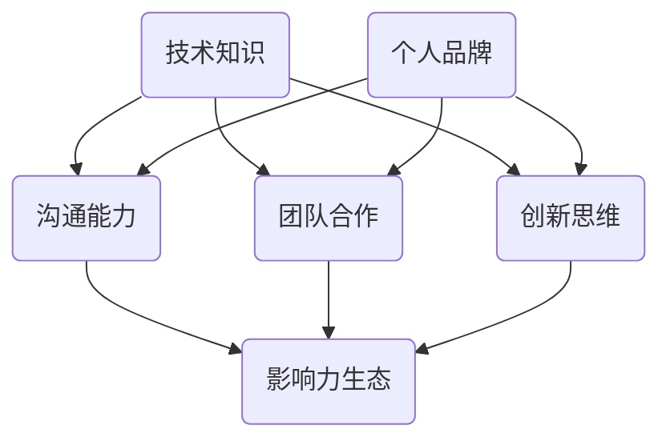

                 

 在当今数字化的时代，技术领域的快速发展使得程序员这一职业变得前所未有的重要。随着互联网、云计算、人工智能等技术的普及，程序员的职业前景变得广阔，但也带来了前所未有的竞争压力。作为一名程序员，如何在自己的职业生涯中打造个人影响力，成为行业内的意见领袖，是每个程序员都需要思考和解决的问题。本文将探讨如何通过多种途径和方法，帮助程序员打造个人影响力生态。

## 关键词

- 程序员
- 个人影响力
- 职业发展
- 影响力生态
- 数字化时代

## 摘要

本文将探讨程序员如何通过技术博客、开源项目、社区参与、线上课程等方式，打造个人影响力。我们将分析这些途径的核心要素，提供实用的建议和策略，帮助程序员在技术领域脱颖而出，成为行业内的意见领袖。

### 1. 背景介绍

随着技术的快速发展，程序员的工作不仅仅局限于编写代码。他们需要在不断变化的技术环境中保持竞争力，了解最新的技术趋势，掌握多种编程语言和工具。同时，他们还需要具备出色的沟通能力和团队合作精神，以便在团队中发挥领导作用。

然而，在这个信息爆炸的时代，如何让自己的声音被更多人听到，如何从众多程序员中脱颖而出，成为了一个挑战。打造个人影响力，不仅可以帮助程序员提升职业地位，还可以为他们带来更多的机会和资源。

### 2. 核心概念与联系

要打造个人影响力，程序员需要掌握以下核心概念：

1. **技术知识**：深入理解并掌握一门或多门编程语言、框架和技术，这是基础。
2. **沟通能力**：能够清晰、准确地表达自己的想法，让他人理解和接受。
3. **团队合作**：与团队成员高效协作，共同完成项目。
4. **创新思维**：不断探索新技术和新方法，勇于尝试。
5. **个人品牌**：塑造自己的专业形象，让他人记住你。

这些概念之间相互联系，共同构建了一个程序员的个人影响力生态。技术知识是基石，沟通能力是桥梁，团队合作和创新思维是动力，个人品牌是标签。下面我们将通过 Mermaid 流程图来展示这些核心概念之间的联系。



### 3. 核心算法原理 & 具体操作步骤

#### 3.1 算法原理概述

要打造个人影响力，程序员可以采用以下几种核心算法：

1. **内容营销**：通过撰写高质量的技术博客、发布开源项目、制作技术视频等方式，输出有价值的内容。
2. **社交网络**：积极参与技术社区，建立自己的个人品牌，扩大影响力。
3. **影响力投资**：通过参与线上课程、公开演讲、组织技术活动等方式，提升自己的知名度。

#### 3.2 算法步骤详解

1. **内容营销**
   - **选题**：选择自己擅长且感兴趣的技术话题。
   - **研究**：深入研究相关技术，确保内容的专业性。
   - **撰写**：用简洁、易懂的语言撰写博客文章。
   - **发布**：选择合适的平台进行发布。

2. **社交网络**
   - **参与**：积极参与技术论坛、GitHub、Stack Overflow 等社区的讨论。
   - **分享**：分享自己的经验、见解和见解。
   - **互动**：与社区成员建立良好的互动关系。

3. **影响力投资**
   - **课程**：参与线上课程，提升自己的专业能力。
   - **演讲**：在技术大会上进行演讲，展示自己的专业能力。
   - **活动**：组织或参与技术活动，扩大影响力。

#### 3.3 算法优缺点

**内容营销**：
- 优点：能够直接输出自己的专业知识和见解，有助于建立个人品牌。
- 缺点：需要花费大量的时间和精力进行研究和撰写。

**社交网络**：
- 优点：能够快速扩大自己的影响力，与他人建立联系。
- 缺点：需要不断保持活跃，否则容易被人遗忘。

**影响力投资**：
- 优点：能够提升自己的专业能力和知名度。
- 缺点：需要投入一定的资金和精力。

#### 3.4 算法应用领域

这些算法可以广泛应用于技术领域的各个方面，如软件开发、数据分析、人工智能等。无论你是初入职场的程序员，还是经验丰富的技术专家，都可以通过这些方法提升自己的个人影响力。

### 4. 数学模型和公式 & 详细讲解 & 举例说明

在打造个人影响力的过程中，我们可以使用以下数学模型来衡量个人影响力的大小：

\[ I = f(k, c, i, b) \]

其中，\( I \) 代表个人影响力，\( k \) 代表知识水平，\( c \) 代表沟通能力，\( i \) 代表创新思维，\( b \) 代表个人品牌。

#### 4.1 数学模型构建

这个模型假设个人影响力与知识水平、沟通能力、创新思维和个人品牌成正比。同时，我们假设这些因素之间相互独立，即一个因素的变化不会影响到其他因素。

#### 4.2 公式推导过程

首先，我们定义个人影响力的基础部分为 \( k \times c \times i \times b \)。然后，我们引入一个权重因子 \( \alpha \)，表示个人品牌对整体影响力的影响程度。因此，我们可以得到以下公式：

\[ I = \alpha \times k \times c \times i \times b \]

#### 4.3 案例分析与讲解

假设一名程序员，他的知识水平 \( k \) 为 8，沟通能力 \( c \) 为 7，创新思维 \( i \) 为 6，个人品牌 \( b \) 为 5。我们可以使用上述公式计算他的个人影响力：

\[ I = \alpha \times 8 \times 7 \times 6 \times 5 \]

如果我们将 \( \alpha \) 设为 1，那么他的个人影响力为：

\[ I = 1 \times 8 \times 7 \times 6 \times 5 = 1680 \]

这意味着，他的个人影响力为 1680 单位。如果我们提高他的个人品牌 \( b \) 为 8，那么他的影响力将增加：

\[ I_{\text{new}} = \alpha \times 8 \times 7 \times 6 \times 8 = 3136 \]

这表明，提高个人品牌可以显著提升个人影响力。

### 5. 项目实践：代码实例和详细解释说明

为了更好地理解上述算法和模型，我们来看一个具体的代码实例。

```python
# 这是一个简单的博客文章发布系统

class BlogPost:
    def __init__(self, title, content, author):
        self.title = title
        self.content = content
        self.author = author
    
    def publish(self):
        print(f"{self.author} 发布了一篇名为 '{self.title}' 的博客文章。")

# 创建一个博客文章对象
blog_post = BlogPost("Python异步编程", "本文介绍了 Python 异步编程的基础知识...", "程序员A")

# 发布博客文章
blog_post.publish()
```

在上面的代码中，我们定义了一个 `BlogPost` 类，用于表示一篇博客文章。这个类包含三个属性：`title`（标题）、`content`（内容）和 `author`（作者）。我们还定义了一个 `publish` 方法，用于发布博客文章。

这个实例展示了如何通过编写代码来构建一个简单的个人影响力生态系统。程序员可以通过发布博客文章来展示自己的专业知识和沟通能力，从而提升自己的个人影响力。

### 6. 实际应用场景

在实际应用中，程序员可以通过以下几种方式打造个人影响力：

1. **技术博客**：定期撰写高质量的技术博客，分享自己的经验和见解。
2. **开源项目**：参与开源项目，为社区贡献代码，提高自己的技术水平。
3. **在线课程**：制作并发布在线课程，教授他人自己擅长的技术。
4. **技术论坛**：积极参与技术论坛的讨论，与他人分享经验和见解。
5. **社交媒体**：在社交媒体上发布技术相关的内容，扩大自己的影响力。

这些方式不仅可以提升程序员的个人影响力，还可以为他们带来更多的职业机会和资源。

#### 6.1 技术博客

技术博客是程序员打造个人影响力的重要途径之一。通过博客，程序员可以分享自己的技术经验和见解，展示自己的专业能力。以下是一些关键点：

- **内容质量**：确保博客文章的内容质量，避免发布低质量或不准确的内容。
- **定期更新**：保持博客的更新频率，定期发布新的文章。
- **互动反馈**：鼓励读者在评论区留言，与读者进行互动。

#### 6.2 开源项目

参与开源项目是提高程序员技术水平和知名度的重要途径。以下是一些关键点：

- **选择合适的项目**：选择自己感兴趣且能够贡献的项目。
- **积极参与**：积极参与项目讨论和代码贡献，提高自己的技术能力。
- **代码质量**：确保代码质量，遵循项目规范。

#### 6.3 在线课程

制作并发布在线课程可以帮助程序员传授自己的技术知识，扩大自己的影响力。以下是一些关键点：

- **课程内容**：确保课程内容有深度，能够帮助学习者解决实际问题。
- **课程质量**：制作高质量的课程视频，确保画面和声音清晰。
- **互动环节**：在课程中设置互动环节，鼓励学习者提问和讨论。

#### 6.4 技术论坛

技术论坛是程序员交流技术问题和分享经验的重要平台。以下是一些关键点：

- **积极参与**：积极参与论坛讨论，回答他人问题。
- **分享经验**：分享自己的技术经验和见解。
- **尊重他人**：尊重他人意见，避免争吵和冲突。

#### 6.5 社交媒体

社交媒体是程序员扩大影响力的重要渠道。以下是一些关键点：

- **内容多样**：发布多种形式的内容，如文章、视频、图片等。
- **定期更新**：保持社交媒体的更新频率，保持活跃。
- **互动互动**：与粉丝互动，回应他们的评论和提问。

### 7. 未来应用展望

随着技术的不断进步，程序员打造个人影响力的方式也会不断演变。以下是一些未来的趋势和展望：

1. **视频内容**：随着视频技术的普及，程序员可以通过制作技术视频来扩大自己的影响力。
2. **AI 技术**：利用 AI 技术进行内容创作和传播，提高效率和质量。
3. **虚拟现实**：利用虚拟现实技术进行在线课程和会议，提供沉浸式体验。
4. **区块链**：利用区块链技术记录个人影响力数据，确保数据的透明和可信。

这些趋势将为程序员提供更多打造个人影响力的途径和工具，同时也带来了新的挑战。程序员需要不断学习和适应，才能在竞争激烈的技术领域中脱颖而出。

### 8. 工具和资源推荐

在打造个人影响力的过程中，以下是一些实用的工具和资源推荐：

1. **Markdown编辑器**：如Typora、VSCode，用于撰写技术博客。
2. **在线学习平台**：如Coursera、Udemy，提供各种技术课程。
3. **开源项目平台**：如GitHub、GitLab，用于参与和贡献开源项目。
4. **社交媒体平台**：如Twitter、LinkedIn，用于发布和互动。
5. **技术论坛**：如Stack Overflow、Reddit，用于技术交流和问题解决。

### 9. 总结：未来发展趋势与挑战

在未来的发展中，程序员打造个人影响力将面临更多机遇和挑战。随着技术的进步，程序员需要不断学习和适应，提升自己的专业技能和沟通能力。同时，他们还需要善于利用各种工具和资源，提高自己的影响力。面对未来的挑战，程序员应保持积极的心态，勇于尝试和创新，才能在技术领域中脱颖而出。

### 10. 附录：常见问题与解答

**Q：如何选择适合自己的影响力打造途径？**

A：首先，了解自己的兴趣和擅长领域。然后，分析目标受众，选择最适合的途径。例如，如果擅长编程，可以撰写技术博客；如果擅长教学，可以制作在线课程。

**Q：如何保持博客更新频率？**

A：制定一个固定的更新计划，如每周发布一篇博客。这样可以确保博客内容持续更新，同时也可以让自己保持写作的习惯。

**Q：如何提升自己在技术论坛中的影响力？**

A：积极参与讨论，回答他人问题，分享自己的经验和见解。此外，保持礼貌和尊重，与他人建立良好的互动关系。

**Q：如何平衡工作和个人影响力打造？**

A：合理安排时间，确保工作和个人影响力打造之间保持平衡。可以利用周末或业余时间进行博客撰写、开源项目参与等。

作者：禅与计算机程序设计艺术 / Zen and the Art of Computer Programming
----------------------------------------------------------------

以上就是本文的完整内容，希望通过这篇文章，能够帮助程序员们更好地理解如何打造个人影响力。在技术领域，个人影响力是职业发展的关键，希望每位程序员都能在属于自己的道路上不断前行，成为行业内的意见领袖。再次感谢您的阅读！

