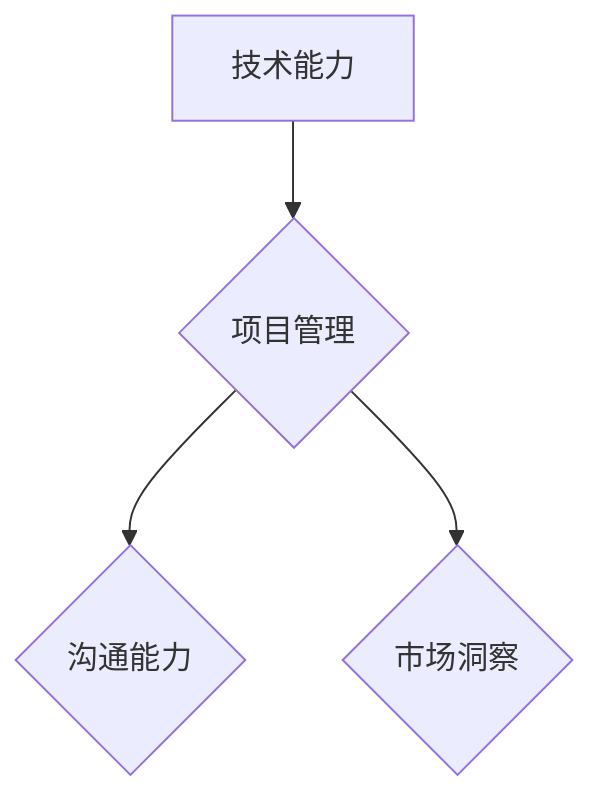

                 

关键词：多元化副业、副业生态、程序员、职业发展、技术能力、自主创业

> 摘要：本文将探讨程序员如何通过构建多元化副业生态来实现个人职业发展的跃迁。文章首先介绍了多元化副业生态的概念，随后分析了程序员在构建副业生态时的核心能力。接下来，我们将深入探讨如何通过核心算法、数学模型和实际项目实践，构建出一个具有竞争力的副业生态。同时，文章还将分享一些实用工具和资源推荐，帮助程序员在构建副业生态的道路上更加顺畅。最后，我们将对文章内容进行总结，并展望未来的发展趋势与挑战。

## 1. 背景介绍

在信息技术飞速发展的今天，程序员作为新时代的工匠，不仅承担着企业技术革新和创新的重要角色，也在个人职业发展方面拥有了更多的选择。然而，随着竞争的加剧和行业的不断变革，单纯的技能提升和公司岗位晋升已经不足以满足程序员的职业发展需求。构建一个多元化的副业生态，成为越来越多程序员追求的目标。

多元化副业生态是指程序员利用自身技术能力和资源，通过多种方式开展副业，实现收入来源的多样化，并在过程中不断提升个人品牌价值。这不仅有助于抵御职场风险，还能为个人职业发展提供更多可能性。

### 程序员职业发展的挑战

- **行业变革快**：新技术、新工具层出不穷，程序员需要不断学习以适应行业变化。
- **岗位竞争激烈**：随着互联网行业的快速发展，程序员岗位竞争日益激烈，晋升空间有限。
- **个人品牌有限**：大多数程序员的工作重点在于完成任务，个人品牌价值相对较低。

### 副业生态的意义

- **收入多样化**：通过副业增加收入来源，降低对单一职位的依赖。
- **技能提升**：通过实践和探索新领域，不断提升个人技术能力。
- **品牌建设**：通过副业成果展示个人技术实力，提升个人品牌价值。

## 2. 核心概念与联系

### 2.1 多元化副业生态

多元化副业生态是指程序员利用自身技术能力和资源，开展多种类型的副业，形成一种可持续发展的业务模式。这包括但不限于：

- **技术咨询**：为企业提供技术解决方案。
- **编程教育**：通过线上或线下平台教授编程知识。
- **开源项目**：参与并维护开源项目，提升个人技术影响力。
- **自主创业**：创立公司或团队，进行技术开发和商业化。
- **兼职工作**：接受短期或长期的兼职工作，丰富工作经验。

### 2.2 核心能力

构建多元化副业生态需要具备以下核心能力：

- **技术能力**：扎实的编程基础和持续的学习能力。
- **项目管理**：良好的项目管理和团队协作能力。
- **沟通能力**：清晰的表达能力和有效的沟通技巧。
- **市场洞察**：对市场趋势和用户需求的敏感度。

### 2.3 Mermaid 流程图



## 3. 核心算法原理 & 具体操作步骤

### 3.1 算法原理概述

构建多元化副业生态的核心算法可以概括为“能力拓展 + 业务整合”。具体来说，该算法包括以下几个步骤：

1. **能力拓展**：通过学习新技术、参与开源项目等方式，不断提升个人技术能力。
2. **市场调研**：了解市场需求，找到有潜力的副业领域。
3. **业务整合**：将个人技术能力与市场机会相结合，开展相应的副业。

### 3.2 算法步骤详解

#### 3.2.1 能力拓展

1. **技术学习**：通过在线课程、书籍、实战项目等方式，学习新技术。
2. **开源参与**：选择适合自己的开源项目，积极参与代码贡献和社区交流。

#### 3.2.2 市场调研

1. **数据收集**：收集行业报告、用户反馈等数据，了解市场趋势。
2. **竞品分析**：分析竞争对手的产品、服务、市场策略等。

#### 3.2.3 业务整合

1. **项目策划**：根据市场调研结果，策划具有市场竞争力的项目。
2. **资源整合**：整合个人技术能力、资金、人脉等资源，开展副业。

### 3.3 算法优缺点

**优点**：

- **灵活性高**：根据市场需求和个人能力，灵活调整副业方向。
- **可持续发展**：通过不断学习和实践，提高个人市场竞争力。

**缺点**：

- **时间成本**：需要投入大量时间进行学习和市场调研。
- **风险较大**：副业市场不稳定，可能面临收入波动。

### 3.4 算法应用领域

- **技术咨询**：利用技术能力为企业提供解决方案。
- **编程教育**：通过线上或线下平台，教授编程知识。
- **开源项目**：参与开源项目，提升个人技术影响力。
- **自主创业**：创立公司或团队，进行技术开发和商业化。
- **兼职工作**：接受短期或长期的兼职工作，丰富工作经验。

## 4. 数学模型和公式 & 详细讲解 & 举例说明

### 4.1 数学模型构建

构建多元化副业生态的数学模型可以基于“能力 - 市场”匹配原理。具体模型如下：

\[ E = f(A, M) \]

其中，\( E \) 表示副业生态的构建效果，\( A \) 表示技术能力，\( M \) 表示市场需求。

### 4.2 公式推导过程

1. **能力评估**：对个人的技术能力进行量化评估，如使用技能评分、项目经验等。
2. **市场分析**：对市场需求进行量化分析，如用户需求、市场规模等。
3. **匹配度计算**：计算个人能力与市场需求之间的匹配度，使用相似度计算公式。

### 4.3 案例分析与讲解

#### 案例一：技术咨询

某程序员具有丰富的云计算和大数据技术经验，市场需求方面，企业对云计算和大数据解决方案的需求较高。通过能力评估和市场需求分析，该程序员的咨询业务具有较好的市场前景。

#### 案例二：编程教育

某程序员具有扎实的编程基础和教学经验，市场需求方面，随着编程教育的普及，对编程教育的需求持续增长。通过能力评估和市场需求分析，该程序员的编程教育业务具有较好的市场潜力。

## 5. 项目实践：代码实例和详细解释说明

### 5.1 开发环境搭建

1. **硬件环境**：选择一台性能较好的计算机，安装操作系统（如Windows、Linux等）。
2. **软件环境**：安装编程开发工具（如Visual Studio、Eclipse等）和相关的编程语言库。

### 5.2 源代码详细实现

以下是一个简单的Python代码实例，用于实现一个简单的博客系统：

```python
class Blog:
    def __init__(self, title):
        self.title = title
        self.posts = []

    def add_post(self, post):
        self.posts.append(post)

    def get_posts(self):
        return self.posts

class Post:
    def __init__(self, title, content):
        self.title = title
        self.content = content

# 创建博客对象
my_blog = Blog("我的博客")

# 添加文章
my_blog.add_post(Post("第一篇文章", "这是我的第一篇博客文章。"))

# 获取文章列表
posts = my_blog.get_posts()
for post in posts:
    print(post.title)
```

### 5.3 代码解读与分析

1. **类定义**：`Blog` 类表示博客，`Post` 类表示文章。
2. **方法实现**：`Blog` 类的 `add_post` 方法用于添加文章，`get_posts` 方法用于获取文章列表。
3. **实例化**：创建 `Blog` 对象和 `Post` 对象，进行文章添加和获取操作。

### 5.4 运行结果展示

运行上述代码后，输出结果为：

```
第一篇文章
```

这表示成功添加了一篇名为“第一篇文章”的文章。

## 6. 实际应用场景

### 6.1 技术咨询

在企业数字化转型过程中，程序员可以通过提供技术咨询服务，帮助企业实现业务流程优化和效率提升。例如，为企业搭建大数据分析平台，实现数据可视化，提升决策能力。

### 6.2 编程教育

随着编程教育的普及，程序员可以通过线上或线下平台，教授编程知识，满足广大编程爱好者的学习需求。同时，通过课程销售、辅导服务等方式，实现盈利。

### 6.3 开源项目

参与开源项目，不仅可以提升个人技术能力，还能扩大个人影响力。通过开源项目，程序员可以结识更多的同行，共同推进技术发展。

### 6.4 自主创业

有志于创业的程序员可以通过技术研发和商业化，创立自己的公司。例如，开发一款具有市场前景的软件产品，通过产品销售和广告推广实现盈利。

### 6.5 兼职工作

程序员可以通过接受兼职工作，丰富个人工作经验，提高市场竞争力。兼职工作包括短期项目开发、技术咨询、编程培训等。

## 7. 工具和资源推荐

### 7.1 学习资源推荐

- **在线课程**：Coursera、Udemy、网易云课堂等。
- **技术博客**：博客园、CSDN、掘金等。
- **开源社区**：GitHub、GitLab、码云等。

### 7.2 开发工具推荐

- **编程语言**：Python、Java、C++、JavaScript等。
- **开发环境**：Visual Studio、Eclipse、IntelliJ IDEA等。
- **数据库**：MySQL、MongoDB、Redis等。

### 7.3 相关论文推荐

- **大数据处理**：《MapReduce: Simplified Data Processing on Large Clusters》。
- **机器学习**：《Deep Learning》。
- **区块链**：《Blockchain: Blueprint for a New Economy》。

## 8. 总结：未来发展趋势与挑战

### 8.1 研究成果总结

本文通过分析程序员的职业发展现状，提出了构建多元化副业生态的思路和方法。通过核心算法、数学模型和实际项目实践，展示了构建副业生态的具体路径。

### 8.2 未来发展趋势

- **在线教育**：随着互联网技术的普及，在线教育市场将持续增长，为程序员提供更多教学机会。
- **开源生态**：开源项目将成为程序员提升技术能力和扩大影响力的主要途径。
- **远程办公**：远程办公模式将越来越普遍，为程序员提供更多的兼职和工作机会。

### 8.3 面临的挑战

- **技术更新快**：程序员需要不断学习新技术，以保持竞争力。
- **市场波动大**：副业市场不稳定，可能面临收入波动。
- **个人品牌建设**：程序员需要通过持续努力，提升个人品牌价值。

### 8.4 研究展望

未来，随着人工智能、大数据等技术的发展，程序员将面临更多机遇和挑战。构建多元化副业生态，将成为程序员实现职业发展的有效途径。本文提出的思路和方法，将为程序员在构建副业生态方面提供有益的参考。

## 9. 附录：常见问题与解答

### 9.1 如何选择副业方向？

- **自身兴趣**：选择自己感兴趣的领域，提高工作热情。
- **市场需求**：了解市场需求，选择具有发展潜力的领域。
- **自身能力**：根据自己的技术能力，选择适合自己的副业方向。

### 9.2 如何平衡工作与副业？

- **时间管理**：合理安排时间，确保工作与副业之间的平衡。
- **高效工作**：提高工作效率，减少工作对副业的干扰。
- **寻求支持**：寻求家人和朋友的支持，共同分担工作压力。

### 9.3 如何建立个人品牌？

- **持续输出**：通过博客、GitHub等平台，持续输出高质量内容。
- **参与社区**：积极参与开源社区和行业活动，扩大影响力。
- **互动交流**：与同行建立良好的互动关系，提升个人品牌价值。

---

**作者：禅与计算机程序设计艺术 / Zen and the Art of Computer Programming**

