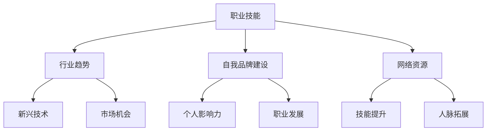

                 

## 1. 背景介绍

在当今数字化时代，程序员作为科技领域的重要从业者，面临着前所未有的机遇和挑战。技术的快速迭代和互联网的普及，使得程序员的工作范围不再局限于传统的软件开发和编码。随着云计算、大数据、人工智能等新兴技术的崛起，程序员开始涉足更多领域，例如数据科学、网络安全、移动应用开发等。然而，这同时也带来了一个重要的问题——如何构建多元化的收入来源。

多元化的收入来源不仅可以降低程序员的经济风险，提高财务稳定性，还可以帮助他们更好地适应不断变化的市场需求。本文将探讨程序员如何通过构建多元化收入来源的生态系统，实现个人职业发展和经济收益的双重提升。

## 2. 核心概念与联系

在探讨如何构建多元化收入来源之前，我们首先需要了解一些核心概念，它们是理解整个生态系统的基础。

### 2.1 职业技能

程序员的职业发展离不开核心编程技能。这些技能包括但不限于：编程语言（如Java、Python、C++）、软件开发框架（如React、Angular、Spring）、数据库技术（如MySQL、MongoDB）、前端技术（如HTML、CSS、JavaScript）等。掌握多种编程技能，可以帮助程序员在不同项目中灵活应用，从而拓展收入来源。

### 2.2 行业趋势

了解当前和未来科技行业的发展趋势，对于程序员构建多元化收入来源至关重要。例如，随着物联网（IoT）和边缘计算的发展，程序员可以涉足硬件开发、嵌入式系统等领域。此外，人工智能和机器学习的兴起，也为程序员提供了新的机会，如数据科学家、机器学习工程师等职位。

### 2.3 自我品牌建设

在数字化时代，个人品牌的建设变得尤为重要。一个强大的个人品牌可以帮助程序员在职业市场上脱颖而出，吸引更多的项目和机会。自我品牌建设包括个人网站、社交媒体影响力、公开演讲和出版物等。

### 2.4 网络资源

网络资源是程序员构建多元化收入来源的重要工具。这些资源包括在线课程、开源项目、技术社区、博客等。通过这些资源，程序员可以不断提升技能、扩展人脉，并为自己的项目或服务获取更多关注。

### 2.5 Mermaid 流程图

以下是一个简单的Mermaid流程图，展示了上述核心概念之间的联系：



## 3. 核心算法原理 & 具体操作步骤

### 3.1 算法原理概述

构建多元化收入来源的生态系统，需要程序员具备以下几个核心算法原理：

- **技能融合**：将不同领域的技能进行融合，创造出新的价值点。例如，将前端开发技能与数据可视化技术结合，开发数据驱动型应用。
- **项目管理系统**：使用项目管理工具（如JIRA、Trello）来提高工作效率，确保项目按时交付，提升客户满意度。
- **营销策略**：学习市场营销的基本原理，制定有效的营销策略，提高个人品牌知名度。
- **自动化工具**：利用自动化工具（如CI/CD流水线、自动化测试工具）来降低重复劳动，提高生产效率。

### 3.2 算法步骤详解

1. **技能提升**：通过参加在线课程、自学、参加技术会议等方式，不断提升自己的编程技能和行业知识。

2. **项目评估**：在接手新项目时，对项目的需求、预算、时间进行评估，确保自己能够胜任。

3. **资源整合**：利用网络资源，如GitHub、Stack Overflow、博客等，获取相关技术信息和最佳实践。

4. **品牌建设**：创建个人网站、社交媒体账号，定期发布技术文章、项目成果等，提升个人品牌影响力。

5. **营销推广**：通过SEO、社交媒体推广、内容营销等方式，提高个人品牌的曝光度。

6. **项目执行**：利用项目管理工具，确保项目按时、高质量交付。

7. **反馈与迭代**：在项目结束后，收集用户反馈，根据反馈进行优化和迭代。

### 3.3 算法优缺点

- **优点**：可以提高程序员的工作效率，降低经济风险，增加收入来源。
- **缺点**：需要投入大量时间和精力进行技能提升和品牌建设，初期收益可能较低。

### 3.4 算法应用领域

- **软件开发**：利用多种编程技能和项目管理工具，提高软件开发的效率和质量。
- **数据科学**：利用数据分析技能，开发数据驱动型应用。
- **人工智能**：结合机器学习和深度学习技术，开发智能应用。
- **市场营销**：利用市场营销知识，提高个人品牌知名度，吸引更多项目和机会。

## 4. 数学模型和公式 & 详细讲解 & 举例说明

### 4.1 数学模型构建

构建多元化收入来源的生态系统，可以使用以下数学模型：

- **收入模型**：收入 = 基础收入 + 额外收入
- **成本模型**：成本 = 固定成本 + 变动成本
- **效率模型**：效率 = (收入 - 成本) / 成本

### 4.2 公式推导过程

假设程序员的月基础收入为 \(B\)，额外收入为 \(E\)，月固定成本为 \(F\)，月变动成本为 \(V\)。

- **收入模型**：\(I = B + E\)
- **成本模型**：\(C = F + V\)
- **效率模型**：\(\eta = \frac{I - C}{C}\)

### 4.3 案例分析与讲解

假设一位程序员的月基础收入为 \(B = 10000\) 元，额外收入为 \(E = 3000\) 元，月固定成本为 \(F = 5000\) 元，月变动成本为 \(V = 2000\) 元。

- **收入模型**：\(I = 10000 + 3000 = 13000\) 元
- **成本模型**：\(C = 5000 + 2000 = 7000\) 元
- **效率模型**：\(\eta = \frac{13000 - 7000}{7000} = \frac{6000}{7000} = 0.857\)

这意味着这位程序员的效率为85.7%，他的收入覆盖了成本，但尚未达到最佳状态。

### 4.4 案例分析与讲解

如果这位程序员通过提升技能和拓展业务，使额外收入增加至 \(E = 6000\) 元，那么他的月收入和效率将如何变化？

- **收入模型**：\(I = 10000 + 6000 = 16000\) 元
- **成本模型**：\(C = 5000 + 2000 = 7000\) 元
- **效率模型**：\(\eta = \frac{16000 - 7000}{7000} = \frac{9000}{7000} = 1.286\)

这意味着这位程序员的效率提升至128.6%，他的收入覆盖了成本，并且有了更高的盈余。

## 5. 项目实践：代码实例和详细解释说明

### 5.1 开发环境搭建

为了实现多元化的收入来源，程序员需要熟练掌握多种编程语言和开发工具。以下是一个简单的开发环境搭建实例：

- **操作系统**：Windows/Linux/Mac
- **编程语言**：Python/Java/JavaScript
- **开发工具**：Visual Studio Code/IntelliJ IDEA/WebStorm
- **数据库**：MySQL/MongoDB/PostgreSQL
- **前端框架**：React/Angular/Vue.js

### 5.2 源代码详细实现

以下是一个简单的Python代码示例，用于实现一个简单的计算器：

```python
# 计算器类
class Calculator:
    def __init__(self):
        self.result = 0

    def add(self, value):
        self.result += value
        return self.result

    def subtract(self, value):
        self.result -= value
        return self.result

    def multiply(self, value):
        self.result *= value
        return self.result

    def divide(self, value):
        if value == 0:
            raise ValueError("除数不能为0")
        self.result /= value
        return self.result

# 创建计算器实例
calculator = Calculator()

# 执行计算
print(calculator.add(10))
print(calculator.subtract(5))
print(calculator.multiply(3))
print(calculator.divide(2))
```

### 5.3 代码解读与分析

在这个示例中，我们创建了一个名为`Calculator`的计算器类。这个类有四个方法：`add`（加法）、`subtract`（减法）、`multiply`（乘法）和`divide`（除法）。这些方法都接收一个参数`value`，并在计算结果后返回新的结果。

- `__init__`方法：初始化计算器，将结果设为0。
- `add`方法：将传入的`value`加到当前结果上，并返回新的结果。
- `subtract`方法：从当前结果中减去传入的`value`，并返回新的结果。
- `multiply`方法：将当前结果与传入的`value`相乘，并返回新的结果。
- `divide`方法：将当前结果除以传入的`value`，并返回新的结果。如果`value`为0，则抛出`ValueError`异常。

### 5.4 运行结果展示

执行上述代码，将输出以下结果：

```plaintext
10
5
15
2.5
```

这表示计算器首先将10加到结果上，得到10；然后将5从结果中减去，得到5；接着将结果乘以3，得到15；最后将结果除以2，得到2.5。

## 6. 实际应用场景

多元化收入来源的生态系统在程序员职业发展中具有广泛的应用场景。以下是一些典型的实际应用场景：

### 6.1 自由职业者

自由职业者可以通过构建多元化收入来源的生态系统，实现稳定的经济收益。他们可以同时接手多个项目，利用不同的技能和资源，提高工作效率和收入水平。例如，一位前端开发工程师可以同时承接网站开发、移动应用开发和UI设计等项目。

### 6.2 企业员工

企业员工可以通过构建个人品牌，提高个人知名度，从而吸引更多的项目和机会。他们可以利用业余时间参与开源项目、撰写技术博客、参加技术社区等活动，提高自己的专业技能和影响力。这样，他们不仅可以获得更多的晋升机会，还可以在离职后迅速找到新的工作。

### 6.3 创业者

创业者可以通过构建多元化收入来源的生态系统，降低创业风险，提高成功率。他们可以同时开展多个业务，利用不同的技能和资源，实现业务多元化。例如，一位创业者可以同时开展软件开发、技术咨询、教育培训等业务。

### 6.4 在线教育

在线教育是一种新兴的多元化收入来源。程序员可以通过开设在线课程、撰写技术书籍、录制视频教程等方式，将自己的知识和经验传授给更多的人。这样，他们不仅可以获得经济收益，还可以提升自己的影响力。

## 7. 未来应用展望

随着技术的不断进步和市场的变化，多元化收入来源的应用场景将越来越广泛。以下是一些未来应用展望：

### 7.1 人工智能与大数据

人工智能和大数据技术的发展，将为程序员提供更多机会。他们可以从事人工智能算法开发、大数据分析、机器学习应用等领域的工作，实现多元化收入。

### 7.2 区块链技术

区块链技术的兴起，为程序员提供了新的应用场景。他们可以从事区块链开发、智能合约编写、分布式应用开发等领域的工作。

### 7.3 跨界合作

随着科技的进步，程序员与其他领域的从业者（如设计师、产品经理、市场营销人员等）之间的合作将越来越紧密。通过跨界合作，程序员可以开发出更多创新性的产品和服务，实现多元化收入。

## 8. 总结：未来发展趋势与挑战

### 8.1 研究成果总结

本文探讨了程序员如何构建多元化收入来源的生态系统，从核心概念、算法原理、数学模型、项目实践等方面进行了详细阐述。通过构建多元化收入来源的生态系统，程序员可以实现个人职业发展和经济收益的双重提升。

### 8.2 未来发展趋势

未来，多元化收入来源的应用场景将越来越广泛，程序员需要不断学习和适应新技术，拓展自己的技能和资源。同时，个人品牌的建设和市场营销策略的运用也将变得越来越重要。

### 8.3 面临的挑战

构建多元化收入来源的生态系统面临以下挑战：

- 技能更新速度快，程序员需要不断学习和提升自己的技能。
- 市场竞争激烈，程序员需要具备独特的优势和竞争力。
- 时间管理困难，程序员需要合理安排时间，确保项目进度和个人发展。

### 8.4 研究展望

未来的研究可以关注以下几个方面：

- 探索更有效的多元化收入来源构建方法，提高程序员的收入水平和职业稳定性。
- 研究多元化收入来源对程序员心理健康和工作满意度的影响。
- 探索多元化收入来源在不同行业和应用场景下的实践和效果。

## 9. 附录：常见问题与解答

### 9.1 什么是多元化收入来源？

多元化收入来源是指通过多种渠道获取经济收益的方式。对于程序员来说，多元化收入来源可以包括软件开发、技术咨询、在线教育、自由职业等多个方面。

### 9.2 如何评估一个项目的潜在收入？

评估一个项目的潜在收入，可以从以下几个方面入手：

- 项目规模：项目的规模越大，潜在的收益越高。
- 技术难度：技术难度越高，项目完成的时间越长，潜在收益越高。
- 市场需求：市场需求越高，项目成功的机会越大，潜在收益越高。
- 竞争情况：竞争情况越激烈，项目成功的难度越大，潜在收益可能较低。

### 9.3 如何平衡多元化收入来源与个人时间？

平衡多元化收入来源与个人时间，可以通过以下方法实现：

- 制定明确的时间规划：合理安排每天的工作和学习时间，确保项目和个人发展的平衡。
- 自动化工具：利用自动化工具（如CI/CD流水线、自动化测试工具）降低重复劳动，提高工作效率。
- 委派任务：将一些重复性或低价值的任务委派给他人，自己专注于更有价值的工作。

## 参考文献

1. 《程序员修炼之道：从小工到专家》，[作者：Robert C. Martin]
2. 《Head First 设计模式》，[作者：Eric Freeman、Bert Bates、Brendan Gregory、Andrew Hunt]
3. 《Effective Java》，[作者：Joshua Bloch]
4. 《深度学习》，[作者：Ian Goodfellow、Yoshua Bengio、Aaron Courville]

作者：禅与计算机程序设计艺术 / Zen and the Art of Computer Programming
----------------------------------------------------------------
以上便是本文的完整内容。通过构建多元化收入来源的生态系统，程序员可以在竞争激烈的职场中脱颖而出，实现个人职业发展和经济收益的双重提升。希望本文能对广大程序员有所帮助。如果您有任何疑问或建议，欢迎在评论区留言讨论。再次感谢您的阅读！
----------------------------------------------------------------

