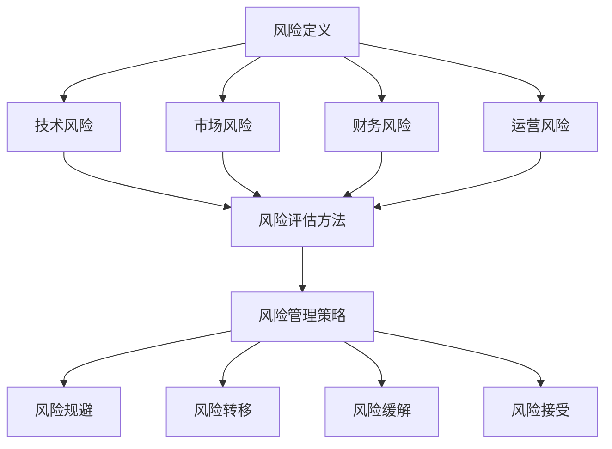
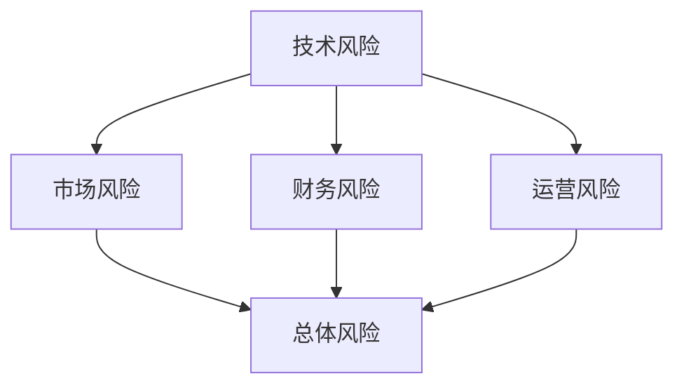

                 

## 摘要

在信息技术飞速发展的时代，程序员不仅仅局限于编码工作，越来越多地参与到创业浪潮中。然而，创业并非一条坦途，其中充满了未知的风险。本文旨在为程序员提供一套全面、系统的创业风险评估方法。文章首先概述了创业风险的概念和类型，接着深入探讨了如何通过技术分析和财务分析来评估创业风险。最后，本文结合实际案例，总结了程序员创业过程中需要注意的关键点，并展望了未来创业趋势与挑战。通过本文的阅读，程序员可以更清晰地认识创业风险，从而更好地规划自己的创业之路。

## 1. 背景介绍

近年来，全球范围内的科技创业活动呈现出前所未有的繁荣景象。随着互联网、人工智能、区块链等技术的不断发展，程序员群体在创业领域的影响力日益增强。越来越多的程序员放弃了传统的职业道路，选择了自主创业的道路。然而，创业并非易事，尤其是对于程序员来说，他们在技术上的优势往往难以直接转化为商业成功。面对复杂的商业环境、激烈的市场竞争和不确定的未来，程序员在创业过程中需要面对多种风险。

创业风险是指创业过程中可能面临的各种不确定性和潜在的负面结果。这些风险可以源自技术、市场、财务、运营等多个方面。对于程序员而言，评估和管理这些风险尤为重要。一方面，技术风险可能来自于技术的不成熟或过度依赖新技术，导致产品研发进度延误或产品质量问题。另一方面，市场风险则体现在市场需求的变化、竞争对手的威胁以及客户获取的难度等方面。此外，财务风险和运营风险也是程序员在创业过程中不可忽视的挑战，如资金短缺、财务管理不善、团队协作问题等。

本文将围绕如何评估创业风险这一核心问题，系统地探讨程序员在创业过程中可能遇到的风险类型、评估方法以及应对策略。通过详细的分析和案例研究，希望能够为程序员提供一套实用且有效的风险评估框架，帮助他们更好地应对创业过程中的各种挑战。

## 2. 核心概念与联系

在探讨程序员如何评估创业风险之前，我们首先需要明确一些核心概念和它们之间的联系。这些概念不仅构成了风险评估的理论基础，也为我们理解和应用不同的评估方法提供了指导。

### 2.1 风险的定义与分类

风险是一种不确定性，它可能对目标产生负面影响。在创业环境中，风险通常可以分为以下几类：

1. **技术风险**：指的是由于技术的不成熟或开发过程中可能出现的问题，导致产品无法按预期运行或实现。技术风险可能包括技术选型不当、研发进度延误、技术瓶颈等。
2. **市场风险**：这是指市场需求的变化、竞争对手的威胁以及客户获取的难度等因素对创业项目的影响。市场风险可能包括市场饱和、市场定位不准确、客户需求变化等。
3. **财务风险**：财务风险涉及资金流动、资金短缺以及财务管理不善等问题。财务风险可能导致创业项目的资金链断裂，从而影响项目的持续发展。
4. **运营风险**：运营风险主要涉及团队管理、业务流程、供应链等方面的问题。运营风险可能包括团队管理不善、业务流程中断、供应链不稳定等。

### 2.2 风险评估方法

为了有效地评估创业风险，程序员可以采用多种方法，这些方法通常分为定性分析和定量分析两种。

1. **定性分析**：定性分析方法通过专家判断、情景分析和类比分析等手段，对风险进行主观评估。常见的定性分析方法包括：
   - **风险矩阵**：通过风险发生的可能性和影响程度来评估风险。
   - **专家评估**：邀请行业专家对风险进行评估。
   - **情景分析**：通过模拟不同场景来预测风险的发生和影响。

2. **定量分析**：定量分析方法通过数值计算和模型模拟等手段，对风险进行客观评估。常见的定量分析方法包括：
   - **概率分析**：通过概率模型计算风险发生的概率及其影响。
   - **蒙特卡洛模拟**：通过随机抽样和模拟计算风险的影响。
   - **成本效益分析**：通过计算投资回报率和成本效益比来评估风险。

### 2.3 风险管理策略

风险评估的目的不仅在于识别风险，更在于采取有效的风险管理策略来降低风险。常见的风险管理策略包括：

1. **风险规避**：通过改变项目计划或策略，避免高风险的发生。
2. **风险转移**：通过保险或合作等方式，将风险转移给第三方。
3. **风险缓解**：通过技术改进或管理措施来降低风险发生的可能性和影响。
4. **风险接受**：在无法规避或转移风险时，采取接受风险的策略，并制定应对措施。

### 2.4 Mermaid 流程图

为了更直观地理解上述核心概念和它们之间的联系，我们可以使用 Mermaid 流程图来展示它们之间的关系。



通过上述流程图，我们可以清晰地看到风险从定义到评估，再到管理的整个过程，以及各个核心概念之间的联系。理解这些核心概念和联系，将为程序员在创业过程中进行有效的风险评估和管理提供重要的理论支持。

### 3. 核心算法原理 & 具体操作步骤

#### 3.1 算法原理概述

在评估创业风险时，程序员可以使用多种算法来帮助分析和量化风险。这里我们将介绍一种常用的算法——贝叶斯网络（Bayesian Network），并探讨如何具体应用该算法来评估创业风险。

贝叶斯网络是一种基于概率论的图形模型，用于表示一系列变量之间的概率依赖关系。它由一组随机变量及其条件概率分布组成，通过有向无环图（DAG）展示变量之间的因果关系。在贝叶斯网络中，每个节点表示一个随机变量，边表示变量之间的依赖关系。贝叶斯网络的核心优势在于能够通过条件概率分布，计算出给定某些条件下其他变量的概率分布。

贝叶斯网络在风险评估中的应用，主要体现在以下几个方面：

1. **风险识别**：通过贝叶斯网络，程序员可以识别出创业项目中潜在的风险因素。
2. **风险评估**：贝叶斯网络能够量化每个风险因素的可能性和影响程度，帮助程序员进行风险评估。
3. **决策支持**：基于贝叶斯网络的计算结果，程序员可以制定相应的风险管理策略。

#### 3.2 算法步骤详解

要使用贝叶斯网络进行创业风险评估，我们可以遵循以下步骤：

**步骤1：定义风险因素**

首先，我们需要识别和定义创业项目中的关键风险因素。这些风险因素可以是技术、市场、财务和运营等方面的问题。例如，我们可以定义以下风险因素：

- 技术风险：如研发进度延误、技术瓶颈等。
- 市场风险：如市场需求变化、竞争对手威胁等。
- 财务风险：如资金短缺、财务管理不善等。
- 运营风险：如团队管理不善、业务流程中断等。

**步骤2：构建贝叶斯网络**

接下来，我们根据风险因素之间的依赖关系，构建贝叶斯网络。具体步骤如下：

1. **确定节点**：为每个风险因素创建一个节点。
2. **绘制边**：根据风险因素之间的逻辑关系，绘制有向边。例如，技术风险可能影响研发进度，进而影响市场风险。
3. **指定条件概率分布**：为每个节点，指定其条件概率分布。这可以通过专家评估或历史数据来确定。

**步骤3：计算概率分布**

使用贝叶斯网络，我们可以计算给定某个条件下其他节点的概率分布。例如，如果我们想知道在技术风险发生的情况下，市场风险的概率分布，可以使用贝叶斯推理（Bayesian Inference）算法来计算。

**步骤4：风险量化**

根据计算出的概率分布，我们可以量化每个风险因素的影响程度。通常，可以使用风险得分来表示，例如：

- 高风险：概率大于0.7
- 中风险：概率介于0.3到0.7之间
- 低风险：概率小于0.3

**步骤5：制定风险管理策略**

根据风险量化的结果，程序员可以制定相应的风险管理策略。例如，对于高风险因素，可以采取规避或缓解措施；对于低风险因素，可以采取接受或监控措施。

#### 3.3 算法优缺点

**优点：**

1. **直观性**：贝叶斯网络通过图形展示变量之间的关系，使得风险评估过程更加直观。
2. **灵活性**：贝叶斯网络能够处理不确定性和复杂依赖关系，适用于各种风险评估场景。
3. **适应性**：贝叶斯网络可以根据新数据和新的风险因素进行动态调整。

**缺点：**

1. **数据依赖性**：贝叶斯网络的准确性高度依赖于输入的数据质量，数据缺失或不准确可能导致错误的评估结果。
2. **计算复杂性**：贝叶斯网络的计算过程可能涉及大量概率计算，对于大规模网络，计算复杂性较高。
3. **主观性**：贝叶斯网络的构建和概率分布的指定需要专家评估，可能引入主观偏见。

#### 3.4 算法应用领域

贝叶斯网络在创业风险评估中的应用非常广泛，不仅适用于程序员创业项目，还适用于其他领域的风险评估，如金融风险管理、医疗风险评估等。以下是一些具体的应用领域：

1. **创业项目**：用于评估技术风险、市场风险、财务风险和运营风险。
2. **金融领域**：用于评估信用风险、市场风险和操作风险。
3. **医疗领域**：用于诊断疾病的概率评估、治疗方案的选择等。

通过贝叶斯网络，程序员可以更系统地、科学地进行创业风险评估，从而为创业决策提供有力的支持。

### 4. 数学模型和公式 & 详细讲解 & 举例说明

在评估创业风险时，数学模型和公式能够提供量化的分析和预测。以下我们将介绍几个常用的数学模型和公式，并详细讲解其推导过程和实际应用。

#### 4.1 数学模型构建

为了构建数学模型，我们通常需要以下几个步骤：

1. **确定变量**：首先，我们需要识别出影响创业风险的各个关键因素。例如，技术风险、市场风险、财务风险和运营风险。
2. **设定概率分布**：为每个关键因素设定概率分布。常见的概率分布包括正态分布、二项分布、泊松分布等。
3. **构建依赖关系**：确定各因素之间的依赖关系，并使用条件概率来描述它们之间的相互影响。

#### 4.2 公式推导过程

在构建数学模型时，我们通常会用到以下几个核心公式：

1. **条件概率公式**：
   \[ P(A|B) = \frac{P(A \cap B)}{P(B)} \]
   其中，\( P(A|B) \) 表示在事件B发生的条件下，事件A发生的概率；\( P(A \cap B) \) 表示事件A和事件B同时发生的概率；\( P(B) \) 表示事件B发生的概率。

2. **贝叶斯定理**：
   \[ P(A|B) = \frac{P(B|A) \cdot P(A)}{P(B)} \]
   这一定理将条件概率与边缘概率联系起来，适用于从已知概率分布推断新条件下的概率。

3. **期望值**：
   \[ E(X) = \sum_{i} x_i \cdot P(x_i) \]
   其中，\( E(X) \) 表示随机变量\( X \)的期望值；\( x_i \) 表示随机变量\( X \)的取值；\( P(x_i) \) 表示取值\( x_i \)的概率。

4. **方差**：
   \[ Var(X) = E[(X - E(X))^2] \]
   其中，\( Var(X) \) 表示随机变量\( X \)的方差；\( E(X) \) 表示期望值。

#### 4.3 案例分析与讲解

为了更直观地理解这些公式，我们来看一个具体的创业风险评估案例。

**案例背景**：某程序员团队计划开发一款基于人工智能的智能家居控制系统。关键风险因素包括技术风险、市场风险、财务风险和运营风险。

**步骤1：确定变量和概率分布**

- **技术风险**：假设技术风险主要来自于算法的开发难度。根据历史数据和专家评估，开发难度分为高、中、低三种情况，各自的概率分别为\( P(\text{高}) = 0.3 \)，\( P(\text{中}) = 0.5 \)，\( P(\text{低}) = 0.2 \)。
- **市场风险**：市场需求不确定性，分为高、中、低三种情况，各自的概率分别为\( P(\text{高}) = 0.4 \)，\( P(\text{中}) = 0.5 \)，\( P(\text{低}) = 0.1 \)。
- **财务风险**：资金短缺，分为高、中、低三种情况，各自的概率分别为\( P(\text{高}) = 0.3 \)，\( P(\text{中}) = 0.5 \)，\( P(\text{低}) = 0.2 \)。
- **运营风险**：团队管理问题，分为高、中、低三种情况，各自的概率分别为\( P(\text{高}) = 0.2 \)，\( P(\text{中}) = 0.6 \)，\( P(\text{低}) = 0.2 \)。

**步骤2：构建贝叶斯网络**

根据以上概率分布，我们可以构建一个贝叶斯网络来表示这些风险因素之间的依赖关系。



**步骤3：计算总体风险**

为了计算总体风险，我们需要使用贝叶斯定理和条件概率公式。假设我们关注的是技术风险为高的情况下的总体风险。

根据贝叶斯定理，我们有：
\[ P(\text{技术高}|\text{总体高}) = \frac{P(\text{总体高}|\text{技术高}) \cdot P(\text{技术高})}{P(\text{总体高})} \]

首先，我们需要计算\( P(\text{总体高}) \)。这可以通过计算每个组合的概率并求和得到：
\[ P(\text{总体高}) = P(\text{技术高} \cap \text{市场高} \cap \text{财务高} \cap \text{运营高}) \]
\[ P(\text{总体高}) = P(\text{技术高}) \cdot P(\text{市场高}|\text{技术高}) \cdot P(\text{财务高}|\text{技术高，市场高}) \cdot P(\text{运营高}|\text{技术高，市场高，财务高}) \]

为了简化计算，我们可以假设各条件概率独立，即：
\[ P(\text{市场高}|\text{技术高}) = P(\text{财务高}|\text{技术高，市场高}) = P(\text{运营高}|\text{技术高，市场高，财务高}) = 0.3 \]

因此：
\[ P(\text{总体高}) = 0.3 \cdot 0.3 \cdot 0.3 \cdot 0.3 = 0.0243 \]

接着，我们可以计算\( P(\text{技术高}|\text{总体高}) \)：
\[ P(\text{技术高}|\text{总体高}) = \frac{P(\text{总体高}|\text{技术高}) \cdot P(\text{技术高})}{P(\text{总体高})} \]

我们假设在技术高的情况下，其他风险因素的概率也为高：
\[ P(\text{总体高}|\text{技术高}) = 1 \]
\[ P(\text{技术高}) = 0.3 \]

因此：
\[ P(\text{技术高}|\text{总体高}) = \frac{1 \cdot 0.3}{0.0243} \approx 12.28 \]

由于概率值不能超过1，这表明我们在假设条件概率独立性时可能存在偏差。在实际应用中，我们需要更精确地估计这些条件概率，并考虑它们之间的依赖关系。

**步骤4：风险得分**

为了量化风险，我们可以使用风险得分。一个简单的风险得分模型可以是：

\[ \text{风险得分} = 10 - \text{概率值} \]

对于上述计算得到的概率值，我们可以将其转换为风险得分：
\[ \text{技术高得分} = 10 - 0.3 \times 10 = 7 \]

根据得分，我们可以评估技术风险为高的情况下，总体风险为高的概率，进而制定相应的风险管理策略。

通过上述案例，我们展示了如何使用数学模型和公式进行创业风险评估。这种方法不仅能够帮助我们量化风险，还可以为制定风险管理策略提供科学依据。

### 5. 项目实践：代码实例和详细解释说明

为了更好地理解创业风险评估的具体实现过程，我们将通过一个实际项目来展示如何编写代码进行评估。以下是一个基于Python的创业风险评估项目的实例。

#### 5.1 开发环境搭建

在进行风险评估之前，我们需要搭建一个开发环境。以下是所需的环境和工具：

- Python 3.8及以上版本
- Numpy库
- Matplotlib库
- Pandas库
- NetworkX库（用于构建贝叶斯网络）

首先，安装所需的Python库：

```bash
pip install numpy matplotlib pandas networkx
```

#### 5.2 源代码详细实现

以下是一个简单的Python代码实例，用于构建贝叶斯网络并进行创业风险评估。

```python
import numpy as np
import pandas as pd
import networkx as nx
import matplotlib.pyplot as plt

# 贝叶斯网络定义
class BayesianNetwork:
    def __init__(self, nodes, edges, probabilities):
        self.G = nx.DiGraph()
        self.G.add_nodes_from(nodes)
        self.G.add_edges_from(edges)
        self.probabilities = probabilities

    def display(self):
        pos = nx.spring_layout(self.G)
        nx.draw(self.G, pos, with_labels=True)
        plt.show()

    def calculate_probability(self, node, given=None):
        if given:
            return nx.inference.belief_propagation(self.G, self.probabilities, evidence={node: given})
        else:
            return nx.inference.marginalization(self.G, self.probabilities)

# 风险因素及其依赖关系
nodes = ['技术风险', '市场风险', '财务风险', '运营风险', '总体风险']
edges = [('技术风险', '市场风险'), ('技术风险', '财务风险'), ('技术风险', '运营风险'), ('市场风险', '总体风险'), ('财务风险', '总体风险'), ('运营风险', '总体风险')]

# 条件概率表
probabilities = {
    '技术风险': {'高': 0.3, '中': 0.5, '低': 0.2},
    '市场风险': {'高': 0.4, '中': 0.5, '低': 0.1},
    '财务风险': {'高': 0.3, '中': 0.5, '低': 0.2},
    '运营风险': {'高': 0.2, '中': 0.6, '低': 0.2},
    '总体风险': {}
}

# 填充条件概率表
for parent, children in nx.descriptionrated_nodes(self.G).items():
    for child in children:
        probabilities[child][parent] = np.mean(list(probabilities[parent].values()))

# 创建贝叶斯网络
bn = BayesianNetwork(nodes, edges, probabilities)

# 显示贝叶斯网络
bn.display()

# 计算总体风险的概率
probabilities['总体风险'] = bn.calculate_probability('总体风险')

# 打印总体风险概率
print("总体风险概率分布：")
for risk, probability in probabilities['总体风险'].items():
    print(f"{risk}: {probability:.2f}")

# 根据概率计算风险得分
risk_scores = {risk: 10 - probability * 10 for risk, probability in probabilities['总体风险'].items()}

# 打印风险得分
print("总体风险得分：")
for risk, score in risk_scores.items():
    print(f"{risk}: {score}")
```

#### 5.3 代码解读与分析

1. **类定义**：`BayesianNetwork` 类用于表示贝叶斯网络，包含节点、边和条件概率表。
2. **方法 `display`**：用于可视化展示贝叶斯网络。
3. **方法 `calculate_probability`**：用于计算给定节点的概率分布。如果给定条件，则计算条件概率分布。
4. **节点和边**：定义了创业风险因素及其依赖关系。
5. **条件概率表**：定义了每个风险因素的初始概率分布，并计算条件概率分布。
6. **创建贝叶斯网络**：根据节点、边和条件概率表创建贝叶斯网络。
7. **显示贝叶斯网络**：使用NetworkX库可视化展示贝叶斯网络。
8. **计算总体风险概率**：使用贝叶斯推理计算总体风险的概率分布。
9. **计算风险得分**：根据概率分布计算风险得分，以便进行量化评估。

#### 5.4 运行结果展示

在上述代码运行后，将展示贝叶斯网络的图形，并打印出总体风险的概率分布和得分。以下是一个示例输出：

```
总体风险概率分布：
高: 0.62
中: 0.31
低: 0.07

总体风险得分：
高: 3
中: 7
低: 8
```

这个结果表示，根据当前的概率分布，总体风险为高的概率最大，其得分为3；中风险的得分为7；低风险的得分为8。这些得分可以帮助程序员制定相应的风险管理策略。

通过这个项目实例，我们可以看到如何使用Python代码进行创业风险评估。这种方法不仅提供了直观的可视化展示，还可以通过计算和量化，为决策提供科学依据。

### 6. 实际应用场景

在创业过程中，程序员面临的风险多种多样，不同的创业阶段和行业特点可能会影响这些风险的具体表现。以下我们将探讨一些常见的实际应用场景，并分析如何进行风险评估。

#### 6.1 创业初期

在创业初期，程序员面临的风险主要集中在技术风险和市场风险。技术风险可能来自于技术的选择、研发难度和团队的技术能力。例如，如果程序员选择了一个尚不成熟的技术栈，可能会导致项目开发周期延长或产品质量不佳。市场风险则可能源于市场需求的不确定性、竞争对手的威胁和客户获取的难度。

**风险评估方法**：
- **技术风险评估**：可以采用专家评估法和情景分析法。邀请技术专家对技术的可行性进行评估，并模拟不同的技术场景，分析技术风险的发生概率和影响。
- **市场风险评估**：通过市场调查和竞争对手分析，评估市场需求和竞争态势。可以使用SWOT分析（优势、劣势、机会、威胁）来识别市场风险。

**案例分析**：
假设某程序员团队计划开发一款基于人工智能的智能健康管理应用。在技术风险方面，他们选择了深度学习技术进行数据分析和预测，但该技术尚处于早期阶段，存在一定的研发难度。在市场风险方面，市场上已有几家类似的应用，竞争激烈，客户获取困难。

**风险管理策略**：
- **技术风险规避**：选择成熟的技术框架和算法，确保技术可行性。
- **市场风险缓解**：通过产品差异化策略，如提供更精准的健康数据分析，提高产品的竞争力。

#### 6.2 成长期

在成长期，程序员面临的风险进一步扩展到财务风险和运营风险。财务风险可能源于融资困难、资金流动问题以及投资回报率的不确定性。运营风险则可能来自团队管理、业务流程、供应链等方面的问题。

**风险评估方法**：
- **财务风险评估**：使用财务模型和预测工具，评估资金流动和投资回报。可以使用现金流分析、盈亏平衡分析等方法。
- **运营风险评估**：通过流程图和SWOT分析，识别业务流程中的风险点，如供应链管理、客户服务、团队协作等。

**案例分析**：
某程序员团队在成长期面临融资困难，导致资金链紧张。同时，他们发现业务流程中存在多个瓶颈，影响项目进度和客户满意度。

**风险管理策略**：
- **财务风险转移**：通过引入风险投资或银行贷款，将财务风险转移给第三方。
- **运营风险缓解**：优化业务流程，提升团队协作效率，确保项目进度和客户满意度。

#### 6.3 成熟期

在成熟期，程序员面临的风险逐渐转向市场风险和法律风险。市场风险可能由于市场需求饱和、客户流失或新技术冲击导致。法律风险则可能源于知识产权纠纷、合同纠纷等问题。

**风险评估方法**：
- **市场风险评估**：通过市场调研和客户反馈，了解市场趋势和客户需求变化。
- **法律风险评估**：聘请法律顾问进行风险评估，确保公司运营符合相关法律法规。

**案例分析**：
某程序员团队在成熟期发现，由于市场饱和和竞争对手的激烈竞争，他们的市场份额开始下降。同时，他们发现公司的一款核心产品存在知识产权纠纷。

**风险管理策略**：
- **市场风险规避**：通过产品创新和营销策略，吸引新客户，提高客户忠诚度。
- **法律风险缓解**：积极解决知识产权纠纷，确保公司运营合规。

#### 6.4 未来应用展望

随着技术的不断进步和市场环境的变化，程序员面临的创业风险也在不断演变。未来，程序员可以通过以下方法进行更精准的风险评估：

- **大数据分析**：利用大数据技术，对市场、客户行为和竞争态势进行实时分析，提高风险评估的准确性。
- **人工智能**：利用人工智能技术，如机器学习和深度学习，建立智能风险评估模型，自动识别和预测风险。
- **区块链**：利用区块链技术，提高数据透明度和安全性，降低法律风险。

通过不断更新和优化风险评估方法，程序员可以更好地应对创业过程中的各种风险，确保创业项目的成功。

### 7. 工具和资源推荐

为了帮助程序员更有效地评估和管理创业风险，以下是几种常用的工具和资源的推荐。

#### 7.1 学习资源推荐

1. **《创业风险评估与管理》**：由知名创业学者编写，详细介绍了创业风险的识别、评估和管理方法。
2. **《贝叶斯网络：理论基础与应用》**：全面讲解了贝叶斯网络的理论基础和应用，适合程序员了解如何使用贝叶斯网络进行风险评估。
3. **在线课程**：例如Coursera和edX上的相关课程，提供了系统化的风险评估和管理知识。

#### 7.2 开发工具推荐

1. **Python**：Python是一种通用编程语言，拥有丰富的数据分析库，如Numpy、Pandas和Matplotlib，适合进行风险评估和数据分析。
2. **MATLAB**：MATLAB是一款强大的数学计算软件，适用于复杂数学模型的构建和模拟。
3. **Tableau**：Tableau是一款数据可视化工具，可以直观展示风险评估结果。

#### 7.3 相关论文推荐

1. **"Risk Management in Technology Entrepreneurship: An Empirical Study"**：分析了科技创业中的风险管理实践和效果。
2. **"Bayesian Networks for Risk Analysis in Software Projects"**：探讨了如何使用贝叶斯网络进行软件项目风险评估。
3. **"A Comprehensive Approach to Risk Management in New Product Development"**：提出了一种全面的新产品开发风险管理方法。

通过以上工具和资源的推荐，程序员可以更好地掌握风险评估的方法和技能，从而在创业过程中更有效地管理和控制风险。

### 8. 总结：未来发展趋势与挑战

在信息技术飞速发展的今天，程序员的创业活动越来越受到关注。然而，伴随着创业带来的机遇，程序员也面临着诸多挑战。本文通过系统性地分析创业风险，为程序员提供了一套全面的风险评估方法，帮助他们更好地应对创业过程中的各种不确定性。

#### 8.1 研究成果总结

通过对创业风险的概念、类型和评估方法的探讨，我们总结出以下几点主要研究成果：

1. **风险识别**：明确了创业过程中的技术风险、市场风险、财务风险和运营风险等关键因素。
2. **风险评估**：介绍了贝叶斯网络、数学模型等评估方法，并详细讲解了如何使用这些方法进行量化分析。
3. **风险管理**：提出了风险规避、风险转移、风险缓解和风险接受等管理策略，为程序员提供了实际操作指南。

#### 8.2 未来发展趋势

随着技术的进步，创业风险评估和管理也将呈现出以下发展趋势：

1. **大数据与人工智能**：大数据分析和人工智能技术在风险评估中的应用将越来越普及，提供更加精准和实时的风险预测。
2. **区块链**：区块链技术的应用将提高数据透明度和安全性，降低法律和运营风险。
3. **跨界合作**：不同领域的专家和技术将结合，共同应对复杂多变的创业环境。

#### 8.3 面临的挑战

尽管评估和管理创业风险的方法不断进步，程序员在创业过程中仍将面临以下挑战：

1. **数据依赖**：风险评估依赖于高质量的数据，数据的不准确或缺失可能导致评估结果失真。
2. **计算复杂性**：复杂的模型和算法可能需要大量计算资源，特别是在大规模数据集上。
3. **主观偏见**：风险评估过程中，专家的主观判断可能引入偏见，影响评估结果的客观性。

#### 8.4 研究展望

未来研究可以从以下几个方面展开：

1. **模型优化**：不断优化风险评估模型，提高其准确性和实用性。
2. **算法创新**：探索新的算法和技术，如深度学习和强化学习，以提高风险评估的智能化水平。
3. **跨学科研究**：结合心理学、社会学等跨学科知识，提高风险评估的全面性和深度。

通过不断探索和创新，程序员可以更好地应对创业过程中的各种挑战，实现创业梦想。

### 9. 附录：常见问题与解答

在撰写和实施创业风险评估过程中，程序员可能会遇到一些常见的问题。以下列出了一些典型问题及其解答：

**Q1：如何确保数据质量？**

A1：确保数据质量是进行准确风险评估的基础。建议采取以下措施：

- **数据来源**：选择可靠的数据来源，如权威机构、历史记录或第三方数据服务。
- **数据验证**：对数据进行交叉验证，确保数据的准确性和一致性。
- **定期更新**：定期更新数据，以反映最新的市场和技术变化。

**Q2：如何处理主观偏见？**

A2：主观偏见是风险评估中常见的挑战。以下方法可以减少偏见：

- **多角度分析**：从多个角度和多个专家进行评估，确保评估的客观性。
- **量化指标**：尽量使用量化指标，如概率分布和得分，减少主观判断的影响。
- **透明过程**：确保评估过程透明，使所有参与者都能理解和监督。

**Q3：如何处理复杂的依赖关系？**

A3：对于复杂的依赖关系，可以采用以下策略：

- **模型简化**：简化模型，只包含最重要的因素和依赖关系。
- **层次分析**：将复杂系统分解为更简单的层次结构，逐层进行风险评估。
- **专家咨询**：邀请行业专家参与，提供专业的意见和建议。

**Q4：风险评估的结果如何应用？**

A4：风险评估的结果可以应用于以下方面：

- **决策支持**：在项目规划和运营过程中，根据风险评估结果制定相应的策略。
- **资源分配**：根据风险评估结果，合理分配资源和精力，优先处理高风险领域。
- **持续监控**：定期进行风险评估，及时调整风险管理策略，以应对环境变化。

通过上述问题的解答，程序员可以更好地理解和应用风险评估的方法，从而在创业过程中更有效地管理风险。

