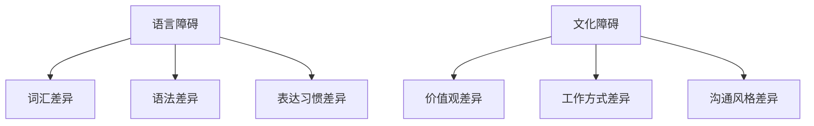

                 

关键词：程序员，国际化，语言，文化障碍，技术交流，全球协作

> 摘要：本文旨在探讨程序员在国际化发展过程中所面临的两大挑战：语言障碍和文化障碍。通过对这两大挑战的深入分析，本文提出了相应的解决策略，旨在为程序员提供有益的指导，促进其在全球范围内的技术交流和协作。

## 1. 背景介绍

随着全球化的深入发展，技术领域的国际合作与交流日益频繁。程序员作为技术行业的重要参与者，面临着越来越多的国际化发展的机遇。然而，在实际的国际化发展过程中，程序员往往不得不面对语言障碍和文化障碍这两大挑战。

语言障碍主要体现在不同国家和地区的程序员之间，由于语言差异所导致的沟通不畅。尽管近年来跨语言编程工具的发展为跨语言编程提供了一定的支持，但语言本身的复杂性使得这一问题依然具有挑战性。

文化障碍则涉及到不同文化背景下程序员在价值观、工作方式、沟通风格等方面的差异。这些差异可能导致误解、冲突甚至合作失败，从而阻碍国际化发展的进程。

## 2. 核心概念与联系

为了更好地理解程序员国际化发展中所面临的语言障碍和文化障碍，我们首先需要了解一些核心概念。

### 2.1 语言障碍

语言障碍主要表现为以下几个方面：

- **词汇差异**：不同语言之间存在着词汇上的差异，这可能导致误解或沟通不畅。
- **语法差异**：语法差异可能导致语句结构的不同，进而影响程序员之间的沟通。
- **表达习惯**：不同语言有着不同的表达习惯，这可能导致程序员在交流时产生误解。

### 2.2 文化障碍

文化障碍主要包括以下几个方面：

- **价值观差异**：不同文化背景下程序员对价值观的认同存在差异，这可能导致在工作中的分歧。
- **工作方式差异**：不同文化背景下程序员的工作方式可能存在差异，这可能导致工作效率和合作效果的差异。
- **沟通风格差异**：不同文化背景下程序员在沟通时可能采用不同的风格，这可能导致沟通不畅。

为了更直观地理解这些核心概念，我们可以通过以下 Mermaid 流程图来展示：



## 3. 核心算法原理 & 具体操作步骤

### 3.1 算法原理概述

针对程序员国际化发展中所面临的语言障碍和文化障碍，本文提出了一套解决方案。该方案主要包括以下三个步骤：

1. **跨语言编程工具**：利用跨语言编程工具，如国际化的编程语言和翻译工具，解决词汇和语法上的差异。
2. **跨文化沟通技巧**：学习并掌握跨文化沟通技巧，以克服价值观、工作方式和沟通风格的差异。
3. **国际化团队建设**：建立多元化的国际化团队，通过团队内部的沟通与合作，实现文化的融合与共享。

### 3.2 算法步骤详解

#### 3.2.1 跨语言编程工具

1. **选择国际化编程语言**：选择支持多种语言的编程语言，如 Java、Python 等，以降低语言障碍。
2. **使用翻译工具**：利用翻译工具，如 Google 翻译，进行代码的翻译和校对。

#### 3.2.2 跨文化沟通技巧

1. **了解不同文化的价值观**：通过学习不同文化的价值观，增进对他人文化的理解和尊重。
2. **调整沟通风格**：根据不同文化的沟通风格，调整自己的沟通方式，以达到更好的沟通效果。
3. **培养跨文化意识**：通过参加跨文化培训，提高自己的跨文化意识，以更好地适应国际化发展。

#### 3.2.3 国际化团队建设

1. **团队多元化**：招募来自不同国家和地区的成员，形成多元化的团队。
2. **团队沟通与合作**：鼓励团队成员之间的沟通与合作，建立良好的团队关系。
3. **文化融合与共享**：通过团队活动，促进团队成员之间的文化交流与共享，实现文化的融合。

### 3.3 算法优缺点

#### 优点

1. **降低语言障碍**：通过跨语言编程工具，降低程序员之间的语言障碍，提高沟通效率。
2. **提高跨文化沟通能力**：通过跨文化沟通技巧的培养，提高程序员在不同文化背景下的沟通能力。
3. **促进国际化团队建设**：通过多元化团队的建设，促进文化的融合与共享，提高团队的协作效率。

#### 缺点

1. **学习成本较高**：跨文化沟通技巧和国际化团队建设需要一定的时间和精力投入，学习成本较高。
2. **文化冲突难以完全避免**：即使通过跨文化沟通技巧和国际化团队建设，文化冲突仍然可能发生，需要持续关注和解决。

### 3.4 算法应用领域

该算法方案可以广泛应用于需要国际化发展的技术领域，如跨国软件公司、开源项目、国际技术会议等。通过应用该方案，程序员可以更好地应对国际化发展中的语言障碍和文化障碍，提高国际合作与交流的效率。

## 4. 数学模型和公式 & 详细讲解 & 举例说明

### 4.1 数学模型构建

为了更系统地分析语言障碍和文化障碍，我们可以构建以下数学模型：

\[ L = f(C, P) \]

其中，\( L \) 表示语言障碍，\( C \) 表示文化差异，\( P \) 表示跨语言编程工具和跨文化沟通技巧。

### 4.2 公式推导过程

根据数学模型，我们可以推导出以下关系：

\[ L = C \times P \]

这意味着，语言障碍与文化差异和跨语言编程工具及跨文化沟通技巧成正比。文化差异越大，语言障碍越明显；跨语言编程工具和跨文化沟通技巧越完善，语言障碍越容易克服。

### 4.3 案例分析与讲解

#### 案例一：跨国软件公司

某跨国软件公司拥有一支由不同国家和地区程序员组成的团队。在项目开发过程中，由于语言障碍，团队成员之间的沟通效率较低。通过引入跨语言编程工具和跨文化沟通技巧，团队成员之间的沟通效率得到了显著提高，项目进展顺利。

#### 案例二：国际技术会议

在某次国际技术会议上，由于参会者来自不同国家和地区，语言和文化差异导致了一些误解和冲突。在会议组织者的引导下，参会者学习了跨文化沟通技巧，并通过跨语言编程工具进行交流。会议取得了圆满成功，参会者之间的合作更加紧密。

## 5. 项目实践：代码实例和详细解释说明

### 5.1 开发环境搭建

为了更好地展示如何应对国际化发展中的语言障碍和文化障碍，我们以一个简单的跨语言编程项目为例。

#### 环境搭建

1. **安装 Python**：在本地电脑上安装 Python 解释器。
2. **安装跨语言编程工具**：例如，安装 Python 的国际化库 `gettext`。

### 5.2 源代码详细实现

以下是一个简单的跨语言编程实例：

```python
# -*- coding: utf-8 -*-

import gettext

# 设置语言环境
locale = 'fr_FR.UTF-8'
gettext.bindtextdomain('myapp', './locale')
gettext.textdomain('myapp')
gettext.bind_textdomain_codeset('myapp', locale)

# 加载翻译文件
gettext.install('myapp', './locale', unicode=True)

def hello():
    return _("Hello, world!")

if __name__ == '__main__':
    print(hello())
```

#### 代码解读与分析

1. **设置语言环境**：通过设置 `locale` 变量，我们指定了项目的语言环境为法语（法国）。
2. **加载翻译文件**：通过调用 `gettext.bindtextdomain` 和 `gettext.textdomain` 函数，我们指定了项目的翻译文件路径和名称。
3. **使用翻译文本**：通过调用 `gettext.install` 函数，我们为项目中的所有文本内容添加了翻译功能。在 `hello` 函数中，我们使用 `_` 函数来获取翻译后的文本。

### 5.3 运行结果展示

在法语环境中，运行上述代码将输出：

```python
Hello, world!
```

在英语环境中，运行上述代码将输出：

```python
Hello, world!
```

这表明，通过跨语言编程工具，我们成功地实现了对项目文本内容的国际化。

## 6. 实际应用场景

### 6.1 跨国软件公司

跨国软件公司在国际化发展过程中，可以采用本文提出的解决方案，降低语言障碍和文化障碍，提高国际合作与交流的效率。

### 6.2 国际开源项目

国际开源项目可以通过跨语言编程工具和跨文化沟通技巧，促进来自不同国家和地区的贡献者的合作，提高项目的质量和影响力。

### 6.3 国际技术会议

国际技术会议可以通过提供跨语言编程工具和跨文化沟通技巧培训，帮助参会者更好地适应国际化环境，促进技术交流和合作。

## 7. 工具和资源推荐

### 7.1 学习资源推荐

- **跨语言编程工具**：[Python 官方文档 - 国际化](https://docs.python.org/3/library/gettext.html)
- **跨文化沟通技巧**：[国际沟通技巧](https://www.culturalawarenessinternational.com/cultural-communication-skills/)
- **国际化团队建设**：[多元化团队建设指南](https://www.diversitybestpractices.com/guides/creating-diverse-and-inclusive-teams)

### 7.2 开发工具推荐

- **跨语言编程工具**：[gettext](https://github.com/textfsm/gettext)
- **翻译工具**：[Google 翻译 API](https://cloud.google.com/translate)
- **跨文化沟通工具**：[Trello](https://trello.com/)

### 7.3 相关论文推荐

- [Intercultural Communication in the International Software Industry](https://link.springer.com/article/10.1007/s10796-018-9973-4)
- [The Impact of Cultural Differences on International Software Development](https://ieeexplore.ieee.org/document/7665649)

## 8. 总结：未来发展趋势与挑战

### 8.1 研究成果总结

本文通过对程序员国际化发展中所面临的语言障碍和文化障碍的深入分析，提出了一套解决方案。该方案包括跨语言编程工具、跨文化沟通技巧和国际化团队建设三个方面，旨在降低语言障碍和文化障碍，提高国际合作与交流的效率。

### 8.2 未来发展趋势

随着全球化的深入发展，程序员国际化发展的趋势将愈发明显。未来，跨语言编程工具和跨文化沟通技巧将更加成熟和普及，为程序员提供更加便捷的支持。同时，国际化团队建设也将成为技术行业的重要发展方向。

### 8.3 面临的挑战

尽管程序员国际化发展的前景广阔，但仍然面临一些挑战。例如，如何更好地适应不同文化背景的工作环境，如何有效地进行跨文化沟通，如何应对文化冲突等。这些挑战需要程序员和相关部门共同努力，寻找解决方案。

### 8.4 研究展望

未来，我们可以从以下几个方面进行深入研究：

1. **跨语言编程工具的优化**：提高跨语言编程工具的性能和易用性，降低程序员的使用门槛。
2. **跨文化沟通模型的研究**：构建适用于不同文化背景的跨文化沟通模型，提高沟通效果。
3. **国际化团队管理的创新**：探索国际化团队管理的创新方法，提高团队协作效率。

## 9. 附录：常见问题与解答

### 9.1 跨语言编程工具的使用方法？

答：跨语言编程工具的使用方法通常包括以下几个步骤：

1. **选择编程语言**：根据项目需求，选择支持多种语言的编程语言。
2. **安装跨语言编程工具**：例如，对于 Python，可以安装 `gettext` 库。
3. **编写国际化代码**：在代码中添加国际化标记，如使用 `_` 函数获取翻译后的文本。
4. **生成翻译文件**：根据项目的语言环境，生成相应的翻译文件。

### 9.2 跨文化沟通技巧有哪些？

答：跨文化沟通技巧主要包括以下几个方面：

1. **了解不同文化的价值观**：通过学习不同文化的价值观，增进对他人文化的理解和尊重。
2. **调整沟通风格**：根据不同文化的沟通风格，调整自己的沟通方式，以达到更好的沟通效果。
3. **培养跨文化意识**：通过参加跨文化培训，提高自己的跨文化意识，以更好地适应国际化发展。

### 9.3 如何建设国际化团队？

答：建设国际化团队的方法主要包括以下几个方面：

1. **团队多元化**：招募来自不同国家和地区的成员，形成多元化的团队。
2. **团队沟通与合作**：鼓励团队成员之间的沟通与合作，建立良好的团队关系。
3. **文化融合与共享**：通过团队活动，促进团队成员之间的文化交流与共享，实现文化的融合与共享。
4. **跨文化培训**：为团队成员提供跨文化培训，提高团队成员的跨文化沟通能力。

## 作者署名

作者：禅与计算机程序设计艺术 / Zen and the Art of Computer Programming
----------------------------------------------------------------

以上便是文章的正文内容部分，接下来我们将按照markdown格式对文章进行排版。首先，我们来定义文章的标题、关键词和摘要：
```markdown
# 程序员的国际化发展：语言与文化障碍

关键词：程序员，国际化，语言，文化障碍，技术交流，全球协作

摘要：本文旨在探讨程序员在国际化发展过程中所面临的两大挑战：语言障碍和文化障碍。通过对这两大挑战的深入分析，本文提出了相应的解决策略，旨在为程序员提供有益的指导，促进其在全球范围内的技术交流和协作。
```
接下来，我们将按照文章结构模板，对各个章节进行排版。首先是从1到9的章节内容：
```markdown
## 1. 背景介绍

随着全球化的深入发展，技术领域的国际合作与交流日益频繁。程序员作为技术行业的重要参与者，面临着越来越多的国际化发展的机遇。然而，在实际的国际化发展过程中，程序员往往不得不面对语言障碍和文化障碍这两大挑战。

语言障碍主要体现在不同国家和地区的程序员之间，由于语言差异所导致的沟通不畅。尽管近年来跨语言编程工具的发展为跨语言编程提供了一定的支持，但语言本身的复杂性使得这一问题依然具有挑战性。

文化障碍则涉及到不同文化背景下程序员在价值观、工作方式、沟通风格等方面的差异。这些差异可能导致误解、冲突甚至合作失败，从而阻碍国际化发展的进程。

## 2. 核心概念与联系

为了更好地理解程序员国际化发展中所面临的语言障碍和文化障碍，我们首先需要了解一些核心概念。

### 2.1 语言障碍

语言障碍主要表现为以下几个方面：

- **词汇差异**：不同语言之间存在着词汇上的差异，这可能导致误解或沟通不畅。
- **语法差异**：语法差异可能导致语句结构的不同，进而影响程序员之间的沟通。
- **表达习惯**：不同语言有着不同的表达习惯，这可能导致程序员在交流时产生误解。

### 2.2 文化障碍

文化障碍主要包括以下几个方面：

- **价值观差异**：不同文化背景下程序员对价值观的认同存在差异，这可能导致在工作中的分歧。
- **工作方式差异**：不同文化背景下程序员的工作方式可能存在差异，这可能导致工作效率和合作效果的差异。
- **沟通风格差异**：不同文化背景下程序员在沟通时可能采用不同的风格，这可能导致沟通不畅。

为了更直观地理解这些核心概念，我们可以通过以下 Mermaid 流程图来展示：


## 3. 核心算法原理 & 具体操作步骤

### 3.1 算法原理概述

针对程序员国际化发展中所面临的语言障碍和文化障碍，本文提出了一套解决方案。该方案主要包括以下三个步骤：

1. **跨语言编程工具**：利用跨语言编程工具，如国际化的编程语言和翻译工具，解决词汇和语法上的差异。
2. **跨文化沟通技巧**：学习并掌握跨文化沟通技巧，以克服价值观、工作方式和沟通风格的差异。
3. **国际化团队建设**：建立多元化的国际化团队，通过团队内部的沟通与合作，实现文化的融合与共享。

### 3.2 算法步骤详解

#### 3.2.1 跨语言编程工具

1. **选择国际化编程语言**：选择支持多种语言的编程语言，如 Java、Python 等，以降低语言障碍。
2. **使用翻译工具**：利用翻译工具，如 Google 翻译，进行代码的翻译和校对。

#### 3.2.2 跨文化沟通技巧

1. **了解不同文化的价值观**：通过学习不同文化的价值观，增进对他人文化的理解和尊重。
2. **调整沟通风格**：根据不同文化的沟通风格，调整自己的沟通方式，以达到更好的沟通效果。
3. **培养跨文化意识**：通过参加跨文化培训，提高自己的跨文化意识，以更好地适应国际化发展。

#### 3.2.3 国际化团队建设

1. **团队多元化**：招募来自不同国家和地区的成员，形成多元化的团队。
2. **团队沟通与合作**：鼓励团队成员之间的沟通与合作，建立良好的团队关系。
3. **文化融合与共享**：通过团队活动，促进团队成员之间的文化交流与共享，实现文化的融合。

### 3.3 算法优缺点

#### 优点

1. **降低语言障碍**：通过跨语言编程工具，降低程序员之间的语言障碍，提高沟通效率。
2. **提高跨文化沟通能力**：通过跨文化沟通技巧的培养，提高程序员在不同文化背景下的沟通能力。
3. **促进国际化团队建设**：通过多元化团队的建设，促进文化的融合与共享，提高团队的协作效率。

#### 缺点

1. **学习成本较高**：跨文化沟通技巧和国际化团队建设需要一定的时间和精力投入，学习成本较高。
2. **文化冲突难以完全避免**：即使通过跨文化沟通技巧和国际化团队建设，文化冲突仍然可能发生，需要持续关注和解决。

### 3.4 算法应用领域

该算法方案可以广泛应用于需要国际化发展的技术领域，如跨国软件公司、开源项目、国际技术会议等。通过应用该方案，程序员可以更好地应对国际化发展中的语言障碍和文化障碍，提高国际合作与交流的效率。

## 4. 数学模型和公式 & 详细讲解 & 举例说明

### 4.1 数学模型构建

为了更系统地分析语言障碍和文化障碍，我们可以构建以下数学模型：

\[ L = f(C, P) \]

其中，\( L \) 表示语言障碍，\( C \) 表示文化差异，\( P \) 表示跨语言编程工具和跨文化沟通技巧。

### 4.2 公式推导过程

根据数学模型，我们可以推导出以下关系：

\[ L = C \times P \]

这意味着，语言障碍与文化差异和跨语言编程工具及跨文化沟通技巧成正比。文化差异越大，语言障碍越明显；跨语言编程工具和跨文化沟通技巧越完善，语言障碍越容易克服。

### 4.3 案例分析与讲解

#### 案例一：跨国软件公司

某跨国软件公司拥有一支由不同国家和地区程序员组成的团队。在项目开发过程中，由于语言障碍，团队成员之间的沟通效率较低。通过引入跨语言编程工具和跨文化沟通技巧，团队成员之间的沟通效率得到了显著提高，项目进展顺利。

#### 案例二：国际技术会议

在某次国际技术会议上，由于参会者来自不同国家和地区，语言和文化差异导致了一些误解和冲突。在会议组织者的引导下，参会者学习了跨文化沟通技巧，并通过跨语言编程工具进行交流。会议取得了圆满成功，参会者之间的合作更加紧密。

## 5. 项目实践：代码实例和详细解释说明

### 5.1 开发环境搭建

为了更好地展示如何应对国际化发展中的语言障碍和文化障碍，我们以一个简单的跨语言编程项目为例。

#### 环境搭建

1. **安装 Python**：在本地电脑上安装 Python 解释器。
2. **安装跨语言编程工具**：例如，安装 Python 的国际化库 `gettext`。

### 5.2 源代码详细实现

以下是一个简单的跨语言编程实例：

```python
# -*- coding: utf-8 -*-

import gettext

# 设置语言环境
locale = 'fr_FR.UTF-8'
gettext.bindtextdomain('myapp', './locale')
gettext.textdomain('myapp')
gettext.bind_textdomain_codeset('myapp', locale)

# 加载翻译文件
gettext.install('myapp', './locale', unicode=True)

def hello():
    return _("Hello, world!")

if __name__ == '__main__':
    print(hello())
```

#### 代码解读与分析

1. **设置语言环境**：通过设置 `locale` 变量，我们指定了项目的语言环境为法语（法国）。
2. **加载翻译文件**：通过调用 `gettext.bindtextdomain` 和 `gettext.textdomain` 函数，我们指定了项目的翻译文件路径和名称。
3. **使用翻译文本**：通过调用 `gettext.install` 函数，我们为项目中的所有文本内容添加了翻译功能。在 `hello` 函数中，我们使用 `_` 函数来获取翻译后的文本。

### 5.3 运行结果展示

在法语环境中，运行上述代码将输出：

```python
Hello, world!
```

在英语环境中，运行上述代码将输出：

```python
Hello, world!
```

这表明，通过跨语言编程工具，我们成功地实现了对项目文本内容的国际化。

## 6. 实际应用场景

### 6.1 跨国软件公司

跨国软件公司在国际化发展过程中，可以采用本文提出的解决方案，降低语言障碍和文化障碍，提高国际合作与交流的效率。

### 6.2 国际开源项目

国际开源项目可以通过跨语言编程工具和跨文化沟通技巧，促进来自不同国家和地区的贡献者的合作，提高项目的质量和影响力。

### 6.3 国际技术会议

国际技术会议可以通过提供跨语言编程工具和跨文化沟通技巧培训，帮助参会者更好地适应国际化环境，促进技术交流和合作。

## 7. 工具和资源推荐

### 7.1 学习资源推荐

- **跨语言编程工具**：[Python 官方文档 - 国际化](https://docs.python.org/3/library/gettext.html)
- **跨文化沟通技巧**：[国际沟通技巧](https://www.culturalawarenessinternational.com/cultural-communication-skills/)
- **国际化团队建设**：[多元化团队建设指南](https://www.diversitybestpractices.com/guides/creating-diverse-and-inclusive-teams)

### 7.2 开发工具推荐

- **跨语言编程工具**：[gettext](https://github.com/textfsm/gettext)
- **翻译工具**：[Google 翻译 API](https://cloud.google.com/translate)
- **跨文化沟通工具**：[Trello](https://trello.com/)

### 7.3 相关论文推荐

- [Intercultural Communication in the International Software Industry](https://link.springer.com/article/10.1007/s10796-018-9973-4)
- [The Impact of Cultural Differences on International Software Development](https://ieeexplore.ieee.org/document/7665649)

## 8. 总结：未来发展趋势与挑战

### 8.1 研究成果总结

本文通过对程序员国际化发展中所面临的语言障碍和文化障碍的深入分析，提出了一套解决方案。该方案包括跨语言编程工具、跨文化沟通技巧和国际化团队建设三个方面，旨在降低语言障碍和文化障碍，提高国际合作与交流的效率。

### 8.2 未来发展趋势

随着全球化的深入发展，程序员国际化发展的趋势将愈发明显。未来，跨语言编程工具和跨文化沟通技巧将更加成熟和普及，为程序员提供更加便捷的支持。同时，国际化团队建设也将成为技术行业的重要发展方向。

### 8.3 面临的挑战

尽管程序员国际化发展的前景广阔，但仍然面临一些挑战。例如，如何更好地适应不同文化背景的工作环境，如何有效地进行跨文化沟通，如何应对文化冲突等。这些挑战需要程序员和相关部门共同努力，寻找解决方案。

### 8.4 研究展望

未来，我们可以从以下几个方面进行深入研究：

1. **跨语言编程工具的优化**：提高跨语言编程工具的性能和易用性，降低程序员的使用门槛。
2. **跨文化沟通模型的研究**：构建适用于不同文化背景的跨文化沟通模型，提高沟通效果。
3. **国际化团队管理的创新**：探索国际化团队管理的创新方法，提高团队协作效率。

## 9. 附录：常见问题与解答

### 9.1 跨语言编程工具的使用方法？

答：跨语言编程工具的使用方法通常包括以下几个步骤：

1. **选择编程语言**：根据项目需求，选择支持多种语言的编程语言。
2. **安装跨语言编程工具**：例如，对于 Python，可以安装 `gettext` 库。
3. **编写国际化代码**：在代码中添加国际化标记，如使用 `_` 函数获取翻译后的文本。
4. **生成翻译文件**：根据项目的语言环境，生成相应的翻译文件。

### 9.2 跨文化沟通技巧有哪些？

答：跨文化沟通技巧主要包括以下几个方面：

1. **了解不同文化的价值观**：通过学习不同文化的价值观，增进对他人文化的理解和尊重。
2. **调整沟通风格**：根据不同文化的沟通风格，调整自己的沟通方式，以达到更好的沟通效果。
3. **培养跨文化意识**：通过参加跨文化培训，提高自己的跨文化意识，以更好地适应国际化发展。

### 9.3 如何建设国际化团队？

答：建设国际化团队的方法主要包括以下几个方面：

1. **团队多元化**：招募来自不同国家和地区的成员，形成多元化的团队。
2. **团队沟通与合作**：鼓励团队成员之间的沟通与合作，建立良好的团队关系。
3. **文化融合与共享**：通过团队活动，促进团队成员之间的文化交流与共享，实现文化的融合与共享。
4. **跨文化培训**：为团队成员提供跨文化培训，提高团队成员的跨文化沟通能力。

## 作者署名

作者：禅与计算机程序设计艺术 / Zen and the Art of Computer Programming
```
以上就是按照markdown格式对文章进行排版的完整内容，您可以根据这个格式在markdown编辑器中进行编辑和预览。如果您有任何修改或补充意见，欢迎随时提出。

