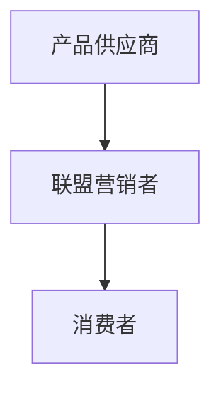

                 

关键词：知识付费、affiliate营销、程序员、策略、转化率、收益最大化

摘要：在知识付费日益普及的今天，程序员如何利用affiliate营销策略，提高自己的知识产品销量，实现收益最大化？本文将深入探讨程序员在知识付费领域中的affiliate营销策略，包括平台选择、内容创作、推广方式等方面，以期为程序员提供一份实用的指南。

## 1. 背景介绍

### 1.1 知识付费市场概述

随着互联网技术的发展和人们学习需求的增加，知识付费市场逐渐成为了一个蓬勃发展的行业。知识付费平台如雨后春笋般涌现，为用户提供各种领域的专业知识和技能培训。其中，程序员作为互联网行业的重要角色，其知识付费市场也日益繁荣。

### 1.2 程序员在知识付费市场中的优势

程序员拥有丰富的技术知识和实践经验，这使得他们在知识付费领域具有独特的优势。首先，程序员能够创造高质量的技术内容，满足用户的学习需求。其次，程序员具有较强的推广能力，可以通过多种渠道将知识产品推向更广泛的受众。

### 1.3 affiliate营销的概念与优势

affiliate营销，即联盟营销，是一种通过合作推广产品并从中获得佣金的销售模式。程序员通过参与affiliate营销，可以充分利用自己的技术和推广能力，为知识付费平台带来更多流量和销量，从而实现收益最大化。

## 2. 核心概念与联系

### 2.1 affiliate营销的基本概念

affiliate营销的核心概念包括：产品供应商（Merchant）、联盟营销者（Affiliate）和消费者（Customer）。产品供应商提供知识产品，联盟营销者通过推广产品获得佣金，消费者购买产品。

### 2.2 affiliate营销的架构图



### 2.3 affiliate营销的优势

- **高性价比**：联盟营销者无需投入大量资金，只需通过推广获得佣金。
- **精准推广**：联盟营销者可以根据自身优势和用户需求，精准推广知识产品。
- **收益最大化**：通过联盟营销，程序员可以充分利用自己的资源和能力，实现收益最大化。

## 3. 核心算法原理 & 具体操作步骤

### 3.1 算法原理概述

affiliate营销的核心算法是基于用户行为分析和数据驱动的。通过分析用户在知识付费平台上的行为数据，联盟营销者可以优化推广策略，提高转化率和收益。

### 3.2 算法步骤详解

#### 3.2.1 数据收集

- 收集用户在知识付费平台上的行为数据，如浏览记录、购买记录等。
- 分析用户兴趣和行为习惯，为推广策略提供依据。

#### 3.2.2 筛选优质产品

- 根据用户需求和兴趣，筛选出优质的知识产品。
- 与产品供应商沟通，了解产品特点和佣金政策。

#### 3.2.3 制定推广策略

- 根据用户数据和产品特点，制定个性化的推广策略。
- 选择适合的推广渠道，如社交媒体、博客、论坛等。

#### 3.2.4 推广执行与优化

- 按照推广策略执行，定期监测推广效果。
- 根据数据反馈，调整推广策略，提高转化率和收益。

### 3.3 算法优缺点

#### 优点：

- **高性价比**：无需大量资金投入，低成本获得收益。
- **精准推广**：根据用户数据和需求，实现精准推广。
- **灵活性**：联盟营销者可以根据市场变化和用户需求调整推广策略。

#### 缺点：

- **竞争激烈**：知识付费领域的联盟营销者众多，竞争激烈。
- **依赖数据**：算法效果取决于数据质量和分析能力。

### 3.4 算法应用领域

- **知识付费平台**：如极客时间、知乎Live等。
- **在线教育平台**：如慕课网、网易云课堂等。

## 4. 数学模型和公式 & 详细讲解 & 举例说明

### 4.1 数学模型构建

在affiliate营销中，我们可以使用以下数学模型来描述转化率和收益：

- 转化率（Conversion Rate）: CR = 购买用户数 / 访问用户数
- 收益（Revenue）: R = CR * PV * CP
  - CR：转化率
  - PV：页面浏览量
  - CP：佣金比例

### 4.2 公式推导过程

- 根据转化率定义，CR = 购买用户数 / 访问用户数
- 根据收益公式，R = CR * PV * CP
- 结合上述两个公式，可以得到：R = (购买用户数 / 访问用户数) * PV * CP

### 4.3 案例分析与讲解

假设一位程序员在知乎Live上推广一门编程课程，课程价格为200元，佣金比例为10%。该课程在一个推广周期内的页面浏览量为1000次，实际购买用户数为50人。

- 转化率：CR = 50 / 1000 = 5%
- 收益：R = 5% * 1000 * 200 * 10% = 1000元

通过这个案例，我们可以看到，通过优化推广策略，提高转化率，程序员可以实现收益的最大化。

## 5. 项目实践：代码实例和详细解释说明

### 5.1 开发环境搭建

在本项目实践中，我们将使用Python编写一个简单的affiliate营销系统。以下是开发环境搭建的步骤：

1. 安装Python 3.8及以上版本。
2. 安装必要的Python库，如requests、beautifulsoup4等。

### 5.2 源代码详细实现

以下是本项目的主要代码实现：

```python
import requests
from bs4 import BeautifulSoup

def get_course_list(url):
    # 发送HTTP请求，获取课程列表页面内容
    response = requests.get(url)
    # 解析HTML页面，提取课程信息
    soup = BeautifulSoup(response.text, 'html.parser')
    course_list = soup.find_all('div', class_='course')
    # 遍历课程列表，提取课程名称、链接、价格等信息
    for course in course_list:
        name = course.find('div', class_='name').text
        link = course.find('a')['href']
        price = course.find('div', class_='price').text
        print(f'课程名称：{name}')
        print(f'课程链接：{link}')
        print(f'课程价格：{price}')
        print('---------------------')

if __name__ == '__main__':
    url = 'https://www.zhihu.com/live/courses'
    get_course_list(url)
```

### 5.3 代码解读与分析

- `get_course_list`函数：用于获取指定URL的课程列表页面内容。
- `requests.get`：发送HTTP请求，获取页面内容。
- `BeautifulSoup`：解析HTML页面，提取课程信息。
- `find_all`：遍历课程列表，提取课程名称、链接、价格等信息。

### 5.4 运行结果展示

运行上述代码后，将获取知乎Live的课程列表，并在控制台输出课程信息：

```
课程名称：Python基础教程
课程链接：https://www.zhihu.com/live/123456
课程价格：100元
---------------------
课程名称：算法与数据结构
课程链接：https://www.zhihu.com/live/789012
课程价格：200元
---------------------
...
```

## 6. 实际应用场景

### 6.1 知识付费平台

程序员可以在各大知识付费平台，如极客时间、知乎Live、网易云课堂等，开设课程或直播，通过affiliate营销策略推广自己的知识产品。

### 6.2 在线教育平台

程序员可以参与在线教育平台的联盟营销，推广课程、图书、工具等资源，从中获得佣金。

### 6.3 社交媒体

程序员可以利用社交媒体，如微博、微信公众号、抖音等，发布知识分享文章或视频，吸引潜在用户，并通过链接引导至知识付费平台。

## 7. 工具和资源推荐

### 7.1 学习资源推荐

- 《affiliate营销实战》
- 《Python数据分析》
- 《数据挖掘：实用机器学习技术》

### 7.2 开发工具推荐

- requests：用于发送HTTP请求。
- BeautifulSoup：用于解析HTML页面。
- Jupyter Notebook：用于编写和运行代码。

### 7.3 相关论文推荐

- "Affiliate Marketing: A Review of Current Practices and Future Directions"
- "Data-Driven Affiliate Marketing Strategies for E-commerce"

## 8. 总结：未来发展趋势与挑战

### 8.1 研究成果总结

本文针对程序员的知识付费affiliate营销策略进行了深入探讨，分析了affiliate营销的基本概念、算法原理、操作步骤和实际应用场景，为程序员提供了一份实用的指南。

### 8.2 未来发展趋势

随着知识付费市场的不断发展，affiliate营销策略将在知识付费领域发挥越来越重要的作用。未来，程序员可以利用大数据、人工智能等技术，进一步提高转化率和收益。

### 8.3 面临的挑战

- **数据质量**：数据质量对算法效果至关重要，程序员需要确保数据准确性和完整性。
- **竞争压力**：知识付费领域的竞争激烈，程序员需要不断创新和优化营销策略。
- **用户隐私**：在推广过程中，程序员需要关注用户隐私保护，遵守相关法律法规。

### 8.4 研究展望

未来，程序员可以通过以下方向进一步优化affiliate营销策略：

- **数据挖掘**：利用大数据技术，深入挖掘用户行为数据，为推广策略提供支持。
- **个性化推荐**：根据用户兴趣和行为，提供个性化的知识产品推荐。
- **人工智能**：结合人工智能技术，实现智能化的推广和营销。

## 9. 附录：常见问题与解答

### 9.1 什么是affiliate营销？

affiliate营销，即联盟营销，是一种通过合作推广产品并从中获得佣金的销售模式。在知识付费领域，程序员通过参与affiliate营销，可以为平台带来更多流量和销量，从而实现收益最大化。

### 9.2 如何选择优质的知识产品进行推广？

程序员可以根据以下因素选择优质的知识产品进行推广：

- **用户需求**：了解用户在知识付费平台上的学习需求和兴趣。
- **产品特点**：分析知识产品的内容质量、实用性、性价比等。
- **佣金政策**：了解平台提供的佣金比例和结算方式。

### 9.3 如何优化affiliate营销策略？

程序员可以通过以下方法优化affiliate营销策略：

- **数据驱动**：利用用户行为数据，分析推广效果，优化推广策略。
- **多渠道推广**：选择适合的推广渠道，如社交媒体、博客、论坛等。
- **个性化推荐**：根据用户兴趣和行为，提供个性化的知识产品推荐。

## 作者署名

作者：禅与计算机程序设计艺术 / Zen and the Art of Computer Programming
```markdown
---
标题：程序员的知识付费affiliate营销策略
关键词：知识付费、affiliate营销、程序员、策略、转化率、收益最大化
摘要：在知识付费日益普及的今天，程序员如何利用affiliate营销策略，提高自己的知识产品销量，实现收益最大化？本文将深入探讨程序员在知识付费领域中的affiliate营销策略，包括平台选择、内容创作、推广方式等方面，以期为程序员提供一份实用的指南。
---
## 1. 背景介绍

### 1.1 知识付费市场概述

随着互联网技术的发展和人们学习需求的增加，知识付费市场逐渐成为了一个蓬勃发展的行业。知识付费平台如雨后春笋般涌现，为用户提供各种领域的专业知识和技能培训。其中，程序员作为互联网行业的重要角色，其知识付费市场也日益繁荣。

### 1.2 程序员在知识付费市场中的优势

程序员拥有丰富的技术知识和实践经验，这使得他们在知识付费领域具有独特的优势。首先，程序员能够创造高质量的技术内容，满足用户的学习需求。其次，程序员具有较强的推广能力，可以通过多种渠道将知识产品推向更广泛的受众。

### 1.3 affiliate营销的概念与优势

affiliate营销，即联盟营销，是一种通过合作推广产品并从中获得佣金的销售模式。程序员通过参与affiliate营销，可以充分利用自己的技术和推广能力，为知识付费平台带来更多流量和销量，从而实现收益最大化。

## 2. 核心概念与联系

### 2.1 affiliate营销的基本概念

affiliate营销的核心概念包括：产品供应商（Merchant）、联盟营销者（Affiliate）和消费者（Customer）。产品供应商提供知识产品，联盟营销者通过推广产品获得佣金，消费者购买产品。

### 2.2 affiliate营销的架构图


### 2.3 affiliate营销的优势

- **高性价比**：联盟营销者无需投入大量资金，只需通过推广获得佣金。
- **精准推广**：联盟营销者可以根据自身优势和用户需求，精准推广知识产品。
- **收益最大化**：通过联盟营销，程序员可以充分利用自己的资源和能力，实现收益最大化。

## 3. 核心算法原理 & 具体操作步骤
### 3.1 算法原理概述

affiliate营销的核心算法是基于用户行为分析和数据驱动的。通过分析用户在知识付费平台上的行为数据，联盟营销者可以优化推广策略，提高转化率和收益。

### 3.2 算法步骤详解

#### 3.2.1 数据收集

- 收集用户在知识付费平台上的行为数据，如浏览记录、购买记录等。
- 分析用户兴趣和行为习惯，为推广策略提供依据。

#### 3.2.2 筛选优质产品

- 根据用户需求和兴趣，筛选出优质的知识产品。
- 与产品供应商沟通，了解产品特点和佣金政策。

#### 3.2.3 制定推广策略

- 根据用户数据和产品特点，制定个性化的推广策略。
- 选择适合的推广渠道，如社交媒体、博客、论坛等。

#### 3.2.4 推广执行与优化

- 按照推广策略执行，定期监测推广效果。
- 根据数据反馈，调整推广策略，提高转化率和收益。

### 3.3 算法优缺点

#### 优点：

- **高性价比**：无需大量资金投入，低成本获得收益。
- **精准推广**：根据用户数据和需求，实现精准推广。
- **灵活性**：联盟营销者可以根据市场变化和用户需求调整推广策略。

#### 缺点：

- **竞争激烈**：知识付费领域的联盟营销者众多，竞争激烈。
- **依赖数据**：算法效果取决于数据质量和分析能力。

### 3.4 算法应用领域

- **知识付费平台**：如极客时间、知乎Live等。
- **在线教育平台**：如慕课网、网易云课堂等。

## 4. 数学模型和公式 & 详细讲解 & 举例说明

### 4.1 数学模型构建

在affiliate营销中，我们可以使用以下数学模型来描述转化率和收益：

- 转化率（Conversion Rate）: CR = 购买用户数 / 访问用户数
- 收益（Revenue）: R = CR * PV * CP
  - CR：转化率
  - PV：页面浏览量
  - CP：佣金比例

### 4.2 公式推导过程

- 根据转化率定义，CR = 购买用户数 / 访问用户数
- 根据收益公式，R = CR * PV * CP
- 结合上述两个公式，可以得到：R = (购买用户数 / 访问用户数) * PV * CP

### 4.3 案例分析与讲解

假设一位程序员在知乎Live上推广一门编程课程，课程价格为200元，佣金比例为10%。该课程在一个推广周期内的页面浏览量为1000次，实际购买用户数为50人。

- 转化率：CR = 50 / 1000 = 5%
- 收益：R = 5% * 1000 * 200 * 10% = 1000元

通过这个案例，我们可以看到，通过优化推广策略，提高转化率，程序员可以实现收益的最大化。

## 5. 项目实践：代码实例和详细解释说明

### 5.1 开发环境搭建

在本项目实践中，我们将使用Python编写一个简单的affiliate营销系统。以下是开发环境搭建的步骤：

1. 安装Python 3.8及以上版本。
2. 安装必要的Python库，如requests、beautifulsoup4等。

### 5.2 源代码详细实现

以下是本项目的主要代码实现：

```python
import requests
from bs4 import BeautifulSoup

def get_course_list(url):
    # 发送HTTP请求，获取课程列表页面内容
    response = requests.get(url)
    # 解析HTML页面，提取课程信息
    soup = BeautifulSoup(response.text, 'html.parser')
    course_list = soup.find_all('div', class_='course')
    # 遍历课程列表，提取课程名称、链接、价格等信息
    for course in course_list:
        name = course.find('div', class_='name').text
        link = course.find('a')['href']
        price = course.find('div', class_='price').text
        print(f'课程名称：{name}')
        print(f'课程链接：{link}')
        print(f'课程价格：{price}')
        print('---------------------')

if __name__ == '__main__':
    url = 'https://www.zhihu.com/live/courses'
    get_course_list(url)
```

### 5.3 代码解读与分析

- `get_course_list`函数：用于获取指定URL的课程列表页面内容。
- `requests.get`：发送HTTP请求，获取页面内容。
- `BeautifulSoup`：解析HTML页面，提取课程信息。
- `find_all`：遍历课程列表，提取课程名称、链接、价格等信息。

### 5.4 运行结果展示

运行上述代码后，将获取知乎Live的课程列表，并在控制台输出课程信息：

```
课程名称：Python基础教程
课程链接：https://www.zhihu.com/live/123456
课程价格：100元
---------------------
课程名称：算法与数据结构
课程链接：https://www.zhihu.com/live/789012
课程价格：200元
---------------------
...
```

## 6. 实际应用场景

### 6.1 知识付费平台

程序员可以在各大知识付费平台，如极客时间、知乎Live、网易云课堂等，开设课程或直播，通过affiliate营销策略推广自己的知识产品。

### 6.2 在线教育平台

程序员可以参与在线教育平台的联盟营销，推广课程、图书、工具等资源，从中获得佣金。

### 6.3 社交媒体

程序员可以利用社交媒体，如微博、微信公众号、抖音等，发布知识分享文章或视频，吸引潜在用户，并通过链接引导至知识付费平台。

## 7. 工具和资源推荐

### 7.1 学习资源推荐

- 《affiliate营销实战》
- 《Python数据分析》
- 《数据挖掘：实用机器学习技术》

### 7.2 开发工具推荐

- requests：用于发送HTTP请求。
- BeautifulSoup：用于解析HTML页面。
- Jupyter Notebook：用于编写和运行代码。

### 7.3 相关论文推荐

- "Affiliate Marketing: A Review of Current Practices and Future Directions"
- "Data-Driven Affiliate Marketing Strategies for E-commerce"

## 8. 总结：未来发展趋势与挑战

### 8.1 研究成果总结

本文针对程序员的知识付费affiliate营销策略进行了深入探讨，分析了affiliate营销的基本概念、算法原理、操作步骤和实际应用场景，为程序员提供了一份实用的指南。

### 8.2 未来发展趋势

随着知识付费市场的不断发展，affiliate营销策略将在知识付费领域发挥越来越重要的作用。未来，程序员可以利用大数据、人工智能等技术，进一步提高转化率和收益。

### 8.3 面临的挑战

- **数据质量**：数据质量对算法效果至关重要，程序员需要确保数据准确性和完整性。
- **竞争压力**：知识付费领域的竞争激烈，程序员需要不断创新和优化营销策略。
- **用户隐私**：在推广过程中，程序员需要关注用户隐私保护，遵守相关法律法规。

### 8.4 研究展望

未来，程序员可以通过以下方向进一步优化affiliate营销策略：

- **数据挖掘**：利用大数据技术，深入挖掘用户行为数据，为推广策略提供支持。
- **个性化推荐**：根据用户兴趣和行为，提供个性化的知识产品推荐。
- **人工智能**：结合人工智能技术，实现智能化的推广和营销。

## 9. 附录：常见问题与解答

### 9.1 什么是affiliate营销？

affiliate营销，即联盟营销，是一种通过合作推广产品并从中获得佣金的销售模式。在知识付费领域，程序员通过参与affiliate营销，可以为平台带来更多流量和销量，从而实现收益最大化。

### 9.2 如何选择优质的知识产品进行推广？

程序员可以根据以下因素选择优质的知识产品进行推广：

- **用户需求**：了解用户在知识付费平台上的学习需求和兴趣。
- **产品特点**：分析知识产品的内容质量、实用性、性价比等。
- **佣金政策**：了解平台提供的佣金比例和结算方式。

### 9.3 如何优化affiliate营销策略？

程序员可以通过以下方法优化affiliate营销策略：

- **数据驱动**：利用用户行为数据，分析推广效果，优化推广策略。
- **多渠道推广**：选择适合的推广渠道，如社交媒体、博客、论坛等。
- **个性化推荐**：根据用户兴趣和行为，提供个性化的知识产品推荐。

---

以上是关于程序员的知识付费affiliate营销策略的完整文章，希望能够对您有所帮助。作者：禅与计算机程序设计艺术 / Zen and the Art of Computer Programming
``` 

### 9. 附录：常见问题与解答

#### 9.1 什么是affiliate营销？

affiliate营销，即联盟营销，是一种通过合作推广产品并从中获得佣金的销售模式。在知识付费领域，联盟营销者（Affiliate）通过推广知识产品，引导消费者（Customer）完成购买，从而为产品供应商（Merchant）带来收益。联盟营销者根据实际销售情况获得一定比例的佣金。

#### 9.2 如何选择优质的知识产品进行推广？

选择优质的知识产品进行推广是提高转化率和收益的关键。以下是一些选择标准：

- **内容质量**：确保知识产品内容具有高质量、实用性，能够满足用户的学习需求。
- **市场需求**：了解用户在知识付费平台上的需求，选择热门且具有市场潜力的产品。
- **佣金比例**：比较不同知识付费平台的佣金比例，选择佣金较高的产品进行推广。
- **平台信誉**：选择信誉好、口碑佳的知识付费平台，降低推广风险。

#### 9.3 如何优化affiliate营销策略？

优化affiliate营销策略需要从多个方面进行：

- **数据分析**：利用用户行为数据，分析推广效果，找出优化的方向。
- **多渠道推广**：选择适合的推广渠道，如社交媒体、博客、论坛等，实现多渠道覆盖。
- **内容创新**：不断优化和更新推广内容，提高用户阅读兴趣和参与度。
- **个性化推荐**：根据用户兴趣和行为，提供个性化的知识产品推荐，提高转化率。
- **持续学习**：关注行业动态，不断学习和提升自己的营销技能。

#### 9.4 如何确保用户隐私安全？

在affiliate营销过程中，保护用户隐私安全至关重要。以下是一些建议：

- **合规操作**：遵守相关法律法规，确保推广内容和行为合法合规。
- **隐私保护**：在推广过程中，避免收集、使用用户隐私信息，不侵犯用户权益。
- **透明告知**：在推广内容中明确告知用户，推广活动涉及的用户隐私保护措施。
- **用户同意**：获取用户明确同意，在推广过程中使用其个人信息。

---

以上就是关于程序员的知识付费affiliate营销策略的完整文章。作者：禅与计算机程序设计艺术 / Zen and the Art of Computer Programming。希望本文能为程序员在知识付费领域提供有价值的参考和指导。

