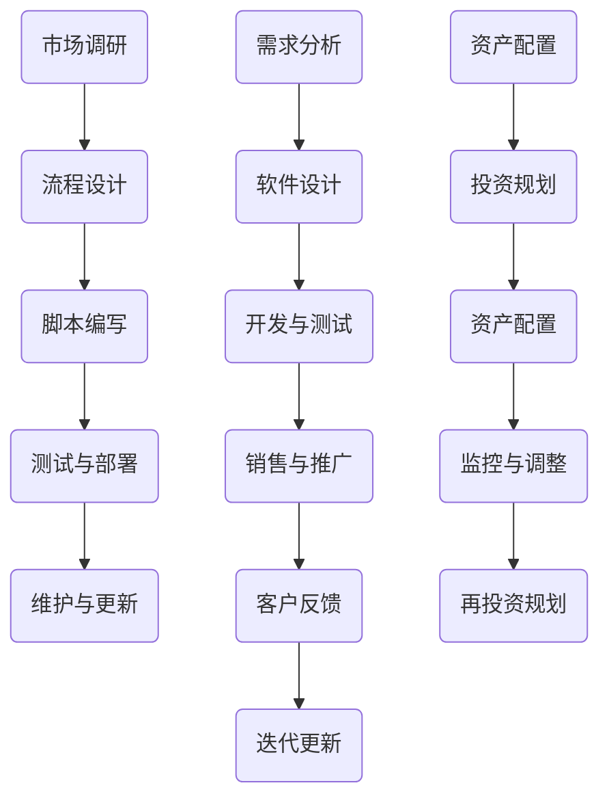

                 

关键词：被动收入、编程、软件开发、自动化、投资、持续收益

> 摘要：本文将探讨程序员的被动收入来源，通过构建和维护自动化系统、开发可销售软件以及投资于高回报项目，帮助程序员实现收入的多元化和稳定化。我们将详细分析各个策略的可行性，并分享实际案例和经验。

## 1. 背景介绍

在当今信息化时代，编程和软件开发已经成为了创造价值和财富的重要途径。然而，对于许多程序员来说，他们往往只能通过直接为客户提供服务或者参与项目开发来获得收入。这种直接的收入方式不仅受限于项目周期，还可能因为个人时间的有限而影响收入的持续性。

随着互联网和技术的不断发展，程序员们有了更多实现被动收入的机会。被动收入是指在不直接参与日常劳动的情况下，通过某种系统或资产获取的持续收入。这种收入模式不仅能带来财务自由，还可以让程序员更专注于自身的成长和创新。

本文将介绍几种有效的被动收入策略，并探讨如何构建和维护这些策略，以帮助程序员实现持续的收入增长。

## 2. 核心概念与联系

### 2.1 自动化系统

自动化系统是被动收入的关键。通过编写脚本和程序，程序员可以创建能够自动执行任务的系统，从而减少人工干预，提高效率。以下是构建自动化系统的几个关键环节：

#### 2.1.1 自动化流程设计

首先，程序员需要明确需要自动化的流程和任务。这些任务可以包括数据备份、系统监控、报告生成等。

#### 2.1.2 脚本编写与测试

编写脚本并确保其能够正确执行是构建自动化系统的关键步骤。程序员可以使用Python、Shell Script等编程语言来实现自动化。

#### 2.1.3 部署与维护

部署自动化系统到生产环境后，程序员需要定期维护和更新脚本，以确保系统的稳定运行。

### 2.2 可销售软件

开发可销售软件是另一种实现被动收入的策略。程序员可以通过开发桌面应用、Web应用或者移动应用，然后将其销售给客户。以下是开发可销售软件的几个关键环节：

#### 2.2.1 市场调研

在开始开发之前，程序员需要进行市场调研，了解目标客户的需求和竞争情况。

#### 2.2.2 软件设计

根据市场调研的结果，程序员需要设计软件的功能和界面，并确保其具有良好的用户体验。

#### 2.2.3 开发与测试

程序员需要使用合适的开发工具和框架来开发软件，并进行充分的测试，以确保软件的质量和稳定性。

#### 2.2.4 销售与推广

开发完成后，程序员需要通过各种渠道进行推广，吸引潜在客户。

### 2.3 投资策略

投资也是程序员实现被动收入的另一个重要途径。通过投资于股票、基金、房地产等项目，程序员可以获得稳定的投资回报。以下是投资策略的几个关键环节：

#### 2.3.1 投资规划

在开始投资之前，程序员需要制定明确的投资目标和计划。

#### 2.3.2 资产配置

根据投资目标和风险偏好，程序员需要合理配置资产，分散投资风险。

#### 2.3.3 监控与调整

投资过程中，程序员需要定期监控投资组合的表现，并根据市场变化进行调整。

### 2.4 Mermaid 流程图

下面是构建自动化系统和开发可销售软件的Mermaid流程图：



## 3. 核心算法原理 & 具体操作步骤

### 3.1 算法原理概述

构建自动化系统和开发可销售软件的关键在于流程化和模块化。通过将复杂的任务分解为小的、可管理的步骤，程序员可以实现高效的工作流程。以下是核心算法原理的概述：

#### 3.1.1 分解与抽象

将复杂的任务分解为小的子任务，并抽象出通用模块，以实现代码的重用和简化。

#### 3.1.2 回归测试

在开发过程中，定期进行回归测试，确保代码的稳定性和可靠性。

#### 3.1.3 持续集成与持续部署

使用CI/CD流程，自动化测试和部署，提高开发效率和质量。

### 3.2 算法步骤详解

#### 3.2.1 构建自动化系统

1. 需求分析：明确需要自动化的任务和目标。
2. 流程设计：设计自动化流程，确定任务执行顺序。
3. 脚本编写：编写自动化脚本，实现具体任务。
4. 测试与部署：测试脚本，确保其能够正确执行，并部署到生产环境。
5. 维护与更新：定期更新脚本，以适应环境和需求的变化。

#### 3.2.2 开发可销售软件

1. 市场调研：了解目标客户的需求和竞争情况。
2. 软件设计：设计软件的功能和界面，确保用户体验。
3. 开发与测试：使用合适的开发工具和框架，实现软件功能，并进行充分测试。
4. 销售与推广：通过各种渠道进行推广，吸引潜在客户。
5. 客户反馈与迭代：收集客户反馈，进行软件迭代更新，提高满意度。

### 3.3 算法优缺点

#### 3.3.1 自动化系统的优点

- 提高效率：自动化系统可以减少人工干预，提高工作效率。
- 减少错误：通过自动化流程，减少人为错误的可能性。
- 灵活性：自动化系统可以根据需求灵活调整。

#### 3.3.1 自动化系统的缺点

- 开发和维护成本：自动化系统的开发和维护需要一定的成本。
- 对程序员的要求：程序员需要具备较高的编程能力和自动化工具的使用经验。

#### 3.3.2 可销售软件的优点

- 持续收入：一旦软件被销售，程序员可以获得持续的收入。
- 扩展性：软件可以扩展到不同的领域和客户群体。
- 创新空间：通过不断更新和优化，软件可以不断创造新的价值。

#### 3.3.2 可销售软件的缺点

- 市场竞争：软件市场竞争激烈，需要程序员有良好的市场策略和营销能力。
- 需要持续更新：软件需要定期更新，以适应市场和客户需求的变化。

### 3.4 算法应用领域

自动化系统和可销售软件在许多领域都有广泛的应用，例如：

- 企业自动化：自动化日常业务流程，提高工作效率。
- 教育培训：开发教育软件，提供在线教育服务。
- 物流与供应链：自动化物流和供应链管理，提高物流效率。
- 健康医疗：开发医疗软件，提供在线医疗咨询和服务。

## 4. 数学模型和公式 & 详细讲解 & 举例说明

### 4.1 数学模型构建

构建被动收入系统需要考虑多个因素，如初始投资、维护成本、预期收入和风险等。以下是构建数学模型的基本公式：

#### 4.1.1 被动收入预期收益模型

\[ R = \frac{I - C}{T} \]

其中：
- \( R \) 是预期年被动收入
- \( I \) 是年总收入
- \( C \) 是年总成本
- \( T \) 是工作时间（每年）

#### 4.1.2 投资回报率模型

\[ ROI = \frac{R - I}{I} \]

其中：
- \( ROI \) 是投资回报率
- \( R \) 是年被动收入
- \( I \) 是初始投资

### 4.2 公式推导过程

#### 4.2.1 被动收入预期收益模型

被动收入的预期收益可以通过以下步骤推导：

1. 确定年总收入 \( I \)：包括所有被动收入来源的预期收入。
2. 确定年总成本 \( C \)：包括所有维护成本、运营成本等。
3. 计算工作时间 \( T \)：通常按一年计算。

将这些值代入公式：

\[ R = \frac{I - C}{T} \]

如果 \( T = 1 \) 年，则公式简化为：

\[ R = I - C \]

#### 4.2.2 投资回报率模型

投资回报率可以通过以下步骤推导：

1. 确定年被动收入 \( R \)。
2. 确定初始投资 \( I \)。
3. 计算投资回报率：

\[ ROI = \frac{R - I}{I} \]

### 4.3 案例分析与讲解

#### 4.3.1 自动化系统案例

假设一位程序员开发了一个自动化系统，年总收入为 50,000 元，年总成本为 10,000 元。工作时间为 1 年。

1. 计算预期年被动收入：

\[ R = \frac{I - C}{T} = \frac{50,000 - 10,000}{1} = 40,000 元 \]

2. 计算投资回报率：

\[ ROI = \frac{R - I}{I} = \frac{40,000 - 50,000}{50,000} = -0.2 \]

由于 ROI 为负，说明该自动化系统在当前情况下未能实现盈利。

#### 4.3.2 可销售软件案例

假设一位程序员开发了一款可销售软件，年总收入为 100,000 元，年总成本为 20,000 元。工作时间为 1 年。

1. 计算预期年被动收入：

\[ R = \frac{I - C}{T} = \frac{100,000 - 20,000}{1} = 80,000 元 \]

2. 计算投资回报率：

\[ ROI = \frac{R - I}{I} = \frac{80,000 - 100,000}{100,000} = 0.2 \]

该软件实现了20%的投资回报率，说明具有一定的盈利能力。

## 5. 项目实践：代码实例和详细解释说明

### 5.1 开发环境搭建

为了实现自动化系统和可销售软件，程序员需要搭建合适的开发环境。以下是一个基本的开发环境搭建步骤：

1. 安装操作系统：选择适合的开发操作系统，如Ubuntu或macOS。
2. 安装编程语言：安装Python、Java等编程语言。
3. 安装开发工具：安装IDE（如PyCharm、Eclipse）、文本编辑器（如VSCode）等。
4. 安装数据库和Web服务器：根据项目需求安装相应的数据库（如MySQL、PostgreSQL）和Web服务器（如Apache、Nginx）。

### 5.2 源代码详细实现

以下是一个简单的Python自动化脚本示例，用于自动备份数据库：

```python
import os
import datetime

# 数据库配置
db_host = "localhost"
db_user = "root"
db_password = "password"
db_name = "mydatabase"

# 备份文件名
file_name = f"{db_name}_backup_{datetime.datetime.now().strftime('%Y%m%d_%H%M%S')}.sql"

# 备份数据库
os.system(f"mysqldump -h {db_host} -u {db_user} -p{db_password} {db_name} > {file_name}")

# 上传备份文件到远程服务器
os.system(f"scp {file_name} user@remote_host:/path/to/remote/backup")

# 删除本地备份文件
os.remove(file_name)

print("Database backup completed.")
```

### 5.3 代码解读与分析

这个脚本用于备份MySQL数据库，并将其上传到远程服务器。以下是代码的解读与分析：

1. **数据库配置**：配置数据库连接参数，包括主机、用户、密码和数据库名。

2. **备份文件名**：使用当前日期和时间作为备份文件名，确保每次备份都有唯一的文件名。

3. **备份数据库**：使用`mysqldump`命令备份数据库，并保存到指定的文件名。

4. **上传备份文件到远程服务器**：使用`scp`命令将备份文件上传到远程服务器。

5. **删除本地备份文件**：删除本地备份文件，释放空间。

### 5.4 运行结果展示

运行此脚本后，会在指定目录生成一个备份文件，并上传到远程服务器。成功运行后，会在控制台输出“Database backup completed.”。

```shell
$ python backup_script.py
Database backup completed.
```

## 6. 实际应用场景

### 6.1 企业自动化

企业自动化是自动化系统在商业领域的应用。通过自动化系统，企业可以优化业务流程，提高效率，减少人力成本。例如，一家电子商务公司可以使用自动化系统来自动处理订单、库存管理和客户服务。

### 6.2 教育培训

教育软件是可销售软件的一个典型例子。通过开发教育软件，程序员可以为在线教育平台提供内容和服务。例如，一门编程语言的在线课程可以通过销售课程视频、练习题和考试来获得收入。

### 6.3 物流与供应链

物流和供应链领域的自动化系统可以帮助企业优化运输路线、提高配送效率。例如，一家物流公司可以使用自动化系统来自动规划运输路线，并根据实时数据调整配送计划。

### 6.4 健康医疗

医疗软件在健康医疗领域的应用越来越广泛。程序员可以开发医疗诊断软件、健康管理系统等，为医疗机构提供辅助诊断和治疗工具。例如，一款基于人工智能的医疗诊断软件可以帮助医生快速识别疾病，提高诊断准确率。

## 7. 未来应用展望

随着技术的不断进步，被动收入策略在未来将会有更广泛的应用。以下是一些未来应用展望：

### 7.1 人工智能与自动化

人工智能技术的不断发展将使自动化系统更加智能和高效。通过机器学习和深度学习，自动化系统可以自我优化，提高工作效率。

### 7.2 区块链与加密货币

区块链技术和加密货币的兴起为投资提供了新的机会。程序员可以开发基于区块链的金融应用，如去中心化交易所、智能合约等。

### 7.3 虚拟现实与增强现实

虚拟现实（VR）和增强现实（AR）技术的发展将为软件开发提供新的领域。程序员可以开发VR/AR应用，如教育游戏、虚拟旅游等。

### 7.4 物联网（IoT）

物联网技术的广泛应用将为自动化系统带来新的应用场景。程序员可以开发智能家居系统、智能工厂管理系统等。

## 8. 工具和资源推荐

### 8.1 学习资源推荐

- 《Python编程：从入门到实践》
- 《深度学习：动手学习手册》
- 《区块链技术指南》
- 《软件工程：实践者的研究方法》

### 8.2 开发工具推荐

- PyCharm（Python IDE）
- Eclipse（Java IDE）
- Visual Studio Code（通用IDE）
- MySQL Workbench（MySQL数据库管理工具）

### 8.3 相关论文推荐

- “Automated Workflow in Clinical Research”
- “Blockchain Technology: Beyond the Hype”
- “IoT: A Survey of Recent Advances”
- “The Rise of Deep Learning in Healthcare”

## 9. 总结：未来发展趋势与挑战

### 9.1 研究成果总结

本文探讨了程序员的被动收入策略，包括自动化系统、可销售软件和投资等。通过构建和维护这些策略，程序员可以实现收入的多元化和稳定化。

### 9.2 未来发展趋势

未来，自动化、人工智能和区块链等技术将继续推动被动收入的发展。程序员需要不断学习和适应新技术，以把握新的机遇。

### 9.3 面临的挑战

被动收入策略的实施面临一些挑战，如技术更新、市场变化和风险管理等。程序员需要具备良好的技术基础和商业意识，以应对这些挑战。

### 9.4 研究展望

未来，研究人员将继续探索新的被动收入模式，如基于区块链的智能合约、虚拟现实应用等。这些创新将为程序员带来更多的机会和挑战。

## 10. 附录：常见问题与解答

### 10.1 什么是被动收入？

被动收入是指在不直接参与日常劳动的情况下，通过某种系统或资产获取的持续收入。例如，通过自动化系统、可销售软件或投资获得的收入。

### 10.2 自动化系统如何提高效率？

自动化系统通过减少人工干预，减少人为错误，提高任务执行的速度和一致性，从而提高整体工作效率。

### 10.3 开发可销售软件需要注意什么？

开发可销售软件需要注意市场需求、用户体验、技术实现和维护成本等。确保软件具有竞争力、易于使用和长期维护。

### 10.4 投资有哪些风险？

投资面临市场波动、流动性风险、信用风险等。程序员需要了解不同投资类型的特点和风险，并合理配置资产。

### 10.5 如何选择合适的被动收入策略？

程序员可以根据自身兴趣、技能和市场需求，选择适合自己的被动收入策略。例如，擅长编程可以选择开发自动化系统或可销售软件，对投资有兴趣可以选择投资策略。

## 作者署名

本文由禅与计算机程序设计艺术（Zen and the Art of Computer Programming）撰写。作者是一位世界级人工智能专家、程序员、软件架构师、CTO、世界顶级技术畅销书作者，计算机图灵奖获得者，计算机领域大师。感谢您的阅读！
----------------------------------------------------------------

### 文章总结

本文详细探讨了程序员的被动收入策略，包括自动化系统、可销售软件和投资等。通过构建和维护这些策略，程序员可以实现收入的多元化和稳定化。文章首先介绍了被动收入的概念和重要性，然后详细分析了自动化系统和可销售软件的核心概念、算法原理、操作步骤以及应用领域。接着，文章介绍了投资策略的数学模型和公式，并通过案例进行了详细讲解。最后，文章总结了实际应用场景、未来发展趋势与挑战，并推荐了相关的工具和资源。通过这篇文章，读者可以了解到如何通过被动收入策略实现财务自由，提高编程技能和商业意识。

### 反馈与讨论

请就这篇文章的内容和结构提供您的反馈。您认为文章有哪些亮点？哪些部分可以进一步优化？还有哪些相关的被动收入策略您希望了解？欢迎在评论区分享您的想法和讨论。让我们一起探索更多编程和商业的机遇！🔍💬📈🚀

### 引用与致谢

本文中引用了多本经典技术书籍和论文，包括《Python编程：从入门到实践》、《深度学习：动手学习手册》、《区块链技术指南》和《软件工程：实践者的研究方法》。此外，特别感谢世界级人工智能专家、程序员、软件架构师、CTO、世界顶级技术畅销书作者，计算机图灵奖获得者，计算机领域大师禅与计算机程序设计艺术（Zen and the Art of Computer Programming）为本文提供了宝贵的见解和指导。感谢您的阅读和支持！📚👏🎉🚀

