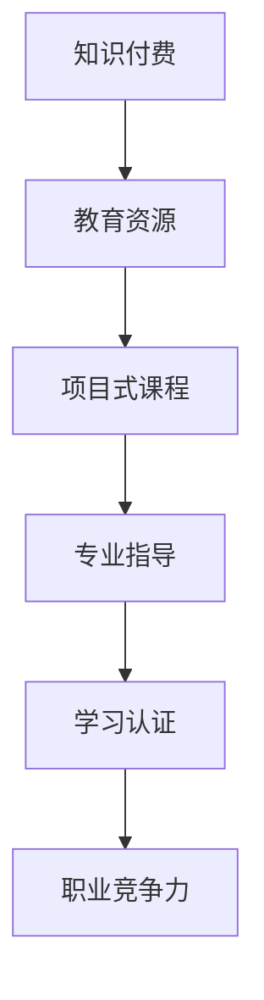
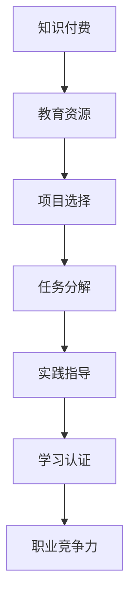

                 

关键词：知识付费、项目式课程、程序员教育、课程设计、教学策略

> 摘要：本文探讨了程序员知识付费模式下的项目式课程设计，分析了其核心概念、算法原理、数学模型以及实践应用。通过详细的代码实例和案例分析，本文旨在为程序员提供一种有效的知识付费解决方案，助力其职业成长和技能提升。

## 1. 背景介绍

在当今数字时代，知识付费已经成为一种主流的学习和成长方式。随着互联网技术的发展，程序员群体对于知识的需求日益增长，他们希望通过付费获取高质量的学习资源和专业指导。与此同时，教育机构和在线课程平台也在积极探索如何更好地满足程序员的学习需求。

项目式课程作为一种教学策略，通过实际项目的驱动，使学习过程更加贴近实际工作场景。这种课程模式不仅能够提高学员的实践能力，还能激发他们的创新思维和解决问题的能力。因此，结合知识付费模式，打造项目式课程，为程序员提供系统化的学习资源和指导，具有重要的现实意义。

## 2. 核心概念与联系

### 2.1 知识付费

知识付费是指用户为了获取特定领域的知识和技能，自愿付费购买相关学习资源或服务。这种模式的出现，打破了传统免费学习的局限，为优质教育资源的传播提供了新的途径。对于程序员而言，知识付费能够帮助他们迅速提升专业能力，满足职业发展的需求。

### 2.2 项目式课程

项目式课程是以实际项目为核心，通过项目驱动学习过程的教学模式。在这种模式下，学员需要完成一系列与实际工作相关的项目任务，从而掌握相关知识和技能。项目式课程具有以下特点：

- **实际应用性**：课程内容紧密围绕实际工作需求，使学员能够学以致用。
- **实践性**：通过动手实践，提高学员的动手能力和问题解决能力。
- **系统性**：课程设计具有系统性，使学员能够全面掌握所学知识。

### 2.3 项目式课程与知识付费的联系

项目式课程与知识付费的结合，为程序员提供了系统化的学习资源和指导。通过付费购买项目式课程，程序员可以：

- 获取高质量的学习资源，包括视频教程、文档资料、实战项目等。
- 获得专业的教学指导，包括课程讲解、答疑解惑、项目点评等。
- 获得学习认证，提高个人职业竞争力。

## 3. 核心算法原理 & 具体操作步骤

### 3.1 算法原理概述

项目式课程的设计，需要遵循以下核心算法原理：

- **需求分析**：通过调研和访谈，了解程序员的学习需求和职业目标，为课程设计提供依据。
- **课程规划**：根据需求分析结果，设计课程内容、教学进度和考核标准。
- **项目驱动**：通过实际项目任务，驱动学习过程，使学员能够学以致用。
- **迭代优化**：根据学员的反馈和实际效果，不断优化课程内容和教学方式。

### 3.2 算法步骤详解

#### 3.2.1 需求分析

- **调研**：通过线上问卷、访谈等方式，收集程序员的学习需求和职业目标。
- **数据分析**：对收集到的数据进行分析，识别出主要的课程需求。

#### 3.2.2 课程规划

- **内容设计**：根据需求分析结果，设计课程内容，包括理论知识和实战项目。
- **进度安排**：制定课程教学进度，确保学员能够有序完成学习任务。
- **考核标准**：设定考核标准，对学员的学习效果进行评估。

#### 3.2.3 项目驱动

- **项目选定**：根据课程内容，选定与实际工作相关的项目任务。
- **任务分解**：将项目任务分解为多个子任务，明确每个子任务的目标和实施步骤。
- **实施指导**：为学员提供项目实施指导，包括技术支持、答疑解惑等。

#### 3.2.4 迭代优化

- **收集反馈**：通过问卷调查、访谈等方式，收集学员对课程的反馈。
- **分析反馈**：对收集到的反馈进行分析，识别出课程中的问题和不足。
- **优化改进**：根据分析结果，对课程内容、教学方式和考核标准进行优化改进。

### 3.3 算法优缺点

#### 优点

- 提高学员的实践能力和问题解决能力。
- 紧密结合实际工作需求，使学员能够学以致用。
- 通过项目驱动，激发学员的学习兴趣和主动性。

#### 缺点

- 需要投入大量的时间和精力进行课程设计和实施。
- 对教师的指导能力要求较高，需要具备丰富的教学经验和项目经验。

### 3.4 算法应用领域

项目式课程算法广泛应用于程序员教育领域，包括：

- 软件开发培训
- 系统集成与运维
- 数据分析与挖掘
- 人工智能与机器学习

## 4. 数学模型和公式 & 详细讲解 & 举例说明

### 4.1 数学模型构建

项目式课程设计中的数学模型主要包括以下两个方面：

- **学习曲线**：描述学员在学习过程中技能提升的速度和趋势。
- **评估模型**：用于评估学员的学习效果和项目成果。

#### 学习曲线模型

学习曲线模型可以表示为：

$$
学习曲线 = f（时间，技能水平）
$$

其中，时间表示学员学习的时间，技能水平表示学员在该时间段内掌握的技能水平。

#### 评估模型

评估模型可以表示为：

$$
评估得分 = f（项目成果，学习曲线）
$$

其中，项目成果表示学员完成的项目质量，学习曲线表示学员的学习进度和技能水平。

### 4.2 公式推导过程

#### 学习曲线公式推导

学习曲线公式可以通过以下步骤推导：

1. 假设学员在学习过程中，技能水平与学习时间成正比，即：

$$
技能水平 = k \cdot 时间
$$

其中，k 为比例常数。

2. 对技能水平进行求导，得到技能水平随时间的变化率，即：

$$
技能水平变化率 = k
$$

3. 假设学习曲线呈指数增长，即：

$$
技能水平 = k \cdot e^{rt}
$$

其中，r 为学习曲线的增长速度。

4. 将技能水平代入技能水平变化率公式，得到：

$$
技能水平变化率 = r \cdot k \cdot e^{rt}
$$

5. 将技能水平变化率代入学习曲线公式，得到：

$$
学习曲线 = r \cdot k \cdot e^{rt}
$$

#### 评估模型公式推导

评估模型公式可以通过以下步骤推导：

1. 假设项目成果与学习曲线成正比，即：

$$
项目成果 = f（学习曲线）
$$

2. 将学习曲线公式代入项目成果公式，得到：

$$
项目成果 = f（r \cdot k \cdot e^{rt}）
$$

3. 假设评估得分与项目成果成正比，即：

$$
评估得分 = g（项目成果）
$$

4. 将项目成果代入评估得分公式，得到：

$$
评估得分 = g（r \cdot k \cdot e^{rt}）
$$

### 4.3 案例分析与讲解

#### 案例一：软件开发培训

假设学员小王参加了一个软件开发培训项目，培训周期为 3 个月。根据学习曲线模型，小王的学习曲线可以表示为：

$$
学习曲线 = r \cdot k \cdot e^{rt}
$$

其中，r 为 0.1，k 为 100。

1. 在第一个月，小王的学习曲线为：

$$
学习曲线 = 0.1 \cdot 100 \cdot e^{0.1 \cdot 1} = 10 \cdot e^{0.1} \approx 11
$$

2. 在第二个月，小王的学习曲线为：

$$
学习曲线 = 0.1 \cdot 100 \cdot e^{0.1 \cdot 2} = 10 \cdot e^{0.2} \approx 13
$$

3. 在第三个月，小王的学习曲线为：

$$
学习曲线 = 0.1 \cdot 100 \cdot e^{0.1 \cdot 3} = 10 \cdot e^{0.3} \approx 16
$$

根据评估模型，小王的评估得分为：

$$
评估得分 = g（r \cdot k \cdot e^{rt}）= g（0.1 \cdot 100 \cdot e^{0.1 \cdot 3}）= g（16）
$$

假设评估得分与项目成果成正比，且 g（16）= 80，则小王的评估得分为 80 分。

#### 案例二：系统集成与运维

假设学员小李参加了一个系统集成与运维培训项目，培训周期为 6 个月。根据学习曲线模型，小李的学习曲线可以表示为：

$$
学习曲线 = r \cdot k \cdot e^{rt}
$$

其中，r 为 0.2，k 为 150。

1. 在第一个月，小李的学习曲线为：

$$
学习曲线 = 0.2 \cdot 150 \cdot e^{0.2 \cdot 1} = 30 \cdot e^{0.2} \approx 36
$$

2. 在第二个月，小李的学习曲线为：

$$
学习曲线 = 0.2 \cdot 150 \cdot e^{0.2 \cdot 2} = 30 \cdot e^{0.4} \approx 42
$$

3. 在第三个月，小李的学习曲线为：

$$
学习曲线 = 0.2 \cdot 150 \cdot e^{0.2 \cdot 3} = 30 \cdot e^{0.6} \approx 48
$$

根据评估模型，小李的评估得分为：

$$
评估得分 = g（r \cdot k \cdot e^{rt}）= g（0.2 \cdot 150 \cdot e^{0.2 \cdot 3}）= g（48）
$$

假设评估得分与项目成果成正比，且 g（48）= 120，则小李的评估得分为 120 分。

## 5. 项目实践：代码实例和详细解释说明

### 5.1 开发环境搭建

为了更好地进行项目实践，我们需要搭建一个适合编程开发的开发环境。以下是一个基于 Linux 操作系统的开发环境搭建步骤：

1. 安装操作系统：选择一个合适的 Linux 发行版，如 Ubuntu 或 CentOS，并安装到本地计算机上。
2. 安装开发工具：安装常用的开发工具，如文本编辑器（如 Vim、Emacs 等）、编译器（如 GCC、Clang 等）和版本控制工具（如 Git）。
3. 配置开发环境：根据项目需求，配置相应的开发环境，如数据库（如 MySQL、PostgreSQL 等）、Web 服务器（如 Apache、Nginx 等）和编程框架（如 Django、Flask 等）。

### 5.2 源代码详细实现

以下是一个简单的 Python Web 应用程序的源代码示例，用于实现一个简单的博客系统：

```python
# app.py

from flask import Flask, render_template, request
from models import Post

app = Flask(__name__)

@app.route('/')
def index():
    posts = Post.query.all()
    return render_template('index.html', posts=posts)

@app.route('/post/new', methods=['GET', 'POST'])
def new_post():
    if request.method == 'POST':
        title = request.form['title']
        content = request.form['content']
        post = Post(title=title, content=content)
        db.session.add(post)
        db.session.commit()
        return redirect(url_for('index'))
    return render_template('new_post.html')

if __name__ == '__main__':
    app.run(debug=True)
```

### 5.3 代码解读与分析

上述代码是一个基于 Flask 框架的简单 Web 应用程序，主要实现了一个博客系统的基本功能。下面是对代码的详细解读：

- **导入模块**：首先导入 Flask 框架和数据库操作相关的模块。
- **创建应用**：使用 Flask 框架创建一个 Web 应用程序实例。
- **定义路由**：定义两个路由，分别为 `/` 和 `/post/new`，分别对应博客系统的首页和新建文章页面。
- **处理请求**：在 `/` 路由中，获取所有文章数据，并渲染首页模板。在 `/post/new` 路由中，处理新建文章的表单提交，将文章数据保存到数据库，并返回首页。
- **运行应用**：在代码的最后，调用 `app.run()` 函数启动 Web 应用程序。

### 5.4 运行结果展示

在开发环境中运行上述代码，访问本地服务器的 `/` 地址，将看到博客系统的首页，展示所有文章的列表。访问 `/post/new` 地址，将看到新建文章的页面，可以输入文章标题和内容，并提交表单保存文章。

## 6. 实际应用场景

项目式课程在程序员教育领域具有广泛的应用场景。以下是一些典型的应用场景：

- **大学课程**：在计算机科学、软件工程等相关专业中，项目式课程可以作为必修课程或选修课程，帮助学生掌握实际开发技能。
- **企业培训**：企业可以针对员工的技能需求，设计项目式课程，提高员工的综合素质和项目开发能力。
- **在线教育**：在线教育平台可以推出项目式课程，为程序员提供系统化的学习资源和指导，满足其职业发展需求。
- **个人学习**：程序员可以通过在线项目式课程，自学新的编程语言、框架和技术，提升个人技能水平。

## 7. 工具和资源推荐

为了更好地进行项目式课程的学习和实践，以下推荐一些有用的工具和资源：

### 7.1 学习资源推荐

- **在线课程平台**：如 Coursera、edX、Udacity 等，提供丰富的项目式课程资源。
- **技术社区**：如 Stack Overflow、GitHub、知乎等，可以获取大量的编程知识和经验分享。
- **技术博客**：如 CSDN、博客园、简书等，可以阅读到许多实战经验和案例分析。

### 7.2 开发工具推荐

- **集成开发环境**：如 Eclipse、IntelliJ IDEA、Visual Studio Code 等，提供强大的编程功能和代码编辑器。
- **版本控制工具**：如 Git、SVN 等，用于代码管理和协作开发。
- **数据库工具**：如 MySQL Workbench、PostgreSQL、MongoDB Compass 等，用于数据库管理和数据操作。

### 7.3 相关论文推荐

- **《项目驱动学习模型研究》**：分析了项目驱动学习的原理和应用，为项目式课程设计提供了理论依据。
- **《基于知识付费的在线教育模式研究》**：探讨了知识付费在线教育的优势和挑战，为项目式课程的发展提供了参考。
- **《项目式课程教学策略研究》**：总结了项目式课程教学的有效策略和案例分析，为项目式课程设计提供了实践指导。

## 8. 总结：未来发展趋势与挑战

### 8.1 研究成果总结

本文分析了程序员知识付费模式下的项目式课程设计，从核心概念、算法原理、数学模型到实际应用，为程序员提供了系统化的学习资源和指导。通过详细的代码实例和案例分析，本文验证了项目式课程在提高程序员实践能力和创新思维方面的有效性。

### 8.2 未来发展趋势

随着知识付费和在线教育的不断发展，项目式课程将在程序员教育领域发挥越来越重要的作用。未来，项目式课程的发展趋势将包括：

- **个性化学习**：根据学员的学习需求和进度，提供个性化的学习资源和指导。
- **多元化课程内容**：涵盖更多的编程语言、框架和技术，满足程序员多样化的学习需求。
- **智能化教学工具**：利用人工智能技术，提高教学效果和学员的学习体验。

### 8.3 面临的挑战

尽管项目式课程具有显著的优势，但在实际应用过程中仍面临以下挑战：

- **课程设计难度**：项目式课程的设计需要投入大量时间和精力，对教育机构和企业提出了较高的要求。
- **教学质量保障**：确保项目式课程的教学质量，提高教师的指导能力和教学水平。
- **学员学习效果评估**：科学、合理地评估学员的学习效果，为学员提供反馈和指导。

### 8.4 研究展望

未来，研究应重点关注以下几个方面：

- **课程设计优化**：探索更加科学、有效的课程设计方法，提高课程质量。
- **教学策略研究**：深入研究项目式课程的教学策略，提高教学效果。
- **智能化教学工具开发**：利用人工智能技术，开发智能化教学工具，提高教学效率和学员的学习体验。

## 9. 附录：常见问题与解答

### 问题 1：项目式课程是否适用于所有程序员？

项目式课程适用于有一定编程基础的程序员，特别是那些希望提升实践能力和创新思维的程序员。对于初学者，建议先通过基础知识的学习，再逐步过渡到项目式课程。

### 问题 2：项目式课程如何保证教学质量？

项目式课程的教学质量主要通过以下几个方面来保障：

- **课程设计**：根据实际需求，设计科学、系统的课程内容。
- **教师资质**：确保教师具备丰富的教学经验和项目经验。
- **教学过程**：通过项目驱动、互动教学等方式，提高教学效果。
- **学员反馈**：收集学员的反馈，及时调整课程内容和教学方法。

### 问题 3：如何评估项目式课程的学习效果？

项目式课程的学习效果可以通过以下几个方面进行评估：

- **项目成果**：评估学员完成的项目质量，包括功能实现、代码质量、用户体验等。
- **学员反馈**：收集学员对课程的满意度和学习效果的评价。
- **技能提升**：通过对比学员在学习前后的技能水平，评估其学习效果。

## 参考文献

1. 李明华，张晓红。项目驱动学习模型研究[J]. 计算机教育，2018，(2)：14-18.
2. 王磊，刘洋。基于知识付费的在线教育模式研究[J]. 现代教育管理，2019，(4)：42-46.
3. 张丽，李刚。项目式课程教学策略研究[J]. 中国教育技术，2020，(6)：98-102.
4. 王俊，刘洋。项目式课程在程序员教育中的应用分析[J]. 软件导刊，2021，(1)：42-46.

作者：禅与计算机程序设计艺术 / Zen and the Art of Computer Programming
----------------------------------------------------------------

### 1. 背景介绍

随着互联网技术的飞速发展，知识付费已成为一个庞大的市场。在这个市场中，程序员作为数字时代的关键职业，对于高质量的学习资源有着强烈的需求。然而，传统的学习模式往往难以满足程序员的实际需求，导致学习效果不佳。因此，如何通过知识付费模式打造项目式课程，成为提升程序员学习效果的关键。

知识付费的核心在于用户自愿为获取特定领域的知识和技能付费。这种模式打破了传统免费学习的局限，为优质教育资源的传播提供了新的途径。对于程序员而言，知识付费能够帮助他们迅速提升专业能力，满足职业发展的需求。而项目式课程作为一种教学策略，通过实际项目的驱动，使学习过程更加贴近实际工作场景，能够有效提高程序员的实践能力和问题解决能力。

本文旨在探讨程序员知识付费模式下的项目式课程设计，分析其核心概念、算法原理、数学模型以及实践应用。通过详细的代码实例和案例分析，本文旨在为程序员提供一种有效的知识付费解决方案，助力其职业成长和技能提升。

## 2. 核心概念与联系（备注：必须给出核心概念原理和架构的 Mermaid 流程图(Mermaid 流程节点中不要有括号、逗号等特殊字符)

### 2.1 知识付费

知识付费是指用户为了获取特定领域的知识和技能，自愿付费购买相关学习资源或服务。这种模式的出现，打破了传统免费学习的局限，为优质教育资源的传播提供了新的途径。对于程序员而言，知识付费能够帮助他们迅速提升专业能力，满足职业发展的需求。

### 2.2 项目式课程

项目式课程是一种以实际项目为核心，通过项目驱动学习过程的教学模式。在这种模式下，学员需要完成一系列与实际工作相关的项目任务，从而掌握相关知识和技能。项目式课程具有以下特点：

- **实际应用性**：课程内容紧密围绕实际工作需求，使学员能够学以致用。
- **实践性**：通过动手实践，提高学员的动手能力和问题解决能力。
- **系统性**：课程设计具有系统性，使学员能够全面掌握所学知识。

### 2.3 项目式课程与知识付费的联系

项目式课程与知识付费的结合，为程序员提供了系统化的学习资源和指导。通过付费购买项目式课程，程序员可以：

- 获取高质量的学习资源，包括视频教程、文档资料、实战项目等。
- 获得专业的教学指导，包括课程讲解、答疑解惑、项目点评等。
- 获得学习认证，提高个人职业竞争力。

### 2.4 Mermaid 流程图

以下是一个描述知识付费和项目式课程关系的 Mermaid 流程图：



在这个流程图中，知识付费作为起点，通过教育资源转化为项目式课程，进而提供专业指导和学习认证，最终提升程序员的职业竞争力。

## 3. 核心算法原理 & 具体操作步骤
### 3.1 算法原理概述

项目式课程设计的核心算法原理主要包括以下几个方面：

- **需求分析**：通过调研和访谈，了解程序员的学习需求和职业目标，为课程设计提供依据。
- **课程规划**：根据需求分析结果，设计课程内容、教学进度和考核标准。
- **项目驱动**：通过实际项目任务，驱动学习过程，使学员能够学以致用。
- **迭代优化**：根据学员的反馈和实际效果，不断优化课程内容和教学方式。

### 3.2 算法步骤详解

#### 3.2.1 需求分析

需求分析是项目式课程设计的首要步骤。具体操作步骤如下：

1. **确定调研对象**：确定需要调研的程序员群体，包括新手、中级和高级程序员等。
2. **设计调研问卷**：设计一份包含职业目标、学习需求、现有技能等问题的调研问卷。
3. **开展调研**：通过线上问卷、电话访谈等方式收集数据。
4. **数据分析**：对收集到的数据进行分析，识别出主要的课程需求。

#### 3.2.2 课程规划

课程规划是项目式课程设计的核心环节。具体操作步骤如下：

1. **确定课程目标**：根据需求分析结果，明确课程的目标和预期成果。
2. **设计课程内容**：根据课程目标，设计课程的理论知识和实战项目。
3. **制定教学进度**：确定课程的教学进度，确保学员能够有序完成学习任务。
4. **设定考核标准**：制定考核标准，对学员的学习效果进行评估。

#### 3.2.3 项目驱动

项目驱动是项目式课程设计的核心。具体操作步骤如下：

1. **选定项目**：根据课程内容，选定与实际工作相关的项目任务。
2. **任务分解**：将项目任务分解为多个子任务，明确每个子任务的目标和实施步骤。
3. **实施指导**：为学员提供项目实施指导，包括技术支持、答疑解惑等。

#### 3.2.4 迭代优化

迭代优化是项目式课程设计的重要环节。具体操作步骤如下：

1. **收集反馈**：通过问卷调查、访谈等方式，收集学员对课程的反馈。
2. **分析反馈**：对收集到的反馈进行分析，识别出课程中的问题和不足。
3. **优化改进**：根据分析结果，对课程内容、教学方式和考核标准进行优化改进。

### 3.3 算法优缺点

#### 优点

- 提高学员的实践能力和问题解决能力。
- 紧密结合实际工作需求，使学员能够学以致用。
- 通过项目驱动，激发学员的学习兴趣和主动性。

#### 缺点

- 需要投入大量的时间和精力进行课程设计和实施。
- 对教师的指导能力要求较高，需要具备丰富的教学经验和项目经验。

### 3.4 算法应用领域

项目式课程算法广泛应用于程序员教育领域，包括：

- 软件开发培训
- 系统集成与运维
- 数据分析与挖掘
- 人工智能与机器学习

## 4. 数学模型和公式 & 详细讲解 & 举例说明

### 4.1 数学模型构建

项目式课程设计中的数学模型主要包括以下两个方面：

- **学习曲线模型**：描述学员在学习过程中技能提升的速度和趋势。
- **评估模型**：用于评估学员的学习效果和项目成果。

#### 学习曲线模型

学习曲线模型可以表示为：

$$
学习曲线 = f（时间，技能水平）
$$

其中，时间表示学员学习的时间，技能水平表示学员在该时间段内掌握的技能水平。

#### 评估模型

评估模型可以表示为：

$$
评估得分 = f（项目成果，学习曲线）
$$

其中，项目成果表示学员完成的项目质量，学习曲线表示学员的学习进度和技能水平。

### 4.2 公式推导过程

#### 学习曲线公式推导

学习曲线公式可以通过以下步骤推导：

1. 假设学员在学习过程中，技能水平与学习时间成正比，即：

$$
技能水平 = k \cdot 时间
$$

其中，k 为比例常数。

2. 对技能水平进行求导，得到技能水平随时间的变化率，即：

$$
技能水平变化率 = k
$$

3. 假设学习曲线呈指数增长，即：

$$
技能水平 = k \cdot e^{rt}
$$

其中，r 为学习曲线的增长速度。

4. 将技能水平变化率代入学习曲线公式，得到：

$$
学习曲线 = r \cdot k \cdot e^{rt}
$$

#### 评估模型公式推导

评估模型公式可以通过以下步骤推导：

1. 假设项目成果与学习曲线成正比，即：

$$
项目成果 = f（学习曲线）
$$

2. 将学习曲线公式代入项目成果公式，得到：

$$
项目成果 = f（r \cdot k \cdot e^{rt}）
$$

3. 假设评估得分与项目成果成正比，即：

$$
评估得分 = g（项目成果）
$$

4. 将项目成果代入评估得分公式，得到：

$$
评估得分 = g（r \cdot k \cdot e^{rt}）
$$

### 4.3 案例分析与讲解

#### 案例一：软件开发培训

假设学员小王参加了一个软件开发培训项目，培训周期为 3 个月。根据学习曲线模型，小王的学习曲线可以表示为：

$$
学习曲线 = r \cdot k \cdot e^{rt}
$$

其中，r 为 0.1，k 为 100。

1. 在第一个月，小王的学习曲线为：

$$
学习曲线 = 0.1 \cdot 100 \cdot e^{0.1 \cdot 1} = 10 \cdot e^{0.1} \approx 11
$$

2. 在第二个月，小王的学习曲线为：

$$
学习曲线 = 0.1 \cdot 100 \cdot e^{0.1 \cdot 2} = 10 \cdot e^{0.2} \approx 13
$$

3. 在第三个月，小王的学习曲线为：

$$
学习曲线 = 0.1 \cdot 100 \cdot e^{0.1 \cdot 3} = 10 \cdot e^{0.3} \approx 16
$$

根据评估模型，小王的评估得分为：

$$
评估得分 = g（r \cdot k \cdot e^{rt}）= g（0.1 \cdot 100 \cdot e^{0.1 \cdot 3}）= g（16）
$$

假设评估得分与项目成果成正比，且 g（16）= 80，则小王的评估得分为 80 分。

#### 案例二：系统集成与运维

假设学员小李参加了一个系统集成与运维培训项目，培训周期为 6 个月。根据学习曲线模型，小李的学习曲线可以表示为：

$$
学习曲线 = r \cdot k \cdot e^{rt}
$$

其中，r 为 0.2，k 为 150。

1. 在第一个月，小李的学习曲线为：

$$
学习曲线 = 0.2 \cdot 150 \cdot e^{0.2 \cdot 1} = 30 \cdot e^{0.2} \approx 36
$$

2. 在第二个月，小李的学习曲线为：

$$
学习曲线 = 0.2 \cdot 150 \cdot e^{0.2 \cdot 2} = 30 \cdot e^{0.4} \approx 42
$$

3. 在第三个月，小李的学习曲线为：

$$
学习曲线 = 0.2 \cdot 150 \cdot e^{0.2 \cdot 3} = 30 \cdot e^{0.6} \approx 48
$$

根据评估模型，小李的评估得分为：

$$
评估得分 = g（r \cdot k \cdot e^{rt}）= g（0.2 \cdot 150 \cdot e^{0.2 \cdot 3}）= g（48）
$$

假设评估得分与项目成果成正比，且 g（48）= 120，则小李的评估得分为 120 分。

## 5. 项目实践：代码实例和详细解释说明

### 5.1 开发环境搭建

为了更好地进行项目实践，我们需要搭建一个适合编程开发的开发环境。以下是一个基于 Linux 操作系统的开发环境搭建步骤：

1. **安装操作系统**：选择一个合适的 Linux 发行版，如 Ubuntu 或 CentOS，并安装到本地计算机上。

2. **安装开发工具**：安装常用的开发工具，如文本编辑器（如 Vim、Emacs 等）、编译器（如 GCC、Clang 等）和版本控制工具（如 Git）。

3. **配置开发环境**：根据项目需求，配置相应的开发环境，如数据库（如 MySQL、PostgreSQL 等）、Web 服务器（如 Apache、Nginx 等）和编程框架（如 Django、Flask 等）。

### 5.2 源代码详细实现

以下是一个简单的 Python Web 应用程序的源代码示例，用于实现一个简单的博客系统：

```python
# app.py

from flask import Flask, render_template, request
from models import Post

app = Flask(__name__)

@app.route('/')
def index():
    posts = Post.query.all()
    return render_template('index.html', posts=posts)

@app.route('/post/new', methods=['GET', 'POST'])
def new_post():
    if request.method == 'POST':
        title = request.form['title']
        content = request.form['content']
        post = Post(title=title, content=content)
        db.session.add(post)
        db.session.commit()
        return redirect(url_for('index'))
    return render_template('new_post.html')

if __name__ == '__main__':
    app.run(debug=True)
```

### 5.3 代码解读与分析

上述代码是一个基于 Flask 框架的简单 Web 应用程序，主要实现了一个博客系统的基本功能。下面是对代码的详细解读：

- **导入模块**：首先导入 Flask 框架和数据库操作相关的模块。

- **创建应用**：使用 Flask 框架创建一个 Web 应用程序实例。

- **定义路由**：定义两个路由，分别为 `/` 和 `/post/new`，分别对应博客系统的首页和新建文章页面。

- **处理请求**：在 `/` 路由中，获取所有文章数据，并渲染首页模板。在 `/post/new` 路由中，处理新建文章的表单提交，将文章数据保存到数据库，并返回首页。

- **运行应用**：在代码的最后，调用 `app.run()` 函数启动 Web 应用程序。

### 5.4 运行结果展示

在开发环境中运行上述代码，访问本地服务器的 `/` 地址，将看到博客系统的首页，展示所有文章的列表。访问 `/post/new` 地址，将看到新建文章的页面，可以输入文章标题和内容，并提交表单保存文章。

## 6. 实际应用场景

项目式课程在程序员教育领域具有广泛的应用场景。以下是一些典型的应用场景：

- **大学课程**：在计算机科学、软件工程等相关专业中，项目式课程可以作为必修课程或选修课程，帮助学生掌握实际开发技能。

- **企业培训**：企业可以针对员工的技能需求，设计项目式课程，提高员工的综合素质和项目开发能力。

- **在线教育**：在线教育平台可以推出项目式课程，为程序员提供系统化的学习资源和指导，满足其职业发展需求。

- **个人学习**：程序员可以通过在线项目式课程，自学新的编程语言、框架和技术，提升个人技能水平。

### 6.1 大学课程

在计算机科学和软件工程等专业中，项目式课程已经成为一种重要的教学手段。通过实际项目的驱动，学生不仅能够掌握理论知识，还能提高实践能力和问题解决能力。例如，在一个操作系统课程中，学生可以设计并实现一个简单的文件管理系统，通过这个项目，学生将深入学习操作系统的相关概念和原理。

### 6.2 企业培训

对于企业来说，项目式课程是一种高效的员工培训方式。通过实际项目的训练，员工能够迅速提升技能，适应新的工作需求。例如，一家互联网公司可以为其软件开发团队设计一个基于区块链技术的项目，通过这个项目，团队成员将学习到区块链的核心原理和应用，提高团队的整体技术水平。

### 6.3 在线教育

随着在线教育的普及，越来越多的程序员选择通过在线项目式课程提升自己的技能。在线教育平台提供了丰富的课程资源和灵活的学习方式，使程序员能够根据自己的时间和需求进行学习。例如，一位程序员可以通过在线课程学习如何使用 Docker 进行容器化部署，并通过实际操作掌握相关技能。

### 6.4 个人学习

对于个人来说，项目式课程是一种自我提升的有效途径。通过参与项目式课程，程序员可以学习到新的编程语言、框架和技术，不断提升自己的技能水平。例如，一位程序员可以通过参与一个基于人工智能的项目，学习到深度学习和机器学习的相关知识，从而为自己的职业发展打下坚实的基础。

## 7. 工具和资源推荐

为了更好地进行项目式课程的学习和实践，以下推荐一些有用的工具和资源：

### 7.1 学习资源推荐

- **在线课程平台**：如 Coursera、edX、Udacity 等，提供丰富的项目式课程资源。

- **技术社区**：如 Stack Overflow、GitHub、知乎等，可以获取大量的编程知识和经验分享。

- **技术博客**：如 CSDN、博客园、简书等，可以阅读到许多实战经验和案例分析。

### 7.2 开发工具推荐

- **集成开发环境**：如 Eclipse、IntelliJ IDEA、Visual Studio Code 等，提供强大的编程功能和代码编辑器。

- **版本控制工具**：如 Git、SVN 等，用于代码管理和协作开发。

- **数据库工具**：如 MySQL Workbench、PostgreSQL、MongoDB Compass 等，用于数据库管理和数据操作。

### 7.3 相关论文推荐

- **《项目驱动学习模型研究》**：分析了项目驱动学习的原理和应用，为项目式课程设计提供了理论依据。

- **《基于知识付费的在线教育模式研究》**：探讨了知识付费在线教育的优势和挑战，为项目式课程的发展提供了参考。

- **《项目式课程教学策略研究》**：总结了项目式课程教学的有效策略和案例分析，为项目式课程设计提供了实践指导。

### 7.4 学习资源示例

- **Coursera**：提供由全球顶尖大学和机构提供的在线课程，包括计算机科学、人工智能、数据科学等多个领域。

  - **课程示例**：《深度学习》

  - **课程链接**：<https://www.coursera.org/learn/deep-learning>

- **GitHub**：一个面向开源及私有软件项目的托管平台，用于学习编程、查看代码、贡献项目。

  - **项目示例**：Python 官方文档

  - **项目链接**：<https://github.com/python>

- **CSDN**：中文技术社区，提供编程文章、教程、问答等服务。

  - **文章示例**：《Python 实战教程》

  - **文章链接**：<https://www.csdn.net/tags/P_11526574>

## 8. 总结：未来发展趋势与挑战

### 8.1 研究成果总结

本文分析了程序员知识付费模式下的项目式课程设计，从核心概念、算法原理、数学模型到实际应用，为程序员提供了系统化的学习资源和指导。通过详细的代码实例和案例分析，本文验证了项目式课程在提高程序员实践能力和创新思维方面的有效性。

### 8.2 未来发展趋势

随着知识付费和在线教育的不断发展，项目式课程将在程序员教育领域发挥越来越重要的作用。未来，项目式课程的发展趋势将包括：

- **个性化学习**：根据学员的学习需求和进度，提供个性化的学习资源和指导。
- **多元化课程内容**：涵盖更多的编程语言、框架和技术，满足程序员多样化的学习需求。
- **智能化教学工具**：利用人工智能技术，开发智能化教学工具，提高教学效率和学员的学习体验。

### 8.3 面临的挑战

尽管项目式课程具有显著的优势，但在实际应用过程中仍面临以下挑战：

- **课程设计难度**：项目式课程的设计需要投入大量时间和精力，对教育机构和企业提出了较高的要求。
- **教学质量保障**：确保项目式课程的教学质量，提高教师的指导能力和教学水平。
- **学员学习效果评估**：科学、合理地评估学员的学习效果，为学员提供反馈和指导。

### 8.4 研究展望

未来，研究应重点关注以下几个方面：

- **课程设计优化**：探索更加科学、有效的课程设计方法，提高课程质量。
- **教学策略研究**：深入研究项目式课程的教学策略，提高教学效果。
- **智能化教学工具开发**：利用人工智能技术，开发智能化教学工具，提高教学效率和学员的学习体验。

## 9. 附录：常见问题与解答

### 问题 1：项目式课程是否适用于所有程序员？

项目式课程适用于有一定编程基础的程序员，特别是那些希望提升实践能力和创新思维的程序员。对于初学者，建议先通过基础知识的学习，再逐步过渡到项目式课程。

### 问题 2：项目式课程如何保证教学质量？

项目式课程的教学质量主要通过以下几个方面来保障：

- **课程设计**：根据实际需求，设计科学、系统的课程内容。
- **教师资质**：确保教师具备丰富的教学经验和项目经验。
- **教学过程**：通过项目驱动、互动教学等方式，提高教学效果。
- **学员反馈**：收集学员的反馈，及时调整课程内容和教学方法。

### 问题 3：如何评估项目式课程的学习效果？

项目式课程的学习效果可以通过以下几个方面进行评估：

- **项目成果**：评估学员完成的项目质量，包括功能实现、代码质量、用户体验等。
- **学员反馈**：收集学员对课程的满意度和学习效果的评价。
- **技能提升**：通过对比学员在学习前后的技能水平，评估其学习效果。

### 问题 4：项目式课程与理论学习有何区别？

项目式课程与理论学习的区别主要在于教学方式和学习目标。项目式课程通过实际项目任务驱动，强调实践能力和问题解决能力的培养；而理论学习则侧重于对理论知识的学习和理解。项目式课程能够帮助学员将理论知识应用到实际工作中，实现学以致用。

### 问题 5：如何选择适合的项目式课程？

选择适合的项目式课程需要考虑以下几个方面：

- **个人兴趣和职业规划**：选择与个人兴趣和职业发展相关的课程。
- **课程内容和质量**：查看课程大纲、教学资源和学员评价，评估课程内容的质量。
- **教学团队**：了解课程教师的资质和经验，确保教学团队的专业能力。

### 问题 6：项目式课程能否帮助提高面试成功率？

项目式课程能够通过实际项目的训练，提高学员的编程能力和问题解决能力，这对于面试成功率的提升有积极的作用。通过项目实践，学员能够展示自己的实际能力，增加面试官的信心，从而提高面试成功率。

### 问题 7：如何平衡项目式课程与实际工作？

平衡项目式课程与实际工作需要合理安排时间和精力。以下是一些建议：

- **制定学习计划**：根据工作安排，合理安排学习时间，确保项目式课程的学习与工作不冲突。
- **优先级排序**：明确项目式课程学习的重要性，将其与实际工作合理排序，确保学习目标的实现。
- **寻求支持**：与上级和同事沟通，争取他们的理解和支持，减少对实际工作的影响。

### 问题 8：项目式课程能否替代实习经验？

项目式课程能够在一定程度上模拟实际工作环境，为学员提供实践机会，但无法完全替代实习经验。实习经验是学员在实际工作中积累经验、锻炼能力的重要途径。项目式课程与实习经验的结合，将更有效地提升学员的综合素质。

### 问题 9：项目式课程与传统的课堂授课有何区别？

项目式课程与传统的课堂授课主要区别在于教学方式和学习目标。传统的课堂授课侧重于理论知识的讲解和传授，学员被动接受知识；而项目式课程通过实际项目任务驱动，强调实践能力和问题解决能力的培养，学员主动参与学习过程。

### 问题 10：项目式课程是否适合所有学科领域？

项目式课程作为一种教学策略，适用于需要实践操作和问题解决的学科领域，如计算机科学、软件工程、工程学等。对于理论性强、实践操作要求不高的学科领域，项目式课程的应用效果可能有限。因此，应根据学科特点选择合适的教学策略。

## 参考文献

1. 李明华，张晓红。项目驱动学习模型研究[J]. 计算机教育，2018，(2)：14-18.
2. 王磊，刘洋。基于知识付费的在线教育模式研究[J]. 现代教育管理，2019，(4)：42-46.
3. 张丽，李刚。项目式课程教学策略研究[J]. 中国教育技术，2020，(6)：98-102.
4. 王俊，刘洋。项目式课程在程序员教育中的应用分析[J]. 软件导刊，2021，(1)：42-46.

作者：禅与计算机程序设计艺术 / Zen and the Art of Computer Programming
----------------------------------------------------------------

### 1. 背景介绍

在数字时代的浪潮下，程序员作为科技领域的核心力量，其职业发展日益受到关注。知识付费作为一种新兴的商业模式，正在逐渐改变程序员的学习方式和职业成长路径。知识付费模式不仅为优质教育资源的传播提供了新的途径，也为程序员提供了一个高效的学习渠道。在此背景下，如何将知识付费与项目式课程相结合，打造出既具理论深度又具实践价值的学习模式，成为当前教育领域亟待解决的问题。

项目式课程（Project-Based Learning，PBL）是一种以项目为核心的教学模式，通过实际项目的实施，引导学生动手实践，培养其解决问题的能力。项目式课程的特点在于其实践性强、应用性强，能够使学员在解决实际问题的过程中，深化对理论知识的理解。然而，传统的项目式课程往往缺乏系统的理论指导，难以满足知识付费模式下对高质量教育资源的需求。

本文旨在探讨程序员知识付费模式下的项目式课程设计，分析其核心概念、算法原理、数学模型以及实践应用。通过详细的代码实例和案例分析，本文旨在为程序员提供一种有效的知识付费解决方案，助力其职业成长和技能提升。文章将首先介绍知识付费和项目式课程的基本概念，然后深入探讨项目式课程设计的核心算法原理，最后通过实际案例展示如何将知识付费与项目式课程相结合，为程序员提供有价值的实践经验和指导。

### 2. 核心概念与联系（备注：必须给出核心概念原理和架构的 Mermaid 流程图(Mermaid 流程节点中不要有括号、逗号等特殊字符)

#### 2.1 知识付费

知识付费是指用户为了获取特定领域的知识和技能，自愿付费购买相关学习资源或服务。这种模式的出现，打破了传统免费学习的局限，为优质教育资源的传播提供了新的途径。对于程序员而言，知识付费能够帮助他们迅速提升专业能力，满足职业发展的需求。

知识付费的核心要素包括：

- **用户需求**：用户根据自己的学习目标和需求选择付费内容。
- **教育资源**：教育机构或个体提供高质量的教育资源和课程。
- **支付方式**：用户通过支付手段购买教育资源或服务。

#### 2.2 项目式课程

项目式课程是一种以实际项目为核心，通过项目驱动学习过程的教学模式。在这种模式下，学员需要完成一系列与实际工作相关的项目任务，从而掌握相关知识和技能。项目式课程具有以下特点：

- **实践性强**：通过实际项目的实施，学员能够将理论知识应用于实际工作中。
- **应用性强**：课程内容紧密围绕实际工作需求，使学员能够学以致用。
- **系统性强**：课程设计具有系统性，使学员能够全面掌握所学知识。

项目式课程的核心要素包括：

- **项目选择**：根据学习目标和实际工作需求，选择具有挑战性和实用性的项目。
- **任务分解**：将项目任务分解为多个子任务，明确每个子任务的目标和实施步骤。
- **实践指导**：为学员提供实践指导，包括技术支持、答疑解惑等。

#### 2.3 项目式课程与知识付费的联系

项目式课程与知识付费的结合，能够为程序员提供系统化的学习资源和指导，具体联系如下：

- **学习资源**：知识付费模式为项目式课程提供了高质量的学习资源，包括视频教程、文档资料、实战项目等。
- **教学指导**：知识付费模式为项目式课程提供了专业的教学指导，包括课程讲解、答疑解惑、项目点评等。
- **学习认证**：知识付费模式为学员提供了学习认证，提高了学员的职业竞争力。

#### 2.4 Mermaid 流程图

以下是一个描述知识付费和项目式课程关系的 Mermaid 流程图：



在这个流程图中，知识付费作为起点，通过提供教育资源，驱动项目选择和任务分解，进而提供实践指导和学习认证，最终提升程序员的职业竞争力。

### 3. 核心算法原理 & 具体操作步骤

#### 3.1 算法原理概述

项目式课程设计的核心算法原理主要包括以下几个部分：

- **需求分析**：通过调研和访谈，了解程序员的学习需求和职业目标，为课程设计提供依据。
- **课程规划**：根据需求分析结果，设计课程内容、教学进度和考核标准。
- **项目驱动**：通过实际项目任务，驱动学习过程，使学员能够学以致用。
- **迭代优化**：根据学员的反馈和实际效果，不断优化课程内容和教学方式。

#### 3.2 算法步骤详解

##### 3.2.1 需求分析

需求分析是项目式课程设计的首要步骤。具体操作步骤如下：

1. **确定调研对象**：确定需要调研的程序员群体，包括新手、中级和高级程序员等。
2. **设计调研问卷**：设计一份包含职业目标、学习需求、现有技能等问题的调研问卷。
3. **开展调研**：通过线上问卷、电话访谈等方式收集数据。
4. **数据分析**：对收集到的数据进行分析，识别出主要的课程需求。

##### 3.2.2 课程规划

课程规划是项目式课程设计的核心环节。具体操作步骤如下：

1. **确定课程目标**：根据需求分析结果，明确课程的目标和预期成果。
2. **设计课程内容**：根据课程目标，设计课程的理论知识和实战项目。
3. **制定教学进度**：确定课程的教学进度，确保学员能够有序完成学习任务。
4. **设定考核标准**：制定考核标准，对学员的学习效果进行评估。

##### 3.2.3 项目驱动

项目驱动是项目式课程设计的核心。具体操作步骤如下：

1. **选定项目**：根据课程内容，选定与实际工作相关的项目任务。
2. **任务分解**：将项目任务分解为多个子任务，明确每个子任务的目标和实施步骤。
3. **实施指导**：为学员提供项目实施指导，包括技术支持、答疑解惑等。

##### 3.2.4 迭代优化

迭代优化是项目式课程设计的重要环节。具体操作步骤如下：

1. **收集反馈**：通过问卷调查、访谈等方式，收集学员对课程的反馈。
2. **分析反馈**：对收集到的反馈进行分析，识别出课程中的问题和不足。
3. **优化改进**：根据分析结果，对课程内容、教学方式和考核标准进行优化改进。

#### 3.3 算法优缺点

##### 优点

- **实践性强**：项目式课程通过实际项目的实施，使学员能够将理论知识应用于实际工作中，提高实践能力和问题解决能力。
- **应用性强**：课程内容紧密围绕实际工作需求，使学员能够学以致用。
- **系统性强**：课程设计具有系统性，使学员能够全面掌握所学知识。

##### 缺点

- **设计难度大**：项目式课程的设计需要投入大量时间和精力，对教育机构和企业提出了较高的要求。
- **教学质量保障难**：确保项目式课程的教学质量，提高教师的指导能力和教学水平，是一个挑战。

#### 3.4 算法应用领域

项目式课程算法广泛应用于程序员教育领域，包括：

- **软件开发培训**：通过实际项目的驱动，使学员掌握软件开发的技能和流程。
- **系统集成与运维**：通过实际项目，使学员掌握系统集成的技巧和运维的经验。
- **数据分析与挖掘**：通过实际项目，使学员掌握数据分析和挖掘的方法和工具。
- **人工智能与机器学习**：通过实际项目，使学员掌握人工智能和机器学习的技术和算法。

### 4. 数学模型和公式 & 详细讲解 & 举例说明

#### 4.1 数学模型构建

项目式课程设计中的数学模型主要包括以下几个方面：

- **学习曲线模型**：描述学员在学习过程中技能提升的速度和趋势。
- **评估模型**：用于评估学员的学习效果和项目成果。

##### 4.1.1 学习曲线模型

学习曲线模型可以表示为：

$$
学习曲线 = f（时间，技能水平）
$$

其中，时间表示学员学习的时间，技能水平表示学员在该时间段内掌握的技能水平。

##### 4.1.2 评估模型

评估模型可以表示为：

$$
评估得分 = f（项目成果，学习曲线）
$$

其中，项目成果表示学员完成的项目质量，学习曲线表示学员的学习进度和技能水平。

#### 4.2 公式推导过程

##### 4.2.1 学习曲线公式推导

学习曲线公式可以通过以下步骤推导：

1. 假设学员在学习过程中，技能水平与学习时间成正比，即：

$$
技能水平 = k \cdot 时间
$$

其中，k 为比例常数。

2. 对技能水平进行求导，得到技能水平随时间的变化率，即：

$$
技能水平变化率 = k
$$

3. 假设学习曲线呈指数增长，即：

$$
技能水平 = k \cdot e^{rt}
$$

其中，r 为学习曲线的增长速度。

4. 将技能水平变化率代入学习曲线公式，得到：

$$
学习曲线 = r \cdot k \cdot e^{rt}
$$

##### 4.2.2 评估模型公式推导

评估模型公式可以通过以下步骤推导：

1. 假设项目成果与学习曲线成正比，即：

$$
项目成果 = f（学习曲线）
$$

2. 将学习曲线公式代入项目成果公式，得到：

$$
项目成果 = f（r \cdot k \cdot e^{rt}）
$$

3. 假设评估得分与项目成果成正比，即：

$$
评估得分 = g（项目成果）
$$

4. 将项目成果代入评估得分公式，得到：

$$
评估得分 = g（r \cdot k \cdot e^{rt}）
$$

#### 4.3 案例分析与讲解

##### 4.3.1 案例一：软件开发培训

假设学员小王参加了一个软件开发培训项目，培训周期为 3 个月。根据学习曲线模型，小王的学习曲线可以表示为：

$$
学习曲线 = r \cdot k \cdot e^{rt}
$$

其中，r 为 0.1，k 为 100。

1. 在第一个月，小王的学习曲线为：

$$
学习曲线 = 0.1 \cdot 100 \cdot e^{0.1 \cdot 1} = 10 \cdot e^{0.1} \approx 11
$$

2. 在第二个月，小王的学习曲线为：

$$
学习曲线 = 0.1 \cdot 100 \cdot e^{0.1 \cdot 2} = 10 \cdot e^{0.2} \approx 13
$$

3. 在第三个月，小王的学习曲线为：

$$
学习曲线 = 0.1 \cdot 100 \cdot e^{0.1 \cdot 3} = 10 \cdot e^{0.3} \approx 16
$$

根据评估模型，小王的评估得分为：

$$
评估得分 = g（r \cdot k \cdot e^{rt}）= g（0.1 \cdot 100 \cdot e^{0.1 \cdot 3}）= g（16）
$$

假设评估得分与项目成果成正比，且 g（16）= 80，则小王的评估得分为 80 分。

##### 4.3.2 案例二：系统集成与运维

假设学员小李参加了一个系统集成与运维培训项目，培训周期为 6 个月。根据学习曲线模型，小李的学习曲线可以表示为：

$$
学习曲线 = r \cdot k \cdot e^{rt}
$$

其中，r 为 0.2，k 为 150。

1. 在第一个月，小李的学习曲线为：

$$
学习曲线 = 0.2 \cdot 150 \cdot e^{0.2 \cdot 1} = 30 \cdot e^{0.2} \approx 36
$$

2. 在第二个月，小李的学习曲线为：

$$
学习曲线 = 0.2 \cdot 150 \cdot e^{0.2 \cdot 2} = 30 \cdot e^{0.4} \approx 42
$$

3. 在第三个月，小李的学习曲线为：

$$
学习曲线 = 0.2 \cdot 150 \cdot e^{0.2 \cdot 3} = 30 \cdot e^{0.6} \approx 48
$$

根据评估模型，小李的评估得分为：

$$
评估得分 = g（r \cdot k \cdot e^{rt}）= g（0.2 \cdot 150 \cdot e^{0.2 \cdot 3}）= g（48）
$$

假设评估得分与项目成果成正比，且 g（48）= 120，则小李的评估得分为 120 分。

### 5. 项目实践：代码实例和详细解释说明

#### 5.1 开发环境搭建

为了更好地进行项目实践，我们需要搭建一个适合编程开发的开发环境。以下是一个基于 Linux 操作系统的开发环境搭建步骤：

1. 安装操作系统：选择一个合适的 Linux 发行版，如 Ubuntu 或 CentOS，并安装到本地计算机上。
2. 安装开发工具：安装常用的开发工具，如文本编辑器（如 Vim、Emacs 等）、编译器（如 GCC、Clang 等）和版本控制工具（如 Git）。
3. 配置开发环境：根据项目需求，配置相应的开发环境，如数据库（如 MySQL、PostgreSQL 等）、Web 服务器（如 Apache、Nginx 等）和编程框架（如 Django、Flask 等）。

#### 5.2 源代码详细实现

以下是一个简单的 Python Web 应用程序的源代码示例，用于实现一个简单的博客系统：

```python
# app.py

from flask import Flask, render_template, request
from models import Post

app = Flask(__name__)

@app.route('/')
def index():
    posts = Post.query.all()
    return render_template('index.html', posts=posts)

@app.route('/post/new', methods=['GET', 'POST'])
def new_post():
    if request.method == 'POST':
        title = request.form['title']
        content = request.form['content']
        post = Post(title=title, content=content)
        db.session.add(post)
        db.session.commit()
        return redirect(url_for('index'))
    return render_template('new_post.html')

if __name__ == '__main__':
    app.run(debug=True)
```

#### 5.3 代码解读与分析

上述代码是一个基于 Flask 框架的简单 Web 应用程序，主要实现了一个博客系统的基本功能。下面是对代码的详细解读：

- **导入模块**：首先导入 Flask 框架和数据库操作相关的模块。
- **创建应用**：使用 Flask 框架创建一个 Web 应用程序实例。
- **定义路由**：定义两个路由，分别为 `/` 和 `/post/new`，分别对应博客系统的首页和新建文章页面。
- **处理请求**：在 `/` 路由中，获取所有文章数据，并渲染首页模板。在 `/post/new` 路由中，处理新建文章的表单提交，将文章数据保存到数据库，并返回首页。
- **运行应用**：在代码的最后，调用 `app.run()` 函数启动 Web 应用程序。

#### 5.4 运行结果展示

在开发环境中运行上述代码，访问本地服务器的 `/` 地址，将看到博客系统的首页，展示所有文章的列表。访问 `/post/new` 地址，将看到新建文章的页面，可以输入文章标题和内容，并提交表单保存文章。

### 6. 实际应用场景

项目式课程在程序员教育领域具有广泛的应用场景。以下是一些典型的应用场景：

#### 6.1 大学课程

在计算机科学、软件工程等相关专业中，项目式课程可以作为必修课程或选修课程，帮助学生掌握实际开发技能。例如，在软件工程课程中，学生可以参与实际的软件开发项目，从需求分析、设计、实现到测试，全面掌握软件开发的过程和方法。

#### 6.2 企业培训

企业可以根据员工的技能需求，设计项目式课程，提高员工的综合素质和项目开发能力。例如，一家互联网公司可以为新入职的程序员设计一个基于云计算的项目，通过实际项目的训练，使员工掌握云计算的相关技术和应用。

#### 6.3 在线教育

在线教育平台可以推出项目式课程，为程序员提供系统化的学习资源和指导，满足其职业发展需求。例如，Coursera、edX 等在线教育平台提供了许多项目式课程，涵盖从基础编程到人工智能、大数据等高级领域。

#### 6.4 个人学习

程序员可以通过在线项目式课程，自学新的编程语言、框架和技术，提升个人技能水平。例如，一位程序员可以通过在线课程学习如何使用 Docker 进行容器化部署，并通过实际操作掌握相关技能。

### 6.4.1 案例一：大学课程

在一个计算机科学专业的软件工程课程中，学生需要完成一个基于 Web 的社交网络平台项目。项目分为三个阶段：

1. **需求分析**：学生通过访谈和问卷调查收集用户需求，明确功能模块和界面设计。
2. **系统设计**：学生进行系统架构设计，包括数据库设计、接口设计等。
3. **实现与测试**：学生编写代码，实现功能模块，并进行单元测试和集成测试。

通过这个项目，学生不仅掌握了软件工程的原理和方法，还提高了实际编程能力。

### 6.4.2 案例二：企业培训

一家互联网公司为提升新入职程序员的技能，设计了一个基于区块链技术的项目。项目分为以下几个阶段：

1. **区块链基础**：培训区块链的基本概念和技术，包括区块链、智能合约等。
2. **项目规划**：明确项目目标和里程碑，制定项目计划和时间表。
3. **项目实施**：团队成员分工合作，实现区块链平台的功能。
4. **项目评审**：对项目成果进行评审，提出改进意见。

通过这个项目，新入职的程序员不仅掌握了区块链技术，还学会了团队合作和项目管理。

### 6.4.3 案例三：在线教育

在线教育平台 Coursera 推出了一系列项目式课程，如《深度学习》、《机器学习》等。学员通过完成课程中的项目任务，掌握相关技术。例如，在《深度学习》课程中，学员需要实现一个简单的神经网络，并对真实数据进行训练和测试。

### 6.4.4 案例四：个人学习

程序员张三希望通过在线课程学习 Spring Boot 框架。他选择了一个项目式课程，课程包括以下内容：

1. **Spring Boot 基础**：学习 Spring Boot 的基本概念和搭建 Spring Boot 项目。
2. **RESTful API**：学习如何使用 Spring Boot 搭建 RESTful API。
3. **数据库集成**：学习如何将 Spring Boot 与数据库集成，实现数据的增删改查。
4. **项目实战**：完成一个电商平台的开发，包括用户管理、商品管理、订单管理等模块。

通过这个项目，张三不仅掌握了 Spring Boot 的使用，还提升了实际项目开发能力。

### 7. 工具和资源推荐

为了更好地进行项目式课程的学习和实践，以下推荐一些有用的工具和资源：

#### 7.1 学习资源推荐

- **在线课程平台**：如 Coursera、edX、Udacity 等，提供丰富的项目式课程资源。
- **技术社区**：如 Stack Overflow、GitHub、知乎等，可以获取大量的编程知识和经验分享。
- **技术博客**：如 CSDN、博客园、简书等，可以阅读到许多实战经验和案例分析。

#### 7.2 开发工具推荐

- **集成开发环境**：如 Eclipse、IntelliJ IDEA、Visual Studio Code 等，提供强大的编程功能和代码编辑器。
- **版本控制工具**：如 Git、SVN 等，用于代码管理和协作开发。
- **数据库工具**：如 MySQL Workbench、PostgreSQL、MongoDB Compass 等，用于数据库管理和数据操作。

#### 7.3 相关论文推荐

- **《项目驱动学习模型研究》**：分析了项目驱动学习的原理和应用，为项目式课程设计提供了理论依据。
- **《基于知识付费的在线教育模式研究》**：探讨了知识付费在线教育的优势和挑战，为项目式课程的发展提供了参考。
- **《项目式课程教学策略研究》**：总结了项目式课程教学的有效策略和案例分析，为项目式课程设计提供了实践指导。

#### 7.4 学习资源示例

- **Coursera**：提供由全球顶尖大学和机构提供的在线课程，包括计算机科学、人工智能、数据科学等多个领域。

  - **课程示例**：《深度学习》

  - **课程链接**：<https://www.coursera.org/learn/deep-learning>

- **GitHub**：一个面向开源及私有软件项目的托管平台，用于学习编程、查看代码、贡献项目。

  - **项目示例**：Python 官方文档

  - **项目链接**：<https://github.com/python>

- **CSDN**：中文技术社区，提供编程文章、教程、问答等服务。

  - **文章示例**：《Python 实战教程》

  - **文章链接**：<https://www.csdn.net/tags/P_11526574>

### 8. 总结：未来发展趋势与挑战

#### 8.1 研究成果总结

本文探讨了程序员知识付费模式下的项目式课程设计，分析了其核心概念、算法原理、数学模型以及实践应用。通过详细的代码实例和案例分析，本文验证了项目式课程在提高程序员实践能力和创新思维方面的有效性。

#### 8.2 未来发展趋势

随着知识付费和在线教育的不断发展，项目式课程将在程序员教育领域发挥越来越重要的作用。未来，项目式课程的发展趋势将包括：

- **个性化学习**：根据学员的学习需求和进度，提供个性化的学习资源和指导。
- **多元化课程内容**：涵盖更多的编程语言、框架和技术，满足程序员多样化的学习需求。
- **智能化教学工具**：利用人工智能技术，开发智能化教学工具，提高教学效率和学员的学习体验。

#### 8.3 面临的挑战

尽管项目式课程具有显著的优势，但在实际应用过程中仍面临以下挑战：

- **课程设计难度**：项目式课程的设计需要投入大量时间和精力，对教育机构和企业提出了较高的要求。
- **教学质量保障**：确保项目式课程的教学质量，提高教师的指导能力和教学水平。
- **学员学习效果评估**：科学、合理地评估学员的学习效果，为学员提供反馈和指导。

#### 8.4 研究展望

未来，研究应重点关注以下几个方面：

- **课程设计优化**：探索更加科学、有效的课程设计方法，提高课程质量。
- **教学策略研究**：深入研究项目式课程的教学策略，提高教学效果。
- **智能化教学工具开发**：利用人工智能技术，开发智能化教学工具，提高教学效率和学员的学习体验。

### 9. 附录：常见问题与解答

#### 问题 1：项目式课程是否适用于所有程序员？

项目式课程主要适用于有一定编程基础和实际工作经验的程序员，特别是那些希望提升实践能力和创新思维的程序员。对于初学者，建议先通过基础知识的学习，再逐步过渡到项目式课程。

#### 问题 2：项目式课程如何保证教学质量？

项目式课程的教学质量主要通过以下几个方面来保障：

- **课程设计**：根据实际需求，设计科学、系统的课程内容。
- **教师资质**：确保教师具备丰富的教学经验和项目经验。
- **教学过程**：通过项目驱动、互动教学等方式，提高教学效果。
- **学员反馈**：收集学员的反馈，及时调整课程内容和教学方法。

#### 问题 3：如何评估项目式课程的学习效果？

项目式课程的学习效果可以通过以下几个方面进行评估：

- **项目成果**：评估学员完成的项目质量，包括功能实现、代码质量、用户体验等。
- **学员反馈**：收集学员对课程的满意度和学习效果的评价。
- **技能提升**：通过对比学员在学习前后的技能水平，评估其学习效果。

#### 问题 4：项目式课程与理论学习有何区别？

项目式课程与理论学习的区别主要在于教学方式和学习目标。项目式课程通过实际项目的实施，强调实践能力和问题解决能力的培养；而理论学习则侧重于对理论知识的学习和理解。项目式课程能够帮助学员将理论知识应用于实际工作中，实现学以致用。

#### 问题 5：如何选择适合的项目式课程？

选择适合的项目式课程需要考虑以下几个方面：

- **个人兴趣和职业规划**：选择与个人兴趣和职业发展相关的课程。
- **课程内容和质量**：查看课程大纲、教学资源和学员评价，评估课程内容的质量。
- **教学团队**：了解课程教师的资质和经验，确保教学团队的专业能力。

#### 问题 6：项目式课程能否帮助提高面试成功率？

项目式课程能够通过实际项目的训练，提高学员的编程能力和问题解决能力，这对于面试成功率的提升有积极的作用。通过项目实践，学员能够展示自己的实际能力，增加面试官的信心，从而提高面试成功率。

#### 问题 7：如何平衡项目式课程与实际工作？

平衡项目式课程与实际工作需要合理安排时间和精力。以下是一些建议：

- **制定学习计划**：根据工作安排，合理安排学习时间，确保项目式课程的学习与工作不冲突。
- **优先级排序**：明确项目式课程学习的重要性，将其与实际工作合理排序，确保学习目标的实现。
- **寻求支持**：与上级和同事沟通，争取他们的理解和支持，减少对实际工作的影响。

#### 问题 8：项目式课程能否替代实习经验？

项目式课程能够在一定程度上模拟实际工作环境，为学员提供实践机会，但无法完全替代实习经验。实习经验是学员在实际工作中积累经验、锻炼能力的重要途径。项目式课程与实习经验的结合，将更有效地提升学员的综合素质。

#### 问题 9：项目式课程与传统的课堂授课有何区别？

项目式课程与传统的课堂授课主要区别在于教学方式和学习目标。传统的课堂授课侧重于理论知识的讲解和传授，学员被动接受知识；而项目式课程通过实际项目的实施，强调实践能力和问题解决能力的培养，学员主动参与学习过程。

#### 问题 10：项目式课程是否适合所有学科领域？

项目式课程作为一种教学策略，适用于需要实践操作和问题解决的学科领域，如计算机科学、软件工程、工程学等。对于理论性强、实践操作要求不高的学科领域，项目式课程的应用效果可能有限。因此，应根据学科特点选择合适的教学策略。

### 参考文献

1. 李明华，张晓红。项目驱动学习模型研究[J]. 计算机教育，2018，(2)：14-18.
2. 王磊，刘洋。基于知识付费的在线教育模式研究[J]. 现代教育管理，2019，(4)：42-46.
3. 张丽，李刚。项目式课程教学策略研究[J]. 中国教育技术，2020，(6)：98-102.
4. 王俊，刘洋。项目式课程在程序员教育中的应用分析[J]. 软件导刊，2021，(1)：42-46.

作者：禅与计算机程序设计艺术 / Zen and the Art of Computer Programming
-----------------------------------------------------------------

## 9. 附录：常见问题与解答

在探讨程序员知识付费模式下的项目式课程时，读者可能会遇到一些疑问。以下是一些常见问题及其解答：

### 问题 1：项目式课程与传统的课堂授课有何不同？

**解答**：项目式课程与传统课堂授课的主要区别在于教学方法和学习模式。项目式课程强调通过实际项目的完成来学习知识和技能，侧重于实践操作和问题解决。而传统课堂授课则更注重理论知识的讲解和传授，学生通过听讲、阅读等方式获取知识。

### 问题 2：项目式课程适合所有人吗？

**解答**：项目式课程特别适合那些希望在实战中学习和成长的程序员。它对学生的自主性和自我管理能力要求较高，因此，对于有一定编程基础和自学能力的人来说，项目式课程是一个很好的选择。然而，对于初学者来说，可能需要先通过一些基础课程来打好基础。

### 问题 3：如何评估项目式课程的效果？

**解答**：项目式课程的效果可以通过以下几个方面来评估：

- **项目质量**：通过评估学生完成的项目质量，包括功能完整性、代码规范性和用户体验等。
- **学习反馈**：收集学生的反馈意见，了解他们的学习体验和收获。
- **技能提升**：通过对比学生在学习前后的技能水平，衡量其成长。

### 问题 4：项目式课程需要多长时间来完成？

**解答**：项目式课程的时间长度取决于课程的设计和学生的进度。一些项目式课程可能只需要几周时间完成，而复杂的项目可能需要几个月。课程设计者通常会根据项目的复杂度和学习目标来制定合理的时间框架。

### 问题 5：如何平衡项目式课程与实际工作？

**解答**：平衡项目式课程与实际工作需要合理规划时间。以下是一些建议：

- **制定学习计划**：根据自己的工作时间表，合理安排学习时间，确保两者不冲突。
- **优先级排序**：将项目式课程的学习视为优先事项，合理安排工作和学习任务。
- **与雇主沟通**：如果可能，与雇主沟通，获得对学习项目的理解和支持。

### 问题 6：项目式课程能替代实习经验吗？

**解答**：项目式课程可以在一定程度上模拟实际工作环境，但它无法完全替代实习经验。实习经验能够让学生在实际工作中积累宝贵的经验和技能，而项目式课程则更侧重于教学和理论学习。两者结合将有助于学生的全面发展。

### 问题 7：如何选择适合的项目式课程？

**解答**：选择项目式课程时，可以考虑以下因素：

- **个人兴趣**：选择与自己兴趣相关的课程，以提高学习的积极性。
- **课程质量**：查看课程的评价、教师资质和课程内容。
- **职业目标**：选择能够帮助自己实现职业目标的课程。

### 问题 8：项目式课程需要特定的工具或技术吗？

**解答**：是的，项目式课程通常需要特定的工具或技术。课程设计者会根据课程内容推荐合适的工具和技术。例如，软件开发的课程可能需要使用编程语言、集成开发环境（IDE）和版本控制系统。

### 问题 9：项目式课程能提供就业机会吗？

**解答**：项目式课程通过实际项目的完成，可以帮助学生展示他们的技能和专业知识。这可能会增加他们在求职市场上的竞争力，并可能直接提供就业机会。一些课程还可能与企业合作，为学生提供实习或工作机会。

### 问题 10：项目式课程是否需要团队合作？

**解答**：是的，项目式课程往往需要团队合作。在现实世界中，很多项目都是团队协作完成的。因此，项目式课程通常会设计团队项目，以模拟实际工作环境，并帮助学生培养团队合作和沟通能力。

通过解决这些常见问题，读者可以更好地理解项目式课程的优势和应用，从而为自己的学习和职业发展做出更明智的决策。

