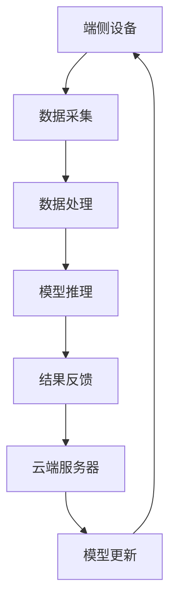

                 

关键词：端侧大模型、AI交互、端云协同、边缘计算、人机交互、智能设备、模型压缩

摘要：本文深入探讨了端侧大模型的发展趋势及其在未来人机交互中的潜在作用。随着人工智能技术的不断发展，端侧大模型在智能设备中的应用越来越广泛，如何实现端云协同和降低模型对计算资源的需求成为关键。本文将介绍端侧大模型的核心概念、算法原理、数学模型、项目实践以及未来应用场景，为读者提供一个全面的技术视角。

## 1. 背景介绍

在过去的几年中，人工智能（AI）技术取得了显著的进展，尤其是深度学习（Deep Learning）的兴起，使得机器在各种任务上的表现大幅提升。传统的AI模型大多依赖于云计算资源，但随着物联网（IoT）设备的普及，用户对实时性、隐私保护和低延迟的需求越来越高，端侧大模型的提出正是一种应对这些挑战的解决方案。

端侧大模型是指在智能设备（如智能手机、可穿戴设备、智能家居设备等）本地运行的复杂机器学习模型。它们具有以下几个显著特点：

1. **实时性**：端侧大模型可以处理本地数据，无需依赖云服务，从而实现了低延迟的响应。
2. **隐私保护**：端侧大模型处理的数据不离开设备，有助于保护用户隐私。
3. **资源受限**：智能设备通常计算资源有限，端侧大模型需要在这些资源受限的环境下高效运行。

## 2. 核心概念与联系

### 2.1 端侧大模型原理

端侧大模型基于深度神经网络（DNN），通过多层非线性变换来学习数据的特征。与传统云计算相比，端侧大模型的训练和推理过程更加复杂，需要考虑资源分配、模型压缩和端云协同等因素。

### 2.2 端云协同架构

端云协同是指端侧设备和云端服务器之间的协作，通过将部分计算任务分配给端侧设备，减轻云端服务器的负担。这种架构可以提高系统的整体性能和可靠性。



### 2.3 边缘计算与端侧大模型

边缘计算（Edge Computing）是一种分布式计算架构，将计算任务分散到网络的边缘节点，以减少数据传输的延迟。端侧大模型与边缘计算的结合，可以进一步提高系统的响应速度和效率。

## 3. 核心算法原理 & 具体操作步骤

### 3.1 算法原理概述

端侧大模型的算法原理主要涉及以下几个步骤：

1. **数据预处理**：对采集到的数据进行清洗、归一化等处理。
2. **模型训练**：使用大量的数据进行训练，以优化模型的参数。
3. **模型压缩**：对训练好的模型进行压缩，以降低模型的体积和计算复杂度。
4. **模型部署**：将压缩后的模型部署到端侧设备上。
5. **模型推理**：在端侧设备上对输入数据进行推理，以获得预测结果。

### 3.2 算法步骤详解

1. **数据预处理**：
    - 清洗：去除噪声和异常值。
    - 归一化：将数据缩放到相同的范围。
    - 特征提取：从原始数据中提取有用的特征。

2. **模型训练**：
    - 初始化：初始化模型参数。
    - 前向传播：计算输入数据的输出。
    - 反向传播：更新模型参数。
    - 训练循环：重复前向传播和反向传播，直到模型收敛。

3. **模型压缩**：
    - 权重剪枝：去除权重较小的神经元。
    - 知识蒸馏：使用一个更大的模型来训练一个更小的模型。
    - 量化：将浮点数参数转换为整数。

4. **模型部署**：
    - 转换：将训练好的模型转换为端侧设备支持的格式。
    - 部署：将模型部署到端侧设备上。

5. **模型推理**：
    - 输入：接收端侧设备输入的数据。
    - 推理：在模型上进行推理，得到预测结果。
    - 输出：将预测结果返回给端侧设备。

### 3.3 算法优缺点

**优点**：

1. 实时性强：端侧大模型可以本地处理数据，响应速度快。
2. 隐私保护：处理的数据不离开设备，有助于保护用户隐私。
3. 资源高效：通过模型压缩，可以在有限的计算资源下运行。

**缺点**：

1. 计算复杂度高：端侧大模型需要大量的计算资源，对设备性能要求较高。
2. 模型更新困难：端侧设备的存储和带宽有限，更新模型较为困难。

### 3.4 算法应用领域

端侧大模型可以应用于多个领域，如：

1. **图像识别**：在智能手机中进行实时图像识别。
2. **自然语言处理**：在智能音箱中进行语音识别和语义理解。
3. **智能监控**：在安防设备中进行实时视频分析。
4. **医疗诊断**：在便携式医疗设备中进行疾病诊断。

## 4. 数学模型和公式 & 详细讲解 & 举例说明

### 4.1 数学模型构建

端侧大模型的数学模型主要基于深度神经网络（DNN），其核心是多层感知机（MLP）。以下是一个简化的MLP模型：

$$
Z = \sigma(W_2 \cdot \sigma(W_1 \cdot X + b_1) + b_2)
$$

其中，$X$ 为输入数据，$W_1$ 和 $W_2$ 为权重矩阵，$b_1$ 和 $b_2$ 为偏置项，$\sigma$ 为激活函数（通常为ReLU函数）。

### 4.2 公式推导过程

MLP模型的推导过程主要涉及前向传播和反向传播。以下是一个简化的推导过程：

**前向传播**：

$$
Z_1 = \sigma(W_1 \cdot X + b_1) \\
Z_2 = W_2 \cdot Z_1 + b_2 \\
Y = \sigma(Z_2)
$$

**反向传播**：

$$
\Delta Z_2 = (Y - \text{标签}) \cdot \sigma'(Z_2) \\
\Delta W_2 = \Delta Z_2 \cdot Z_1 \\
\Delta b_2 = \Delta Z_2 \\
\Delta Z_1 = \Delta Z_2 \cdot W_2 \cdot \sigma'(Z_1) \\
\Delta W_1 = \Delta Z_1 \cdot X \\
\Delta b_1 = \Delta Z_1
$$

### 4.3 案例分析与讲解

假设我们有一个简单的图像识别任务，输入为28x28像素的灰度图像，输出为10个类别（数字0-9）的概率分布。我们可以使用一个简单的MLP模型来进行分类。

**步骤1：数据预处理**

首先，对输入图像进行归一化处理，将像素值缩放到[0, 1]范围内。

**步骤2：模型训练**

我们使用一个具有2层隐藏层的MLP模型进行训练。训练过程中，通过前向传播和反向传播来更新模型的权重和偏置。

**步骤3：模型压缩**

在模型训练完成后，我们可以通过权重剪枝和知识蒸馏来压缩模型。

**步骤4：模型部署**

将压缩后的模型转换为端侧设备支持的格式（如ONNX、TFLite），并将其部署到端侧设备上。

**步骤5：模型推理**

在端侧设备上，使用部署后的模型对输入图像进行推理，得到每个类别的概率分布。

## 5. 项目实践：代码实例和详细解释说明

### 5.1 开发环境搭建

为了实现端侧大模型，我们需要搭建一个开发环境。以下是所需的工具和步骤：

1. **Python**：用于编写和运行代码。
2. **TensorFlow**：用于构建和训练模型。
3. **TensorFlow Lite**：用于将模型部署到端侧设备。

### 5.2 源代码详细实现

以下是一个简单的Python代码示例，用于实现一个端侧大模型：

```python
import tensorflow as tf

# 数据预处理
def preprocess_image(image_path):
    image = tf.io.read_file(image_path)
    image = tf.image.decode_jpeg(image, channels=1)
    image = tf.cast(image, tf.float32) / 255.0
    image = tf.expand_dims(image, 0)
    return image

# 模型定义
model = tf.keras.Sequential([
    tf.keras.layers.Conv2D(32, (3, 3), activation='relu', input_shape=(28, 28, 1)),
    tf.keras.layers.MaxPooling2D((2, 2)),
    tf.keras.layers.Conv2D(64, (3, 3), activation='relu'),
    tf.keras.layers.MaxPooling2D((2, 2)),
    tf.keras.layers.Flatten(),
    tf.keras.layers.Dense(128, activation='relu'),
    tf.keras.layers.Dense(10, activation='softmax')
])

# 模型训练
model.compile(optimizer='adam', loss='categorical_crossentropy', metrics=['accuracy'])
model.fit(train_images, train_labels, epochs=10, validation_split=0.2)

# 模型压缩
converter = tf.lite.TFLiteConverter.from_keras_model(model)
tflite_model = converter.convert()

# 模型部署
with open('model.tflite', 'wb') as f:
    f.write(tflite_model)

# 模型推理
interpreter = tf.lite.Interpreter(model_path='model.tflite')
interpreter.allocate_tensors()
input_details = interpreter.get_input_details()
output_details = interpreter.get_output_details()

# 输入图像预处理
input_image = preprocess_image('image_path.jpg')

# 模型推理
interpreter.set_tensor(input_details[0]['index'], input_image)
interpreter.invoke()

# 获取预测结果
predictions = interpreter.get_tensor(output_details[0]['index'])

# 输出结果
print(predictions)
```

### 5.3 代码解读与分析

上述代码实现了从图像预处理到模型推理的完整流程。以下是代码的解读与分析：

1. **数据预处理**：使用TensorFlow中的函数读取图像文件，并进行归一化和形状转换。
2. **模型定义**：定义了一个简单的卷积神经网络（CNN）模型，用于图像分类。
3. **模型训练**：使用训练数据对模型进行训练，使用交叉熵损失函数和Adam优化器。
4. **模型压缩**：使用TensorFlow Lite将模型转换为TFLite格式，以便部署到端侧设备。
5. **模型部署**：将TFLite模型保存到文件中，以便后续使用。
6. **模型推理**：使用TFLite Interpreter对输入图像进行推理，并获取预测结果。

## 6. 实际应用场景

端侧大模型在多个领域具有广泛的应用前景，以下是几个典型的应用场景：

1. **智能手机**：在智能手机中，端侧大模型可以用于图像识别、语音识别、智能推荐等任务，提高用户体验。
2. **智能音箱**：在智能音箱中，端侧大模型可以用于语音识别、自然语言处理，实现更自然的交互体验。
3. **智能监控**：在智能监控系统中，端侧大模型可以用于实时视频分析，实现智能预警和异常检测。
4. **医疗诊断**：在便携式医疗设备中，端侧大模型可以用于疾病诊断和健康监测，提高医疗服务的效率。

## 7. 未来应用展望

随着人工智能技术的不断发展，端侧大模型在未来的人机交互中将发挥越来越重要的作用。以下是未来应用的一些展望：

1. **智能家居**：端侧大模型可以实现更智能的家居控制，如自动调节温度、光线等。
2. **智能交通**：端侧大模型可以用于实时交通流量分析，实现智能交通管理。
3. **智能医疗**：端侧大模型可以用于个性化医疗诊断和治疗，提高医疗服务的质量和效率。

## 8. 工具和资源推荐

为了更好地理解和应用端侧大模型，以下是几个推荐的工具和资源：

1. **学习资源**：
    - 《深度学习》（Goodfellow, Bengio, Courville著）：一本经典的深度学习教材，详细介绍了深度神经网络的原理和应用。
    - 《TensorFlow官方文档》：提供了详细的TensorFlow使用教程和API文档。

2. **开发工具**：
    - TensorFlow：一个开源的深度学习框架，适用于构建和训练端侧大模型。
    - TensorFlow Lite：用于将训练好的模型部署到端侧设备。

3. **相关论文**：
    - “Deep Learning on Mobile Devices”（2018）：一篇关于在移动设备上实现深度学习的综述文章。
    - “EfficientNet：Rethinking Model Scaling for Convolutional Neural Networks”（2020）：一篇关于高效模型缩放的研究论文。

## 9. 总结：未来发展趋势与挑战

端侧大模型作为人工智能技术的重要组成部分，具有广泛的应用前景。然而，在未来的发展中，我们还需要面对以下几个挑战：

1. **计算资源优化**：如何在有限的计算资源下高效运行端侧大模型，仍是一个重要的研究方向。
2. **数据隐私保护**：如何在保证数据隐私的前提下，充分利用端侧大模型的优势。
3. **模型更新与维护**：端侧设备的存储和带宽有限，如何实现模型的持续更新和维护。

作者：禅与计算机程序设计艺术 / Zen and the Art of Computer Programming
----------------------------------------------------------------

本文通过详细阐述端侧大模型的核心概念、算法原理、数学模型、项目实践以及未来应用场景，全面介绍了端侧大模型在人工智能领域的重要作用。在未来，随着技术的不断进步，端侧大模型有望在智能家居、智能交通、智能医疗等多个领域发挥更大的作用。然而，我们仍需不断解决计算资源优化、数据隐私保护、模型更新与维护等挑战，以推动端侧大模型技术的持续发展。

