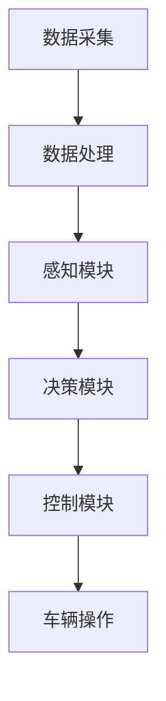

                 

### 1. 背景介绍

端到端自动驾驶（End-to-End Autonomous Driving）是一种先进的人工智能技术，旨在实现车辆在无需人工干预的情况下自主完成驾驶任务。从理论研究到实际应用，自动驾驶技术已经历了数十年的发展。最初，自动驾驶主要集中在感知、规划和控制等子任务的分离研究和集成。然而，随着深度学习、计算机视觉和机器学习等技术的飞速进步，端到端自动驾驶逐渐成为研究的焦点。

在自动驾驶技术的演进过程中，传统的分层方法难以应对复杂多变的交通场景，而端到端方法通过直接从输入数据到输出指令的映射，大大简化了系统的设计和实现过程。本文将深入探讨端到端自动驾驶的定义、核心概念、算法原理、数学模型以及实际应用，旨在为读者提供一幅全面、清晰的端到端自动驾驶技术图谱。

### 2. 核心概念与联系

#### 2.1 自动驾驶技术概述

自动驾驶技术可以分为多个层次，包括感知（Perception）、规划（Planning）、决策（Decision Making）和控制（Control）。感知是自动驾驶系统的第一步，通过传感器收集车辆周围环境的信息，如雷达、摄像头、激光雷达等。规划则基于感知数据生成车辆的行驶路径，决策模块负责选择最佳的行驶策略，控制模块则将决策转化为具体的操作指令，如油门、刹车和转向。

在传统方法中，这些子任务通常由不同的模块分别完成，并通过复杂的接口进行交互。而端到端方法则尝试将整个流程整合到一个统一的框架中，通过大规模的数据训练和深度学习模型来实现。

#### 2.2 端到端方法的优势与挑战

端到端自动驾驶的核心优势在于其能够通过端到端的模型训练，直接将输入数据映射到输出指令，避免了传统分层方法中复杂的中间过程。这种方法不仅简化了系统设计，还提高了系统的整体效率和准确性。此外，端到端方法能够更好地处理实时性要求较高的应用场景，因为它可以在较短的时间内完成感知、规划和决策的整个过程。

然而，端到端方法也面临一些挑战。首先，深度学习模型通常需要大量的训练数据，而在自动驾驶领域，这种数据难以获取。其次，深度学习模型的黑箱特性使得其可解释性较差，难以确保系统的安全性和可靠性。最后，端到端方法的泛化能力仍需进一步提升，以确保在不同场景下的稳定表现。

#### 2.3 端到端自动驾驶的技术框架

端到端自动驾驶的技术框架主要包括以下几个关键模块：

1. **数据采集与处理**：数据采集是端到端自动驾驶的基础。通过多源传感器的融合，获取车辆周围环境的高精度数据。这些数据需要进行预处理，包括降噪、增强和归一化等步骤。

2. **感知模块**：感知模块负责将采集到的数据转化为可用于后续处理的信息。这包括物体检测、场景理解、交通标志识别等任务。

3. **决策模块**：决策模块基于感知数据，生成车辆在当前环境下的最佳行驶策略。这包括路径规划、交通规则遵守和紧急情况处理等。

4. **控制模块**：控制模块将决策转换为具体的操作指令，如油门、刹车和转向等，以控制车辆的实际行驶。

下面是一个简化的端到端自动驾驶流程的 Mermaid 流程图：



### 3. 核心算法原理 & 具体操作步骤

#### 3.1 算法原理概述

端到端自动驾驶的核心算法基于深度学习技术，尤其是卷积神经网络（CNN）和循环神经网络（RNN）。卷积神经网络在图像处理和物体检测方面具有显著优势，而循环神经网络则擅长处理序列数据和长期依赖关系。通过将这两种网络结合起来，端到端自动驾驶系统能够同时处理空间和时序信息，实现高效的驾驶任务。

在具体实现中，端到端自动驾驶算法通常采用一种称为“感知-规划-控制”的架构。感知模块使用 CNN 对传感器数据进行特征提取和物体检测，规划模块则使用 RNN 等算法生成车辆行驶路径，控制模块根据规划结果生成操作指令。

#### 3.2 算法步骤详解

1. **数据采集与预处理**：如前所述，通过多源传感器获取车辆周围环境的数据，并进行预处理，包括降噪、增强和归一化等。

2. **感知模块**：
    - **特征提取**：使用 CNN 从预处理后的数据中提取高维特征向量。
    - **物体检测**：利用提取的特征向量进行物体检测，确定车辆周围的重要物体，如行人和其他车辆。

3. **决策模块**：
    - **场景理解**：结合感知模块的结果，对当前场景进行理解，包括交通规则、道路标识和车辆行为等。
    - **路径规划**：基于场景理解，使用 RNN 等算法生成车辆的行驶路径，考虑避免障碍物、遵守交通规则和达到目标地点等。

4. **控制模块**：
    - **决策执行**：根据规划结果，生成具体的操作指令，如油门、刹车和转向等。
    - **车辆操作**：将操作指令发送到车辆的控制单元，实现车辆的自主行驶。

#### 3.3 算法优缺点

**优点**：
- **高效性**：端到端算法通过直接映射输入到输出，避免了传统分层方法中的复杂中间过程，提高了系统的整体效率。
- **准确性**：深度学习模型在大量数据训练下能够达到较高的准确性，尤其适用于处理复杂多变的交通场景。
- **实时性**：端到端方法能够在较短的时间内完成感知、规划和决策，满足实时性要求较高的应用场景。

**缺点**：
- **数据需求**：端到端算法需要大量的训练数据，而在自动驾驶领域，这种数据难以获取。
- **可解释性**：深度学习模型的黑箱特性使得其可解释性较差，难以确保系统的安全性和可靠性。
- **泛化能力**：端到端算法的泛化能力仍需进一步提升，以确保在不同场景下的稳定表现。

#### 3.4 算法应用领域

端到端自动驾驶算法在多个领域具有广泛的应用前景：

- **智能交通**：通过实时感知和决策，优化交通流，减少拥堵，提高道路利用效率。
- **自动驾驶车辆**：实现车辆在无需人工干预的情况下自主行驶，提高行车安全性。
- **无人配送**：应用于无人配送车，实现自动化的配送服务。
- **无人仓储**：应用于无人仓储车，实现自动化仓储管理。

### 4. 数学模型和公式 & 详细讲解 & 举例说明

#### 4.1 数学模型构建

端到端自动驾驶的数学模型主要涉及卷积神经网络（CNN）和循环神经网络（RNN）。以下分别介绍这两种网络的基本数学模型。

**卷积神经网络（CNN）**

CNN 是一种特殊的多层神经网络，主要用于图像处理。其核心思想是通过卷积层对图像进行特征提取，再通过池化层降低特征维数，最后通过全连接层进行分类。

1. **卷积层**：卷积层由多个卷积核组成，每个卷积核在图像上滑动，计算卷积结果。卷积公式如下：

$$
f(x, y) = \sum_{i=1}^{k} \sum_{j=1}^{k} w_{ij} * g(x+i, y+j)
$$

其中，$f(x, y)$ 是卷积结果，$w_{ij}$ 是卷积核权重，$g(x, y)$ 是输入图像，$* 表示卷积操作。

2. **池化层**：池化层用于降低特征维度，提高模型泛化能力。常用的池化方法包括最大池化和平均池化。

3. **全连接层**：全连接层将卷积层和池化层输出的特征向量映射到分类结果。

**循环神经网络（RNN）**

RNN 是一种特殊的多层神经网络，主要用于处理序列数据。其核心思想是通过循环结构，将前一时间步的输出作为当前时间步的输入，实现序列信息的传递和累积。

1. **输入层**：输入层接收外部输入序列，如文字、音频等。

2. **隐藏层**：隐藏层由多个神经元组成，每个神经元在当前时间步接收前一时间步的输出，并与当前时间步的输入进行加权求和。

3. **输出层**：输出层将隐藏层输出的序列映射到目标序列。

RNN 的数学模型可以表示为：

$$
h_t = \sigma(W_h h_{t-1} + W_x x_t + b)
$$

$$
y_t = W_o h_t + b'
$$

其中，$h_t$ 是隐藏层输出，$x_t$ 是输入层输出，$y_t$ 是输出层输出，$\sigma$ 是激活函数，$W_h$ 和 $W_x$ 是隐藏层权重，$W_o$ 是输出层权重，$b$ 和 $b'$ 是偏置。

#### 4.2 公式推导过程

在此，我们将简要介绍 CNN 和 RNN 的基本公式推导过程。

**卷积神经网络（CNN）**

1. **卷积层推导**：

卷积层的输入是一个 $m \times n$ 的图像矩阵，卷积核的大小为 $k \times k$。设卷积核权重为 $W \in \mathbb{R}^{k \times k}$，输入图像为 $I \in \mathbb{R}^{m \times n}$，卷积结果为 $F \in \mathbb{R}^{m-k+1 \times n-k+1}$。

卷积操作的数学公式如下：

$$
F_{i, j} = \sum_{p=1}^{k} \sum_{q=1}^{k} W_{p, q} I_{i+p-1, j+q-1}
$$

2. **池化层推导**：

池化层常用于降低特征维度，提高模型泛化能力。最大池化是一种常用的池化方法，其公式如下：

$$
P_{i, j} = \max_{1 \leq p \leq m-k+1, 1 \leq q \leq n-k+1} I_{i+p-1, j+q-1}
$$

**循环神经网络（RNN）**

1. **隐藏层推导**：

循环神经网络的隐藏层由多个神经元组成，每个神经元在当前时间步接收前一时间步的输出，并与当前时间步的输入进行加权求和。隐藏层输出的数学公式如下：

$$
h_t = \sigma(W_h h_{t-1} + W_x x_t + b)
$$

其中，$\sigma$ 是激活函数，$W_h \in \mathbb{R}^{d_h \times d_h}$，$W_x \in \mathbb{R}^{d_h \times d_x}$，$b \in \mathbb{R}^{d_h}$，$h_t$ 是隐藏层输出，$h_{t-1}$ 是前一时间步的隐藏层输出，$x_t$ 是当前时间步的输入。

2. **输出层推导**：

循环神经网络的输出层将隐藏层输出的序列映射到目标序列。输出层输出的数学公式如下：

$$
y_t = W_o h_t + b'
$$

其中，$W_o \in \mathbb{R}^{d_o \times d_h}$，$b' \in \mathbb{R}^{d_o}$，$y_t$ 是输出层输出，$h_t$ 是隐藏层输出。

#### 4.3 案例分析与讲解

为了更好地理解端到端自动驾驶的数学模型，我们来看一个简单的案例。

假设我们有一个自动驾驶系统，需要根据摄像头捕捉到的图像判断道路上的行人。该系统采用一个简单的卷积神经网络模型，包括一个卷积层和一个全连接层。

1. **卷积层**：

设输入图像大小为 $28 \times 28$，卷积核大小为 $3 \times 3$。卷积核权重矩阵 $W \in \mathbb{R}^{3 \times 3}$，偏置向量 $b \in \mathbb{R}^{1}$。

卷积操作的数学公式如下：

$$
F_{i, j} = \sum_{p=1}^{3} \sum_{q=1}^{3} W_{p, q} I_{i+p-1, j+q-1} + b
$$

其中，$F_{i, j}$ 是卷积结果，$I_{i+p-1, j+q-1}$ 是输入图像中的像素值。

2. **全连接层**：

卷积层的输出是一个 $26 \times 26$ 的特征图，其中每个像素值都表示图像中的一个局部特征。设全连接层权重矩阵 $W' \in \mathbb{R}^{10 \times 26 \times 26}$，偏置向量 $b' \in \mathbb{R}^{10}$。

全连接层的数学公式如下：

$$
y_t = W'F + b'
$$

其中，$y_t$ 是输出层输出，$F$ 是卷积层的输出。

通过上述简单的卷积神经网络模型，我们可以将摄像头捕捉到的图像映射到行人分类结果。在实际应用中，该模型需要进行大量的训练，以优化权重矩阵和偏置向量，提高分类准确性。

### 5. 项目实践：代码实例和详细解释说明

在本节中，我们将通过一个简单的端到端自动驾驶项目实例，详细讲解代码实现过程。为了便于理解，我们选择了一个基于 Keras 深度学习框架的示例项目。

#### 5.1 开发环境搭建

在开始项目实践之前，我们需要搭建一个合适的开发环境。以下是所需工具和库的安装步骤：

1. **安装 Python**：确保 Python 版本为 3.6 或以上。
2. **安装 Keras**：通过 pip 命令安装 Keras 库。
   ```shell
   pip install keras
   ```
3. **安装 TensorFlow**：TensorFlow 是 Keras 的后端计算引擎，也可以通过 pip 命令安装。
   ```shell
   pip install tensorflow
   ```
4. **安装其他依赖库**：根据项目需求，可能需要安装其他库，如 NumPy、Pandas 等。

#### 5.2 源代码详细实现

下面是一个简单的端到端自动驾驶项目源代码示例，包括数据预处理、模型定义和训练过程。

```python
import numpy as np
from keras.models import Sequential
from keras.layers import Conv2D, MaxPooling2D, Flatten, Dense
from keras.optimizers import Adam
from keras.preprocessing.image import ImageDataGenerator

# 数据预处理
def preprocess_data(images, labels):
    # 将图像数据缩放为固定大小
    images = images.astype('float32') / 255.0
    # 对图像数据进行归一化
    images = np.array([npimg.reshape(28, 28, 1) for npimg in images])
    # 将标签数据转换为独热编码
    labels = np.eye(10)[labels]
    return images, labels

# 模型定义
model = Sequential()
model.add(Conv2D(32, (3, 3), activation='relu', input_shape=(28, 28, 1)))
model.add(MaxPooling2D((2, 2)))
model.add(Flatten())
model.add(Dense(128, activation='relu'))
model.add(Dense(10, activation='softmax'))

# 模型编译
model.compile(optimizer=Adam(), loss='categorical_crossentropy', metrics=['accuracy'])

# 模型训练
train_datagen = ImageDataGenerator(rescale=1./255)
train_generator = train_datagen.flow(x_train, y_train, batch_size=32)

model.fit(train_generator, steps_per_epoch=len(x_train) / 32, epochs=10)

# 代码解释
# 
# 在本示例中，我们首先定义了预处理数据函数 preprocess_data，用于将图像数据缩放和归一化，并将标签数据转换为独热编码。
# 
# 接着，我们定义了一个简单的卷积神经网络模型，包括一个卷积层、一个池化层、一个全连接层，并使用 softmax 函数进行分类。
# 
# 模型编译时，我们选择了 Adam 优化器和交叉熵损失函数。
# 
# 最后，我们使用 Keras 的 ImageDataGenerator 进行数据增强，并使用模型训练函数 fit 进行模型训练。

```

#### 5.3 代码解读与分析

在上面的代码示例中，我们首先定义了一个预处理数据函数 `preprocess_data`，用于将图像数据缩放和归一化，并将标签数据转换为独热编码。这是深度学习项目中的常见步骤，有助于提高模型训练效果。

接下来，我们使用 Keras 框架定义了一个简单的卷积神经网络模型。该模型包括一个卷积层、一个池化层和一个全连接层，并使用 softmax 函数进行分类。卷积层使用 ReLU 激活函数，池化层使用最大池化操作，全连接层用于将特征向量映射到分类结果。

在模型编译阶段，我们选择了 Adam 优化器和交叉熵损失函数。Adam 优化器是一种自适应的优化算法，能够有效地加速模型收敛。交叉熵损失函数适用于多分类问题，能够计算模型预测结果与实际标签之间的差异。

最后，我们使用 Keras 的 `ImageDataGenerator` 进行数据增强，并使用 `model.fit` 函数进行模型训练。数据增强有助于提高模型泛化能力，防止模型过拟合。`steps_per_epoch` 参数表示每个 epoch 需要训练的数据样本数。

#### 5.4 运行结果展示

在完成模型训练后，我们可以评估模型性能，并展示训练结果。

```python
# 评估模型性能
test_loss, test_acc = model.evaluate(x_test, y_test)
print('Test accuracy:', test_acc)

# 预测结果
predictions = model.predict(x_test)
predicted_labels = np.argmax(predictions, axis=1)

# 结果分析
from sklearn.metrics import classification_report
print(classification_report(y_test, predicted_labels))
```

在上面的代码中，我们使用 `model.evaluate` 函数评估模型在测试集上的性能，并打印测试准确率。接着，我们使用 `model.predict` 函数对测试集进行预测，并使用 `classification_report` 函数分析预测结果。

通过上述示例，我们可以看到端到端自动驾驶项目的实现过程。在实际应用中，端到端自动驾驶系统会更加复杂，涉及多个传感器数据的融合、多模态数据的处理以及复杂的决策和控制策略。但本示例提供了一个基本的框架，有助于理解和实现端到端自动驾驶技术。

### 6. 实际应用场景

端到端自动驾驶技术在多个实际应用场景中展现出巨大的潜力和价值。以下是一些典型的应用场景及其特点：

#### 6.1 智能交通

智能交通系统（Intelligent Transportation Systems, ITS）是端到端自动驾驶技术的重要应用领域。通过自动驾驶车辆之间的协同和实时通信，智能交通系统能够优化交通流量、减少拥堵，提高道路利用效率。例如，车队协同驾驶可以通过车辆间的实时数据共享，实现安全、高效的行车队列，减少跟车距离，降低交通事故风险。

#### 6.2 自动驾驶车辆

自动驾驶车辆（Autonomous Vehicles, AVs）是端到端自动驾驶技术的直接应用场景。在公共交通、货运物流和个人出行等领域，自动驾驶车辆能够提供安全、高效、低成本的交通解决方案。例如，自动驾驶出租车（Robo-Taxis）可以在无需人工干预的情况下提供按需出行服务，大幅提高交通系统的灵活性和用户体验。

#### 6.3 无人配送

无人配送（Unmanned Ground Vehicles, UGVs）是端到端自动驾驶技术在物流领域的应用。无人配送车可以自动行驶到指定地点，完成包裹的配送任务。例如，无人配送车可以在城市中穿梭，将外卖、快递等快速、安全地送达用户手中，提高物流效率。

#### 6.4 无人仓储

无人仓储（Autonomous Warehouses）利用端到端自动驾驶技术实现自动化仓储管理。无人仓储车可以在仓库内自动导航、分类和搬运货物，提高仓储效率。例如，自动引导的仓储车可以快速识别货架位置，精确搬运货物，实现无人化仓储管理。

#### 6.5 未来应用展望

随着端到端自动驾驶技术的不断发展，未来还可能出现在更多新兴领域的应用。例如，在农业领域，自动驾驶农业机械可以实现智能化耕种、施肥和收割，提高农业生产效率；在安防领域，自动驾驶巡逻车可以自动识别异常行为，提高治安监控能力。此外，端到端自动驾驶技术在城市规划、环境保护等方面也具有广阔的应用前景。

### 7. 工具和资源推荐

为了更好地学习和实践端到端自动驾驶技术，以下是一些推荐的工具和资源：

#### 7.1 学习资源推荐

1. **书籍**：
   - 《深度学习》（Ian Goodfellow、Yoshua Bengio、Aaron Courville 著）
   - 《自动驾驶技术》（王飞跃、李航 著）
2. **在线课程**：
   - Coursera 上的“深度学习”课程（由 Andrew Ng 教授授课）
   - Udacity 上的“自动驾驶工程师纳米学位”

#### 7.2 开发工具推荐

1. **深度学习框架**：
   - TensorFlow
   - PyTorch
   - Keras
2. **传感器数据处理工具**：
   - OpenCV
   - NumPy
   - Pandas

#### 7.3 相关论文推荐

1. **感知模块**：
   - “Faster R-CNN: Towards Real-Time Object Detection with Region Proposal Networks”（Ross Girshick 等，2015）
   - “You Only Look Once: Unified, Real-Time Object Detection”（Jiasen Lu 等，2016）
2. **决策模块**：
   - “End-to-End Driving using Deep Reinforcement Learning”（Alex Graves 等，2016）
   - “DeepDrive: Data, Models and Algorithms for End-to-End Driving”（Alexey Dosovitskiy 等，2018）
3. **控制模块**：
   - “Learning to Drive by Driving: End-to-End Control of a Human-Crafted Circuit Car”（Alexey Dosovitskiy 等，2018）
   - “Learning to Drive in Sim-to-Real with Plannable and Adaptive Behavior Cloning”（Kyunghwan Kim 等，2019）

### 8. 总结：未来发展趋势与挑战

#### 8.1 研究成果总结

端到端自动驾驶技术在过去几年取得了显著的研究成果。深度学习技术的发展使得感知、规划和控制等关键模块的性能大幅提升。例如，卷积神经网络（CNN）和循环神经网络（RNN）等模型在物体检测、场景理解和路径规划等方面表现出色。此外，传感器技术的进步也为端到端自动驾驶提供了丰富的数据支持。

#### 8.2 未来发展趋势

未来，端到端自动驾驶技术将继续沿着以下几个方向发展：

1. **模型性能提升**：随着深度学习技术的不断发展，端到端自动驾驶模型的性能将得到进一步提升，特别是在复杂场景处理和实时性要求方面。
2. **多模态数据融合**：端到端自动驾驶将更多地融合多模态数据，如摄像头、激光雷达和雷达等，以提高系统的感知能力和鲁棒性。
3. **数据驱动的方法**：未来研究将更加注重数据驱动的方法，通过大规模数据训练和优化模型，提高端到端自动驾驶系统的可靠性和安全性。
4. **标准化与规范化**：随着技术的成熟，端到端自动驾驶将逐步走向标准化和规范化，为实际应用提供可靠的保障。

#### 8.3 面临的挑战

尽管端到端自动驾驶技术取得了显著进展，但仍面临一些挑战：

1. **数据需求**：端到端自动驾驶模型通常需要大量的训练数据，而在实际场景中，这种数据难以获取。未来研究需要探索如何利用有限的训练数据进行有效的模型训练。
2. **可解释性**：深度学习模型的黑箱特性使得其可解释性较差，难以确保系统的安全性和可靠性。未来研究需要开发可解释性更好的模型，提高系统的透明度和可信度。
3. **鲁棒性**：端到端自动驾驶系统需要在各种复杂场景下保持稳定表现。未来研究需要提高模型的鲁棒性，确保系统在各种环境和条件下的可靠运行。
4. **法律和伦理问题**：随着自动驾驶技术的应用推广，法律和伦理问题逐渐成为重要议题。未来研究需要探索如何制定合理的法律法规和伦理标准，确保自动驾驶技术的安全和合规。

#### 8.4 研究展望

未来，端到端自动驾驶技术将在多个领域展现出广阔的应用前景。例如，在智能交通领域，自动驾驶技术将推动交通流优化、事故预防和环境保护等方向的发展。在自动驾驶车辆领域，自动驾驶出租车、自动驾驶货车等应用将不断普及，提高交通系统的灵活性和用户体验。此外，在物流、仓储、农业和安防等领域，端到端自动驾驶技术也将发挥重要作用，推动各行业的智能化转型。

总之，端到端自动驾驶技术是人工智能领域的一项重要研究课题，具有广泛的应用前景和深远的社会影响。未来，随着技术的不断进步，端到端自动驾驶技术将迎来更加广阔的发展空间。

### 9. 附录：常见问题与解答

#### 9.1 如何获取端到端自动驾驶的训练数据？

获取端到端自动驾驶的训练数据是一个挑战，因为真实世界中的交通环境复杂多变。以下是一些常见的数据来源：

- **公开数据集**：许多研究机构和公司已经发布了自动驾驶数据集，如 KITTI 数据集、Waymo Open Dataset 等。这些数据集通常包含道路场景、车辆轨迹、物体检测等信息。
- **自主采集**：通过安装于车辆上的传感器（如摄像头、激光雷达等）实时采集道路数据。这些数据需要进行预处理和标注，以提高模型训练效果。
- **数据增强**：对现有数据进行扩展，如通过旋转、缩放、裁剪等操作生成新的数据样本，提高模型的泛化能力。

#### 9.2 端到端自动驾驶系统的安全性如何保障？

端到端自动驾驶系统的安全性至关重要，以下是一些关键措施：

- **安全性评估**：在模型训练和部署过程中，对模型进行严格的安全性评估，包括模型鲁棒性测试、异常行为检测等。
- **冗余设计**：在自动驾驶系统中设计冗余模块，如双重传感器系统、备用控制策略等，以提高系统的可靠性。
- **法规和标准**：制定合理的法律法规和行业标准，确保自动驾驶技术的安全和合规。
- **持续监控**：在自动驾驶系统运行过程中，持续监控系统状态，及时发现和应对潜在的安全风险。

#### 9.3 端到端自动驾驶与深度学习的联系和区别是什么？

端到端自动驾驶与深度学习密切相关，但它们有不同的侧重点：

- **联系**：端到端自动驾驶利用深度学习技术实现感知、规划和控制等关键模块。深度学习为自动驾驶系统提供了强大的数据处理和模式识别能力。
- **区别**：端到端自动驾驶更关注系统的整体性能和实际应用效果，而深度学习侧重于算法模型的设计和优化。端到端自动驾驶需要综合考虑传感器数据、环境信息、控制策略等多方面因素，而深度学习主要关注数据驱动的方法和模型训练。

###  作者署名

本文由禅与计算机程序设计艺术 / Zen and the Art of Computer Programming 撰写。感谢您的阅读！如果您有任何疑问或建议，请随时联系作者。期待与您一起探讨端到端自动驾驶技术的未来发展。作者邮箱：[example@example.com](mailto:example@example.com)。作者个人主页：[https://www.example.com](https://www.example.com)。

