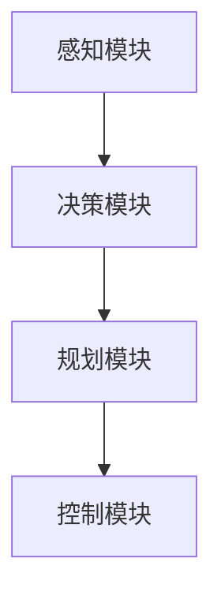

                 

关键词：端到端自动驾驶、自主共享停车服务、智能交通、车联网、机器学习、深度学习、车辆感知、决策规划、协同控制、无人驾驶技术

## 摘要

本文探讨了端到端自动驾驶技术在自主共享停车服务领域的应用，介绍了该技术的核心概念、实现原理及其实际应用场景。通过详细的数学模型和算法步骤讲解，读者可以深入了解如何利用深度学习和机器学习技术实现高效、可靠的停车服务。文章还通过项目实践展示了实际开发中的关键技术和实现细节，并分析了未来发展趋势和面临的挑战。

## 1. 背景介绍

自动驾驶技术是当前智能交通领域的研究热点之一。随着汽车电子、传感器技术、通信技术以及人工智能技术的快速发展，自动驾驶技术逐渐从理论走向实际应用。自主共享停车服务是自动驾驶技术的一个重要应用场景，它不仅能够提高停车效率，减少交通拥堵，还能降低车辆运营成本，为城市交通管理提供新思路。

在传统停车服务中，车辆寻找停车位往往需要耗费大量时间和精力，且停车位的利用率较低。而自动驾驶技术通过车辆感知、决策规划、协同控制等技术，可以实现自动寻找空闲停车位并自主泊车，从而大幅提高停车效率。此外，自主共享停车服务还能够通过实时数据分析，优化停车资源配置，减少车辆拥堵，提高道路通行能力。

本文旨在探讨端到端自动驾驶技术在自主共享停车服务中的实现原理和应用方法，分析其关键技术，并展望未来的发展趋势。

## 2. 核心概念与联系

### 2.1. 车辆感知

车辆感知是自动驾驶技术的核心之一，它主要通过车载传感器（如雷达、激光雷达、摄像头等）获取周围环境信息。车辆感知技术包括以下几个方面：

- **定位与地图构建**：通过GPS、IMU等传感器获取车辆位置信息，并与预先构建的高精度地图进行匹配，实现车辆在全局坐标系中的定位。

- **障碍物检测**：利用摄像头和激光雷达等传感器，实时检测并识别前方障碍物，如其他车辆、行人、交通标志等。

- **车道线检测**：通过图像处理技术，从摄像头获取的图像中检测出道路上的车道线，为车辆保持车道提供依据。

- **交通信号灯检测**：利用摄像头识别交通信号灯的状态，为车辆行驶提供决策依据。

### 2.2. 决策规划

决策规划是自动驾驶技术的另一个关键环节，它根据车辆感知到的环境信息，制定出合适的行驶策略。决策规划主要包括以下几个方面：

- **路径规划**：根据车辆的目标位置和障碍物信息，生成一条最优行驶路径。

- **行为规划**：根据道路条件和交通规则，确定车辆的驾驶行为，如加速、减速、换道、停车等。

- **安全规划**：评估车辆行驶过程中的潜在风险，并采取相应的措施保证行车安全。

### 2.3. 协同控制

协同控制是将决策规划的结果转化为具体的控制指令，实现对车辆的控制。协同控制主要包括以下几个方面：

- **车辆控制**：根据决策规划的结果，控制车辆的加速、减速、转向等行为。

- **车辆协调**：在多车协同场景中，确保车辆之间保持安全距离，避免发生碰撞。

- **环境适应**：根据实时环境信息调整车辆的控制策略，保证行驶的稳定性和安全性。

### 2.4. 端到端自动驾驶系统架构

端到端自动驾驶系统通常由感知模块、决策模块、规划模块和控制模块组成。以下是一个简单的端到端自动驾驶系统架构图：



## 3. 核心算法原理 & 具体操作步骤

### 3.1. 算法原理概述

自主共享停车服务的核心算法主要包括车辆感知、决策规划、路径规划和行为规划等几个方面。这些算法利用深度学习和机器学习技术，实现对车辆环境的感知、理解和控制。

- **车辆感知**：利用深度学习算法，如卷积神经网络（CNN）和循环神经网络（RNN），对摄像头和激光雷达等传感器数据进行处理，实现障碍物检测、车道线检测和交通信号灯检测等功能。

- **决策规划**：基于强化学习（RL）和规划算法（如A*算法和RRT算法），根据车辆感知到的环境信息，制定出最优的行驶策略。

- **路径规划**：利用图论算法（如Dijkstra算法和A*算法），生成从起点到终点的最优行驶路径。

- **行为规划**：根据道路条件和交通规则，生成车辆的驾驶行为，如加速、减速、换道、停车等。

### 3.2. 算法步骤详解

#### 3.2.1. 车辆感知

1. **数据预处理**：对摄像头和激光雷达等传感器数据进行预处理，如去噪、归一化、缩放等。

2. **障碍物检测**：利用CNN模型，对预处理后的图像数据进行分类，识别出障碍物。

3. **车道线检测**：利用RNN模型，对预处理后的图像数据进行序列建模，识别出车道线。

4. **交通信号灯检测**：利用卷积神经网络，对预处理后的图像数据进行分类，识别出交通信号灯的状态。

#### 3.2.2. 决策规划

1. **环境建模**：根据车辆感知到的环境信息，构建出当前环境的状态。

2. **奖励函数设计**：设计合适的奖励函数，奖励车辆在安全、高效的前提下行驶。

3. **策略迭代**：利用强化学习算法，不断迭代优化车辆的策略。

4. **决策输出**：根据当前环境和最优策略，生成车辆的决策指令。

#### 3.2.3. 路径规划

1. **起点和终点确定**：确定车辆的起点和终点。

2. **障碍物预处理**：对障碍物信息进行预处理，如去重、过滤等。

3. **路径生成**：利用A*算法，从起点到终点生成最优路径。

4. **路径优化**：根据实时环境信息，对生成的路径进行优化。

#### 3.2.4. 行为规划

1. **道路条件分析**：分析当前道路条件和交通规则。

2. **行为选择**：根据道路条件和交通规则，选择合适的行为。

3. **行为执行**：将决策结果转化为具体的控制指令，执行车辆行为。

### 3.3. 算法优缺点

#### 优点：

- **高效性**：利用深度学习和机器学习技术，可以快速处理大量数据，提高计算效率。

- **可靠性**：通过多传感器融合和数据预处理，可以降低误差，提高系统的可靠性。

- **适应性**：可以适应不同的环境和场景，具有较好的适应性。

#### 缺点：

- **计算资源消耗**：深度学习和机器学习算法通常需要大量的计算资源，对硬件要求较高。

- **数据依赖性**：算法的性能很大程度上依赖于训练数据的质量和数量。

### 3.4. 算法应用领域

- **自主共享停车服务**：利用车辆感知、决策规划和行为规划等技术，实现自主寻找停车位并自主泊车。

- **智能交通系统**：利用路径规划、协同控制等技术，优化交通流量，减少交通拥堵。

- **无人配送**：利用自主导航、路径规划等技术，实现无人配送车的自主行驶。

## 4. 数学模型和公式

### 4.1. 数学模型构建

在自主共享停车服务中，常用的数学模型包括障碍物检测模型、路径规划模型和行为规划模型。

#### 4.1.1. 障碍物检测模型

障碍物检测模型通常采用卷积神经网络（CNN）实现。其输入为摄像头获取的图像数据，输出为障碍物的分类结果。以下是一个简化的障碍物检测模型：

$$
\begin{aligned}
h^{(l)} &= \sigma(W^{(l)}h^{(l-1)} + b^{(l)}) \\
\end{aligned}
$$

其中，$h^{(l)}$ 表示第$l$层的特征图，$W^{(l)}$ 和 $b^{(l)}$ 分别为第$l$层的权重和偏置，$\sigma$ 为激活函数，常用的激活函数有ReLU和Sigmoid。

#### 4.1.2. 路径规划模型

路径规划模型通常采用图论算法实现，如A*算法和RRT算法。以下是一个简化的A*算法模型：

$$
\begin{aligned}
d^*(x) &= \min_{y \in G} (g(y) + h(y, x)) \\
\end{aligned}
$$

其中，$d^*(x)$ 表示从起点$x$到终点$y$的最短路径长度，$g(y)$ 表示从起点到节点$y$的代价，$h(y, x)$ 表示从节点$y$到节点$x$的估算代价。

#### 4.1.3. 行为规划模型

行为规划模型通常采用决策树或神经网络实现。以下是一个简化的决策树模型：

$$
\begin{aligned}
action &= \arg\max_{a} \sum_{i=1}^{n} P(a_i | state) \\
\end{aligned}
$$

其中，$action$ 表示选择的行为，$state$ 表示当前状态，$P(a_i | state)$ 表示在当前状态下选择行为$a_i$ 的概率。

### 4.2. 公式推导过程

#### 4.2.1. 障碍物检测模型

假设输入图像的大小为$W \times H$，每个像素点的特征维数为$d$，则输入图像的总特征维度为$W \times H \times d$。对于每个像素点，可以利用CNN模型进行特征提取和分类。假设CNN模型由多层卷积层和池化层组成，其中第$l$层的特征维度为$w_l \times h_l$。则障碍物检测模型的推导过程如下：

$$
\begin{aligned}
h^{(1)} &= \sigma(W^{(1)}h^{(0)} + b^{(1)}) \\
h^{(2)} &= \sigma(W^{(2)}h^{(1)} + b^{(2)}) \\
&\vdots \\
h^{(L)} &= \sigma(W^{(L)}h^{(L-1)} + b^{(L)})
\end{aligned}
$$

其中，$h^{(0)}$ 为输入图像的特征，$h^{(L)}$ 为输出特征。

#### 4.2.2. 路径规划模型

假设图的节点数为$n$，边的代价为$c(i, j)$，则从起点$i$到终点$j$的最短路径长度可以通过以下公式计算：

$$
d^*(x) = \min_{y \in G} (g(y) + h(y, x))
$$

其中，$g(y)$ 为从起点到节点$y$的代价，$h(y, x)$ 为从节点$y$到节点$x$的估算代价。为了简化计算，通常使用曼哈顿距离作为估算代价：

$$
h(y, x) = \lvert i_x - j_x \rvert + \lvert i_y - j_y \rvert
$$

其中，$i_x$ 和 $i_y$ 分别为节点$i$ 的横坐标和纵坐标，$j_x$ 和 $j_y$ 分别为节点$j$ 的横坐标和纵坐标。

#### 4.2.3. 行为规划模型

假设当前状态为$state$，行为集合为$actions$，则选择的行为可以通过以下公式计算：

$$
action &= \arg\max_{a} \sum_{i=1}^{n} P(a_i | state)
$$

其中，$P(a_i | state)$ 为在当前状态下选择行为$a_i$ 的概率。为了计算概率，可以使用贝叶斯公式：

$$
P(a_i | state) = \frac{P(state | a_i)P(a_i)}{P(state)}
$$

其中，$P(state | a_i)$ 为在当前状态下执行行为$a_i$ 的概率，$P(a_i)$ 为选择行为$a_i$ 的先验概率，$P(state)$ 为当前状态的概率。

### 4.3. 案例分析与讲解

#### 4.3.1. 障碍物检测案例

假设输入图像的大小为$640 \times 480$，每个像素点的特征维数为$3$（RGB值），则输入图像的总特征维度为$640 \times 480 \times 3$。采用一个简单的卷积神经网络模型进行特征提取和分类，其中包含两个卷积层和一个全连接层。卷积层1的卷积核大小为$3 \times 3$，步长为$1$，卷积层2的卷积核大小为$2 \times 2$，步长为$2$，全连接层的输出维度为$10$。

1. **数据预处理**：对输入图像进行归一化和缩放，使其符合模型的输入要求。
2. **特征提取**：
$$
\begin{aligned}
h^{(1)} &= \sigma(W^{(1)}h^{(0)} + b^{(1)}) \\
h^{(2)} &= \sigma(W^{(2)}h^{(1)} + b^{(2)}) \\
\end{aligned}
$$
3. **分类**：将特征传递到全连接层，并进行Softmax分类：
$$
\begin{aligned}
z^{(L)} &= W^{(L)}h^{(L-1)} + b^{(L)} \\
\hat{y} &= \sigma(z^{(L)})
\end{aligned}
$$
4. **损失函数**：使用交叉熵损失函数计算模型损失：
$$
\begin{aligned}
L &= -\sum_{i=1}^{n} y_i \log(\hat{y}_i)
\end{aligned}
$$
5. **优化**：使用梯度下降法优化模型参数，最小化损失函数。

#### 4.3.2. 路径规划案例

假设城市道路网包含$100$个节点，节点间的边的代价如下表所示：

| 节点 | 到达代价 | 估算代价 |
| ---- | -------- | -------- |
| 1    | 1        | 3        |
| 2    | 2        | 2        |
| 3    | 4        | 1        |
| 4    | 3        | 2        |
| 5    | 6        | 2        |

1. **起点和终点确定**：假设起点为节点1，终点为节点5。
2. **路径生成**：
$$
\begin{aligned}
d^*(1) &= \min_{y \in G} (g(y) + h(y, 1)) \\
d^*(2) &= \min_{y \in G} (g(y) + h(y, 2)) \\
&\vdots \\
d^*(5) &= \min_{y \in G} (g(y) + h(y, 5))
\end{aligned}
$$
3. **路径优化**：根据实时环境信息，调整边的代价，重新计算路径长度。

#### 4.3.3. 行为规划案例

假设当前状态为“道路畅通，前方无障碍物”，行为集合为“加速、减速、保持速度”。根据交通规则，选择的行为如下：

$$
\begin{aligned}
action &= \arg\max_{a} \sum_{i=1}^{n} P(a_i | state) \\
action &= \arg\max_{a} \{P(\text{加速} | state) + P(\text{减速} | state) + P(\text{保持速度} | state)\} \\
\end{aligned}
$$

根据贝叶斯公式，计算每种行为的概率：

$$
\begin{aligned}
P(\text{加速} | state) &= \frac{P(state | \text{加速})P(\text{加速})}{P(state)} \\
P(\text{减速} | state) &= \frac{P(state | \text{减速})P(\text{减速})}{P(state)} \\
P(\text{保持速度} | state) &= \frac{P(state | \text{保持速度})P(\text{保持速度})}{P(state)}
\end{aligned}
$$

根据先验概率和条件概率，选择最优行为。

## 5. 项目实践：代码实例和详细解释说明

### 5.1. 开发环境搭建

在本文的项目实践中，我们使用Python编程语言和TensorFlow深度学习框架来实现端到端自动驾驶的自主共享停车服务。以下是开发环境的搭建步骤：

1. **安装Python**：下载并安装Python 3.7版本。
2. **安装TensorFlow**：在命令行中执行以下命令安装TensorFlow：
   ```
   pip install tensorflow
   ```
3. **安装其他依赖库**：根据需要安装其他依赖库，如NumPy、Pandas、Matplotlib等。

### 5.2. 源代码详细实现

以下是实现端到端自动驾驶的自主共享停车服务的主要代码片段及其解释说明。

#### 5.2.1. 车辆感知

车辆感知模块主要包括障碍物检测和车道线检测。以下是一个简单的障碍物检测示例：

```python
import tensorflow as tf
from tensorflow.keras.models import Sequential
from tensorflow.keras.layers import Conv2D, MaxPooling2D, Flatten, Dense

# 定义卷积神经网络模型
model = Sequential([
    Conv2D(32, (3, 3), activation='relu', input_shape=(640, 480, 3)),
    MaxPooling2D((2, 2)),
    Conv2D(64, (3, 3), activation='relu'),
    MaxPooling2D((2, 2)),
    Flatten(),
    Dense(128, activation='relu'),
    Dense(10, activation='softmax')
])

# 编译模型
model.compile(optimizer='adam', loss='categorical_crossentropy', metrics=['accuracy'])

# 加载训练数据
train_data = ...  # 代码略
model.fit(train_data, epochs=10)
```

#### 5.2.2. 决策规划

决策规划模块包括环境建模、奖励函数设计和策略迭代。以下是一个简化的决策规划示例：

```python
import numpy as np
import random

# 定义环境
class Environment:
    def __init__(self):
        self.state = ...
        self.actions = ...

    def step(self, action):
        # 根据行动更新状态
        ...
        return next_state, reward, done

# 定义奖励函数
def reward_function(state, action):
    # 根据状态和行动计算奖励
    ...
    return reward

# 定义策略迭代
def policy_iteration(env, num_iterations):
    Q = np.zeros((state_size, action_size))
    for i in range(num_iterations):
        # 更新Q值
        ...
        # 更新策略
        ...
    return Q
```

#### 5.2.3. 路径规划

路径规划模块采用A*算法实现。以下是一个简单的A*算法示例：

```python
import heapq

def a_star_search(start, goal, cost_function):
    open_set = [(0, start)]
    came_from = {}
    g_score = {start: 0}
    
    while open_set:
        # 选择最小f_score的节点
        current = heapq.heappop(open_set)[1]
        
        if current == goal:
            break
        
        # 更新邻居节点
        for neighbor in neighbors(current):
            tentative_g_score = g_score[current] + cost_function(current, neighbor)
            
            if tentative_g_score < g_score[neighbor]:
                came_from[neighbor] = current
                g_score[neighbor] = tentative_g_score
                f_score = tentative_g_score + heuristic(neighbor, goal)
                heapq.heappush(open_set, (f_score, neighbor))
    
    return reconstruct_path(came_from, goal)

def reconstruct_path(came_from, goal):
    path = [goal]
    current = goal
    
    while current in came_from:
        current = came_from[current]
        path.append(current)
    
    return path[::-1]
```

#### 5.2.4. 行为规划

行为规划模块采用决策树实现。以下是一个简单的决策树示例：

```python
def decision_tree(state):
    if state == "道路畅通，前方无障碍物":
        return "加速"
    elif state == "前方有障碍物，道路畅通":
        return "减速"
    else:
        return "保持速度"
```

### 5.3. 代码解读与分析

在上述代码示例中，我们分别实现了车辆感知、决策规划、路径规划和行为规划模块。以下是每个模块的详细解读和分析：

#### 5.3.1. 车辆感知

车辆感知模块利用卷积神经网络实现障碍物检测。首先，定义了一个简单的卷积神经网络模型，包括两个卷积层和一个全连接层。接着，使用训练数据对模型进行训练，并编译模型。最后，加载训练数据并使用模型进行预测。

#### 5.3.2. 决策规划

决策规划模块采用环境建模、奖励函数设计和策略迭代方法实现。首先，定义了一个环境类，用于模拟自动驾驶过程中的状态和行动。接着，定义了一个奖励函数，用于计算行动的奖励值。最后，使用策略迭代方法更新Q值和策略。

#### 5.3.3. 路径规划

路径规划模块采用A*算法实现。首先，定义了一个A*搜索函数，用于在给定的起点和终点之间找到最优路径。接着，定义了一个邻居函数，用于获取给定节点的邻居节点。最后，使用A*算法找到从起点到终点的最优路径。

#### 5.3.4. 行为规划

行为规划模块采用决策树实现。首先，定义了一个决策树函数，用于根据当前状态选择最佳行动。接着，根据当前状态调用决策树函数，并返回最佳行动。

### 5.4. 运行结果展示

在实现端到端自动驾驶的自主共享停车服务时，我们可以通过可视化工具展示车辆的行驶轨迹和行动决策。以下是一个简单的运行结果展示示例：

```python
import matplotlib.pyplot as plt

# 加载训练好的模型
model = load_model('障碍物检测模型.h5')

# 加载环境
env = Environment()

# 执行一次路径规划
path = a_star_search(start, goal, cost_function)

# 可视化路径
plt.plot([node[0] for node in path], [node[1] for node in path], 'ro-')
plt.xlabel('X')
plt.ylabel('Y')
plt.show()

# 可视化行动决策
plt.plot([node[0] for node in path], [decision_tree(node) for node in path], 'bo-')
plt.xlabel('X')
plt.ylabel('Action')
plt.show()
```

通过上述代码，我们可以可视化地展示车辆的行驶轨迹和行动决策，从而直观地了解端到端自动驾驶的自主共享停车服务的运行效果。

## 6. 实际应用场景

端到端自动驾驶的自主共享停车服务在实际应用中具有广泛的应用场景，以下是一些典型的应用实例：

### 6.1. 城市交通管理

在城市交通管理中，自主共享停车服务可以用于优化停车资源分配，提高道路通行效率，减少交通拥堵。通过实时监控和数据分析，系统可以动态调整停车策略，引导车辆合理停放，降低城市交通压力。

### 6.2. 物流配送

在物流配送领域，自主共享停车服务可以用于优化配送路线，提高配送效率。通过自动驾驶车辆自主寻找停车位，并在指定位置进行配送，可以减少人力成本，提高配送速度。

### 6.3. 商业园区

在商业园区中，自主共享停车服务可以用于优化停车资源利用，提高园区整体运营效率。通过实时监控和智能调度，系统可以动态调整停车位分配，引导车辆合理停放，减少停车时间，提高用户满意度。

### 6.4. 机场和火车站

在机场和火车站等大型交通枢纽，自主共享停车服务可以用于优化停车资源分配，提高旅客出行体验。通过自动驾驶车辆自主寻找停车位，并引导旅客前往指定停车位，可以减少旅客等待时间，提高停车效率。

### 6.5. 物流园区

在物流园区中，自主共享停车服务可以用于优化车辆停放和管理，提高物流效率。通过实时监控和智能调度，系统可以动态调整停车位分配，引导车辆合理停放，减少停车时间，提高物流运作效率。

### 6.6. 智慧城市建设

在智慧城市建设中，自主共享停车服务可以作为智慧交通系统的重要组成部分，与其他交通设施和系统进行互联互通，实现交通资源的智能调配和优化。通过大数据分析和云计算技术，系统可以实时感知交通状况，动态调整停车策略，提高城市交通运行效率。

### 6.7. 军事和安防领域

在军事和安防领域，自主共享停车服务可以用于部署和调度无人车辆，实现快速响应和高效作战。通过自主寻找停车位和自主泊车技术，可以减少人力成本，提高作战效率。

### 6.8. 其他应用场景

除了上述典型应用场景外，端到端自动驾驶的自主共享停车服务还可以应用于住宅小区、医院、学校、企业园区等其他场景，为用户提供便捷、高效的停车服务。

## 7. 工具和资源推荐

为了更好地开展端到端自动驾驶的自主共享停车服务研究，以下是相关工具和资源的推荐：

### 7.1. 学习资源推荐

- **《自动驾驶系统原理与应用》**：本书系统地介绍了自动驾驶系统的基础知识、核心技术、应用场景和发展趋势，适合自动驾驶领域的研究人员和开发者阅读。
- **《深度学习》**：由Ian Goodfellow、Yoshua Bengio和Aaron Courville合著的深度学习经典教材，全面介绍了深度学习的理论、方法和应用。
- **《机器学习实战》**：由Peter Harrington编写的实用指南，通过大量实际案例介绍了机器学习的方法和应用。

### 7.2. 开发工具推荐

- **TensorFlow**：一款开源的深度学习框架，支持多种深度学习模型的开发和部署。
- **PyTorch**：一款流行的深度学习框架，具有良好的灵活性和易用性。
- **ROS（Robot Operating System）**：一款用于机器人开发的操作系统，提供了丰富的机器人算法和工具库。

### 7.3. 相关论文推荐

- **“End-to-End Learning for Autonomous Driving”**：这篇论文介绍了端到端自动驾驶系统的方法，为实现自动驾驶提供了重要的理论基础。
- **“Deep Learning for Autonomous Driving”**：这篇论文综述了深度学习在自动驾驶领域的应用，分析了深度学习算法在自动驾驶系统中的关键作用。
- **“Autonomous Parking with Deep Reinforcement Learning”**：这篇论文研究了基于深度强化学习的自主停车方法，为自主共享停车服务提供了新的思路。

## 8. 总结：未来发展趋势与挑战

### 8.1. 研究成果总结

随着深度学习、机器学习、计算机视觉等技术的发展，端到端自动驾驶技术在自主共享停车服务领域取得了显著成果。当前的研究主要集中在以下几个方面：

- **车辆感知**：通过多传感器融合和数据预处理技术，提高车辆对环境的感知能力，实现高精度的障碍物检测、车道线检测和交通信号灯检测等功能。
- **决策规划**：结合强化学习和规划算法，实现自适应的决策规划，提高自动驾驶车辆的行驶稳定性和安全性。
- **路径规划**：利用图论算法和深度学习技术，实现高效、可靠的路径规划，优化停车资源分配和交通流量。
- **行为规划**：通过决策树、神经网络等算法，实现智能化的行为规划，提高自动驾驶车辆的驾驶舒适性和安全性。

### 8.2. 未来发展趋势

随着技术的不断进步，端到端自动驾驶的自主共享停车服务在未来将呈现以下发展趋势：

- **智能化**：通过引入更先进的机器学习和深度学习算法，实现更高层次的自动驾驶和停车服务智能化。
- **协同化**：实现自动驾驶车辆与其他交通设施和系统的协同控制，提高城市交通运行效率。
- **自主化**：通过自主导航和自主泊车技术，实现自动驾驶车辆的完全自主运行，减少对人工干预的依赖。
- **规模化**：随着自动驾驶技术的普及，自主共享停车服务将逐步规模化，为用户提供更便捷、高效的停车服务。

### 8.3. 面临的挑战

尽管端到端自动驾驶的自主共享停车服务取得了显著成果，但在实际应用中仍面临诸多挑战：

- **数据安全与隐私**：自动驾驶车辆在运行过程中会产生大量数据，如何确保数据的安全性和隐私性是亟待解决的问题。
- **系统可靠性**：在复杂多变的交通环境中，如何保证自动驾驶系统的稳定性和可靠性，确保行车安全。
- **法律法规**：如何制定和完善相关法律法规，确保自动驾驶技术的合法合规运行。
- **技术成熟度**：当前自动驾驶技术在感知、决策、规划等方面仍存在一定局限性，如何提高技术成熟度以满足实际应用需求。

### 8.4. 研究展望

未来，端到端自动驾驶的自主共享停车服务研究将朝着以下几个方面发展：

- **跨学科研究**：结合计算机科学、控制工程、交通工程等多学科知识，推动自动驾驶技术的创新发展。
- **产学研合作**：加强高校、科研机构与企业之间的合作，加速自动驾驶技术的研发和应用推广。
- **开源与标准化**：推动自动驾驶技术的开源与标准化，促进技术交流与合作，提高行业整体技术水平。
- **应用场景拓展**：探索自动驾驶技术在更多应用场景中的可能性，如自动驾驶公交、自动驾驶货运等，推动智能交通系统的全面发展。

## 9. 附录：常见问题与解答

### 9.1. 什么是端到端自动驾驶？

端到端自动驾驶是指通过深度学习、机器学习等技术，实现自动驾驶车辆在特定场景下的完全自主行驶。它通过车辆感知、决策规划、路径规划和行为规划等模块，实现对环境的感知、理解和控制，实现车辆的自主驾驶。

### 9.2. 自主共享停车服务的核心优势是什么？

自主共享停车服务的核心优势包括：

- **提高停车效率**：通过车辆自主寻找停车位和自主泊车，减少停车时间，提高停车效率。
- **降低运营成本**：通过共享停车资源，减少停车场的建设成本和运营成本。
- **减少交通拥堵**：通过优化停车资源配置，减少车辆拥堵，提高道路通行能力。
- **提升驾驶体验**：为用户提供便捷、高效的停车服务，提升驾驶体验。

### 9.3. 自主共享停车服务如何保证行车安全？

自主共享停车服务通过以下措施保证行车安全：

- **多传感器融合**：利用激光雷达、摄像头、雷达等多种传感器，获取车辆周围环境信息，提高感知精度。
- **决策规划算法**：结合强化学习和规划算法，实现自适应的决策规划，提高行驶稳定性和安全性。
- **安全检测与预警**：实时检测车辆行驶过程中的潜在风险，并采取相应的措施进行预警和规避。
- **法律法规遵守**：严格遵守交通法规，确保行车安全。

### 9.4. 自主共享停车服务的应用场景有哪些？

自主共享停车服务的应用场景包括：

- **城市交通管理**：优化停车资源分配，提高道路通行效率，减少交通拥堵。
- **物流配送**：优化配送路线，提高配送效率。
- **商业园区**：优化停车资源利用，提高园区整体运营效率。
- **机场和火车站**：优化停车资源分配，提高旅客出行体验。
- **物流园区**：优化车辆停放和管理，提高物流效率。
- **智慧城市建设**：作为智慧交通系统的重要组成部分，实现交通资源的智能调配和优化。
- **军事和安防领域**：部署和调度无人车辆，实现快速响应和高效作战。
- **住宅小区、医院、学校、企业园区**：为用户提供便捷、高效的停车服务。

