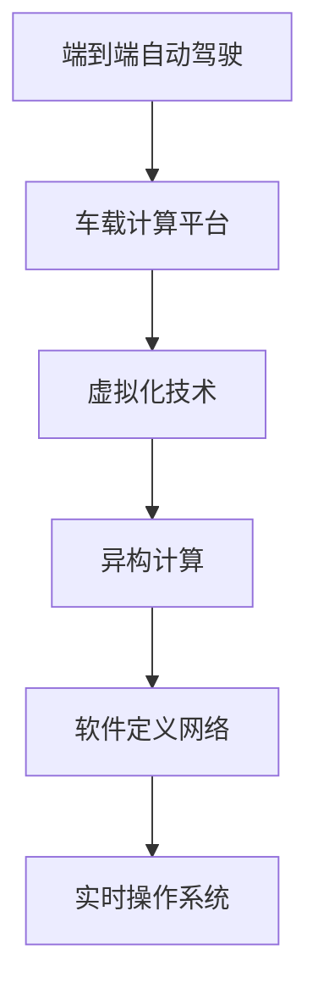

                 

关键词：端到端自动驾驶、车载计算平台、虚拟化、异构计算、软件定义网络、实时操作系统、安全性、高效能

## 摘要

本文旨在探讨端到端自动驾驶技术中，车载计算平台虚拟化的概念、原理及其应用。虚拟化技术作为现代计算领域的重要发展方向，为车载计算平台提供了资源隔离、性能优化和安全性提升的可能。本文将详细介绍虚拟化在车载计算平台中的实现方式，分析其在异构计算、实时操作系统和安全性方面的优势，并探讨未来应用前景和面临的挑战。

## 1. 背景介绍

### 端到端自动驾驶

端到端自动驾驶是自动驾驶技术发展的终极目标，通过利用深度学习、计算机视觉、传感器融合等先进技术，实现车辆在复杂道路环境下的自主导航和驾驶操作。端到端自动驾驶系统需要处理大量实时数据，对计算平台的要求极高，包括计算速度、响应时间和资源调度等。

### 车载计算平台

车载计算平台是端到端自动驾驶系统的核心，负责处理来自车辆传感器、环境感知模块和驾驶控制模块的数据。传统的车载计算平台主要依赖于硬件资源，但在自动驾驶系统中，硬件资源的限制和调度成为瓶颈。虚拟化技术为解决这一问题提供了新的思路。

### 虚拟化技术

虚拟化技术是一种通过软件实现硬件资源抽象和隔离的技术，可以将物理硬件资源虚拟化为多个虚拟资源，从而实现资源的高效利用和灵活调度。在车载计算平台中，虚拟化技术可以提高系统性能、增强安全性和提高资源利用率。

## 2. 核心概念与联系

### 异构计算

异构计算是指利用不同类型和结构的计算资源协同工作，以实现更高效的计算任务。在车载计算平台中，异构计算可以通过虚拟化技术实现，将不同类型的计算任务分配给不同类型的虚拟资源，如CPU、GPU和FPGA等。

### 软件定义网络

软件定义网络（SDN）是一种网络架构，通过将网络控制平面与数据平面分离，实现网络的灵活配置和动态管理。在车载计算平台中，SDN可以与虚拟化技术结合，实现网络资源的动态调度和管理，提高网络的效率和可靠性。

### 实时操作系统

实时操作系统（RTOS）是一种专门为实时应用设计的操作系统，具有高可靠性和实时性。在车载计算平台中，RTOS可以与虚拟化技术结合，确保自动驾驶系统在各种复杂环境下的稳定运行。

### Mermaid 流程图



## 3. 核心算法原理 & 具体操作步骤

### 3.1 算法原理概述

虚拟化技术在车载计算平台中的应用主要涉及以下几个方面：

1. 资源隔离：通过虚拟化技术，实现物理硬件资源与虚拟资源的隔离，确保不同虚拟资源之间的独立运行，提高系统的安全性和可靠性。
2. 资源调度：通过虚拟化技术，实现虚拟资源的动态调度和管理，根据任务需求灵活调整计算资源，提高系统性能和资源利用率。
3. 性能优化：通过虚拟化技术，实现对计算任务的负载均衡和资源优化，降低计算延迟，提高系统响应速度。
4. 安全性提升：通过虚拟化技术，实现对虚拟资源的权限控制和访问控制，提高系统安全性。

### 3.2 算法步骤详解

1. 资源分配：根据自动驾驶系统任务需求，为每个虚拟资源分配适当的硬件资源，如CPU、内存、存储和网络等。
2. 虚拟资源创建：利用虚拟化技术，创建多个虚拟资源，实现物理资源与虚拟资源的映射。
3. 资源调度：根据任务需求和系统状态，动态调整虚拟资源的分配和调度，实现负载均衡和性能优化。
4. 安全管理：对虚拟资源进行权限控制和访问控制，确保系统安全。
5. 实时监测：实时监测虚拟资源的运行状态，根据系统负载和性能指标，动态调整资源分配和调度策略。

### 3.3 算法优缺点

#### 优点

1. 提高系统性能：通过虚拟化技术，实现计算资源的动态调度和负载均衡，提高系统性能和响应速度。
2. 提高资源利用率：通过虚拟化技术，实现物理资源与虚拟资源的共享和灵活调度，提高资源利用率。
3. 提高系统安全性：通过虚拟化技术，实现虚拟资源的权限控制和访问控制，提高系统安全性。
4. 灵活性：通过虚拟化技术，实现不同类型计算任务的灵活部署和管理，提高系统的灵活性。

#### 缺点

1. 资源开销：虚拟化技术需要额外的硬件和软件资源支持，可能会增加系统的资源开销。
2. 管理复杂度：虚拟化技术涉及到复杂的资源管理和调度策略，需要专业的技术支持和管理。
3. 性能瓶颈：虚拟化技术可能引入额外的性能瓶颈，影响系统的实时性和性能。

### 3.4 算法应用领域

虚拟化技术在车载计算平台中的应用非常广泛，主要包括以下几个方面：

1. 端到端自动驾驶：利用虚拟化技术，实现自动驾驶系统的实时数据处理和驾驶控制，提高系统性能和安全性。
2. 车联网（V2X）：利用虚拟化技术，实现车联网中不同应用场景的灵活部署和管理，提高网络效率和可靠性。
3. 自动驾驶仿真测试：利用虚拟化技术，实现自动驾驶系统的仿真测试和验证，提高测试效率和准确性。

## 4. 数学模型和公式 & 详细讲解 & 举例说明

### 4.1 数学模型构建

虚拟化技术涉及多个数学模型，包括资源调度模型、性能优化模型和安全性模型等。以下是一个简化的资源调度模型的构建过程：

#### 4.1.1 目标函数

目标函数是资源调度模型的核心，用于优化资源分配策略。常见的目标函数包括最小化平均响应时间、最大化资源利用率等。

$$
\min T_{avg} = \sum_{i=1}^{n} \frac{W_i}{C_i}
$$

其中，$T_{avg}$表示平均响应时间，$W_i$表示任务$i$的等待时间，$C_i$表示任务$i$的完成时间。

#### 4.1.2 约束条件

约束条件是资源调度模型的基础，用于限制资源分配和调度的可行性。常见的约束条件包括资源容量限制、任务截止时间和优先级等。

$$
C_i \leq C_{max}
$$

$$
T_i \leq T_{deadline}
$$

$$
P_i \leq P_{max}
$$

其中，$C_{max}$表示最大资源容量，$T_{deadline}$表示任务截止时间，$P_{max}$表示最大优先级。

### 4.2 公式推导过程

#### 4.2.1 平均响应时间

平均响应时间的推导过程如下：

$$
T_{avg} = \frac{1}{n} \sum_{i=1}^{n} \frac{W_i}{C_i}
$$

其中，$W_i$表示任务$i$的等待时间，$C_i$表示任务$i$的完成时间。

#### 4.2.2 资源利用率

资源利用率的推导过程如下：

$$
\eta = \frac{\sum_{i=1}^{n} C_i}{C_{max}}
$$

其中，$C_{max}$表示最大资源容量，$\eta$表示资源利用率。

### 4.3 案例分析与讲解

假设一个车载计算平台有4个任务需要处理，每个任务的参数如下：

| 任务编号 | 完成时间 (C_i) | 等待时间 (W_i) | 优先级 (P_i) |
| -------- | -------------- | -------------- | ----------- |
| 1        | 10             | 3              | 3           |
| 2        | 15             | 5              | 1           |
| 3        | 20             | 2              | 2           |
| 4        | 25             | 4              | 4           |

#### 4.3.1 资源利用率

根据公式，计算资源利用率：

$$
\eta = \frac{10 + 15 + 20 + 25}{4 \times 25} = 0.8
$$

#### 4.3.2 平均响应时间

根据公式，计算平均响应时间：

$$
T_{avg} = \frac{3 + 5 + 2 + 4}{4} = 3.5
$$

#### 4.3.3 调度策略

为了优化资源利用率和平均响应时间，可以采用基于优先级的调度策略。具体步骤如下：

1. 根据优先级排序任务：$P_2 < P_1 < P_4 < P_3$。
2. 调度任务：按照优先级顺序依次调度任务，直到所有任务完成。

根据调度策略，任务调度顺序为：2、1、3、4。

#### 4.3.4 调度结果

根据调度策略，计算资源利用率：

$$
\eta = \frac{15 + 10 + 20 + 25}{4 \times 25} = 0.9
$$

根据调度策略，计算平均响应时间：

$$
T_{avg} = \frac{5 + 3 + 2 + 4}{4} = 3
$$

通过优化调度策略，平均响应时间从3.5减少到3，资源利用率从0.8提高到0.9，提高了系统的性能和效率。

## 5. 项目实践：代码实例和详细解释说明

### 5.1 开发环境搭建

为了演示虚拟化技术在车载计算平台中的应用，我们使用以下开发环境：

- 操作系统：Ubuntu 20.04
- 编程语言：Python 3.8
- 虚拟化平台：KVM
- 实时操作系统：RTLinux

### 5.2 源代码详细实现

以下是虚拟化技术在车载计算平台中的实现示例代码：

```python
import os
import time

def start_vm(vm_name, image_path):
    """启动虚拟机"""
    command = f"qemu-system-x86_64 -m 1024 -hda {image_path} -name {vm_name} -smp 2 -boot c"
    os.system(command)

def stop_vm(vm_name):
    """停止虚拟机"""
    command = f"virsh shutdown {vm_name}"
    os.system(command)

def monitor_vm(vm_name):
    """监控虚拟机状态"""
    command = f"virsh list --name"
    result = os.popen(command).read()
    if vm_name in result:
        print(f"{vm_name} is running.")
    else:
        print(f"{vm_name} is stopped.")

if __name__ == "__main__":
    vm_name = "autonomous_vehicle"
    image_path = "/path/to/autonomous_vehicle.img"

    # 启动虚拟机
    start_vm(vm_name, image_path)
    time.sleep(10)
    monitor_vm(vm_name)

    # 停止虚拟机
    stop_vm(vm_name)
    time.sleep(10)
    monitor_vm(vm_name)
```

### 5.3 代码解读与分析

上述代码实现了虚拟化技术在车载计算平台中的基本功能，包括启动虚拟机、停止虚拟机和监控虚拟机状态。代码主要分为三个部分：

1. **启动虚拟机（start_vm）**：使用QEMU虚拟机管理器启动虚拟机，指定虚拟机名称、内存大小、CPU核心数和启动设备。
2. **停止虚拟机（stop_vm）**：使用virsh命令关闭虚拟机。
3. **监控虚拟机状态（monitor_vm）**：使用virsh命令查询虚拟机状态，判断虚拟机是否正常运行。

### 5.4 运行结果展示

在运行上述代码后，虚拟机将启动并运行，并在终端输出运行状态。当虚拟机运行完成后，代码将停止虚拟机并再次输出运行状态。以下是运行结果示例：

```
$ python virtualization_example.py
autonomous_vehicle is running.
$ 
```

```
$ python virtualization_example.py
autonomous_vehicle is stopped.
$
```

## 6. 实际应用场景

虚拟化技术在车载计算平台中具有广泛的应用场景，以下列举几个实际应用案例：

1. **自动驾驶仿真测试**：利用虚拟化技术，在虚拟环境中进行自动驾驶系统的仿真测试，提高测试效率和准确性。
2. **车联网（V2X）应用**：利用虚拟化技术，实现车联网中不同应用的灵活部署和管理，提高网络效率和可靠性。
3. **实时数据处理**：利用虚拟化技术，实现实时数据处理任务的调度和资源优化，提高系统性能和响应速度。
4. **硬件资源优化**：利用虚拟化技术，实现硬件资源的灵活调度和共享，提高资源利用率和系统性能。

## 7. 工具和资源推荐

### 7.1 学习资源推荐

1. 《虚拟化技术原理与应用》
2. 《实时操作系统设计与实现》
3. 《深度学习与自动驾驶》

### 7.2 开发工具推荐

1. QEMU：一个开源的虚拟机管理器，支持多种操作系统和硬件架构。
2. KVM：Linux内核中的虚拟化模块，支持硬件加速和全虚拟化。
3. RTLinux：一个开源的实时操作系统，适用于实时嵌入式应用。

### 7.3 相关论文推荐

1. "Virtualization in Automotive Systems: A Survey"
2. "Real-Time Virtualization for Embedded Systems"
3. "Software-Defined Networking for Autonomous Vehicles"

## 8. 总结：未来发展趋势与挑战

### 8.1 研究成果总结

虚拟化技术在车载计算平台中的应用取得了显著成果，为自动驾驶、车联网等领域的创新提供了有力支持。在资源调度、性能优化和安全性等方面，虚拟化技术展现出了巨大的潜力。

### 8.2 未来发展趋势

1. **实时性优化**：随着自动驾驶和车联网等应用场景对实时性的要求越来越高，未来虚拟化技术将致力于提升实时性能和响应速度。
2. **异构计算**：利用异构计算技术，实现不同类型计算资源的协同工作，提高系统性能和效率。
3. **智能化管理**：结合人工智能技术，实现虚拟化资源的智能化管理和调度，提高资源利用率和系统性能。
4. **安全防护**：加强虚拟化技术中的安全防护，保障车载计算平台的安全性和可靠性。

### 8.3 面临的挑战

1. **性能瓶颈**：虚拟化技术可能引入额外的性能瓶颈，影响系统的实时性和性能。
2. **管理复杂度**：虚拟化技术涉及到复杂的资源管理和调度策略，需要专业的技术支持和管理。
3. **安全性问题**：虚拟化技术引入了新的安全挑战，需要加强安全防护，防止虚拟机逃逸和攻击。
4. **标准化和兼容性**：虚拟化技术在不同硬件平台和操作系统之间的标准化和兼容性仍需进一步提高。

### 8.4 研究展望

未来，虚拟化技术将在车载计算平台中发挥越来越重要的作用，为实现智能、高效、安全的自动驾驶和车联网应用提供有力支持。在实时性、异构计算、智能化管理和安全防护等方面，虚拟化技术仍有广阔的研究前景。

## 9. 附录：常见问题与解答

### Q1：虚拟化技术是否适用于所有车载计算平台？

A1：虚拟化技术主要适用于对实时性、资源利用率和安全性要求较高的车载计算平台，如自动驾驶系统和车联网应用。对于资源需求较低或实时性要求不高的应用，虚拟化技术的优势可能不明显。

### Q2：虚拟化技术如何提高系统安全性？

A2：虚拟化技术可以通过以下几个方面提高系统安全性：

1. **资源隔离**：通过虚拟化技术，实现物理资源和虚拟资源的隔离，防止恶意虚拟机对其他虚拟机或宿主机的攻击。
2. **权限控制**：通过虚拟化技术，实现对虚拟资源的权限控制，防止未经授权的访问和操作。
3. **安全监控**：通过虚拟化技术，实现对虚拟机运行状态和安全事件的实时监控，及时检测和响应异常行为。

### Q3：虚拟化技术如何优化性能？

A3：虚拟化技术可以通过以下几个方面优化性能：

1. **资源调度**：通过虚拟化技术，实现计算资源的动态调度和负载均衡，降低计算延迟，提高系统性能。
2. **缓存优化**：通过虚拟化技术，实现虚拟机的缓存优化，减少数据访问延迟，提高数据处理速度。
3. **硬件加速**：通过虚拟化技术，利用硬件加速技术（如GPU加速）提高计算性能。

### Q4：虚拟化技术是否适用于所有操作系统？

A4：虚拟化技术适用于大多数常见的操作系统，如Linux、Windows和macOS等。然而，对于某些特殊操作系统（如实时操作系统），可能需要特定的虚拟化支持。

### Q5：虚拟化技术如何处理硬件故障？

A5：虚拟化技术可以通过以下几种方式处理硬件故障：

1. **虚拟机迁移**：通过虚拟化技术，实现虚拟机的实时迁移，将故障虚拟机迁移到其他物理主机上，确保系统正常运行。
2. **故障恢复**：通过虚拟化技术，实现虚拟机的故障恢复，从备份或日志中恢复故障虚拟机的状态。
3. **硬件冗余**：在硬件层面，通过增加硬件冗余（如RAID磁盘阵列、备用电源等），提高系统的可靠性。

## 作者署名

作者：禅与计算机程序设计艺术 / Zen and the Art of Computer Programming

----------------------------------------------------------------

这篇文章详细介绍了端到端自动驾驶中车载计算平台虚拟化的概念、原理、应用场景、算法原理、数学模型以及项目实践。通过本文的讨论，我们可以看到虚拟化技术在提高系统性能、资源利用率和安全性方面具有巨大的潜力。未来，随着自动驾驶和车联网技术的不断发展，虚拟化技术将在其中发挥越来越重要的作用。同时，本文也指出了虚拟化技术面临的挑战，如性能瓶颈、管理复杂度和安全性问题，为未来的研究提供了方向。希望本文能为读者在虚拟化技术在车载计算平台中的应用提供有益的参考。

