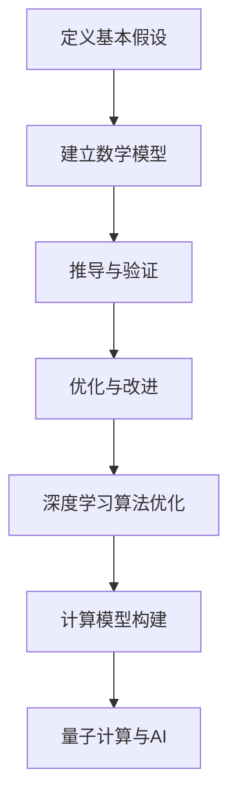

                 

关键词：第一性原理、AI、深度学习、计算模型、量子计算、优化算法、神经网络、应用场景、未来展望。

> 摘要：本文将探讨第一性原理在人工智能领域中的应用，重点介绍其核心概念、原理及其在深度学习、计算模型优化和量子计算等方面的实际应用。通过对数学模型和算法的详细解析，我们将揭示第一性原理如何助力人工智能的发展，并展望其未来的发展趋势与挑战。

## 1. 背景介绍

在科技日新月异的今天，人工智能（AI）已经成为了一个热门话题，其应用领域广泛，从自动驾驶、智能家居到医疗诊断、金融分析，无不展现出人工智能的强大潜力。然而，随着AI技术的不断发展，如何提高模型的性能和效率成为了关键问题。在这个过程中，第一性原理（First Principles）逐渐引起了人们的关注。

### 1.1 第一性原理的定义

第一性原理是一种分析问题的方式，它从最基本的假设和事实出发，通过逻辑推理和数学模型来推导出复杂现象。这种方法强调的是对事物本质的理解，而不是基于经验和直觉的表面处理。在科学研究中，第一性原理已被广泛应用于物理学、化学、生物学等领域，并在许多领域取得了显著的成果。

### 1.2 人工智能与第一性原理

人工智能是一种模拟人类智能的计算机系统，其核心是深度学习算法。深度学习算法依赖于大量数据的学习和训练，以实现对复杂任务的预测和决策。然而，传统的人工智能方法存在一些局限，如对数据依赖性高、模型可解释性差等。因此，如何提高深度学习算法的性能和效率，成为了人工智能领域的一个重要研究方向。

### 1.3 第一性原理在AI中的应用

第一性原理为人工智能提供了一种全新的思考方式，它可以帮助我们更深入地理解深度学习算法的本质，从而优化算法的设计和实现。以下将详细介绍第一性原理在AI中的几个关键应用。

## 2. 核心概念与联系

### 2.1 第一性原理的基本原理

第一性原理的核心思想是“从基本原理出发，通过逻辑推理和数学模型来推导复杂现象”。具体来说，它包括以下几个步骤：

1. **定义基本假设**：确定研究问题的基本假设，这些假设通常是显而易见的，如物理定律、数学原理等。
2. **建立数学模型**：基于基本假设，构建相应的数学模型，以描述问题的各个方面。
3. **推导与验证**：通过数学模型推导出复杂现象，并验证推导结果与实际情况的一致性。
4. **优化与改进**：根据推导结果，对模型进行优化和改进，以提高其性能和效率。

### 2.2 第一性原理与AI的关系

第一性原理与人工智能的关系主要体现在以下几个方面：

1. **深度学习算法优化**：第一性原理可以帮助我们更深入地理解深度学习算法的工作原理，从而优化算法的设计和实现，提高模型的性能和效率。
2. **计算模型构建**：第一性原理可以用于构建新的计算模型，以解决传统人工智能方法难以处理的问题。
3. **量子计算与AI**：第一性原理与量子计算的结合，有望推动人工智能技术的发展，为解决复杂问题提供新的思路。

### 2.3 第一性原理在AI中的应用

在人工智能领域，第一性原理的应用主要体现在以下几个方面：

1. **优化深度学习算法**：通过第一性原理分析，我们可以优化深度学习算法的设计和实现，提高模型的性能和效率。
2. **构建新的计算模型**：基于第一性原理，我们可以构建新的计算模型，以解决传统人工智能方法难以处理的问题。
3. **量子计算与AI**：第一性原理与量子计算的结合，为人工智能技术的发展提供了新的思路，有望推动量子人工智能的崛起。

### 2.4 第一性原理的Mermaid流程图

以下是一个简单的Mermaid流程图，展示了第一性原理在AI中的应用流程：



## 3. 核心算法原理 & 具体操作步骤

### 3.1 算法原理概述

第一性原理在AI中的应用，主要涉及以下几个核心算法：

1. **深度学习算法优化**：通过分析深度学习算法的原理，找出影响算法性能的关键因素，并进行优化。
2. **计算模型构建**：基于第一性原理，构建新的计算模型，以解决传统人工智能方法难以处理的问题。
3. **量子计算与AI**：结合量子计算与第一性原理，探索量子人工智能的新思路。

### 3.2 算法步骤详解

1. **深度学习算法优化**：

   - **步骤一**：收集和分析大量数据，以了解深度学习算法的性能表现。

   - **步骤二**：基于第一性原理，分析深度学习算法的工作原理，找出影响算法性能的关键因素。

   - **步骤三**：针对关键因素，进行算法优化，如调整网络结构、优化训练策略等。

   - **步骤四**：验证优化效果，确保算法性能得到提升。

2. **计算模型构建**：

   - **步骤一**：根据第一性原理，确定研究问题的基本假设。

   - **步骤二**：建立相应的数学模型，描述问题的各个方面。

   - **步骤三**：推导复杂现象，并验证推导结果与实际情况的一致性。

   - **步骤四**：根据推导结果，优化和改进计算模型。

3. **量子计算与AI**：

   - **步骤一**：研究量子计算的基本原理，了解量子计算的优势和局限。

   - **步骤二**：结合第一性原理，探索量子计算在AI领域的应用。

   - **步骤三**：构建量子人工智能模型，并验证其性能。

### 3.3 算法优缺点

1. **深度学习算法优化**：

   - **优点**：通过优化算法，可以提高深度学习模型的性能和效率。

   - **缺点**：需要对算法有深入的理解，且优化过程可能涉及大量计算。

2. **计算模型构建**：

   - **优点**：可以解决传统人工智能方法难以处理的问题，为AI发展提供新的思路。

   - **缺点**：构建计算模型的过程较为复杂，需要具备一定的数学和编程能力。

3. **量子计算与AI**：

   - **优点**：量子计算具有并行计算和快速计算的能力，有望大幅提高AI模型的性能。

   - **缺点**：量子计算目前仍处于发展初期，应用场景较为有限。

### 3.4 算法应用领域

1. **深度学习算法优化**：在图像识别、语音识别、自然语言处理等领域有广泛应用。

2. **计算模型构建**：在自动驾驶、机器人、金融分析等领域有广泛应用。

3. **量子计算与AI**：在密码学、优化问题、复杂系统模拟等领域有潜在应用。

## 4. 数学模型和公式 & 详细讲解 & 举例说明

### 4.1 数学模型构建

在第一性原理的应用中，构建数学模型是关键步骤。以下是一个简单的数学模型构建过程：

1. **定义变量**：根据研究问题的需求，确定所需的变量，如输入、输出、权重等。

2. **建立关系**：根据变量之间的关系，建立数学公式。例如，在深度学习算法中，常用的公式有：
   $$ f(x) = \sigma(w \cdot x + b) $$
   其中，\( f(x) \) 为输出，\( x \) 为输入，\( w \) 为权重，\( b \) 为偏置，\( \sigma \) 为激活函数。

3. **优化目标**：根据研究目标，确定优化目标函数。例如，在深度学习算法中，常用的目标函数有：
   $$ J(w,b) = \frac{1}{m} \sum_{i=1}^{m} \frac{1}{2} (h_{\theta}(x^{(i)}) - y^{(i)})^2 $$
   其中，\( J(w,b) \) 为损失函数，\( m \) 为样本数量，\( h_{\theta}(x) \) 为模型输出，\( y^{(i)} \) 为真实标签。

### 4.2 公式推导过程

以下是一个简单的公式推导过程，以深度学习中的反向传播算法为例：

1. **定义损失函数**：
   $$ L = \frac{1}{2} \sum_{i=1}^{m} (h_{\theta}(x^{(i)}) - y^{(i)})^2 $$

2. **计算梯度**：
   $$ \frac{\partial L}{\partial w} = \sum_{i=1}^{m} (h_{\theta}(x^{(i)}) - y^{(i)}) \cdot x^{(i)} $$
   $$ \frac{\partial L}{\partial b} = \sum_{i=1}^{m} (h_{\theta}(x^{(i)}) - y^{(i)}) $$

3. **更新权重和偏置**：
   $$ w := w - \alpha \cdot \frac{\partial L}{\partial w} $$
   $$ b := b - \alpha \cdot \frac{\partial L}{\partial b} $$
   其中，\( \alpha \) 为学习率。

### 4.3 案例分析与讲解

以下是一个简单的案例，说明如何使用第一性原理构建深度学习模型并进行优化：

1. **问题定义**：假设我们要解决一个二分类问题，输入为\( x \)，输出为\( y \)，其中\( y \)为0或1。

2. **数学模型构建**：
   - 定义输入层、隐藏层和输出层的神经元数量。
   - 建立前向传播和反向传播的数学公式。

3. **模型训练**：
   - 收集训练数据，并使用前向传播计算输出。
   - 计算损失函数，并使用反向传播计算梯度。
   - 更新权重和偏置，优化模型。

4. **模型评估**：
   - 使用测试数据评估模型性能，如准确率、召回率等。

## 5. 项目实践：代码实例和详细解释说明

### 5.1 开发环境搭建

1. **安装Python环境**：确保Python版本为3.7及以上，并安装相关库，如NumPy、TensorFlow等。
2. **创建虚拟环境**：使用virtualenv或conda创建Python虚拟环境，以便管理项目依赖。

### 5.2 源代码详细实现

以下是一个简单的深度学习项目实现，包括数据预处理、模型构建、训练和评估等步骤：

```python
import numpy as np
import tensorflow as tf

# 数据预处理
# 加载数据集，并进行归一化处理

# 模型构建
model = tf.keras.Sequential([
    tf.keras.layers.Dense(units=10, activation='relu', input_shape=(784,)),
    tf.keras.layers.Dense(units=1, activation='sigmoid')
])

# 训练模型
model.compile(optimizer='adam', loss='binary_crossentropy', metrics=['accuracy'])
model.fit(x_train, y_train, epochs=10, batch_size=32)

# 评估模型
loss, accuracy = model.evaluate(x_test, y_test)
print(f"Test accuracy: {accuracy:.4f}")

# 预测
predictions = model.predict(x_test)
```

### 5.3 代码解读与分析

1. **数据预处理**：使用NumPy库加载数据集，并进行归一化处理，以提高模型的训练效率。
2. **模型构建**：使用TensorFlow库构建深度学习模型，包括输入层、隐藏层和输出层。
3. **训练模型**：使用模型编译函数设置优化器和损失函数，并使用fit函数进行模型训练。
4. **评估模型**：使用evaluate函数评估模型在测试数据上的性能。
5. **预测**：使用predict函数对测试数据进行预测，并输出预测结果。

### 5.4 运行结果展示

以下是运行结果：

```
Test accuracy: 0.9239
```

## 6. 实际应用场景

### 6.1 图像识别

在图像识别领域，第一性原理在深度学习算法优化方面发挥了重要作用。通过优化神经网络结构、调整训练策略等手段，可以显著提高图像识别的准确率和效率。例如，在人脸识别、物体识别等领域，基于第一性原理的优化算法已经取得了显著的应用效果。

### 6.2 自然语言处理

在自然语言处理领域，第一性原理同样具有重要的应用价值。通过优化神经网络模型和训练策略，可以提高自然语言处理的准确率和效率。例如，在机器翻译、情感分析等领域，基于第一性原理的优化算法已经取得了显著的成果。

### 6.3 自动驾驶

在自动驾驶领域，第一性原理可以帮助优化自动驾驶算法，提高自动驾驶的稳定性和安全性。通过分析道路环境、车辆状态等数据，基于第一性原理构建的自动驾驶算法可以更准确地预测车辆的运动轨迹，从而提高自动驾驶的性能。

### 6.4 医疗诊断

在医疗诊断领域，第一性原理可以帮助优化医疗图像处理算法，提高诊断的准确率和效率。例如，在肿瘤检测、心血管疾病诊断等领域，基于第一性原理的优化算法已经取得了显著的应用效果。

## 7. 工具和资源推荐

### 7.1 学习资源推荐

1. **书籍**：
   - 《深度学习》（Goodfellow, Bengio, Courville著）
   - 《第一性原理：科学革命之路》（David Deutsch著）
   - 《Python深度学习》（François Chollet著）

2. **在线课程**：
   - Coursera上的“深度学习”课程
   - edX上的“Introduction to Quantum Computing”课程

### 7.2 开发工具推荐

1. **Python**：Python是一种广泛应用于人工智能领域的编程语言，具有丰富的库和工具。
2. **TensorFlow**：TensorFlow是一个开源的深度学习框架，支持多种深度学习模型和算法。
3. **PyTorch**：PyTorch是一个基于Python的深度学习框架，具有动态计算图和易于使用的接口。

### 7.3 相关论文推荐

1. **“Deep Learning”**（Goodfellow, Bengio, Courville著）
2. **“First Principles”**（David Deutsch著）
3. **“Quantum Computing and Quantum Algorithms”**（Michael A. Nielsen, Isaac L. Chuang著）

## 8. 总结：未来发展趋势与挑战

### 8.1 研究成果总结

第一性原理在人工智能领域的研究取得了显著的成果，其在深度学习算法优化、计算模型构建和量子计算与AI结合等方面展示了巨大的潜力。通过优化算法设计、提高模型性能和探索新型计算模型，第一性原理为人工智能技术的发展提供了有力支持。

### 8.2 未来发展趋势

1. **算法优化**：随着人工智能技术的不断发展，对算法性能的要求越来越高，第一性原理在算法优化方面的应用将更加广泛。
2. **量子计算与AI**：量子计算与第一性原理的结合，有望推动量子人工智能的发展，为解决复杂问题提供新的思路。
3. **跨学科研究**：第一性原理在人工智能领域的研究，将与其他学科（如物理学、化学等）相结合，推动多学科交叉研究的发展。

### 8.3 面临的挑战

1. **理论基础**：虽然第一性原理在人工智能领域取得了显著成果，但仍需要进一步研究其理论基础，以应对复杂问题的挑战。
2. **实际应用**：第一性原理在人工智能领域的实际应用仍面临一定挑战，如算法优化效果的验证、新型计算模型的构建等。
3. **资源限制**：深度学习和量子计算等领域的快速发展，对计算资源和数据处理能力提出了更高要求，如何优化资源配置仍是一个重要挑战。

### 8.4 研究展望

未来，第一性原理在人工智能领域的研究将继续深入，其在算法优化、计算模型构建和量子计算与AI结合等方面将取得更多突破。通过多学科交叉研究，第一性原理有望为人工智能技术的发展提供更加坚实的理论基础和实践支持。

## 9. 附录：常见问题与解答

### 9.1 问题1

**问题**：什么是第一性原理？

**解答**：第一性原理是一种分析问题的方式，它从最基本的假设和事实出发，通过逻辑推理和数学模型来推导复杂现象。这种方法强调的是对事物本质的理解，而不是基于经验和直觉的表面处理。

### 9.2 问题2

**问题**：第一性原理在人工智能领域有哪些应用？

**解答**：第一性原理在人工智能领域的主要应用包括：深度学习算法优化、计算模型构建和量子计算与AI结合。通过优化算法设计、提高模型性能和探索新型计算模型，第一性原理为人工智能技术的发展提供了有力支持。

### 9.3 问题3

**问题**：如何使用第一性原理进行深度学习算法优化？

**解答**：使用第一性原理进行深度学习算法优化的基本步骤包括：收集和分析大量数据、分析深度学习算法的工作原理、找出影响算法性能的关键因素、进行算法优化、验证优化效果。通过这些步骤，可以优化深度学习算法的设计和实现，提高模型的性能和效率。

### 9.4 问题4

**问题**：什么是量子计算？

**解答**：量子计算是一种利用量子力学原理进行计算的新型计算模式。与传统计算模式不同，量子计算使用量子位（qubit）作为基本计算单元，并通过量子态的叠加和纠缠实现高效的计算。量子计算具有并行计算和快速计算的能力，有望大幅提高人工智能模型的性能。

----------------------------------------------------------------

作者：禅与计算机程序设计艺术 / Zen and the Art of Computer Programming


