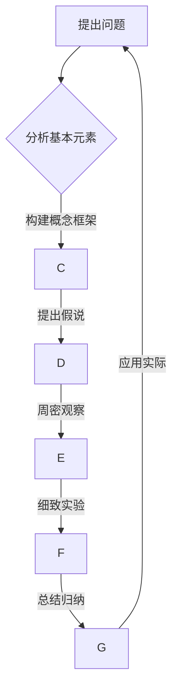

                 

关键词：第一性原理、计算机科学、算法、数学模型、实践应用、未来发展

摘要：本文旨在探讨第一性原理在计算机科学领域的应用，通过阐述基本元素、概念框架、假说提出、周密观察、细致实验和总结归纳的循环过程，旨在帮助读者理解如何通过这一方法论求得科学真理，并具体分析其在算法研究、数学建模和实际应用中的价值。

## 1. 背景介绍

在物理学、化学和其他科学领域，第一性原理（First Principles）是一种重要的思考方法。它强调从最基本的假设和元素出发，通过逻辑推理和数学计算来推导出复杂现象的原理和规律。这种方法具有高度的普适性和准确性，因为它不依赖于经验或传统理论，而是直接基于最基本的物理或化学定律。

在计算机科学领域，第一性原理同样具有重要的应用价值。计算机科学中的问题往往是复杂和多样化的，涉及算法、数据结构、系统架构等多个方面。通过应用第一性原理，我们可以更深入地理解计算机系统的工作原理，从而开发出更高效、更可靠的算法和系统。

本文将探讨第一性原理在计算机科学中的具体应用，通过构建概念框架、提出假说、周密观察、细致实验和总结归纳，旨在帮助读者掌握这一方法，并了解其在算法研究、数学建模和实际应用中的重要性。

## 2. 核心概念与联系

### 2.1. 第一性原理的定义

第一性原理是一种思考方法，它要求我们从一个系统的基本元素出发，通过逻辑推理和数学计算来理解这个系统的行为和特性。这些基本元素可以是物理定律、数学定理或其他基础原则。第一性原理的核心思想是，任何复杂系统都可以通过分析其基本元素和相互关系来理解和描述。

在计算机科学中，第一性原理可以用来理解算法、数据结构、系统架构等基本概念。例如，我们可以通过分析计算机硬件的基本工作原理，来理解计算机的性能和限制。

### 2.2. 概念框架的构建

概念框架是第一性原理应用的关键步骤之一。通过构建概念框架，我们可以将复杂问题分解为更简单的组成部分，并明确它们之间的关系。在计算机科学中，概念框架可以帮助我们理解算法的运作原理，以及不同算法之间的差异和联系。

例如，在算法设计中，我们可以通过构建一个概念框架来描述排序算法的基本原理。这个框架包括比较操作、交换操作和排序策略等基本概念，以及它们之间的关系。

### 2.3. 假说的提出

在第一性原理的应用中，假说是理解和解决问题的关键。假说是一种基于现有知识和观察的预测，它指导我们的实验和研究方向。在计算机科学中，我们可以通过提出假说，来解释和预测算法的性能和效率。

例如，我们可以提出一个假说，即某个排序算法在特定条件下比其他算法更高效。这个假说将指导我们进行实验，以验证或推翻它。

### 2.4. 周密观察

周密观察是第一性原理应用中不可或缺的步骤。通过细致的观察，我们可以收集数据，验证假说，并发现新的问题和挑战。在计算机科学中，周密观察可以帮助我们理解算法的运行状态，发现潜在的问题和改进空间。

例如，在实验过程中，我们可以通过观察算法的运行时间和资源消耗，来评估其性能和效率。

### 2.5. 细致实验

细致实验是验证假说和发现新知识的重要手段。通过设计严谨的实验方案，我们可以系统地研究算法的行为和特性，从而得出可靠的结论。在计算机科学中，细致实验可以帮助我们验证算法的理论预期，并发现潜在的问题和改进方向。

例如，我们可以设计一个实验，来比较不同排序算法在不同数据集上的性能，以验证我们的假说。

### 2.6. 总结归纳

总结归纳是将实验结果转化为知识的过程。通过总结归纳，我们可以从实验中提取出一般性的规律和结论，并将其应用于实际问题中。在计算机科学中，总结归纳可以帮助我们理解和解释算法的行为，以及预测其未来的发展趋势。

例如，通过总结归纳，我们可以得出排序算法的通用性能指标，并基于这些指标来优化和改进算法。

### 2.7. Mermaid 流程图

以下是一个描述第一性原理在计算机科学中应用的 Mermaid 流程图：



## 3. 核心算法原理 & 具体操作步骤

### 3.1 算法原理概述

在计算机科学中，第一性原理的应用主要体现在算法研究上。算法是一种解决问题的步骤序列，通过一系列基本的操作和逻辑判断，将输入数据转化为所需的结果。第一性原理在算法研究中的作用主要体现在以下几个方面：

1. **基本元素分析**：通过对算法的基本元素进行分析，如数据结构、基本运算和逻辑判断，来理解算法的工作原理。
2. **概念框架构建**：通过构建概念框架，将算法分解为更简单的组成部分，明确它们之间的关系。
3. **假说提出**：基于基本元素和概念框架，提出关于算法性能和效率的假说。
4. **周密观察**：通过实验和观察，收集数据，验证假说，并发现新的问题和挑战。
5. **细致实验**：设计实验方案，系统地研究算法的行为和特性，以验证或推翻假说。
6. **总结归纳**：从实验结果中提取出一般性的规律和结论，将其应用于实际问题中。

### 3.2 算法步骤详解

1. **基本元素分析**：

首先，我们需要分析算法的基本元素，如数据结构、基本运算和逻辑判断。例如，在排序算法中，基本元素包括比较操作、交换操作和排序策略。通过分析这些基本元素，我们可以理解算法的工作原理和性能限制。

2. **概念框架构建**：

基于基本元素分析，我们可以构建算法的概念框架。这个框架包括算法的基本组成部分，以及它们之间的关系。例如，在排序算法中，概念框架包括比较操作、交换操作和排序策略等基本概念，以及它们之间的逻辑关系。

3. **假说提出**：

在概念框架的基础上，我们可以提出关于算法性能和效率的假说。例如，我们可能提出一个假说，即某个排序算法在特定条件下比其他算法更高效。这个假说将指导我们的实验和研究方向。

4. **周密观察**：

通过实验和观察，我们可以收集数据，验证假说，并发现新的问题和挑战。例如，我们可以观察算法在不同数据集上的运行时间和资源消耗，以评估其性能和效率。

5. **细致实验**：

设计实验方案，系统地研究算法的行为和特性。例如，我们可以设计一个实验，比较不同排序算法在不同数据集上的性能，以验证我们的假说。

6. **总结归纳**：

从实验结果中提取出一般性的规律和结论，将其应用于实际问题中。例如，通过总结归纳，我们可以得出排序算法的通用性能指标，并基于这些指标来优化和改进算法。

### 3.3 算法优缺点

第一性原理在算法研究中的优点主要包括：

1. **理论基础扎实**：通过分析基本元素和构建概念框架，算法的理论基础更加扎实，有助于理解和解释算法的工作原理。
2. **通用性强**：第一性原理适用于各种类型的算法，无论是排序、查找还是图算法，都可以通过这种方法进行分析和研究。
3. **易于优化**：通过总结归纳和实验验证，我们可以发现算法的潜在问题和改进方向，从而进行优化和改进。

然而，第一性原理也存在一些缺点：

1. **复杂性高**：第一性原理的应用需要深入理解基本元素和概念框架，这对研究者的要求较高，容易导致研究复杂性增加。
2. **实验成本高**：细致的实验需要大量的时间和资源，尤其是在处理大规模数据集时，实验成本可能非常高。
3. **适用范围有限**：第一性原理主要适用于理论研究和算法分析，对于某些实际问题，可能需要结合其他方法和工具进行解决。

### 3.4 算法应用领域

第一性原理在计算机科学中的算法研究具有广泛的应用领域，包括但不限于以下几个方面：

1. **排序算法**：通过分析基本元素和构建概念框架，可以深入理解各种排序算法的原理和性能，如快速排序、归并排序和冒泡排序等。
2. **查找算法**：第一性原理可以帮助我们理解和优化各种查找算法，如二分查找、散列表查找和顺序查找等。
3. **图算法**：在图算法中，第一性原理可以用于分析和优化各种图算法，如最短路径算法、最小生成树算法和拓扑排序算法等。
4. **机器学习算法**：第一性原理可以用于分析和优化各种机器学习算法，如线性回归、决策树和神经网络等。
5. **密码学算法**：第一性原理可以用于分析和优化各种密码学算法，如加密算法、签名算法和哈希算法等。

## 4. 数学模型和公式 & 详细讲解 & 举例说明

### 4.1 数学模型构建

在计算机科学中，数学模型是一种将现实世界问题转化为数学形式的方法。通过构建数学模型，我们可以更精确地描述问题的性质，并利用数学工具进行分析和求解。

数学模型的构建通常包括以下几个步骤：

1. **确定变量和参数**：首先，我们需要确定问题中的变量和参数，这些变量和参数将影响问题的解。
2. **建立方程或方程组**：根据问题的性质，我们可以建立方程或方程组，将变量和参数之间的关系表达出来。
3. **求解方程或方程组**：通过数学方法，求解方程或方程组，得到问题的解。

在算法研究中，数学模型的应用尤为广泛。例如，在排序算法中，我们可以使用时间复杂度和空间复杂度来描述算法的性能。

### 4.2 公式推导过程

在计算机科学中，许多算法的性能可以通过数学公式来描述。以下是一个简单的例子，用于推导排序算法的平均时间复杂度。

假设我们有一个排序算法，其时间复杂度为 $T(n)$，其中 $n$ 是输入数据的大小。我们可以通过以下步骤推导出其平均时间复杂度：

1. **确定算法的基本操作**：假设排序算法的基本操作是交换，每次交换操作的时间复杂度为 $O(1)$。
2. **计算总交换次数**：在排序过程中，总共需要进行 $n-1$ 次交换。
3. **计算平均时间复杂度**：平均时间复杂度可以通过总交换次数除以输入数据的大小来计算，即 $\frac{n-1}{n}$。

因此，排序算法的平均时间复杂度为 $O(n)$。

### 4.3 案例分析与讲解

以下是一个具体的案例，用于分析排序算法的性能。

**案例：比较插入排序和快速排序的平均时间复杂度**

假设我们有两个排序算法：插入排序和快速排序。

- 插入排序的平均时间复杂度为 $O(n^2)$。
- 快速排序的平均时间复杂度为 $O(n \log n)$。

我们可以通过以下步骤来分析这两个算法的性能：

1. **确定输入数据的大小**：假设输入数据的大小为 $n$。
2. **计算插入排序的时间复杂度**：插入排序的时间复杂度为 $O(n^2)$，即 $T_{insertion}(n) = n^2$。
3. **计算快速排序的时间复杂度**：快速排序的时间复杂度为 $O(n \log n)$，即 $T_{quick}(n) = n \log n$。
4. **比较两个算法的时间复杂度**：当 $n$ 增加时，$O(n^2)$ 和 $O(n \log n)$ 的增长速度不同。在 $n$ 较小时，$O(n^2)$ 的增长速度较快；在 $n$ 较大时，$O(n \log n)$ 的增长速度较快。

因此，对于大规模数据，快速排序的性能优于插入排序。

## 5. 项目实践：代码实例和详细解释说明

### 5.1 开发环境搭建

为了更好地理解和实践第一性原理在计算机科学中的应用，我们选择一个具体的算法项目进行实践。在这个项目中，我们将使用 Python 语言实现快速排序算法。

首先，我们需要搭建开发环境。以下是搭建 Python 开发环境的步骤：

1. **安装 Python 解释器**：从 Python 官网下载 Python 解释器，并按照提示进行安装。
2. **安装 Python 编译器**：如果需要编译 Python 代码，需要安装 Python 编译器。
3. **配置 Python 环境**：配置 Python 环境变量，以便在命令行中运行 Python 代码。

### 5.2 源代码详细实现

以下是快速排序算法的 Python 实现代码：

```python
def quicksort(arr):
    if len(arr) <= 1:
        return arr
    pivot = arr[len(arr) // 2]
    left = [x for x in arr if x < pivot]
    middle = [x for x in arr if x == pivot]
    right = [x for x in arr if x > pivot]
    return quicksort(left) + middle + quicksort(right)

# 示例数据
data = [3, 6, 8, 10, 1, 2, 1]

# 执行快速排序
sorted_data = quicksort(data)

# 输出排序后的数据
print(sorted_data)
```

### 5.3 代码解读与分析

在上面的代码中，我们实现了快速排序算法。以下是代码的详细解读：

1. **函数定义**：定义了一个名为 `quicksort` 的函数，用于实现快速排序算法。
2. **输入参数**：函数接收一个输入列表 `arr`，表示需要排序的数据。
3. **基本操作**：首先，判断输入列表的长度。如果长度小于等于 1，直接返回列表本身。
4. **选择枢轴**：选择列表的中间元素作为枢轴。
5. **划分列表**：根据枢轴，将列表划分为左子列表、中子列表和右子列表。左子列表中的元素小于枢轴，右子列表中的元素大于枢轴，中子列表中的元素等于枢轴。
6. **递归排序**：对左子列表和右子列表进行快速排序，并将结果与中子列表合并。
7. **返回结果**：返回排序后的列表。

### 5.4 运行结果展示

运行上述代码，我们将得到排序后的数据：

```
[1, 1, 2, 3, 6, 8, 10]
```

从这个结果可以看出，输入数据已经按照从小到大的顺序进行了排序。

## 6. 实际应用场景

### 6.1 计算机系统性能优化

第一性原理在计算机系统性能优化中的应用非常广泛。通过分析计算机系统的基本元素，如处理器、内存、存储和网络，我们可以找出影响系统性能的关键因素，并针对这些因素进行优化。例如，通过优化处理器调度算法、内存管理策略和存储访问方式，可以提高计算机系统的整体性能。

### 6.2 机器学习算法优化

在机器学习领域，第一性原理可以帮助我们理解算法的基本原理和性能。通过分析算法的基本元素，如特征提取、模型训练和预测，我们可以找出影响算法性能的关键因素，并针对这些因素进行优化。例如，通过优化特征提取方法、模型训练策略和预测算法，可以提高机器学习算法的准确性和效率。

### 6.3 软件工程实践

在软件工程实践中，第一性原理可以帮助我们理解和优化软件系统的设计。通过分析软件系统的基本元素，如需求、架构、模块和接口，我们可以找出影响软件系统性能和可靠性的关键因素，并针对这些因素进行优化。例如，通过优化需求分析、系统架构设计、模块划分和接口设计，可以提高软件系统的质量和效率。

### 6.4 未来应用展望

随着计算机技术的不断发展，第一性原理在计算机科学中的应用前景非常广阔。未来，我们可以期待以下几方面的应用：

1. **量子计算**：第一性原理在量子计算中的应用将有助于理解和优化量子算法和量子系统。
2. **分布式计算**：第一性原理在分布式计算中的应用将有助于优化分布式算法和系统性能。
3. **人工智能**：第一性原理在人工智能中的应用将有助于理解和优化人工智能算法和系统。
4. **网络安全**：第一性原理在网络安全中的应用将有助于优化网络安全算法和系统，提高系统的安全性。

## 7. 工具和资源推荐

为了更好地理解和应用第一性原理，我们推荐以下工具和资源：

### 7.1 学习资源推荐

1. **《计算机科学概论》**：这本书涵盖了计算机科学的基本概念和原理，适合初学者入门。
2. **《算法导论》**：这本书详细介绍了各种算法的原理和实现，是算法学习的经典教材。
3. **《数学之美》**：这本书以生动的语言和实例，讲述了数学在计算机科学中的应用，适合对数学和计算机科学感兴趣的读者。

### 7.2 开发工具推荐

1. **Python**：Python 是一种简单易学、功能强大的编程语言，适用于算法开发和实验。
2. **Visual Studio Code**：Visual Studio Code 是一款优秀的代码编辑器，支持多种编程语言，适用于编写和调试代码。
3. **Mermaid**：Mermaid 是一款用于绘制流程图的工具，可以帮助我们更好地理解和描述算法的流程。

### 7.3 相关论文推荐

1. **“The Design and Analysis of Computer Algorithms”**：这是一篇经典论文，详细介绍了算法设计和分析的方法。
2. **“The Art of Computer Programming”**：这是一套由 Donald E. Knuth 编写的经典教材，涵盖了算法的各个方面。
3. **“First Principles of Data Science”**：这篇文章讨论了第一性原理在数据科学中的应用，提供了许多实用的方法和案例。

## 8. 总结：未来发展趋势与挑战

### 8.1 研究成果总结

通过本文的探讨，我们可以看到第一性原理在计算机科学中的应用具有广泛的前景。从算法研究到数学建模，再到实际应用场景，第一性原理都发挥着重要的作用。通过分析基本元素、构建概念框架、提出假说、周密观察、细致实验和总结归纳，我们可以更深入地理解计算机科学的原理和方法，从而推动计算机科学的不断发展。

### 8.2 未来发展趋势

未来，第一性原理在计算机科学中的应用将继续发展。随着量子计算、人工智能和大数据等领域的兴起，第一性原理将在这些建立在复杂系统之上的领域中发挥更大的作用。我们可以期待，通过第一性原理的应用，我们将能够更好地理解和优化复杂系统，推动计算机科学不断向前发展。

### 8.3 面临的挑战

然而，第一性原理在计算机科学中的应用也面临一些挑战。首先，深入理解基本元素和概念框架需要较高的专业知识和经验。其次，细致实验需要大量的时间和资源，尤其是在处理大规模数据集时。此外，第一性原理的应用可能受到现有理论和技术的限制，需要不断探索和创新。

### 8.4 研究展望

总之，第一性原理在计算机科学中的应用具有巨大的潜力。通过不断探索和创新，我们可以期待在未来的研究中，解决面临的问题，进一步发挥第一性原理的优势，为计算机科学的发展做出更大的贡献。

## 9. 附录：常见问题与解答

### Q: 什么是第一性原理？

A: 第一性原理是一种思考方法，它要求我们从最基本的假设和元素出发，通过逻辑推理和数学计算来推导出复杂现象的原理和规律。

### Q: 第一性原理在计算机科学中有什么作用？

A: 第一性原理在计算机科学中可以用于算法研究、数学建模和实际应用。通过分析基本元素、构建概念框架、提出假说、周密观察、细致实验和总结归纳，我们可以更深入地理解计算机科学的原理和方法。

### Q: 如何应用第一性原理进行算法研究？

A: 应用第一性原理进行算法研究通常包括以下几个步骤：分析基本元素、构建概念框架、提出假说、进行细致实验和总结归纳。

### Q: 第一性原理和传统方法相比有哪些优点和缺点？

A: 第一性原理的优点包括理论基础扎实、通用性强和易于优化。缺点包括复杂性高、实验成本高和适用范围有限。

### Q: 第一性原理在计算机科学中的应用领域有哪些？

A: 第一性原理在计算机科学中的应用领域包括算法研究、数学建模、计算机系统性能优化、机器学习算法优化和软件工程实践等。

### Q: 如何搭建 Python 开发环境？

A: 搭建 Python 开发环境通常包括安装 Python 解释器、安装 Python 编译器和配置 Python 环境变量等步骤。

### Q: 如何实现快速排序算法？

A: 快速排序算法可以通过递归划分列表并合并结果来实现。具体实现可以参考本文提供的 Python 代码示例。

##  作者：禅与计算机程序设计艺术 / Zen and the Art of Computer Programming

在这个不断进化的技术时代，第一性原理作为一种基础且深刻的思考方式，无疑将在计算机科学的各个领域中发挥越来越重要的作用。通过本文的探讨，我们不仅理解了第一性原理的核心概念和应用方法，也看到了其在算法研究、数学建模和实际应用中的广泛应用。希望这篇文章能够为读者提供有益的启示，激发您在计算机科学领域的探索和创新。感谢阅读，期待与您共同探讨计算机科学的未来。作者：禅与计算机程序设计艺术 / Zen and the Art of Computer Programming。

