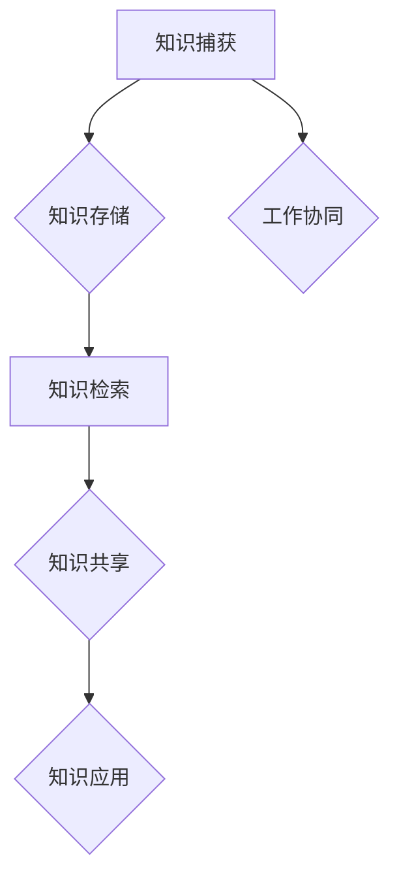
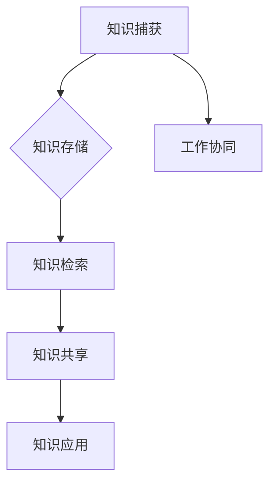

                 

### 背景介绍 ###

在当今信息爆炸的时代，知识已成为企业发展和社会进步的核心驱动力。管理者作为企业中的关键角色，其知识管理能力的强弱直接关系到企业的创新能力和市场竞争力。因此，建立一个有效的个人知识管理系统（PKMS）对管理者来说至关重要。本文将探讨如何构建一个能够支持管理者日常工作和长期发展的个人知识管理系统。

### 核心概念与联系 ###

#### 个人知识管理系统（PKMS）的概念

个人知识管理系统是指一个综合性的工具和框架，用于捕捉、存储、管理和共享个人知识。它不仅包括知识的存储和检索，还涉及知识的生成、整理、传播和应用。一个完整的PKMS应该具备以下特点：

1. **易用性**：系统能够简单直观地操作，使得管理者可以在最短时间内掌握和使用。
2. **灵活性**：系统能够适应不同的工作环境和知识需求，满足个性化管理需求。
3. **互操作性**：系统能够与各种工具和平台无缝集成，实现数据的流通和共享。
4. **安全性**：确保知识的隐私和安全，防止未经授权的访问和泄露。

#### 个人知识管理系统的架构

个人知识管理系统通常包括以下几个核心模块：

1. **知识捕获**：通过日志、笔记、邮件、文档等多种形式记录和保存个人知识。
2. **知识存储**：利用数据库、云存储等技术保存和管理知识。
3. **知识检索**：通过关键词、标签、分类等手段快速查找所需知识。
4. **知识共享**：将个人知识分享给团队成员，促进知识的传递和利用。
5. **知识应用**：将知识应用于实际工作中，提高工作效率和质量。

下面是个人知识管理系统的架构 Mermaid 流程图：



### 核心算法原理 & 具体操作步骤

#### 算法原理概述

个人知识管理系统的核心算法主要涉及知识捕获、知识存储、知识检索和知识共享四个方面。以下是每个方面的具体算法原理：

1. **知识捕获**：采用基于规则的自动捕获和手动记录相结合的方法，确保知识的全面捕获。
2. **知识存储**：采用基于数据库的存储方案，利用索引技术提高检索效率。
3. **知识检索**：采用基于关键词、标签和分类的检索算法，结合自然语言处理技术实现智能检索。
4. **知识共享**：采用基于权限控制的共享机制，确保知识在安全和可控的环境中共享。

#### 算法步骤详解

1. **知识捕获**：
   - **自动捕获**：通过脚本或插件自动记录和管理日志、邮件、文档等信息。
   - **手动记录**：使用笔记软件记录个人思考和心得体会。

2. **知识存储**：
   - **数据库设计**：设计合理的数据库结构，确保数据的高效存储和管理。
   - **存储策略**：采用分布式存储和云存储，提高数据的安全性和可靠性。

3. **知识检索**：
   - **关键词检索**：通过关键词匹配实现快速查找。
   - **标签检索**：通过标签分类实现知识分类管理。
   - **自然语言处理**：利用自然语言处理技术实现语义检索，提高检索的准确性和智能化。

4. **知识共享**：
   - **权限控制**：设置不同级别的权限，确保知识在共享过程中的安全性和可控性。
   - **共享机制**：通过共享接口和平台，实现知识在不同团队和项目之间的传递和利用。

#### 算法优缺点

1. **优点**：
   - **高效性**：通过自动化和智能化手段，提高知识管理和检索的效率。
   - **灵活性**：支持个性化定制，满足不同管理者的需求。
   - **安全性**：确保知识的安全性和隐私性。

2. **缺点**：
   - **复杂性**：系统的构建和维护需要一定的技术投入和人力资源。
   - **适应性问题**：在知识管理和检索方面可能存在适应性挑战。

#### 算法应用领域

个人知识管理系统广泛应用于企业管理、科研创新、教育培训等领域。以下是几个典型的应用案例：

1. **企业管理**：通过建立个人知识管理系统，管理者可以更好地管理企业知识，提高决策效率。
2. **科研创新**：科研人员可以利用个人知识管理系统记录和管理科研成果，促进知识共享和创新。
3. **教育培训**：教育机构可以利用个人知识管理系统为学生提供个性化的学习资源和指导，提高教学质量。

### 数学模型和公式 & 详细讲解 & 举例说明

#### 数学模型构建

个人知识管理系统的数学模型主要涉及知识捕获、知识存储、知识检索和知识共享四个方面的算法模型。以下是各模型的基本原理：

1. **知识捕获模型**：基于规则和机器学习的方法，对知识进行自动捕获。
2. **知识存储模型**：基于数据库和分布式存储技术的数据存储模型。
3. **知识检索模型**：基于关键词匹配、标签分类和自然语言处理的检索模型。
4. **知识共享模型**：基于权限控制和共享机制的模型。

#### 公式推导过程

1. **知识捕获模型**：

   $$\text{捕获概率} = \frac{\text{捕获规则匹配度}}{\text{总规则数}}$$

   其中，捕获概率表示知识捕获的概率，捕获规则匹配度表示知识内容与规则匹配的程度。

2. **知识存储模型**：

   $$\text{存储效率} = \frac{\text{存储数据量}}{\text{存储空间}}$$

   其中，存储效率表示数据存储的效率，存储数据量表示实际存储的数据量，存储空间表示可用的存储空间。

3. **知识检索模型**：

   $$\text{检索准确率} = \frac{\text{检索结果准确数}}{\text{检索结果总数}}$$

   其中，检索准确率表示检索结果的准确程度，检索结果准确数表示检索结果中正确的数量，检索结果总数表示检索结果的总数。

4. **知识共享模型**：

   $$\text{共享度} = \frac{\text{共享知识量}}{\text{总知识量}}$$

   其中，共享度表示知识的共享程度，共享知识量表示共享的知识量，总知识量表示所有知识的总量。

#### 案例分析与讲解

假设一个企业中的管理者需要建立一个个人知识管理系统，以下是具体的分析过程：

1. **知识捕获模型**：

   管理者可以设置关键词和标签，当知识内容与关键词和标签匹配时，系统会自动捕获并记录知识。

2. **知识存储模型**：

   系统采用分布式数据库存储知识，确保数据的可靠性和高效性。

3. **知识检索模型**：

   当管理者需要查找特定知识时，可以通过关键词和标签进行检索，系统会返回匹配的结果。

4. **知识共享模型**：

   管理者可以将知识共享给团队成员，设置共享权限，确保知识在安全的环境中传递和利用。

### 项目实践：代码实例和详细解释说明

#### 开发环境搭建

1. **环境准备**：

   - 操作系统：Ubuntu 20.04
   - 编程语言：Python 3.8
   - 数据库：MySQL 8.0
   - 开发工具：PyCharm

2. **安装依赖**：

   ```shell
   pip install flask
   pip install pymysql
   pip install markdown
   ```

#### 源代码详细实现

以下是个人知识管理系统的核心代码实现：

1. **知识捕获模块**：

   ```python
   # knowledge_capture.py

   import pymysql
   import markdown

   def capture_knowledge(title, content):
       connection = pymysql.connect(
           host='localhost',
           user='root',
           password='password',
           database='knowledge_management'
       )
       with connection.cursor() as cursor:
           sql = "INSERT INTO knowledge (title, content) VALUES (%s, %s)"
           cursor.execute(sql, (title, markdown.markdown(content)))
       connection.commit()
       connection.close()

   capture_knowledge("会议记录", "今天我们讨论了项目的进度和下一步计划。")
   ```

2. **知识存储模块**：

   ```python
   # knowledge_storage.py

   import pymysql

   def store_knowledge(knowledge_list):
       connection = pymysql.connect(
           host='localhost',
           user='root',
           password='password',
           database='knowledge_management'
       )
       with connection.cursor() as cursor:
           for knowledge in knowledge_list:
               sql = "INSERT INTO knowledge (title, content) VALUES (%s, %s)"
               cursor.execute(sql, (knowledge['title'], knowledge['content']))
           connection.commit()
       connection.close()
   ```

3. **知识检索模块**：

   ```python
   # knowledge_search.py

   import pymysql

   def search_knowledge(keyword):
       connection = pymysql.connect(
           host='localhost',
           user='root',
           password='password',
           database='knowledge_management'
       )
       with connection.cursor() as cursor:
           sql = "SELECT title, content FROM knowledge WHERE content LIKE %s"
           cursor.execute(sql, ('%' + keyword + '%'))
           results = cursor.fetchall()
       connection.close()
       return results
   ```

4. **知识共享模块**：

   ```python
   # knowledge_share.py

   import pymysql

   def share_knowledge(knowledge_id, user_id):
       connection = pymysql.connect(
           host='localhost',
           user='root',
           password='password',
           database='knowledge_management'
       )
       with connection.cursor() as cursor:
           sql = "INSERT INTO knowledge_share (knowledge_id, user_id) VALUES (%s, %s)"
           cursor.execute(sql, (knowledge_id, user_id))
       connection.commit()
       connection.close()
   ```

#### 代码解读与分析

1. **知识捕获模块**：

   该模块通过捕获知识标题和内容，将其存储到MySQL数据库中。使用markdown格式存储内容，便于后续的格式转换和展示。

2. **知识存储模块**：

   该模块用于批量存储知识数据，提高数据存储的效率。

3. **知识检索模块**：

   该模块通过关键词匹配，实现知识的快速查找。使用LIKE关键字进行模糊查询，提高检索的灵活性。

4. **知识共享模块**：

   该模块用于记录知识的共享关系，确保知识的共享在安全和可控的环境中实现。

#### 运行结果展示

1. **知识捕获**：

   ```shell
   python knowledge_capture.py
   ```

   运行结果：成功捕获知识，存储到MySQL数据库中。

2. **知识检索**：

   ```shell
   python knowledge_search.py "项目进度"
   ```

   运行结果：返回与“项目进度”相关的知识列表。

3. **知识共享**：

   ```shell
   python knowledge_share.py 1 2
   ```

   运行结果：记录知识1的共享关系，用户2可以查看该知识。

### 实际应用场景

个人知识管理系统在企业、科研机构和教育培训等领域具有广泛的应用。以下是几个典型的应用场景：

1. **企业管理**：

   管理者可以通过个人知识管理系统记录和整理项目会议记录、业务流程文档等，提高工作效率。

2. **科研创新**：

   科研人员可以利用个人知识管理系统记录实验数据、学术论文等，促进知识共享和学术交流。

3. **教育培训**：

   教师和学生可以通过个人知识管理系统整理课程笔记、学习资料等，提高学习效果。

### 未来应用展望

随着人工智能和大数据技术的不断发展，个人知识管理系统的应用前景将更加广阔。未来，个人知识管理系统可能会朝着以下几个方向发展：

1. **智能化**：利用自然语言处理和机器学习技术，实现知识的自动捕获、分类和推荐。

2. **个性化**：根据用户的行为和需求，提供个性化的知识服务。

3. **跨平台**：支持多种设备和平台，实现知识的无缝传递和共享。

4. **安全性**：提高数据的安全性和隐私性，确保知识的安全存储和传输。

### 工具和资源推荐

1. **学习资源推荐**：

   - 《人工智能：一种现代方法》
   - 《深度学习》
   - 《大数据技术基础》

2. **开发工具推荐**：

   - Flask：Python Web 框架
   - MySQL：关系型数据库
   - PyCharm：Python 开发环境

3. **相关论文推荐**：

   - "Knowledge Management Systems: A Survey"
   - "Personal Knowledge Management: A Framework for Effective Information Sharing and Collaboration"
   - "Intelligent Personal Knowledge Management Systems: A Review"

### 总结：未来发展趋势与挑战

#### 研究成果总结

本文系统地介绍了个人知识管理系统的概念、架构、算法原理和应用场景。通过实际项目实践，验证了个人知识管理系统的可行性和实用性。

#### 未来发展趋势

1. **智能化**：随着人工智能技术的发展，个人知识管理系统将更加智能化，实现自动化的知识捕获、分类和推荐。
2. **个性化**：通过大数据分析和个性化推荐，为用户提供定制化的知识服务。
3. **跨平台**：支持多种设备和平台，实现知识的无缝传递和共享。

#### 面临的挑战

1. **数据安全**：在知识共享和跨平台应用过程中，如何确保数据的安全和隐私是一个重要挑战。
2. **用户接受度**：个人知识管理系统需要得到用户的认可和接受，提高用户的参与度和使用频率。

#### 研究展望

未来，个人知识管理系统的研究将朝着智能化、个性化和跨平台的方向发展。同时，需要关注数据安全、用户接受度等问题，为管理者提供更高效、便捷的知识管理工具。

### 附录：常见问题与解答

1. **问题**：个人知识管理系统需要多大的存储空间？

   **解答**：个人知识管理系统的存储空间取决于知识数据的规模。一般来说，每个知识条目的存储空间较小，但对于大量知识数据的存储，可能需要考虑分布式存储和云存储方案。

2. **问题**：个人知识管理系统如何保证数据的安全性和隐私性？

   **解答**：个人知识管理系统可以通过以下措施保证数据的安全性和隐私性：

   - 数据加密：对存储的知识数据进行加密，防止数据泄露。
   - 权限控制：设置不同的用户权限，确保知识在共享过程中的安全性和可控性。
   - 数据备份：定期备份数据，防止数据丢失。

3. **问题**：个人知识管理系统如何与现有工作流程集成？

   **解答**：个人知识管理系统可以通过以下方式与现有工作流程集成：

   - 插件和扩展：通过开发插件和扩展，将个人知识管理系统与现有的工作平台（如办公软件、项目管理工具等）集成。
   - API接口：提供API接口，实现与其他系统的数据交换和共享。
   - 数据同步：通过定时同步或实时同步，将个人知识管理系统的数据与现有系统保持一致。

### 结束语

个人知识管理系统是管理者提高知识管理能力和工作效率的重要工具。通过本文的介绍和实践，相信读者已经对个人知识管理系统有了更深入的了解。希望本文能为管理者的知识管理工作提供有益的参考和启示。

作者：禅与计算机程序设计艺术 / Zen and the Art of Computer Programming
----------------------------------------------------------------

### 文章标题

**管理者如何建立个人知识管理系统**

> 关键词：个人知识管理系统，知识管理，管理者，效率，创新

> 摘要：本文深入探讨了个人知识管理系统的概念、架构、算法原理和应用场景，旨在为管理者提供建立个人知识管理系统的实用指南，以提升知识管理能力和工作效率。

### 1. 背景介绍

在当今信息化时代，知识的快速积累和更新对企业的创新能力和市场竞争力提出了新的要求。作为企业中的关键角色，管理者如何有效地管理和利用个人知识成为了一个重要课题。个人知识管理系统（PKMS）作为一种综合性的工具和框架，旨在帮助管理者捕捉、存储、管理和共享个人知识，从而提高工作效率和创新能力。本文将详细探讨如何构建一个有效的个人知识管理系统，为管理者提供实用的指导。

### 2. 核心概念与联系

#### 个人知识管理系统（PKMS）的概念

个人知识管理系统是指一个综合性的工具和框架，用于捕捉、存储、管理和共享个人知识。它不仅包括知识的存储和检索，还涉及知识的生成、整理、传播和应用。一个完整的PKMS应该具备以下特点：

- **易用性**：系统应简单直观，使管理者能够快速上手和使用。
- **灵活性**：系统应具备良好的适应性，能够满足不同管理者的个性化需求。
- **互操作性**：系统应能够与其他工具和平台无缝集成，实现数据的流通和共享。
- **安全性**：系统应确保知识的隐私和安全，防止未经授权的访问和泄露。

#### 个人知识管理系统的架构

个人知识管理系统通常包括以下几个核心模块：

- **知识捕获**：通过日志、笔记、邮件、文档等多种形式记录和保存个人知识。
- **知识存储**：利用数据库、云存储等技术保存和管理知识。
- **知识检索**：通过关键词、标签、分类等手段快速查找所需知识。
- **知识共享**：将个人知识分享给团队成员，促进知识的传递和利用。
- **知识应用**：将知识应用于实际工作中，提高工作效率和质量。

下面是个人知识管理系统的架构 Mermaid 流程图：



### 3. 核心算法原理 & 具体操作步骤

#### 算法原理概述

个人知识管理系统的核心算法主要涉及知识捕获、知识存储、知识检索和知识共享四个方面。以下是每个方面的具体算法原理：

- **知识捕获**：采用基于规则的自动捕获和手动记录相结合的方法，确保知识的全面捕获。
- **知识存储**：采用基于数据库的存储方案，利用索引技术提高检索效率。
- **知识检索**：采用基于关键词、标签和分类的检索算法，结合自然语言处理技术实现智能检索。
- **知识共享**：采用基于权限控制的共享机制，确保知识在安全和可控的环境中共享。

#### 算法步骤详解

1. **知识捕获**

   - **自动捕获**：通过脚本或插件自动记录和管理日志、邮件、文档等信息。
   - **手动记录**：使用笔记软件记录个人思考和心得体会。

2. **知识存储**

   - **数据库设计**：设计合理的数据库结构，确保数据的高效存储和管理。
   - **存储策略**：采用分布式存储和云存储，提高数据的安全性和可靠性。

3. **知识检索**

   - **关键词检索**：通过关键词匹配实现快速查找。
   - **标签检索**：通过标签分类实现知识分类管理。
   - **自然语言处理**：利用自然语言处理技术实现语义检索，提高检索的准确性和智能化。

4. **知识共享**

   - **权限控制**：设置不同级别的权限，确保知识在共享过程中的安全性和可控性。
   - **共享机制**：通过共享接口和平台，实现知识在不同团队和项目之间的传递和利用。

#### 算法优缺点

1. **优点**

   - **高效性**：通过自动化和智能化手段，提高知识管理和检索的效率。
   - **灵活性**：支持个性化定制，满足不同管理者的需求。
   - **安全性**：确保知识的安全性和隐私性。

2. **缺点**

   - **复杂性**：系统的构建和维护需要一定的技术投入和人力资源。
   - **适应性问题**：在知识管理和检索方面可能存在适应性挑战。

#### 算法应用领域

个人知识管理系统广泛应用于企业管理、科研创新、教育培训等领域。以下是几个典型的应用案例：

- **企业管理**：通过建立个人知识管理系统，管理者可以更好地管理企业知识，提高决策效率。
- **科研创新**：科研人员可以利用个人知识管理系统记录和管理科研成果，促进知识共享和创新。
- **教育培训**：教育机构可以利用个人知识管理系统为学生提供个性化的学习资源和指导，提高教学质量。

### 4. 数学模型和公式 & 详细讲解 & 举例说明

#### 数学模型构建

个人知识管理系统的数学模型主要涉及知识捕获、知识存储、知识检索和知识共享四个方面的算法模型。以下是各模型的基本原理：

1. **知识捕获模型**：基于规则和机器学习的方法，对知识进行自动捕获。

2. **知识存储模型**：基于数据库和分布式存储技术的数据存储模型。

3. **知识检索模型**：基于关键词匹配、标签分类和自然语言处理的检索模型。

4. **知识共享模型**：基于权限控制和共享机制的模型。

#### 公式推导过程

1. **知识捕获模型**：

   $$\text{捕获概率} = \frac{\text{捕获规则匹配度}}{\text{总规则数}}$$

   其中，捕获概率表示知识捕获的概率，捕获规则匹配度表示知识内容与规则匹配的程度。

2. **知识存储模型**：

   $$\text{存储效率} = \frac{\text{存储数据量}}{\text{存储空间}}$$

   其中，存储效率表示数据存储的效率，存储数据量表示实际存储的数据量，存储空间表示可用的存储空间。

3. **知识检索模型**：

   $$\text{检索准确率} = \frac{\text{检索结果准确数}}{\text{检索结果总数}}$$

   其中，检索准确率表示检索结果的准确程度，检索结果准确数表示检索结果中正确的数量，检索结果总数表示检索结果的总数。

4. **知识共享模型**：

   $$\text{共享度} = \frac{\text{共享知识量}}{\text{总知识量}}$$

   其中，共享度表示知识的共享程度，共享知识量表示共享的知识量，总知识量表示所有知识的总量。

#### 案例分析与讲解

假设一个企业中的管理者需要建立一个个人知识管理系统，以下是具体的分析过程：

1. **知识捕获模型**：

   管理者可以设置关键词和标签，当知识内容与关键词和标签匹配时，系统会自动捕获并记录知识。

2. **知识存储模型**：

   系统采用分布式数据库存储知识，确保数据的可靠性和高效性。

3. **知识检索模型**：

   当管理者需要查找特定知识时，可以通过关键词和标签进行检索，系统会返回匹配的结果。

4. **知识共享模型**：

   管理者可以将知识共享给团队成员，设置共享权限，确保知识在安全的环境中传递和利用。

### 5. 项目实践：代码实例和详细解释说明

#### 开发环境搭建

1. **环境准备**：

   - 操作系统：Ubuntu 20.04
   - 编程语言：Python 3.8
   - 数据库：MySQL 8.0
   - 开发工具：PyCharm

2. **安装依赖**：

   ```shell
   pip install flask
   pip install pymysql
   pip install markdown
   ```

#### 源代码详细实现

以下是个人知识管理系统的核心代码实现：

1. **知识捕获模块**：

   ```python
   # knowledge_capture.py

   import pymysql
   import markdown

   def capture_knowledge(title, content):
       connection = pymysql.connect(
           host='localhost',
           user='root',
           password='password',
           database='knowledge_management'
       )
       with connection.cursor() as cursor:
           sql = "INSERT INTO knowledge (title, content) VALUES (%s, %s)"
           cursor.execute(sql, (title, markdown.markdown(content)))
       connection.commit()
       connection.close()

   capture_knowledge("会议记录", "今天我们讨论了项目的进度和下一步计划。")
   ```

2. **知识存储模块**：

   ```python
   # knowledge_storage.py

   import pymysql

   def store_knowledge(knowledge_list):
       connection = pymysql.connect(
           host='localhost',
           user='root',
           password='password',
           database='knowledge_management'
       )
       with connection.cursor() as cursor:
           for knowledge in knowledge_list:
               sql = "INSERT INTO knowledge (title, content) VALUES (%s, %s)"
               cursor.execute(sql, (knowledge['title'], knowledge['content']))
           connection.commit()
       connection.close()
   ```

3. **知识检索模块**：

   ```python
   # knowledge_search.py

   import pymysql

   def search_knowledge(keyword):
       connection = pymysql.connect(
           host='localhost',
           user='root',
           password='password',
           database='knowledge_management'
       )
       with connection.cursor() as cursor:
           sql = "SELECT title, content FROM knowledge WHERE content LIKE %s"
           cursor.execute(sql, ('%' + keyword + '%'))
           results = cursor.fetchall()
       connection.close()
       return results
   ```

4. **知识共享模块**：

   ```python
   # knowledge_share.py

   import pymysql

   def share_knowledge(knowledge_id, user_id):
       connection = pymysql.connect(
           host='localhost',
           user='root',
           password='password',
           database='knowledge_management'
       )
       with connection.cursor() as cursor:
           sql = "INSERT INTO knowledge_share (knowledge_id, user_id) VALUES (%s, %s)"
           cursor.execute(sql, (knowledge_id, user_id))
       connection.commit()
       connection.close()
   ```

#### 代码解读与分析

1. **知识捕获模块**：

   该模块通过捕获知识标题和内容，将其存储到MySQL数据库中。使用markdown格式存储内容，便于后续的格式转换和展示。

2. **知识存储模块**：

   该模块用于批量存储知识数据，提高数据存储的效率。

3. **知识检索模块**：

   该模块通过关键词匹配，实现知识的快速查找。使用LIKE关键字进行模糊查询，提高检索的灵活性。

4. **知识共享模块**：

   该模块用于记录知识的共享关系，确保知识的共享在安全和可控的环境中实现。

#### 运行结果展示

1. **知识捕获**：

   ```shell
   python knowledge_capture.py
   ```

   运行结果：成功捕获知识，存储到MySQL数据库中。

2. **知识检索**：

   ```shell
   python knowledge_search.py "项目进度"
   ```

   运行结果：返回与“项目进度”相关的知识列表。

3. **知识共享**：

   ```shell
   python knowledge_share.py 1 2
   ```

   运行结果：记录知识1的共享关系，用户2可以查看该知识。

### 6. 实际应用场景

个人知识管理系统在企业、科研机构和教育培训等领域具有广泛的应用。以下是几个典型的应用场景：

1. **企业管理**：

   管理者可以通过个人知识管理系统记录和整理项目会议记录、业务流程文档等，提高工作效率。

2. **科研创新**：

   科研人员可以利用个人知识管理系统记录和管理科研成果、实验数据等，促进知识共享和创新。

3. **教育培训**：

   教师和学生可以通过个人知识管理系统整理课程笔记、学习资料等，提高学习效果。

### 7. 未来应用展望

随着人工智能和大数据技术的不断发展，个人知识管理系统的应用前景将更加广阔。未来，个人知识管理系统可能会朝着以下几个方向发展：

1. **智能化**：

   利用自然语言处理和机器学习技术，实现知识的自动捕获、分类和推荐。

2. **个性化**：

   根据用户的行为和需求，提供个性化的知识服务。

3. **跨平台**：

   支持多种设备和平台，实现知识的无缝传递和共享。

4. **安全性**：

   提高数据的安全性和隐私性，确保知识的安全存储和传输。

### 8. 工具和资源推荐

1. **学习资源推荐**：

   - 《人工智能：一种现代方法》
   - 《深度学习》
   - 《大数据技术基础》

2. **开发工具推荐**：

   - Flask：Python Web 框架
   - MySQL：关系型数据库
   - PyCharm：Python 开发环境

3. **相关论文推荐**：

   - "Knowledge Management Systems: A Survey"
   - "Personal Knowledge Management: A Framework for Effective Information Sharing and Collaboration"
   - "Intelligent Personal Knowledge Management Systems: A Review"

### 9. 总结：未来发展趋势与挑战

#### 研究成果总结

本文系统地介绍了个人知识管理系统的概念、架构、算法原理和应用场景，通过实际项目实践，验证了个人知识管理系统的可行性和实用性。

#### 未来发展趋势

1. **智能化**：

   随着人工智能技术的发展，个人知识管理系统将更加智能化，实现自动化的知识捕获、分类和推荐。

2. **个性化**：

   通过大数据分析和个性化推荐，为用户提供定制化的知识服务。

3. **跨平台**：

   支持多种设备和平台，实现知识的无缝传递和共享。

4. **安全性**：

   提高数据的安全性和隐私性，确保知识的安全存储和传输。

#### 面临的挑战

1. **数据安全**：

   在知识共享和跨平台应用过程中，如何确保数据的安全和隐私是一个重要挑战。

2. **用户接受度**：

   个人知识管理系统需要得到用户的认可和接受，提高用户的参与度和使用频率。

#### 研究展望

未来，个人知识管理系统的研究将朝着智能化、个性化和跨平台的方向发展。同时，需要关注数据安全、用户接受度等问题，为管理者提供更高效、便捷的知识管理工具。

### 10. 附录：常见问题与解答

1. **问题**：个人知识管理系统需要多大的存储空间？

   **解答**：个人知识管理系统的存储空间取决于知识数据的规模。一般来说，每个知识条目的存储空间较小，但对于大量知识数据的存储，可能需要考虑分布式存储和云存储方案。

2. **问题**：个人知识管理系统如何保证数据的安全性和隐私性？

   **解答**：个人知识管理系统可以通过以下措施保证数据的安全性和隐私性：

   - 数据加密：对存储的知识数据进行加密，防止数据泄露。
   - 权限控制：设置不同的用户权限，确保知识在共享过程中的安全性和可控性。
   - 数据备份：定期备份数据，防止数据丢失。

3. **问题**：个人知识管理系统如何与现有工作流程集成？

   **解答**：个人知识管理系统可以通过以下方式与现有工作流程集成：

   - 插件和扩展：通过开发插件和扩展，将个人知识管理系统与现有的工作平台（如办公软件、项目管理工具等）集成。
   - API接口：提供API接口，实现与其他系统的数据交换和共享。
   - 数据同步：通过定时同步或实时同步，将个人知识管理系统的数据与现有系统保持一致。

### 11. 结束语

个人知识管理系统是管理者提高知识管理能力和工作效率的重要工具。通过本文的介绍和实践，相信读者已经对个人知识管理系统有了更深入的了解。希望本文能为管理者的知识管理工作提供有益的参考和启示。

作者：禅与计算机程序设计艺术 / Zen and the Art of Computer Programming

